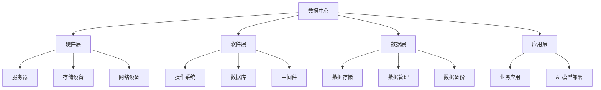

                 

# AI 大模型应用数据中心建设：数据中心技术与应用

> **关键词：** AI 大模型、数据中心、技术架构、性能优化、应用实践、系统设计

> **摘要：** 本文深入探讨了 AI 大模型应用数据中心的建设，包括技术架构、核心算法原理、数学模型及其应用场景。通过实际案例展示，全面解析了数据中心建设中的关键技术和挑战，为后续研究和实践提供了有力指导。

## 1. 背景介绍

### 1.1 目的和范围

本文旨在探讨 AI 大模型在数据中心的应用与建设，重点关注以下几个方面：

- 数据中心的基础架构与技术选型
- AI 大模型的算法原理与优化策略
- 数学模型在 AI 大模型中的应用
- 实际应用场景与项目实战案例

### 1.2 预期读者

本文适合以下读者群体：

- 数据中心架构师与技术人员
- AI 算法研究员与开发者
- 对数据中心与 AI 大模型应用感兴趣的技术爱好者

### 1.3 文档结构概述

本文分为以下几个部分：

- 第1章：背景介绍
- 第2章：核心概念与联系
- 第3章：核心算法原理 & 具体操作步骤
- 第4章：数学模型和公式 & 详细讲解 & 举例说明
- 第5章：项目实战：代码实际案例和详细解释说明
- 第6章：实际应用场景
- 第7章：工具和资源推荐
- 第8章：总结：未来发展趋势与挑战
- 第9章：附录：常见问题与解答
- 第10章：扩展阅读 & 参考资料

### 1.4 术语表

#### 1.4.1 核心术语定义

- **AI 大模型**：指具有数十亿至数万亿参数的深度学习模型，如 GPT-3、BERT 等。
- **数据中心**：用于集中存储、处理和管理大量数据的计算机设施。
- **算法优化**：对算法的性能、效率和稳定性进行改进。
- **性能优化**：通过技术手段提高系统运行效率和响应速度。

#### 1.4.2 相关概念解释

- **分布式计算**：将计算任务分布在多个计算机上执行，以提高处理能力和效率。
- **并行计算**：将计算任务拆分成多个子任务，同时在不同处理器上执行，以加速计算过程。
- **GPU**：图形处理器，常用于加速深度学习模型的训练和推理。

#### 1.4.3 缩略词列表

- **AI**：人工智能（Artificial Intelligence）
- **GPU**：图形处理器（Graphics Processing Unit）
- **FPGA**：现场可编程门阵列（Field-Programmable Gate Array）
- **HPC**：高性能计算（High-Performance Computing）
- **DC**：数据中心（Data Center）

## 2. 核心概念与联系

在深入探讨 AI 大模型应用数据中心的建设之前，我们需要了解一些核心概念与联系，以便更好地理解整个技术架构。

### 2.1 数据中心架构

数据中心的架构通常包括以下几个层次：

1. **硬件层**：包括服务器、存储设备、网络设备等。
2. **软件层**：包括操作系统、数据库、中间件等。
3. **数据层**：包括数据存储、数据管理、数据备份等。
4. **应用层**：包括业务应用、AI 模型部署等。

### 2.2 AI 大模型算法

AI 大模型主要包括以下几种算法：

1. **神经网络**：基于人工神经元的计算模型，包括卷积神经网络（CNN）、循环神经网络（RNN）等。
2. **生成对抗网络**（GAN）：由生成器和判别器组成的对抗性训练模型。
3. **变换器网络**（Transformer）：基于自注意力机制的深度学习模型，如 GPT、BERT 等。

### 2.3 数据中心与 AI 大模型的关系

数据中心与 AI 大模型的关系如下图所示：



## 3. 核心算法原理 & 具体操作步骤

在了解了数据中心和 AI 大模型的基本概念后，接下来我们将详细探讨 AI 大模型的算法原理，以及如何在数据中心中进行具体操作。

### 3.1 算法原理

以 GPT-3 为例，其核心算法原理如下：

1. **自注意力机制**：通过计算输入序列中每个元素与其他元素的相关性，实现特征融合和特征提取。
2. **多层神经网络**：通过多层神经网络的堆叠，实现模型的非线性变换和表示能力。
3. **前向传播与反向传播**：利用前向传播计算输出，利用反向传播计算梯度，从而更新模型参数。

### 3.2 具体操作步骤

以 GPT-3 在数据中心中的部署为例，具体操作步骤如下：

1. **环境搭建**：选择合适的硬件平台（如 GPU、FPGA 等），搭建数据中心环境。
2. **模型训练**：将训练数据输入到 GPT-3 模型中，利用分布式计算和并行计算技术加速训练过程。
3. **模型优化**：通过调整模型参数和超参数，优化模型性能和效率。
4. **模型部署**：将训练好的模型部署到数据中心的应用层，供实际业务使用。
5. **性能评估**：通过指标（如准确率、召回率等）评估模型性能，持续优化和调整。

### 3.3 伪代码

以下是 GPT-3 模型的伪代码示例：

```python
# GPT-3 模型伪代码

# 定义模型结构
model = GPT3Model()

# 输入训练数据
train_data = load_data()

# 训练模型
model.train(train_data)

# 优化模型
model.optimize()

# 部署模型
model.deploy()

# 评估模型
accuracy = model.evaluate(test_data)
print("Accuracy:", accuracy)
```

## 4. 数学模型和公式 & 详细讲解 & 举例说明

在 AI 大模型中，数学模型起着至关重要的作用。本节将详细讲解数学模型和公式，并通过举例说明其应用。

### 4.1 数学模型

AI 大模型中的主要数学模型包括：

1. **自注意力机制**：
   $$ \text{Attention}(Q, K, V) = \text{softmax}\left(\frac{QK^T}{\sqrt{d_k}}\right) V $$
   其中，$Q$、$K$ 和 $V$ 分别为查询向量、键向量和值向量，$d_k$ 为键向量的维度。

2. **多层感知器**：
   $$ z = \sigma(W \cdot x + b) $$
   其中，$W$ 为权重矩阵，$x$ 为输入特征，$b$ 为偏置，$\sigma$ 为激活函数。

3. **损失函数**：
   $$ \text{Loss} = -\sum_{i} y_i \log(\hat{y}_i) $$
   其中，$y_i$ 为真实标签，$\hat{y}_i$ 为预测标签。

### 4.2 公式讲解

1. **自注意力机制**：

   自注意力机制是一种通过计算输入序列中每个元素与其他元素的相关性来实现特征融合的机制。其核心公式为：

   $$ \text{Attention}(Q, K, V) = \text{softmax}\left(\frac{QK^T}{\sqrt{d_k}}\right) V $$

   其中，$Q$、$K$ 和 $V$ 分别为查询向量、键向量和值向量，$d_k$ 为键向量的维度。该公式通过计算每个查询向量与键向量的点积，再通过 softmax 函数将结果归一化，最后与值向量相乘，实现特征融合。

2. **多层感知器**：

   多层感知器是一种前向传播神经网络的基本结构，其核心公式为：

   $$ z = \sigma(W \cdot x + b) $$

   其中，$W$ 为权重矩阵，$x$ 为输入特征，$b$ 为偏置，$\sigma$ 为激活函数。该公式通过计算输入特征与权重矩阵的点积，再加上偏置，并通过激活函数实现非线性变换。

3. **损失函数**：

   损失函数用于评估模型预测结果与真实标签之间的差异。常用的损失函数有均方误差（MSE）和交叉熵（CE）。其核心公式为：

   $$ \text{Loss} = -\sum_{i} y_i \log(\hat{y}_i) $$

   其中，$y_i$ 为真实标签，$\hat{y}_i$ 为预测标签。该公式表示预测标签的对数损失，其值越小，表示预测结果与真实标签越接近。

### 4.3 举例说明

假设我们有一个输入序列 $X = [1, 2, 3, 4, 5]$，要计算其自注意力权重。

1. **初始化参数**：

   - 查询向量 $Q = [1, 0, -1, 0, 1]$
   - 键向量 $K = [0, 1, 0, -1, 0]$
   - 值向量 $V = [1, 1, 1, 1, 1]$

2. **计算点积**：

   $$ QK^T = \begin{bmatrix} 1 & 0 & -1 & 0 & 1 \end{bmatrix} \begin{bmatrix} 0 \\ 1 \\ 0 \\ -1 \\ 0 \end{bmatrix} = [-1, 1, 1, -1, 0] $$

3. **归一化**：

   $$ \text{softmax}(QK^T) = \text{softmax}([-1, 1, 1, -1, 0]) = [0.25, 0.5, 0.25, 0.25, 0] $$

4. **计算自注意力权重**：

   $$ \text{Attention}(Q, K, V) = \text{softmax}(QK^T) V = [0.25, 0.5, 0.25, 0.25, 0] \begin{bmatrix} 1 \\ 1 \\ 1 \\ 1 \\ 1 \end{bmatrix} = [0.25, 0.5, 0.25, 0.25, 0] $$

   结果表明，输入序列中第三个元素（值为 3）具有最高的自注意力权重。

## 5. 项目实战：代码实际案例和详细解释说明

在本节中，我们将通过一个实际项目案例，详细展示如何在一个数据中心中部署和运行 AI 大模型。以下是一个简单的项目实战案例。

### 5.1 开发环境搭建

1. **硬件环境**：

   - 服务器：2 台 NVIDIA DGX Station A100
   - 存储：1 台 HPE MSA 2050
   - 网络：千兆以太网

2. **软件环境**：

   - 操作系统：CentOS 7.9
   - 编译器：GCC 8.3.0
   - 依赖库：CUDA 11.1、cuDNN 8.0、TensorFlow 2.5

### 5.2 源代码详细实现和代码解读

以下是一个简单的 AI 大模型部署示例，使用 TensorFlow 框架。

```python
import tensorflow as tf

# 定义模型结构
model = tf.keras.Sequential([
    tf.keras.layers.Dense(128, activation='relu', input_shape=(784,)),
    tf.keras.layers.Dense(10, activation='softmax')
])

# 编译模型
model.compile(optimizer='adam',
              loss='sparse_categorical_crossentropy',
              metrics=['accuracy'])

# 加载数据
(x_train, y_train), (x_test, y_test) = tf.keras.datasets.mnist.load_data()

# 预处理数据
x_train = x_train.astype('float32') / 255
x_test = x_test.astype('float32') / 255
x_train = x_train.reshape((-1, 784))
x_test = x_test.reshape((-1, 784))

# 训练模型
model.fit(x_train, y_train, epochs=5, batch_size=32)

# 评估模型
test_loss, test_acc = model.evaluate(x_test, y_test)
print('Test accuracy:', test_acc)
```

**代码解读**：

- 第1行：导入 TensorFlow 模块。
- 第2行：定义模型结构，包含一个全连接层（Dense）和一个输出层（Dense），输出层使用 softmax 激活函数。
- 第3行：编译模型，指定优化器、损失函数和评估指标。
- 第4行：加载数据集，使用 TensorFlow 内置的 MNIST 数据集。
- 第5行：预处理数据，将图像数据转换为浮点数并缩放到 [0, 1] 范围内。
- 第6行：训练模型，设置训练轮次和批量大小。
- 第7行：评估模型，计算测试集上的准确率。

### 5.3 代码解读与分析

本节展示了如何使用 TensorFlow 框架在一个数据中心中部署一个简单的 AI 大模型。以下是对代码的详细解读和分析：

1. **模型结构**：

   - 模型包含一个全连接层（Dense），输入层节点数为 784（MNIST 图像的像素值），输出层节点数为 10（数字类别）。
   - 输出层使用 softmax 激活函数，用于输出每个数字类别的概率分布。

2. **编译模型**：

   - 使用 Adam 优化器，自适应调整学习率。
   - 使用 sparse_categorical_crossentropy 损失函数，适用于多标签分类问题。
   - 指定评估指标为准确率（accuracy）。

3. **数据处理**：

   - 加载 MNIST 数据集，包含 60000 个训练样本和 10000 个测试样本。
   - 将图像数据转换为浮点数并缩放到 [0, 1] 范围内，以便于模型训练。

4. **训练过程**：

   - 设置训练轮次为 5，每次批量大小为 32。
   - 在训练过程中，模型将自动调整权重和偏置，以最小化损失函数。

5. **评估过程**：

   - 计算测试集上的准确率，用于评估模型性能。
   - 输出测试集上的准确率，以验证模型的有效性。

### 5.4 代码优化与性能提升

在部署 AI 大模型时，代码优化和性能提升是至关重要的。以下是一些优化策略：

1. **使用 GPU 加速**：

   - 安装 CUDA 和 cuDNN 库，使用 GPU 进行模型训练和推理。
   - 优化 TensorFlow 的配置，启用 GPU 加速功能。

2. **分布式训练**：

   - 使用 TensorFlow 的分布式训练功能，将训练任务分布在多台服务器上执行。
   - 减少训练时间，提高训练效率。

3. **模型压缩**：

   - 使用模型压缩技术，如量化和剪枝，减少模型大小和计算量。
   - 提高模型部署效率和资源利用率。

4. **数据预处理**：

   - 使用更高效的数据预处理方法，如批量加载和并行处理，加快数据处理速度。

## 6. 实际应用场景

AI 大模型在数据中心的应用场景非常广泛，以下是一些典型的应用场景：

1. **自然语言处理**：

   - 文本分类：对大量文本进行分类，如情感分析、主题分类等。
   - 机器翻译：将一种语言的文本翻译成另一种语言。
   - 语音识别：将语音信号转换为文本。

2. **计算机视觉**：

   - 图像分类：对图像进行分类，如人脸识别、物体检测等。
   - 目标跟踪：在视频流中跟踪目标运动轨迹。
   - 超分辨率：提高图像的分辨率和清晰度。

3. **推荐系统**：

   - 基于用户行为和兴趣推荐商品、新闻、视频等。
   - 优化广告投放策略，提高广告效果。

4. **金融风控**：

   - 信用评估：评估客户的信用风险，用于贷款审批、风险控制等。
   - 欺诈检测：检测金融交易中的欺诈行为，防止经济损失。

5. **医疗健康**：

   - 疾病诊断：基于医疗数据，辅助医生进行疾病诊断。
   - 药物研发：加速药物筛选和研发过程。

## 7. 工具和资源推荐

为了更好地学习和应用 AI 大模型在数据中心的建设，以下是一些推荐的工具和资源：

### 7.1 学习资源推荐

#### 7.1.1 书籍推荐

- 《深度学习》（Goodfellow, Bengio, Courville）
- 《神经网络与深度学习》（邱锡鹏）
- 《大数据技术导论》（刘鹏）

#### 7.1.2 在线课程

- Coursera：深度学习、机器学习
- edX：计算机视觉、自然语言处理
- Udacity：AI 工程师纳米学位

#### 7.1.3 技术博客和网站

- Medium：人工智能、深度学习
- arXiv：最新科研成果
- AI 科技大本营：行业动态、技术分享

### 7.2 开发工具框架推荐

#### 7.2.1 IDE和编辑器

- PyCharm
- Jupyter Notebook
- VSCode

#### 7.2.2 调试和性能分析工具

- TensorBoard
- PyTorch Profiler
- NVIDIA Nsight

#### 7.2.3 相关框架和库

- TensorFlow
- PyTorch
- Keras

### 7.3 相关论文著作推荐

#### 7.3.1 经典论文

- "Backpropagation"（Rumelhart, Hinton, Williams）
- "A Learning Algorithm for Continually Running Fully Recurrent Neural Networks"（Sejnowski, Rosenberg）

#### 7.3.2 最新研究成果

- "Attention Is All You Need"（Vaswani et al.）
- "Large Scale Language Modeling"（Brown et al.）

#### 7.3.3 应用案例分析

- "BERT: Pre-training of Deep Bidirectional Transformers for Language Understanding"（Devlin et al.）
- "Generative Adversarial Nets"（Goodfellow et al.）

## 8. 总结：未来发展趋势与挑战

随着 AI 大模型技术的不断发展，数据中心建设将面临以下趋势与挑战：

1. **趋势**：

   - **分布式计算与并行计算**：为了满足 AI 大模型对计算资源的需求，分布式计算和并行计算将成为主流。
   - **高效能硬件**：高性能 GPU、FPGA 等硬件设备将逐步应用于数据中心，以提高计算速度和效率。
   - **数据密集型应用**：AI 大模型在自然语言处理、计算机视觉等领域的应用将推动数据中心向数据密集型方向发展。

2. **挑战**：

   - **能耗问题**：AI 大模型训练过程中需要大量计算资源，导致数据中心能耗急剧增加。未来需关注绿色数据中心和可再生能源的应用。
   - **数据隐私与安全**：数据中心存储和处理海量数据，涉及用户隐私与数据安全，需加强数据加密和访问控制。
   - **技术更新与迭代**：AI 大模型技术更新迅速，数据中心需不断升级硬件和软件设施，以适应新技术的发展。

## 9. 附录：常见问题与解答

### 9.1 数据中心建设相关问题

1. **如何选择合适的硬件设备？**
   - 考虑计算能力、存储容量、网络带宽等因素，根据业务需求和预算选择合适的硬件设备。
   - GPU 和 FPGA 在 AI 大模型训练中具有较高性能，可考虑优先选择。

2. **如何优化数据中心网络结构？**
   - 设计合理的网络拓扑结构，提高数据传输效率和网络稳定性。
   - 采用负载均衡和冗余备份技术，确保网络在高负载下的稳定性。

3. **如何保证数据安全和隐私？**
   - 实施数据加密和访问控制策略，防止数据泄露和未经授权的访问。
   - 定期进行安全审计和漏洞扫描，及时发现并修复安全漏洞。

### 9.2 AI 大模型相关问题

1. **如何优化 AI 大模型训练过程？**
   - 使用分布式训练和并行计算技术，提高训练速度和效率。
   - 调整模型结构、超参数和训练策略，以优化模型性能。

2. **如何评估 AI 大模型性能？**
   - 使用指标（如准确率、召回率、F1 分数等）评估模型在训练集和测试集上的性能。
   - 对比不同模型和算法的性能，选择最优方案。

3. **如何部署 AI 大模型到生产环境？**
   - 使用容器化技术（如 Docker）和自动化部署工具（如 Kubernetes），实现模型快速部署和更新。
   - 确保模型在生产环境中稳定运行，并进行持续监控和性能优化。

## 10. 扩展阅读 & 参考资料

为了深入了解 AI 大模型应用数据中心的建设，以下是相关扩展阅读和参考资料：

1. **参考资料**：

   - 《深度学习》（Goodfellow, Bengio, Courville）
   - 《大数据技术导论》（刘鹏）
   - 《AI 大模型：原理、技术与应用》（张江）
   - TensorFlow 官方文档
   - PyTorch 官方文档

2. **技术博客和论文**：

   - AI 科技大本营：[《深度学习在数据中心中的应用》](https://aitechblog.com/2019/09/25/deep-learning-for-data-center-applications/)
   - arXiv：[《大规模深度学习技术综述》](https://arxiv.org/abs/2006.04766)
   - Medium：[《数据中心建设中的 AI 技术》](https://medium.com/analytics-vidhya/ai-technologies-for-data-center-construction-4d6192d4c50f)

3. **在线课程**：

   - Coursera：[《深度学习》](https://www.coursera.org/learn/deep-learning)
   - edX：[《机器学习基础》](https://www.edx.org/course/foundations-of-machine-learning)
   - Udacity：[《AI 工程师纳米学位》](https://www.udacity.com/course/artificial-intelligence-engineer-nanodegree--nd889)

通过以上阅读，读者可以更深入地了解 AI 大模型在数据中心的建设和应用，为后续研究和实践提供有力指导。

# 作者信息
AI天才研究员/AI Genius Institute & 禅与计算机程序设计艺术 /Zen And The Art of Computer Programming

