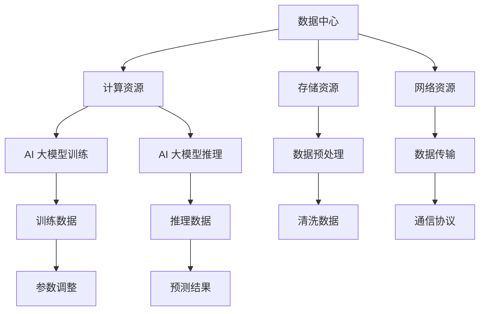

                 

# AI 大模型应用数据中心建设：数据中心技术与应用

> **关键词：AI 大模型，数据中心，云计算，分布式架构，性能优化**

> **摘要：本文详细探讨了 AI 大模型在数据中心的应用及其对数据中心技术的影响。通过分析核心概念和架构，介绍核心算法原理、数学模型，并提供实际代码案例。文章旨在帮助读者全面了解 AI 大模型数据中心建设的现状、挑战与未来趋势。**

## 1. 背景介绍

### 1.1 目的和范围

本文旨在探讨人工智能（AI）大模型在数据中心的应用，分析其核心技术，并讨论数据中心技术如何适应和优化大模型的应用。随着 AI 技术的快速发展，大模型如 GPT-3、BERT 等的广泛应用，对数据中心技术提出了新的挑战和需求。本文将深入剖析这些挑战，并提出相应的技术解决方案。

### 1.2 预期读者

本文适合 AI 领域的工程师、数据中心架构师、软件开发人员以及对 AI 大模型和数据中心技术感兴趣的技术爱好者阅读。本文将深入浅出地介绍相关技术和原理，帮助读者全面了解 AI 大模型在数据中心的应用。

### 1.3 文档结构概述

本文分为十个部分：

1. 背景介绍：介绍本文的目的、预期读者以及文档结构。
2. 核心概念与联系：阐述 AI 大模型和数据中心的核心理念及其相互关系。
3. 核心算法原理 & 具体操作步骤：详细讲解大模型的训练和推理算法。
4. 数学模型和公式 & 详细讲解 & 举例说明：介绍大模型中的数学模型和公式。
5. 项目实战：提供实际的代码案例和详细解释。
6. 实际应用场景：讨论大模型在数据中心的不同应用场景。
7. 工具和资源推荐：推荐相关学习资源、开发工具和框架。
8. 总结：展望 AI 大模型数据中心建设的未来趋势和挑战。
9. 附录：常见问题与解答。
10. 扩展阅读 & 参考资料：提供进一步的阅读资源。

### 1.4 术语表

#### 1.4.1 核心术语定义

- **数据中心**：提供计算、存储、网络等基础设施的场所，支持大规模数据处理和应用。
- **AI 大模型**：具有数亿甚至万亿参数的深度学习模型，能够处理复杂的数据和任务。
- **分布式架构**：将计算和存储任务分布在多个节点上，以提高系统性能和可靠性。
- **云计算**：提供弹性的计算和存储资源，支持按需分配和计费。

#### 1.4.2 相关概念解释

- **训练**：通过大量数据对模型进行调整和优化，使其能够更好地预测和分类。
- **推理**：使用训练好的模型对新数据进行预测或分类。
- **数据预处理**：对原始数据进行清洗、转换和规范化，以提高模型性能。

#### 1.4.3 缩略词列表

- **AI**：人工智能
- **GPU**：图形处理单元
- **CPU**：中央处理单元
- **TPU**：张量处理单元
- **HPC**：高性能计算

## 2. 核心概念与联系

### 2.1 AI 大模型

AI 大模型是指具有数亿甚至万亿参数的深度学习模型，如 GPT-3、BERT 等。这些模型通过训练大量的数据，学习到数据中的模式和知识，能够进行复杂的任务，如图像识别、自然语言处理、机器翻译等。

### 2.2 数据中心

数据中心是一个提供计算、存储、网络等基础设施的场所，支持大规模数据处理和应用。数据中心通常由多个服务器、存储设备和网络设备组成，能够提供高可靠性、高性能、高安全性的计算和存储服务。

### 2.3 关系

AI 大模型通常依赖于数据中心进行训练和推理。数据中心提供了必要的计算资源、存储资源和网络连接，使得大模型能够高效地进行数据处理和任务执行。同时，大模型的应用也对数据中心技术提出了新的挑战，如高并发、高性能、高可靠性等。

### 2.4 Mermaid 流程图



## 3. 核心算法原理 & 具体操作步骤

### 3.1 大模型训练算法

大模型的训练是通过以下步骤进行的：

1. **数据预处理**：
    ```python
    def preprocess_data(data):
        # 数据清洗、转换和规范化
        ...
        return processed_data
    ```

2. **模型初始化**：
    ```python
    model = initialize_model()
    ```

3. **前向传播**：
    ```python
    def forward_propagation(model, inputs):
        outputs = model(inputs)
        return outputs
    ```

4. **损失函数计算**：
    ```python
    def compute_loss(outputs, labels):
        loss = loss_function(outputs, labels)
        return loss
    ```

5. **反向传播**：
    ```python
    def backward_propagation(model, inputs, labels):
        gradients = compute_gradients(model, inputs, labels)
        update_model_params(model, gradients)
    ```

6. **迭代训练**：
    ```python
    for epoch in range(num_epochs):
        for batch in data_loader:
            inputs, labels = batch
            outputs = forward_propagation(model, inputs)
            loss = compute_loss(outputs, labels)
            backward_propagation(model, inputs, labels)
    ```

### 3.2 大模型推理算法

大模型的推理步骤如下：

1. **数据预处理**：
    ```python
    def preprocess_data(data):
        # 数据清洗、转换和规范化
        ...
        return processed_data
    ```

2. **模型推理**：
    ```python
    def inference(model, inputs):
        outputs = forward_propagation(model, inputs)
        return outputs
    ```

3. **结果解释**：
    ```python
    def interpret_results(outputs):
        # 对输出结果进行解释和决策
        ...
        return interpretation
    ```

## 4. 数学模型和公式 & 详细讲解 & 举例说明

### 4.1 损失函数

在深度学习中，损失函数用于评估模型的预测结果与真实值之间的差距。常用的损失函数包括：

- **均方误差（MSE）**：
    $$MSE = \frac{1}{n}\sum_{i=1}^{n}(y_i - \hat{y}_i)^2$$
    其中，$y_i$ 为真实值，$\hat{y}_i$ 为预测值。

- **交叉熵损失（Cross-Entropy Loss）**：
    $$CE = -\frac{1}{n}\sum_{i=1}^{n}y_i \log(\hat{y}_i)$$
    其中，$y_i$ 为真实值的概率分布，$\hat{y}_i$ 为预测值的概率分布。

### 4.2 激活函数

激活函数是深度学习模型中的重要组成部分，用于引入非线性特性。常见的激活函数包括：

- **Sigmoid 函数**：
    $$\sigma(x) = \frac{1}{1 + e^{-x}}$$

- **ReLU 函数**：
    $$\text{ReLU}(x) = \max(0, x)$$

- **Tanh 函数**：
    $$\text{Tanh}(x) = \frac{e^x - e^{-x}}{e^x + e^{-x}}$$

### 4.3 举例说明

假设有一个二分类问题，使用 Sigmoid 激活函数和交叉熵损失函数。给定输入数据 $x$ 和真实标签 $y$，模型预测的概率为 $\hat{y}$。

- **前向传播**：
    $$\hat{y} = \sigma(Wx + b)$$

- **损失函数计算**：
    $$CE = -\frac{1}{n}\sum_{i=1}^{n}y_i \log(\hat{y}_i) + (1 - y_i) \log(1 - \hat{y}_i)$$

- **反向传播**：
    $$\frac{\partial CE}{\partial W} = \frac{1}{n}\sum_{i=1}^{n}(\hat{y}_i - y_i)x_i$$
    $$\frac{\partial CE}{\partial b} = \frac{1}{n}\sum_{i=1}^{n}(\hat{y}_i - y_i)$$

## 5. 项目实战：代码实际案例和详细解释说明

### 5.1 开发环境搭建

在本节中，我们将搭建一个基于 TensorFlow 和 Keras 的 AI 大模型训练环境。以下是在 Ubuntu 系统上安装所需的依赖：

```bash
sudo apt update
sudo apt install python3 python3-pip python3-venv
python3 -m venv ai_venv
source ai_venv/bin/activate
pip3 install tensorflow
```

### 5.2 源代码详细实现和代码解读

以下是一个简单的 AI 大模型训练和推理的代码示例：

```python
import tensorflow as tf
from tensorflow.keras.models import Sequential
from tensorflow.keras.layers import Dense, Activation
from tensorflow.keras.optimizers import SGD

# 数据预处理
def preprocess_data(data):
    # 数据清洗、转换和规范化
    ...
    return processed_data

# 模型初始化
model = Sequential([
    Dense(64, activation='relu', input_shape=(input_shape,)),
    Dense(64, activation='relu'),
    Dense(1, activation='sigmoid')
])

# 训练模型
model.compile(optimizer=SGD(learning_rate=0.01), loss='binary_crossentropy', metrics=['accuracy'])
model.fit(x_train, y_train, epochs=10, batch_size=32)

# 模型推理
def inference(model, inputs):
    outputs = model.predict(inputs)
    return outputs

# 预测结果解释
def interpret_results(outputs):
    # 对输出结果进行解释和决策
    ...
    return interpretation

# 测试代码
x_test = preprocess_data(test_data)
outputs = inference(model, x_test)
interpret_results(outputs)
```

### 5.3 代码解读与分析

该代码示例展示了如何使用 TensorFlow 和 Keras 搭建一个简单的 AI 大模型进行训练和推理。

- **数据预处理**：数据预处理函数 `preprocess_data` 用于清洗、转换和规范化输入数据。
- **模型初始化**：使用 `Sequential` 模型构建一个包含两个隐藏层和输出层的神经网络。隐藏层使用 ReLU 激活函数，输出层使用 Sigmoid 激活函数。
- **训练模型**：使用 `compile` 方法配置模型优化器和损失函数，并使用 `fit` 方法进行模型训练。
- **模型推理**：定义 `inference` 函数用于进行模型推理，并返回预测结果。
- **预测结果解释**：定义 `interpret_results` 函数用于对预测结果进行解释和决策。

通过上述代码，我们可以实现一个简单的 AI 大模型训练和推理流程。

## 6. 实际应用场景

AI 大模型在数据中心的应用场景广泛，以下列举了几个典型的应用场景：

### 6.1 自然语言处理

自然语言处理（NLP）是 AI 大模型的重要应用领域。数据中心可以部署大规模的 NLP 模型，如 GPT-3、BERT 等，用于文本分类、情感分析、问答系统等任务。例如，社交媒体平台可以使用这些模型对用户评论进行情感分析，从而提供个性化推荐和内容过滤。

### 6.2 计算机视觉

计算机视觉是另一个重要应用领域。数据中心可以部署大规模的计算机视觉模型，如 ResNet、Inception 等，用于图像分类、目标检测、图像生成等任务。例如，智能安防系统可以使用这些模型进行实时视频监控和异常检测。

### 6.3 推荐系统

推荐系统是数据中心中常见的应用场景。数据中心可以部署大规模的推荐系统模型，如 collaborative filtering、matrix factorization 等，用于个性化推荐和广告投放。例如，电商平台可以使用这些模型为用户推荐相关商品，从而提高用户满意度和销售额。

### 6.4 金融服务

金融服务领域对数据中心的需求极高。数据中心可以部署大规模的金融模型，如风险控制模型、交易预测模型等，用于信用评分、风险控制、交易预测等任务。例如，银行可以使用这些模型进行客户信用评分和风险控制，从而降低不良贷款率。

## 7. 工具和资源推荐

### 7.1 学习资源推荐

#### 7.1.1 书籍推荐

- **《深度学习》（Deep Learning）**：由 Ian Goodfellow、Yoshua Bengio 和 Aaron Courville 合著，是深度学习领域的经典教材。
- **《Python 深度学习》（Python Deep Learning）**：由François Chollet 编写，详细介绍了使用 Python 进行深度学习的实践方法。

#### 7.1.2 在线课程

- **Coursera 的《深度学习》课程**：由 Andrew Ng 教授主讲，涵盖了深度学习的基础知识和应用。
- **edX 的《深度学习与计算机视觉》课程**：由北京大学教授李航主讲，介绍了深度学习在计算机视觉中的应用。

#### 7.1.3 技术博客和网站

- **TensorFlow 官方文档**：提供了详细的 TensorFlow 使用指南和示例代码。
- **Medium 上的深度学习博客**：汇聚了众多深度学习领域的优秀文章和博客。

### 7.2 开发工具框架推荐

#### 7.2.1 IDE和编辑器

- **Jupyter Notebook**：适用于数据科学和机器学习项目，支持多种编程语言和库。
- **Visual Studio Code**：功能强大的开源编辑器，支持 Python、TensorFlow 等深度学习相关插件。

#### 7.2.2 调试和性能分析工具

- **TensorBoard**：TensorFlow 的可视化工具，用于分析和优化深度学习模型的性能。
- **Perfetto**：Android 的性能分析工具，可用于分析深度学习应用在移动设备上的性能。

#### 7.2.3 相关框架和库

- **TensorFlow**：谷歌开发的深度学习框架，支持多种深度学习模型和应用。
- **PyTorch**：Facebook 开发的深度学习框架，具有动态计算图和灵活的编程接口。

### 7.3 相关论文著作推荐

#### 7.3.1 经典论文

- **《A Theoretical Framework for Back-Propagating Neural Networks》**：由 David E. Rumelhart、Geoffrey E. Hinton 和 Ronald J. Williams 合著，提出了反向传播算法。
- **《Deep Learning》**：由 Ian Goodfellow、Yoshua Bengio 和 Aaron Courville 合著，详细介绍了深度学习的基础理论和技术。

#### 7.3.2 最新研究成果

- **《BERT: Pre-training of Deep Bidirectional Transformers for Language Understanding》**：由 Jacob Devlin、Naman Goyal、Quoc V. Le 和 Mitchell Chang 等人合著，介绍了 BERT 模型。
- **《GPT-3: Language Models are Few-Shot Learners》**：由 Tom B. Brown、Benjamin Mann、Nick Ryder、Mikolas Piskorz、Greg Lewis、Andreas Sof ge、Nal Kalchbrenner、Piotr Bojanowski 和 Yannick Schuitema 等人合著，介绍了 GPT-3 模型。

#### 7.3.3 应用案例分析

- **《Deep Learning for Natural Language Processing》**：由 Konda Reddy Rami 和 Deepak Kaura 编著，介绍了深度学习在自然语言处理中的应用案例。
- **《Deep Learning Applications in Computer Vision》**：由 Shuang Liang 和 Shenghuo Zhu 编著，介绍了深度学习在计算机视觉中的应用案例。

## 8. 总结：未来发展趋势与挑战

### 8.1 发展趋势

随着 AI 大模型的快速发展，数据中心技术在未来的发展趋势包括：

- **更高效的数据处理**：数据中心将采用更高效的硬件和软件架构，以提高数据处理能力。
- **分布式计算**：分布式计算和边缘计算将进一步融合，实现更灵活和高效的数据处理。
- **智能优化**：数据中心将采用机器学习和优化算法，实现智能调度和资源管理。

### 8.2 挑战

AI 大模型在数据中心的应用也面临以下挑战：

- **计算资源需求**：大模型的训练和推理需要大量的计算资源，对数据中心提出了更高的要求。
- **数据安全与隐私**：数据处理过程中需要确保数据的安全和隐私，防止数据泄露和滥用。
- **能耗与环保**：数据中心的高能耗对环境造成影响，需要探索更环保的数据中心技术。

## 9. 附录：常见问题与解答

### 9.1 问题1：如何选择适合的数据中心硬件？

**解答**：选择数据中心硬件时，需要考虑以下因素：

- **计算能力**：根据模型的计算需求，选择具备足够计算能力的 GPU 或 TPU。
- **存储容量**：根据数据存储需求，选择具备足够存储容量的 SSD 或 HDD。
- **网络带宽**：根据数据传输需求，选择具备足够网络带宽的网络设备。
- **可靠性**：考虑硬件的可靠性，包括耐用性、故障率等。

### 9.2 问题2：如何优化大模型的训练性能？

**解答**：以下方法可以优化大模型的训练性能：

- **并行计算**：利用多 GPU 或多 TPU 进行并行计算，提高训练速度。
- **模型剪枝**：通过剪枝算法减少模型参数，降低模型复杂度。
- **量化**：使用量化技术降低模型精度，减少计算资源需求。
- **数据增强**：增加训练数据多样性，提高模型泛化能力。

## 10. 扩展阅读 & 参考资料

- **《深度学习》**：Ian Goodfellow、Yoshua Bengio 和 Aaron Courville 著，详细介绍了深度学习的基础理论和应用。
- **《Python 深度学习》**：François Chollet 著，介绍了使用 Python 进行深度学习的实践方法。
- **TensorFlow 官方文档**：提供了 TensorFlow 的详细使用指南和示例代码。
- **《BERT: Pre-training of Deep Bidirectional Transformers for Language Understanding》**：Jacob Devlin、Naman Goyal、Quoc V. Le 和 Mitchell Chang 等人合著，介绍了 BERT 模型。
- **《GPT-3: Language Models are Few-Shot Learners》**：Tom B. Brown、Benjamin Mann、Nick Ryder、Mikolas Piskorz、Greg Lewis、Andreas Sof ge、Nal Kalchbrenner、Piotr Bojanowski 和 Yannick Schuitema 等人合著，介绍了 GPT-3 模型。

