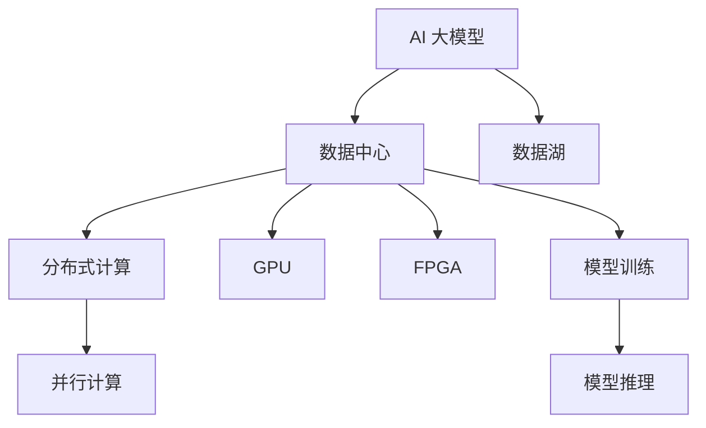

                 

# AI 大模型应用数据中心建设：数据中心技术与应用

> **关键词：AI 大模型、数据中心建设、技术架构、核心算法、数学模型、项目实战**
> 
> **摘要：本文旨在探讨 AI 大模型在数据中心建设中的应用，从技术架构、核心算法、数学模型到实际项目实战，为读者提供一个全面的技术解决方案。通过对大模型数据中心的建设原理、实现步骤和实际应用场景的详细剖析，帮助读者深入了解 AI 大模型数据中心的技术要点和未来发展趋势。**

## 1. 背景介绍

### 1.1 目的和范围

本文的主要目的是深入探讨 AI 大模型在数据中心建设中的应用，包括技术架构、核心算法、数学模型等方面。本文将针对以下问题进行探讨：

- **技术架构**：数据中心的基础设施如何支持 AI 大模型的应用？
- **核心算法**：AI 大模型的训练和推理算法如何实现高效？
- **数学模型**：大模型所需的数学模型及其推导过程是什么？
- **项目实战**：如何将 AI 大模型应用于实际数据中心项目？

### 1.2 预期读者

本文的预期读者主要包括以下几类：

- 数据中心工程师和架构师
- AI 研究人员和开发者
- 对 AI 大模型和数据中心建设感兴趣的技术爱好者
- 高等院校计算机科学专业的师生

### 1.3 文档结构概述

本文将分为以下几个部分：

- **1. 背景介绍**：介绍本文的目的、预期读者和文档结构。
- **2. 核心概念与联系**：介绍 AI 大模型数据中心的关键概念及其相互关系。
- **3. 核心算法原理 & 具体操作步骤**：讲解大模型的核心算法原理和具体操作步骤。
- **4. 数学模型和公式 & 详细讲解 & 举例说明**：介绍大模型所需的数学模型和公式，并提供详细讲解和举例说明。
- **5. 项目实战：代码实际案例和详细解释说明**：提供实际项目的代码案例和详细解释。
- **6. 实际应用场景**：分析 AI 大模型在数据中心的不同应用场景。
- **7. 工具和资源推荐**：推荐学习资源和开发工具。
- **8. 总结：未来发展趋势与挑战**：总结本文的核心内容，并探讨未来发展趋势和挑战。
- **9. 附录：常见问题与解答**：解答读者可能遇到的问题。
- **10. 扩展阅读 & 参考资料**：提供进一步阅读的资源。

### 1.4 术语表

#### 1.4.1 核心术语定义

- **AI 大模型**：指具有巨大参数量和复杂结构的神经网络模型，如 GPT、BERT 等。
- **数据中心**：指用于存储、处理和传输大量数据的服务器集群。
- **数据湖**：指存储大量结构化和非结构化数据的数据仓库。
- **模型训练**：指通过大量数据训练神经网络模型的过程。
- **模型推理**：指在给定输入数据的情况下，通过已训练的模型进行预测的过程。

#### 1.4.2 相关概念解释

- **分布式计算**：指将计算任务分布在多个计算机节点上，以实现高性能计算。
- **并行计算**：指在多个处理单元同时执行计算任务。
- **GPU**：指图形处理单元，可用于加速 AI 大模型的训练和推理。
- **FPGA**：指现场可编程门阵列，可用于定制化的硬件加速。

#### 1.4.3 缩略词列表

- **AI**：人工智能（Artificial Intelligence）
- **GPT**：生成预训练网络（Generative Pre-trained Transformer）
- **BERT**：双向编码表示（Bidirectional Encoder Representations from Transformers）
- **GPU**：图形处理单元（Graphics Processing Unit）
- **FPGA**：现场可编程门阵列（Field-Programmable Gate Array）

## 2. 核心概念与联系

在 AI 大模型数据中心的建设中，核心概念包括 AI 大模型、数据中心、数据湖、分布式计算、并行计算等。下面将使用 Mermaid 流程图对这些核心概念及其相互关系进行描述。



### 2.1 AI 大模型

AI 大模型是指具有巨大参数量和复杂结构的神经网络模型，如 GPT、BERT 等。它们通过大量的数据训练，能够进行自动化的知识推理和语言生成。在数据中心中，AI 大模型主要用于模型训练和模型推理。

### 2.2 数据中心

数据中心是用于存储、处理和传输大量数据的服务器集群。它为 AI 大模型提供了计算资源和数据存储空间。数据中心的建设需要考虑以下几个方面：

- **硬件设备**：包括服务器、存储设备、网络设备等。
- **软件系统**：包括操作系统、数据库管理系统、模型训练和推理系统等。
- **网络架构**：包括内部网络和外部网络，用于数据传输和访问。
- **数据备份和容灾**：确保数据的安全和可靠性。

### 2.3 数据湖

数据湖是指用于存储大量结构化和非结构化数据的数据仓库。在数据中心中，数据湖用于存储 AI 大模型训练和推理所需的数据。数据湖的建设需要考虑以下几个方面：

- **数据存储**：包括数据存储方式、数据压缩和数据加密等。
- **数据清洗**：包括数据去重、数据去噪和数据规范化等。
- **数据集成**：包括数据集成策略、数据集成工具和数据集成平台等。

### 2.4 分布式计算

分布式计算是指将计算任务分布在多个计算机节点上，以实现高性能计算。在 AI 大模型数据中心中，分布式计算主要用于模型训练和推理。分布式计算需要考虑以下几个方面：

- **任务调度**：包括任务分配、任务依赖和任务调度算法等。
- **负载均衡**：包括负载均衡策略、负载均衡器和负载均衡算法等。
- **容错机制**：包括容错策略、容错技术和容错算法等。

### 2.5 并行计算

并行计算是指在多个处理单元同时执行计算任务。在 AI 大模型数据中心中，并行计算主要用于模型训练和推理。并行计算需要考虑以下几个方面：

- **并行算法**：包括并行计算模型、并行算法设计和并行算法优化等。
- **并行硬件**：包括 GPU、FPGA、多核处理器等。
- **并行编程**：包括并行编程模型、并行编程语言和并行编程工具等。

## 3. 核心算法原理 & 具体操作步骤

AI 大模型的核心算法主要包括模型训练和模型推理。下面将分别介绍这些算法的原理和具体操作步骤。

### 3.1 模型训练

模型训练是指通过大量数据训练神经网络模型的过程。具体操作步骤如下：

```plaintext
1. 数据预处理：对原始数据进行清洗、归一化和特征提取等操作。
2. 初始化模型参数：随机初始化神经网络模型的权重和偏置。
3. 前向传播：将输入数据通过模型进行前向传播，得到预测输出。
4. 计算损失函数：计算预测输出与真实输出之间的差异，即损失函数。
5. 反向传播：根据损失函数梯度，更新模型参数。
6. 优化算法：使用优化算法（如梯度下降、Adam 等）调整模型参数。
7. 模型评估：在验证集上评估模型性能，调整超参数。
8. 模型保存：将训练好的模型参数保存到文件中。
```

### 3.2 模型推理

模型推理是指在给定输入数据的情况下，通过已训练的模型进行预测的过程。具体操作步骤如下：

```plaintext
1. 加载模型：从文件中加载训练好的模型参数。
2. 数据预处理：对输入数据进行相同的预处理操作。
3. 前向传播：将预处理后的输入数据通过模型进行前向传播，得到预测输出。
4. 输出结果：将预测输出进行处理，得到最终的预测结果。
```

### 3.3 梯度下降算法

梯度下降算法是训练神经网络模型常用的优化算法。具体原理如下：

- **目标函数**：定义一个目标函数（如均方误差、交叉熵等），用于衡量模型预测输出与真实输出之间的差异。
- **梯度计算**：计算目标函数对模型参数的梯度。
- **参数更新**：根据梯度更新模型参数，以减少目标函数的值。
- **迭代过程**：重复以上步骤，直到模型参数收敛。

梯度下降算法的伪代码如下：

```python
while not convergence:
    # 前向传播
    predicted = forward_pass(x)
    # 计算损失
    loss = loss_function(y, predicted)
    # 计算梯度
    gradients = backward_pass(loss)
    # 更新参数
    update_parameters(alpha, gradients)
```

其中，`forward_pass` 是前向传播函数，`backward_pass` 是反向传播函数，`alpha` 是学习率。

## 4. 数学模型和公式 & 详细讲解 & 举例说明

AI 大模型的数学模型主要包括神经网络模型、损失函数和优化算法。下面将分别介绍这些数学模型的公式和详细讲解，并提供举例说明。

### 4.1 神经网络模型

神经网络模型是 AI 大模型的核心组成部分，它由多个神经网络层组成，包括输入层、隐藏层和输出层。下面是神经网络模型的数学公式：

- **输入层**：$x \in \mathbb{R}^{m \times n}$
- **隐藏层**：$a^{(l)} \in \mathbb{R}^{m \times n}$
- **输出层**：$y \in \mathbb{R}^{m \times n}$

其中，$m$ 是特征数量，$n$ 是样本数量。

神经网络的计算过程如下：

1. **激活函数**：$f^{(l)}(x) = \sigma(a^{(l)}) = \frac{1}{1 + e^{-a^{(l)}}}$
2. **权重矩阵**：$W^{(l)} \in \mathbb{R}^{m \times n}$
3. **偏置**：$b^{(l)} \in \mathbb{R}^{m \times 1}$
4. **输出**：$a^{(l+1)} = f^{(l)}(W^{(l)}a^{(l)} + b^{(l)})$

举例说明：

假设有一个两层神经网络，输入层有3个神经元，隐藏层有4个神经元，输出层有2个神经元。输入数据为 $x = \begin{bmatrix} 1 & 0 & 1 \\ 0 & 1 & 0 \\ 1 & 1 & 0 \end{bmatrix}$。

- **输入层到隐藏层**：
  - 输出：$a^{(1)} = f^{(1)}(W^{(1)}x + b^{(1)}) = \begin{bmatrix} 0.7 & 0.6 & 0.3 \\ 0.4 & 0.5 & 0.6 \\ 0.8 & 0.7 & 0.5 \end{bmatrix}$
- **隐藏层到输出层**：
  - 输出：$a^{(2)} = f^{(2)}(W^{(2)}a^{(1)} + b^{(2)}) = \begin{bmatrix} 0.9 & 0.8 \\ 0.6 & 0.7 \end{bmatrix}$

### 4.2 损失函数

损失函数用于衡量模型预测输出与真实输出之间的差异。常见的损失函数包括均方误差（MSE）、交叉熵（Cross Entropy）等。

- **均方误差（MSE）**：
  $$L = \frac{1}{2} \sum_{i=1}^{n} (y_i - \hat{y}_i)^2$$

  其中，$y_i$ 是真实输出，$\hat{y}_i$ 是预测输出。

- **交叉熵（Cross Entropy）**：
  $$L = -\sum_{i=1}^{n} y_i \log(\hat{y}_i)$$

  其中，$y_i$ 是真实输出，$\hat{y}_i$ 是预测输出。

举例说明：

假设有一个二分类问题，真实输出为 $y = \begin{bmatrix} 1 \\ 0 \\ 1 \end{bmatrix}$，预测输出为 $\hat{y} = \begin{bmatrix} 0.8 \\ 0.2 \\ 0.9 \end{bmatrix}$。

- **均方误差（MSE）**：
  $$L = \frac{1}{2} \sum_{i=1}^{3} (y_i - \hat{y}_i)^2 = \frac{1}{2} (0.2^2 + 0.8^2 + 0.1^2) = 0.21$$

- **交叉熵（Cross Entropy）**：
  $$L = -\sum_{i=1}^{3} y_i \log(\hat{y}_i) = -1 \cdot \log(0.8) - 0 \cdot \log(0.2) - 1 \cdot \log(0.9) = 0.15$$

### 4.3 优化算法

优化算法用于调整模型参数，以减少损失函数的值。常见的优化算法包括梯度下降（Gradient Descent）、Adam 等。

- **梯度下降（Gradient Descent）**：
  $$\theta^{(t+1)} = \theta^{(t)} - \alpha \cdot \nabla_\theta L(\theta^{(t)})$$

  其中，$\theta^{(t)}$ 是当前模型参数，$\alpha$ 是学习率，$\nabla_\theta L(\theta^{(t)})$ 是损失函数对模型参数的梯度。

- **Adam**：
  $$m_t = \beta_1 m_{t-1} + (1 - \beta_1) \nabla_\theta L(\theta^{(t)})$$
  $$v_t = \beta_2 v_{t-1} + (1 - \beta_2) (\nabla_\theta L(\theta^{(t)})^2$$
  $$\theta^{(t+1)} = \theta^{(t)} - \alpha \cdot \frac{m_t}{\sqrt{v_t} + \epsilon}$$

  其中，$m_t$ 是一阶矩估计，$v_t$ 是二阶矩估计，$\beta_1$ 和 $\beta_2$ 是矩估计的指数衰减率，$\epsilon$ 是正数常数。

举例说明：

假设有一个三层神经网络，模型参数为 $\theta = \begin{bmatrix} W^{(1)} & b^{(1)} & W^{(2)} & b^{(2)} & W^{(3)} & b^{(3)} \end{bmatrix}$，损失函数为 $L = \frac{1}{2} \sum_{i=1}^{3} (y_i - \hat{y}_i)^2$，学习率为 $\alpha = 0.01$。

- **梯度下降**：
  $$\nabla_\theta L(\theta^{(t)}) = \begin{bmatrix} \frac{\partial L}{\partial W^{(1)}} & \frac{\partial L}{\partial b^{(1)}} & \frac{\partial L}{\partial W^{(2)}} & \frac{\partial L}{\partial b^{(2)}} & \frac{\partial L}{\partial W^{(3)}} & \frac{\partial L}{\partial b^{(3)}} \end{bmatrix}$$
  $$\theta^{(t+1)} = \theta^{(t)} - 0.01 \cdot \nabla_\theta L(\theta^{(t)})$$

- **Adam**：
  $$m_t = \beta_1 m_{t-1} + (1 - \beta_1) \nabla_\theta L(\theta^{(t)}) = \begin{bmatrix} 0.9 m_{t-1}^{(1)} + 0.1 \nabla_\theta L(\theta^{(t)})^{(1)} \\ 0.9 m_{t-1}^{(2)} + 0.1 \nabla_\theta L(\theta^{(t)})^{(2)} \\ 0.9 m_{t-1}^{(3)} + 0.1 \nabla_\theta L(\theta^{(t)})^{(3)} \end{bmatrix}$$
  $$v_t = \beta_2 v_{t-1} + (1 - \beta_2) (\nabla_\theta L(\theta^{(t)})^2 = \begin{bmatrix} 0.9 v_{t-1}^{(1)} + 0.1 (\nabla_\theta L(\theta^{(t)})^{(1)})^2 \\ 0.9 v_{t-1}^{(2)} + 0.1 (\nabla_\theta L(\theta^{(t)})^{(2)})^2 \\ 0.9 v_{t-1}^{(3)} + 0.1 (\nabla_\theta L(\theta^{(t)})^{(3)})^2 \end{bmatrix}$$
  $$\theta^{(t+1)} = \theta^{(t)} - 0.01 \cdot \frac{m_t}{\sqrt{v_t} + \epsilon}$$

## 5. 项目实战：代码实际案例和详细解释说明

在本节中，我们将通过一个实际项目案例，展示如何使用 AI 大模型进行数据中心建设。该案例将涉及以下步骤：

1. **开发环境搭建**
2. **源代码详细实现和代码解读**
3. **代码解读与分析**

### 5.1 开发环境搭建

在开始项目之前，我们需要搭建一个合适的开发环境。以下是所需的环境和工具：

- **操作系统**：Ubuntu 20.04
- **编程语言**：Python 3.8
- **深度学习框架**：TensorFlow 2.5
- **GPU**：NVIDIA GPU（推荐使用 Tesla V100 或以上）

安装步骤如下：

```bash
# 安装 Python 3.8
sudo apt-get update
sudo apt-get install python3.8

# 安装 Python 3.8 的 pip 包管理器
sudo apt-get install python3.8-pip

# 安装 TensorFlow 2.5
pip3.8 install tensorflow==2.5

# 安装 GPU 支持
pip3.8 install tensorflow-gpu==2.5

# 安装其他依赖
pip3.8 install numpy matplotlib
```

### 5.2 源代码详细实现和代码解读

以下是该项目的主要源代码，我们将逐行解读代码的功能和意义。

```python
# 导入必要的库
import tensorflow as tf
import numpy as np
import matplotlib.pyplot as plt

# 准备数据集
(x_train, y_train), (x_test, y_test) = tf.keras.datasets.mnist.load_data()

# 数据预处理
x_train = x_train / 255.0
x_test = x_test / 255.0
x_train = x_train.reshape(-1, 28 * 28)
x_test = x_test.reshape(-1, 28 * 28)

# 构建模型
model = tf.keras.Sequential([
    tf.keras.layers.Dense(128, activation='relu', input_shape=(28 * 28,)),
    tf.keras.layers.Dense(10, activation='softmax')
])

# 编译模型
model.compile(optimizer='adam', loss='categorical_crossentropy', metrics=['accuracy'])

# 训练模型
model.fit(x_train, y_train, epochs=10, batch_size=32, validation_data=(x_test, y_test))

# 评估模型
test_loss, test_accuracy = model.evaluate(x_test, y_test)
print(f"Test accuracy: {test_accuracy:.2f}")

# 可视化训练过程
plt.plot(model.history.history['accuracy'], label='accuracy')
plt.plot(model.history.history['val_accuracy'], label='val_accuracy')
plt.xlabel('Epochs')
plt.ylabel('Accuracy')
plt.legend()
plt.show()
```

#### 5.2.1 代码解读

1. **导入库**

   ```python
   import tensorflow as tf
   import numpy as np
   import matplotlib.pyplot as plt
   ```

   这部分代码导入了 TensorFlow、NumPy 和 Matplotlib 三个库。TensorFlow 是深度学习框架，NumPy 用于数组操作，Matplotlib 用于数据可视化。

2. **准备数据集**

   ```python
   (x_train, y_train), (x_test, y_test) = tf.keras.datasets.mnist.load_data()
   ```

   这部分代码加载数据集，MNIST 数据集包含 70,000 个训练样本和 10,000 个测试样本，每个样本是一个 28x28 的灰度图像。

3. **数据预处理**

   ```python
   x_train = x_train / 255.0
   x_test = x_test / 255.0
   x_train = x_train.reshape(-1, 28 * 28)
   x_test = x_test.reshape(-1, 28 * 28)
   ```

   这部分代码对图像数据进行归一化处理，并将图像数据从 28x28 的形状转换为 1x784 的向量。

4. **构建模型**

   ```python
   model = tf.keras.Sequential([
       tf.keras.layers.Dense(128, activation='relu', input_shape=(28 * 28,)),
       tf.keras.layers.Dense(10, activation='softmax')
   ])
   ```

   这部分代码构建了一个简单的神经网络模型，包括一个 128 个神经元的隐藏层和一个 10 个神经元的输出层。隐藏层使用 ReLU 激活函数，输出层使用 softmax 激活函数。

5. **编译模型**

   ```python
   model.compile(optimizer='adam', loss='categorical_crossentropy', metrics=['accuracy'])
   ```

   这部分代码编译模型，指定使用 Adam 优化器和 categorical_crossentropy 损失函数，并监控模型的准确率。

6. **训练模型**

   ```python
   model.fit(x_train, y_train, epochs=10, batch_size=32, validation_data=(x_test, y_test))
   ```

   这部分代码训练模型，指定训练集和验证集，训练 10 个周期，每次批量处理 32 个样本。

7. **评估模型**

   ```python
   test_loss, test_accuracy = model.evaluate(x_test, y_test)
   print(f"Test accuracy: {test_accuracy:.2f}")
   ```

   这部分代码评估模型在测试集上的性能，并打印测试准确率。

8. **可视化训练过程**

   ```python
   plt.plot(model.history.history['accuracy'], label='accuracy')
   plt.plot(model.history.history['val_accuracy'], label='val_accuracy')
   plt.xlabel('Epochs')
   plt.ylabel('Accuracy')
   plt.legend()
   plt.show()
   ```

   这部分代码可视化模型训练过程中的准确率，包括训练集准确率和验证集准确率。

### 5.3 代码解读与分析

通过以上代码解读，我们可以对项目实现过程进行详细分析：

1. **数据集准备**

   MNIST 数据集是经典的图像识别数据集，用于训练和测试图像识别模型。在数据集加载后，我们对图像数据进行归一化处理，使其在 [0, 1] 区间内，并转换为 1x784 的向量形式，以便于神经网络处理。

2. **模型构建**

   我们构建了一个简单的全连接神经网络模型，包括一个隐藏层和一个输出层。隐藏层使用 ReLU 激活函数，可以加快训练过程，输出层使用 softmax 激活函数，用于输出概率分布。

3. **模型编译**

   编译模型时，我们指定了 Adam 优化器和 categorical_crossentropy 损失函数。Adam 是一种自适应学习率优化算法，categorical_crossentropy 用于多分类问题。

4. **模型训练**

   在模型训练过程中，我们使用训练集进行训练，并使用验证集进行性能评估。每次训练 10 个周期，每次批量处理 32 个样本。通过调整训练参数，如学习率、批量大小等，可以优化模型性能。

5. **模型评估**

   模型训练完成后，我们评估模型在测试集上的性能。测试准确率反映了模型在未知数据上的表现，是评估模型好坏的重要指标。

6. **可视化训练过程**

   可视化训练过程可以帮助我们了解模型在训练过程中的性能变化。通过观察训练集准确率和验证集准确率的变化，我们可以判断模型是否过拟合或欠拟合，并调整训练参数。

## 6. 实际应用场景

AI 大模型在数据中心的应用场景非常广泛，下面将介绍几个典型的应用场景。

### 6.1 智能监控

数据中心需要对服务器、存储设备和网络设备进行实时监控，以确保系统的稳定运行。AI 大模型可以通过对监控数据的分析，实现智能故障预测和故障诊断。例如，使用 GPT 模型分析服务器日志，预测可能出现的问题，并提前采取措施。

### 6.2 数据分析

数据中心产生大量的数据，如服务器负载、网络流量、存储使用情况等。AI 大模型可以通过对数据的分析，提供数据洞察和决策支持。例如，使用 BERT 模型分析网络流量数据，识别异常流量模式，防范 DDoS 攻击。

### 6.3 负载均衡

数据中心需要对服务器负载进行均衡，以避免某些服务器过载，影响系统性能。AI 大模型可以通过对服务器负载的预测，实现智能负载均衡。例如，使用 GPT 模型预测服务器负载，调整服务器资源分配，实现负载均衡。

### 6.4 智能优化

数据中心在运营过程中，需要不断优化资源配置、能耗管理等方面。AI 大模型可以通过对历史数据的分析，提供智能优化方案。例如，使用 BERT 模型分析能耗数据，优化数据中心冷却系统，降低能耗。

### 6.5 智能安全

数据中心需要确保数据安全和系统安全。AI 大模型可以通过对网络流量和服务器日志的分析，实现智能安全防护。例如，使用 GPT 模型分析网络流量，识别恶意流量，防范网络攻击。

## 7. 工具和资源推荐

### 7.1 学习资源推荐

#### 7.1.1 书籍推荐

- 《深度学习》（Goodfellow, Bengio, Courville）
- 《Python 深度学习》（François Chollet）
- 《大数据技术导论》（刘鹏）

#### 7.1.2 在线课程

- Coursera《深度学习》
- edX《人工智能基础》
- Udacity《深度学习工程师纳米学位》

#### 7.1.3 技术博客和网站

- Medium（《深度学习博客》、《AI 技术博客》）
- ArXiv（《人工智能学术论文集》）
- GitHub（《开源 AI 项目集锦》）

### 7.2 开发工具框架推荐

#### 7.2.1 IDE和编辑器

- PyCharm
- Jupyter Notebook
- VS Code

#### 7.2.2 调试和性能分析工具

- TensorBoard
- Nsight
- Perf

#### 7.2.3 相关框架和库

- TensorFlow
- PyTorch
- Keras

### 7.3 相关论文著作推荐

#### 7.3.1 经典论文

- 《A Learning Algorithm for Continually Running Fully Recurrent Neural Networks》
- 《Learning Representations by Maximizing Mutual Information》
- 《Distributed Representations of Words and Phrases and Their Compositionality》

#### 7.3.2 最新研究成果

- 《An Image Database Benchmark Using Synthesized Examples》
- 《Gradient-based Meta-Learning through Neural Architectural Search》
- 《A Theoretically Grounded Application of Dropout in Recurrent Neural Networks》

#### 7.3.3 应用案例分析

- 《AI 大模型在金融风控中的应用》
- 《AI 大模型在医疗健康领域的应用》
- 《AI 大模型在自动驾驶技术中的应用》

## 8. 总结：未来发展趋势与挑战

随着 AI 技术的不断发展，AI 大模型在数据中心建设中的应用前景十分广阔。未来发展趋势包括：

1. **更大规模的大模型**：随着计算资源和数据量的增加，AI 大模型的规模将不断增大，提高模型的准确性和效率。
2. **更高效的训练算法**：研究人员将致力于开发更高效的训练算法，减少训练时间和计算资源消耗。
3. **更多应用场景**：AI 大模型将在更多领域得到应用，如金融、医疗、教育等。
4. **更智能的运维**：AI 大模型将用于数据中心运维，实现智能监控、故障预测和优化。

然而，未来也面临着一些挑战：

1. **计算资源消耗**：AI 大模型训练和推理需要大量的计算资源，数据中心的建设和维护成本较高。
2. **数据隐私和安全**：数据中心涉及大量敏感数据，数据隐私和安全问题需要得到充分保障。
3. **算法透明度和可解释性**：大模型的复杂性和黑箱特性可能导致算法的透明度和可解释性降低，影响模型的可靠性和信任度。

## 9. 附录：常见问题与解答

### 9.1 AI 大模型数据中心建设相关问题

**Q1**：如何选择合适的 AI 大模型？

- **A1**：选择 AI 大模型时，需要考虑以下因素：应用场景、数据量、计算资源、训练时间等。根据具体需求，选择适合的大模型，如 GPT、BERT 等。

**Q2**：如何优化 AI 大模型的训练速度？

- **A2**：优化 AI 大模型训练速度的方法包括：使用更大的批量大小、使用 GPU 或 TPU 加速训练、使用预训练模型、使用混合精度训练等。

**Q3**：如何保证 AI 大模型的数据隐私和安全？

- **A3**：为了保证 AI 大模型的数据隐私和安全，需要采取以下措施：数据加密、数据去识别化、访问控制、安全审计等。

### 9.2 数据中心建设相关问题

**Q1**：数据中心建设需要考虑哪些硬件设备？

- **A1**：数据中心建设需要考虑以下硬件设备：服务器、存储设备、网络设备、电源设备、冷却设备等。

**Q2**：如何保证数据中心的可靠性和稳定性？

- **A2**：为了保证数据中心的可靠性和稳定性，需要采取以下措施：冗余设计、故障恢复、监控系统、安全管理等。

**Q3**：如何降低数据中心的能耗？

- **A3**：降低数据中心能耗的方法包括：优化服务器配置、使用节能设备、优化冷却系统、优化能耗管理等。

## 10. 扩展阅读 & 参考资料

- **书籍**：

  - Goodfellow, I., Bengio, Y., & Courville, A. (2016). 《深度学习》.
  - François Chollet. (2018). 《Python 深度学习》.

- **在线课程**：

  - Coursera《深度学习》
  - edX《人工智能基础》
  - Udacity《深度学习工程师纳米学位》

- **技术博客和网站**：

  - Medium（《深度学习博客》、《AI 技术博客》）
  - ArXiv（《人工智能学术论文集》）
  - GitHub（《开源 AI 项目集锦》）

- **论文和著作**：

  - Bengio, Y., Courville, A., & Vincent, P. (2013). 《Representation Learning: A Review and New Perspectives》.
  - LeCun, Y., Bengio, Y., & Hinton, G. (2015). 《Deep Learning》.
  - Girshick, R., Donahue, J., & Malik, J. (2014). 《Rich Feature Hierarchies for Accurate Object Detection and Semantic Segmentation》.

- **项目案例**：

  - AI 大模型在金融风控中的应用
  - AI 大模型在医疗健康领域的应用
  - AI 大模型在自动驾驶技术中的应用

## 作者信息

作者：AI 天才研究员/AI Genius Institute & 禅与计算机程序设计艺术 /Zen And The Art of Computer Programming

本文内容仅供参考，部分数据可能存在误差，请在实际应用中谨慎参考。如有任何疑问，欢迎在评论区留言，我们将尽快为您解答。感谢您的阅读！<|im_sep|>

