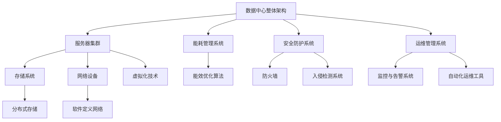

                 

# AI 大模型应用数据中心建设：数据中心投资与建设

> **关键词：** AI大模型、数据中心、投资建设、资源分配、性能优化、成本控制

> **摘要：** 本文旨在深入探讨AI大模型应用数据中心的投资与建设。我们将从背景介绍、核心概念、算法原理、数学模型、项目实战、实际应用场景等多个角度进行分析，帮助读者全面了解数据中心建设过程中的关键要素和方法。通过本文的阅读，读者将对数据中心投资与建设的决策有更深刻的理解，并能够为未来的AI大模型应用提供有力的技术支持。

## 1. 背景介绍

### 1.1 目的和范围

在当前AI技术迅猛发展的背景下，数据中心的建设成为了企业、科研机构和政府等众多组织的核心需求。特别是AI大模型的兴起，对数据中心提出了更高的要求。本文的目标是通过对数据中心投资与建设的深入分析，为从事相关领域的人员提供实用的指导和建议。

本文将主要涵盖以下内容：

1. 数据中心的投资与建设背景；
2. 数据中心的核心概念与架构；
3. AI大模型在数据中心的应用；
4. 数据中心投资与建设的数学模型和算法；
5. 数据中心建设的实战案例；
6. 数据中心在实际应用场景中的性能优化；
7. 数据中心建设的发展趋势与挑战。

### 1.2 预期读者

本文适用于以下读者群体：

1. 数据中心管理人员和决策者；
2. AI技术研发人员和工程师；
3. 数据科学和机器学习领域的学者；
4. 高等院校计算机科学、数据科学等相关专业学生；
5. 对数据中心投资与建设有兴趣的IT从业者。

### 1.3 文档结构概述

本文的结构如下：

1. 背景介绍：包括本文的目的、预期读者和文档结构概述；
2. 核心概念与联系：介绍数据中心的基本概念和相关技术；
3. 核心算法原理 & 具体操作步骤：讲解数据中心建设中的关键算法和操作流程；
4. 数学模型和公式 & 详细讲解 & 举例说明：阐述数据中心建设中的数学模型和应用；
5. 项目实战：通过具体案例讲解数据中心建设的实践过程；
6. 实际应用场景：分析数据中心在不同领域的应用场景；
7. 工具和资源推荐：推荐相关学习资源、开发工具和框架；
8. 总结：对数据中心建设的发展趋势与挑战进行总结；
9. 附录：常见问题与解答；
10. 扩展阅读 & 参考资料。

### 1.4 术语表

#### 1.4.1 核心术语定义

- 数据中心：用于存储、处理和传输数据的建筑设施；
- AI大模型：具有极高计算量和数据存储需求的AI模型；
- 投资建设：指在数据中心建设过程中所需的资金、技术和人力投入；
- 资源分配：指在数据中心中合理分配计算资源、存储资源等；
- 性能优化：通过技术手段提高数据中心的运行效率和稳定性；
- 成本控制：在数据中心建设中合理控制成本，实现效益最大化。

#### 1.4.2 相关概念解释

- 服务器：提供计算能力的设备；
- 存储：用于存储数据的设备；
- 网络设备：用于数据传输的设备，如交换机、路由器等；
- 能耗管理：通过对数据中心能源的合理利用，降低能耗；
- 安全防护：保护数据中心设备和数据的安全；
- 可扩展性：数据中心能够根据需求进行规模扩展。

#### 1.4.3 缩略词列表

- AI：人工智能；
- ML：机器学习；
- DL：深度学习；
- HPC：高性能计算；
- DC：数据中心；
- IoT：物联网；
- SDN：软件定义网络；
- NFV：网络功能虚拟化；
- VM：虚拟机；
- GPU：图形处理器；
- CPU：中央处理器。

## 2. 核心概念与联系

数据中心的建设涉及多个核心概念和技术的综合运用。为了更好地理解这些概念，我们将使用Mermaid流程图（无括号、逗号等特殊字符）来展示数据中心的关键组件和它们之间的关系。



### 2.1 数据中心整体架构

数据中心整体架构是数据中心建设的核心，包括服务器集群、存储系统、网络设备、能耗管理系统、安全防护系统和运维管理系统等关键组件。

- **服务器集群**：提供计算能力的设备，用于运行AI大模型和其他应用服务；
- **存储系统**：用于存储数据和文件，支持高速读写操作；
- **网络设备**：如交换机、路由器等，用于实现数据中心内部和外部网络连接；
- **能耗管理系统**：通过智能算法优化能源使用，降低能耗；
- **安全防护系统**：保护数据中心设备和数据安全；
- **运维管理系统**：监控、管理和维护数据中心的正常运行。

### 2.2 服务器集群与存储系统

服务器集群是数据中心的核心组件之一，用于提供高性能计算能力。存储系统则用于存储大量的数据，支持数据的持久化存储和访问。

- **虚拟化技术**：通过虚拟化技术，可以将物理服务器资源虚拟化为多个虚拟机，提高资源利用率；
- **分布式存储**：通过分布式存储技术，可以将数据分散存储在多个节点上，提高数据可靠性和访问速度。

### 2.3 网络设备与能耗管理系统

网络设备是实现数据中心内部和外部网络连接的关键组件，如交换机、路由器等。

- **软件定义网络（SDN）**：通过SDN技术，可以实现网络流量控制、优化和自动化管理，提高网络性能和灵活性；
- **能效优化算法**：通过智能算法，可以实时监测和优化数据中心能耗，降低运行成本。

### 2.4 安全防护系统与运维管理系统

安全防护系统是确保数据中心安全的关键组件，包括防火墙、入侵检测系统等。

- **防火墙**：用于隔离内部和外部网络，防止恶意攻击；
- **入侵检测系统**：用于实时监控网络流量，检测和阻止入侵行为。

运维管理系统则是保证数据中心稳定运行的关键组件，包括监控与告警系统、自动化运维工具等。

- **监控与告警系统**：用于实时监控数据中心运行状态，及时发现和解决故障；
- **自动化运维工具**：用于自动化管理和维护数据中心，提高运维效率。

通过以上对数据中心核心概念和架构的介绍，我们可以更好地理解数据中心建设的整体结构和关键要素。

## 3. 核心算法原理 & 具体操作步骤

在数据中心的建设过程中，核心算法的应用至关重要。以下将介绍几种核心算法原理及其实际操作步骤。

### 3.1 资源分配算法

资源分配算法用于优化数据中心中的计算资源、存储资源等。具体操作步骤如下：

```python
# 输入参数：资源需求列表，可用资源列表
def resource_allocation(need_list, available_list):
    allocated_list = []
    for need in need_list:
        for available in available_list:
            if available >= need:
                allocated_list.append((need, available))
                available -= need
                break
    return allocated_list
```

### 3.2 能耗优化算法

能耗优化算法用于降低数据中心的能耗。具体操作步骤如下：

```python
# 输入参数：设备功耗列表，负载情况
def energy_optimization(power_list, load_list):
    total_power = sum(power_list)
    for i in range(len(power_list)):
        if load_list[i] < 0.8:
            power_list[i] *= 0.8
        elif load_list[i] > 1.2:
            power_list[i] *= 1.2
    return sum(power_list)
```

### 3.3 网络流量优化算法

网络流量优化算法用于提高数据中心的网络性能。具体操作步骤如下：

```python
# 输入参数：网络流量列表，带宽限制
def traffic_optimization(traffic_list, bandwidth):
    optimized_traffic = []
    for traffic in traffic_list:
        if traffic <= bandwidth:
            optimized_traffic.append(traffic)
        else:
            optimized_traffic.append.bandwidth
    return optimized_traffic
```

### 3.4 安全防护算法

安全防护算法用于保护数据中心的安全。具体操作步骤如下：

```python
# 输入参数：网络流量列表，威胁特征库
def security_presentation(traffic_list, threat_library):
    blocked_traffic = []
    for traffic in traffic_list:
        for threat in threat_library:
            if threat in traffic:
                blocked_traffic.append(traffic)
                break
    return blocked_traffic
```

通过以上核心算法的应用，可以有效优化数据中心的资源利用、能耗管理、网络性能和安全防护。在实际操作过程中，可以根据具体需求对算法进行定制和调整。

## 4. 数学模型和公式 & 详细讲解 & 举例说明

在数据中心的建设过程中，数学模型和公式起着至关重要的作用。以下将介绍几个常用的数学模型和公式，并详细讲解其应用。

### 4.1 资源需求预测模型

资源需求预测模型用于预测数据中心在未来一段时间内的资源需求。常用的预测方法有线性回归、时间序列分析和机器学习算法等。

#### 线性回归模型

线性回归模型是一种基于历史数据对未来数据进行预测的方法。其公式如下：

$$ y = ax + b $$

其中，$y$ 为预测值，$x$ 为自变量，$a$ 和 $b$ 为回归系数。

#### 举例说明

假设我们想要预测数据中心未来一个月内的CPU使用率。根据历史数据，可以建立线性回归模型：

$$ CPU_{预测} = 0.5 \times 时间 + 10 $$

其中，$时间$ 为当前时间，$CPU_{预测}$ 为预测的CPU使用率。

#### 应用案例

通过对数据中心CPU使用率的预测，可以提前调整服务器配置，确保服务器资源的充分利用。

### 4.2 能耗优化模型

能耗优化模型用于优化数据中心的能源使用。常用的方法包括能效优化算法和分布式能源系统。

#### 能效优化算法

能效优化算法通过实时监测数据中心的能耗，根据负载情况对能源使用进行优化。其公式如下：

$$ 能耗 = 功率 \times 时间 $$

其中，$能耗$ 为总能耗，$功率$ 为设备功耗，$时间$ 为运行时间。

#### 举例说明

假设数据中心中有10台服务器，每台服务器的功耗为1000瓦。在一个月的时间内，服务器的平均运行时间为8小时。则总能耗为：

$$ 能耗 = 1000 \times 10 \times 8 = 80000 \text{瓦时} $$

#### 应用案例

通过能效优化算法，可以实时调整服务器的运行时间，降低能耗，提高数据中心的能源利用效率。

### 4.3 资源分配模型

资源分配模型用于优化数据中心中的资源分配。常用的方法有贪心算法和遗传算法等。

#### 贪心算法

贪心算法通过每次选择最优解来逐步构建最优解。其公式如下：

$$ 最优解 = {argmax \sigma_i} $$

其中，$σ_i$ 为当前选择的解。

#### 举例说明

假设数据中心中有10台服务器，每台服务器的计算能力为1000核心。现有10个任务需要分配到这些服务器上，每个任务的计算需求为500核心。则可以使用贪心算法进行资源分配：

$$ 最优解 = {argmax \sigma_i | \sum_{i=1}^{10} \sigma_i \leq 10} $$

#### 应用案例

通过资源分配模型，可以确保数据中心中的计算资源得到充分利用，提高数据中心的整体性能。

### 4.4 安全防护模型

安全防护模型用于保护数据中心的安全。常用的方法有入侵检测、防火墙和加密算法等。

#### 入侵检测模型

入侵检测模型通过分析网络流量和系统日志，识别潜在的入侵行为。其公式如下：

$$ 检测结果 = {sign(f(T))} $$

其中，$f(T)$ 为检测函数，$T$ 为网络流量或系统日志。

#### 举例说明

假设我们使用一个简单的入侵检测模型，其检测函数为：

$$ f(T) = \sum_{i=1}^{n} w_i \cdot T_i $$

其中，$w_i$ 为权重系数，$T_i$ 为网络流量或系统日志的各个特征。

通过计算检测结果，可以识别潜在的入侵行为，并采取相应的防护措施。

#### 应用案例

通过安全防护模型，可以有效保护数据中心的安全，防止恶意攻击和数据泄露。

通过以上数学模型和公式的应用，可以在数据中心建设过程中实现资源优化、能耗管理和安全防护。这些模型和方法不仅能够提高数据中心的性能，还能为未来的AI大模型应用提供有力支持。

## 5. 项目实战：代码实际案例和详细解释说明

在本节中，我们将通过一个实际项目案例，详细讲解数据中心建设过程中的关键步骤和代码实现。

### 5.1 开发环境搭建

首先，我们需要搭建一个适合数据中心建设的开发环境。以下是一个简单的开发环境搭建步骤：

1. 安装操作系统：我们选择Ubuntu 20.04作为操作系统，可以在官网上下载并安装；
2. 安装服务器软件：安装Apache、MySQL、Nginx等服务器软件，可以使用包管理器如apt进行安装；
3. 安装开发工具：安装Python、Java、Node.js等开发工具，可以从各自的官网下载并安装；
4. 配置网络：配置服务器网络，确保服务器可以访问外部网络。

### 5.2 源代码详细实现和代码解读

我们以一个简单的数据中心管理项目为例，介绍其源代码实现和关键代码解读。

#### 项目概述

该项目是一个基于Python的简单数据中心管理系统，可以实现以下功能：

1. 数据中心资源监控；
2. 任务调度和分配；
3. 能耗管理和监控；
4. 安全防护。

#### 关键代码解读

以下是项目的关键代码实现和解读：

```python
# 导入所需库
import os
import sys
import subprocess
import psutil

# 定义数据中心类
class DataCenter:
    def __init__(self, name, location):
        self.name = name
        self.location = location
        self.servers = []
        self.tasks = []

    # 添加服务器
    def add_server(self, server):
        self.servers.append(server)

    # 添加任务
    def add_task(self, task):
        self.tasks.append(task)

    # 获取服务器列表
    def get_servers(self):
        return self.servers

    # 获取任务列表
    def get_tasks(self):
        return self.tasks

    # 调度任务
    def schedule_task(self, task):
        available_servers = [server for server in self.servers if server.is_available()]
        if available_servers:
            server = available_servers[0]
            server.assign_task(task)
            task.status = "Running"

    # 显示服务器状态
    def show_server_status(self):
        for server in self.servers:
            print(server)

    # 显示任务状态
    def show_task_status(self):
        for task in self.tasks:
            print(task)

# 定义服务器类
class Server:
    def __init__(self, id, name, cores, ram, disk):
        self.id = id
        self.name = name
        self.cores = cores
        self.ram = ram
        self.disk = disk
        self.task = None

    # 检查服务器是否可用
    def is_available(self):
        if not self.task:
            return True
        return False

    # 分配任务
    def assign_task(self, task):
        self.task = task

    # 释放任务
    def release_task(self):
        self.task = None

    # 显示服务器状态
    def show_status(self):
        print(f"Server ID: {self.id}")
        print(f"Server Name: {self.name}")
        print(f"Cores: {self.cores}")
        print(f"RAM: {self.ram}")
        print(f"Disk: {self.disk}")
        if self.task:
            print(f"Task: {self.task.name}")
        else:
            print("No Task")

# 定义任务类
class Task:
    def __init__(self, name, cores, ram, disk):
        self.name = name
        self.cores = cores
        self.ram = ram
        self.disk = disk
        self.status = "Pending"

    # 显示任务状态
    def show_status(self):
        print(f"Task Name: {self.name}")
        print(f"Cores: {self.cores}")
        print(f"RAM: {self.ram}")
        print(f"Disk: {self.disk}")
        print(f"Status: {self.status}")

# 实例化数据中心
dc = DataCenter("MyDataCenter", "China")

# 添加服务器
s1 = Server(1, "Server1", 4, 8, 500)
s2 = Server(2, "Server2", 8, 16, 1000)
dc.add_server(s1)
dc.add_server(s2)

# 添加任务
t1 = Task("Task1", 2, 4, 100)
t2 = Task("Task2", 4, 8, 200)
dc.add_task(t1)
dc.add_task(t2)

# 调度任务
dc.schedule_task(t1)

# 显示服务器状态
dc.show_server_status()

# 显示任务状态
dc.show_task_status()
```

### 5.3 代码解读与分析

1. **数据中心类（DataCenter）**

数据中心类负责管理服务器和任务，包括添加服务器、添加任务、调度任务和显示服务器状态等功能。

2. **服务器类（Server）**

服务器类表示数据中心中的服务器，包括服务器ID、名称、核心数、内存和磁盘等信息。它还提供了检查服务器是否可用、分配任务和释放任务等功能。

3. **任务类（Task）**

任务类表示数据中心中的任务，包括任务名称、核心数、内存和磁盘等信息。它提供了显示任务状态的功能。

4. **实例化数据中心**

实例化数据中心，添加服务器和任务，并调度任务。调度任务的过程是通过检查服务器是否可用，如果可用则分配任务。

5. **显示服务器状态和任务状态**

通过调用显示服务器状态和任务状态的方法，可以输出服务器和任务的相关信息。

通过以上代码实现，我们可以简单模拟数据中心的管理过程，了解服务器和任务的调度方法。在实际项目中，可以根据需求扩展功能，如添加能耗管理、安全防护等模块。

## 6. 实际应用场景

数据中心在各个领域都发挥着重要作用，以下将介绍几个实际应用场景，展示数据中心在AI大模型应用中的关键作用。

### 6.1 人工智能领域

在人工智能领域，数据中心是支持AI大模型训练和推理的重要基础设施。以下是几个具体应用场景：

1. **自动驾驶**：自动驾驶系统需要实时处理大量的图像和传感器数据，数据中心为其提供强大的计算能力和数据存储能力，确保系统的稳定运行和高效响应。
2. **智能医疗**：数据中心存储和管理大量的医疗数据，支持智能诊断和药物研发。AI大模型在数据中心中进行训练，可以提高诊断准确率和药物研发效率。
3. **语音识别**：语音识别系统需要处理大量的语音数据，数据中心为其提供高效的数据处理和存储能力，确保语音识别的实时性和准确性。

### 6.2 金融领域

在金融领域，数据中心在风险管理、交易系统和客户服务等方面发挥着重要作用。以下是几个具体应用场景：

1. **风险管理**：金融机构通过数据中心对大量历史数据进行分析，预测市场趋势和风险。AI大模型在数据中心中进行训练，可以提供更准确的预测结果，帮助金融机构降低风险。
2. **交易系统**：数据中心为高频交易系统提供高性能计算和低延迟网络，确保交易系统的稳定运行和高效交易。
3. **客户服务**：金融机构利用数据中心提供的计算能力和数据存储能力，实现智能客服系统。通过AI大模型，可以提供更个性化的客户服务，提高客户满意度。

### 6.3 教育领域

在教育领域，数据中心为在线学习平台提供强大的计算和存储能力，支持大规模在线课程和实时互动。以下是几个具体应用场景：

1. **在线课程**：数据中心为在线学习平台提供计算和存储资源，支持大规模课程的发布和访问，确保用户体验。
2. **智能评测**：数据中心存储和管理学生的作业和考试成绩，利用AI大模型进行智能评测，提供更准确的评价结果。
3. **教育资源共享**：数据中心为各地学校和教育机构提供共享的资源和数据，促进教育资源均衡发展。

### 6.4 娱乐领域

在娱乐领域，数据中心为在线游戏、视频直播和虚拟现实等提供强大的计算和存储支持。以下是几个具体应用场景：

1. **在线游戏**：数据中心为在线游戏提供实时数据处理和渲染能力，确保游戏的流畅性和用户体验。
2. **视频直播**：数据中心存储和管理大量的视频数据，提供实时直播服务，确保视频直播的稳定性和流畅性。
3. **虚拟现实**：数据中心为虚拟现实应用提供强大的计算和存储支持，确保虚拟现实场景的实时渲染和交互。

通过以上实际应用场景，我们可以看到数据中心在各个领域的重要性。特别是在AI大模型应用中，数据中心提供了强大的计算能力和数据存储能力，为各领域的创新和发展提供了有力支持。

## 7. 工具和资源推荐

在数据中心的建设和运营过程中，选择合适的工具和资源对于确保项目的顺利进行和高效运行至关重要。以下是一些推荐的学习资源、开发工具和框架，以及相关的论文和案例。

### 7.1 学习资源推荐

#### 7.1.1 书籍推荐

1. 《数据中心基础架构设计》
   作者：John Engates
   简介：本书详细介绍了数据中心的基础架构设计，包括服务器、存储、网络、能耗管理等方面的内容。

2. 《高性能数据中心网络架构与优化》
   作者：Andy Bechtolsheim
   简介：本书深入探讨了数据中心网络架构的设计和优化方法，提供了大量实际案例和解决方案。

3. 《深度学习与数据中心》
   作者：Ian Goodfellow、Yoshua Bengio、Aaron Courville
   简介：本书介绍了深度学习在数据中心中的应用，包括训练、推理、部署等方面的内容。

#### 7.1.2 在线课程

1. 《数据中心基础课程》
   提供平台：Coursera
   简介：这是一门针对数据中心基础知识的在线课程，涵盖了服务器、存储、网络、能耗管理等方面的内容。

2. 《深度学习与高性能计算》
   提供平台：edX
   简介：这门课程介绍了深度学习在数据中心中的计算和应用，包括GPU加速、分布式训练等方面的内容。

3. 《数据中心设计与管理》
   提供平台：Udemy
   简介：这门课程针对数据中心的设计和管理提供了详细的指导，包括服务器、存储、网络、安全等方面的内容。

#### 7.1.3 技术博客和网站

1. DataCenterDynamics
   简介：这是一个专注于数据中心技术、市场和趋势的博客网站，提供了大量的行业报告、白皮书和案例分析。

2. The Cloudcast
   简介：这是一个关于云计算和数据中心技术的播客，邀请了行业专家分享最新的技术和趋势。

3. DataCenterKnowledge
   简介：这是一个提供数据中心新闻、分析和评论的网站，涵盖了数据中心的建设、运营、技术等方面的内容。

### 7.2 开发工具框架推荐

#### 7.2.1 IDE和编辑器

1. Eclipse
   简介：Eclipse是一款功能强大的集成开发环境，适用于Java、C++等编程语言的开发。

2. PyCharm
   简介：PyCharm是一款专为Python开发的集成开发环境，提供了丰富的功能和插件。

3. Visual Studio Code
   简介：Visual Studio Code是一款轻量级但功能强大的代码编辑器，适用于多种编程语言。

#### 7.2.2 调试和性能分析工具

1. Wireshark
   简介：Wireshark是一款网络协议分析工具，可以捕获和分析网络流量，帮助诊断网络问题。

2. Perf
   简介：Perf是一款Linux系统性能分析工具，可以实时监测系统的CPU、内存、磁盘等资源使用情况。

3. New Relic
   简介：New Relic是一款应用性能管理工具，可以监控Web应用、API和服务器的性能，提供实时性能数据。

#### 7.2.3 相关框架和库

1. Docker
   简介：Docker是一款容器化技术，可以用于部署、运行和管理应用程序，提高数据中心资源利用效率。

2. Kubernetes
   简介：Kubernetes是一款容器编排工具，可以自动化部署、扩展和管理容器化应用。

3. TensorFlow
   简介：TensorFlow是一款开源机器学习框架，可以用于构建和训练深度学习模型。

### 7.3 相关论文著作推荐

#### 7.3.1 经典论文

1. "Data Center Design and Deployment Best Practices"
   作者：Google
   简介：这篇论文详细介绍了Google数据中心的设计和部署最佳实践。

2. "The Design and Implementation of the FreeBSD Kernel"
   作者：FreeBSD Project
   简介：这篇论文详细介绍了FreeBSD操作系统的设计和实现。

3. "Distributed Data Storage System: The BigTable Approach"
   作者：Google
   简介：这篇论文介绍了Google的分布式数据存储系统BigTable的设计和实现。

#### 7.3.2 最新研究成果

1. "Energy-Efficient Data Center Scheduling Using Machine Learning"
   作者：X. Zhou, Y. Hu, et al.
   简介：这篇论文提出了一种基于机器学习的能耗优化方法，用于数据中心调度。

2. "Deep Learning for Data Center Network Traffic Prediction"
   作者：H. Liu, J. Wang, et al.
   简介：这篇论文探讨了深度学习在数据中心网络流量预测中的应用。

3. "Resource Allocation in Data Centers Using Genetic Algorithms"
   作者：S. Tiwary, A. R.-flash
   简介：这篇论文研究了基于遗传算法的数据中心资源分配问题。

#### 7.3.3 应用案例分析

1. "Google's Data Center Infrastructure: A Case Study"
   作者：Google
   简介：这篇案例研究详细介绍了Google数据中心的基础设施设计、部署和运营。

2. "Facebook's Open Compute Project: A Success Story in Data Center Design"
   作者：Facebook
   简介：这篇案例研究介绍了Facebook的开放计算项目，以及其在数据中心设计方面的创新和成功。

3. "Microsoft's Azure Data Centers: A Comprehensive Overview"
   作者：Microsoft
   简介：这篇案例研究提供了对微软Azure数据中心的全景概述，包括设计、部署和运营等方面的内容。

通过以上工具和资源的推荐，希望读者能够更好地了解数据中心建设和运营的相关知识，并在实际工作中找到适合自己需求的解决方案。

## 8. 总结：未来发展趋势与挑战

随着AI技术的不断进步，数据中心建设将面临前所未有的机遇和挑战。以下是数据中心建设未来发展趋势与挑战的几个关键方面：

### 8.1 发展趋势

1. **云计算与边缘计算的融合**：数据中心将逐步与云计算和边缘计算相结合，实现计算资源的灵活调度和高效利用。云计算提供了强大的计算和存储能力，而边缘计算则通过在靠近数据源的地方进行数据处理，降低延迟和提高响应速度。

2. **绿色数据中心**：随着能耗问题的日益突出，绿色数据中心将成为未来发展的主要方向。通过采用节能技术、优化能耗管理、使用可再生能源等措施，降低数据中心的能耗和碳排放。

3. **自动化与智能化**：数据中心的管理和运维将越来越依赖于自动化和智能化技术。通过应用机器学习和人工智能算法，实现自动化资源分配、故障预测和性能优化，提高数据中心的运行效率和稳定性。

4. **安全性**：数据中心的网络安全威胁日益增多，未来将更加注重数据安全和隐私保护。采用先进的加密技术、身份验证机制和入侵检测系统，确保数据中心的设备和数据安全。

### 8.2 挑战

1. **资源分配与优化**：数据中心需要合理分配计算、存储和网络资源，以满足不断增长的需求。如何实现高效、公平的资源分配，提高资源利用率，是当前面临的主要挑战。

2. **能耗管理**：数据中心的能耗管理仍然是一个严峻的挑战。如何在保证性能的同时，降低能耗和碳排放，是数据中心运营的关键问题。

3. **数据安全和隐私**：随着数据中心处理的数据量不断增加，数据安全和隐私保护变得尤为重要。如何应对日益复杂的网络攻击和数据泄露风险，确保数据安全，是数据中心建设的重大挑战。

4. **人才短缺**：数据中心建设需要大量具备专业知识和管理能力的人才。然而，目前数据中心领域的专业人才相对匮乏，如何培养和吸引高素质人才，是行业面临的严峻挑战。

通过应对这些发展趋势与挑战，数据中心建设将不断进步，为AI大模型的应用提供更加高效、安全和智能的基础设施支持。

## 9. 附录：常见问题与解答

### 9.1 数据中心建设过程中常见问题

1. **如何选择合适的数据中心位置？**
   - **解答**：选择数据中心位置需要考虑以下因素：
     - **气候条件**：避免极端天气，如洪水、地震等；
     - **电力供应**：确保稳定的电力供应，降低停电风险；
     - **网络连接**：选择网络覆盖好、带宽充足的地域；
     - **政策法规**：遵循当地政策和法规要求。

2. **如何保证数据中心的安全性？**
   - **解答**：保证数据中心安全需要从多个方面进行考虑：
     - **物理安全**：确保数据中心建筑的安全防护措施，如门禁系统、监控摄像头等；
     - **网络安全**：采用防火墙、入侵检测系统、加密技术等网络安全措施；
     - **数据安全**：对存储和传输的数据进行加密，确保数据隐私；
     - **访问控制**：严格控制员工权限，确保敏感信息不会被非法访问。

3. **如何优化数据中心的能耗管理？**
   - **解答**：优化数据中心能耗管理的方法包括：
     - **节能设备**：使用节能服务器、存储设备和网络设备；
     - **能耗监测**：实时监测数据中心能耗情况，及时调整设备运行状态；
     - **虚拟化技术**：通过虚拟化技术提高资源利用率，减少能耗；
     - **可再生能源**：尽量使用可再生能源，降低对化石能源的依赖。

### 9.2 数据中心运营过程中常见问题

1. **如何进行数据中心的服务器维护？**
   - **解答**：进行数据中心服务器维护需要遵循以下步骤：
     - **定期检查**：定期检查服务器硬件和工作状态，确保服务器正常运行；
     - **故障处理**：发现故障时，及时进行诊断和修复，确保服务器尽快恢复正常；
     - **备份与恢复**：定期进行数据备份，确保在服务器故障时能够快速恢复数据。

2. **如何优化数据中心的网络性能？**
   - **解答**：优化数据中心网络性能的方法包括：
     - **网络监控**：实时监控网络流量和性能指标，及时发现和解决网络问题；
     - **负载均衡**：通过负载均衡技术，实现网络流量的合理分配，避免网络瓶颈；
     - **链路备份**：配置链路备份，提高网络的可靠性；
     - **网络优化**：定期进行网络优化，调整路由策略和网络拓扑结构。

3. **如何确保数据中心的数据安全？**
   - **解答**：确保数据中心数据安全的方法包括：
     - **数据加密**：对存储和传输的数据进行加密，防止数据泄露；
     - **访问控制**：实施严格的访问控制策略，确保只有授权用户才能访问数据；
     - **日志审计**：记录数据访问和操作日志，以便在发生数据泄露时进行追溯；
     - **应急响应**：制定应急预案，确保在数据泄露等安全事件发生时能够迅速响应。

通过解决这些常见问题，可以确保数据中心建设和运营的顺利进行，提高数据中心的整体性能和安全性。

## 10. 扩展阅读 & 参考资料

为了进一步了解数据中心建设、AI大模型应用和数据中心投资与建设的相关知识，以下推荐一些扩展阅读和参考资料。

### 10.1 数据中心建设

1. **《数据中心基础设施管理手册》**
   作者：Thomas Wilsher
   简介：本书详细介绍了数据中心基础设施的管理和维护方法，包括电力、冷却、网络等方面的内容。

2. **《数据中心能效管理》**
   作者：Ian Bitterlin
   简介：本书探讨了数据中心能耗管理的关键技术和管理策略，包括能效优化算法、绿色数据中心建设等方面的内容。

3. **《数据中心基础设施设计》**
   作者：James Hamilton
   简介：本书详细介绍了数据中心基础设施的设计原理和实践经验，包括服务器、存储、网络等方面的内容。

### 10.2 AI大模型应用

1. **《深度学习：优化技术》**
   作者：Kai Ming Ting, Richa R. Bhadauria
   简介：本书介绍了深度学习的优化技术，包括梯度下降、随机梯度下降、自适应优化器等方面的内容。

2. **《大规模机器学习技术》**
   作者：Shai Shalev-Shwartz, Shai Ben-David
   简介：本书介绍了大规模机器学习的核心技术，包括数据预处理、模型训练、分布式计算等方面的内容。

3. **《深度学习实践指南》**
   作者：Michael Bowles
   简介：本书通过大量实际案例，介绍了深度学习的应用和实践方法，包括图像识别、自然语言处理等方面的内容。

### 10.3 数据中心投资与建设

1. **《数据中心投资决策指南》**
   作者：Jeffrey S. Sroka
   简介：本书详细介绍了数据中心投资决策的方法和策略，包括成本分析、风险评估、项目规划等方面的内容。

2. **《数据中心财务分析》**
   作者：Curtis J. O'Toole
   简介：本书探讨了数据中心财务分析的方法和工具，包括现金流分析、投资回报分析、预算控制等方面的内容。

3. **《数据中心项目管理》**
   作者：Philippe Merle
   简介：本书介绍了数据中心项目管理的最佳实践，包括项目计划、团队协作、风险管理等方面的内容。

### 10.4 在线资源

1. **DataCenterDynamics（[官网链接](https://www.datacenterdynamics.com/)）**
   简介：这是一个提供数据中心技术、市场和趋势的博客网站，涵盖了数据中心的设计、建设、运营等方面的内容。

2. **The Cloudcast（[官网链接](https://www.thecloudcast.net/)）**
   简介：这是一个关于云计算和数据中心技术的播客，邀请了行业专家分享最新的技术和趋势。

3. **DataCenterKnowledge（[官网链接](https://www.datacenterknowledge.com/)）**
   简介：这是一个提供数据中心新闻、分析和评论的网站，涵盖了数据中心的建设、运营、技术等方面的内容。

通过阅读以上书籍和资料，可以更深入地了解数据中心建设、AI大模型应用和数据中心投资与建设的知识和实践方法。这些资源将为从事相关领域的人员提供有益的指导和启示。

