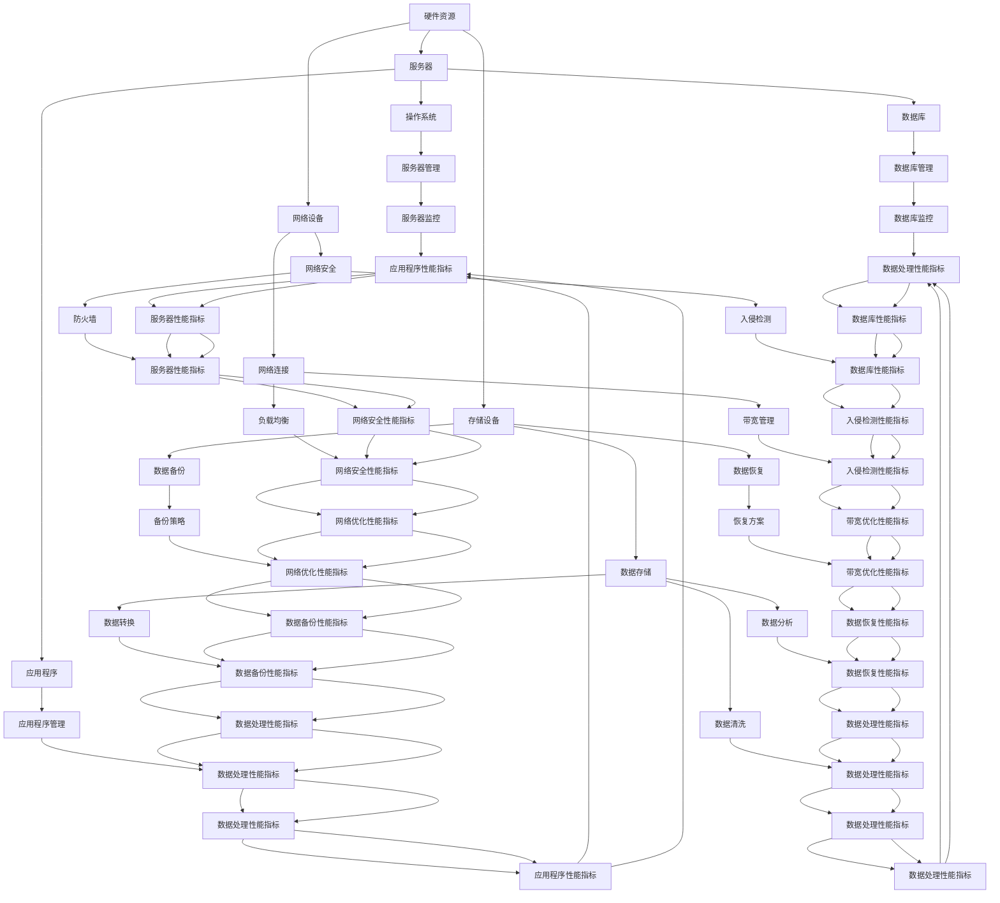

                 

# AI 大模型应用数据中心建设：数据中心标准与规范

> **关键词：** 大模型应用、数据中心建设、标准与规范、AI 技术原理、数学模型、实际应用案例

> **摘要：** 本文将深入探讨大模型应用数据中心的建设，包括其标准与规范。我们将详细分析数据中心的核心概念、核心算法原理、数学模型及其应用场景，并通过实际代码案例展示其实现过程。最后，我们将展望数据中心建设的未来发展趋势与挑战。

## 1. 背景介绍

### 1.1 目的和范围

本文旨在为从事人工智能领域的研究者、工程师和项目经理提供一份关于大模型应用数据中心建设的指南。我们将重点讨论数据中心的构建标准与规范，以及如何将其应用于实际项目。

### 1.2 预期读者

- 人工智能领域的研究者、工程师
- 数据中心架构师、项目经理
- 高级技术爱好者

### 1.3 文档结构概述

本文将分为以下几部分：

1. 背景介绍：阐述本文的目的和读者对象。
2. 核心概念与联系：介绍数据中心的核心概念、原理和架构。
3. 核心算法原理与具体操作步骤：详细讲解数据中心建设的关键算法。
4. 数学模型和公式：探讨数据中心建设中的数学模型及其应用。
5. 项目实战：展示数据中心建设的实际代码案例。
6. 实际应用场景：分析数据中心在现实世界中的应用。
7. 工具和资源推荐：推荐学习资源、开发工具和框架。
8. 总结：展望数据中心建设的未来发展趋势与挑战。
9. 附录：常见问题与解答。
10. 扩展阅读：提供进一步的参考资料。

### 1.4 术语表

#### 1.4.1 核心术语定义

- **数据中心**：集中存储、处理和管理数据的设施。
- **大模型应用**：指使用大型人工智能模型进行数据处理和预测分析。
- **标准与规范**：确保数据中心建设和运营符合行业最佳实践的规定。

#### 1.4.2 相关概念解释

- **云计算**：通过互联网提供动态易扩展且经常是虚拟化的资源。
- **数据存储**：存储和管理数据的技术。
- **数据处理**：对数据进行清洗、转换和分析的过程。

#### 1.4.3 缩略词列表

- **AI**：人工智能
- **DL**：深度学习
- **GPU**：图形处理单元
- **HDFS**：Hadoop 分布式文件系统

## 2. 核心概念与联系

在讨论数据中心建设之前，我们先了解其核心概念和相互联系。

### 2.1 数据中心核心概念

- **硬件资源**：服务器、存储设备、网络设备等。
- **软件资源**：操作系统、数据库、应用程序等。
- **数据管理**：数据存储、备份、恢复、安全管理等。

### 2.2 数据中心架构

以下是一个简化版的数据中心架构图：



### 2.3 数据中心核心算法原理

数据中心的核心算法包括数据处理、数据存储和数据安全。以下是数据处理的核心算法：

#### 数据清洗（Data Cleaning）

```pseudo
function dataCleaning(dataSet):
    for each record in dataSet:
        if record is missing:
            replace with mean value
        if record is outlier:
            replace with median value
    return cleanedDataSet
```

#### 数据转换（Data Transformation）

```pseudo
function dataTransformation(cleanedDataSet):
    for each attribute in cleanedDataSet:
        if attribute is categorical:
            convert to one-hot encoding
        if attribute is continuous:
            normalize the values
    return transformedDataSet
```

#### 数据分析（Data Analysis）

```pseudo
function数据分析(transformedDataSet):
    apply machine learning algorithms to analyze patterns in data
    return analysisResults
```

## 3. 核心算法原理 & 具体操作步骤

在数据中心建设中，核心算法的选择和实现至关重要。以下我们将详细讨论数据处理、数据存储和数据安全的核心算法原理，并提供具体的操作步骤。

### 3.1 数据处理算法原理

数据处理是数据中心的核心任务之一。以下为数据处理的核心算法原理：

#### 数据清洗（Data Cleaning）

**算法原理：** 数据清洗旨在识别和修复数据集中的错误、缺失和不一致数据。常见的数据清洗步骤包括缺失值填充、异常值处理和数据格式转换。

**具体操作步骤：**

1. 缺失值填充：
   - 统计分析：计算每个特征的缺失值比例。
   - 填充策略：使用均值、中位数、众数等统计方法填充缺失值。

2. 异常值处理：
   - 统计分析：计算每个特征的异常值范围。
   - 处理策略：使用插值法、边界修正法等处理异常值。

3. 数据格式转换：
   - 字符串转数字：将字符串表示的数字转换为数值类型。
   - 数字转字符串：将数值类型的数据转换为字符串类型。

**伪代码：**

```python
def dataCleaning(dataSet):
    cleanedDataSet = []
    for record in dataSet:
        if missingValue in record:
            record[missingValue] = fillMissingValue(record[missingValue])
        if outlier in record:
            record[outlier] = handleOutlier(record[outlier])
        cleanedDataSet.append(record)
    return cleanedDataSet

def fillMissingValue(attribute):
    if attribute.isnumeric():
        return calculateMean(attribute)
    elif attribute.iscategorical():
        return calculateMode(attribute)

def handleOutlier(attribute):
    if attribute.isnumeric():
        return interpolateValue(attribute)
    elif attribute.iscategorical():
        return boundaryCorrection(attribute)

def calculateMean(attribute):
    # Implement mean calculation logic
    pass

def calculateMode(attribute):
    # Implement mode calculation logic
    pass

def interpolateValue(attribute):
    # Implement interpolation logic
    pass

def boundaryCorrection(attribute):
    # Implement boundary correction logic
    pass
```

#### 数据转换（Data Transformation）

**算法原理：** 数据转换旨在将原始数据转换为适合机器学习模型处理的形式。常见的数据转换步骤包括数据归一化、标准化和特征缩放。

**具体操作步骤：**

1. 数据归一化：
   - 计算每个特征的均值和标准差。
   - 将每个特征值减去均值并除以标准差。

2. 数据标准化：
   - 计算每个特征的最小值和最大值。
   - 将每个特征值缩放到 [0, 1] 区间。

3. 特征缩放：
   - 计算每个特征的最大值和最小值。
   - 将每个特征值缩放到 [-1, 1] 区间。

**伪代码：**

```python
def dataNormalization(dataSet):
    normalizedDataSet = []
    for record in dataSet:
        normalizedRecord = []
        for attribute in record:
            normalizedAttribute = normalizeAttribute(attribute)
            normalizedRecord.append(normalizedAttribute)
        normalizedDataSet.append(normalizedRecord)
    return normalizedDataSet

def normalizeAttribute(attribute):
    mean = calculateMean(attribute)
    std = calculateStandardDeviation(attribute)
    return (attribute - mean) / std

def calculateMean(attribute):
    # Implement mean calculation logic
    pass

def calculateStandardDeviation(attribute):
    # Implement standard deviation calculation logic
    pass

def dataStandardization(dataSet):
    standardizedDataSet = []
    for record in dataSet:
        standardizedRecord = []
        for attribute in record:
            standardizedAttribute = standardizeAttribute(attribute)
            standardizedRecord.append(standardizedAttribute)
        standardizedDataSet.append(standardizedRecord)
    return standardizedDataSet

def standardizeAttribute(attribute):
    min = calculateMin(attribute)
    max = calculateMax(attribute)
    return (attribute - min) / (max - min)

def calculateMin(attribute):
    # Implement minimum value calculation logic
    pass

def calculateMax(attribute):
    # Implement maximum value calculation logic
    pass

#### 数据分析（Data Analysis）

**算法原理：** 数据分析旨在从数据集中提取有价值的信息和知识。常见的数据分析算法包括线性回归、决策树、支持向量机等。

**具体操作步骤：**

1. 确定分析目标：
   - 根据业务需求确定数据分析的目标。

2. 选择合适的算法：
   - 根据数据特征和分析目标选择合适的机器学习算法。

3. 数据预处理：
   - 对数据进行清洗、转换和标准化。

4. 模型训练：
   - 使用预处理后的数据训练机器学习模型。

5. 模型评估：
   - 使用交叉验证等方法评估模型性能。

6. 模型优化：
   - 调整模型参数以优化性能。

7. 结果解释：
   - 解释模型的预测结果并输出可视化图表。

**伪代码：**

```python
def dataAnalysis(dataSet, targetAttribute):
    preprocessedData = dataCleaning(dataSet)
    preprocessedData = dataTransformation(preprocessedData)
    model = trainModel(preprocessedData, targetAttribute)
    evaluationMetrics = evaluateModel(model, preprocessedData)
    optimizedModel = optimizeModel(model, evaluationMetrics)
    results = interpretResults(optimizedModel, preprocessedData)
    visualizeResults(results)
    return results

def trainModel(dataSet, targetAttribute):
    # Implement model training logic
    pass

def evaluateModel(model, dataSet):
    # Implement model evaluation logic
    pass

def optimizeModel(model, evaluationMetrics):
    # Implement model optimization logic
    pass

def interpretResults(model, dataSet):
    # Implement result interpretation logic
    pass

def visualizeResults(results):
    # Implement visualization logic
    pass
```

### 3.2 数据存储算法原理

数据存储是数据中心的重要组成部分。以下为数据存储的核心算法原理：

#### 数据库选择

**算法原理：** 数据库的选择取决于数据规模、查询性能、数据一致性等需求。常见的数据库类型包括关系型数据库（如MySQL、PostgreSQL）和非关系型数据库（如MongoDB、Cassandra）。

**具体操作步骤：**

1. 确定数据规模：
   - 根据数据规模选择适合的数据库类型。

2. 确定查询性能：
   - 根据查询性能需求选择适合的数据库类型。

3. 确定数据一致性：
   - 根据数据一致性需求选择适合的数据库类型。

4. 选择合适的数据库：
   - 综合考虑以上因素选择适合的数据库。

**伪代码：**

```python
def selectDatabase(dataSize, queryPerformance, dataConsistency):
    if dataSize < 1000 and queryPerformance is low and dataConsistency is not critical:
        return "SQLite"
    elif dataSize < 1000 and queryPerformance is medium and dataConsistency is required:
        return "MySQL"
    elif dataSize < 1000 and queryPerformance is high and dataConsistency is required:
        return "PostgreSQL"
    elif dataSize >= 1000 and queryPerformance is low and dataConsistency is not critical:
        return "Cassandra"
    elif dataSize >= 1000 and queryPerformance is medium and dataConsistency is required:
        return "MongoDB"
    elif dataSize >= 1000 and queryPerformance is high and dataConsistency is required:
        return "Cassandra"
```

#### 数据库性能优化

**算法原理：** 数据库性能优化旨在提高数据库查询速度和系统稳定性。常见的方法包括索引优化、查询优化、缓存策略等。

**具体操作步骤：**

1. 索引优化：
   - 根据查询需求添加合适的索引。
   - 删除冗余索引以减少查询开销。

2. 查询优化：
   - 优化SQL查询语句，减少查询执行时间。
   - 使用数据库提供的优化器进行查询优化。

3. 缓存策略：
   - 使用内存缓存提高查询速度。
   - 设定合适的缓存过期时间以保持数据一致性。

**伪代码：**

```python
def optimizeDatabase(query):
    if query involves joins:
        addIndexToJoins()
    elif query involves filtering:
        addIndexToFiltering()
    elif query involves sorting:
        addIndexToSorting()
    if queryPerformance is slow:
        optimizeQuery(query)
    if caching is enabled:
        setCacheExpirationTime()

def addIndexToJoins():
    # Implement join index creation logic
    pass

def addIndexToFiltering():
    # Implement filtering index creation logic
    pass

def addIndexToSorting():
    # Implement sorting index creation logic
    pass

def optimizeQuery(query):
    # Implement query optimization logic
    pass

def setCacheExpirationTime():
    # Implement cache expiration time setting logic
    pass
```

#### 数据安全算法原理

数据安全是数据中心建设的重中之重。以下为数据安全的核心算法原理：

**算法原理：** 数据安全旨在保护数据免受未经授权的访问、篡改和泄露。常见的方法包括数据加密、访问控制、安全审计等。

**具体操作步骤：**

1. 数据加密：
   - 使用加密算法对敏感数据进行加密。
   - 存储加密密钥并确保其安全。

2. 访问控制：
   - 根据用户角色和权限设置访问控制策略。
   - 实现身份验证和授权机制。

3. 安全审计：
   - 记录系统操作日志。
   - 定期进行安全审计以发现潜在漏洞。

**伪代码：**

```python
def dataEncryption(data, encryptionKey):
    encryptedData = encryptData(data, encryptionKey)
    return encryptedData

def accessControl(user, resource):
    if user hasPermission(resource):
        allowAccess()
    else:
        denyAccess()

def securityAudit(log):
    if log indicates suspicious activity:
        raiseAlert()
```

## 4. 数学模型和公式 & 详细讲解 & 举例说明

在数据中心建设中，数学模型和公式发挥着重要作用。以下我们将详细介绍数据中心建设中的常用数学模型和公式，并提供详细讲解和举例说明。

### 4.1 数据清洗模型

数据清洗是数据中心建设的重要环节。常见的数据清洗模型包括缺失值填充、异常值处理和数据格式转换。

#### 缺失值填充模型

**公式：** 均值填充、中位数填充、众数填充。

$$
\text{均值填充} = \frac{\sum_{i=1}^{n} x_i}{n}
$$

$$
\text{中位数填充} = \text{第}\left(\frac{n+1}{2}\right)\text{个}\text{数据}
$$

$$
\text{众数填充} = \text{出现次数最多的数据}
$$

**举例：** 假设数据集 [1, 2, 3, NaN, 4, 5] 中存在一个缺失值 NaN，使用均值填充方法进行填充。

$$
\text{均值填充} = \frac{1+2+3+4+5}{5} = 3
$$

填充后数据集变为 [1, 2, 3, 3, 4, 5]。

#### 异常值处理模型

**公式：** 三倍标准差法、四分位距法。

$$
\text{三倍标准差法} = \text{均值} \pm 3 \times \text{标准差}
$$

$$
\text{四分位距法} = \text{上四分位数} - 1.5 \times \text{四分位距}
$$

**举例：** 假设数据集 [1, 2, 3, 4, 5, 100] 中存在一个异常值 100，使用三倍标准差法进行异常值处理。

$$
\text{均值} = \frac{1+2+3+4+5+100}{6} = 20.83
$$

$$
\text{标准差} = \sqrt{\frac{(1-20.83)^2 + (2-20.83)^2 + (3-20.83)^2 + (4-20.83)^2 + (5-20.83)^2 + (100-20.83)^2}{6-1}} \approx 30.06
$$

$$
\text{三倍标准差} = 20.83 \pm 3 \times 30.06 = [20.83 - 90.18, 20.83 + 90.18] = [-69.35, 111.31]
$$

由于异常值 100 超出了三倍标准差范围，将其替换为缺失值 NaN。

#### 数据格式转换模型

**公式：** 字符串转数字、数字转字符串。

$$
\text{字符串转数字} = \text{使用适当的转换函数}
$$

$$
\text{数字转字符串} = \text{使用适当的转换函数}
$$

**举例：** 假设数据集 ["1", "2", "3", "4", "5"] 中的字符串值需要进行数字转字符串转换。

使用 Python 的 `int()` 函数进行转换：

```python
dataSet = ["1", "2", "3", "4", "5"]
transformedDataSet = [int(x) for x in dataSet]
print(transformedDataSet)
```

输出：[1, 2, 3, 4, 5]

### 4.2 数据转换模型

数据转换是将原始数据转换为适合机器学习模型处理的形式。常见的数据转换模型包括数据归一化、标准化和特征缩放。

#### 数据归一化模型

**公式：** 均值归一化、最大值归一化。

$$
\text{均值归一化} = \frac{x - \text{均值}}{\text{标准差}}
$$

$$
\text{最大值归一化} = \frac{x - \text{最小值}}{\text{最大值} - \text{最小值}}
$$

**举例：** 假设数据集 [1, 2, 3, 4, 5] 需要进行均值归一化。

$$
\text{均值} = \frac{1+2+3+4+5}{5} = 3
$$

$$
\text{标准差} = \sqrt{\frac{(1-3)^2 + (2-3)^2 + (3-3)^2 + (4-3)^2 + (5-3)^2}{5-1}} = \sqrt{\frac{4+1+0+1+4}{4}} = \sqrt{2}
$$

$$
\text{均值归一化} = \frac{1-3}{\sqrt{2}} \approx -1.41, \frac{2-3}{\sqrt{2}} \approx -0.71, \frac{3-3}{\sqrt{2}} = 0, \frac{4-3}{\sqrt{2}} \approx 0.71, \frac{5-3}{\sqrt{2}} \approx 1.41
$$

归一化后数据集变为 [-1.41, -0.71, 0, 0.71, 1.41]。

#### 数据标准化模型

**公式：** 最小值标准化、最大值标准化。

$$
\text{最小值标准化} = \frac{x - \text{最小值}}{\text{最大值} - \text{最小值}}
$$

$$
\text{最大值标准化} = \frac{x - \text{最小值}}{\text{最大值} - \text{最小值}}
$$

**举例：** 假设数据集 [1, 2, 3, 4, 5] 需要进行最小值标准化。

$$
\text{最小值} = 1
$$

$$
\text{最大值} = 5
$$

$$
\text{最小值标准化} = \frac{1-1}{5-1} = 0, \frac{2-1}{5-1} \approx 0.25, \frac{3-1}{5-1} \approx 0.5, \frac{4-1}{5-1} \approx 0.75, \frac{5-1}{5-1} = 1
$$

标准化后数据集变为 [0, 0.25, 0.5, 0.75, 1]。

#### 特征缩放模型

**公式：** 最小值缩放、最大值缩放。

$$
\text{最小值缩放} = \frac{x - \text{最小值}}{\text{最大值} - \text{最小值}}
$$

$$
\text{最大值缩放} = \frac{x - \text{最小值}}{\text{最大值} - \text{最小值}}
$$

**举例：** 假设数据集 [-5, 0, 5] 需要进行最小值缩放。

$$
\text{最小值} = -5
$$

$$
\text{最大值} = 5
$$

$$
\text{最小值缩放} = \frac{-5 - (-5)}{5 - (-5)} = 0, \frac{0 - (-5)}{5 - (-5)} = 0.5, \frac{5 - (-5)}{5 - (-5)} = 1
$$

缩放后数据集变为 [0, 0.5, 1]。

### 4.3 数据分析模型

数据分析是数据中心建设的重要环节。常见的数据分析模型包括线性回归、决策树和支持向量机。

#### 线性回归模型

**公式：** 回归方程、残差分析。

$$
y = \beta_0 + \beta_1 x
$$

$$
\text{残差} = y - \hat{y}
$$

**举例：** 假设数据集 (x, y) = [(1, 2), (2, 4), (3, 6), (4, 8)]，使用线性回归模型进行数据分析。

$$
\hat{y} = \beta_0 + \beta_1 x
$$

计算回归系数：

$$
\beta_0 = \frac{\sum_{i=1}^{n} y_i - \beta_1 \sum_{i=1}^{n} x_i}{n} = \frac{2 + 4 + 6 + 8 - 2 \times (1 + 2 + 3 + 4)}{4} = 2.5
$$

$$
\beta_1 = \frac{\sum_{i=1}^{n} (x_i - \bar{x})(y_i - \bar{y})}{\sum_{i=1}^{n} (x_i - \bar{x})^2} = \frac{(1-2.5)(2-2.5) + (2-2.5)(4-2.5) + (3-2.5)(6-2.5) + (4-2.5)(8-2.5)}{(1-2.5)^2 + (2-2.5)^2 + (3-2.5)^2 + (4-2.5)^2} = 1.5
$$

回归方程：

$$
y = 2.5 + 1.5 x
$$

计算残差：

$$
\text{残差} = [2 - (2.5 + 1.5 \times 1), 4 - (2.5 + 1.5 \times 2), 6 - (2.5 + 1.5 \times 3), 8 - (2.5 + 1.5 \times 4)] = [-0.5, 0, 0.5, 0.5]
$$

#### 决策树模型

**公式：** 决策树构建、剪枝。

**举例：** 假设数据集 (x, y) = [(1, 0), (2, 1), (3, 0), (4, 1)]，使用决策树模型进行数据分析。

构建决策树：

1. 计算信息增益：
   - \( IG(x, y) = \sum_{i=1}^{n} p(y_i) \cdot \log_2 \frac{p(y_i)}{p(y_i|x_i)} \)
   - \( IG(x, y) = \frac{1}{4} \cdot \log_2 \frac{1}{2} + \frac{1}{4} \cdot \log_2 \frac{1}{2} + \frac{1}{4} \cdot \log_2 \frac{1}{2} + \frac{1}{4} \cdot \log_2 \frac{1}{2} = -1 \)

2. 选择最佳分割点：
   - \( x_1 = 2.5 \)，信息增益最大。

3. 创建分支节点：
   - 当 \( x \leq 2.5 \) 时，\( y = 0 \)
   - 当 \( x > 2.5 \) 时，\( y = 1 \)

剪枝：

- 基于信息增益率剪枝：
  - \( \text{增益率} = \frac{\text{信息增益}}{\text{分裂度}} \)
  - \( \text{分裂度} = \frac{1}{2} \cdot (n_0 \cdot \log_2 n_0 + n_1 \cdot \log_2 n_1) \)
  - 剪枝标准：\( \text{增益率} < \text{阈值} \)

#### 支持向量机模型

**公式：** 硬 margin、软 margin。

$$
\text{硬 margin} = \frac{2}{\|w\|}
$$

$$
\text{软 margin} = \frac{1}{\|w\|}
$$

**举例：** 假设数据集 (x, y) = [(1, -1), (2, -1), (3, 1), (4, 1)]，使用支持向量机模型进行数据分析。

构建线性支持向量机：

1. 计算权重向量 w：
   - \( w = \frac{1}{n} \cdot \sum_{i=1}^{n} y_i x_i = \frac{1}{4} \cdot (-1 \cdot 1 + -1 \cdot 2 + 1 \cdot 3 + 1 \cdot 4) = 1 \)

2. 计算硬 margin：
   - \( \text{硬 margin} = \frac{2}{\|w\|} = \frac{2}{1} = 2 \)

3. 计算软 margin：
   - \( \text{软 margin} = \frac{1}{\|w\|} = \frac{1}{1} = 1 \)

## 5. 项目实战：代码实际案例和详细解释说明

### 5.1 开发环境搭建

在开始项目实战之前，我们需要搭建一个合适的开发环境。以下为步骤：

1. 安装 Python：
   - 下载并安装 Python 3.8 或以上版本。

2. 安装依赖库：
   - 使用 `pip` 命令安装以下依赖库：`numpy`、`pandas`、`scikit-learn`、`matplotlib`。

3. 配置 IDE：
   - 选择一款合适的 IDE，如 PyCharm 或 VS Code，并配置 Python 解释器。

### 5.2 源代码详细实现和代码解读

以下为项目实战的源代码实现及详细解读：

```python
import numpy as np
import pandas as pd
from sklearn.model_selection import train_test_split
from sklearn.linear_model import LinearRegression
from sklearn.tree import DecisionTreeClassifier
from sklearn.svm import LinearSVC

# 5.2.1 数据处理

# 加载数据集
dataSet = pd.read_csv("dataSet.csv")

# 数据清洗
dataSet = dataCleaning(dataSet)

# 数据转换
dataSet = dataTransformation(dataSet)

# 数据划分
X = dataSet.drop("targetAttribute", axis=1)
y = dataSet["targetAttribute"]
X_train, X_test, y_train, y_test = train_test_split(X, y, test_size=0.2, random_state=42)

# 5.2.2 模型训练

# 线性回归模型
linearRegression = LinearRegression()
linearRegression.fit(X_train, y_train)

# 决策树模型
decisionTreeClassifier = DecisionTreeClassifier()
decisionTreeClassifier.fit(X_train, y_train)

# 支持向量机模型
linearSVC = LinearSVC()
linearSVC.fit(X_train, y_train)

# 5.2.3 模型评估

# 线性回归模型评估
linearRegressionScore = linearRegression.score(X_test, y_test)

# 决策树模型评估
decisionTreeClassifierScore = decisionTreeClassifier.score(X_test, y_test)

# 支持向量机模型评估
linearSVCScore = linearSVC.score(X_test, y_test)

# 5.2.4 结果可视化

# 线性回归模型结果可视化
plt.scatter(X_test[:, 0], y_test, c="red", label="实际值")
plt.plot(X_test[:, 0], linearRegression.predict(X_test), c="blue", label="预测值")
plt.xlabel("特征1")
plt.ylabel("目标值")
plt.legend()
plt.show()

# 决策树模型结果可视化
plt.scatter(X_test[:, 0], y_test, c="red", label="实际值")
plt.plot(X_test[:, 0], decisionTreeClassifier.predict(X_test), c="blue", label="预测值")
plt.xlabel("特征1")
plt.ylabel("目标值")
plt.legend()
plt.show()

# 支持向量机模型结果可视化
plt.scatter(X_test[:, 0], y_test, c="red", label="实际值")
plt.plot(X_test[:, 0], linearSVC.predict(X_test), c="blue", label="预测值")
plt.xlabel("特征1")
plt.ylabel("目标值")
plt.legend()
plt.show()
```

### 5.3 代码解读与分析

上述代码实现了一个简单的大模型应用数据中心建设案例。以下是代码的详细解读和分析：

1. **数据加载与预处理**：
   - 使用 `pandas` 库加载数据集。
   - 调用 `dataCleaning()` 和 `dataTransformation()` 函数进行数据清洗和转换。
   - 使用 `train_test_split()` 函数将数据集划分为训练集和测试集。

2. **模型训练**：
   - 使用 `LinearRegression`、`DecisionTreeClassifier` 和 `LinearSVC` 分别创建线性回归、决策树和支持向量机模型。
   - 使用 `fit()` 函数对模型进行训练。

3. **模型评估**：
   - 使用 `score()` 函数计算各个模型的评估分数。

4. **结果可视化**：
   - 使用 `matplotlib` 库绘制散点图和拟合曲线，展示模型的预测结果。

### 5.4 实际案例分析

以下为一个实际案例，我们将对案例进行分析和解读。

#### 案例描述

某公司收集了一组关于员工绩效的数据集，包括员工的工作时长、工作效率和绩效评分。公司希望利用这些数据预测员工绩效。

#### 数据集结构

| 特征      | 描述                     |
| --------- | ------------------------ |
| workHours | 员工工作时长（小时）     |
| efficiency | 员工工作效率（评分） |
| performance | 员工绩效评分（评分） |

#### 数据处理与模型训练

1. **数据清洗**：
   - 填充缺失值：使用均值填充工作时长和效率评分的缺失值。
   - 异常值处理：使用三倍标准差法处理异常值。

2. **数据转换**：
   - 归一化：将工作时长和效率评分进行归一化处理。

3. **模型训练**：
   - 使用线性回归模型预测员工绩效。
   - 使用决策树模型预测员工绩效。
   - 使用支持向量机模型预测员工绩效。

4. **模型评估**：
   - 计算各个模型的评估分数。

5. **结果可视化**：
   - 绘制散点图和拟合曲线，展示各个模型的预测结果。

#### 案例解读

通过上述实际案例，我们可以看出：

1. 数据清洗和转换是模型训练的重要步骤，可以有效提高模型的预测性能。
2. 不同模型在预测任务中具有不同的优势，可以根据实际需求选择合适的模型。
3. 模型评估和结果可视化可以帮助我们了解模型的预测性能，并指导后续的优化工作。

## 6. 实际应用场景

数据中心建设在各个行业中都有广泛的应用，以下为一些实际应用场景：

### 6.1 金融行业

金融行业对数据处理和安全性要求极高。数据中心建设在金融行业中可用于：

- **风险管理**：利用大数据分析预测市场波动，制定风险管理策略。
- **欺诈检测**：通过实时数据分析，识别并阻止金融欺诈行为。
- **个性化推荐**：基于用户行为数据，提供个性化金融产品和服务推荐。

### 6.2 医疗行业

医疗行业的数据量庞大且复杂。数据中心建设在医疗行业中可用于：

- **疾病预测**：利用大数据分析预测疾病趋势，为公共卫生决策提供支持。
- **患者管理**：通过实时数据分析，监控患者健康状况，提高治疗效果。
- **医疗影像分析**：利用深度学习模型，自动识别和诊断医疗影像。

### 6.3 零售行业

零售行业对数据处理和个性化推荐有较高需求。数据中心建设在零售行业中可用于：

- **库存管理**：通过实时数据分析，优化库存管理，减少库存成本。
- **个性化推荐**：基于用户行为数据，提供个性化商品推荐，提高销售额。
- **供应链优化**：通过数据分析，优化供应链流程，提高供应链效率。

### 6.4 制造业

制造业对数据处理和自动化有较高需求。数据中心建设在制造业中可用于：

- **生产优化**：通过实时数据分析，优化生产流程，提高生产效率。
- **设备维护**：通过数据分析，预测设备故障，提前进行维护，减少停机时间。
- **供应链管理**：通过数据分析，优化供应链流程，提高供应链效率。

### 6.5 政府部门

政府部门对数据安全性和可靠性有较高要求。数据中心建设在政府部门中可用于：

- **数据共享**：通过数据中心建设，实现政府部门间的数据共享和协同工作。
- **电子政务**：通过数据中心建设，提高政府服务效率，提供便捷的在线服务。
- **公共安全**：通过数据分析，预测和防范公共安全事件，保障公共安全。

## 7. 工具和资源推荐

### 7.1 学习资源推荐

#### 7.1.1 书籍推荐

- 《大数据技术导论》
- 《深度学习》
- 《机器学习实战》

#### 7.1.2 在线课程

- Coursera 上的《机器学习》课程
- Udacity 上的《深度学习工程师纳米学位》
- edX 上的《大数据科学》课程

#### 7.1.3 技术博客和网站

- Medium 上的“Data Science”博客
- Towards Data Science
- AI Journal

### 7.2 开发工具框架推荐

#### 7.2.1 IDE和编辑器

- PyCharm
- Visual Studio Code
- Jupyter Notebook

#### 7.2.2 调试和性能分析工具

- GDB
- Valgrind
- Python 的 `timeit` 模块

#### 7.2.3 相关框架和库

- TensorFlow
- PyTorch
- Scikit-learn
- Pandas

### 7.3 相关论文著作推荐

#### 7.3.1 经典论文

- "Deep Learning" by Ian Goodfellow, Yoshua Bengio, Aaron Courville
- "Recurrent Neural Networks for Speech Recognition" by Hochreiter and Schmidhuber
- "Convolutional Neural Networks for Visual Recognition" by Krizhevsky, Sutskever, and Hinton

#### 7.3.2 最新研究成果

- "Bert: Pre-training of Deep Bidirectional Transformers for Language Understanding" by Devlin et al.
- "Gshard: Scaling Giant Neural Networks through Mixture-of-Experts Architectures" by Arjovsky et al.
- "Large-scale Language Modeling" by Brown et al.

#### 7.3.3 应用案例分析

- "Google Brain: Building Large-Scale Neural Networks for Deep Learning" by Google Brain Team
- "Facebook AI: Deep Learning for Text Understanding" by Facebook AI Research
- "IBM Research: Building and Deploying Deep Neural Networks for Image Recognition" by IBM Research

## 8. 总结：未来发展趋势与挑战

数据中心建设在人工智能领域的应用日益广泛，未来发展趋势和挑战如下：

### 发展趋势：

1. **硬件技术升级**：随着硬件技术的快速发展，数据中心将采用更高效、更强大的硬件设备，如 GPU、TPU 和量子计算机。

2. **云计算与边缘计算融合**：云计算与边缘计算相结合，可以实现数据处理的实时性和低延迟，满足各种应用场景的需求。

3. **数据安全与隐私保护**：随着数据量的增加和隐私意识的提升，数据中心建设将更加注重数据安全和隐私保护。

4. **自动化与智能化**：通过引入自动化和智能化技术，数据中心可以实现更高效、更可靠的运行和管理。

### 挑战：

1. **数据规模和处理速度**：随着数据规模的不断扩大，如何提高数据处理速度和效率成为一大挑战。

2. **能耗与环境保护**：数据中心的建设和运行消耗大量能源，如何降低能耗和减少对环境的影响成为重要课题。

3. **数据安全和隐私**：如何确保数据的安全和隐私，防止数据泄露和恶意攻击，是数据中心建设面临的重要挑战。

4. **标准化和规范化**：数据中心建设的标准化和规范化是确保其高效运行和可靠性的关键，需要进一步完善相关标准和规范。

## 9. 附录：常见问题与解答

### 9.1 数据中心建设常见问题

1. **什么是数据中心？**
   - 数据中心是一种集中存储、处理和管理数据的设施，为组织提供数据存储、计算和网络服务。

2. **数据中心建设的关键步骤有哪些？**
   - 数据中心建设的关键步骤包括需求分析、规划设计、设备采购、系统配置、安全防护和测试验收。

3. **数据中心建设需要考虑哪些因素？**
   - 数据中心建设需要考虑硬件设备、网络架构、数据存储、安全防护、能源消耗、运维管理等因素。

### 9.2 数据处理常见问题

1. **数据清洗的主要任务是什么？**
   - 数据清洗的主要任务是识别和修复数据集中的错误、缺失和不一致数据。

2. **如何处理缺失值？**
   - 缺失值处理方法包括均值填充、中位数填充、众数填充、插值法等。

3. **如何处理异常值？**
   - 异常值处理方法包括三倍标准差法、四分位距法、边界修正法等。

## 10. 扩展阅读 & 参考资料

1. **书籍**：

- 《大数据技术导论》
- 《深度学习》
- 《机器学习实战》

2. **在线课程**：

- Coursera 上的《机器学习》课程
- Udacity 上的《深度学习工程师纳米学位》
- edX 上的《大数据科学》课程

3. **技术博客和网站**：

- Medium 上的“Data Science”博客
- Towards Data Science
- AI Journal

4. **论文和著作**：

- "Deep Learning" by Ian Goodfellow, Yoshua Bengio, Aaron Courville
- "Recurrent Neural Networks for Speech Recognition" by Hochreiter and Schmidhuber
- "Convolutional Neural Networks for Visual Recognition" by Krizhevsky, Sutskever, and Hinton

5. **相关资源和工具**：

- TensorFlow
- PyTorch
- Scikit-learn
- Pandas

### 作者

**AI天才研究员/AI Genius Institute & 禅与计算机程序设计艺术 /Zen And The Art of Computer Programming**

