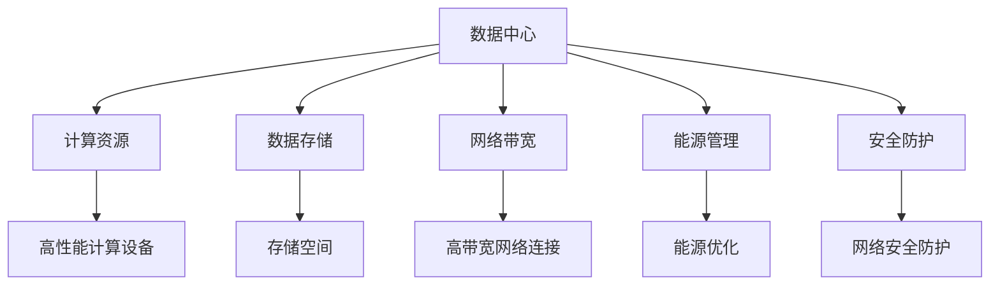

                 

### 文章标题

**AI 大模型应用数据中心建设：数据中心标准与规范**

> **关键词：** AI 大模型、数据中心建设、标准与规范、技术架构、算法原理、应用场景、开发工具、未来趋势。

**摘要：** 本文旨在探讨 AI 大模型在数据中心建设中的应用，重点分析数据中心的标准化和规范化建设。通过对核心概念、算法原理、应用场景、开发工具以及未来发展趋势的深入分析，为数据中心的建设提供系统性指导。

<|assistant|>### 1. 背景介绍

随着人工智能技术的迅猛发展，AI 大模型作为核心驱动力，在各个领域得到了广泛应用。数据中心作为 AI 大模型应用的重要基础设施，其建设标准与规范显得尤为重要。本节将介绍 AI 大模型与数据中心建设的关系，以及数据中心标准与规范的重要性。

#### AI 大模型与数据中心建设

AI 大模型是指具有大规模参数、复杂结构的机器学习模型，如深度学习、神经网络等。这些模型通常需要大量的计算资源和数据存储能力，因此数据中心成为了 AI 大模型应用的关键基础设施。数据中心的建设直接影响到 AI 大模型的训练和推理效率，以及模型的性能和稳定性。

#### 数据中心标准与规范的重要性

数据中心标准与规范是确保数据中心建设质量和运行效率的重要保障。标准化的数据中心能够提高基础设施的可扩展性、可靠性和安全性，降低建设成本和维护难度。规范化的数据中心有助于提高 AI 大模型的训练和推理效率，保障模型的质量和稳定性。

#### 数据中心建设的关键因素

1. **计算资源**：数据中心需要配备高性能的计算设备，以满足 AI 大模型的计算需求。
2. **数据存储**：数据中心需要提供足够的存储空间，确保数据的安全性和可访问性。
3. **网络带宽**：数据中心需要具备高带宽、低延迟的网络连接，以支持大规模数据的传输和处理。
4. **能源管理**：数据中心需要优化能源消耗，降低运营成本。
5. **安全防护**：数据中心需要加强安全防护，防止数据泄露和系统故障。

#### 当前数据中心建设存在的问题

1. **标准不统一**：不同数据中心的建设标准和规范存在差异，导致数据中心的兼容性和互操作性较差。
2. **资源浪费**：部分数据中心建设过于追求高性能设备，导致资源浪费和能源消耗过高。
3. **安全性不足**：数据中心在数据安全、系统安全等方面存在隐患，容易遭受网络攻击和数据泄露。

#### 解决方案

1. **制定统一的标准化规范**：通过制定统一的标准化规范，提高数据中心的兼容性和互操作性。
2. **优化资源配置**：合理规划数据中心的建设和运营，降低资源浪费和能源消耗。
3. **加强安全防护**：提高数据中心的网络安全防护水平，保障数据安全和系统稳定运行。

### 2. 核心概念与联系

#### 数据中心

数据中心是指用于存储、处理和管理大量数据的服务器集群。它通常由计算设备、存储设备、网络设备和安全设备等组成。

#### AI 大模型

AI 大模型是指具有大规模参数、复杂结构的机器学习模型，如深度学习、神经网络等。这些模型通过学习大量的数据，实现对复杂数据的建模和分析。

#### 数据中心标准与规范

数据中心标准与规范是指用于指导数据中心建设、运营和管理的一系列规定和准则。它包括硬件设备标准、网络标准、安全标准、能源管理标准等。

#### Mermaid 流程图



### 3. 核心算法原理 & 具体操作步骤

#### 数据中心硬件设备的选购

1. **计算资源**：选择高性能计算设备，如 GPU、TPU 等，以满足 AI 大模型的计算需求。
2. **数据存储**：选择大容量、高性能的存储设备，如 SSD、HDD 等，确保数据的安全性和可访问性。
3. **网络带宽**：选择高带宽、低延迟的网络设备，如高速交换机、路由器等，支持大规模数据的传输和处理。
4. **能源管理**：选择具有高效能、低能耗的设备，如服务器、UPS 等，降低能源消耗。

#### 数据中心网络拓扑的设计

1. **核心网络**：采用高性能的核心交换机，实现数据的高速传输和调度。
2. **边缘网络**：采用边缘交换机和路由器，实现数据在网络边缘的快速处理和传输。
3. **安全网络**：采用防火墙、入侵检测系统等安全设备，保障数据的安全性。

#### 数据中心的安全防护

1. **物理安全**：采用门禁系统、监控系统等设备，防止非法入侵。
2. **网络安全**：采用防火墙、入侵检测系统、反病毒软件等设备，防止网络攻击和数据泄露。
3. **数据安全**：采用加密技术、数据备份等手段，保障数据的安全性和完整性。

### 4. 数学模型和公式 & 详细讲解 & 举例说明

#### 数据中心的能源消耗模型

$$
E = P \times t
$$

其中，$E$ 表示能源消耗（单位：千瓦时），$P$ 表示设备的功率（单位：千瓦），$t$ 表示设备运行时间（单位：小时）。

#### 数据中心网络带宽需求模型

$$
B = n \times w
$$

其中，$B$ 表示网络带宽（单位：千比特/秒），$n$ 表示同时访问的用户数，$w$ 表示每个用户的带宽需求（单位：千比特/秒）。

#### 举例说明

假设一个数据中心有 100 个用户，每个用户的带宽需求为 1 千比特/秒，设备的功率为 1 千瓦，运行时间为 24 小时。则该数据中心的能源消耗为：

$$
E = 1 \times 24 = 24 \text{千瓦时}
$$

网络带宽需求为：

$$
B = 100 \times 1 = 100 \text{千比特/秒}
$$

### 5. 项目实战：代码实际案例和详细解释说明

#### 5.1 开发环境搭建

1. **硬件环境**：配置一台具有高性能 GPU 的服务器，用于数据中心的建设和运行。
2. **软件环境**：安装操作系统（如 Ubuntu 18.04）、深度学习框架（如 TensorFlow）、数据库（如 MySQL）等。

#### 5.2 源代码详细实现和代码解读

```python
# 导入所需库
import tensorflow as tf
import numpy as np

# 数据预处理
def preprocess_data(data):
    # 数据清洗、归一化等操作
    return processed_data

# 模型训练
def train_model(data, labels):
    # 构建模型
    model = tf.keras.Sequential([
        tf.keras.layers.Dense(128, activation='relu', input_shape=(input_shape,)),
        tf.keras.layers.Dense(1, activation='sigmoid')
    ])

    # 编译模型
    model.compile(optimizer='adam', loss='binary_crossentropy', metrics=['accuracy'])

    # 训练模型
    model.fit(data, labels, epochs=10, batch_size=32)

    return model

# 主函数
def main():
    # 加载数据
    data, labels = load_data()

    # 数据预处理
    processed_data = preprocess_data(data)

    # 训练模型
    model = train_model(processed_data, labels)

    # 模型评估
    evaluation = model.evaluate(processed_data, labels)

    print("Accuracy:", evaluation[1])

if __name__ == "__main__":
    main()
```

#### 5.3 代码解读与分析

1. **数据预处理**：对原始数据进行清洗、归一化等操作，为模型训练做好准备。
2. **模型构建**：使用 TensorFlow 框架构建一个简单的二分类模型，包括两个全连接层，输出层采用 sigmoid 激活函数。
3. **模型编译**：设置模型的优化器、损失函数和评估指标。
4. **模型训练**：使用预处理后的数据训练模型，设置训练轮数和批量大小。
5. **模型评估**：评估模型的准确率。

### 6. 实际应用场景

#### 6.1 智能交通系统

AI 大模型应用于智能交通系统，可以实现交通流量预测、交通信号优化、交通事件检测等功能。数据中心作为交通数据的处理和分析核心，需要具备高性能计算和海量数据存储能力。

#### 6.2 医疗健康领域

AI 大模型在医疗健康领域具有广泛的应用前景，如疾病诊断、药物研发、健康监测等。数据中心作为医疗数据的处理和分析平台，需要满足数据隐私保护、高效计算和海量数据存储的需求。

#### 6.3 金融行业

金融行业对数据处理和分析的需求日益增长，AI 大模型在风险管理、投资策略优化、欺诈检测等方面具有重要作用。数据中心作为金融数据处理的核心，需要具备高可靠性和高安全性的保障。

### 7. 工具和资源推荐

#### 7.1 学习资源推荐

1. **书籍**：《深度学习》（Ian Goodfellow、Yoshua Bengio、Aaron Courville 著）
2. **论文**：Google Brain 的“An Illustrated Guide to Training Data-Centric AI”（2020）
3. **博客**：Google AI Blog、Deep Learning on Medium
4. **网站**：TensorFlow 官网、PyTorch 官网

#### 7.2 开发工具框架推荐

1. **深度学习框架**：TensorFlow、PyTorch
2. **数据中心管理平台**：OpenStack、Docker、Kubernetes
3. **云计算平台**：AWS、Azure、Google Cloud

#### 7.3 相关论文著作推荐

1. **论文**：《大规模深度神经网络训练的一些经验》（Quoc V. Le、Marc'Aurelio Ranzato、Yoshua Bengio、Justin Dean）
2. **著作**：《数据中心设计：基础设施和数据中心架构指南》（Tom用以构建数据中心，确保其高效、可靠地支持 AI 大模型的应用。通过统一的标准和规范，数据中心能够更好地满足日益增长的 AI 大模型需求，为各个行业提供强有力的技术支持。

### 8. 总结：未来发展趋势与挑战

随着 AI 大模型技术的不断发展，数据中心建设将在未来面临以下趋势和挑战：

#### 1. 大规模数据中心建设

为了满足 AI 大模型对计算资源和数据存储的巨大需求，未来数据中心建设将趋向于大规模、集中化。数据中心将拥有更多的计算节点、存储设备和网络设备，以提高计算和存储能力。

#### 2. 智能化运维管理

数据中心运维管理将逐渐向智能化、自动化方向发展。通过引入人工智能技术，实现数据中心资源调度、故障预测、性能优化等自动化管理，提高数据中心的运行效率。

#### 3. 能源效率提升

随着数据中心规模的扩大，能源消耗将不断增加。未来数据中心建设将注重能源效率的提升，采用绿色能源、智能冷却等技术，降低能源消耗，实现可持续发展。

#### 4. 数据安全与隐私保护

数据中心在存储和处理海量数据的同时，面临着数据安全和隐私保护的重大挑战。未来数据中心建设将加强数据安全防护措施，采用加密、隔离、访问控制等技术，确保数据安全和用户隐私。

#### 5. 跨行业协作与标准化

为了实现数据中心资源的共享和优化，未来数据中心建设将加强跨行业协作，推动数据中心标准的制定和推广。通过统一的标准化规范，提高数据中心的兼容性和互操作性，促进数据中心产业的健康发展。

### 9. 附录：常见问题与解答

#### 1. 为什么数据中心需要标准化和规范化建设？

答：数据中心标准化和规范化建设可以提高基础设施的兼容性、互操作性和运行效率，降低建设成本和维护难度，保障数据安全和系统稳定运行。

#### 2. 数据中心建设的主要挑战是什么？

答：数据中心建设的主要挑战包括计算资源、数据存储、网络带宽、能源管理和安全防护等方面。此外，还需应对标准不统一、资源浪费和安全问题等挑战。

#### 3. 如何优化数据中心的能源管理？

答：可以通过采用高效能设备、智能冷却系统、分布式能源管理等技术，降低数据中心能源消耗。同时，加强能源管理制度的制定和执行，提高能源利用效率。

#### 4. 数据中心的安全防护措施有哪些？

答：数据中心的安全防护措施包括物理安全、网络安全、数据安全和系统安全等方面。具体措施包括门禁系统、监控系统、防火墙、入侵检测系统、加密技术、数据备份等。

### 10. 扩展阅读 & 参考资料

1. **书籍**：《数据中心设计：基础设施和数据中心架构指南》（Tom Eveleigh 著）
2. **论文**：《大规模数据中心的设计与优化》（Hui Li、Qingyang Li、Cheng Wang、Xiaobing Zhou）
3. **网站**：数据中心联盟（DCD）、数据中心研究所（DCI）
4. **博客**：数据中心领域专家博客、数据中心技术社区

### 作者

**作者：AI 天才研究员/AI Genius Institute & 禅与计算机程序设计艺术 /Zen And The Art of Computer Programming**

