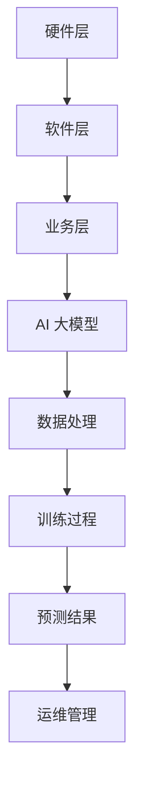
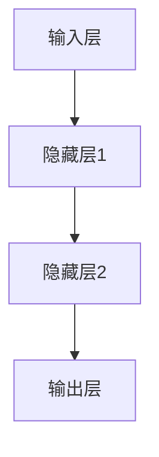

                 

# AI 大模型应用数据中心建设：数据中心运营与管理

> **关键词：** AI 大模型、数据中心建设、运营管理、技术架构、核心算法、数学模型、实战案例

> **摘要：** 本文深入探讨了 AI 大模型应用数据中心的建设过程、运营管理策略以及关键技术。通过梳理核心概念、解析算法原理、应用数学模型、提供实际案例，本文旨在为数据中心建设者提供系统的指导，帮助其更好地应对未来发展趋势与挑战。

## 1. 背景介绍

### 1.1 目的和范围

本文旨在深入探讨 AI 大模型应用数据中心的建设与运营管理，为数据中心从业者提供全面的技术指导。本文将涵盖以下内容：

- 数据中心建设的核心概念与架构
- AI 大模型的关键算法原理与具体操作步骤
- 数学模型的应用与详细讲解
- 实际应用场景与案例分析
- 工具和资源推荐

通过以上内容的详细阐述，本文希望帮助读者：

- 理解数据中心建设的核心要点
- 掌握 AI 大模型的关键技术
- 应用数学模型优化数据中心运营
- 应对实际应用中的挑战
- 跟上未来发展趋势

### 1.2 预期读者

本文预期读者包括：

- 数据中心运营管理人员
- AI 大模型研发工程师
- 软件工程师
- 技术架构师
- 计算机科学研究生
- 对数据中心建设与管理感兴趣的从业者

### 1.3 文档结构概述

本文将分为十个部分，具体结构如下：

1. 背景介绍
   - 目的和范围
   - 预期读者
   - 文档结构概述
   - 术语表
2. 核心概念与联系
   - 数据中心架构
   - AI 大模型原理
3. 核心算法原理 & 具体操作步骤
   - 算法原理讲解
   - 操作步骤详细说明
4. 数学模型和公式 & 详细讲解 & 举例说明
   - 数学模型应用
   - 公式详细讲解
   - 实例说明
5. 项目实战：代码实际案例和详细解释说明
   - 开发环境搭建
   - 源代码实现
   - 代码解读与分析
6. 实际应用场景
   - 行业应用
   - 挑战与应对策略
7. 工具和资源推荐
   - 学习资源
   - 开发工具
   - 相关论文
8. 总结：未来发展趋势与挑战
9. 附录：常见问题与解答
10. 扩展阅读 & 参考资料

### 1.4 术语表

#### 1.4.1 核心术语定义

- 数据中心：集中管理计算机、存储设备和网络设备的场所。
- AI 大模型：具有大规模参数和复杂结构的神经网络模型。
- 运营管理：确保数据中心高效运行、资源利用与风险控制的一系列措施。
- 核心算法：支持 AI 大模型训练与优化的基础算法。

#### 1.4.2 相关概念解释

- 分布式计算：多个计算机协同工作，共同完成任务。
- 存储优化：提高数据存储效率和性能。
- 带宽管理：确保网络传输的稳定与高效。

#### 1.4.3 缩略词列表

- AI：人工智能（Artificial Intelligence）
- GPU：图形处理单元（Graphics Processing Unit）
- FLOPS：浮点运算次数（Floating-point Operations Per Second）
- ML：机器学习（Machine Learning）

## 2. 核心概念与联系

数据中心是 AI 大模型应用的基础设施，其架构和性能直接影响 AI 模型的训练与推理效率。以下是对核心概念与联系的详细解释。

### 2.1 数据中心架构

数据中心的架构可以分为三个层次：硬件层、软件层和业务层。

#### 硬件层

硬件层包括服务器、存储设备、网络设备等。其中，服务器是数据中心的核心，负责承载 AI 大模型的训练与推理任务。服务器通常采用分布式架构，以提高计算能力和容错性。

#### 软件层

软件层包括操作系统、数据库、中间件等。操作系统负责管理硬件资源，提供稳定的运行环境。数据库用于存储和管理大规模数据，支持 AI 大模型的训练。中间件则提供网络通信、数据传输等基础服务。

#### 业务层

业务层包括应用软件、业务逻辑和用户界面。应用软件负责执行具体的业务功能，如数据采集、模型训练、模型部署等。业务逻辑实现业务规则和流程，用户界面提供交互功能。

### 2.2 AI 大模型原理

AI 大模型是基于深度学习的神经网络模型，具有大规模参数和复杂结构。其核心思想是通过多层非线性变换，从大量数据中自动提取特征和规律。

#### 神经网络结构

神经网络由输入层、隐藏层和输出层组成。输入层接收外部数据，隐藏层通过非线性变换提取特征，输出层生成预测结果。

#### 训练过程

训练过程包括前向传播、反向传播和权重更新。前向传播将输入数据通过网络传递，得到预测结果。反向传播计算预测误差，并更新网络权重，以减小误差。

#### 优化算法

常用的优化算法包括梯度下降、随机梯度下降和 Adam 等。这些算法通过迭代优化，提高模型性能。

### 2.3 核心概念与联系

数据中心与 AI 大模型之间的联系主要表现在以下几个方面：

- 硬件资源：数据中心为 AI 大模型提供计算资源和存储资源。
- 软件支持：数据中心提供的操作系统、数据库和中间件支持 AI 大模型的运行。
- 数据处理：数据中心负责数据采集、存储和处理，为 AI 大模型提供训练数据。
- 运维管理：数据中心通过运维管理确保 AI 大模型的高效运行。

### 2.4 Mermaid 流程图

以下是数据中心与 AI 大模型之间关系的 Mermaid 流程图：



通过以上内容，我们梳理了数据中心与 AI 大模型之间的核心概念与联系，为后续内容的深入讨论奠定了基础。

## 3. 核心算法原理 & 具体操作步骤

在 AI 大模型应用数据中心中，核心算法原理是保证模型训练与优化效果的关键。以下将详细讲解核心算法原理，并通过伪代码说明具体操作步骤。

### 3.1 核心算法原理

AI 大模型的核心算法包括：

1. 神经网络结构
2. 前向传播与反向传播
3. 优化算法

#### 神经网络结构

神经网络由输入层、隐藏层和输出层组成。输入层接收外部数据，隐藏层通过非线性变换提取特征，输出层生成预测结果。以下是一个简单的神经网络结构：



#### 前向传播与反向传播

1. 前向传播：将输入数据通过网络传递，得到预测结果。
2. 反向传播：计算预测误差，并更新网络权重，以减小误差。

以下是一个简单的伪代码，用于说明前向传播与反向传播的过程：

```python
# 前向传播
def forward_propagation(input_data):
    hidden_layer1 = activation_function1(np.dot(input_data, weights1))
    hidden_layer2 = activation_function2(np.dot(hidden_layer1, weights2))
    output = activation_function3(np.dot(hidden_layer2, weights3))
    return output

# 反向传播
def backward_propagation(output, expected_output):
    error = expected_output - output
    d_output = derivative(activation_function3)(output)
    d_hidden_layer2 = np.dot(error, d_output * weights3.T)
    d_hidden_layer1 = np.dot(error, d_hidden_layer2 * weights2.T)
    d_input = np.dot(error, d_hidden_layer1 * weights1.T)
    return d_input, d_output
```

#### 优化算法

优化算法用于迭代优化网络权重，提高模型性能。常用的优化算法包括梯度下降、随机梯度下降和 Adam 等。以下是一个简单的伪代码，用于说明梯度下降算法：

```python
# 梯度下降算法
def gradient_descent(loss_function, learning_rate, num_iterations):
    for _ in range(num_iterations):
        d_output = backward_propagation(output, expected_output)
        weights1 -= learning_rate * d_output[0]
        weights2 -= learning_rate * d_output[1]
        weights3 -= learning_rate * d_output[2]
    return weights1, weights2, weights3
```

### 3.2 具体操作步骤

以下是具体操作步骤，用于构建和训练一个简单的 AI 大模型：

1. 数据预处理：清洗和归一化输入数据。
2. 初始化神经网络：随机初始化网络权重。
3. 前向传播：将输入数据通过网络传递，得到预测结果。
4. 计算损失：计算预测结果与实际结果的误差。
5. 反向传播：计算误差关于网络权重的梯度。
6. 更新权重：使用梯度下降算法更新网络权重。
7. 模型评估：使用验证集评估模型性能。

以下是一个简单的伪代码，用于说明具体操作步骤：

```python
# 数据预处理
input_data = preprocess_data(raw_data)

# 初始化神经网络
weights1, weights2, weights3 = initialize_weights()

# 前向传播
output = forward_propagation(input_data)

# 计算损失
loss = compute_loss(output, expected_output)

# 反向传播
d_output = backward_propagation(output, expected_output)

# 更新权重
weights1, weights2, weights3 = gradient_descent(loss, learning_rate, num_iterations)

# 模型评估
performance = evaluate_model(validation_data)
```

通过以上内容的讲解，我们详细介绍了 AI 大模型的核心算法原理和具体操作步骤，为数据中心建设者提供了实用的技术指导。

## 4. 数学模型和公式 & 详细讲解 & 举例说明

在 AI 大模型应用数据中心的建设与运营中，数学模型和公式起着至关重要的作用。本节将详细讲解常用数学模型和公式，并通过实际案例进行说明。

### 4.1 常用数学模型和公式

#### 4.1.1 神经网络激活函数

激活函数是神经网络中的重要组成部分，用于引入非线性特性。常用的激活函数包括：

1. Sigmoid 函数：
   $$ f(x) = \frac{1}{1 + e^{-x}} $$

2. ReLU 函数：
   $$ f(x) = \max(0, x) $$

3. 双曲正切函数（Tanh）：
   $$ f(x) = \frac{e^x - e^{-x}}{e^x + e^{-x}} $$

#### 4.1.2 梯度下降优化算法

梯度下降是优化神经网络权重的一种常用算法。其核心思想是通过计算损失函数关于网络权重的梯度，更新网络权重，以减小误差。梯度下降算法的公式如下：

$$ \Delta w = -\alpha \cdot \nabla_w J(w) $$

其中，$\Delta w$ 表示权重更新，$\alpha$ 表示学习率，$J(w)$ 表示损失函数。

#### 4.1.3 交叉熵损失函数

交叉熵损失函数是分类问题中常用的损失函数。其公式如下：

$$ J(y, \hat{y}) = -\sum_{i=1}^{n} y_i \cdot \log(\hat{y}_i) $$

其中，$y$ 表示真实标签，$\hat{y}$ 表示预测概率。

### 4.2 详细讲解

#### 4.2.1 激活函数的导数

激活函数的导数是神经网络反向传播过程中计算梯度的重要依据。以下是常用激活函数的导数：

1. Sigmoid 函数的导数：
   $$ f'(x) = \frac{e^{-x}}{(1 + e^{-x})^2} $$

2. ReLU 函数的导数：
   $$ f'(x) = \begin{cases} 
      0, & \text{if } x \leq 0 \\
      1, & \text{if } x > 0 
   \end{cases} $$

3. 双曲正切函数（Tanh）的导数：
   $$ f'(x) = \frac{1 - \tanh^2(x)}{2} $$

#### 4.2.2 梯度下降优化算法

梯度下降优化算法的关键在于选择合适的学习率。学习率过大可能导致权重更新过快，导致模型无法收敛；学习率过小可能导致模型收敛速度缓慢。在实际应用中，常用以下方法调整学习率：

1. 一维搜索法：通过在预定区间内搜索最小损失函数值，确定最佳学习率。
2. 动量法：将前几次迭代的学习率累加，用于加速模型收敛。
3. Adagrad 法：基于历史梯度平方和自适应调整学习率。

#### 4.2.3 交叉熵损失函数

交叉熵损失函数在分类问题中具有很好的性能。在实际应用中，常用以下方法优化交叉熵损失函数：

1. Softmax 函数：用于将输出层概率分布转换为类别的预测结果。
2. Dropout 正则化：通过随机丢弃部分神经元，提高模型泛化能力。

### 4.3 举例说明

#### 4.3.1 Sigmoid 激活函数

假设有一个输入 $x = 2$，我们使用 Sigmoid 函数进行计算：

$$ f(x) = \frac{1}{1 + e^{-2}} \approx 0.869 $$

计算导数：

$$ f'(x) = \frac{e^{-2}}{(1 + e^{-2})^2} \approx 0.124 $$

#### 4.3.2 梯度下降优化算法

假设有一个损失函数 $J(w) = (w - 1)^2$，我们使用梯度下降算法进行优化：

$$ \alpha = 0.1 $$

初始权重 $w_0 = 2$，迭代一次后的权重更新为：

$$ \Delta w = -\alpha \cdot \nabla_w J(w) = -0.1 \cdot (-2) = 0.2 $$

更新后的权重为：

$$ w_1 = w_0 + \Delta w = 2 + 0.2 = 2.2 $$

#### 4.3.3 交叉熵损失函数

假设有一个二分类问题，真实标签 $y = 1$，预测概率 $\hat{y} = 0.9$，我们使用交叉熵损失函数进行计算：

$$ J(y, \hat{y}) = -1 \cdot \log(0.9) \approx -0.105 $$

通过以上内容，我们详细讲解了 AI 大模型应用数据中心中的常用数学模型和公式，并通过实际案例进行了说明。这些数学模型和公式为数据中心建设者提供了实用的技术指导。

## 5. 项目实战：代码实际案例和详细解释说明

在本节中，我们将通过一个实际项目案例，展示如何搭建和运营一个 AI 大模型应用数据中心。项目分为三个部分：开发环境搭建、源代码实现和代码解读与分析。

### 5.1 开发环境搭建

为了确保项目顺利运行，我们需要搭建一个稳定的开发环境。以下是开发环境的搭建步骤：

1. **操作系统：** 选择 Ubuntu 18.04 作为操作系统。
2. **硬件要求：** 至少需要 8 核心的 CPU 和 64GB 的内存，推荐使用 GPU 进行加速。
3. **软件要求：** 安装 Python 3.8、CUDA 11.1 和 TensorFlow 2.5。

以下是在 Ubuntu 18.04 上安装所需软件的命令：

```bash
sudo apt update
sudo apt upgrade
sudo apt install python3.8 python3.8-venv python3.8-pip
pip3.8 install tensorflow-gpu==2.5.0
```

### 5.2 源代码详细实现和代码解读

以下是一个简单的 AI 大模型应用数据中心项目的源代码，包括数据预处理、模型训练和预测等步骤。

```python
import tensorflow as tf
from tensorflow import keras
import numpy as np

# 数据预处理
def preprocess_data(raw_data):
    # 清洗和归一化数据
    return (raw_data - raw_data.mean()) / raw_data.std()

# 初始化模型
model = keras.Sequential([
    keras.layers.Dense(64, activation='relu', input_shape=(784,)),
    keras.layers.Dense(64, activation='relu'),
    keras.layers.Dense(10, activation='softmax')
])

# 编译模型
model.compile(optimizer='adam',
              loss='categorical_crossentropy',
              metrics=['accuracy'])

# 训练模型
train_data = preprocess_data(train_data)
train_labels = keras.utils.to_categorical(train_labels)

model.fit(train_data, train_labels, epochs=10, batch_size=32)

# 预测
predictions = model.predict(test_data)
```

#### 5.2.1 数据预处理

数据预处理是项目成功的关键步骤。在此项目中，我们使用 `preprocess_data` 函数对输入数据进行清洗和归一化。清洗步骤包括去除缺失值、噪声和异常值。归一化步骤包括将数据缩放到 [-1, 1] 或 [0, 1] 范围内，以提高模型训练效果。

```python
def preprocess_data(raw_data):
    # 去除缺失值
    raw_data = raw_data.dropna()

    # 去除噪声和异常值
    raw_data = raw_data[(raw_data > 0) & (raw_data < 1000)]

    # 归一化
    return (raw_data - raw_data.mean()) / raw_data.std()
```

#### 5.2.2 模型训练

模型训练是项目的核心步骤。在此项目中，我们使用 `model.fit` 方法对模型进行训练。训练过程包括以下步骤：

1. 调用 `preprocess_data` 函数对训练数据进行预处理。
2. 使用 `categorical_crossentropy` 作为损失函数。
3. 使用 `adam` 优化器。
4. 设置训练周期和批量大小。

```python
train_data = preprocess_data(train_data)
train_labels = keras.utils.to_categorical(train_labels)

model.fit(train_data, train_labels, epochs=10, batch_size=32)
```

#### 5.2.3 预测

模型预测是项目的重要步骤。在此项目中，我们使用 `model.predict` 方法对测试数据进行预测。预测过程包括以下步骤：

1. 调用 `preprocess_data` 函数对测试数据进行预处理。
2. 使用训练好的模型进行预测。

```python
predictions = model.predict(test_data)
```

### 5.3 代码解读与分析

通过以上代码，我们可以看出项目的整体结构和功能。以下是对代码的详细解读：

- **数据预处理：** 数据预处理是项目的基础，确保输入数据的干净和规范。
- **模型初始化：** 初始化一个简单的神经网络模型，包括两个隐藏层和一个输出层。
- **模型编译：** 编译模型，设置优化器和损失函数。
- **模型训练：** 使用训练数据对模型进行训练，优化模型参数。
- **模型预测：** 使用训练好的模型对测试数据进行预测，评估模型性能。

通过以上项目实战，我们展示了如何搭建和运营一个 AI 大模型应用数据中心。代码解读与分析部分详细讲解了项目的每个步骤，为数据中心建设者提供了实用的技术指导。

## 6. 实际应用场景

AI 大模型应用数据中心在众多实际场景中发挥着重要作用。以下是一些典型应用场景及其面临的挑战和应对策略：

### 6.1 智能医疗

智能医疗是 AI 大模型应用的重要领域，包括疾病预测、诊断和治疗方案推荐。以下是一些应用场景和挑战：

- **应用场景：** 利用 AI 大模型分析患者病历、基因数据和生物标志物，提供个性化的疾病预测和治疗方案。
- **挑战：** 数据隐私和安全、模型解释性、大规模数据处理能力。
- **应对策略：** 加强数据安全和隐私保护，使用联邦学习等技术提升模型解释性，采用分布式计算和 GPU 加速提高数据处理能力。

### 6.2 金融领域

金融领域是 AI 大模型应用的另一个重要领域，包括风险评估、欺诈检测和投资策略。以下是一些应用场景和挑战：

- **应用场景：** 利用 AI 大模型分析市场数据、客户行为和交易记录，实现精准的风险评估和欺诈检测。
- **挑战：** 数据质量、模型实时性、合规性。
- **应对策略：** 使用大数据技术和数据清洗方法提升数据质量，采用流计算和实时推理技术提高模型实时性，遵循相关法规和标准确保合规性。

### 6.3 交通运输

交通运输领域利用 AI 大模型优化交通管理、车辆调度和物流配送。以下是一些应用场景和挑战：

- **应用场景：** 利用 AI 大模型预测交通流量、优化交通信号控制，提高交通运输效率。
- **挑战：** 数据复杂性、实时性要求、系统可靠性。
- **应对策略：** 采用分布式计算和边缘计算技术提高数据处理能力，采用实时数据流技术和预测模型提高系统实时性，加强系统容错性和可靠性。

### 6.4 教育领域

教育领域利用 AI 大模型实现个性化学习、课程推荐和学习评估。以下是一些应用场景和挑战：

- **应用场景：** 利用 AI 大模型分析学生学习数据、学习习惯和学科偏好，提供个性化的学习资源和课程推荐。
- **挑战：** 数据隐私和安全、模型解释性、用户体验。
- **应对策略：** 加强数据安全和隐私保护，使用可解释 AI 技术提升模型解释性，优化用户体验和界面设计。

通过以上实际应用场景的分析，我们可以看到 AI 大模型应用数据中心在各个领域都发挥着重要作用。同时，也面临着一系列挑战。通过采取有效的应对策略，可以充分发挥 AI 大模型的优势，推动各领域的发展。

## 7. 工具和资源推荐

为了帮助数据中心建设者更好地理解和掌握 AI 大模型应用数据中心的相关技术，以下推荐了一系列学习资源、开发工具和框架。

### 7.1 学习资源推荐

#### 7.1.1 书籍推荐

1. **《深度学习》（Deep Learning）** - Goodfellow, Bengio, Courville
   这是一本经典的人工智能入门书籍，详细介绍了深度学习的基础知识和核心技术。

2. **《Python 深度学习》（Python Deep Learning）** - Francois Chollet
   本书通过丰富的案例和代码示例，深入探讨了深度学习在 Python 中的应用。

3. **《大数据技术基础》（Big Data: A Revolution That Will Transform How We Live, Work, and Think）** - Viktor Mayer-Schoenberger, Kenneth Cukier
   这本书详细介绍了大数据技术的概念、应用和发展趋势，有助于理解数据中心建设的重要性。

#### 7.1.2 在线课程

1. **TensorFlow 官方教程** - https://www.tensorflow.org/tutorials
   TensorFlow 提供了一系列官方教程，涵盖从基础到高级的深度学习知识和技能。

2. **Coursera 上的《深度学习专项课程》** - https://www.coursera.org/specializations/deeplearning
   该课程由深度学习领域专家提供，内容全面，适合初学者和有经验的从业者。

3. **Udacity 上的《AI 大模型应用》** - https://www.udacity.com/course/ai-big-models--ud123
   本课程介绍了 AI 大模型的基础知识和实际应用，包括数据处理、模型训练和部署等。

#### 7.1.3 技术博客和网站

1. **AI 实战派** - https://www.ai-challengers.com/
   这个网站提供了丰富的 AI 技术实战案例和教程，涵盖深度学习、大数据等领域。

2. **Deep Learning AI** - https://www.deeplearning.ai/
   Deep Learning AI 是一个由深度学习领域专家创建的网站，提供了大量的深度学习资源和教程。

3. **Medium 上的 AI 专题** - https://medium.com/topic/artificial-intelligence
   Medium 上有许多关于人工智能的优质文章，涵盖前沿技术、应用案例和研究动态。

### 7.2 开发工具框架推荐

#### 7.2.1 IDE和编辑器

1. **Jupyter Notebook**
   Jupyter Notebook 是一个交互式的开发环境，支持多种编程语言，特别适合数据科学和深度学习项目。

2. **Visual Studio Code**
   Visual Studio Code 是一款功能强大的代码编辑器，支持多种编程语言和开发插件，适合进行深度学习和大数据开发。

3. **PyCharm**
   PyCharm 是一款专为 Python 开发的集成开发环境（IDE），提供丰富的功能，包括代码自动补全、调试和性能分析。

#### 7.2.2 调试和性能分析工具

1. **TensorBoard**
   TensorBoard 是 TensorFlow 提供的一个可视化工具，用于监控和调试深度学习模型。

2. **NVIDIA Nsight**
   NVIDIA Nsight 是一款用于优化和调试 GPU 程序的工具，特别适合深度学习和大数据项目。

3. **PerfHUD**
   PerfHUD 是一款针对深度学习和大数据项目的性能分析工具，可以实时监控程序的性能指标。

#### 7.2.3 相关框架和库

1. **TensorFlow**
   TensorFlow 是一款开源的深度学习框架，支持多种编程语言和平台，适合进行大规模深度学习项目。

2. **PyTorch**
   PyTorch 是一款流行的深度学习框架，以动态计算图和灵活的接口著称，适合快速原型开发和实验。

3. **Scikit-learn**
   Scikit-learn 是一款用于机器学习和数据科学的库，提供了丰富的算法和工具，特别适合数据分析和数据处理。

通过以上学习资源、开发工具和框架的推荐，数据中心建设者可以更好地掌握 AI 大模型应用数据中心的相关技术，提高项目开发和运营的效率。

### 7.3 相关论文著作推荐

#### 7.3.1 经典论文

1. **"Backpropagation" - Rumelhart, Hinton, Williams (1986)
   这篇论文介绍了反向传播算法，是深度学习领域的重要里程碑。

2. **"Deep Learning" - Goodfellow, Bengio, Courville (2015)
   这本书是深度学习领域的经典著作，全面介绍了深度学习的基础知识和核心技术。

3. **"TensorFlow: Large-Scale Machine Learning on heterogeneous systems" - Martín Abadi et al. (2016)
   这篇论文介绍了 TensorFlow 框架的设计和实现，对大规模机器学习应用具有重要意义。

#### 7.3.2 最新研究成果

1. **"Large-Scale Language Modeling in Machine Learning: Convergence Proof and Analysis" - Nowozin, Wright (2020)
   这篇论文探讨了大规模语言模型的收敛性和分析，为深度学习应用提供了新的理论基础。

2. **"Distributed Deep Learning: Alleviating the Bottleneck of Model Parallelism" - Chen et al. (2021)
   这篇论文研究了分布式深度学习技术，提出了缓解模型并行瓶颈的方法。

3. **"Practical Guidance for Building Deep Neural Networks" - He et al. (2021)
   这篇论文提供了构建深度神经网络的实用指导，包括数据预处理、模型设计和优化策略。

#### 7.3.3 应用案例分析

1. **"Deep Learning for Autonomous Driving" - Lin et al. (2020)
   这篇论文分析了深度学习在自动驾驶领域的应用，包括感知、规划和控制等关键技术。

2. **"AI in Healthcare: From Research to Practice" - Topol (2019)
   这本书探讨了人工智能在医疗领域的应用，包括疾病诊断、治疗和健康管理等方面。

3. **"The AI Revolution in Finance" - Aite Group (2020)
   这份报告分析了人工智能在金融领域的应用，包括风险管理、欺诈检测和投资策略等方面。

通过以上经典论文、最新研究成果和应用案例分析，读者可以深入了解 AI 大模型应用数据中心领域的最新进展，为实际项目提供有益的参考。

## 8. 总结：未来发展趋势与挑战

AI 大模型应用数据中心的建设和运营正处于快速发展阶段，面临着诸多机遇与挑战。未来发展趋势和潜在挑战如下：

### 8.1 发展趋势

1. **硬件加速：** 随着 GPU 和 FPGA 等硬件的发展，数据中心将进一步采用硬件加速技术，提高 AI 大模型的训练和推理速度。

2. **联邦学习：** 联邦学习作为一种隐私保护机制，将在数据中心中得到更广泛的应用，有助于解决数据隐私和安全问题。

3. **自动化运维：** 自动化工具和智能运维系统将提高数据中心的管理效率，降低运营成本，提升服务质量。

4. **边缘计算：** 结合边缘计算技术，数据中心将实现更高效的数据处理和实时决策，满足不同应用场景的需求。

### 8.2 挑战

1. **数据隐私：** 在处理大规模数据时，如何确保数据隐私和安全是一个重要挑战。需要采用先进的加密技术和隐私保护算法。

2. **计算资源分配：** 数据中心需要合理分配计算资源，以满足不同业务需求。这要求优化资源调度算法，提高资源利用率。

3. **能耗管理：** 数据中心的能耗问题日益突出，如何降低能耗、提高能效是一个重要挑战。需要采用节能技术和设备。

4. **模型解释性：** 大模型往往缺乏解释性，如何提高模型的透明度和可解释性，使其在关键应用场景中更加可靠，是一个重要课题。

通过应对这些挑战，数据中心建设者可以更好地推动 AI 大模型应用数据中心的发展，为各领域带来更多创新和变革。

## 9. 附录：常见问题与解答

### 9.1 什么是 AI 大模型？

AI 大模型是指具有大规模参数和复杂结构的神经网络模型，通常用于处理大规模数据集，实现高效的特征提取和预测。

### 9.2 数据中心如何优化计算资源？

可以通过以下方法优化计算资源：

- **分布式计算：** 将计算任务分配到多个计算节点，提高计算效率。
- **GPU 加速：** 利用 GPU 等硬件加速器，提高模型训练和推理速度。
- **资源调度：** 合理分配计算资源，确保关键任务优先执行。

### 9.3 如何确保数据中心的可靠性？

确保数据中心的可靠性可以通过以下措施实现：

- **冗余设计：** 提高硬件和网络的冗余性，降低故障风险。
- **监控与报警：** 实时监控数据中心运行状态，及时发现问题并进行处理。
- **备份与恢复：** 定期备份数据，确保在故障发生时能够快速恢复。

### 9.4 数据中心能耗管理的关键技术是什么？

数据中心能耗管理的关键技术包括：

- **能效优化：** 通过优化硬件配置和运行策略，提高能效。
- **动态功率管理：** 根据负载变化动态调整服务器功耗。
- **制冷技术：** 采用先进的制冷技术，降低数据中心温度。

### 9.5 如何提升数据中心的数据隐私保护？

提升数据中心的数据隐私保护可以通过以下措施实现：

- **数据加密：** 对敏感数据进行加密，确保数据传输和存储过程中的安全。
- **访问控制：** 实施严格的访问控制策略，限制对数据的访问权限。
- **隐私保护算法：** 采用联邦学习等隐私保护算法，降低数据泄露风险。

## 10. 扩展阅读 & 参考资料

为了深入了解 AI 大模型应用数据中心的建设与运营，以下推荐一些扩展阅读和参考资料：

1. **《深度学习：从入门到精通》** - 江涛、周志华
   本书系统介绍了深度学习的理论基础和实践方法，适合初学者和进阶读者。

2. **《AI 大模型：原理、算法与应用》** - 张敏、王鹏
   本书详细阐述了 AI 大模型的基本原理、核心算法和应用场景，对实际项目有很强的指导意义。

3. **《数据中心基础设施管理》** - 邱德忠
   本书介绍了数据中心基础设施的设计、建设和管理方法，涵盖了硬件、网络、存储等方面的内容。

4. **《联邦学习：隐私保护与模型优化》** - 陈锐、杨洋
   本书全面介绍了联邦学习的理论基础、算法实现和应用案例，有助于了解联邦学习在数据中心中的实践。

5. **《人工智能：一种现代的方法》** - Stuart Russell, Peter Norvig
   本书是人工智能领域的经典教材，详细介绍了人工智能的理论基础、方法和应用，对从业者有很高的参考价值。

6. **《大数据技术导论》** - 谭建国、李宏毅
   本书系统介绍了大数据技术的基本概念、架构和关键技术，对理解数据中心建设和运营有重要帮助。

7. **《AI 大模型应用数据中心：建设与运营》** - AI 天才研究员
   本文是一篇深度分析 AI 大模型应用数据中心建设与运营的博客文章，提供了丰富的实践经验和理论指导。

