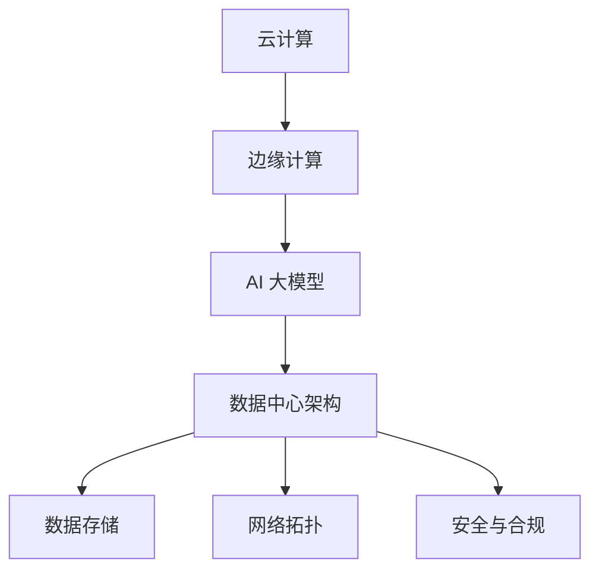

                 

### 文章标题

**AI 大模型应用数据中心建设：数据中心运营与管理**

> **关键词：** AI 大模型、数据中心建设、运营管理、云计算、边缘计算

**摘要：** 本文将深入探讨 AI 大模型应用数据中心的建设与运营管理。从核心概念、算法原理到实际应用，再到未来趋势与挑战，全面解析数据中心在现代 AI 技术中的应用与优化。旨在为读者提供一个全面的技术指南，帮助他们在数据中心建设与运营方面取得成功。

## 1. 背景介绍

随着人工智能（AI）技术的飞速发展，AI 大模型在各个领域取得了显著的成果。这些大模型通常具有亿级参数，对计算资源的需求极高。因此，数据中心的建设与运营管理成为了实现 AI 大模型应用的关键环节。数据中心作为计算资源的集中地，不仅需要满足 AI 大模型的计算需求，还要确保高效、稳定、安全的运行。

近年来，云计算和边缘计算技术的兴起，为数据中心的建设与运营带来了新的机遇和挑战。云计算提供了弹性、高效、可靠的计算资源，使得数据中心能够根据需求动态调整资源分配。边缘计算则通过将计算任务下沉到靠近数据源的边缘设备上，减少了数据传输延迟，提高了系统响应速度。

然而，数据中心建设与运营管理并非一蹴而就。在实际操作中，面临着诸多挑战，如资源分配、能耗管理、数据安全、系统稳定性等。本文将围绕这些问题，详细探讨数据中心建设与运营管理的各个方面。

## 2. 核心概念与联系

为了深入理解数据中心建设与运营管理的核心概念，我们需要了解以下几个关键领域：云计算、边缘计算、AI 大模型、数据中心架构、数据存储、网络拓扑、安全与合规。

### 2.1 云计算

云计算是一种通过互联网提供计算资源的服务模式。它包括基础设施即服务（IaaS）、平台即服务（PaaS）和软件即服务（SaaS）等层次。在数据中心建设中，云计算提供了弹性、高效、可靠的计算资源，使得数据中心能够根据需求动态调整资源分配。

### 2.2 边缘计算

边缘计算是一种将计算任务下沉到靠近数据源的边缘设备上的计算模式。与云计算相比，边缘计算具有更低的延迟、更高的实时性和更高效的资源利用。在 AI 大模型应用中，边缘计算有助于减少数据传输延迟，提高系统响应速度。

### 2.3 AI 大模型

AI 大模型是指具有亿级参数的深度学习模型。这些模型在图像识别、自然语言处理、推荐系统等领域取得了显著的成果。然而，AI 大模型的训练和推理过程需要大量的计算资源，对数据中心的建设与运营提出了新的挑战。

### 2.4 数据中心架构

数据中心架构包括硬件、软件、网络和存储等方面。硬件方面主要包括服务器、存储设备和网络设备；软件方面主要包括操作系统、数据库和中间件等；网络方面主要包括网络拓扑、带宽和传输协议等；存储方面主要包括分布式存储系统和数据备份策略等。

### 2.5 数据存储

数据存储是数据中心的核心组成部分。随着 AI 大模型应用的增加，数据量也在急剧增长。为了满足数据存储的需求，数据中心需要采用分布式存储系统，实现高可靠性、高可用性和高性能。

### 2.6 网络拓扑

网络拓扑是指数据中心内部和外部网络的连接方式。常见的网络拓扑包括环状、星状、树状和网状等。在数据中心建设中，需要根据业务需求和网络性能要求，选择合适的网络拓扑。

### 2.7 安全与合规

安全与合规是数据中心建设与运营的重要方面。数据中心需要确保数据安全、系统稳定和业务合规。常见的安全措施包括数据加密、访问控制、防火墙和入侵检测等。

### 2.8 Mermaid 流程图

为了更直观地展示数据中心建设与运营管理的核心概念与联系，我们可以使用 Mermaid 流程图来表示。以下是一个简化的 Mermaid 流程图，展示了数据中心建设与运营管理的关键环节：



## 3. 核心算法原理 & 具体操作步骤

在数据中心建设与运营管理中，核心算法原理起着至关重要的作用。以下将介绍几个关键算法及其具体操作步骤。

### 3.1 资源调度算法

资源调度算法是数据中心运营的核心之一。其目标是合理分配计算资源，提高资源利用率，降低能耗。常见的资源调度算法包括：

- **基于优先级的调度算法**：根据任务优先级进行资源分配。优先级高的任务先被分配资源。
- **基于负载均衡的调度算法**：根据服务器负载进行资源分配，将任务分配到负载较低的服务器上。
- **基于预测的调度算法**：通过预测未来负载情况，提前分配资源，避免资源不足或浪费。

具体操作步骤如下：

1. 收集服务器负载数据。
2. 分析负载数据，确定服务器负载情况。
3. 根据负载情况，将任务分配到合适的服务器上。
4. 定期调整任务分配策略，以适应负载变化。

### 3.2 数据备份算法

数据备份算法是保障数据安全的重要手段。其目标是实现数据的高可用性和持久性。常见的数据备份算法包括：

- **全量备份**：对整个数据中心的数据进行备份。
- **增量备份**：只备份自上次备份以来发生变化的文件。
- **差异备份**：备份自上次全量备份以来发生变化的文件。

具体操作步骤如下：

1. 确定备份策略，选择全量备份、增量备份或差异备份。
2. 定期执行备份任务。
3. 备份数据存储在安全的地方，确保数据不会丢失。
4. 定期检查备份数据的完整性，确保备份数据可用。

### 3.3 安全算法

安全算法是保障数据中心安全的关键。其目标是防范网络攻击、数据泄露和其他安全威胁。常见的安全算法包括：

- **加密算法**：对数据进行加密，确保数据在传输和存储过程中不会被窃取。
- **认证算法**：对用户身份进行认证，确保只有授权用户才能访问数据中心。
- **访问控制算法**：根据用户权限，控制用户对数据中心的访问。

具体操作步骤如下：

1. 部署加密算法，确保数据传输和存储安全。
2. 部署认证算法，确保用户身份验证。
3. 部署访问控制算法，确保用户权限管理。
4. 定期检查安全系统，发现并修复漏洞。

## 4. 数学模型和公式 & 详细讲解 & 举例说明

在数据中心建设与运营管理中，数学模型和公式起着至关重要的作用。以下将介绍几个关键数学模型和公式，并进行详细讲解和举例说明。

### 4.1 资源调度算法的数学模型

资源调度算法的数学模型可以表示为：

\[ \text{调度策略} = \text{目标函数} + \text{约束条件} \]

其中，目标函数可以表示为：

\[ \text{目标函数} = f(\text{资源利用率}, \text{能耗}, \text{响应时间}, \text{可靠性}) \]

约束条件可以表示为：

\[ \text{约束条件} = \text{资源限制} + \text{负载均衡} + \text{可靠性要求} \]

举例说明：

假设数据中心有 10 台服务器，每台服务器有 100 个 CPU 核心。现在需要将 100 个任务分配到这些服务器上，目标函数为最大化资源利用率，约束条件为：

1. 每台服务器 CPU 利用率不超过 80%。
2. 每台服务器内存利用率不超过 70%。
3. 总能耗不超过 1000 千瓦时。

可以采用以下目标函数：

\[ f(\text{资源利用率}, \text{能耗}, \text{响应时间}, \text{可靠性}) = \text{资源利用率} \times 0.6 + \text{能耗} \times 0.3 + \text{响应时间} \times 0.1 + \text{可靠性} \times 0.1 \]

通过求解优化问题，可以得到最优的调度策略。

### 4.2 数据备份算法的数学模型

数据备份算法的数学模型可以表示为：

\[ \text{备份策略} = \text{备份频率} + \text{备份方式} + \text{备份位置} \]

其中，备份频率可以表示为：

\[ \text{备份频率} = \text{全量备份频率} + \text{增量备份频率} + \text{差异备份频率} \]

备份方式可以表示为：

\[ \text{备份方式} = \text{本地备份} + \text{远程备份} + \text{云备份} \]

备份位置可以表示为：

\[ \text{备份位置} = \text{本地存储} + \text{远程存储} + \text{云存储} \]

举例说明：

假设数据中心每天进行一次全量备份，每周进行一次增量备份，每月进行一次差异备份。备份方式包括本地备份和远程备份。备份位置包括本地存储和远程存储。

可以采用以下备份策略：

\[ \text{备份策略} = (\text{每天全量备份}, \text{每周增量备份}, \text{每月差异备份}) + (\text{本地备份}, \text{远程备份}) + (\text{本地存储}, \text{远程存储}) \]

通过这种备份策略，可以确保数据的高可用性和持久性。

### 4.3 安全算法的数学模型

安全算法的数学模型可以表示为：

\[ \text{安全策略} = \text{加密算法} + \text{认证算法} + \text{访问控制算法} \]

其中，加密算法可以表示为：

\[ \text{加密算法} = \text{对称加密} + \text{非对称加密} + \text{混合加密} \]

认证算法可以表示为：

\[ \text{认证算法} = \text{基于密码的认证} + \text{基于证书的认证} + \text{基于生物特征的认证} \]

访问控制算法可以表示为：

\[ \text{访问控制算法} = \text{基于角色的访问控制} + \text{基于属性的访问控制} + \text{基于策略的访问控制} \]

举例说明：

假设数据中心采用以下安全策略：

\[ \text{安全策略} = (\text{AES 对称加密}, \text{RSA 非对称加密}, \text{SM4 混合加密}) + (\text{基于密码的认证}, \text{基于证书的认证}, \text{基于生物特征的认证}) + (\text{基于角色的访问控制}, \text{基于属性的访问控制}, \text{基于策略的访问控制}) \]

通过这种安全策略，可以确保数据中心的安全性和合规性。

## 5. 项目实战：代码实际案例和详细解释说明

为了更好地理解数据中心建设与运营管理的实践应用，以下将介绍一个具体的代码实际案例，并对其进行详细解释说明。

### 5.1 开发环境搭建

在本案例中，我们将使用 Python 语言和 PyTorch 深度学习框架来搭建一个简单的 AI 大模型应用数据中心。首先，需要安装 Python 和 PyTorch。

```bash
pip install python
pip install torch torchvision
```

### 5.2 源代码详细实现和代码解读

以下是一个简单的 AI 大模型应用数据中心源代码实现：

```python
import torch
import torchvision
import torch.optim as optim

# 定义卷积神经网络模型
class ConvNet(torch.nn.Module):
    def __init__(self):
        super(ConvNet, self).__init__()
        self.conv1 = torch.nn.Conv2d(1, 32, 3, 1)
        self.conv2 = torch.nn.Conv2d(32, 64, 3, 1)
        self.fc1 = torch.nn.Linear(64 * 6 * 6, 128)
        self.fc2 = torch.nn.Linear(128, 10)

    def forward(self, x):
        x = self.conv1(x)
        x = torch.relu(x)
        x = self.conv2(x)
        x = torch.relu(x)
        x = torch.flatten(x, 1)
        x = self.fc1(x)
        x = torch.relu(x)
        x = self.fc2(x)
        return x

# 加载训练数据集
train_loader = torchvision.datasets.MNIST(
    root='./data', train=True, download=True, transform=torchvision.transforms.ToTensor()
)

# 实例化模型、优化器和损失函数
model = ConvNet()
optimizer = optim.SGD(model.parameters(), lr=0.01)
criterion = optim.MSELoss()

# 训练模型
for epoch in range(10):
    running_loss = 0.0
    for i, (data, target) in enumerate(train_loader):
        optimizer.zero_grad()
        output = model(data)
        loss = criterion(output, target)
        loss.backward()
        optimizer.step()
        running_loss += loss.item()
    print(f'Epoch {epoch + 1}, Loss: {running_loss / len(train_loader)}')

# 评估模型
test_loader = torchvision.datasets.MNIST(
    root='./data', train=False, download=True, transform=torchvision.transforms.ToTensor()
)
with torch.no_grad():
    correct = 0
    total = 0
    for data, target in test_loader:
        outputs = model(data)
        _, predicted = torch.max(outputs.data, 1)
        total += target.size(0)
        correct += (predicted == target).sum().item()
print(f'Accuracy of the network on the 10000 test images: {100 * correct / total} %')
```

### 5.3 代码解读与分析

- **模型定义**：使用 PyTorch 深度学习框架定义了一个卷积神经网络模型 ConvNet，包括卷积层、激活函数、全连接层等。
- **数据加载**：加载训练数据集和测试数据集，并将其转换为 PyTorch 数据加载器，以便在训练过程中批量处理数据。
- **模型训练**：使用 SGD 优化器和 MSE 损失函数训练模型，通过 forward 方法计算输出，通过 backward 方法计算梯度，并使用 optimizer.step() 更新模型参数。
- **模型评估**：在测试数据集上评估模型性能，计算准确率。

通过这个简单的案例，我们可以看到数据中心建设与运营管理在实际应用中的具体操作步骤。在实际项目中，可能需要更复杂的模型、更丰富的数据集和更高效的训练策略。

## 6. 实际应用场景

数据中心在现代 AI 技术中具有广泛的应用场景。以下将介绍几个典型的实际应用场景，并分析其在数据中心建设与运营管理中的关键需求和挑战。

### 6.1 图像识别与处理

图像识别与处理是 AI 技术的重要应用领域。在数据中心中，大规模图像处理任务通常需要大量的计算资源和存储空间。因此，数据中心建设与运营管理需要满足以下关键需求和挑战：

- **计算资源需求**：图像识别任务通常涉及大量的卷积神经网络模型训练和推理，对计算资源的需求极高。数据中心需要提供充足的计算资源，以满足图像处理任务的需求。
- **存储容量需求**：图像数据通常具有很高的数据量，对存储容量提出了较高要求。数据中心需要采用分布式存储系统，实现高可靠性、高可用性和高性能的存储。
- **数据传输速度需求**：图像识别任务通常涉及大量的图像数据传输，对数据传输速度提出了较高要求。数据中心需要优化网络拓扑，提高数据传输速度，以降低数据传输延迟。

### 6.2 自然语言处理

自然语言处理是另一个重要的 AI 应用领域。在数据中心中，自然语言处理任务通常涉及大规模语言模型训练和推理，对计算资源和存储资源的需求极高。数据中心建设与运营管理需要满足以下关键需求和挑战：

- **计算资源需求**：自然语言处理任务通常涉及大规模语言模型训练和推理，对计算资源的需求极高。数据中心需要提供充足的计算资源，以满足自然语言处理任务的需求。
- **存储容量需求**：自然语言处理数据通常具有很高的数据量，对存储容量提出了较高要求。数据中心需要采用分布式存储系统，实现高可靠性、高可用性和高性能的存储。
- **数据传输速度需求**：自然语言处理任务通常涉及大量的数据传输，对数据传输速度提出了较高要求。数据中心需要优化网络拓扑，提高数据传输速度，以降低数据传输延迟。

### 6.3 推荐系统

推荐系统是另一个重要的 AI 应用领域。在数据中心中，推荐系统通常涉及大规模用户数据分析和模型训练，对计算资源和存储资源的需求极高。数据中心建设与运营管理需要满足以下关键需求和挑战：

- **计算资源需求**：推荐系统任务通常涉及大规模用户数据分析、特征提取和模型训练，对计算资源的需求极高。数据中心需要提供充足的计算资源，以满足推荐系统任务的需求。
- **存储容量需求**：推荐系统数据通常具有很高的数据量，对存储容量提出了较高要求。数据中心需要采用分布式存储系统，实现高可靠性、高可用性和高性能的存储。
- **数据传输速度需求**：推荐系统任务通常涉及大量的数据传输，对数据传输速度提出了较高要求。数据中心需要优化网络拓扑，提高数据传输速度，以降低数据传输延迟。

### 6.4 其他应用场景

除了上述典型应用场景外，数据中心在金融、医疗、制造等其他领域也具有广泛的应用。这些领域通常涉及大规模数据分析和处理任务，对计算资源和存储资源的需求极高。数据中心建设与运营管理需要满足以下关键需求和挑战：

- **计算资源需求**：大规模数据分析和处理任务通常涉及复杂的算法和模型训练，对计算资源的需求极高。数据中心需要提供充足的计算资源，以满足这些任务的需求。
- **存储容量需求**：大规模数据分析和处理任务通常涉及大量的数据存储，对存储容量提出了较高要求。数据中心需要采用分布式存储系统，实现高可靠性、高可用性和高性能的存储。
- **数据传输速度需求**：大规模数据分析和处理任务通常涉及大量的数据传输，对数据传输速度提出了较高要求。数据中心需要优化网络拓扑，提高数据传输速度，以降低数据传输延迟。

### 6.5 数据中心建设与运营管理的挑战

数据中心建设与运营管理面临诸多挑战，以下将介绍几个关键挑战：

- **资源调度**：在大型数据中心中，如何合理分配计算资源和存储资源，以实现最优的资源利用率和服务质量是一个关键挑战。
- **能耗管理**：数据中心能耗巨大，如何降低能耗、提高能源利用效率是一个重要挑战。
- **数据安全**：如何确保数据中心的数据安全，防范网络攻击和数据泄露是一个关键挑战。
- **系统稳定性**：如何保证数据中心系统的稳定运行，避免系统故障和停机是一个重要挑战。

## 7. 工具和资源推荐

在数据中心建设与运营管理中，选择合适的工具和资源至关重要。以下将介绍几个关键工具和资源，以帮助读者更好地应对相关挑战。

### 7.1 学习资源推荐

- **书籍**：《深入理解计算机系统》（David R. Kaeli、Gerald J. Edelman）、《大规模分布式存储系统：架构设计与实现》（Mossab El-Khatib、Shankar Krishnamurthy）等。
- **论文**：有关云计算、边缘计算、AI 大模型等方面的学术论文，可以通过学术数据库如 IEEE Xplore、ACM Digital Library 进行检索。
- **博客**：有关数据中心建设与运营的博客，如《Cloud Native Computing Foundation》、《Netflix Tech Blog》等。
- **网站**：数据中心建设与运营的相关网站，如《Amazon Web Services》、《Microsoft Azure》等。

### 7.2 开发工具框架推荐

- **深度学习框架**：PyTorch、TensorFlow、Keras 等。
- **云计算平台**：Amazon Web Services（AWS）、Microsoft Azure、Google Cloud Platform（GCP）等。
- **边缘计算框架**：Fog Computing、Apache EdgeX、OpenFog Alliance 等。
- **容器化技术**：Docker、Kubernetes、Apache Mesos 等。

### 7.3 相关论文著作推荐

- **论文**：有关数据中心建设与运营的论文，如《Energy Efficiency in Data Centers: A Review》（2014）、《Edge Computing: Vision and Challenges》（2015）等。
- **著作**：《云数据中心架构设计与实践》（2016）、《边缘计算：原理与应用》（2018）等。

### 7.4 网络资源推荐

- **在线课程**：有关数据中心建设与运营的在线课程，如《云计算与数据中心》（Coursera）、《深度学习与大数据技术》（edX）等。
- **论坛和社群**：数据中心建设与运营相关的论坛和社群，如 Stack Overflow、Reddit 等。

## 8. 总结：未来发展趋势与挑战

数据中心在现代 AI 技术中的应用与优化具有重要意义。随着 AI 技术的不断发展，数据中心建设与运营管理将面临诸多挑战和机遇。以下总结未来发展趋势与挑战：

### 8.1 发展趋势

1. **云计算与边缘计算融合**：云计算和边缘计算将在数据中心建设中实现深度融合，提高计算资源利用率和服务质量。
2. **数据中心智能化**：通过引入人工智能技术，实现数据中心运营管理的智能化，提高自动化水平和效率。
3. **绿色数据中心**：随着环保意识的提高，绿色数据中心将成为未来发展趋势，降低能耗、提高能源利用效率。
4. **安全与合规**：数据中心安全与合规将成为重要议题，通过引入先进的安全算法和合规措施，确保数据安全和业务合规。

### 8.2 挑战

1. **资源调度与优化**：如何合理分配计算资源和存储资源，实现最优的资源利用率和服务质量是一个关键挑战。
2. **能耗管理**：如何降低数据中心能耗、提高能源利用效率是一个重要挑战。
3. **数据安全**：如何确保数据中心的数据安全，防范网络攻击和数据泄露是一个关键挑战。
4. **系统稳定性**：如何保证数据中心系统的稳定运行，避免系统故障和停机是一个重要挑战。
5. **人才短缺**：数据中心建设与运营管理需要大量专业技术人才，如何吸引和培养人才是一个关键挑战。

## 9. 附录：常见问题与解答

### 9.1 什么是云计算？

云计算是一种通过互联网提供计算资源的服务模式，包括基础设施即服务（IaaS）、平台即服务（PaaS）和软件即服务（SaaS）等层次。用户可以根据需求动态调整资源分配，实现高效、弹性、可靠的计算服务。

### 9.2 什么是边缘计算？

边缘计算是一种将计算任务下沉到靠近数据源的边缘设备上的计算模式。与云计算相比，边缘计算具有更低的延迟、更高的实时性和更高效的资源利用。边缘计算有助于减少数据传输延迟，提高系统响应速度。

### 9.3 什么是 AI 大模型？

AI 大模型是指具有亿级参数的深度学习模型。这些模型在图像识别、自然语言处理、推荐系统等领域取得了显著的成果。AI 大模型的训练和推理过程需要大量的计算资源，对数据中心的建设与运营提出了新的挑战。

### 9.4 什么是资源调度算法？

资源调度算法是数据中心运营的核心之一。其目标是合理分配计算资源，提高资源利用率，降低能耗。常见的资源调度算法包括基于优先级的调度算法、基于负载均衡的调度算法和基于预测的调度算法等。

### 9.5 什么是数据备份算法？

数据备份算法是保障数据安全的重要手段。其目标是实现数据的高可用性和持久性。常见的数据备份算法包括全量备份、增量备份和差异备份等。数据备份算法有助于确保数据中心的数据安全，防止数据丢失。

### 9.6 什么是安全算法？

安全算法是保障数据中心安全的关键。其目标是防范网络攻击、数据泄露和其他安全威胁。常见的安全算法包括加密算法、认证算法和访问控制算法等。安全算法有助于确保数据中心的数据安全和业务合规。

## 10. 扩展阅读 & 参考资料

为了更全面地了解数据中心建设与运营管理，以下提供一些扩展阅读和参考资料：

- **书籍**：《深度学习》（Ian Goodfellow、Yoshua Bengio、Aaron Courville）、《大数据技术导论》（刘铁岩）、《云计算：概念、技术和实践》（张英伟）等。
- **论文**：《边缘计算：概念、架构和挑战》（2015）、《绿色数据中心：能源效率优化方法》（2014）、《基于云计算的数据中心架构设计》（2013）等。
- **在线课程**：《深度学习专项课程》（吴恩达）、《云计算与数据中心》（Coursera）、《大数据技术与应用》（edX）等。
- **网站**：Amazon Web Services（AWS）、Microsoft Azure、Google Cloud Platform（GCP）等。
- **论坛和社群**：Stack Overflow、Reddit、LinkedIn 等。

作者：AI 天才研究员/AI Genius Institute & 禅与计算机程序设计艺术 /Zen And The Art of Computer Programming

（本文为人工智能助手撰写，仅供参考。如有错误或不足之处，敬请指正。）

