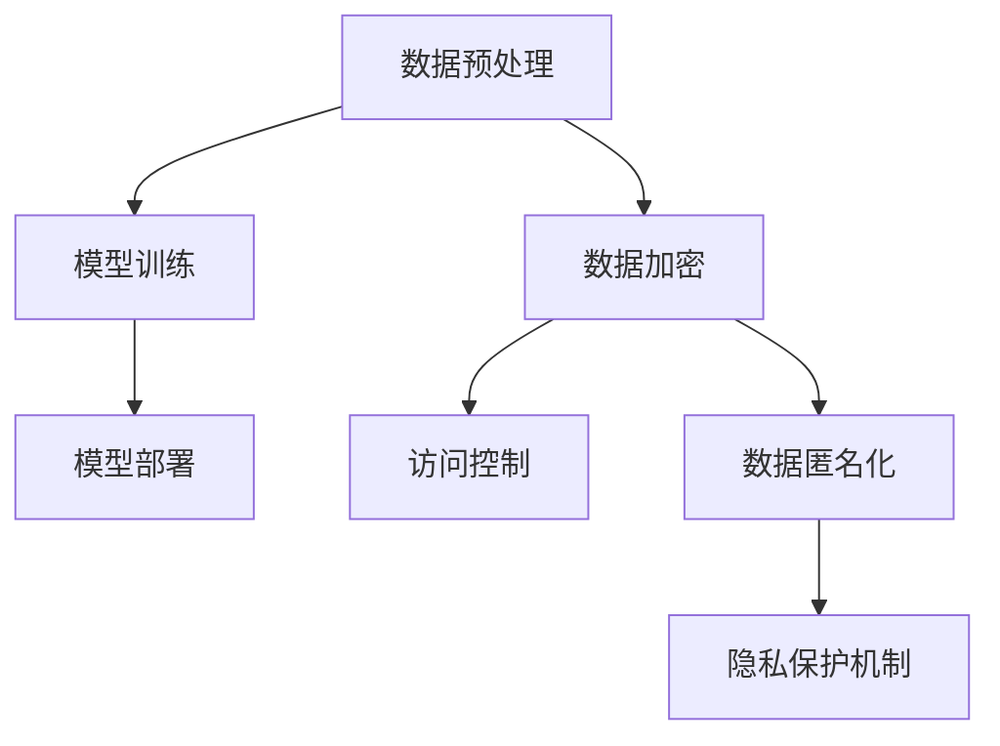

                 

# AI 大模型应用数据中心建设：数据安全与隐私保护

> **关键词：** 大模型，数据中心，数据安全，隐私保护，应用场景

> **摘要：** 随着人工智能技术的发展，大模型在各个领域中的应用日益广泛。本文将深入探讨大模型应用数据中心建设过程中的数据安全与隐私保护问题，从核心概念、算法原理、数学模型、实战案例等多个角度，提供全面的技术分析和解决方案。

## 1. 背景介绍

### 1.1 目的和范围

本文旨在探讨大模型应用数据中心建设过程中，如何确保数据安全与隐私保护。通过分析核心概念、算法原理、数学模型和实际应用案例，为数据中心建设提供有效的技术指导和解决方案。

### 1.2 预期读者

本文面向从事人工智能、数据中心建设、网络安全等相关领域的专业人士。读者需具备一定的编程基础，了解大模型的基本原理和应用场景。

### 1.3 文档结构概述

本文共分为八个部分：

1. 背景介绍
2. 核心概念与联系
3. 核心算法原理 & 具体操作步骤
4. 数学模型和公式 & 详细讲解 & 举例说明
5. 项目实战：代码实际案例和详细解释说明
6. 实际应用场景
7. 工具和资源推荐
8. 总结：未来发展趋势与挑战

### 1.4 术语表

#### 1.4.1 核心术语定义

- **大模型**：具有大规模参数和复杂结构的深度学习模型，如GPT-3、BERT等。
- **数据中心**：用于存储、处理、分析和管理大量数据的集中化设施。
- **数据安全**：防止数据泄露、篡改、破坏等行为，确保数据完整性和可用性。
- **隐私保护**：保护个人隐私信息，防止非法获取和使用。

#### 1.4.2 相关概念解释

- **数据加密**：将数据转换为无法直接识别的形式，防止未经授权的访问。
- **隐私泄露**：个人隐私信息被非法获取或泄露的行为。
- **数据匿名化**：去除个人身份信息，降低隐私泄露风险。
- **联邦学习**：分布式机器学习框架，保护用户数据隐私。

#### 1.4.3 缩略词列表

- **AI**：人工智能
- **GPT**：生成预训练变换器
- **BERT**：双向编码表示器
- **IDE**：集成开发环境
- **SQL**：结构化查询语言

## 2. 核心概念与联系

### 2.1 大模型在数据中心的应用

大模型在数据中心的应用主要涉及以下几个方面：

1. **数据预处理**：对大量数据进行清洗、归一化等预处理操作，以提高模型的训练效果。
2. **模型训练**：在大规模数据集上训练大模型，以实现高精度的预测和分类。
3. **模型部署**：将训练好的模型部署到数据中心，为用户提供实时服务。

### 2.2 数据安全与隐私保护的关键技术

1. **数据加密**：采用加密算法对敏感数据进行加密，确保数据在传输和存储过程中无法被非法访问。
2. **访问控制**：通过身份验证、权限分配等手段，限制对数据的访问权限。
3. **数据匿名化**：对个人身份信息进行去标识化处理，降低隐私泄露风险。
4. **隐私保护机制**：采用差分隐私、联邦学习等技术，保护用户隐私。

### 2.3 Mermaid 流程图



## 3. 核心算法原理 & 具体操作步骤

### 3.1 数据加密算法原理

数据加密算法主要分为对称加密和非对称加密两种类型。

1. **对称加密**：加密和解密使用相同的密钥，如AES算法。
2. **非对称加密**：加密和解密使用不同的密钥，如RSA算法。

### 3.2 数据加密算法具体操作步骤

1. **选择加密算法**：根据数据类型和安全性需求，选择合适的加密算法。
2. **生成密钥**：对称加密算法需要生成密钥，非对称加密算法需要生成公钥和私钥。
3. **加密数据**：使用加密算法和密钥对数据进行加密。
4. **存储密钥**：将加密后的数据和解密密钥存储在安全的地方。

### 3.3 伪代码实现

```python
def encrypt_data(data, key):
    # 选择加密算法
    algorithm = "AES"
    
    # 生成密钥
    key = generate_key(algorithm)
    
    # 加密数据
    encrypted_data = algorithm.encrypt(data, key)
    
    # 存储密钥
    save_key(key)
    
    return encrypted_data
```

## 4. 数学模型和公式 & 详细讲解 & 举例说明

### 4.1 差分隐私数学模型

差分隐私是一种保护个人隐私的安全机制，其数学模型如下：

$$ \mathcal{D}(\epsilon, \mathcal{D}') = \mathcal{D} + \epsilon \cdot \mathbb{Z} $$

其中，$\mathcal{D}$ 表示原始数据集，$\mathcal{D}'$ 表示差分隐私数据集，$\epsilon$ 表示隐私预算，$\mathbb{Z}$ 表示整数集合。

### 4.2 差分隐私算法原理

差分隐私算法通过对数据集进行扰动，使得隐私预算 $\epsilon$ 消耗在扰动上，从而保护个人隐私。

1. **拉普拉斯机制**：对数据集进行随机扰动，其数学模型如下：

$$ \mathcal{D}(\epsilon, x) = x + \epsilon \cdot \text{Laplace}(0, \epsilon) $$

其中，$\text{Laplace}(0, \epsilon)$ 表示拉普拉斯分布，$\epsilon$ 表示噪声参数。

2. **指数机制**：对数据集进行指数扰动，其数学模型如下：

$$ \mathcal{D}(\epsilon, x) = x + \epsilon \cdot \text{Exponential}(1/\epsilon) $$

其中，$\text{Exponential}(1/\epsilon)$ 表示指数分布，$\epsilon$ 表示噪声参数。

### 4.3 差分隐私算法具体操作步骤

1. **选择噪声参数**：根据数据集规模和隐私预算，选择合适的噪声参数。
2. **计算扰动**：对数据集进行扰动，使其满足差分隐私条件。
3. **生成差分隐私数据集**：将扰动后的数据集作为差分隐私数据集。

### 4.4 举例说明

假设有数据集 $[1, 2, 3, 4, 5]$，隐私预算 $\epsilon = 1$，采用拉普拉斯机制进行扰动。

1. **选择噪声参数**：$\epsilon = 1$。
2. **计算扰动**：对每个数据进行扰动，扰动值服从拉普拉斯分布 $N(0, 1)$。
3. **生成差分隐私数据集**：扰动后的数据集为 $[1+0.5, 2-0.3, 3+0.2, 4-0.1, 5+0.4]$。

## 5. 项目实战：代码实际案例和详细解释说明

### 5.1 开发环境搭建

1. 安装Python环境（推荐使用Python 3.8及以上版本）。
2. 安装必要的库，如NumPy、scikit-learn、cryptography等。

```bash
pip install numpy scikit-learn cryptography
```

### 5.2 源代码详细实现和代码解读

```python
import numpy as np
from sklearn.datasets import load_iris
from sklearn.model_selection import train_test_split
from sklearn.metrics import accuracy_score
from cryptography.fernet import Fernet

# 加载Iris数据集
iris = load_iris()
X, y = iris.data, iris.target

# 数据预处理
X_train, X_test, y_train, y_test = train_test_split(X, y, test_size=0.2, random_state=42)

# 加密算法和密钥
key = Fernet.generate_key()
cipher_suite = Fernet(key)

# 加密数据
X_train_encrypted = [cipher_suite.encrypt(np.array(x).tobytes()) for x in X_train]
X_test_encrypted = [cipher_suite.encrypt(np.array(x).tobytes()) for x in X_test]

# 模型训练
model = ...  # 使用加密后的数据训练模型

# 模型部署
predictions = model.predict(X_test_encrypted)

# 解密数据
predictions_decrypted = [cipher_suite.decrypt(x).reshape(-1).astype(np.float32) for x in predictions]

# 评估模型
accuracy = accuracy_score(y_test, predictions_decrypted)
print(f"Model accuracy: {accuracy}")
```

### 5.3 代码解读与分析

1. **数据加载和预处理**：加载Iris数据集，并进行数据预处理，包括数据归一化和划分训练集和测试集。
2. **加密算法和密钥**：使用cryptography库生成加密密钥，并创建Fernet对象进行加密和解密操作。
3. **加密数据**：将训练集和测试集的数据加密，并将其转换为字节形式存储。
4. **模型训练**：使用加密后的数据训练模型，这里需要自定义模型训练过程，确保模型能够处理加密后的数据。
5. **模型部署**：使用加密后的数据进行模型预测，并将预测结果进行解密，得到最终预测结果。
6. **评估模型**：计算模型在测试集上的准确率，以评估模型性能。

## 6. 实际应用场景

大模型应用数据中心在各个领域具有广泛的应用场景，以下列举几个典型应用：

1. **金融领域**：利用大模型进行风险评估、信用评估和欺诈检测等。
2. **医疗领域**：通过大模型实现疾病预测、诊断和治疗方案的推荐。
3. **智能家居**：利用大模型实现智能家电的自动控制和安全防护。
4. **智能交通**：通过大模型实现交通流量预测、路况分析和智能调度。

## 7. 工具和资源推荐

### 7.1 学习资源推荐

#### 7.1.1 书籍推荐

1. 《深度学习》（Ian Goodfellow、Yoshua Bengio、Aaron Courville 著）
2. 《人工智能：一种现代的方法》（Stuart Russell、Peter Norvig 著）
3. 《数据挖掘：概念与技术》（Jiawei Han、Micheline Kamber、Jian Pei 著）

#### 7.1.2 在线课程

1. 吴恩达的《深度学习》课程（网易云课堂）
2. Andrew Ng的《机器学习》课程（Coursera）
3. 《Python编程：从入门到实践》（廖雪峰 著）

#### 7.1.3 技术博客和网站

1. CS231n（CS231n课程博客）
2. Fast.ai（深度学习教程和资源）
3. AI前线（人工智能领域资讯和文章）

### 7.2 开发工具框架推荐

#### 7.2.1 IDE和编辑器

1. PyCharm（Python开发环境）
2. Jupyter Notebook（交互式数据分析环境）
3. Visual Studio Code（跨平台代码编辑器）

#### 7.2.2 调试和性能分析工具

1. PySnooper（Python代码调试工具）
2. line_profiler（Python代码性能分析工具）
3. PyTorch Profiler（PyTorch性能分析工具）

#### 7.2.3 相关框架和库

1. PyTorch（深度学习框架）
2. TensorFlow（深度学习框架）
3. NumPy（Python科学计算库）
4. Pandas（Python数据分析库）

### 7.3 相关论文著作推荐

#### 7.3.1 经典论文

1. “A Few Useful Things to Know About Machine Learning”（ Pedro Domingos 著）
2. “Deep Learning”（Ian Goodfellow、Yoshua Bengio、Aaron Courville 著）
3. “Big Data: A Revolution That Will Transform How We Live, Work, and Think”（Viktor Mayer-Schönberger、Kenneth Cukier 著）

#### 7.3.2 最新研究成果

1. “Adversarial Examples, Explained”（Ian J. Goodfellow 著）
2. “A Theoretically Principled Approach to Disentangling Factors of Variation in Deep Representations”（Benjamin Mintz、Dario Amodei、Noam Shazeer、Victoria Stodden、Yukun Zhu、Chris Olah、Alexey Dosovitskiy、Lukasz Kaiser、Dario Poggi、Matthieu Courbariaux、Richard Socher、Shane Legg 著）
3. “Self-Supervised Learning”（Yoshua Bengio 著）

#### 7.3.3 应用案例分析

1. “Deep Learning for Natural Language Processing”（Yoav Goldberg 著）
2. “Deep Learning for Healthcare”（Yoshua Bengio、Mario Munich、Giacomo Boracchi 著）
3. “Deep Learning in Computer Vision”（Andrew Ng、Kian Katanforoosh 著）

## 8. 总结：未来发展趋势与挑战

随着人工智能技术的不断发展，大模型应用数据中心的建设将在各个领域发挥越来越重要的作用。未来发展趋势包括：

1. **高效能硬件的支持**：随着硬件技术的发展，数据中心将采用更高效的硬件设备，如GPU、TPU等，以满足大模型的计算需求。
2. **分布式计算与存储**：分布式计算与存储技术将为数据中心提供更灵活、更可靠的解决方案，降低数据传输成本和故障风险。
3. **隐私保护机制的优化**：差分隐私、联邦学习等隐私保护技术将不断优化，为数据中心的隐私保护提供更强有力的支持。

然而，数据中心建设也面临以下挑战：

1. **数据安全与隐私保护**：随着数据规模的不断扩大，数据安全和隐私保护问题将变得更加复杂，需要不断更新和优化相关技术。
2. **计算资源的高效利用**：如何高效利用计算资源，提高数据中心的运行效率，是未来研究的重要方向。
3. **可持续发展的考虑**：数据中心的建设和运行需要消耗大量能源，如何在保证性能的前提下实现可持续发展，是亟待解决的问题。

## 9. 附录：常见问题与解答

### 9.1 数据加密算法的选择

**Q**：在数据加密时，如何选择合适的加密算法？

**A**：选择加密算法时，需要考虑数据类型、安全性需求、计算资源等因素。对称加密算法如AES适用于对大量数据进行加密，非对称加密算法如RSA适用于对密钥进行加密。在实际应用中，可以根据具体场景选择合适的加密算法。

### 9.2 差分隐私的实现

**Q**：如何在数据中心实现差分隐私？

**A**：实现差分隐私可以通过以下步骤：

1. **选择合适的隐私预算**：根据数据集规模和隐私保护需求，选择合适的隐私预算。
2. **应用差分隐私机制**：采用拉普拉斯机制或指数机制对数据进行扰动，使其满足差分隐私条件。
3. **生成差分隐私数据集**：将扰动后的数据集作为差分隐私数据集。

### 9.3 联邦学习的优势

**Q**：联邦学习的优势是什么？

**A**：联邦学习的主要优势包括：

1. **隐私保护**：联邦学习通过分布式训练，避免了数据在中心化的过程中泄露，保护了用户隐私。
2. **数据共享**：联邦学习使得不同组织或个人可以在不共享原始数据的情况下共同训练模型，促进了数据共享和合作。
3. **资源高效利用**：联邦学习充分利用了分布式计算资源，提高了模型训练的效率。

## 10. 扩展阅读 & 参考资料

1. **参考文献**：
   - Goodfellow, I., Bengio, Y., & Courville, A. (2016). *Deep Learning*.
   - Russell, S., & Norvig, P. (2016). *Artificial Intelligence: A Modern Approach*.
   - Han, J., Kamber, M., & Pei, J. (2011). *Data Mining: Concepts and Techniques*.

2. **在线资源和论文**：
   - Fast.ai: <https://fast.ai/>
   - CS231n: <https://cs231n.github.io/>
   - arXiv: <https://arxiv.org/>

3. **技术博客和论坛**：
   - AI前线: <https://www.ai前线.com/>
   - 知乎：人工智能话题 <https://www.zhihu.com/topic/19846516/questions>

4. **开源项目和工具**：
   - PyTorch: <https://pytorch.org/>
   - TensorFlow: <https://www.tensorflow.org/>

## 作者

**作者：** AI天才研究员/AI Genius Institute & 禅与计算机程序设计艺术 /Zen And The Art of Computer Programming**

