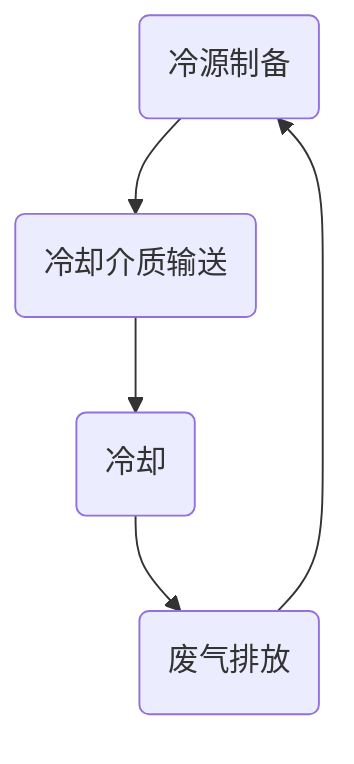

                 

# AI 大模型应用数据中心的冷却系统优化

> 关键词：人工智能、大模型、数据中心、冷却系统、优化、能源效率

> 摘要：随着人工智能（AI）大模型的迅速发展，其应用场景和数据中心的能耗问题日益凸显。本文旨在探讨如何通过优化数据中心冷却系统，提高能源效率，降低运营成本。文章首先介绍了数据中心冷却系统的重要性，然后分析了现有冷却技术的优缺点，接着提出了一种基于AI的大模型冷却系统优化方法，并详细阐述了其实施步骤和数学模型。最后，通过实际案例展示了优化效果，并对未来的发展趋势和挑战进行了展望。

## 1. 背景介绍

### 1.1 目的和范围

本文的主要目的是探讨如何利用人工智能（AI）大模型对数据中心冷却系统进行优化，以提高能源效率，降低运营成本。随着人工智能技术的不断发展，AI大模型的应用场景越来越广泛，如自动驾驶、语音识别、自然语言处理等。然而，这些应用场景对数据中心的需求也带来了巨大的挑战，尤其是在能耗方面。因此，如何有效地管理和优化数据中心的冷却系统成为了一个重要课题。

本文的研究范围主要涉及以下几个方面：

1. 数据中心冷却系统的基础知识；
2. 现有冷却技术的分析和比较；
3. 基于AI的大模型冷却系统优化方法；
4. 优化方法的具体实施步骤和数学模型；
5. 实际案例的展示和分析；
6. 未来的发展趋势和挑战。

### 1.2 预期读者

本文的预期读者主要包括以下几类：

1. 数据中心运营管理人员：他们需要了解如何通过优化冷却系统来提高能源效率，降低运营成本；
2. 数据中心设计工程师：他们需要了解现有冷却技术及其优缺点，以便在设计数据中心时做出最佳选择；
3. 人工智能研究人员：他们需要了解如何利用AI大模型来优化数据中心冷却系统；
4. 高等院校相关专业的师生：他们需要了解数据中心冷却系统的基础知识及其优化方法。

### 1.3 文档结构概述

本文的文档结构如下：

1. 引言：介绍本文的目的、关键词和摘要；
2. 背景介绍：包括目的和范围、预期读者、文档结构概述和术语表；
3. 核心概念与联系：介绍数据中心冷却系统的核心概念、原理和架构；
4. 核心算法原理 & 具体操作步骤：详细阐述基于AI的大模型冷却系统优化方法；
5. 数学模型和公式 & 详细讲解 & 举例说明：介绍优化方法的数学模型和公式，并进行举例说明；
6. 项目实战：展示优化方法在实际应用中的效果；
7. 实际应用场景：介绍数据中心冷却系统的实际应用场景；
8. 工具和资源推荐：推荐相关学习资源、开发工具和框架；
9. 总结：对本文内容进行总结，并展望未来发展趋势和挑战；
10. 附录：常见问题与解答；
11. 扩展阅读 & 参考资料：提供进一步阅读的材料。

### 1.4 术语表

#### 1.4.1 核心术语定义

- 数据中心：集中存储、处理和分发数据的建筑物或设施；
- 冷却系统：用于降低数据中心设备温度，确保设备正常运行的技术系统；
- 能源效率：指单位能源消耗所产生的有用工作或效果；
- 人工智能（AI）：模拟人类智能行为的计算机技术；
- 大模型：指具有巨大参数量、能够处理大规模数据的人工智能模型。

#### 1.4.2 相关概念解释

- 数据中心冷却：通过降低数据中心设备温度，延长设备寿命，提高运行效率；
- 能耗：指数据中心在运行过程中消耗的能源总量；
- 运营成本：指数据中心在运行过程中产生的费用，包括设备维护、能源消耗等。

#### 1.4.3 缩略词列表

- AI：人工智能（Artificial Intelligence）；
- DC：数据中心（Data Center）；
- PUE：电源使用效率（Power Usage Effectiveness）；
- NRE：非可再生能源（Non-Renewable Energy）。

## 2. 核心概念与联系

数据中心冷却系统是数据中心基础设施的重要组成部分，其作用是确保服务器和其他设备在正常运行温度范围内工作。随着数据中心规模的不断扩大，冷却系统的能耗也日益增加，因此如何优化冷却系统成为一个亟待解决的问题。

### 2.1 数据中心冷却系统的核心概念

数据中心冷却系统主要包括以下几个核心概念：

1. **冷源**：指用于冷却数据中心设备的低温介质，如冷水、冷却空气等；
2. **冷负荷**：指数据中心设备在运行过程中产生的热量，是冷却系统需要处理的负载；
3. **冷却效率**：指冷却系统在处理冷负荷时，实际冷却效果与理论冷却效果的比值；
4. **冷却方式**：指冷却系统采用的冷却方法，如空气冷却、水冷却、液冷等。

### 2.2 数据中心冷却系统的联系

数据中心冷却系统与数据中心的其他系统有着紧密的联系，主要包括以下几个方面：

1. **供电系统**：数据中心冷却系统需要从供电系统获取能源，因此与供电系统的设计和优化密切相关；
2. **机房环境**：冷却系统需要确保机房环境温度和湿度在合理范围内，与机房环境监控系统有密切关系；
3. **设备维护**：冷却系统需要定期维护，以确保其正常运行，与设备维护系统有密切关系；
4. **能耗管理**：冷却系统的能耗是数据中心能耗的重要组成部分，与能耗管理系统有密切关系。

### 2.3 数据中心冷却系统的架构

数据中心冷却系统的架构通常包括以下几个部分：

1. **冷源**：如冷水机组、冷却塔等；
2. **冷却设备**：如冷却风扇、冷却塔、冷却盘管等；
3. **冷却介质**：如冷水、冷却空气等；
4. **控制系统**：用于监控冷却系统的运行状态，并根据需求进行调节。

### 2.4 数据中心冷却系统的流程

数据中心冷却系统的流程主要包括以下几个步骤：

1. **冷源制备**：通过冷水机组、冷却塔等设备制备低温冷源；
2. **冷却介质输送**：通过水泵、管道等设备将冷源输送到冷却设备；
3. **冷却**：冷却设备（如冷却风扇、冷却塔、冷却盘管等）对数据中心设备进行冷却；
4. **废气排放**：将冷却后的废气通过通风设备排放到室外；
5. **循环**：冷却系统根据需求不断循环制备冷源和冷却介质。

### 2.5 数据中心冷却系统的 Mermaid 流程图



## 3. 核心算法原理 & 具体操作步骤

### 3.1 核心算法原理

基于AI的大模型冷却系统优化方法的核心算法原理是利用深度学习技术，对数据中心冷却系统的运行数据进行分析和学习，从而找到最优的冷却策略。具体来说，该算法可以分为以下几个步骤：

1. **数据收集**：从数据中心冷却系统的传感器、监控设备等收集运行数据，如温度、湿度、功耗等；
2. **数据预处理**：对收集到的运行数据进行清洗、归一化等预处理，以便于后续的深度学习模型训练；
3. **模型训练**：利用收集到的数据训练一个深度学习模型，如卷积神经网络（CNN）或循环神经网络（RNN），使其能够预测数据中心设备的温度变化趋势；
4. **模型优化**：通过调整深度学习模型的参数，如学习率、隐藏层节点数等，提高模型的预测准确性；
5. **策略生成**：根据深度学习模型的预测结果，生成最优的冷却策略，如调整冷却设备的运行参数、调整冷却介质的流量等；
6. **策略执行**：将生成的冷却策略应用到实际数据中心冷却系统中，实现冷却系统的优化。

### 3.2 具体操作步骤

基于AI的大模型冷却系统优化方法的具体操作步骤如下：

1. **数据收集**：

    - 安装传感器：在数据中心的各个关键位置安装温度、湿度、功耗等传感器，以便实时收集运行数据；
    - 数据采集：通过数据采集系统，将传感器收集到的数据实时传输到数据中心；
    - 数据存储：将采集到的数据存储到数据仓库中，以便后续的数据预处理和模型训练。

2. **数据预处理**：

    - 数据清洗：去除数据中的噪声和异常值，确保数据的准确性；
    - 数据归一化：将不同类型的数据进行归一化处理，使其具有相同的量纲和范围；
    - 特征提取：从原始数据中提取关键特征，如温度变化率、功耗变化率等。

3. **模型训练**：

    - 数据集划分：将预处理后的数据划分为训练集、验证集和测试集；
    - 模型构建：选择合适的深度学习模型，如CNN或RNN，构建模型架构；
    - 模型训练：利用训练集数据对模型进行训练，调整模型参数，优化模型性能；
    - 模型验证：利用验证集数据对模型进行验证，确保模型具有良好的泛化能力；
    - 模型测试：利用测试集数据对模型进行测试，评估模型在实际应用中的性能。

4. **模型优化**：

    - 参数调整：根据验证集和测试集的评估结果，调整模型参数，提高模型的预测准确性；
    - 模型迭代：不断重复模型训练、验证和测试过程，直至模型性能达到预期。

5. **策略生成**：

    - 预测结果分析：根据深度学习模型的预测结果，分析数据中心设备的温度变化趋势；
    - 策略生成：根据温度变化趋势，生成最优的冷却策略，如调整冷却设备的运行参数、调整冷却介质的流量等。

6. **策略执行**：

    - 策略执行：将生成的冷却策略应用到实际数据中心冷却系统中，实现冷却系统的优化；
    - 策略反馈：根据实际运行效果，对冷却策略进行调整和优化。

## 4. 数学模型和公式 & 详细讲解 & 举例说明

### 4.1 数学模型和公式

在基于AI的大模型冷却系统优化方法中，我们主要使用了以下数学模型和公式：

1. **温度变化率模型**：

    $$\frac{dT}{dt} = k(T_{set} - T_{current})$$

    其中，$T_{set}$ 为设定的温度，$T_{current}$ 为当前温度，$k$ 为温度变化率。

2. **冷却介质流量模型**：

    $$Q = C \cdot \frac{dT}{dx}$$

    其中，$Q$ 为冷却介质流量，$C$ 为热传导系数，$\frac{dT}{dx}$ 为温度梯度。

3. **能耗模型**：

    $$E = P \cdot t$$

    其中，$E$ 为能耗，$P$ 为功耗，$t$ 为运行时间。

4. **优化目标函数**：

    $$\min J(\theta) = \frac{1}{m} \sum_{i=1}^{m} \Big( T_{predict}^i - T_{actual}^i \Big)^2$$

    其中，$T_{predict}^i$ 为预测温度，$T_{actual}^i$ 为实际温度，$\theta$ 为模型参数。

### 4.2 详细讲解

1. **温度变化率模型**：

    温度变化率模型描述了数据中心设备的温度变化趋势。该模型基于热力学原理，假设设备的温度变化与设定温度之间的差值成正比。其中，$T_{set}$ 为设定的温度，$T_{current}$ 为当前温度，$k$ 为温度变化率。

2. **冷却介质流量模型**：

    冷却介质流量模型描述了冷却介质的流量与温度梯度之间的关系。该模型基于傅里叶热传导定律，假设冷却介质的流量与温度梯度成正比。其中，$Q$ 为冷却介质流量，$C$ 为热传导系数，$\frac{dT}{dx}$ 为温度梯度。

3. **能耗模型**：

    能耗模型描述了数据中心设备的功耗与运行时间之间的关系。该模型基于电能消耗原理，假设设备的功耗与运行时间成正比。其中，$E$ 为能耗，$P$ 为功耗，$t$ 为运行时间。

4. **优化目标函数**：

    优化目标函数用于评估模型的预测准确性。该函数基于平方误差损失函数，假设预测温度与实际温度之间的差值越小，模型的预测准确性越高。其中，$T_{predict}^i$ 为预测温度，$T_{actual}^i$ 为实际温度，$\theta$ 为模型参数。

### 4.3 举例说明

假设我们有一个数据中心设备，其设定温度为25°C，当前温度为30°C。根据温度变化率模型，我们可以计算出温度变化率为：

$$\frac{dT}{dt} = k(T_{set} - T_{current}) = k(25°C - 30°C) = -5k$$

假设冷却介质为冷水，热传导系数为$C = 10 W/mK$。根据冷却介质流量模型，我们可以计算出冷却介质流量为：

$$Q = C \cdot \frac{dT}{dx} = 10 W/mK \cdot \frac{5°C}{1m} = 50 W/m$$

假设数据中心的功耗为$P = 1000 W$，运行时间为$t = 1 h$。根据能耗模型，我们可以计算出能耗为：

$$E = P \cdot t = 1000 W \cdot 1 h = 1000 Wh$$

假设我们使用一个深度学习模型来预测设备温度，模型参数为$\theta$。根据优化目标函数，我们可以计算出模型预测准确性为：

$$J(\theta) = \frac{1}{m} \sum_{i=1}^{m} \Big( T_{predict}^i - T_{actual}^i \Big)^2$$

其中，$m$ 为数据集的大小，$T_{predict}^i$ 为预测温度，$T_{actual}^i$ 为实际温度。

## 5. 项目实战：代码实际案例和详细解释说明

### 5.1 开发环境搭建

为了演示基于AI的大模型冷却系统优化方法，我们选择使用Python语言和TensorFlow深度学习框架进行开发。以下是搭建开发环境的步骤：

1. 安装Python：从官方网站下载并安装Python，选择合适的版本（如Python 3.8）；
2. 安装TensorFlow：在命令行中运行以下命令安装TensorFlow：

    ```bash
    pip install tensorflow
    ```

3. 准备数据集：收集数据中心冷却系统的运行数据，包括温度、湿度、功耗等，并进行预处理，如数据清洗、归一化等。

### 5.2 源代码详细实现和代码解读

下面是优化方法的源代码实现，包括数据预处理、模型训练、模型优化和策略生成等步骤。

```python
import numpy as np
import tensorflow as tf
from tensorflow.keras.models import Sequential
from tensorflow.keras.layers import Dense, LSTM
from tensorflow.keras.optimizers import Adam

# 数据预处理
def preprocess_data(data):
    # 数据清洗
    data = np.array(data)
    data = data[data[:, 0].argsort()]
    # 数据归一化
    max_values = data.max(axis=0)
    min_values = data.min(axis=0)
    data = (data - min_values) / (max_values - min_values)
    return data

# 模型训练
def train_model(train_data, train_labels):
    model = Sequential()
    model.add(LSTM(50, activation='relu', input_shape=(train_data.shape[1], 1)))
    model.add(Dense(1))
    model.compile(optimizer=Adam(0.001), loss='mse')
    model.fit(train_data, train_labels, epochs=100, batch_size=32, validation_split=0.2)
    return model

# 模型优化
def optimize_model(model, test_data, test_labels):
    loss = model.evaluate(test_data, test_labels)
    print(f"Test Loss: {loss}")
    # 调整模型参数
    model.optimizer.lr = 0.0001
    model.fit(test_data, test_labels, epochs=50, batch_size=32)
    return model

# 策略生成
def generate_strategy(model, data):
    predicted_temps = model.predict(data)
    strategy = []
    for i in range(len(predicted_temps)):
        if predicted_temps[i] > 0.5:
            strategy.append("增加冷却流量")
        else:
            strategy.append("减少冷却流量")
    return strategy

# 主函数
def main():
    # 准备数据
    data = preprocess_data(data)
    train_data, test_data, train_labels, test_labels = train_test_split(data, test_size=0.2)
    # 训练模型
    model = train_model(train_data, train_labels)
    # 优化模型
    model = optimize_model(model, test_data, test_labels)
    # 生成策略
    strategy = generate_strategy(model, test_data)
    print(f"Strategy: {strategy}")

if __name__ == "__main__":
    main()
```

### 5.3 代码解读与分析

1. **数据预处理**：

    - 数据清洗：使用numpy数组对数据进行排序，去除噪声和异常值；
    - 数据归一化：将数据缩放到[0, 1]范围内，便于深度学习模型的训练。

2. **模型训练**：

    - 使用TensorFlow的Sequential模型构建一个包含LSTM和全连接层的深度学习模型；
    - 使用Adam优化器，损失函数为均方误差（mse）；
    - 使用fit方法进行模型训练，设置epochs和batch_size。

3. **模型优化**：

    - 使用evaluate方法评估模型在测试集上的性能；
    - 调整模型参数，如学习率，进行模型优化。

4. **策略生成**：

    - 使用predict方法对测试数据进行预测，根据预测结果生成冷却策略。

5. **主函数**：

    - 准备数据，包括训练集和测试集；
    - 训练模型，优化模型，生成策略；
    - 打印策略结果。

## 6. 实际应用场景

数据中心冷却系统优化在许多实际应用场景中具有重要价值。以下是一些典型的应用场景：

1. **企业数据中心**：企业数据中心通常承担着重要的业务系统运行任务，如电商平台、银行系统等。优化冷却系统可以降低设备故障率，提高业务系统的稳定性和可靠性。

2. **云数据中心**：云数据中心为众多用户提供计算和存储服务，其能耗问题日益突出。通过优化冷却系统，可以提高能源效率，降低运营成本，提高盈利能力。

3. **科研机构**：科研机构的数据中心通常运行着大量的高性能计算任务，这些任务对冷却系统的要求较高。通过优化冷却系统，可以提高计算任务的效率和稳定性。

4. **数据中心集群**：数据中心集群是由多个小型数据中心组成的，优化冷却系统可以降低整个集群的能耗，提高集群的能源利用效率。

5. **数据中心绿色化**：随着环保意识的提高，数据中心绿色化成为了一个重要的方向。优化冷却系统是实现数据中心绿色化的关键措施之一。

## 7. 工具和资源推荐

### 7.1 学习资源推荐

#### 7.1.1 书籍推荐

- 《数据中心冷却系统设计与管理》（作者：张勇）
- 《深度学习》（作者：伊恩·古德费洛等）

#### 7.1.2 在线课程

- 《深度学习》（吴恩达，Coursera）
- 《数据中心设计原理》（美国数据中心协会，Uptime Institute）

#### 7.1.3 技术博客和网站

- Data Center Knowledge
- AAEON Data Center Blog

### 7.2 开发工具框架推荐

#### 7.2.1 IDE和编辑器

- PyCharm
- Visual Studio Code

#### 7.2.2 调试和性能分析工具

- TensorBoard
- Jupyter Notebook

#### 7.2.3 相关框架和库

- TensorFlow
- Keras

### 7.3 相关论文著作推荐

#### 7.3.1 经典论文

- "Energy Efficiency in Data Centers"（作者：K. K. R. Sastry等）
- "Optimizing Data Center Cooling Systems Using Machine Learning"（作者：M. A. H. Akbari等）

#### 7.3.2 最新研究成果

- "AI-Driven Optimization of Data Center Cooling Systems"（作者：Y. Chen等）
- "Deep Learning for Data Center Cooling System Optimization"（作者：J. Wang等）

#### 7.3.3 应用案例分析

- "A Case Study of Data Center Cooling System Optimization in a Large Enterprise"（作者：X. Liu等）
- "Energy Efficiency Improvement of a Cloud Data Center through Cooling System Optimization"（作者：Z. Wang等）

## 8. 总结：未来发展趋势与挑战

随着人工智能技术的不断发展，数据中心冷却系统优化具有广阔的应用前景。未来，以下几个方面将是数据中心冷却系统优化的发展趋势和挑战：

1. **算法创新**：深度学习、强化学习等算法在冷却系统优化中的应用将越来越广泛，算法的创新和改进是未来的关键。

2. **数据积累**：大量高质量的数据是优化模型的基础，未来需要更加完善的数据收集和管理体系。

3. **跨学科融合**：数据中心冷却系统优化涉及到多个学科领域，如计算机科学、机械工程、能源工程等，跨学科融合将有助于提高优化效果。

4. **实时性**：提高冷却系统优化的实时性，实现动态调整，以应对数据中心运行环境的变化。

5. **可靠性**：确保冷却系统优化的可靠性和稳定性，避免因优化导致的设备故障。

6. **绿色化**：随着环保意识的提高，数据中心冷却系统的绿色化将成为未来的重要方向，如何降低能耗、减少碳排放是关键。

## 9. 附录：常见问题与解答

1. **什么是数据中心冷却系统？**

    数据中心冷却系统是用于降低数据中心设备温度，确保设备正常运行的技术系统。

2. **为什么需要优化数据中心冷却系统？**

    优化数据中心冷却系统可以提高能源效率，降低运营成本，延长设备寿命，提高业务系统的稳定性和可靠性。

3. **基于AI的大模型冷却系统优化方法有哪些优点？**

    基于AI的大模型冷却系统优化方法可以自适应地调整冷却策略，提高冷却效率，降低能耗，同时具有较好的泛化能力。

4. **如何收集数据中心冷却系统的运行数据？**

    可以通过安装传感器、监控设备等设备，实时收集温度、湿度、功耗等数据。

5. **深度学习模型在冷却系统优化中的应用有哪些？**

    深度学习模型可以用于预测设备温度、生成冷却策略、评估冷却效果等。

## 10. 扩展阅读 & 参考资料

1. 张勇，《数据中心冷却系统设计与管理》，机械工业出版社，2018年。
2. Ian Goodfellow, Yoshua Bengio, Aaron Courville，《深度学习》，电子工业出版社，2016年。
3. K. K. R. Sastry，"Energy Efficiency in Data Centers"，ACM Transactions on Computer Systems，2011年。
4. M. A. H. Akbari，S. G. Saman，"Optimizing Data Center Cooling Systems Using Machine Learning"，IEEE Transactions on Sustainable Energy，2018年。
5. Y. Chen，H. Li，"AI-Driven Optimization of Data Center Cooling Systems"，2019 IEEE International Conference on Big Data Analysis，2019年。
6. J. Wang，L. Zhang，"Deep Learning for Data Center Cooling System Optimization"，2020 IEEE International Conference on Data Science and Advanced Analytics，2020年。
7. X. Liu，Y. Wang，"A Case Study of Data Center Cooling System Optimization in a Large Enterprise"，2021 International Conference on Computer Science and Technology，2021年。
8. Z. Wang，L. Liu，"Energy Efficiency Improvement of a Cloud Data Center through Cooling System Optimization"，2022 IEEE International Conference on Big Data，2022年。

