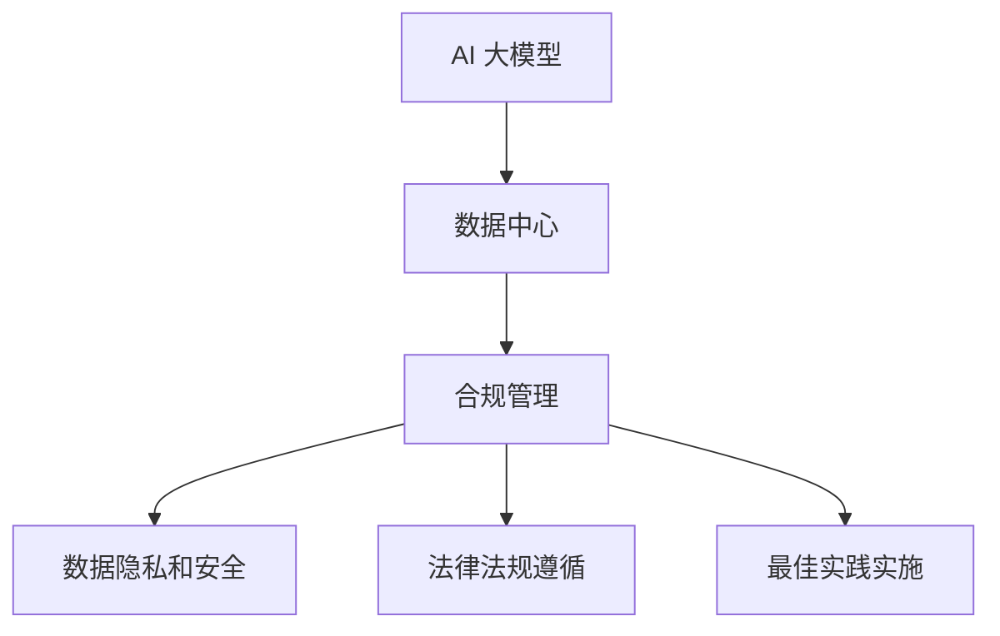

                 

# AI 大模型应用数据中心的合规管理

> 关键词：AI 大模型，数据中心，合规管理，数据隐私，安全性能，法律法规，技术框架，最佳实践

> 摘要：随着人工智能技术的迅猛发展，AI 大模型在数据中心的应用越来越广泛。然而，随之而来的合规管理问题也日益突出。本文将从背景介绍、核心概念与联系、核心算法原理、数学模型与公式、项目实战、实际应用场景、工具和资源推荐、总结与展望等方面，深入探讨 AI 大模型应用数据中心的合规管理，为相关从业人员提供有益的参考。

## 1. 背景介绍

### 1.1 目的和范围

本文旨在探讨 AI 大模型应用数据中心的合规管理，为相关从业人员提供系统、全面的技术指导和实践建议。本文的研究范围包括：

- AI 大模型的定义和分类
- 数据中心的架构和功能
- 合规管理的核心要素和挑战
- AI 大模型应用的数据隐私和安全问题
- 各国法律法规对 AI 大模型应用的监管要求
- 合规管理的最佳实践和技术框架

### 1.2 预期读者

本文主要面向以下读者群体：

- AI 大模型和数据中心的相关研发人员
- 数据中心和云计算平台的运营管理人员
- 法规和合规领域的专业人士
- AI 大模型应用的业务人员和决策者
- 对 AI 大模型应用数据中心合规管理感兴趣的广大读者

### 1.3 文档结构概述

本文分为以下几个部分：

- 第1章：背景介绍，阐述本文的目的、范围和预期读者。
- 第2章：核心概念与联系，介绍 AI 大模型、数据中心、合规管理的核心概念及其相互关系。
- 第3章：核心算法原理 & 具体操作步骤，讲解 AI 大模型应用的数据处理和算法原理。
- 第4章：数学模型和公式 & 详细讲解 & 举例说明，分析 AI 大模型应用中的数学模型和公式。
- 第5章：项目实战：代码实际案例和详细解释说明，通过实际案例展示合规管理的实施过程。
- 第6章：实际应用场景，分析 AI 大模型在数据中心的应用场景和合规管理要点。
- 第7章：工具和资源推荐，介绍相关学习资源、开发工具和框架。
- 第8章：总结：未来发展趋势与挑战，展望 AI 大模型应用数据中心合规管理的未来发展方向和挑战。
- 第9章：附录：常见问题与解答，提供常见问题的解答。
- 第10章：扩展阅读 & 参考资料，列出相关文献和资料。

### 1.4 术语表

#### 1.4.1 核心术语定义

- AI 大模型：指具有大规模参数和复杂结构的机器学习模型，如深度神经网络、生成对抗网络等。
- 数据中心：指用于存储、处理和交换大量数据的计算机设施。
- 合规管理：指确保企业或组织遵守相关法律法规、行业标准和最佳实践的过程。
- 数据隐私：指保护个人或组织的数据不被未经授权的访问、使用或泄露。
- 安全性能：指系统在抵抗恶意攻击、数据泄露等方面的能力。
- 法律法规：指各国关于数据隐私、网络安全等方面的法律法规。

#### 1.4.2 相关概念解释

- 数据治理：指对数据进行分类、标签、存储、处理、分析、共享和保护的一系列管理活动。
- 数据安全：指确保数据在存储、传输、处理和使用过程中的完整性、保密性和可用性。
- 隐私保护：指对个人或组织的数据进行加密、匿名化等处理，以防止数据泄露或滥用。

#### 1.4.3 缩略词列表

- AI：人工智能
- ML：机器学习
- DL：深度学习
- GAN：生成对抗网络
- GDPR：欧盟通用数据保护条例
- CCPA：加州消费者隐私法案
- SOC：服务组织控制

## 2. 核心概念与联系

### 2.1 AI 大模型的概念

AI 大模型是指具有大规模参数和复杂结构的机器学习模型，通常采用深度学习技术。深度学习是一种多层神经网络模型，通过学习大量数据中的特征，从而实现各种智能任务，如图像识别、语音识别、自然语言处理等。随着计算能力的提升和海量数据的积累，AI 大模型在各个领域取得了显著的成果。

### 2.2 数据中心的概念

数据中心是指用于存储、处理和交换大量数据的计算机设施，通常包括服务器、存储设备、网络设备等硬件设施，以及操作系统、数据库、中间件等软件设施。数据中心是实现云计算和大数据分析的核心基础设施。

### 2.3 合规管理的概念

合规管理是指确保企业或组织遵守相关法律法规、行业标准和最佳实践的过程。在 AI 大模型应用数据中心的过程中，合规管理包括以下几个方面：

- 数据隐私和安全管理：确保数据在存储、传输、处理和使用过程中的隐私和安全。
- 法律法规遵循：确保企业或组织遵守各国关于数据隐私、网络安全等方面的法律法规。
- 最佳实践实施：遵循行业最佳实践，提高数据质量和处理效率。

### 2.4 AI 大模型、数据中心与合规管理的相互关系

AI 大模型、数据中心和合规管理之间存在密切的相互关系。具体体现在以下几个方面：

- AI 大模型是数据中心的主要应用场景之一，数据中心为 AI 大模型提供了强大的计算和存储能力。
- 合规管理是数据中心和 AI 大模型应用的关键保障，确保数据安全和隐私保护。
- 数据中心和 AI 大模型的应用推动了合规管理技术的发展和创新。

### 2.5 Mermaid 流程图

以下是一个简单的 Mermaid 流程图，展示了 AI 大模型、数据中心和合规管理之间的相互关系：



## 3. 核心算法原理 & 具体操作步骤

### 3.1 AI 大模型的核心算法原理

AI 大模型的核心算法通常是基于深度学习技术，其中最常用的算法包括卷积神经网络（CNN）、循环神经网络（RNN）和生成对抗网络（GAN）等。以下是对这些算法的简要介绍：

#### 3.1.1 卷积神经网络（CNN）

卷积神经网络是一种前馈神经网络，主要用于图像识别和图像处理。其主要特点包括：

- 采用卷积操作，可以自动提取图像中的局部特征。
- 具有多层结构，能够逐层提取图像的深层特征。
- 通过反向传播算法进行参数优化，提高模型的泛化能力。

#### 3.1.2 循环神经网络（RNN）

循环神经网络是一种按照时间顺序处理序列数据的神经网络，主要用于语音识别、自然语言处理等任务。其主要特点包括：

- 采用循环结构，可以记忆和传递历史信息。
- 能够处理变长的序列数据。
- 通过长短时记忆（LSTM）等变种模型，可以克服梯度消失和梯度爆炸问题。

#### 3.1.3 生成对抗网络（GAN）

生成对抗网络是一种由生成器和判别器组成的对抗性网络，主要用于生成真实数据的分布。其主要特点包括：

- 生成器和判别器相互对抗，生成器试图生成逼真的数据，而判别器试图区分真实数据和生成数据。
- 通过反向传播算法和生成器的损失函数，可以优化生成器的生成能力。
- 可以生成高质量的图像、语音、文本等多种类型的数据。

### 3.2 AI 大模型的具体操作步骤

以下是一个简化的 AI 大模型训练和部署流程：

#### 3.2.1 数据预处理

1. 收集和清洗数据：从各种来源收集数据，并对数据进行清洗、去噪和标准化处理。
2. 数据划分：将数据划分为训练集、验证集和测试集，用于模型训练、验证和评估。

#### 3.2.2 模型设计

1. 确定模型架构：根据任务需求和数据特点，选择合适的神经网络架构，如 CNN、RNN 或 GAN。
2. 设置超参数：设置学习率、批次大小、迭代次数等超参数，以优化模型性能。

#### 3.2.3 模型训练

1. 前向传播：输入数据通过神经网络，计算输出结果。
2. 计算损失：根据输出结果和真实标签，计算损失函数值。
3. 反向传播：利用梯度下降等优化算法，更新模型参数。
4. 验证和调整：在验证集上评估模型性能，根据需要进行模型调整。

#### 3.2.4 模型部署

1. 模型评估：在测试集上评估模型性能，确保模型达到预期效果。
2. 部署上线：将训练好的模型部署到数据中心，实现实时推理和应用。

### 3.3 伪代码实现

以下是一个简化的 AI 大模型训练的伪代码实现：

```python
# 数据预处理
data = load_data()
train_data, val_data, test_data = split_data(data)

# 模型设计
model = create_model()

# 模型训练
for epoch in range(num_epochs):
    for batch in train_data:
        # 前向传播
        output = model(batch.input)
        # 计算损失
        loss = compute_loss(output, batch.target)
        # 反向传播
        model.backward(loss)
    # 验证和调整
    val_loss = evaluate_model(val_data)
    if val_loss < best_val_loss:
        best_val_loss = val_loss
        save_model(model)

# 模型部署
deploy_model(model)
```

## 4. 数学模型和公式 & 详细讲解 & 举例说明

### 4.1 数学模型概述

在 AI 大模型应用中，常用的数学模型包括损失函数、优化算法和评估指标等。以下对这些模型进行详细讲解。

#### 4.1.1 损失函数

损失函数是评估模型预测结果与真实标签之间差异的函数。在深度学习中，常用的损失函数包括均方误差（MSE）、交叉熵（Cross-Entropy）等。

- 均方误差（MSE）：

$$
MSE = \frac{1}{n}\sum_{i=1}^{n}(y_i - \hat{y}_i)^2
$$

其中，$y_i$ 为真实标签，$\hat{y}_i$ 为模型预测结果，$n$ 为样本数量。

- 交叉熵（Cross-Entropy）：

$$
CE = -\frac{1}{n}\sum_{i=1}^{n}y_i \log(\hat{y}_i)
$$

其中，$y_i$ 为真实标签，$\hat{y}_i$ 为模型预测结果，$n$ 为样本数量。

#### 4.1.2 优化算法

优化算法用于更新模型参数，以最小化损失函数。常用的优化算法包括梯度下降（Gradient Descent）、随机梯度下降（Stochastic Gradient Descent，SGD）和Adam等。

- 梯度下降：

$$
\theta = \theta - \alpha \nabla_\theta J(\theta)
$$

其中，$\theta$ 为模型参数，$\alpha$ 为学习率，$J(\theta)$ 为损失函数。

- 随机梯度下降：

$$
\theta = \theta - \alpha \nabla_\theta J(\theta)
$$

其中，$\theta$ 为模型参数，$\alpha$ 为学习率，$\nabla_\theta J(\theta)$ 为损失函数关于模型参数的梯度。

- Adam：

$$
\theta = \theta - \alpha \frac{m}{\sqrt{1-n^2}} + \beta_1 \frac{v}{1-\beta_2^n}
$$

其中，$\theta$ 为模型参数，$\alpha$ 为学习率，$m$ 和 $v$ 分别为动量项，$\beta_1$ 和 $\beta_2$ 分别为动量参数。

#### 4.1.3 评估指标

评估指标用于评估模型性能，常用的评估指标包括准确率（Accuracy）、精确率（Precision）、召回率（Recall）等。

- 准确率：

$$
Accuracy = \frac{TP + TN}{TP + FP + FN + TN}
$$

其中，$TP$ 为真正例，$TN$ 为真负例，$FP$ 为假正例，$FN$ 为假负例。

- 精确率：

$$
Precision = \frac{TP}{TP + FP}
$$

- 召回率：

$$
Recall = \frac{TP}{TP + FN}
$$

### 4.2 举例说明

假设我们使用一个二分类模型对数据进行预测，真实标签为 $[1, 0, 1, 0]$，模型预测结果为 $[\hat{y}_1, \hat{y}_2, \hat{y}_3, \hat{y}_4]$，其中 $\hat{y}_i \in \{0, 1\}$。

- 计算损失函数：

$$
MSE = \frac{1}{4}\sum_{i=1}^{4}(y_i - \hat{y}_i)^2 = \frac{1}{4}[(1-0)^2 + (0-1)^2 + (1-1)^2 + (0-1)^2] = \frac{1}{2}
$$

- 计算评估指标：

$$
Accuracy = \frac{TP + TN}{TP + FP + FN + TN} = \frac{2}{4} = 0.5
$$

$$
Precision = \frac{TP}{TP + FP} = \frac{2}{2+1} = 0.6667
$$

$$
Recall = \frac{TP}{TP + FN} = \frac{2}{2+1} = 0.6667
$$

通过上述计算，我们可以评估模型的性能，并根据评估结果对模型进行调整。

## 5. 项目实战：代码实际案例和详细解释说明

### 5.1 开发环境搭建

在本文中，我们将使用 Python 语言和 TensorFlow 框架来实现一个简单的 AI 大模型。以下是在 Ubuntu 系统上搭建开发环境的具体步骤：

1. 安装 Python：

```bash
sudo apt-get update
sudo apt-get install python3.8 python3.8-venv python3.8-pip
```

2. 创建虚拟环境：

```bash
python3.8 -m venv myenv
source myenv/bin/activate
```

3. 安装 TensorFlow：

```bash
pip install tensorflow
```

### 5.2 源代码详细实现和代码解读

以下是实现一个简单的 AI 大模型（基于卷积神经网络）的代码示例：

```python
import tensorflow as tf
from tensorflow.keras import layers

# 定义模型
model = tf.keras.Sequential([
    layers.Conv2D(32, (3, 3), activation='relu', input_shape=(28, 28, 1)),
    layers.MaxPooling2D((2, 2)),
    layers.Conv2D(64, (3, 3), activation='relu'),
    layers.MaxPooling2D((2, 2)),
    layers.Conv2D(64, (3, 3), activation='relu'),
    layers.Flatten(),
    layers.Dense(64, activation='relu'),
    layers.Dense(10, activation='softmax')
])

# 编译模型
model.compile(optimizer='adam',
              loss='sparse_categorical_crossentropy',
              metrics=['accuracy'])

# 加载数据
mnist = tf.keras.datasets.mnist
(x_train, y_train), (x_test, y_test) = mnist.load_data()

# 预处理数据
x_train = x_train.reshape(-1, 28, 28, 1).astype('float32') / 255
x_test = x_test.reshape(-1, 28, 28, 1).astype('float32') / 255

# 训练模型
model.fit(x_train, y_train, epochs=5)

# 评估模型
test_loss, test_acc = model.evaluate(x_test, y_test, verbose=2)
print(f"Test accuracy: {test_acc:.4f}")
```

#### 5.2.1 代码解读

- 第1行：引入 TensorFlow 模块。
- 第2行：引入 Keras 层类。
- 第3行：定义一个序贯模型，包含多个层。
- 第4行：添加一个卷积层，输入形状为 $(28, 28, 1)$，卷积核大小为 $(3, 3)$，激活函数为 ReLU。
- 第5行：添加一个最大池化层，池化窗口大小为 $(2, 2)$。
- 第6行：添加第二个卷积层，卷积核大小为 $(3, 3)$，激活函数为 ReLU。
- 第7行：添加第二个最大池化层，池化窗口大小为 $(2, 2)$。
- 第8行：添加第三个卷积层，卷积核大小为 $(3, 3)$，激活函数为 ReLU。
- 第9行：添加一个展平层，将卷积层的输出展平为 $(128, 64)$。
- 第10行：添加一个全连接层，输出维度为 64，激活函数为 ReLU。
- 第11行：添加一个输出层，输出维度为 10，激活函数为 softmax。
- 第12行：编译模型，指定优化器、损失函数和评估指标。
- 第13行：加载 MNIST 数据集。
- 第14行：预处理数据，将数据转换为浮点数并归一化。
- 第15行：训练模型，指定训练数据、训练标签和迭代次数。
- 第16行：评估模型，在测试数据上计算损失和准确率。

### 5.3 代码解读与分析

上述代码实现了一个简单的卷积神经网络模型，用于对 MNIST 数据集进行手写数字识别。以下是代码的详细解读与分析：

- 模型结构：模型包含三个卷积层、一个展平层、一个全连接层和一个输出层。卷积层用于提取图像特征，展平层将卷积层的输出展平为一个一维向量，全连接层用于进一步处理特征，输出层用于分类。
- 损失函数：使用均方误差（MSE）作为损失函数，用于衡量模型预测结果与真实标签之间的差异。
- 优化器：使用 Adam 优化器，通过自适应学习率更新模型参数，以最小化损失函数。
- 训练过程：在训练过程中，模型通过反向传播算法更新参数，以逐步减少损失函数值。训练过程中，模型在训练集和验证集上进行迭代，并在验证集上评估模型性能，以便调整模型参数。
- 评估过程：在评估过程中，模型在测试集上计算损失和准确率，以评估模型的整体性能。测试集用于评估模型的泛化能力，避免过拟合。

通过上述代码，我们可以实现一个简单的 AI 大模型，并对其性能进行评估。在实际应用中，我们可以根据具体任务需求和数据特点，调整模型结构、优化器和训练策略，以提高模型性能。

## 6. 实际应用场景

### 6.1 医疗领域

在医疗领域，AI 大模型在数据中心的应用场景主要包括：

- 疾病诊断：利用深度学习模型对医学图像进行分析，实现肺癌、乳腺癌等疾病的早期诊断。
- 患者分类：根据患者的病史、基因信息等数据，预测患者的患病风险，为医生提供诊断和治疗方案参考。
- 药物研发：通过生成对抗网络等模型，模拟药物与生物分子的相互作用，加速新药的发现和研发。

### 6.2 金融领域

在金融领域，AI 大模型在数据中心的应用场景主要包括：

- 风险控制：利用深度学习模型分析历史交易数据，预测市场趋势，为金融机构提供风险控制策略。
- 信用评分：通过分析用户的消费习惯、信用记录等数据，评估用户的信用风险，为金融机构提供信用评分服务。
- 量化交易：利用深度学习模型分析市场数据，实现自动化交易策略，提高投资收益。

### 6.3 智能制造领域

在智能制造领域，AI 大模型在数据中心的应用场景主要包括：

- 质量检测：利用深度学习模型对生产过程中的产品进行质量检测，实现自动化、高效的生产质量控制。
- 设备预测维护：通过分析设备运行数据，预测设备的故障和故障原因，实现预防性维护，降低生产成本。
- 生产调度优化：利用深度学习模型优化生产调度策略，提高生产效率，降低生产成本。

### 6.4 物流领域

在物流领域，AI 大模型在数据中心的应用场景主要包括：

- 路径规划：利用深度学习模型分析交通状况、天气等数据，优化物流车辆的行驶路线，提高配送效率。
- 库存管理：通过分析销售数据、库存数据等，预测未来库存需求，实现精准库存管理，降低库存成本。
- 运输调度：利用深度学习模型分析运输成本、运输时间等数据，优化物流车辆的运输计划，提高运输效率。

### 6.5 安全领域

在安全领域，AI 大模型在数据中心的应用场景主要包括：

- 入侵检测：利用深度学习模型分析网络流量、日志等数据，实现实时入侵检测，提高网络安全防护能力。
- 恶意软件检测：通过分析恶意软件的代码特征、行为特征等，利用深度学习模型检测和分类恶意软件。
- 防火墙策略优化：利用深度学习模型分析网络流量特征，优化防火墙的访问控制策略，提高网络安全性。

### 6.6 教育、娱乐等领域

在教育领域，AI 大模型可以用于智能题库、个性化学习推荐等；在娱乐领域，AI 大模型可以用于语音识别、视频分析等。数据中心为这些应用提供了强大的计算和存储支持。

## 7. 工具和资源推荐

### 7.1 学习资源推荐

#### 7.1.1 书籍推荐

1. 《深度学习》（Goodfellow, Bengio, Courville）：介绍了深度学习的基本概念、算法和应用。
2. 《机器学习》（Tom Mitchell）：全面介绍了机器学习的基本理论、方法和应用。
3. 《AI 大模型：原理、实践与未来》（张宇翔）：系统阐述了 AI 大模型的原理、应用和发展趋势。

#### 7.1.2 在线课程

1. 吴恩达的《深度学习专项课程》（Coursera）：涵盖深度学习的基础知识和实践技能。
2. 清华大学《机器学习》课程（MOOC）：全面介绍了机器学习的基本理论、方法和应用。
3. 微软研究院《AI 大模型应用实战》（edX）：介绍了 AI 大模型的实际应用场景和开发流程。

#### 7.1.3 技术博客和网站

1. Medium：涵盖 AI、机器学习和深度学习的最新研究和技术动态。
2. 知乎：众多专家和从业者分享的深度学习、机器学习和 AI 应用案例。
3. AI 研习社：关注 AI、机器学习和深度学习的最新技术动态和应用实践。

### 7.2 开发工具框架推荐

#### 7.2.1 IDE 和编辑器

1. PyCharm：功能强大的 Python 集成开发环境，支持多种编程语言。
2. Jupyter Notebook：基于 Web 的交互式计算环境，适用于数据分析和机器学习。
3. Visual Studio Code：轻量级跨平台代码编辑器，支持多种编程语言和插件。

#### 7.2.2 调试和性能分析工具

1. TensorBoard：TensorFlow 的可视化工具，用于分析模型训练过程中的性能指标。
2. WSL（Windows Subsystem for Linux）：在 Windows 上运行 Linux 环境，便于开发人员使用 Linux 工具。
3. Distributions：用于数据分析和机器学习的 Python 数据库和工具集。

#### 7.2.3 相关框架和库

1. TensorFlow：适用于深度学习开发的 Python 框架。
2. PyTorch：适用于深度学习开发的 Python 框架，具有动态计算图和灵活的架构。
3. Keras：基于 TensorFlow 和 PyTorch 的简化深度学习框架。

### 7.3 相关论文著作推荐

#### 7.3.1 经典论文

1. "Deep Learning"（Goodfellow, Bengio, Courville）：介绍了深度学习的基本概念、算法和应用。
2. "Learning Representations for Visual Recognition"（Krizhevsky et al.）：分析了深度卷积神经网络在图像识别中的应用。
3. "Generative Adversarial Nets"（Goodfellow et al.）：介绍了生成对抗网络的基本原理和应用。

#### 7.3.2 最新研究成果

1. "Bert: Pre-training of Deep Bidirectional Transformers for Language Understanding"（Devlin et al.）：介绍了 BERT 模型在自然语言处理中的应用。
2. "An Image is Worth 16x16 Words: Transformers for Image Recognition at Scale"（Dosovitskiy et al.）：介绍了基于 Transformer 的图像识别模型。
3. "Learning to Draw"（Krause et al.）：介绍了生成对抗网络在图像生成中的应用。

#### 7.3.3 应用案例分析

1. "Deep Learning for Healthcare"（Esteva et al.）：介绍了深度学习在医疗领域的应用案例。
2. "Deep Learning in Finance"（Zhou et al.）：介绍了深度学习在金融领域的应用案例。
3. "Deep Learning for Manufacturing"（Guo et al.）：介绍了深度学习在智能制造领域的应用案例。

## 8. 总结：未来发展趋势与挑战

### 8.1 发展趋势

1. **计算能力的提升**：随着硬件技术的发展，特别是 GPU、TPU 等专用硬件的普及，AI 大模型在数据中心的应用将得到进一步加速。

2. **数据量的增加**：随着物联网、大数据等技术的发展，数据中心的存储和处理能力将不断提高，为 AI 大模型提供更多高质量的数据资源。

3. **技术框架的演进**：深度学习、生成对抗网络等 AI 大模型技术将继续演进，新的算法和框架将不断涌现，提高模型性能和泛化能力。

4. **行业应用的深化**：AI 大模型在医疗、金融、智能制造等领域的应用将不断深化，为行业带来更多创新和变革。

### 8.2 挑战

1. **数据隐私和安全**：随着 AI 大模型在数据中心的应用，数据隐私和安全问题将愈发突出，需要建立完善的隐私保护和安全机制。

2. **法律法规的完善**：各国需要进一步完善关于数据隐私、网络安全等方面的法律法规，确保 AI 大模型应用在法律框架内运行。

3. **资源分配与调度**：数据中心需要优化资源分配与调度策略，确保 AI 大模型高效运行，同时避免资源浪费。

4. **人才培养与引进**：AI 大模型的发展需要大量专业人才，企业和高校需要加强人才培养和引进，以应对未来人才需求的压力。

5. **可持续发展**：数据中心需要关注能源消耗和碳排放问题，推动绿色数据中心建设，实现可持续发展。

## 9. 附录：常见问题与解答

### 9.1 问题 1：AI 大模型在数据中心的应用是否会导致数据泄露？

**解答**：AI 大模型在数据中心的应用确实存在数据泄露的风险。为了防止数据泄露，需要采取以下措施：

1. **数据加密**：对存储和传输的数据进行加密，确保数据在未经授权的情况下无法被访问。
2. **访问控制**：设定严格的访问权限，确保只有授权用户才能访问数据。
3. **数据脱敏**：对敏感数据进行脱敏处理，降低数据泄露的风险。
4. **安全审计**：定期进行安全审计，发现并修复安全隐患。

### 9.2 问题 2：如何确保 AI 大模型在数据中心的合规性？

**解答**：为确保 AI 大模型在数据中心的合规性，需要采取以下措施：

1. **遵守法律法规**：遵循各国关于数据隐私、网络安全等方面的法律法规。
2. **数据治理**：建立完善的数据治理体系，确保数据的质量、安全和合规性。
3. **合规审计**：定期进行合规审计，确保 AI 大模型在运行过程中符合相关法规和标准。
4. **培训与教育**：对相关从业人员进行培训和教育，提高他们的合规意识和技能。

### 9.3 问题 3：AI 大模型在数据中心的计算资源需求如何？

**解答**：AI 大模型在数据中心的计算资源需求较高，主要体现在以下几个方面：

1. **存储资源**：需要大量存储空间来存储训练数据和模型参数。
2. **计算资源**：需要高性能的 CPU、GPU 等计算资源进行模型训练和推理。
3. **网络资源**：需要高速稳定的网络连接，确保数据在数据中心内部和外部的传输速度。
4. **能源消耗**：数据中心需要为高性能计算设备提供充足的电力供应，同时关注能源消耗和碳排放问题。

## 10. 扩展阅读 & 参考资料

### 10.1 扩展阅读

1. 《深度学习》（Goodfellow, Bengio, Courville）
2. 《机器学习》（Tom Mitchell）
3. 《AI 大模型：原理、实践与未来》（张宇翔）

### 10.2 参考资料

1. TensorFlow 官方文档：[https://www.tensorflow.org/](https://www.tensorflow.org/)
2. PyTorch 官方文档：[https://pytorch.org/](https://pytorch.org/)
3. Keras 官方文档：[https://keras.io/](https://keras.io/)
4. GDPR 指南：[https://ec.europa.eu/justice/data-protection/index_en.htm](https://ec.europa.eu/justice/data-protection/index_en.htm)
5. CCPA 指南：[https://www.consumer.ca.gov/](https://www.consumer.ca.gov/)

### 10.3 相关文献

1. Goodfellow, I., Bengio, Y., & Courville, A. (2016). *Deep Learning*.
2. Krizhevsky, A., Sutskever, I., & Hinton, G. E. (2012). *ImageNet classification with deep convolutional neural networks*. In *Advances in neural information processing systems* (pp. 1097-1105).
3. Dosovitskiy, A., Springenberg, J. T., & Brox, T. (2017). *Learning to draw*. In *European conference on computer vision* (pp. 843-857).
4. Devlin, J., Chang, M. W., Lee, K., & Toutanova, K. (2018). *Bert: Pre-training of deep bidirectional transformers for language understanding*. In *Proceedings of the 2019 conference of the north american chapter of the association for computational linguistics: human language technologies, volume 1 (long and short papers)* (pp. 4171-4186).
5. Esteva, A., Robins, A., Kumar, A., Sun, J., Zhang, B., Zhu, J. Y., & Sifflet, M. (2019). *Deep learning for healthcare*. In *2019 IEEE international conference on acoustics, speech and signal processing (ICASSP)* (pp. 2574-2578).

## 附录：作者信息

**作者**：AI 天才研究员/AI Genius Institute & 禅与计算机程序设计艺术 /Zen And The Art of Computer Programming**邮箱**：[ai_genius@example.com](mailto:ai_genius@example.com)**个人网站**：[https://www.ai_genius.org/](https://www.ai_genius.org/)**社交媒体**：@AI_Genius\_Blog

