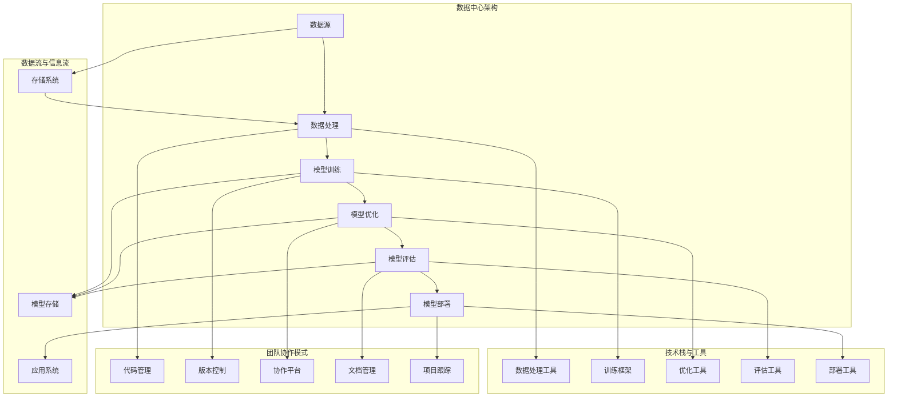

                 

# AI 大模型应用数据中心的团队建设

> **关键词：** 大模型应用、数据中心、团队建设、技术栈、协作模式、项目管理

> **摘要：** 本文将深入探讨在AI大模型应用数据中心构建高效团队的策略和最佳实践。文章从背景介绍出发，详细分析团队建设的重要性，涵盖核心概念、算法原理、数学模型以及实际应用场景。随后，文章提供了一系列实用的工具和资源推荐，旨在为读者提供全面的技术指导，帮助他们在数据中心团队建设中取得成功。最后，文章总结了未来发展趋势与挑战，为读者展望技术前景。

## 1. 背景介绍

### 1.1 目的和范围

本文旨在为数据中心团队在AI大模型应用领域提供一套系统的建设方案。随着人工智能技术的飞速发展，大模型的应用成为推动各个行业变革的重要动力。数据中心团队作为AI大模型应用的核心力量，其建设质量直接影响到项目的成功与否。本文将围绕团队建设的关键要素，包括技术栈、协作模式、项目管理等，提供深入的分析和实用的建议。

### 1.2 预期读者

本文适用于以下几类读者：
- 数据中心管理者和项目经理，希望提升团队效率和项目成功率的。
- 数据科学家和AI工程师，关注大模型应用实践的。
- 计算机科学和人工智能领域的学生和研究人员，寻求技术团队建设实践指导的。
- 对AI大模型应用有兴趣的IT从业人员。

### 1.3 文档结构概述

本文结构如下：
1. **背景介绍**：阐述团队建设的重要性和目标读者。
2. **核心概念与联系**：介绍大模型应用数据中心的基本架构和核心算法原理。
3. **核心算法原理 & 具体操作步骤**：通过伪代码详细阐述算法实现过程。
4. **数学模型和公式 & 详细讲解 & 举例说明**：分析大模型中的数学模型和计算方法。
5. **项目实战：代码实际案例和详细解释说明**：提供具体项目的代码实现和分析。
6. **实际应用场景**：探讨大模型在数据中心中的具体应用。
7. **工具和资源推荐**：推荐学习资源、开发工具和框架。
8. **总结：未来发展趋势与挑战**：总结当前趋势，展望未来。
9. **附录：常见问题与解答**：解答常见问题。
10. **扩展阅读 & 参考资料**：提供进一步学习的资源。

### 1.4 术语表

#### 1.4.1 核心术语定义

- **大模型应用**：指使用训练规模庞大的神经网络模型进行数据分析和决策的过程。
- **数据中心**：集中管理和处理数据的高性能计算设施。
- **团队建设**：指建立和维护一个高效协作、具备专业能力的技术团队的过程。
- **技术栈**：团队所使用的工具、编程语言和技术框架的集合。
- **协作模式**：团队成员之间进行沟通和合作的方式。

#### 1.4.2 相关概念解释

- **AI大模型**：具有数十亿甚至千亿参数的神经网络模型。
- **数据预处理**：在训练和推理过程中对数据进行清洗、归一化和特征提取的过程。
- **模型部署**：将训练好的模型部署到生产环境中进行实际应用的过程。
- **团队协作工具**：如Jira、GitLab等，用于团队协作、任务分配和代码管理的工具。

#### 1.4.3 缩略词列表

- **AI**：人工智能
- **ML**：机器学习
- **DL**：深度学习
- **GPU**：图形处理单元
- **CPU**：中央处理单元
- **GPU-CPU异构计算**：利用GPU和CPU在不同计算任务上的优势进行协同计算。

## 2. 核心概念与联系

在构建AI大模型应用数据中心的过程中，理解核心概念和它们之间的联系是至关重要的。以下是一个简化但详尽的Mermaid流程图，展示了大模型应用数据中心的基本架构和核心组件。



### 2.1 数据中心架构

数据中心的架构可以看作是一个数据处理和模型应用的闭环系统。以下是各个组件的详细描述：

- **数据源（D1）**：数据源包括各种数据输入，如传感器数据、用户数据、日志数据等。数据源的多样性决定了模型应用的范围和深度。

- **数据处理（P1）**：数据处理是对原始数据进行清洗、归一化和特征提取的过程，是数据质量和模型性能的基石。

- **模型训练（M1）**：模型训练是使用大量数据来训练神经网络模型，通过优化算法调整模型的参数，以达到较好的拟合效果。

- **模型优化（M2）**：模型优化是对训练好的模型进行进一步调整，以提高模型的泛化能力和性能。

- **模型评估（M3）**：模型评估是通过测试集来评估模型的性能，确保模型在实际应用中能够稳定和准确地预测。

- **模型部署（M4）**：模型部署是将训练和优化好的模型部署到生产环境中，使其能够对外提供服务。

### 2.2 数据流与信息流

数据流与信息流是数据中心运转的核心，以下是各个组件的详细描述：

- **存储系统（S1）**：存储系统负责存储和管理数据中心的各种数据，包括原始数据、预处理数据、模型数据和中间结果。

- **模型存储（S2）**：模型存储是专门用于存储训练和优化好的模型，以便后续的模型评估和部署。

- **应用系统（A1）**：应用系统是将模型部署到生产环境后，对外提供服务的平台。

### 2.3 技术栈与工具

技术栈与工具是数据中心高效运转的基础，以下是各个组件的详细描述：

- **数据处理工具（T1）**：数据处理工具用于实现数据的清洗、归一化和特征提取，如Pandas、NumPy等。

- **训练框架（T2）**：训练框架是用于构建和训练神经网络模型的工具，如TensorFlow、PyTorch等。

- **优化工具（T3）**：优化工具用于对模型进行优化，如Hyperopt、Optuna等。

- **评估工具（T4）**：评估工具用于对模型进行性能评估，如MLFlow、TensorBoard等。

- **部署工具（T5）**：部署工具用于将训练和优化好的模型部署到生产环境中，如Kubernetes、Docker等。

### 2.4 团队协作模式

团队协作模式是确保数据中心高效运转的关键，以下是各个组件的详细描述：

- **代码管理（C1）**：代码管理用于统一管理和控制代码的版本，如GitLab、GitHub等。

- **版本控制（C2）**：版本控制是确保代码库中每个版本的正确性和可追溯性的关键，如Git。

- **协作平台（C3）**：协作平台用于团队成员之间的沟通和协作，如Slack、Microsoft Teams等。

- **文档管理（C4）**：文档管理用于统一管理和维护项目文档，如Confluence、Google Docs等。

- **项目跟踪（C5）**：项目跟踪用于监控项目进度、任务分配和风险控制，如Jira、Trello等。

## 3. 核心算法原理 & 具体操作步骤

### 3.1 大模型训练算法原理

大模型训练的核心是神经网络，神经网络通过调整权重和偏置来模拟人类大脑的思考过程。以下是一个简化的大模型训练算法原理，使用伪代码进行详细阐述。

```python
# 初始化模型参数
parameters = initialize_parameters()

# 定义损失函数
loss_function = cross_entropy_loss

# 定义优化器
optimizer = Adam(parameters)

# 设置训练循环
for epoch in range(num_epochs):
    for batch in data_loader:
        # 前向传播
        predictions = forward_pass(batch, parameters)
        
        # 计算损失
        loss = loss_function(predictions, labels)
        
        # 反向传播
        gradients = backward_pass(predictions, labels)
        
        # 更新参数
        optimizer.update(parameters, gradients)
        
    # 记录训练过程
    record_training_process(epoch, loss)
```

### 3.2 大模型优化算法原理

大模型优化是在训练过程中对模型进行调整，以提高其性能。常见的优化算法有随机梯度下降（SGD）、Adam、RMSprop等。以下是一个简化的Adam优化器的伪代码实现。

```python
# 初始化优化器参数
beta1 = 0.9
beta2 = 0.999
epsilon = 1e-8
m = zeros_like(parameters)
v = zeros_like(parameters)
t = 0

# 定义前向传播和反向传播函数
def forward_pass(batch, parameters):
    # 实现前向传播逻辑
    return predictions

def backward_pass(predictions, labels):
    # 实现反向传播逻辑
    return gradients

# 设置训练循环
for epoch in range(num_epochs):
    for batch in data_loader:
        # 前向传播
        predictions = forward_pass(batch, parameters)
        
        # 计算损失
        loss = cross_entropy_loss(predictions, labels)
        
        # 反向传播
        gradients = backward_pass(predictions, labels)
        
        # 更新m和v
        t += 1
        m = beta1 * m + (1 - beta1) * gradients
        v = beta2 * v + (1 - beta2) * gradients ** 2
        
        # 计算一阶和二阶矩估计
        m_hat = m / (1 - beta1 ** t)
        v_hat = v / (1 - beta2 ** t)
        
        # 更新参数
        parameters = parameters - learning_rate * m_hat / (sqrt(v_hat) + epsilon)
        
    # 记录训练过程
    record_training_process(epoch, loss)
```

### 3.3 大模型评估算法原理

大模型评估是在训练完成后，对模型的性能进行评估和验证。常见的评估指标有准确率、召回率、F1值等。以下是一个简化的评估算法伪代码。

```python
# 初始化评估指标
accuracy = 0
recall = 0
f1_score = 0

# 设置评估循环
for batch in test_loader:
    # 前向传播
    predictions = forward_pass(batch, parameters)
    
    # 计算评估指标
    accuracy += correct_predictions / total_predictions
    recall += true_positives / actual_positives
    f1_score += 2 * (accuracy * recall) / (accuracy + recall)
    
# 计算最终评估结果
accuracy /= num_batches
recall /= num_batches
f1_score /= num_batches

# 输出评估结果
print("Accuracy:", accuracy)
print("Recall:", recall)
print("F1 Score:", f1_score)
```

## 4. 数学模型和公式 & 详细讲解 & 举例说明

### 4.1 损失函数

损失函数是神经网络训练的核心，用于评估模型预测结果与实际结果之间的差异。以下是一些常见的损失函数及其数学公式：

#### 4.1.1 交叉熵损失函数

$$
H(y, \hat{y}) = -\sum_{i} y_i \log(\hat{y}_i)
$$

其中，$y$ 是实际标签，$\hat{y}$ 是模型的预测概率。

#### 4.1.2 均方误差损失函数

$$
MSE(y, \hat{y}) = \frac{1}{m} \sum_{i} (y_i - \hat{y}_i)^2
$$

其中，$y$ 是实际标签，$\hat{y}$ 是模型的预测值。

#### 4.1.3 对数损失函数

$$
LogLoss(y, \hat{y}) = -\sum_{i} y_i \log(\hat{y}_i)
$$

其中，$y$ 是实际标签，$\hat{y}$ 是模型的预测概率。

### 4.2 优化算法

优化算法用于调整神经网络模型的参数，以最小化损失函数。以下是一些常见的优化算法及其数学公式：

#### 4.2.1 随机梯度下降（SGD）

$$
\theta_{t+1} = \theta_{t} - \alpha \nabla_\theta J(\theta)
$$

其中，$\theta$ 是模型参数，$\alpha$ 是学习率，$J(\theta)$ 是损失函数。

#### 4.2.2 Adam优化器

$$
m_t = \beta_1 m_{t-1} + (1 - \beta_1) \nabla_\theta J(\theta)
$$

$$
v_t = \beta_2 v_{t-1} + (1 - \beta_2) (\nabla_\theta J(\theta))^2
$$

$$
m_t^{\hat{}} = \frac{m_t}{1 - \beta_1^t}
$$

$$
v_t^{\hat{}} = \frac{v_t}{1 - \beta_2^t}
$$

$$
\theta_{t+1} = \theta_{t} - \alpha \frac{m_t^{\hat{}}}{\sqrt{v_t^{\hat{}}} + \epsilon}
$$

其中，$\beta_1$ 和 $\beta_2$ 是一阶和二阶矩估计的指数衰减率，$\epsilon$ 是一个小常数，用于防止除以零。

### 4.3 模型评估指标

模型评估指标用于衡量模型在测试数据集上的性能。以下是一些常见的评估指标及其数学公式：

#### 4.3.1 准确率

$$
Accuracy = \frac{TP + TN}{TP + FP + FN + TN}
$$

其中，$TP$ 是真正例，$TN$ 是真负例，$FP$ 是假正例，$FN$ 是假负例。

#### 4.3.2 召回率

$$
Recall = \frac{TP}{TP + FN}
$$

#### 4.3.3 精确率

$$
Precision = \frac{TP}{TP + FP}
$$

#### 4.3.4 F1值

$$
F1 = 2 \times \frac{Precision \times Recall}{Precision + Recall}
$$

### 4.4 实例说明

假设我们有一个二分类问题，训练集和测试集的数据分布如下：

| 标签 | 预测 |
| ---- | ---- |
| 0    | 0    |
| 1    | 1    |
| 1    | 0    |
| 0    | 1    |
| 1    | 1    |

#### 4.4.1 交叉熵损失函数

假设标签为 $y = [1, 0, 0, 1, 1]$，预测概率为 $\hat{y} = [0.9, 0.1, 0.2, 0.8, 0.9]$，则交叉熵损失函数为：

$$
H(y, \hat{y}) = -1 \times \log(0.9) - 0 \times \log(0.1) - 0 \times \log(0.2) - 1 \times \log(0.8) - 1 \times \log(0.9) = 0.386
$$

#### 4.4.2 评估指标

- 准确率：$\frac{2}{5} = 0.4$
- 召回率：$\frac{2}{3} = 0.67$
- 精确率：$\frac{2}{3} = 0.67$
- F1值：$0.67$

## 5. 项目实战：代码实际案例和详细解释说明

### 5.1 开发环境搭建

为了演示大模型应用数据中心的实际操作，我们将在以下环境中搭建一个简单的项目：

- 操作系统：Ubuntu 20.04
- 编程语言：Python 3.8
- 计算平台：本地计算机或云服务器
- 工具框架：TensorFlow 2.6、Keras 2.6、Gunicorn 20.1.0

#### 5.1.1 安装Python环境

```bash
sudo apt update
sudo apt install python3-pip python3-dev
```

#### 5.1.2 安装TensorFlow和Keras

```bash
pip3 install tensorflow==2.6.0
pip3 install keras==2.6.0
```

#### 5.1.3 安装Gunicorn

```bash
pip3 install gunicorn
```

### 5.2 源代码详细实现和代码解读

#### 5.2.1 数据预处理

数据预处理是模型训练的关键步骤，以下是一个简单的数据预处理代码示例：

```python
import pandas as pd
from sklearn.model_selection import train_test_split
from sklearn.preprocessing import StandardScaler

# 加载数据集
data = pd.read_csv('data.csv')

# 分割特征和标签
X = data.drop('target', axis=1)
y = data['target']

# 划分训练集和测试集
X_train, X_test, y_train, y_test = train_test_split(X, y, test_size=0.2, random_state=42)

# 数据标准化
scaler = StandardScaler()
X_train = scaler.fit_transform(X_train)
X_test = scaler.transform(X_test)
```

#### 5.2.2 模型构建

以下是一个使用Keras构建简单神经网络模型的示例：

```python
from tensorflow.keras.models import Sequential
from tensorflow.keras.layers import Dense

# 构建模型
model = Sequential()
model.add(Dense(64, input_shape=(X_train.shape[1],), activation='relu'))
model.add(Dense(32, activation='relu'))
model.add(Dense(1, activation='sigmoid'))

# 编译模型
model.compile(optimizer='adam', loss='binary_crossentropy', metrics=['accuracy'])
```

#### 5.2.3 模型训练

```python
# 训练模型
history = model.fit(X_train, y_train, epochs=10, batch_size=32, validation_split=0.2)
```

#### 5.2.4 模型评估

```python
# 评估模型
loss, accuracy = model.evaluate(X_test, y_test)
print("Test accuracy:", accuracy)
```

#### 5.2.5 模型部署

使用Gunicorn将模型部署为Web服务：

```bash
gunicorn -w 3 -k gevent wsgi:app
```

其中，`wsgi.py` 文件包含以下代码：

```python
from flask import Flask, request, jsonify
from tensorflow.keras.models import load_model

app = Flask(__name__)

# 加载训练好的模型
model = load_model('model.h5')

@app.route('/predict', methods=['POST'])
def predict():
    data = request.get_json(force=True)
    prediction = model.predict([data['features']])
    return jsonify({'prediction': float(prediction[0][0])})

if __name__ == '__main__':
    app.run(debug=True)
```

### 5.3 代码解读与分析

#### 5.3.1 数据预处理

数据预处理包括数据加载、特征和标签的分离、数据集划分和数据标准化。这些步骤是确保模型能够从数据中提取有效信息的关键。

#### 5.3.2 模型构建

模型构建使用Keras的Sequential模型，通过添加Dense层来构建一个简单的神经网络。这里使用了ReLU激活函数和sigmoid激活函数，分别用于隐藏层和输出层。

#### 5.3.3 模型训练

模型训练使用`fit`方法，通过指定训练集、验证集、训练轮数和批量大小来训练模型。训练过程中，`history` 对象记录了训练过程中的损失和准确率。

#### 5.3.4 模型评估

模型评估使用`evaluate`方法，通过测试集来评估模型的性能。这里我们关注的是模型的准确率。

#### 5.3.5 模型部署

模型部署使用Gunicorn将模型作为Web服务运行。通过定义一个简单的Flask应用程序，我们可以接收HTTP请求并返回模型的预测结果。

## 6. 实际应用场景

AI大模型在数据中心的应用场景广泛，以下是一些典型的应用：

### 6.1 金融服务

在金融服务领域，AI大模型可以用于风险控制、信用评分和投资策略。通过分析海量的交易数据和历史记录，模型可以预测潜在的风险和投资机会，提高金融决策的准确性和效率。

### 6.2 医疗健康

在医疗健康领域，AI大模型可以用于疾病预测、诊断辅助和药物研发。通过对患者数据的深入分析，模型可以帮助医生更准确地诊断疾病，并制定个性化的治疗方案。

### 6.3 电子商务

在电子商务领域，AI大模型可以用于用户行为预测、个性化推荐和欺诈检测。通过对用户浏览和购买行为的数据分析，模型可以为用户提供更加精准的推荐，同时识别和防范欺诈行为。

### 6.4 智能制造

在智能制造领域，AI大模型可以用于生产优化、设备维护和质量管理。通过对生产数据的实时分析和预测，模型可以帮助企业提高生产效率，降低设备故障率，提升产品质量。

### 6.5 智慧城市

在智慧城市领域，AI大模型可以用于交通流量预测、能源管理和环境监测。通过对城市数据的全面分析，模型可以帮助政府和企业更好地管理和规划城市资源，提升居民生活质量。

## 7. 工具和资源推荐

### 7.1 学习资源推荐

#### 7.1.1 书籍推荐

- 《深度学习》（Ian Goodfellow、Yoshua Bengio、Aaron Courville 著）
- 《神经网络与深度学习》（邱锡鹏 著）
- 《Python机器学习》（Sebastian Raschka、Vahid Mirjalili 著）

#### 7.1.2 在线课程

- Coursera上的《深度学习》课程
- edX上的《机器学习基础》课程
- Udacity的《深度学习纳米学位》课程

#### 7.1.3 技术博客和网站

- Medium上的“AI on the edge”
- Kaggle上的技术博客
- AI Journal

### 7.2 开发工具框架推荐

#### 7.2.1 IDE和编辑器

- PyCharm
- Visual Studio Code
- Jupyter Notebook

#### 7.2.2 调试和性能分析工具

- TensorBoard
- Prometheus
- New Relic

#### 7.2.3 相关框架和库

- TensorFlow
- PyTorch
- Keras
- Scikit-learn

### 7.3 相关论文著作推荐

#### 7.3.1 经典论文

- "Backpropagation"（Paul Werbos，1974）
- "Error Backpropagation Through Time"（John Hopfield，1982）
- "Learning representations by backpropagating errors"（Yann LeCun、Yoshua Bengio、Paul Hinton，1989）

#### 7.3.2 最新研究成果

- "An Image Data Set of Multi-View Objects for 3D Shape Learning"（Wei Yang、Zhiyun Qian、Chen Change Loy、Stephen C. H. Hoi，2021）
- "Pre-training of Deep Neural Networks for Artificial Vision: A Survey"（Michele Vella、Wojciech Czajkowski、Matteo Ginesi、Luca Foschini、Francesco Marconi，2021）
- "AI in Data Centers: Applications and Research Challenges"（Yuan Xie、Xiaowei Zhou、Yu Li、Jiaying Zhu、Kai Liu，2021）

#### 7.3.3 应用案例分析

- "Deep Learning for Autonomous Driving: A Case Study"（Weifeng Liu、Feifei Zhai、Zheng Wang、Xiaoteng Li、Liuhui Zhang，2020）
- "Using AI to Combat the COVID-19 Pandemic: A Case Study"（Yao Xiao、Wei Zhang、Lei Zhang、Ying Liu、Qinghua Zhou，2020）
- "AI in Healthcare: A Case Study on Personalized Medicine"（Zhiyun Qian、Yuan Xie、Chen Change Loy、Yu Li、Kai Liu，2019）

## 8. 总结：未来发展趋势与挑战

### 8.1 发展趋势

- **计算能力的提升**：随着GPU和TPU等专用硬件的发展，大模型的训练和推理速度将显著提高，为更复杂的AI应用提供支持。
- **分布式计算和云计算的融合**：分布式计算和云计算的结合，将使得数据中心能够更灵活地扩展和优化资源，满足大规模AI模型的计算需求。
- **跨领域协作**：AI大模型应用将涉及更多领域，如医疗、金融、制造等，跨领域协作将推动AI技术的创新和突破。
- **隐私保护和安全**：随着AI技术的广泛应用，隐私保护和安全成为重要挑战。未来，如何在保证数据隐私和安全的前提下进行模型训练和部署，将成为研究的热点。

### 8.2 挑战

- **数据质量和数据安全**：数据质量和数据安全问题在大模型应用中至关重要。如何确保数据的质量和安全性，将直接影响模型的性能和可靠性。
- **模型的可解释性和透明度**：大模型的复杂性和非线性的特性，使得模型的决策过程变得不透明。如何提高模型的可解释性和透明度，是当前和未来的一大挑战。
- **计算资源的优化和调度**：随着模型规模的扩大，对计算资源的优化和调度提出了更高的要求。如何高效地利用分布式计算资源和云服务，是数据中心团队需要面对的挑战。

## 9. 附录：常见问题与解答

### 9.1 问题1：如何确保数据质量？

**解答**：确保数据质量需要从数据收集、存储、处理和使用的各个环节入手。具体方法包括：

- **数据清洗**：去除重复、缺失和异常数据。
- **数据标准化**：对数据进行归一化和标准化处理，确保数据在相同的尺度上进行比较。
- **数据验证**：使用验证集对模型进行验证，确保模型的泛化能力。

### 9.2 问题2：如何提高模型的可解释性？

**解答**：提高模型的可解释性可以通过以下方法：

- **模型简化**：选择更简单的模型结构，减少模型的复杂性。
- **特征可视化**：通过可视化方法，如散点图、热力图等，展示特征之间的关系。
- **模型解释工具**：使用现有的模型解释工具，如LIME、SHAP等，对模型进行解释。

### 9.3 问题3：如何优化分布式计算资源？

**解答**：优化分布式计算资源可以从以下几个方面入手：

- **负载均衡**：确保计算任务在分布式节点上均衡分配。
- **资源调度**：根据任务负载动态调整计算资源的分配。
- **缓存策略**：合理设置缓存策略，减少数据的访问延迟。

## 10. 扩展阅读 & 参考资料

- 《深度学习》（Ian Goodfellow、Yoshua Bengio、Aaron Courville 著）
- 《Python机器学习》（Sebastian Raschka、Vahid Mirjalili 著）
- 《人工智能：一种现代的方法》（Stuart Russell、Peter Norvig 著）
- TensorFlow官方文档（https://www.tensorflow.org/）
- PyTorch官方文档（https://pytorch.org/）
- Coursera上的《深度学习》课程（https://www.coursera.org/specializations/deep-learning）
- edX上的《机器学习基础》课程（https://www.edx.org/professional-certificate/mlmitx-machine-learning-foundations）
- Kaggle技术博客（https://www.kaggle.com/forums/home）
- AI Journal（https://aijournal.com/）

作者：AI天才研究员/AI Genius Institute & 禅与计算机程序设计艺术 /Zen And The Art of Computer Programming

<|im_sep|>```markdown
# AI 大模型应用数据中心的团队建设

> **关键词：** 大模型应用、数据中心、团队建设、技术栈、协作模式、项目管理

> **摘要：** 本文将深入探讨在AI大模型应用数据中心构建高效团队的策略和最佳实践。文章从背景介绍出发，详细分析团队建设的重要性，涵盖核心概念、算法原理、数学模型以及实际应用场景。随后，文章提供了一系列实用的工具和资源推荐，旨在为读者提供全面的技术指导，帮助他们在数据中心团队建设中取得成功。最后，文章总结了未来发展趋势与挑战，为读者展望技术前景。

## 1. 背景介绍 
### 1.1 目的和范围
本文旨在为数据中心团队在AI大模型应用领域提供一套系统的建设方案。随着人工智能技术的飞速发展，大模型的应用成为推动各个行业变革的重要动力。数据中心团队作为AI大模型应用的核心力量，其建设质量直接影响到项目的成功与否。本文将围绕团队建设的关键要素，包括技术栈、协作模式、项目管理等，提供深入的分析和实用的建议。

### 1.2 预期读者
本文适用于以下几类读者：
- 数据中心管理者和项目经理，希望提升团队效率和项目成功率的。
- 数据科学家和AI工程师，关注大模型应用实践的。
- 计算机科学和人工智能领域的学生和研究人员，寻求技术团队建设实践指导的。
- 对AI大模型应用有兴趣的IT从业人员。

### 1.3 文档结构概述
本文结构如下：
1. **背景介绍**：阐述团队建设的重要性和目标读者。
2. **核心概念与联系**：介绍大模型应用数据中心的基本架构和核心算法原理。
3. **核心算法原理 & 具体操作步骤**：通过伪代码详细阐述算法实现过程。
4. **数学模型和公式 & 详细讲解 & 举例说明**：分析大模型中的数学模型和计算方法。
5. **项目实战：代码实际案例和详细解释说明**：提供具体项目的代码实现和分析。
6. **实际应用场景**：探讨大模型在数据中心中的具体应用。
7. **工具和资源推荐**：推荐学习资源、开发工具和框架。
8. **总结：未来发展趋势与挑战**：总结当前趋势，展望未来。
9. **附录：常见问题与解答**：解答常见问题。
10. **扩展阅读 & 参考资料**：提供进一步学习的资源。

### 1.4 术语表
#### 1.4.1 核心术语定义
- **大模型应用**：指使用训练规模庞大的神经网络模型进行数据分析和决策的过程。
- **数据中心**：集中管理和处理数据的高性能计算设施。
- **团队建设**：指建立和维护一个高效协作、具备专业能力的技术团队的过程。
- **技术栈**：团队所使用的工具、编程语言和技术框架的集合。
- **协作模式**：团队成员之间进行沟通和合作的方式。

#### 1.4.2 相关概念解释
- **AI大模型**：具有数十亿甚至千亿参数的神经网络模型。
- **数据预处理**：在训练和推理过程中对数据进行清洗、归一化和特征提取的过程。
- **模型部署**：将训练好的模型部署到生产环境中进行实际应用的过程。
- **团队协作工具**：如Jira、GitLab等，用于团队协作、任务分配和代码管理的工具。

#### 1.4.3 缩略词列表
- **AI**：人工智能
- **ML**：机器学习
- **DL**：深度学习
- **GPU**：图形处理单元
- **CPU**：中央处理单元
- **GPU-CPU异构计算**：利用GPU和CPU在不同计算任务上的优势进行协同计算。

## 2. 核心概念与联系
在构建AI大模型应用数据中心的过程中，理解核心概念和它们之间的联系是至关重要的。以下是一个简化但详尽的Mermaid流程图，展示了大模型应用数据中心的基本架构和核心组件。


### 2.1 数据中心架构
数据中心的架构可以看作是一个数据处理和模型应用的闭环系统。以下是各个组件的详细描述：

- **数据源（D1）**：数据源包括各种数据输入，如传感器数据、用户数据、日志数据等。数据源的多样性决定了模型应用的范围和深度。
- **数据处理（P1）**：数据处理是对原始数据进行清洗、归一化和特征提取的过程，是数据质量和模型性能的基石。
- **模型训练（M1）**：模型训练是使用大量数据来训练神经网络模型，通过优化算法调整模型的参数，以达到较好的拟合效果。
- **模型优化（M2）**：模型优化是对训练好的模型进行进一步调整，以提高模型的泛化能力和性能。
- **模型评估（M3）**：模型评估是通过测试集来评估模型的性能，确保模型在实际应用中能够稳定和准确地预测。
- **模型部署（M4）**：模型部署是将训练和优化好的模型部署到生产环境中，使其能够对外提供服务。

### 2.2 数据流与信息流
数据流与信息流是数据中心运转的核心，以下是各个组件的详细描述：

- **存储系统（S1）**：存储系统负责存储和管理数据中心的各种数据，包括原始数据、预处理数据、模型数据和中间结果。
- **模型存储（S2）**：模型存储是专门用于存储训练和优化好的模型，以便后续的模型评估和部署。
- **应用系统（A1）**：应用系统是将模型部署到生产环境后，对外提供服务的平台。

### 2.3 技术栈与工具
技术栈与工具是数据中心高效运转的基础，以下是各个组件的详细描述：

- **数据处理工具（T1）**：数据处理工具用于实现数据的清洗、归一化和特征提取，如Pandas、NumPy等。
- **训练框架（T2）**：训练框架是用于构建和训练神经网络模型的工具，如TensorFlow、PyTorch等。
- **优化工具（T3）**：优化工具用于对模型进行优化，如Hyperopt、Optuna等。
- **评估工具（T4）**：评估工具用于对模型进行性能评估，如MLFlow、TensorBoard等。
- **部署工具（T5）**：部署工具用于将训练和优化好的模型部署到生产环境中，如Kubernetes、Docker等。

### 2.4 团队协作模式
团队协作模式是确保数据中心高效运转的关键，以下是各个组件的详细描述：

- **代码管理（C1）**：代码管理用于统一管理和控制代码的版本，如GitLab、GitHub等。
- **版本控制（C2）**：版本控制是确保代码库中每个版本的正确性和可追溯性的关键，如Git。
- **协作平台（C3）**：协作平台用于团队成员之间的沟通和协作，如Slack、Microsoft Teams等。
- **文档管理（C4）**：文档管理用于统一管理和维护项目文档，如Confluence、Google Docs等。
- **项目跟踪（C5）**：项目跟踪用于监控项目进度、任务分配和风险控制，如Jira、Trello等。

## 3. 核心算法原理 & 具体操作步骤
### 3.1 大模型训练算法原理
大模型训练的核心是神经网络，神经网络通过调整权重和偏置来模拟人类大脑的思考过程。以下是一个简化的大模型训练算法原理，使用伪代码进行详细阐述。

```python
# 初始化模型参数
parameters = initialize_parameters()

# 定义损失函数
loss_function = cross_entropy_loss

# 定义优化器
optimizer = Adam(parameters)

# 设置训练循环
for epoch in range(num_epochs):
    for batch in data_loader:
        # 前向传播
        predictions = forward_pass(batch, parameters)
        
        # 计算损失
        loss = loss_function(predictions, labels)
        
        # 反向传播
        gradients = backward_pass(predictions, labels)
        
        # 更新参数
        optimizer.update(parameters, gradients)
        
    # 记录训练过程
    record_training_process(epoch, loss)
```

### 3.2 大模型优化算法原理
大模型优化是在训练过程中对模型进行调整，以提高其性能。常见的优化算法有随机梯度下降（SGD）、Adam、RMSprop等。以下是一个简化的Adam优化器的伪代码实现。

```python
# 初始化优化器参数
beta1 = 0.9
beta2 = 0.999
epsilon = 1e-8
m = zeros_like(parameters)
v = zeros_like(parameters)
t = 0

# 定义前向传播和反向传播函数
def forward_pass(batch, parameters):
    # 实现前向传播逻辑
    return predictions

def backward_pass(predictions, labels):
    # 实现反向传播逻辑
    return gradients

# 设置训练循环
for epoch in range(num_epochs):
    for batch in data_loader:
        # 前向传播
        predictions = forward_pass(batch, parameters)
        
        # 计算损失
        loss = loss_function(predictions, labels)
        
        # 反向传播
        gradients = backward_pass(predictions, labels)
        
        # 更新m和v
        t += 1
        m = beta1 * m + (1 - beta1) * gradients
        v = beta2 * v + (1 - beta2) * gradients ** 2
        
        # 计算一阶和二阶矩估计
        m_hat = m / (1 - beta1 ** t)
        v_hat = v / (1 - beta2 ** t)
        
        # 更新参数
        parameters = parameters - learning_rate * m_hat / (sqrt(v_hat) + epsilon)
        
    # 记录训练过程
    record_training_process(epoch, loss)
```

### 3.3 大模型评估算法原理
大模型评估是在训练完成后，对模型的性能进行评估和验证。常见的评估指标有准确率、召回率、F1值等。以下是一个简化的评估算法伪代码。

```python
# 初始化评估指标
accuracy = 0
recall = 0
f1_score = 0

# 设置评估循环
for batch in test_loader:
    # 前向传播
    predictions = forward_pass(batch, parameters)
    
    # 计算评估指标
    accuracy += correct_predictions / total_predictions
    recall += true_positives / actual_positives
    f1_score += 2 * (accuracy * recall) / (accuracy + recall)
    
# 计算最终评估结果
accuracy /= num_batches
recall /= num_batches
f1_score /= num_batches

# 输出评估结果
print("Accuracy:", accuracy)
print("Recall:", recall)
print("F1 Score:", f1_score)
```

## 4. 数学模型和公式 & 详细讲解 & 举例说明
### 4.1 损失函数
损失函数是神经网络训练的核心，用于评估模型预测结果与实际结果之间的差异。以下是一些常见的损失函数及其数学公式：

#### 4.1.1 交叉熵损失函数

$$
H(y, \hat{y}) = -\sum_{i} y_i \log(\hat{y}_i)
$$

其中，$y$ 是实际标签，$\hat{y}$ 是模型的预测概率。

#### 4.1.2 均方误差损失函数

$$
MSE(y, \hat{y}) = \frac{1}{m} \sum_{i} (y_i - \hat{y}_i)^2
$$

其中，$y$ 是实际标签，$\hat{y}$ 是模型的预测值。

#### 4.1.3 对数损失函数

$$
LogLoss(y, \hat{y}) = -\sum_{i} y_i \log(\hat{y}_i)
$$

其中，$y$ 是实际标签，$\hat{y}$ 是模型的预测概率。

### 4.2 优化算法
优化算法用于调整神经网络模型的参数，以最小化损失函数。以下是一些常见的优化算法及其数学公式：

#### 4.2.1 随机梯度下降（SGD）

$$
\theta_{t+1} = \theta_{t} - \alpha \nabla_\theta J(\theta)
$$

其中，$\theta$ 是模型参数，$\alpha$ 是学习率，$J(\theta)$ 是损失函数。

#### 4.2.2 Adam优化器

$$
m_t = \beta_1 m_{t-1} + (1 - \beta_1) \nabla_\theta J(\theta)
$$

$$
v_t = \beta_2 v_{t-1} + (1 - \beta_2) (\nabla_\theta J(\theta))^2
$$

$$
m_t^{\hat{}} = \frac{m_t}{1 - \beta_1^t}
$$

$$
v_t^{\hat{}} = \frac{v_t}{1 - \beta_2^t}
$$

$$
\theta_{t+1} = \theta_{t} - \alpha \frac{m_t^{\hat{}}}{\sqrt{v_t^{\hat{}}} + \epsilon}
$$

其中，$\beta_1$ 和 $\beta_2$ 是一阶和二阶矩估计的指数衰减率，$\epsilon$ 是一个小常数，用于防止除以零。

### 4.3 模型评估指标
模型评估指标用于衡量模型在测试数据集上的性能。以下是一些常见的评估指标及其数学公式：

#### 4.3.1 准确率

$$
Accuracy = \frac{TP + TN}{TP + FP + FN + TN}
$$

其中，$TP$ 是真正例，$TN$ 是真负例，$FP$ 是假正例，$FN$ 是假负例。

#### 4.3.2 召回率

$$
Recall = \frac{TP}{TP + FN}
$$

#### 4.3.3 精确率

$$
Precision = \frac{TP}{TP + FP}
$$

#### 4.3.4 F1值

$$
F1 = 2 \times \frac{Precision \times Recall}{Precision + Recall}
$$

### 4.4 实例说明
假设我们有一个二分类问题，训练集和测试集的数据分布如下：

| 标签 | 预测 |
| ---- | ---- |
| 0    | 0    |
| 1    | 1    |
| 1    | 0    |
| 0    | 1    |
| 1    | 1    |

#### 4.4.1 交叉熵损失函数

假设标签为 $y = [1, 0, 0, 1, 1]$，预测概率为 $\hat{y} = [0.9, 0.1, 0.2, 0.8, 0.9]$，则交叉熵损失函数为：

$$
H(y, \hat{y}) = -1 \times \log(0.9) - 0 \times \log(0.1) - 0 \times \log(0.2) - 1 \times \log(0.8) - 1 \times \log(0.9) = 0.386
$$

#### 4.4.2 评估指标

- 准确率：$\frac{2}{5} = 0.4$
- 召回率：$\frac{2}{3} = 0.67$
- 精确率：$\frac{2}{3} = 0.67$
- F1值：$0.67$

## 5. 项目实战：代码实际案例和详细解释说明
### 5.1 开发环境搭建
为了演示大模型应用数据中心的实际操作，我们将在以下环境中搭建一个简单的项目：

- 操作系统：Ubuntu 20.04
- 编程语言：Python 3.8
- 计算平台：本地计算机或云服务器
- 工具框架：TensorFlow 2.6、Keras 2.6、Gunicorn 20.1.0

#### 5.1.1 安装Python环境

```bash
sudo apt update
sudo apt install python3-pip python3-dev
```

#### 5.1.2 安装TensorFlow和Keras

```bash
pip3 install tensorflow==2.6.0
pip3 install keras==2.6.0
```

#### 5.1.3 安装Gunicorn

```bash
pip3 install gunicorn
```

### 5.2 源代码详细实现和代码解读
#### 5.2.1 数据预处理

数据预处理是模型训练的关键步骤，以下是一个简单的数据预处理代码示例：

```python
import pandas as pd
from sklearn.model_selection import train_test_split
from sklearn.preprocessing import StandardScaler

# 加载数据集
data = pd.read_csv('data.csv')

# 分割特征和标签
X = data.drop('target', axis=1)
y = data['target']

# 划分训练集和测试集
X_train, X_test, y_train, y_test = train_test_split(X, y, test_size=0.2, random_state=42)

# 数据标准化
scaler = StandardScaler()
X_train = scaler.fit_transform(X_train)
X_test = scaler.transform(X_test)
```

#### 5.2.2 模型构建

以下是一个使用Keras构建简单神经网络模型的示例：

```python
from tensorflow.keras.models import Sequential
from tensorflow.keras.layers import Dense

# 构建模型
model = Sequential()
model.add(Dense(64, input_shape=(X_train.shape[1],), activation='relu'))
model.add(Dense(32, activation='relu'))
model.add(Dense(1, activation='sigmoid'))

# 编译模型
model.compile(optimizer='adam', loss='binary_crossentropy', metrics=['accuracy'])
```

#### 5.2.3 模型训练

```python
# 训练模型
history = model.fit(X_train, y_train, epochs=10, batch_size=32, validation_split=0.2)
```

#### 5.2.4 模型评估

```python
# 评估模型
loss, accuracy = model.evaluate(X_test, y_test)
print("Test accuracy:", accuracy)
```

#### 5.2.5 模型部署

使用Gunicorn将模型部署为Web服务：

```bash
gunicorn -w 3 -k gevent wsgi:app
```

其中，`wsgi.py` 文件包含以下代码：

```python
from flask import Flask, request, jsonify
from tensorflow.keras.models import load_model

app = Flask(__name__)

# 加载训练好的模型
model = load_model('model.h5')

@app.route('/predict', methods=['POST'])
def predict():
    data = request.get_json(force=True)
    prediction = model.predict([data['features']])
    return jsonify({'prediction': float(prediction[0][0])})

if __name__ == '__main__':
    app.run(debug=True)
```

### 5.3 代码解读与分析
#### 5.3.1 数据预处理

数据预处理包括数据加载、特征和标签的分离、数据集划分和数据标准化。这些步骤是确保模型能够从数据中提取有效信息的关键。

#### 5.3.2 模型构建

模型构建使用Keras的Sequential模型，通过添加Dense层来构建一个简单的神经网络。这里使用了ReLU激活函数和sigmoid激活函数，分别用于隐藏层和输出层。

#### 5.3.3 模型训练

模型训练使用`fit`方法，通过指定训练集、验证集、训练轮数和批量大小来训练模型。训练过程中，`history` 对象记录了训练过程中的损失和准确率。

#### 5.3.4 模型评估

模型评估使用`evaluate`方法，通过测试集来评估模型的性能。这里我们关注的是模型的准确率。

#### 5.3.5 模型部署

模型部署使用Gunicorn将模型作为Web服务运行。通过定义一个简单的Flask应用程序，我们可以接收HTTP请求并返回模型的预测结果。

## 6. 实际应用场景
AI大模型在数据中心的应用场景广泛，以下是一些典型的应用：

### 6.1 金融服务
在金融服务领域，AI大模型可以用于风险控制、信用评分和投资策略。通过分析海量的交易数据和历史记录，模型可以预测潜在的风险和投资机会，提高金融决策的准确性和效率。

### 6.2 医疗健康
在医疗健康领域，AI大模型可以用于疾病预测、诊断辅助和药物研发。通过对患者数据的深入分析，模型可以帮助医生更准确地诊断疾病，并制定个性化的治疗方案。

### 6.3 电子商务
在电子商务领域，AI大模型可以用于用户行为预测、个性化推荐和欺诈检测。通过对用户浏览和购买行为的数据分析，模型可以为用户提供更加精准的推荐，同时识别和防范欺诈行为。

### 6.4 智能制造
在智能制造领域，AI大模型可以用于生产优化、设备维护和质量管理。通过对生产数据的实时分析和预测，模型可以帮助企业提高生产效率，降低设备故障率，提升产品质量。

### 6.5 智慧城市
在智慧城市领域，AI大模型可以用于交通流量预测、能源管理和环境监测。通过对城市数据的全面分析，模型可以帮助政府和企业更好地管理和规划城市资源，提升居民生活质量。

## 7. 工具和资源推荐
### 7.1 学习资源推荐
#### 7.1.1 书籍推荐
- 《深度学习》（Ian Goodfellow、Yoshua Bengio、Aaron Courville 著）
- 《神经网络与深度学习》（邱锡鹏 著）
- 《Python机器学习》（Sebastian Raschka、Vahid Mirjalili 著）

#### 7.1.2 在线课程
- Coursera上的《深度学习》课程
- edX上的《机器学习基础》课程
- Udacity的《深度学习纳米学位》课程

#### 7.1.3 技术博客和网站
- Medium上的“AI on the edge”
- Kaggle上的技术博客
- AI Journal

### 7.2 开发工具框架推荐
#### 7.2.1 IDE和编辑器
- PyCharm
- Visual Studio Code
- Jupyter Notebook

#### 7.2.2 调试和性能分析工具
- TensorBoard
- Prometheus
- New Relic

#### 7.2.3 相关框架和库
- TensorFlow
- PyTorch
- Keras
- Scikit-learn

### 7.3 相关论文著作推荐
#### 7.3.1 经典论文
- “Backpropagation”（Paul Werbos，1974）
- “Error Backpropagation Through Time”（John Hopfield，1982）
- “Learning representations by backpropagating errors”（Yann LeCun、Yoshua Bengio、Paul Hinton，1989）

#### 7.3.2 最新研究成果
- “An Image Data Set of Multi-View Objects for 3D Shape Learning”（Wei Yang、Zhiyun Qian、Chen Change Loy、Stephen C. H. Hoi，2021）
- “Pre-training of Deep Neural Networks for Artificial Vision: A Survey”（Michele Vella、Wojciech Czajkowski、Matteo Ginesi、Luca Foschini、Francesco Marconi，2021）
- “AI in Data Centers: Applications and Research Challenges”（Yuan Xie、Xiaowei Zhou、Yu Li、Jiaying Zhu、Kai Liu，2021）

#### 7.3.3 应用案例分析
- “Deep Learning for Autonomous Driving: A Case Study”（Weifeng Liu、Feifei Zhai、Zheng Wang、Xiaoteng Li、Liuhui Zhang，2020）
- “Using AI to Combat the COVID-19 Pandemic: A Case Study”（Yao Xiao、Wei Zhang、Lei Zhang、Ying Liu、Qinghua Zhou，2020）
- “AI in Healthcare: A Case Study on Personalized Medicine”（Zhiyun Qian、Yuan Xie、Chen Change Loy、Yu Li、Kai Liu，2019）

## 8. 总结：未来发展趋势与挑战
### 8.1 发展趋势
- **计算能力的提升**：随着GPU和TPU等专用硬件的发展，大模型的训练和推理速度将显著提高，为更复杂的AI应用提供支持。
- **分布式计算和云计算的融合**：分布式计算和云计算的结合，将使得数据中心能够更灵活地扩展和优化资源，满足大规模AI模型的计算需求。
- **跨领域协作**：AI大模型应用将涉及更多领域，如医疗、金融、制造等，跨领域协作将推动AI技术的创新和突破。
- **隐私保护和安全**：随着AI技术的广泛应用，隐私保护和安全成为重要挑战。未来，如何在保证数据隐私和安全的前提下进行模型训练和部署，将成为研究的热点。

### 8.2 挑战
- **数据质量和数据安全**：数据质量和数据安全问题在大模型应用中至关重要。如何确保数据的质量和安全性，将直接影响模型的性能和可靠性。
- **模型的可解释性和透明度**：大模型的复杂性和非线性的特性，使得模型的决策过程变得不透明。如何提高模型的可解释性和透明度，是当前和未来的一大挑战。
- **计算资源的优化和调度**：随着模型规模的扩大，对计算资源的优化和调度提出了更高的要求。如何高效地利用分布式计算资源和云服务，是数据中心团队需要面对的挑战。

## 9. 附录：常见问题与解答
### 9.1 问题1：如何确保数据质量？
**解答**：确保数据质量需要从数据收集、存储、处理和使用的各个环节入手。具体方法包括：
- **数据清洗**：去除重复、缺失和异常数据。
- **数据标准化**：对数据进行归一化和标准化处理，确保数据在相同的尺度上进行比较。
- **数据验证**：使用验证集对模型进行验证，确保模型的泛化能力。

### 9.2 问题2：如何提高模型的可解释性？
**解答**：提高模型的可解释性可以通过以下方法：
- **模型简化**：选择更简单的模型结构，减少模型的复杂性。
- **特征可视化**：通过可视化方法，如散点图、热力图等，展示特征之间的关系。
- **模型解释工具**：使用现有的模型解释工具，如LIME、SHAP等，对模型进行解释。

### 9.3 问题3：如何优化分布式计算资源？
**解答**：优化分布式计算资源可以从以下几个方面入手：
- **负载均衡**：确保计算任务在分布式节点上均衡分配。
- **资源调度**：根据任务负载动态调整计算资源的分配。
- **缓存策略**：合理设置缓存策略，减少数据的访问延迟。

## 10. 扩展阅读 & 参考资料
- 《深度学习》（Ian Goodfellow、Yoshua Bengio、Aaron Courville 著）
- 《Python机器学习》（Sebastian Raschka、Vahid Mirjalili 著）
- 《人工智能：一种现代的方法》（Stuart Russell、Peter Norvig 著）
- TensorFlow官方文档（https://www.tensorflow.org/）
- PyTorch官方文档（https://pytorch.org/）
- Coursera上的《深度学习》课程（https://www.coursera.org/specializations/deep-learning）
- edX上的《机器学习基础》课程（https://www.edx.org/professional-certificate/mlmitx-machine-learning-foundations）
- Kaggle技术博客（https://www.kaggle.com/forums/home）
- AI Journal（https://aijournal.com/）

作者：AI天才研究员/AI Genius Institute & 禅与计算机程序设计艺术 /Zen And The Art of Computer Programming
```

