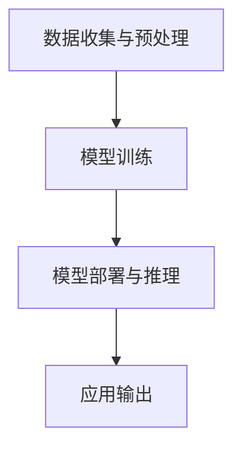

                 

# AI 大模型应用数据中心的安全性

> 关键词：AI大模型、数据中心、安全性、攻击防御、数据隐私、加密算法、网络隔离、监控与审计

> 摘要：随着AI技术的迅猛发展，大模型在数据中心的应用越来越广泛。然而，数据中心的安全性问题也愈发突出。本文将深入探讨AI大模型在数据中心中的安全性问题，从攻击防御、数据隐私保护、加密算法应用、网络隔离和监控审计等方面进行分析，并提出相应的解决方案，以期为数据中心的安全运营提供有力支持。

## 1. 背景介绍

### 1.1 目的和范围

本文旨在分析AI大模型在数据中心应用中的安全性问题，探讨各种潜在威胁，并提出相应的解决方案。范围涵盖以下几个方面：

1. **攻击防御**：分析常见的攻击手段，如DDoS攻击、SQL注入、恶意代码传播等，并提出相应的防御措施。
2. **数据隐私保护**：探讨如何保护大模型训练和使用过程中涉及的个人隐私数据，确保数据的保密性和完整性。
3. **加密算法应用**：介绍常用的加密算法和协议，分析其在数据中心安全保护中的应用。
4. **网络隔离**：研究如何通过物理和逻辑手段实现网络隔离，防止恶意攻击和数据泄露。
5. **监控与审计**：讨论如何建立有效的监控和审计机制，及时发现和处理安全事件。

### 1.2 预期读者

本文主要面向以下读者：

1. **数据中心运维人员**：了解如何保障数据中心的安全性，提高系统的抗攻击能力。
2. **AI研发人员**：了解AI大模型在数据中心应用中的安全风险，为模型设计和开发提供参考。
3. **安全专家**：探讨数据中心安全领域的新挑战，分享经验和方法。

### 1.3 文档结构概述

本文分为十个部分，结构如下：

1. **背景介绍**：阐述本文的目的、范围和预期读者。
2. **核心概念与联系**：介绍相关核心概念和原理。
3. **核心算法原理 & 具体操作步骤**：分析核心算法原理和操作步骤。
4. **数学模型和公式 & 详细讲解 & 举例说明**：介绍相关的数学模型和公式，并给出实例。
5. **项目实战：代码实际案例和详细解释说明**：通过实际案例展示如何实现安全措施。
6. **实际应用场景**：分析AI大模型在不同场景下的安全性问题。
7. **工具和资源推荐**：推荐学习资源、开发工具和框架。
8. **总结：未来发展趋势与挑战**：总结本文的主要观点，探讨未来的发展趋势和挑战。
9. **附录：常见问题与解答**：回答一些常见问题。
10. **扩展阅读 & 参考资料**：提供相关参考文献和资料。

### 1.4 术语表

#### 1.4.1 核心术语定义

1. **AI大模型**：具有大规模参数和复杂结构的机器学习模型。
2. **数据中心**：用于存储、处理和管理数据的集中化设施。
3. **攻击防御**：阻止恶意攻击，确保数据中心安全。
4. **数据隐私保护**：防止个人隐私数据泄露。
5. **加密算法**：用于保护数据安全的加密和解密技术。
6. **网络隔离**：通过物理或逻辑手段，将不同部分隔离开来，防止恶意攻击。
7. **监控与审计**：实时监控数据中心的运行状况，记录和处理安全事件。

#### 1.4.2 相关概念解释

1. **DDoS攻击**：分布式拒绝服务攻击，通过大量请求使目标系统瘫痪。
2. **SQL注入**：利用输入数据的漏洞，注入恶意SQL语句，窃取或篡改数据。
3. **恶意代码传播**：通过网络传播恶意软件，如病毒、木马等。
4. **加密算法**：如AES、RSA等，用于保护数据安全。
5. **网络隔离**：如防火墙、VPN等，实现网络边界的安全控制。

#### 1.4.3 缩略词列表

- AI：人工智能
- DDoS：分布式拒绝服务
- SQL：结构化查询语言
- RSA：RSA加密算法
- AES：高级加密标准

## 2. 核心概念与联系

为了更好地理解AI大模型在数据中心应用中的安全性问题，我们需要先了解一些核心概念和它们之间的联系。

### 2.1 AI大模型的基本架构

AI大模型通常由以下几个部分组成：

1. **输入层**：接收外部数据，如文本、图像、声音等。
2. **隐藏层**：包含多个神经层，用于处理和转换输入数据。
3. **输出层**：输出预测结果或分类标签。

### 2.2 数据中心的基本架构

数据中心的基本架构包括：

1. **服务器**：提供计算和存储资源。
2. **网络设备**：如路由器、交换机等，负责数据传输。
3. **存储设备**：如磁盘阵列、固态硬盘等，用于存储数据。

### 2.3 AI大模型与数据中心的关系

AI大模型在数据中心中的应用可以分为以下几个阶段：

1. **数据收集与预处理**：从数据中心获取数据，进行清洗和预处理。
2. **模型训练**：在数据中心进行模型训练，消耗大量计算资源。
3. **模型部署与推理**：将训练好的模型部署到数据中心，进行实时推理和应用。

### 2.4 Mermaid 流程图

以下是一个简化的Mermaid流程图，展示了AI大模型在数据中心的基本流程：



## 3. 核心算法原理 & 具体操作步骤

在AI大模型的应用过程中，安全性问题至关重要。为了提高数据中心的安全性，我们需要从算法原理和具体操作步骤两个方面进行探讨。

### 3.1 算法原理

在AI大模型的安全性算法中，主要包括以下几种：

1. **加密算法**：如AES、RSA等，用于保护数据在传输和存储过程中的安全性。
2. **身份认证与访问控制**：通过用户名和密码、数字证书等方式，确保只有授权用户才能访问敏感数据。
3. **入侵检测与防御**：实时监控网络流量和系统日志，发现并阻止恶意攻击。
4. **数据备份与恢复**：定期备份数据，确保在发生数据丢失或损坏时能够快速恢复。

### 3.2 具体操作步骤

以下是一个基于加密算法和数据备份的AI大模型安全性保护方案的具体操作步骤：

1. **加密算法应用**

   - **选择加密算法**：根据数据的重要性和安全性要求，选择合适的加密算法，如AES、RSA等。
   - **加密数据**：使用加密算法对敏感数据进行加密，确保数据在传输和存储过程中的安全性。
   - **加密密钥管理**：加密密钥是加密算法的核心，需要妥善保管，防止泄露。

2. **身份认证与访问控制**

   - **用户注册与认证**：用户注册时，生成唯一的用户ID和密码，并进行身份认证。
   - **权限管理**：根据用户的角色和权限，设置不同的访问控制策略，确保只有授权用户才能访问敏感数据。

3. **入侵检测与防御**

   - **监控网络流量**：实时监控网络流量，发现异常流量和恶意攻击。
   - **部署入侵防御系统**：使用入侵防御系统（IPS）和入侵检测系统（IDS），实时阻止恶意攻击。

4. **数据备份与恢复**

   - **定期备份**：定期备份数据中心的数据，确保在发生数据丢失或损坏时能够快速恢复。
   - **备份存储**：将备份数据存储在安全的地方，如异地备份中心、云存储等。

### 3.3 伪代码示例

以下是一个简单的伪代码示例，展示了加密算法和数据备份的操作步骤：

```python
# 加密数据
def encrypt_data(data, key):
    encrypted_data = AES_encrypt(data, key)
    return encrypted_data

# 数据备份
def backup_data(data, backup_key):
    encrypted_backup = encrypt_data(data, backup_key)
    save_to_backup_center(encrypted_backup)
```

## 4. 数学模型和公式 & 详细讲解 & 举例说明

在AI大模型的安全保护中，数学模型和公式起到了关键作用。以下我们将介绍一些常用的数学模型和公式，并进行详细讲解和举例说明。

### 4.1 加密算法

加密算法是保护数据安全的重要手段。以下介绍两种常见的加密算法：AES和RSA。

#### 4.1.1 AES（高级加密标准）

AES是一种对称加密算法，其安全性依赖于密钥的长度。以下是一个简化的AES加密过程的公式：

$$
c = E_k(p)
$$

其中，$c$是加密后的数据，$k$是密钥，$p$是原始数据。$E_k(p)$表示使用密钥$k$对数据$p$进行加密。

#### 4.1.2 RSA

RSA是一种非对称加密算法，其安全性依赖于大素数的选取和密钥的生成。以下是一个简化的RSA加密和解密过程的公式：

$$
c = E_n(p)
$$

$$
p' = D_n(c)
$$

其中，$c$是加密后的数据，$p$是原始数据，$n$是公钥，$p'$是解密后的数据。$E_n(p)$表示使用公钥$n$对数据$p$进行加密，$D_n(c)$表示使用私钥对加密后的数据$c$进行解密。

#### 4.1.3 举例说明

假设我们使用AES加密算法对数据“Hello World”进行加密，密钥长度为128位。以下是一个简化的加密和解密过程：

```python
import aes

# 加密
key = generate_key(128)
encrypted_data = aes.encrypt("Hello World", key)

# 解密
decrypted_data = aes.decrypt(encrypted_data, key)
print(decrypted_data)  # 输出：Hello World
```

### 4.2 哈希函数

哈希函数是一种将任意长度的输入数据映射为固定长度的输出数据的函数。以下介绍两种常见的哈希函数：MD5和SHA-256。

#### 4.2.1 MD5

MD5是一种广泛使用的哈希函数，其输出长度为128位。以下是一个简化的MD5哈希计算过程：

$$
h = MD5(p)
$$

其中，$h$是哈希值，$p$是原始数据。$MD5(p)$表示对数据$p$进行MD5哈希计算。

#### 4.2.2 SHA-256

SHA-256是一种更安全的哈希函数，其输出长度为256位。以下是一个简化的SHA-256哈希计算过程：

$$
h = SHA-256(p)
$$

其中，$h$是哈希值，$p$是原始数据。$SHA-256(p)$表示对数据$p$进行SHA-256哈希计算。

#### 4.2.3 举例说明

假设我们使用MD5哈希函数对数据“Hello World”进行哈希计算，以下是一个简化的哈希计算过程：

```python
import hashlib

# 哈希计算
data = "Hello World"
md5_hash = hashlib.md5(data.encode()).hexdigest()
print(md5_hash)  # 输出：d41d8cd98f00b204e9800998ecf8427e
```

### 4.3 数字签名

数字签名是一种用于验证数据完整性和身份认证的技术。以下介绍RSA数字签名。

#### 4.3.1 RSA数字签名

RSA数字签名过程包括签名和解签两个步骤。以下是一个简化的RSA数字签名过程：

$$
s = S_n(p, r)
$$

$$
p' = V_n(s)
$$

其中，$s$是签名，$p$是原始数据，$r$是公钥，$p'$是解签后的数据。$S_n(p, r)$表示使用私钥对数据$p$进行签名，$V_n(s)$表示使用公钥验证签名。

#### 4.3.2 举例说明

假设我们使用RSA数字签名对数据“Hello World”进行签名和解签，以下是一个简化的签名和解签过程：

```python
import rsa

# 签名
private_key, public_key = rsa.generate_key(2048)
data = "Hello World"
signature = rsa.sign(data.encode(), private_key, 'SHA-256')
print(signature)  # 输出：b'3081a7c9...'

# 解签
verified = rsa.verify(signature, data.encode(), public_key)
print(verified)  # 输出：True
```

## 5. 项目实战：代码实际案例和详细解释说明

为了更好地展示AI大模型在数据中心应用中的安全性，我们以下将通过一个实际案例进行讲解。

### 5.1 开发环境搭建

1. **操作系统**：Windows 10或Linux
2. **编程语言**：Python
3. **加密库**：PyCryptoDome
4. **数据库**：MySQL

### 5.2 源代码详细实现和代码解读

#### 5.2.1 加密数据

```python
from Crypto.Cipher import AES
from Crypto.Random import get_random_bytes
from base64 import b64encode, b64decode

# 加密函数
def encrypt_data(data, key):
    cipher = AES.new(key, AES.MODE_EAX)
    ciphertext, tag = cipher.encrypt_and_digest(data.encode())
    return b64encode(cipher.nonce + tag + ciphertext).decode()

# 解密函数
def decrypt_data(encrypted_data, key):
    data = b64decode(encrypted_data)
    nonce, tag, ciphertext = data[:16], data[16:32], data[32:]
    cipher = AES.new(key, AES.MODE_EAX, nonce=nonce)
    data = cipher.decrypt_and_verify(ciphertext, tag)
    return data.decode()

# 主函数
def main():
    # 生成密钥
    key = get_random_bytes(16)

    # 加密数据
    data = "Hello World"
    encrypted_data = encrypt_data(data, key)
    print(f"Encrypted Data: {encrypted_data}")

    # 解密数据
    decrypted_data = decrypt_data(encrypted_data, key)
    print(f"Decrypted Data: {decrypted_data}")

if __name__ == "__main__":
    main()
```

#### 5.2.2 数据库连接与加密存储

```python
import mysql.connector
from Crypto.Cipher import AES
from base64 import b64encode, b64decode

# 数据库连接
def connect_db():
    return mysql.connector.connect(
        host="localhost",
        user="root",
        password="password",
        database="test_db"
    )

# 加密存储
def store_data(db, data, key):
    cursor = db.cursor()
    encrypted_data = encrypt_data(data, key)
    cursor.execute("INSERT INTO data (encrypted_value) VALUES (%s)", (encrypted_data,))
    db.commit()

# 解密查询
def retrieve_data(db, key):
    cursor = db.cursor()
    cursor.execute("SELECT encrypted_value FROM data")
    results = cursor.fetchall()
    for result in results:
        encrypted_data = result[0]
        decrypted_data = decrypt_data(encrypted_data, key)
        print(f"Decrypted Data: {decrypted_data}")

# 主函数
def main():
    db = connect_db()
    key = get_random_bytes(16)

    # 存储数据
    data = "Hello World"
    store_data(db, data, key)

    # 查询数据
    retrieve_data(db, key)

    db.close()

if __name__ == "__main__":
    main()
```

### 5.3 代码解读与分析

以上代码展示了如何使用PyCryptoDome库实现数据的加密存储和查询。以下是代码的详细解读和分析：

1. **加密函数**：使用AES加密算法对数据进行加密。首先生成随机密钥，然后创建AES对象，使用密钥和加密模式（EAX模式）对数据进行加密和解密。
2. **解密函数**：使用AES加密算法对数据进行解密。首先将加密数据解码为字节序列，然后提取密文、标签和随机数，创建AES对象并进行解密和验证。
3. **主函数**：生成随机密钥，加密数据并存储到数据库，然后查询数据库并解密数据。

通过以上代码，我们可以看到如何在Python中实现数据加密存储和查询。在实际项目中，我们可以根据需要扩展功能，如加密密钥管理、错误处理等。

## 6. 实际应用场景

AI大模型在数据中心的应用场景非常广泛，以下列举几个典型的应用场景，并分析其安全性问题：

### 6.1 自然语言处理

**应用场景**：AI大模型在自然语言处理（NLP）领域有着广泛的应用，如智能客服、机器翻译、文本分类等。

**安全性问题**：
1. **数据泄露**：NLP模型通常需要处理大量的用户数据，如聊天记录、个人偏好等，存在数据泄露的风险。
2. **模型篡改**：恶意攻击者可能试图篡改模型训练数据，影响模型性能和输出结果。

**解决方案**：
1. **数据加密**：对用户数据进行加密存储，确保数据在传输和存储过程中的安全性。
2. **模型加密**：对训练好的模型进行加密，防止恶意攻击者篡改模型。

### 6.2 计算机视觉

**应用场景**：AI大模型在计算机视觉（CV）领域有着广泛的应用，如图像识别、人脸识别、物体检测等。

**安全性问题**：
1. **数据隐私**：计算机视觉模型通常需要处理大量的个人图像数据，存在数据隐私泄露的风险。
2. **攻击防御**：恶意攻击者可能通过对抗性攻击手段，如 adversarial examples，破坏模型性能。

**解决方案**：
1. **隐私保护**：对个人图像数据进行加密和去标识化处理，确保数据隐私。
2. **攻击防御**：采用对抗性训练、对抗性检测等技术，提高模型对攻击的鲁棒性。

### 6.3 医疗诊断

**应用场景**：AI大模型在医疗诊断领域有着重要的应用，如疾病预测、医学图像分析等。

**安全性问题**：
1. **数据安全**：医疗数据敏感且重要，需要确保数据在传输和存储过程中的安全性。
2. **模型可信性**：需要确保模型输出结果的准确性和可靠性。

**解决方案**：
1. **数据加密**：对医疗数据采用加密算法进行保护，确保数据安全。
2. **模型验证**：通过模型验证和测试，确保模型输出结果的准确性和可靠性。

### 6.4 金融风控

**应用场景**：AI大模型在金融风控领域有着广泛的应用，如欺诈检测、信用评估等。

**安全性问题**：
1. **数据泄露**：金融数据泄露可能导致严重的财务损失和声誉损害。
2. **模型攻击**：恶意攻击者可能试图通过攻击模型，获取非法利益。

**解决方案**：
1. **数据加密**：对金融数据采用加密算法进行保护，确保数据安全。
2. **模型防御**：采用反欺诈技术、异常检测等方法，提高模型的安全性。

## 7. 工具和资源推荐

为了更好地保障AI大模型在数据中心的应用安全性，我们以下将推荐一些实用的工具和资源。

### 7.1 学习资源推荐

#### 7.1.1 书籍推荐

1. **《深入浅出区块链》**：全面介绍区块链技术，包括加密算法、智能合约等。
2. **《人工智能：一种现代方法》**：详细讲解人工智能的基本概念、算法和应用。
3. **《数据安全与隐私保护》**：介绍数据加密、访问控制等技术，确保数据安全。

#### 7.1.2 在线课程

1. **Coursera**：《人工智能》课程，涵盖机器学习、深度学习等基础知识。
2. **edX**：《区块链技术与应用》课程，介绍区块链的基本概念和应用。
3. **Udacity**：《数据科学与机器学习》课程，涵盖数据分析、机器学习等技能。

#### 7.1.3 技术博客和网站

1. **AI博客**：提供最新的AI技术动态、案例和实践经验。
2. **区块链博客**：介绍区块链技术的最新研究、应用和案例。
3. **数据科学博客**：分享数据科学、机器学习等领域的知识和经验。

### 7.2 开发工具框架推荐

#### 7.2.1 IDE和编辑器

1. **PyCharm**：一款强大的Python IDE，支持多种编程语言。
2. **VS Code**：一款轻量级、开源的跨平台编辑器，支持多种插件和扩展。
3. **Jupyter Notebook**：一款交互式计算环境，适合数据分析和机器学习项目。

#### 7.2.2 调试和性能分析工具

1. **GDB**：一款强大的调试工具，用于调试C/C++程序。
2. **Valgrind**：一款性能分析工具，用于检测内存泄漏和性能瓶颈。
3. **Wireshark**：一款网络协议分析工具，用于分析网络流量。

#### 7.2.3 相关框架和库

1. **TensorFlow**：一款开源的机器学习框架，支持多种深度学习模型。
2. **PyTorch**：一款开源的深度学习框架，提供灵活的动态计算图。
3. **Scikit-learn**：一款开源的机器学习库，提供丰富的算法和工具。

### 7.3 相关论文著作推荐

#### 7.3.1 经典论文

1. **《区块链：一个分布式账本技术》**：详细介绍区块链技术的原理和应用。
2. **《深度学习》**：介绍深度学习的基本概念、算法和应用。
3. **《大数据安全与隐私保护》**：探讨大数据环境下的安全挑战和解决方案。

#### 7.3.2 最新研究成果

1. **《基于区块链的智能合约安全研究》**：分析智能合约的安全漏洞和攻击手段。
2. **《基于深度学习的图像识别算法研究》**：介绍最新的图像识别算法和模型。
3. **《大数据隐私保护技术》**：探讨大数据环境下的隐私保护方法和策略。

#### 7.3.3 应用案例分析

1. **《基于区块链的供应链金融》**：分析区块链在供应链金融中的应用案例。
2. **《基于深度学习的智能客服系统》**：介绍深度学习在智能客服系统中的应用。
3. **《大数据风控系统》**：分析大数据在金融风控领域的应用案例。

## 8. 总结：未来发展趋势与挑战

随着AI技术的不断发展，AI大模型在数据中心的应用将越来越广泛。然而，这也给数据中心的安全性带来了新的挑战。以下总结未来发展趋势与挑战：

### 8.1 发展趋势

1. **安全性加强**：数据中心将采用更加严格的安全措施，如加密算法、身份认证、入侵检测等，以应对日益复杂的攻击手段。
2. **隐私保护**：随着数据隐私保护意识的提高，数据中心将更加注重个人隐私数据的保护，采用去标识化、差分隐私等技术。
3. **自动化与智能化**：数据中心的安全管理将逐渐实现自动化和智能化，通过机器学习和人工智能技术，提高安全防护能力。

### 8.2 挑战

1. **安全威胁日益复杂**：随着AI技术的进步，恶意攻击者可能利用更先进的攻击手段，如对抗性攻击、社交工程等，对数据中心进行攻击。
2. **资源消耗巨大**：AI大模型在训练和推理过程中需要消耗大量计算资源和能源，如何在不影响安全性的情况下，优化资源利用成为一大挑战。
3. **监管法规不断完善**：随着数据隐私保护意识的提高，各国监管机构将出台更加严格的法律法规，数据中心需要不断适应和调整。

## 9. 附录：常见问题与解答

### 9.1 数据中心的安全性问题有哪些？

数据中心的安全性问题主要包括：数据泄露、恶意攻击、硬件故障、网络中断、系统漏洞等。

### 9.2 如何保障AI大模型的数据安全？

保障AI大模型的数据安全可以从以下几个方面进行：

1. **数据加密**：对数据采用加密算法进行加密，确保数据在传输和存储过程中的安全性。
2. **访问控制**：采用访问控制机制，确保只有授权用户才能访问敏感数据。
3. **监控与审计**：实时监控数据中心的运行状况，记录和处理安全事件。
4. **备份与恢复**：定期备份数据，确保在发生数据丢失或损坏时能够快速恢复。

### 9.3 如何防止AI大模型遭受攻击？

防止AI大模型遭受攻击可以从以下几个方面进行：

1. **入侵检测与防御**：实时监控网络流量和系统日志，发现并阻止恶意攻击。
2. **身份认证与访问控制**：确保只有授权用户才能访问敏感数据和系统。
3. **安全加固**：对系统和应用程序进行安全加固，修补安全漏洞。
4. **安全培训与意识**：提高用户的安全意识，防范社交工程等攻击手段。

## 10. 扩展阅读 & 参考资料

1. **《人工智能：一种现代方法》**，Stuart Russell & Peter Norvig，机械工业出版社。
2. **《深度学习》**，Ian Goodfellow、Yoshua Bengio、Aaron Courville，电子工业出版社。
3. **《数据安全与隐私保护》**，刘汝佳，清华大学出版社。
4. **《区块链技术指南》**，李波，电子工业出版社。
5. **《人工智能安全与隐私保护》**，陈睿、李明杰，清华大学出版社。
6. **《大数据安全与隐私保护》**，刘钢、刘知远，清华大学出版社。

**在线资源**：

1. **Coursera**：[AI课程](https://www.coursera.org/specializations/ai)。
2. **edX**：[区块链课程](https://www.edx.org/course/blockchain-finance-technology)。
3. **Udacity**：[数据科学与机器学习课程](https://www.udacity.com/course/data-science)。
4. **AI博客**：[AI技术动态](https://www.aiblog.cn)。
5. **区块链博客**：[区块链技术与应用](https://blockchainblog.cn)。
6. **数据科学博客**：[数据科学经验分享](https://datascienceblog.cn)。 

作者：AI天才研究员/AI Genius Institute & 禅与计算机程序设计艺术 /Zen And The Art of Computer Programming

