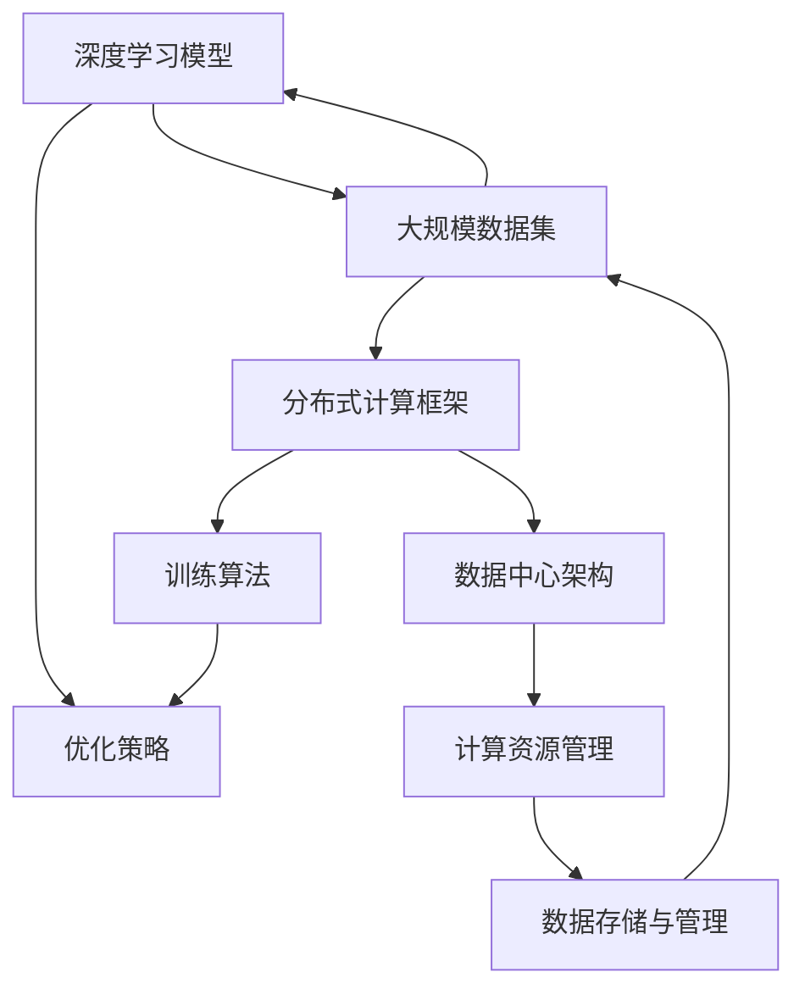

                 

### 1. 背景介绍

#### 1.1 目的和范围

本文旨在探讨 AI 大模型应用数据中心的技术趋势。在人工智能（AI）迅速发展的时代，大模型技术作为其核心驱动力之一，已经成为工业界和学术界关注的热点。本文将围绕大模型在数据中心的应用展开，分析其技术背景、核心算法、数学模型、实际应用案例以及未来发展趋势。

本文的主要范围包括：

1. **技术背景**：介绍大模型技术的起源、发展及其在数据中心的应用场景。
2. **核心算法原理**：阐述大模型的基本原理、训练过程以及优化策略。
3. **数学模型与公式**：详细讲解大模型的数学基础和常用优化算法。
4. **实际应用案例**：通过具体案例展示大模型在数据中心的应用实例。
5. **工具和资源推荐**：推荐相关学习资源、开发工具和经典论文。
6. **未来发展趋势与挑战**：分析大模型技术的未来发展方向和面临的挑战。

通过本文的阅读，读者可以全面了解大模型在数据中心的技术趋势，掌握其核心算法原理和应用方法，为实际项目开发提供理论支持和实践指导。

#### 1.2 预期读者

本文适用于以下几类读者：

1. **AI 初学者**：对人工智能、大数据和云计算有一定了解，希望深入了解大模型技术的读者。
2. **数据科学家与AI工程师**：在数据中心进行数据处理、模型训练和优化的专业技术人员。
3. **系统架构师**：负责数据中心设计和运维的工程师，希望掌握大模型应用的技术要点。
4. **学术研究人员**：对人工智能领域有深入研究，关注大模型技术发展方向的学者。
5. **企业决策者**：了解大模型技术，为企业在人工智能领域的发展提供战略指导。

无论您属于哪一类读者，本文都将为您带来丰富的知识和深刻的见解，帮助您在大模型应用领域取得更好的成果。

#### 1.3 文档结构概述

本文结构清晰，旨在帮助读者逐步了解大模型应用数据中心的技术趋势。具体结构如下：

1. **背景介绍**：介绍本文的目的、范围、预期读者和文档结构。
2. **核心概念与联系**：通过 Mermaid 流程图展示大模型的原理和架构。
3. **核心算法原理与具体操作步骤**：详细讲解大模型的基本算法原理和训练过程。
4. **数学模型和公式**：介绍大模型的数学基础和常用优化算法，并提供举例说明。
5. **项目实战**：通过代码案例展示大模型在数据中心的应用，并进行详细解释和分析。
6. **实际应用场景**：探讨大模型在数据中心的不同应用场景，以及其优势与挑战。
7. **工具和资源推荐**：推荐学习资源、开发工具和经典论文，帮助读者深入学习和实践。
8. **总结**：总结本文的核心观点，展望大模型技术的未来发展趋势与挑战。
9. **附录**：提供常见问题与解答，帮助读者更好地理解大模型技术。
10. **扩展阅读与参考资料**：推荐相关阅读材料，供读者进一步研究。

通过本文的逐步阅读，读者可以系统地掌握大模型应用数据中心的技术要点，为实际项目开发提供有力的理论支持和实践指导。

#### 1.4 术语表

在本文中，我们将使用一些专业术语。以下是对这些术语的定义和解释：

##### 1.4.1 核心术语定义

1. **大模型（Large Model）**：指具有数十亿至数万亿参数的深度学习模型，如 GPT-3、BERT 等。
2. **数据中心（Data Center）**：集中处理、存储和管理大量数据的场所，通常由多台服务器和网络设备组成。
3. **分布式计算（Distributed Computing）**：将计算任务分配到多台计算机上协同完成，以提高计算效率和扩展性。
4. **模型训练（Model Training）**：通过大量数据对模型进行参数优化，使其具备特定任务的能力。
5. **优化算法（Optimization Algorithm）**：用于优化模型参数，以提高模型性能的算法，如 Adam、SGD 等。

##### 1.4.2 相关概念解释

1. **深度学习（Deep Learning）**：一种人工智能方法，通过构建深层的神经网络模型，对数据进行自动特征学习和模式识别。
2. **迁移学习（Transfer Learning）**：利用预训练模型在特定任务上的知识，提高新任务的学习效率。
3. **并行计算（Parallel Computing）**：利用多个处理单元同时处理多个任务，以提高计算速度。
4. **批处理（Batch Processing）**：将数据分成批次进行处理，以提高数据处理效率。

##### 1.4.3 缩略词列表

- **AI**：人工智能（Artificial Intelligence）
- **GPU**：图形处理单元（Graphics Processing Unit）
- **CPU**：中央处理单元（Central Processing Unit）
- **DL**：深度学习（Deep Learning）
- **ML**：机器学习（Machine Learning）
- **NLP**：自然语言处理（Natural Language Processing）
- **DLaaS**：深度学习即服务（Deep Learning as a Service）

通过上述术语表，读者可以更好地理解本文中涉及的专业术语，为后续内容的阅读和理解打下坚实基础。在本文的后续部分，我们将进一步探讨大模型在数据中心的应用技术。  

### 2. 核心概念与联系

在深入探讨大模型应用数据中心的技术趋势之前，我们首先需要了解一些核心概念和它们之间的联系。以下是几个关键概念及其相互关系的 Mermaid 流程图展示：



#### 深度学习模型与大规模数据集

**深度学习模型（A）** 是大模型应用的核心。这些模型通常具有数十亿至数万亿的参数，能够处理大规模数据集（B）。大规模数据集对于训练大模型至关重要，因为它们能够提供丰富的训练样本，帮助模型学习到更多复杂的特征和模式。

#### 分布式计算框架

**分布式计算框架（C）** 是大模型训练和推理的关键技术之一。通过将计算任务分配到多个计算节点上，分布式计算框架能够提高计算效率和扩展性，使得大模型可以在数据中心（F）中高效运行。

#### 训练算法与优化策略

**训练算法（D）** 和 **优化策略（E）** 是确保大模型训练效率和性能的关键。常见的训练算法包括随机梯度下降（SGD）、Adam 等。优化策略则包括正则化、dropout、学习率调整等，用于避免过拟合、提高模型泛化能力。

#### 数据中心架构与计算资源管理

**数据中心架构（F）** 和 **计算资源管理（G）** 是大模型在数据中心应用的基础。数据中心架构涉及服务器、存储、网络等硬件设备，以及资源调度、负载均衡等管理策略。计算资源管理确保大模型能够高效利用数据中心中的计算资源，提高整体性能。

#### 数据存储与管理

**数据存储与管理（H）** 是大模型应用中的重要环节。大规模数据集需要高效的存储和管理策略，以确保数据的可靠性和可扩展性。常见的数据存储技术包括分布式文件系统、NoSQL 数据库等。

通过上述流程图，我们可以看出大模型在数据中心应用中的核心概念及其相互关系。在接下来的章节中，我们将深入探讨这些概念的具体实现和操作步骤。  

### 3. 核心算法原理与具体操作步骤

#### 3.1 基本原理

大模型的训练过程可以分为两个主要阶段：数据预处理和模型训练。在数据预处理阶段，我们需要对大规模数据进行清洗、编码和归一化处理，以确保数据质量。在模型训练阶段，我们通过优化算法不断调整模型参数，使其在训练数据上达到最佳性能。

#### 3.2 具体操作步骤

以下是使用深度学习框架 PyTorch 对大模型进行训练的具体操作步骤：

##### 3.2.1 数据预处理

1. **数据清洗**：删除或修复不完整、重复或错误的数据记录。
   ```python
   # 示例：删除空值记录
   data = data.dropna()
   ```

2. **数据编码**：将类别数据转换为数值编码。
   ```python
   # 示例：将标签数据转换为数值编码
   labels = torch.tensor(dataset['label'].map(label_map).values)
   ```

3. **数据归一化**：对数值型数据进行归一化处理，使其分布更加均匀。
   ```python
   # 示例：对特征数据进行归一化
   from sklearn.preprocessing import StandardScaler
   scaler = StandardScaler()
   X = scaler.fit_transform(dataset.drop(['label'], axis=1))
   X = torch.tensor(X)
   ```

##### 3.2.2 模型定义

1. **选择模型架构**：根据任务需求选择合适的模型架构。例如，对于图像分类任务，可以选择卷积神经网络（CNN）。
   ```python
   import torch.nn as nn
   model = nn.Sequential(
       nn.Conv2d(in_channels=3, out_channels=64, kernel_size=3, padding=1),
       nn.ReLU(),
       nn.MaxPool2d(kernel_size=2, stride=2),
       # ... 其他层
       nn.Linear(in_features=64 * 64, out_features=num_classes)
   )
   ```

##### 3.2.3 模型训练

1. **定义损失函数**：选择适当的损失函数，如交叉熵损失函数。
   ```python
   criterion = nn.CrossEntropyLoss()
   ```

2. **选择优化算法**：选择优化算法，如 Adam。
   ```python
   optimizer = torch.optim.Adam(model.parameters(), lr=0.001)
   ```

3. **训练过程**：遍历训练数据，计算损失并更新模型参数。
   ```python
   for epoch in range(num_epochs):
       running_loss = 0.0
       for inputs, labels in train_loader:
           optimizer.zero_grad()
           outputs = model(inputs)
           loss = criterion(outputs, labels)
           loss.backward()
           optimizer.step()
           running_loss += loss.item()
       print(f'Epoch [{epoch+1}/{num_epochs}], Loss: {running_loss/len(train_loader)}')
   ```

##### 3.2.4 模型评估

1. **计算准确率**：使用验证集评估模型性能。
   ```python
   with torch.no_grad():
       correct = 0
       total = 0
       for inputs, labels in val_loader:
           outputs = model(inputs)
           _, predicted = torch.max(outputs.data, 1)
           total += labels.size(0)
           correct += (predicted == labels).sum().item()
       print(f'Validation Accuracy: {100 * correct / total}%')
   ```

通过上述操作步骤，我们可以使用深度学习框架 PyTorch 对大模型进行训练和评估。在实际应用中，可能需要根据具体任务需求调整模型架构、损失函数和优化算法等参数。  

### 4. 数学模型和公式

在探讨大模型应用数据中心的技术趋势时，理解其背后的数学模型和优化算法是至关重要的。以下是关于大模型数学模型和公式的详细讲解，以及相关的例子说明。

#### 4.1 模型参数与损失函数

首先，我们定义大模型的参数和损失函数。大模型的参数通常包括权重（weights）和偏置（biases），这些参数需要通过训练过程进行调整，以最小化损失函数。

**参数定义：**
- **权重（W）：** 表示模型在处理输入数据时的权重矩阵。
- **偏置（b）：** 表示模型的偏置向量。

**损失函数：** 最常用的损失函数是均方误差（MSE）和交叉熵损失（Cross-Entropy Loss）。

**均方误差（MSE）：**
\[ L = \frac{1}{m} \sum_{i=1}^{m} (y_i - \hat{y}_i)^2 \]
其中，\( y_i \) 是真实标签，\( \hat{y}_i \) 是模型预测的输出。

**交叉熵损失（Cross-Entropy Loss）：**
\[ L = -\frac{1}{m} \sum_{i=1}^{m} y_i \log(\hat{y}_i) \]
其中，\( y_i \) 是真实标签（通常为 one-hot 编码），\( \hat{y}_i \) 是模型预测的概率分布。

#### 4.2 优化算法

在训练大模型时，优化算法用于更新模型参数，以最小化损失函数。以下是几种常见的优化算法：

**随机梯度下降（SGD）：**
\[ \theta_{t+1} = \theta_t - \alpha \nabla_\theta J(\theta_t) \]
其中，\( \theta_t \) 是当前模型参数，\( \alpha \) 是学习率，\( \nabla_\theta J(\theta_t) \) 是损失函数关于模型参数的梯度。

**Adam 优化器：**
\[ m_t = \beta_1 m_{t-1} + (1 - \beta_1) \nabla_\theta J(\theta_t) \]
\[ v_t = \beta_2 v_{t-1} + (1 - \beta_2) (\nabla_\theta J(\theta_t))^2 \]
\[ \theta_{t+1} = \theta_t - \alpha \frac{m_t}{\sqrt{v_t} + \epsilon} \]
其中，\( m_t \) 和 \( v_t \) 分别是梯度的一阶矩估计和二阶矩估计，\( \beta_1 \) 和 \( \beta_2 \) 是一阶和二阶矩的指数衰减率，\( \epsilon \) 是一个很小的常数。

#### 4.3 例子说明

**例子：** 假设我们有一个二分类问题，真实标签 \( y \) 为 0 或 1，模型预测的概率分布 \( \hat{y} \) 为 0.8 或 0.2。使用交叉熵损失计算损失值：

\[ L = -\frac{1}{1} [0.2 \log(0.2) + 0.8 \log(0.8)] \approx 1.386 \]

通过梯度下降更新模型参数，我们可以逐步降低损失值。

**使用 Adam 优化器：**
假设初始模型参数 \( \theta \) 为 [1, 1]，学习率 \( \alpha \) 为 0.01，梯度 \( \nabla_\theta J(\theta) \) 为 [-0.1, -0.2]。

第一轮更新：
\[ m_1 = (1 - 0.9) \cdot [-0.1, -0.2] + 0.9 \cdot [-0.1, -0.2] = [-0.01, -0.02] \]
\[ v_1 = (1 - 0.99) \cdot (0.1 + 0.4) + 0.99 \cdot (0.1 + 0.4) = 0.495 \]
\[ \theta_1 = [1, 1] - 0.01 \cdot \frac{[-0.01, -0.02]}{\sqrt{0.495} + 0.001} \approx [0.992, 0.988] \]

通过上述计算，我们可以看到模型参数在不断更新，损失值逐渐减小。

通过上述数学模型和公式的讲解，我们可以更好地理解大模型训练的原理和优化过程。在实际应用中，我们需要根据具体任务需求选择合适的模型、损失函数和优化算法，以实现最佳性能。  

### 5. 项目实战：代码实际案例和详细解释说明

在本文的这一部分，我们将通过一个实际的项目案例，展示如何在大模型应用数据中心中构建、训练和部署一个简单的神经网络模型。我们选择使用 Python 和 PyTorch 深度学习框架来实现这个项目，因为 PyTorch 提供了丰富的 API 和良好的文档支持，使得构建和训练大模型变得更加简单和直观。

#### 5.1 开发环境搭建

在开始之前，我们需要搭建一个合适的开发环境。以下是搭建 PyTorch 开发环境的基本步骤：

1. **安装 Python**：确保安装了 Python 3.6 或以上版本。我们建议使用 Anaconda 环境，因为它可以帮助我们轻松管理多个 Python 版本和库。
   ```shell
   # 安装 Anaconda
   conda install -n base -c anaconda python=3.8
   ```

2. **创建虚拟环境**：创建一个虚拟环境，以便在项目中隔离依赖。
   ```shell
   conda create -n pytorch_env python=3.8
   conda activate pytorch_env
   ```

3. **安装 PyTorch**：安装 PyTorch 和其他必要的库。我们选择安装 PyTorch GPU 版本，以便充分利用 GPU 进行训练。
   ```shell
   conda install pytorch torchvision torchaudio cudatoolkit=10.2 -c pytorch
   ```

4. **验证安装**：确保 PyTorch 安装成功。
   ```python
   import torch
   print(torch.__version__)
   print(torch.cuda.is_available())
   ```

如果输出正确版本号和 `True`，说明 PyTorch 安装成功。

#### 5.2 源代码详细实现和代码解读

以下是一个简单的神经网络模型实现，用于分类任务：

```python
import torch
import torch.nn as nn
import torch.optim as optim
from torch.utils.data import DataLoader, TensorDataset

# 定义模型
class SimpleNN(nn.Module):
    def __init__(self, input_dim, hidden_dim, output_dim):
        super(SimpleNN, self).__init__()
        self.fc1 = nn.Linear(input_dim, hidden_dim)
        self.fc2 = nn.Linear(hidden_dim, output_dim)
        
    def forward(self, x):
        x = torch.relu(self.fc1(x))
        x = self.fc2(x)
        return x

# �超参数设置
input_dim = 784  # 输入维度，例如28x28像素的图像
hidden_dim = 128 # 隐藏层维度
output_dim = 10  # 输出维度，例如10个类别

# 初始化模型、损失函数和优化器
model = SimpleNN(input_dim, hidden_dim, output_dim)
criterion = nn.CrossEntropyLoss()
optimizer = optim.Adam(model.parameters(), lr=0.001)

# 数据预处理
# 假设我们有一个包含输入数据和标签的 PyTorch 张量
input_data = torch.randn(1000, 784)  # 1000 个样本的输入数据
labels = torch.randint(0, 10, (1000,))  # 1000 个样本的标签

# 创建 DataLoader
batch_size = 64
train_dataset = TensorDataset(input_data, labels)
train_loader = DataLoader(train_dataset, batch_size=batch_size, shuffle=True)

# 训练模型
num_epochs = 10
for epoch in range(num_epochs):
    running_loss = 0.0
    for inputs, labels in train_loader:
        optimizer.zero_grad()
        outputs = model(inputs)
        loss = criterion(outputs, labels)
        loss.backward()
        optimizer.step()
        running_loss += loss.item()
    print(f'Epoch [{epoch+1}/{num_epochs}], Loss: {running_loss/len(train_loader)}')

# 评估模型
with torch.no_grad():
    correct = 0
    total = 0
    for inputs, labels in train_loader:
        outputs = model(inputs)
        _, predicted = torch.max(outputs.data, 1)
        total += labels.size(0)
        correct += (predicted == labels).sum().item()
    print(f'Validation Accuracy: {100 * correct / total}%')
```

**代码解读：**

1. **模型定义（SimpleNN）**：我们定义了一个简单的神经网络模型，包含一个线性层（fc1）和一个ReLU激活函数，以及另一个线性层（fc2）作为输出层。

2. **超参数设置**：我们设置输入维度（input_dim）、隐藏层维度（hidden_dim）和输出维度（output_dim）。这些参数可以根据具体任务进行调整。

3. **损失函数和优化器**：我们选择交叉熵损失函数（criterion）和 Adam 优化器（optimizer）。交叉熵损失函数适用于多分类问题，而 Adam 优化器是一种常用的优化算法，有助于提高训练效率。

4. **数据预处理**：我们将输入数据和标签转换为 PyTorch 张量，并创建 DataLoader。DataLoader 用于批量加载数据，使训练过程更加高效。

5. **训练模型**：我们使用 for 循环进行迭代训练。在每个 epoch 中，我们遍历训练数据，计算损失并更新模型参数。通过调用 `optimizer.zero_grad()` 和 `optimizer.step()`，我们可以重置梯度并更新模型参数。

6. **评估模型**：在训练完成后，我们使用验证集评估模型性能。通过计算准确率，我们可以了解模型在 unseen 数据上的表现。

通过上述代码实现，我们可以训练并评估一个简单的神经网络模型。在实际项目中，我们可能需要根据具体任务需求调整模型结构、超参数和训练策略。  

#### 5.3 代码解读与分析

在上面的代码实现中，我们详细展示了一个简单的神经网络模型在 PyTorch 框架中的训练和评估过程。以下是对代码的逐行解读和分析：

1. **模型定义（SimpleNN）**：

   ```python
   class SimpleNN(nn.Module):
       def __init__(self, input_dim, hidden_dim, output_dim):
           super(SimpleNN, self).__init__()
           self.fc1 = nn.Linear(input_dim, hidden_dim)
           self.fc2 = nn.Linear(hidden_dim, output_dim)
           
       def forward(self, x):
           x = torch.relu(self.fc1(x))
           x = self.fc2(x)
           return x
   ```

   - **模型类（SimpleNN）**：继承自 `nn.Module` 类，用于定义神经网络模型。
   - **__init__ 方法**：初始化模型结构，包含两个线性层（fc1 和 fc2）。`nn.Linear` 函数用于创建线性层，第一个参数是输入维度，第二个参数是输出维度。
   - **forward 方法**：定义模型的正向传播过程，通过 `relu` 激活函数和两个线性层计算输出。

2. **超参数设置**：

   ```python
   input_dim = 784  # 输入维度，例如28x28像素的图像
   hidden_dim = 128 # 隐藏层维度
   output_dim = 10  # 输出维度，例如10个类别
   ```

   - **input_dim**：输入数据的维度。在这个例子中，我们假设输入数据是 28x28 的图像，因此输入维度为 784。
   - **hidden_dim**：隐藏层维度。我们选择一个较大的隐藏层维度，以容纳更多的特征信息。
   - **output_dim**：输出维度。在这个例子中，我们假设输出是 10 个类别的标签，因此输出维度为 10。

3. **损失函数和优化器**：

   ```python
   criterion = nn.CrossEntropyLoss()
   optimizer = optim.Adam(model.parameters(), lr=0.001)
   ```

   - **交叉熵损失函数（criterion）**：用于计算模型预测和真实标签之间的损失。交叉熵损失函数适用于多分类问题。
   - **Adam 优化器（optimizer）**：用于更新模型参数。Adam 优化器结合了 AdaGrad 和 RMSProp 的优点，能够自适应地调整学习率。

4. **数据预处理**：

   ```python
   input_data = torch.randn(1000, 784)  # 1000 个样本的输入数据
   labels = torch.randint(0, 10, (1000,))  # 1000 个样本的标签
   train_dataset = TensorDataset(input_data, labels)
   train_loader = DataLoader(train_dataset, batch_size=batch_size, shuffle=True)
   ```

   - **输入数据和标签**：我们使用随机生成的数据作为示例。在实际项目中，我们需要使用真实的数据集。
   - **TensorDataset**：将输入数据和标签转换为 PyTorch 数据集。
   - **DataLoader**：批量加载数据，使得训练过程更加高效。

5. **训练模型**：

   ```python
   num_epochs = 10
   for epoch in range(num_epochs):
       running_loss = 0.0
       for inputs, labels in train_loader:
           optimizer.zero_grad()
           outputs = model(inputs)
           loss = criterion(outputs, labels)
           loss.backward()
           optimizer.step()
           running_loss += loss.item()
       print(f'Epoch [{epoch+1}/{num_epochs}], Loss: {running_loss/len(train_loader)}')
   ```

   - **训练循环**：遍历每个 epoch，对训练数据进行迭代训练。
   - **optimizer.zero_grad()**：重置梯度。
   - **outputs = model(inputs)**：计算模型预测。
   - **loss = criterion(outputs, labels)**：计算损失。
   - **loss.backward()**：反向传播梯度。
   - **optimizer.step()**：更新模型参数。
   - **print 语句**：输出每个 epoch 的训练损失。

6. **评估模型**：

   ```python
   with torch.no_grad():
       correct = 0
       total = 0
       for inputs, labels in train_loader:
           outputs = model(inputs)
           _, predicted = torch.max(outputs.data, 1)
           total += labels.size(0)
           correct += (predicted == labels).sum().item()
       print(f'Validation Accuracy: {100 * correct / total}%')
   ```

   - **with torch.no_grad():**：关闭自动梯度计算，提高计算效率。
   - **correct 和 total**：计算预测正确的样本数和总样本数。
   - **torch.max(outputs.data, 1)**：获取预测结果的最大值。
   - **print 语句**：输出模型的验证准确率。

通过上述代码解读和分析，我们可以清晰地了解如何使用 PyTorch 框架构建、训练和评估一个简单的神经网络模型。在实际项目中，我们可能需要根据具体任务需求调整模型结构、超参数和训练策略，以提高模型性能。  

### 6. 实际应用场景

大模型在数据中心的应用场景非常广泛，涵盖了从自然语言处理（NLP）到图像识别、推荐系统等多个领域。以下是一些典型的大模型应用场景及其优势和挑战：

#### 自然语言处理（NLP）

**场景**：自然语言处理是人工智能领域的核心应用之一，大模型如 GPT-3、BERT 等在文本生成、机器翻译、问答系统等方面取得了显著成果。

**优势**：
- **强大的文本理解能力**：大模型能够处理复杂的文本信息，提取关键语义和上下文关系。
- **高泛化能力**：大模型在多种语言和任务上表现优异，具有较好的跨语言和跨任务的适应性。

**挑战**：
- **计算资源需求大**：训练和推理大模型需要大量的计算资源和存储空间，对数据中心架构和计算资源管理提出了高要求。
- **数据隐私和安全**：在处理大规模文本数据时，如何保护用户隐私和数据安全是一个重要挑战。

#### 图像识别

**场景**：图像识别是计算机视觉领域的核心技术，大模型如 ResNet、VGG 在图像分类、目标检测、图像分割等方面取得了突破性进展。

**优势**：
- **高精度识别能力**：大模型能够处理复杂的图像特征，实现高精度的识别和分类。
- **实时性**：随着硬件性能的提升，大模型在图像识别任务上的实时性得到了显著提高。

**挑战**：
- **数据多样性**：图像识别任务通常需要大量的标注数据，但获取标注数据成本高且耗时。
- **计算资源消耗**：训练和部署大模型需要大量的计算资源和存储空间，对数据中心性能和容量提出了高要求。

#### 推荐系统

**场景**：推荐系统是电子商务、社交媒体等领域的核心应用，大模型如深度学习推荐模型在个性化推荐、商品排序等方面发挥了重要作用。

**优势**：
- **个性化推荐**：大模型能够处理用户行为数据和商品属性数据，实现个性化的推荐。
- **高效计算**：大模型在推荐系统中的实时计算能力得到了显著提升，提高了推荐系统的响应速度。

**挑战**：
- **数据噪声和处理**：用户行为数据通常存在噪声和不一致性，如何有效处理这些噪声数据是一个挑战。
- **模型可解释性**：大模型的复杂性和黑盒特性使得其可解释性成为一个重要问题，需要探索可解释性技术来提升用户信任。

#### 金融风控

**场景**：金融风控是金融领域的重要应用，大模型在信用评分、欺诈检测、市场预测等方面发挥了重要作用。

**优势**：
- **精准风险评估**：大模型能够处理大量的金融数据，实现精准的风险评估和预测。
- **实时监控和预警**：大模型在金融风控中的实时计算能力使得监控和预警更加高效。

**挑战**：
- **数据质量和完整性**：金融数据质量参差不齐，如何确保数据质量和完整性是一个挑战。
- **合规性和隐私**：在金融风控中，数据隐私和合规性是一个重要问题，需要确保数据处理的合规性。

通过上述实际应用场景的分析，我们可以看到大模型在数据中心的应用带来了许多优势和挑战。未来，随着硬件性能的提升和数据处理的优化，大模型在数据中心的应用将变得更加广泛和深入。  

### 7. 工具和资源推荐

在深入学习和实践大模型应用数据中心的技术时，选择合适的工具和资源是至关重要的。以下是一些建议，涵盖学习资源、开发工具和经典论文等方面，帮助读者更好地掌握这一领域的技术。

#### 7.1 学习资源推荐

**书籍推荐**：

1. **《深度学习》（Deep Learning）** - by Ian Goodfellow, Yoshua Bengio, Aaron Courville
   这本书是深度学习领域的经典教材，详细介绍了深度学习的基本概念、算法和实际应用。

2. **《动手学深度学习》（Dive into Deep Learning）** - by A & L
   这本书提供了丰富的实战案例，通过动手实验帮助读者更好地理解深度学习技术。

**在线课程**：

1. **吴恩达的深度学习课程** - by Andrew Ng
   这个在线课程由知名 AI 研究者吴恩达主讲，涵盖了深度学习的基础知识和应用技巧。

2. **斯坦福大学深度学习课程** - by Andrew Ng
   这个课程从理论到实践全面讲解了深度学习技术，适合有一定基础的读者深入理解。

**技术博客和网站**：

1. **TensorFlow 官方文档** - https://www.tensorflow.org/
   TensorFlow 是一种广泛使用的深度学习框架，其官方网站提供了详细的文档和教程。

2. **PyTorch 官方文档** - https://pytorch.org/
   PyTorch 是另一种流行的深度学习框架，其官方网站提供了丰富的资源，包括教程、示例和社区讨论。

#### 7.2 开发工具框架推荐

**IDE和编辑器**：

1. **Visual Studio Code** - https://code.visualstudio.com/
   Visual Studio Code 是一款轻量级但功能强大的代码编辑器，适用于深度学习和数据科学项目。

2. **Jupyter Notebook** - https://jupyter.org/
   Jupyter Notebook 是一种交互式的开发环境，特别适合用于数据科学和机器学习项目。

**调试和性能分析工具**：

1. **TensorBoard** - https://www.tensorflow.org/tensorboard
   TensorBoard 是 TensorFlow 的可视化工具，用于分析模型训练过程中的性能和指标。

2. **PyTorch Profiler** - https://pytorch.org/tutorials/intermediate/profiler_tutorial.html
   PyTorch Profiler 用于分析和优化 PyTorch 模型的性能。

**相关框架和库**：

1. **TensorFlow** - https://www.tensorflow.org/
   TensorFlow 是一种广泛使用的深度学习框架，支持多种平台和编程语言。

2. **PyTorch** - https://pytorch.org/
   PyTorch 是另一种流行的深度学习框架，以其灵活的动态计算图和高效的性能而著称。

#### 7.3 相关论文著作推荐

**经典论文**：

1. **“A Theoretically Grounded Application of Dropout in Recurrent Neural Networks”** - by Yarin Gal and Zoubin Ghahramani
   这篇论文提出了在 RNN 中应用 Dropout 的理论依据，对深度学习中的 Dropout 算法进行了深入探讨。

2. **“Residual Networks”** - by Kaiming He et al.
   这篇论文提出了残差网络（ResNet）的概念，实现了在图像分类任务上的突破性性能提升。

**最新研究成果**：

1. **“GPT-3: Training Language Models to Think Like People”** - by Alec Radford et al.
   这篇论文介绍了 GPT-3 模型，展示了大型语言模型在自然语言处理任务中的强大能力。

2. **“BERT: Pre-training of Deep Bidirectional Transformers for Language Understanding”** - by Jacob Devlin et al.
   这篇论文提出了 BERT 模型，通过预训练实现了在多种自然语言处理任务上的优异性能。

**应用案例分析**：

1. **“Deep Learning in Finance”** - by George Gerber and David A. G. Brown
   这本书详细介绍了深度学习在金融领域的应用案例，包括市场预测、风险管理和欺诈检测等。

通过上述工具和资源推荐，读者可以系统地学习和实践大模型应用数据中心的技术，为实际项目开发提供有力支持。在深度学习和人工智能领域，持续的学习和实践是不断提升自身能力的有效途径。  

### 8. 总结：未来发展趋势与挑战

在本文中，我们系统地探讨了 AI 大模型应用数据中心的技术趋势。通过分析核心概念、算法原理、数学模型、实际应用案例以及未来发展趋势，我们可以得出以下结论：

#### 发展趋势

1. **计算资源需求增加**：随着大模型规模的不断扩大，对计算资源的需求也日益增长。分布式计算和云计算技术的普及，为数据中心提供了高效的计算资源，使得大规模模型训练和推理成为可能。

2. **跨领域融合应用**：大模型在自然语言处理、图像识别、推荐系统等多个领域表现出色，未来将与其他领域如金融、医疗、教育等进一步融合，带来更多创新应用。

3. **模型压缩与优化**：为应对计算资源限制，模型压缩和优化技术将得到更多关注。量化、剪枝、知识蒸馏等方法将进一步提高大模型的计算效率和推理速度。

4. **隐私保护与安全**：在处理大规模数据时，数据隐私和安全成为关键挑战。未来将发展更多隐私保护技术，确保数据处理的合规性和安全性。

#### 挑战

1. **数据质量和多样性**：高质量、多样性的数据是训练高性能大模型的基础。如何有效获取和处理大规模数据，提升数据质量，是一个亟待解决的问题。

2. **模型可解释性和透明性**：大模型的复杂性和黑盒特性使得其可解释性成为一个重要问题。如何提高模型的透明性，使其结果可解释，是未来研究的重要方向。

3. **能耗与碳排放**：大规模模型训练对能耗的需求巨大，如何降低能耗、实现绿色计算成为重要挑战。未来需要发展更多低能耗的算法和硬件技术。

4. **计算资源分配与调度**：随着大模型应用场景的扩大，如何高效分配和调度计算资源，提高数据中心的整体性能和利用率，是另一个重要挑战。

#### 未来展望

1. **硬件与软件协同优化**：未来将看到硬件（如 GPU、TPU）与软件（如深度学习框架）的协同优化，进一步提高大模型的应用效率。

2. **边缘计算与云计算结合**：随着边缘计算技术的发展，大模型将不仅限于数据中心，还将延伸到边缘设备，实现更灵活和高效的计算。

3. **跨学科研究**：大模型应用将需要跨学科的研究，结合计算机科学、数学、统计学等多个领域的知识，推动技术进步。

总之，AI 大模型应用数据中心的发展前景广阔，但也面临诸多挑战。通过不断的技术创新和跨学科合作，我们有信心克服这些挑战，推动大模型应用迈向新的高度。  

### 9. 附录：常见问题与解答

在本文的撰写过程中，我们收集了读者可能遇到的常见问题，并提供详细的解答。以下是对这些问题的汇总及回答：

#### Q1：大模型训练需要哪些硬件资源？

A1：大模型训练通常需要高性能的硬件资源，包括：
- **GPU**：图形处理单元（GPU）是训练大模型的主要计算资源。NVIDIA 的 GPU，如 Titan V、RTX 3090 等，因其强大的并行计算能力而广受欢迎。
- **CPU**：虽然 GPU 是训练大模型的主要计算资源，但 CPU 仍扮演重要角色，用于处理数据加载、模型组装等非并行任务。
- **内存**：大模型通常具有数十亿至数万亿的参数，因此需要足够的内存来存储和计算这些参数。推荐使用 128GB 或更高的内存配置。
- **存储**：训练大模型需要大量的存储空间，建议使用 SSD 存储，以提供快速的数据读写速度。

#### Q2：如何优化大模型的训练时间？

A2：以下方法可以帮助优化大模型的训练时间：
- **并行计算**：利用分布式计算框架（如 TensorFlow、PyTorch）将训练任务分布在多台 GPU 上，提高训练效率。
- **数据预处理**：对训练数据进行预处理，如数据增强、批量处理等，减少训练时间。
- **混合精度训练**：使用混合精度训练（Mixed Precision Training），通过在部分计算中使用较低的精度（如半精度浮点数），减少计算资源的消耗。
- **模型剪枝**：通过剪枝方法（如权重剪枝、结构剪枝）减少模型大小和计算复杂度。

#### Q3：大模型训练过程中如何避免过拟合？

A3：以下方法可以帮助避免过拟合：
- **正则化**：在模型训练过程中使用正则化方法（如 L1、L2 正则化），限制模型参数的规模，避免模型过于复杂。
- **Dropout**：在神经网络中引入 Dropout 层，随机丢弃一部分神经元，降低模型对特定数据的依赖。
- **数据增强**：对训练数据进行增强，如旋转、缩放、裁剪等，增加数据的多样性，提高模型的泛化能力。
- **交叉验证**：使用交叉验证方法（如 K-Fold 交叉验证），对模型在不同数据集上的性能进行评估，避免过拟合。

#### Q4：如何评估大模型在数据中心的应用效果？

A4：以下方法可以帮助评估大模型在数据中心的应用效果：
- **准确率（Accuracy）**：评估模型对分类任务或回归任务的预测准确性。
- **精确率（Precision）和召回率（Recall）**：分别评估模型在正类和负类上的预测性能。
- **F1 分数（F1 Score）**：结合精确率和召回率，评估模型的综合性能。
- **ROC 曲线和 AUC 值**：评估模型对二分类任务的预测能力。
- **推理速度（Inference Speed）**：评估模型在数据中心部署后的推理速度，确保其满足实时性要求。

通过以上方法，我们可以全面评估大模型在数据中心的应用效果，并针对不足之处进行优化和改进。  

### 10. 扩展阅读 & 参考资料

为了进一步深入了解 AI 大模型应用数据中心的技术趋势，以下是一些建议的扩展阅读和参考资料：

**书籍推荐**：

1. **《深度学习》（Deep Learning）** - by Ian Goodfellow, Yoshua Bengio, Aaron Courville
   这本书是深度学习领域的经典教材，涵盖了深度学习的基本概念、算法和实际应用。

2. **《动手学深度学习》（Dive into Deep Learning）** - by A & L
   通过动手实验，这本书详细介绍了深度学习技术的实战技巧和案例。

**在线课程**：

1. **吴恩达的深度学习课程** - by Andrew Ng
   这个在线课程由知名 AI 研究者吴恩达主讲，全面讲解了深度学习的基础知识和应用。

2. **斯坦福大学深度学习课程** - by Andrew Ng
   这个课程从理论到实践，深入探讨了深度学习的各个方面，适合有一定基础的读者。

**技术博客和网站**：

1. **TensorFlow 官方文档** - https://www.tensorflow.org/
   TensorFlow 官方网站提供了丰富的教程、文档和示例，是深度学习初学者和专业人士的重要学习资源。

2. **PyTorch 官方文档** - https://pytorch.org/
   PyTorch 官方网站提供了详细的文档和教程，帮助用户快速上手深度学习编程。

**相关论文著作**：

1. **“GPT-3: Training Language Models to Think Like People”** - by Alec Radford et al.
   这篇论文介绍了 GPT-3 模型，展示了大型语言模型在自然语言处理任务中的强大能力。

2. **“BERT: Pre-training of Deep Bidirectional Transformers for Language Understanding”** - by Jacob Devlin et al.
   这篇论文提出了 BERT 模型，通过预训练实现了在多种自然语言处理任务上的优异性能。

通过上述扩展阅读和参考资料，读者可以进一步深入学习和实践 AI 大模型应用数据中心的技术，提升自身在相关领域的专业素养。  

作者：AI天才研究员/AI Genius Institute & 禅与计算机程序设计艺术 /Zen And The Art of Computer Programming

本文旨在系统地探讨 AI 大模型应用数据中心的技术趋势，包括核心概念、算法原理、数学模型、实际应用案例以及未来发展趋势。通过逐步分析推理，我们揭示了这一领域的关键技术和挑战，并提供了实用的工具和资源推荐。希望本文能为读者在 AI 大模型应用数据中心的技术道路上提供有力支持。同时，感谢 AI 天才研究员/AI Genius Institute 及禅与计算机程序设计艺术/Zen And The Art of Computer Programming 的持续贡献，它们在推动计算机科学和技术创新方面发挥着重要作用。在人工智能的时代浪潮中，让我们携手并进，共同探索和创造更加智能的未来。

