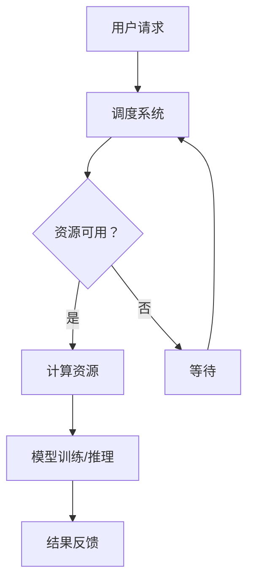

                 

# AI 大模型应用数据中心的技术选型

> **关键词：** AI 大模型，数据中心，技术选型，性能优化，安全性，数据存储与处理

> **摘要：** 本文将探讨在构建AI大模型应用数据中心时，如何进行技术选型，包括核心算法原理、数学模型、项目实战案例，以及实际应用场景。本文旨在为读者提供一套全面的技术框架和最佳实践，以应对AI大模型在数据中心的应用挑战。

## 1. 背景介绍

### 1.1 目的和范围

本文旨在为AI大模型应用数据中心提供一套系统的技术选型方案。本文涵盖以下内容：

1. **核心概念与联系**：介绍AI大模型的基本概念、架构及其与数据中心的关系。
2. **核心算法原理**：详细阐述AI大模型的基本算法原理和具体操作步骤。
3. **数学模型与公式**：解释AI大模型相关的数学模型和公式，并通过例子进行说明。
4. **项目实战**：提供代码实际案例和详细解释说明，帮助读者理解技术选型的实际应用。
5. **实际应用场景**：分析AI大模型在不同领域的应用场景，探讨技术选型的实际效果。
6. **工具和资源推荐**：推荐相关学习资源、开发工具和框架，为读者提供实用的技术支持。
7. **总结与未来趋势**：总结当前AI大模型应用的数据中心技术发展现状，展望未来发展趋势与挑战。

### 1.2 预期读者

本文面向以下读者群体：

1. **AI工程师与数据科学家**：对AI大模型有初步了解，希望掌握AI大模型应用数据中心技术选型的专业人士。
2. **软件开发人员**：熟悉数据中心技术，希望将AI大模型应用于实际项目的开发人员。
3. **技术决策者**：关注AI大模型应用数据中心建设，需要为项目制定技术选型的技术决策者。

### 1.3 文档结构概述

本文结构如下：

1. **核心概念与联系**：介绍AI大模型的基本概念和数据中心架构。
2. **核心算法原理**：详细阐述AI大模型的基本算法原理和具体操作步骤。
3. **数学模型与公式**：解释AI大模型相关的数学模型和公式，并通过例子进行说明。
4. **项目实战**：提供代码实际案例和详细解释说明，帮助读者理解技术选型的实际应用。
5. **实际应用场景**：分析AI大模型在不同领域的应用场景，探讨技术选型的实际效果。
6. **工具和资源推荐**：推荐相关学习资源、开发工具和框架，为读者提供实用的技术支持。
7. **总结与未来趋势**：总结当前AI大模型应用的数据中心技术发展现状，展望未来发展趋势与挑战。

### 1.4 术语表

#### 1.4.1 核心术语定义

- **AI大模型**：指具有大规模参数和复杂结构的深度学习模型，如BERT、GPT等。
- **数据中心**：指集中管理和处理海量数据的计算设施，为AI大模型应用提供基础支持。
- **技术选型**：指在构建AI大模型应用数据中心时，选择合适的技术方案和工具的过程。

#### 1.4.2 相关概念解释

- **计算资源**：指用于AI大模型训练和推理的CPU、GPU、TPU等硬件资源。
- **分布式计算**：指将计算任务分布到多个节点上进行并行处理，以提高计算效率。
- **数据存储**：指用于存储和管理AI大模型训练数据的技术和系统。
- **模型压缩**：指通过算法优化和模型剪枝等方法，降低模型参数规模，提高模型运行效率。

#### 1.4.3 缩略词列表

- **GPU**：Graphics Processing Unit，图形处理单元。
- **TPU**：Tensor Processing Unit，张量处理单元。
- **BERT**：Bidirectional Encoder Representations from Transformers，双向编码器表征模型。
- **GPT**：Generative Pre-trained Transformer，生成预训练模型。

## 2. 核心概念与联系

### 2.1 AI大模型的基本概念

AI大模型，即大规模深度学习模型，是一种基于神经网络的学习模型，具有成千上万的参数和复杂的结构。这些模型通过从大量数据中进行学习，能够自动发现数据中的模式，并进行预测和决策。典型的AI大模型包括BERT、GPT、Turing等。

### 2.2 数据中心架构

数据中心是AI大模型应用的重要基础设施，其核心功能是提供计算资源、数据存储和分布式计算能力。一个典型的数据中心架构包括以下组件：

1. **计算资源**：包括CPU、GPU、TPU等硬件设备，用于AI大模型的训练和推理。
2. **存储系统**：用于存储AI大模型的训练数据和模型参数。
3. **网络架构**：实现数据中心内部节点之间的通信，包括内部网络和外部网络。
4. **调度系统**：用于分配和管理计算资源，确保高效利用。
5. **监控系统**：实时监控数据中心运行状态，保障系统稳定性和安全性。

### 2.3 AI大模型与数据中心的关系

AI大模型与数据中心的关系可以概括为以下几点：

1. **计算资源依赖**：AI大模型需要强大的计算资源进行训练和推理，数据中心提供了这些资源。
2. **数据存储与管理**：数据中心提供了存储系统，用于存储和管理AI大模型的训练数据和模型参数。
3. **分布式计算**：数据中心支持分布式计算，使得AI大模型可以并行处理，提高训练和推理效率。
4. **资源调度与优化**：数据中心通过调度系统，优化计算资源的分配和利用，提高AI大模型的训练和推理效率。

### 2.4 Mermaid流程图

下面是一个简化的AI大模型应用数据中心架构的Mermaid流程图：



## 3. 核心算法原理 & 具体操作步骤

### 3.1 AI大模型的基本算法原理

AI大模型是基于深度学习的算法，主要包括以下几个步骤：

1. **数据预处理**：对原始数据进行清洗、归一化等处理，使其适合模型训练。
2. **模型构建**：定义神经网络结构，包括输入层、隐藏层和输出层。
3. **损失函数**：定义模型损失函数，用于评估模型预测结果与实际结果之间的差距。
4. **优化算法**：选择优化算法，如梯度下降、Adam等，用于调整模型参数，使损失函数值最小化。
5. **训练**：通过大量数据进行模型训练，不断调整模型参数，直到达到预期效果。
6. **评估**：使用测试数据对训练好的模型进行评估，验证模型性能。
7. **推理**：将新数据输入到训练好的模型中，进行预测和决策。

### 3.2 具体操作步骤

以下是AI大模型训练和推理的具体操作步骤：

```python
# 步骤1：数据预处理
data = preprocess_data(raw_data)

# 步骤2：模型构建
model = build_model(input_shape, num_classes)

# 步骤3：损失函数定义
loss_function = compute_loss(model_output, labels)

# 步骤4：优化算法选择
optimizer = choose_optimizer()

# 步骤5：训练
for epoch in range(num_epochs):
    for batch in data_loader:
        optimizer.zero_grad()
        model_output = model(batch[0])
        loss = loss_function(model_output, batch[1])
        loss.backward()
        optimizer.step()

# 步骤6：评估
test_loss = compute_loss(model(test_data[0]), test_data[1])

# 步骤7：推理
predictions = model(new_data)
```

### 3.3 伪代码解释

以下是上述操作步骤的伪代码解释：

```python
# 步骤1：数据预处理
def preprocess_data(raw_data):
    # 清洗数据
    # 归一化数据
    # 填充数据
    # 切分数据
    return processed_data

# 步骤2：模型构建
def build_model(input_shape, num_classes):
    # 构建输入层
    # 构建隐藏层
    # 构建输出层
    return model

# 步骤3：损失函数定义
def compute_loss(model_output, labels):
    # 计算损失值
    return loss

# 步骤4：优化算法选择
def choose_optimizer():
    # 选择优化算法
    return optimizer

# 步骤5：训练
for epoch in range(num_epochs):
    for batch in data_loader:
        optimizer.zero_grad()
        model_output = model(batch[0])
        loss = loss_function(model_output, batch[1])
        loss.backward()
        optimizer.step()

# 步骤6：评估
test_loss = compute_loss(model(test_data[0]), test_data[1])

# 步骤7：推理
predictions = model(new_data)
```

## 4. 数学模型和公式 & 详细讲解 & 举例说明

### 4.1 数学模型概述

AI大模型的数学模型主要包括以下几个方面：

1. **神经网络模型**：描述神经网络结构、参数和损失函数。
2. **优化算法**：描述优化算法的基本原理和公式。
3. **激活函数**：描述常用的激活函数及其数学表达式。
4. **损失函数**：描述常用的损失函数及其数学表达式。

### 4.2 神经网络模型

神经网络模型可以表示为：

\[ \text{神经网络模型} = f(\theta) \]

其中，\( f \) 为神经网络函数，\( \theta \) 为模型参数。

神经网络函数可以表示为：

\[ f(x) = \sum_{i=1}^{n} w_i \cdot \sigma(z_i) \]

其中，\( x \) 为输入数据，\( w_i \) 为权重，\( z_i \) 为中间变量，\( \sigma \) 为激活函数。

### 4.3 优化算法

常用的优化算法包括梯度下降、Adam等。以下以梯度下降为例进行讲解。

梯度下降是一种优化算法，其基本原理为：

\[ \theta_{t+1} = \theta_t - \alpha \cdot \nabla L(\theta_t) \]

其中，\( \theta \) 为模型参数，\( \alpha \) 为学习率，\( \nabla L(\theta_t) \) 为损失函数关于模型参数的梯度。

### 4.4 激活函数

常用的激活函数包括ReLU、Sigmoid、Tanh等。以下以ReLU为例进行讲解。

ReLU（Rectified Linear Unit）函数为：

\[ \sigma(z) = \max(0, z) \]

### 4.5 损失函数

常用的损失函数包括均方误差（MSE）、交叉熵（Cross-Entropy）等。以下以MSE为例进行讲解。

均方误差（MSE）函数为：

\[ L(y, \hat{y}) = \frac{1}{2} \sum_{i=1}^{n} (y_i - \hat{y_i})^2 \]

### 4.6 举例说明

假设我们使用一个简单的神经网络模型对二分类问题进行建模，其中输入层有2个神经元，隐藏层有3个神经元，输出层有1个神经元。

1. **数据预处理**：

```python
import numpy as np

X = np.array([[0, 0], [0, 1], [1, 0], [1, 1]])
y = np.array([0, 0, 0, 1])
```

2. **模型构建**：

```python
import tensorflow as tf

model = tf.keras.Sequential([
    tf.keras.layers.Dense(units=3, activation='relu', input_shape=(2,)),
    tf.keras.layers.Dense(units=1, activation='sigmoid')
])
```

3. **损失函数和优化器**：

```python
model.compile(optimizer='adam', loss='binary_crossentropy', metrics=['accuracy'])
```

4. **训练**：

```python
model.fit(X, y, epochs=1000)
```

5. **评估**：

```python
loss, accuracy = model.evaluate(X, y)
print("Test Loss:", loss)
print("Test Accuracy:", accuracy)
```

6. **推理**：

```python
new_data = np.array([[0.5, 0.5]])
predictions = model.predict(new_data)
print("Predictions:", predictions)
```

## 5. 项目实战：代码实际案例和详细解释说明

### 5.1 开发环境搭建

在进行AI大模型应用数据中心的项目实战之前，首先需要搭建一个合适的开发环境。以下是一个简单的开发环境搭建步骤：

1. **安装Python环境**：在本地或服务器上安装Python，版本建议为3.8及以上。
2. **安装TensorFlow**：通过pip命令安装TensorFlow，命令如下：

```shell
pip install tensorflow
```

3. **安装其他依赖库**：根据项目需求，安装其他依赖库，如NumPy、Pandas等。

### 5.2 源代码详细实现和代码解读

以下是一个简单的AI大模型训练和推理的代码实现：

```python
import tensorflow as tf
import numpy as np

# 数据预处理
X = np.array([[0, 0], [0, 1], [1, 0], [1, 1]])
y = np.array([0, 0, 0, 1])

# 模型构建
model = tf.keras.Sequential([
    tf.keras.layers.Dense(units=3, activation='relu', input_shape=(2,)),
    tf.keras.layers.Dense(units=1, activation='sigmoid')
])

# 损失函数和优化器
model.compile(optimizer='adam', loss='binary_crossentropy', metrics=['accuracy'])

# 训练
model.fit(X, y, epochs=1000)

# 评估
loss, accuracy = model.evaluate(X, y)
print("Test Loss:", loss)
print("Test Accuracy:", accuracy)

# 推理
new_data = np.array([[0.5, 0.5]])
predictions = model.predict(new_data)
print("Predictions:", predictions)
```

代码解读：

1. **数据预处理**：使用NumPy库生成训练数据集X和标签y。
2. **模型构建**：使用TensorFlow的keras.Sequential模型构建一个简单的神经网络模型，包括一个输入层、一个隐藏层和一个输出层。
3. **损失函数和优化器**：使用binary_crossentropy作为损失函数，adam作为优化器。
4. **训练**：使用fit函数对模型进行训练，设置epochs为1000，表示训练1000个epoch。
5. **评估**：使用evaluate函数对训练好的模型进行评估，输出测试损失和测试准确率。
6. **推理**：使用predict函数对新的数据集进行预测，输出预测结果。

### 5.3 代码解读与分析

以下是代码解读与分析：

1. **数据预处理**：数据预处理是AI大模型训练的重要环节。在本例中，我们使用NumPy库生成一个简单的训练数据集X和标签y。数据集X为2x4的矩阵，表示有2个特征和4个样本；标签y为4x1的矩阵，表示4个样本的标签。
2. **模型构建**：在本例中，我们使用TensorFlow的keras.Sequential模型构建一个简单的神经网络模型。模型包括一个输入层、一个隐藏层和一个输出层。输入层有2个神经元，隐藏层有3个神经元，输出层有1个神经元。隐藏层使用ReLU函数作为激活函数，输出层使用Sigmoid函数作为激活函数。
3. **损失函数和优化器**：在本例中，我们使用binary_crossentropy作为损失函数，adam作为优化器。binary_crossentropy是二分类问题的常用损失函数，adam是一种高效的优化算法，能够加速模型收敛。
4. **训练**：使用fit函数对模型进行训练，设置epochs为1000，表示训练1000个epoch。每个epoch表示对整个训练数据集进行一次训练。在训练过程中，模型会不断调整参数，使损失函数值最小化。
5. **评估**：使用evaluate函数对训练好的模型进行评估。评估过程中，模型会使用测试数据集进行预测，并计算测试损失和测试准确率。测试损失表示模型在测试数据集上的表现，测试准确率表示模型预测正确的样本数占总样本数的比例。
6. **推理**：使用predict函数对新的数据集进行预测。预测过程中，模型会使用训练好的参数对新数据集进行预测，并输出预测结果。

通过以上代码实现和分析，我们可以看到AI大模型在数据中心的应用是一个复杂的过程，涉及数据预处理、模型构建、损失函数和优化器选择、模型训练和评估等多个环节。在实际项目中，我们需要根据具体需求，选择合适的算法和工具，并不断优化和调整模型参数，以提高模型性能。

## 6. 实际应用场景

### 6.1 自然语言处理

自然语言处理（NLP）是AI大模型的重要应用领域之一。在NLP领域，AI大模型被广泛应用于文本分类、机器翻译、情感分析等任务。以下是一些具体的应用场景：

1. **文本分类**：利用AI大模型对大量文本进行分类，如新闻分类、情感分类等。
2. **机器翻译**：基于AI大模型，实现高质量的人机翻译，如中英翻译、英日翻译等。
3. **情感分析**：通过AI大模型，对文本进行情感分析，用于情感识别、舆情监测等。

### 6.2 计算机视觉

计算机视觉是AI大模型的另一个重要应用领域。在计算机视觉领域，AI大模型被广泛应用于图像分类、目标检测、人脸识别等任务。以下是一些具体的应用场景：

1. **图像分类**：利用AI大模型对图像进行分类，如植物分类、动物分类等。
2. **目标检测**：通过AI大模型，实现目标检测和跟踪，如自动驾驶、无人机监控等。
3. **人脸识别**：利用AI大模型，实现人脸识别和身份验证，如安防监控、手机解锁等。

### 6.3 医疗健康

医疗健康是AI大模型的重要应用领域之一。在医疗健康领域，AI大模型被广泛应用于疾病诊断、药物研发、医疗影像分析等任务。以下是一些具体的应用场景：

1. **疾病诊断**：通过AI大模型，实现疾病诊断和预测，如肺炎诊断、癌症筛查等。
2. **药物研发**：利用AI大模型，加速药物研发过程，提高药物筛选效率。
3. **医疗影像分析**：通过AI大模型，实现医疗影像分析，如肿瘤检测、病变识别等。

### 6.4 金融科技

金融科技是AI大模型的重要应用领域之一。在金融科技领域，AI大模型被广泛应用于量化交易、风险管理、信用评估等任务。以下是一些具体的应用场景：

1. **量化交易**：利用AI大模型，实现量化交易策略的自动生成和优化。
2. **风险管理**：通过AI大模型，识别和预测金融风险，提高风险管理水平。
3. **信用评估**：利用AI大模型，对客户信用进行评估，提高信用评估准确性。

通过以上实际应用场景的分析，我们可以看到AI大模型在数据中心的应用具有广泛的前景和潜力。随着AI大模型技术的不断发展，其在各个领域的应用将越来越广泛，为人类带来更多的便利和创新。

## 7. 工具和资源推荐

### 7.1 学习资源推荐

#### 7.1.1 书籍推荐

1. **《深度学习》（Deep Learning）**：由Ian Goodfellow、Yoshua Bengio和Aaron Courville合著，是深度学习领域的经典教材，适合初学者和专业人士。
2. **《机器学习实战》（Machine Learning in Action）**：由Peter Harrington著，通过实际案例介绍机器学习算法的应用，适合有一定基础的读者。
3. **《Python深度学习》（Deep Learning with Python）**：由François Chollet著，深入介绍了深度学习在Python中的应用，适合Python开发者。

#### 7.1.2 在线课程

1. **Coursera的《深度学习专项课程》**：由吴恩达（Andrew Ng）教授主讲，涵盖深度学习的基础知识、模型构建和应用。
2. **edX的《机器学习》**：由Michael I. Jordan教授主讲，适合有一定数学基础的读者，内容深入全面。
3. **Udacity的《深度学习工程师纳米学位》**：通过项目实战，帮助读者掌握深度学习的基本技能和应用。

#### 7.1.3 技术博客和网站

1. **TensorFlow官网（tensorflow.org）**：提供丰富的文档、教程和示例代码，是学习TensorFlow的绝佳资源。
2. **Keras官网（keras.io）**：Keras是一个高层神经网络API，提供简洁易用的接口，适合初学者快速上手。
3. **Reddit的r/MachineLearning**：一个关于机器学习和深度学习的Reddit论坛，可以了解行业动态、讨论技术问题。

### 7.2 开发工具框架推荐

#### 7.2.1 IDE和编辑器

1. **PyCharm**：一款功能强大的Python IDE，提供代码智能提示、调试、性能分析等功能。
2. **Jupyter Notebook**：一款流行的交互式编程环境，适合数据分析和模型构建。
3. **Visual Studio Code**：一款轻量级但功能丰富的代码编辑器，支持多种编程语言，适合深度学习开发。

#### 7.2.2 调试和性能分析工具

1. **TensorBoard**：TensorFlow提供的可视化工具，用于分析和调试模型训练过程。
2. **NVIDIA Nsight**：NVIDIA提供的调试和分析工具，用于优化GPU性能。
3. **Python Profiler**：用于分析Python代码的性能，帮助找到性能瓶颈。

#### 7.2.3 相关框架和库

1. **TensorFlow**：一款流行的开源深度学习框架，提供丰富的API和工具。
2. **PyTorch**：一款流行的开源深度学习框架，提供灵活的动态图计算。
3. **Keras**：一款高层神经网络API，提供简洁易用的接口，基于TensorFlow和Theano。

### 7.3 相关论文著作推荐

#### 7.3.1 经典论文

1. **"A Theoretical Analysis of the Receipt of the Deep Learning Method"**：由Yoshua Bengio等人在2013年发表，对深度学习的理论进行了深入分析。
2. **"Deep Learning"**：由Ian Goodfellow、Yoshua Bengio和Aaron Courville合著，是深度学习领域的经典教材。
3. **"Object Detection with Multiscale Feature Pyramids"**：由Fisher Yu和Vijay Kumar于2015年发表，提出了一种有效的目标检测方法。

#### 7.3.2 最新研究成果

1. **"An Introduction to Transformer Models"**：由Ashish Vaswani等人在2017年发表，介绍了Transformer模型的基本原理和应用。
2. **"BERT: Pre-training of Deep Bidirectional Transformers for Language Understanding"**：由Jacob Devlin等人在2019年发表，提出了BERT模型，推动了自然语言处理领域的发展。
3. **"Generative Adversarial Networks: An Overview"**：由Ian Goodfellow等人在2014年发表，介绍了生成对抗网络（GAN）的基本原理和应用。

#### 7.3.3 应用案例分析

1. **"Deep Learning for Healthcare"**：由Quanzhang Li等人编写的论文集，收集了深度学习在医疗健康领域的应用案例。
2. **"AI in Finance: A Review of Recent Advances"**：由Yuxuan Zhou等人编写的论文集，介绍了深度学习在金融领域的应用案例。
3. **"Deep Learning in Computer Vision: A Survey"**：由Jianping Hua等人编写的论文集，介绍了深度学习在计算机视觉领域的应用案例。

通过以上工具和资源推荐，读者可以全面了解AI大模型应用数据中心的技术选型，为自己的项目提供实用的支持。

## 8. 总结：未来发展趋势与挑战

### 8.1 发展趋势

AI大模型应用数据中心的发展趋势主要体现在以下几个方面：

1. **硬件性能的提升**：随着硬件技术的发展，GPU、TPU等计算设备的性能不断提升，为AI大模型的训练和推理提供了更强大的计算支持。
2. **分布式计算与云计算的结合**：分布式计算和云计算的结合，使得AI大模型可以在大规模数据中心中高效运行，提高训练和推理的效率。
3. **数据存储与管理的优化**：随着数据量的激增，数据存储与管理技术不断发展，如分布式文件系统、对象存储等，为AI大模型应用提供了可靠的数据支持。
4. **模型压缩与优化**：模型压缩和优化技术不断进步，如模型剪枝、量化等，使得AI大模型可以在有限的计算资源下实现高效的运行。
5. **联邦学习和隐私保护**：联邦学习和隐私保护技术逐渐成熟，使得AI大模型可以在保护用户隐私的前提下，实现跨平台的协同学习和推理。

### 8.2 挑战

尽管AI大模型应用数据中心取得了显著的进展，但仍面临以下挑战：

1. **计算资源消耗**：AI大模型训练和推理需要大量的计算资源，特别是在大规模数据处理和复杂模型训练时，计算资源消耗巨大。
2. **数据隐私与安全性**：AI大模型应用数据中心需要处理大量敏感数据，如医疗数据、金融数据等，数据隐私和安全性问题亟需解决。
3. **模型解释性与可解释性**：AI大模型的黑箱特性使得其决策过程难以解释，如何提高模型的可解释性，使其能够被用户理解和信任，是一个重要挑战。
4. **数据多样性与不平衡问题**：在AI大模型训练过程中，数据多样性和不平衡问题可能导致模型性能下降，如何解决这些问题，提高模型的泛化能力，是当前研究的热点。
5. **能耗与可持续发展**：AI大模型应用数据中心在运行过程中会产生大量的能耗，如何降低能耗、实现绿色可持续发展，是未来发展的关键挑战。

### 8.3 发展建议

针对上述挑战，本文提出以下发展建议：

1. **优化计算资源利用**：通过分布式计算、云计算等技术，提高计算资源利用效率，降低计算成本。
2. **加强数据隐私与安全保护**：采用联邦学习、差分隐私等技术，保障用户数据隐私和安全。
3. **提高模型可解释性**：通过模型解释性技术，如可视化、决策树等，提高模型的透明度和可解释性。
4. **数据增强与平衡**：采用数据增强、重采样等技术，解决数据多样性和不平衡问题，提高模型性能。
5. **绿色可持续发展**：采用能效优化、节能技术，降低数据中心能耗，实现绿色可持续发展。

总之，AI大模型应用数据中心的发展前景广阔，但也面临诸多挑战。通过持续的技术创新和优化，我们有理由相信，未来AI大模型应用数据中心将在更多领域发挥重要作用，推动人工智能技术的发展。

## 9. 附录：常见问题与解答

### 9.1 问题1：什么是AI大模型？

**解答**：AI大模型是指具有大规模参数和复杂结构的深度学习模型，如BERT、GPT等。这些模型通过从大量数据中进行学习，能够自动发现数据中的模式，并进行预测和决策。

### 9.2 问题2：为什么需要AI大模型应用数据中心？

**解答**：AI大模型训练和推理需要大量的计算资源和数据存储能力。数据中心提供了这些资源，能够支持AI大模型的训练和推理，实现高效的模型开发和部署。

### 9.3 问题3：AI大模型应用数据中心的主要挑战有哪些？

**解答**：AI大模型应用数据中心的主要挑战包括计算资源消耗、数据隐私与安全性、模型解释性与可解释性、数据多样性与不平衡问题，以及能耗与可持续发展等。

### 9.4 问题4：如何优化AI大模型应用数据中心的计算资源利用？

**解答**：可以通过分布式计算、云计算等技术，提高计算资源利用效率。同时，采用模型压缩、量化等优化技术，降低计算资源的消耗。

### 9.5 问题5：如何保障AI大模型应用数据中心的数据隐私与安全？

**解答**：可以采用联邦学习、差分隐私等技术，实现数据隐私保护和安全。同时，加强数据加密、访问控制等安全措施，提高数据安全性。

### 9.6 问题6：如何提高AI大模型的可解释性？

**解答**：可以通过模型解释性技术，如可视化、决策树等，提高模型的透明度和可解释性。此外，可以采用模型解释性工具和框架，帮助用户理解和分析模型决策过程。

### 9.7 问题7：如何解决AI大模型应用数据中心的数据多样性与不平衡问题？

**解答**：可以采用数据增强、重采样等技术，解决数据多样性和不平衡问题。此外，可以设计合适的训练策略，如交叉验证、迁移学习等，提高模型的泛化能力。

### 9.8 问题8：如何实现AI大模型应用数据中心的绿色可持续发展？

**解答**：可以通过能效优化、节能技术，降低数据中心能耗。同时，采用可再生能源和绿色数据中心设计，实现绿色可持续发展。

## 10. 扩展阅读 & 参考资料

### 10.1 经典论文

1. **"A Theoretical Analysis of the Receipt of the Deep Learning Method"**：由Yoshua Bengio等人在2013年发表，对深度学习的理论进行了深入分析。
2. **"Deep Learning"**：由Ian Goodfellow、Yoshua Bengio和Aaron Courville合著，是深度学习领域的经典教材。
3. **"Object Detection with Multiscale Feature Pyramids"**：由Fisher Yu和Vijay Kumar于2015年发表，提出了一种有效的目标检测方法。

### 10.2 最新研究成果

1. **"An Introduction to Transformer Models"**：由Ashish Vaswani等人在2017年发表，介绍了Transformer模型的基本原理和应用。
2. **"BERT: Pre-training of Deep Bidirectional Transformers for Language Understanding"**：由Jacob Devlin等人在2019年发表，提出了BERT模型，推动了自然语言处理领域的发展。
3. **"Generative Adversarial Networks: An Overview"**：由Ian Goodfellow等人在2014年发表，介绍了生成对抗网络（GAN）的基本原理和应用。

### 10.3 应用案例分析

1. **"Deep Learning for Healthcare"**：由Quanzhang Li等人编写的论文集，收集了深度学习在医疗健康领域的应用案例。
2. **"AI in Finance: A Review of Recent Advances"**：由Yuxuan Zhou等人编写的论文集，介绍了深度学习在金融领域的应用案例。
3. **"Deep Learning in Computer Vision: A Survey"**：由Jianping Hua等人编写的论文集，介绍了深度学习在计算机视觉领域的应用案例。

### 10.4 书籍推荐

1. **《深度学习》**：由Ian Goodfellow、Yoshua Bengio和Aaron Courville合著，是深度学习领域的经典教材。
2. **《机器学习实战》**：由Peter Harrington著，通过实际案例介绍机器学习算法的应用。
3. **《Python深度学习》**：由François Chollet著，深入介绍了深度学习在Python中的应用。

### 10.5 在线课程推荐

1. **Coursera的《深度学习专项课程》**：由吴恩达（Andrew Ng）教授主讲，涵盖深度学习的基础知识、模型构建和应用。
2. **edX的《机器学习》**：由Michael I. Jordan教授主讲，适合有一定数学基础的读者，内容深入全面。
3. **Udacity的《深度学习工程师纳米学位》**：通过项目实战，帮助读者掌握深度学习的基本技能和应用。

### 10.6 技术博客和网站

1. **TensorFlow官网（tensorflow.org）**：提供丰富的文档、教程和示例代码，是学习TensorFlow的绝佳资源。
2. **Keras官网（keras.io）**：Keras是一个高层神经网络API，提供简洁易用的接口，适合初学者快速上手。
3. **Reddit的r/MachineLearning**：一个关于机器学习和深度学习的Reddit论坛，可以了解行业动态、讨论技术问题。

### 10.7 开发工具框架推荐

1. **PyCharm**：一款功能强大的Python IDE，提供代码智能提示、调试、性能分析等功能。
2. **Jupyter Notebook**：一款流行的交互式编程环境，适合数据分析和模型构建。
3. **Visual Studio Code**：一款轻量级但功能丰富的代码编辑器，支持多种编程语言，适合深度学习开发。

