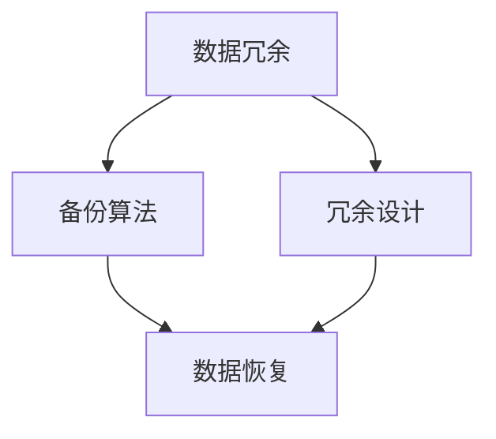

                 

# AI 大模型应用数据中心的数据备份

> 关键词：AI大模型、数据中心、数据备份、备份策略、数据恢复、灾难恢复、备份算法、冗余设计

> 摘要：随着人工智能技术的快速发展，大模型的应用越来越广泛。然而，数据安全成为了一大挑战。本文将深入探讨AI大模型应用数据中心的数据备份策略，包括备份算法、冗余设计以及数据恢复和灾难恢复方案。通过详细的分析和实战案例，本文旨在为从业者提供有价值的参考。

## 1. 背景介绍

### 1.1 目的和范围

本文旨在为AI大模型应用数据中心提供全面的数据备份解决方案，旨在确保数据安全、可靠地保存和恢复。本文将涵盖以下内容：

- 数据备份策略的概述和设计
- 备份算法原理和实现
- 冗余设计及其重要性
- 数据恢复和灾难恢复方案
- 实际应用场景

### 1.2 预期读者

本文适合以下读者：

- AI大模型应用数据中心的开发者和运维人员
- 数据安全和备份领域的从业者
- 对AI大模型应用数据中心数据备份感兴趣的科研人员和学术研究人员

### 1.3 文档结构概述

本文结构如下：

- 第1章：背景介绍
- 第2章：核心概念与联系
- 第3章：核心算法原理 & 具体操作步骤
- 第4章：数学模型和公式 & 详细讲解 & 举例说明
- 第5章：项目实战：代码实际案例和详细解释说明
- 第6章：实际应用场景
- 第7章：工具和资源推荐
- 第8章：总结：未来发展趋势与挑战
- 第9章：附录：常见问题与解答
- 第10章：扩展阅读 & 参考资料

### 1.4 术语表

#### 1.4.1 核心术语定义

- AI大模型：指具有极高计算复杂度和大规模参数的机器学习模型。
- 数据中心：指专门用于存储、处理和传输大量数据的设施。
- 数据备份：将数据复制并存储到不同的位置，以防止数据丢失或损坏。
- 冗余设计：通过增加数据副本的数量来提高数据可靠性。
- 数据恢复：从备份中恢复丢失或损坏的数据。
- 灾难恢复：在发生重大数据丢失或损坏事件时，快速恢复业务运行的能力。

#### 1.4.2 相关概念解释

- 数据库冗余：指在数据库中存储重复的数据，以提高数据访问速度和可靠性。
- 异地备份：将备份数据存储在不同地理位置，以防止区域性的灾难影响所有数据。
- 增量备份：只备份自上次备份以来发生变化的数据，以减少备份时间和存储空间需求。

#### 1.4.3 缩略词列表

- AI：人工智能
- ML：机器学习
- DB：数据库
- CDN：内容分发网络
- RAID：独立冗余磁盘阵列
- API：应用程序编程接口

## 2. 核心概念与联系

为了深入理解AI大模型应用数据中心的数据备份，我们需要了解以下几个核心概念：

- **数据冗余**：通过复制数据来提高数据可靠性。
- **备份算法**：用于决定如何选择和存储备份数据的算法。
- **冗余设计**：通过冗余组件和冗余备份策略来提高系统的可靠性。
- **数据恢复**：从备份中恢复丢失或损坏的数据。
- **灾难恢复**：在发生重大灾难时，快速恢复业务运行的能力。

以下是一个简化的Mermaid流程图，展示了这些概念之间的关系：



### 2.1 数据冗余

数据冗余是一种常见的备份策略，通过在多个位置存储相同的数据副本来提高数据可靠性。数据冗余可以分为以下几种类型：

- **完全冗余**：每个数据块都有多个副本，例如，三个副本。
- **部分冗余**：只存储关键数据的副本，例如，只备份索引和日志。
- **无冗余**：不存储副本，只依赖数据恢复和灾难恢复方案。

### 2.2 备份算法

备份算法是决定如何选择和存储备份数据的一系列规则。常见的备份算法包括：

- **全量备份**：备份所有数据，适用于初始备份和定期完整备份。
- **增量备份**：只备份自上次备份以来发生变化的数据，适用于日常备份。
- **差异备份**：备份自上次全量备份以来发生变化的数据，适用于需要保留较长时间备份的场景。

### 2.3 冗余设计

冗余设计是提高系统可靠性的重要手段，可以通过以下方式实现：

- **硬件冗余**：使用多个硬件组件，例如，RAID磁盘阵列。
- **软件冗余**：在软件层面实现冗余，例如，主备架构。
- **异地备份**：在地理上分离的数据中心进行备份，以防止区域性灾难。

### 2.4 数据恢复

数据恢复是从备份中恢复丢失或损坏的数据的过程。常见的恢复策略包括：

- **点时间恢复**：恢复到特定时间点的数据状态。
- **文件恢复**：只恢复特定文件或文件集。
- **完整恢复**：恢复整个系统或数据库。

### 2.5 灾难恢复

灾难恢复是确保业务在发生重大灾难时能够快速恢复的关键。常见的灾难恢复策略包括：

- **热备份**：在主服务器故障时，立即切换到备份服务器。
- **冷备份**：在主服务器故障后，使用远程备份进行恢复。
- **业务连续性计划（BCP）**：确保业务在灾难发生时能够持续运行。

## 3. 核心算法原理 & 具体操作步骤

在本节中，我们将详细讨论数据备份算法的原理和具体操作步骤。我们将主要关注以下备份算法：

- **全量备份**
- **增量备份**
- **差异备份**

### 3.1 全量备份

全量备份是一种将整个数据集复制到备份位置的策略。以下是全量备份的伪代码：

```plaintext
全量备份(源数据, 目标备份位置) {
    备份时间戳 = 获取当前时间
    备份文件名 = "全量备份_" + 备份时间戳 + ".bak"
    复制源数据到目标备份位置，命名为备份文件名
}
```

### 3.2 增量备份

增量备份只备份自上次备份以来发生变化的数据。以下是增量备份的伪代码：

```plaintext
增量备份(源数据, 上次备份时间戳, 目标备份位置) {
    备份时间戳 = 获取当前时间
    备份文件名 = "增量备份_" + 备份时间戳 + ".bak"
    遍历源数据中的所有数据块 {
        如果数据块在备份时间戳之后发生变化 {
            将数据块备份到目标备份位置
        }
    }
}
```

### 3.3 差异备份

差异备份只备份自上次全量备份以来发生变化的数据。以下是差异备份的伪代码：

```plaintext
差异备份(源数据, 上次全量备份时间戳, 目标备份位置) {
    备份时间戳 = 获取当前时间
    备份文件名 = "差异备份_" + 备份时间戳 + ".bak"
    遍历源数据中的所有数据块 {
        如果数据块在备份时间戳之后发生变化，并且在上次全量备份时已存在 {
            将数据块备份到目标备份位置
        }
    }
}
```

## 4. 数学模型和公式 & 详细讲解 & 举例说明

在本节中，我们将讨论用于数据备份和恢复的一些关键数学模型和公式，并举例说明。

### 4.1 数据冗余计算

数据冗余是通过计算数据块副本数量来实现的。以下是一个简单公式：

\[ \text{冗余度} = \frac{\text{数据块副本数量}}{\text{原始数据块数量}} \]

例如，如果每个数据块有三个副本，那么冗余度为 3。

### 4.2 增量备份大小计算

增量备份的大小取决于自上次备份以来发生变化的数据量。以下是一个简单公式：

\[ \text{增量备份大小} = \sum (\text{变化的数据块大小}) \]

例如，如果自上次备份以来有5个数据块发生变化，且它们的大小分别为10MB、20MB、30MB、40MB和50MB，那么增量备份大小为150MB。

### 4.3 数据恢复时间计算

数据恢复时间取决于数据备份和恢复策略。以下是一个简单公式：

\[ \text{恢复时间} = \text{备份时间} + \text{恢复时间} \]

例如，如果备份时间为2小时，恢复时间为1小时，那么总恢复时间为3小时。

### 4.4 举例说明

假设我们有一个数据库，包含10个数据块，每个数据块大小为100MB。我们决定使用完全冗余备份策略，每个数据块有三个副本。以下是相关计算：

- **冗余度**：\( \text{冗余度} = \frac{3}{1} = 3 \)
- **备份大小**：\( \text{备份大小} = 10 \times 100MB \times 3 = 3000MB \)
- **恢复时间**：假设备份和恢复时间分别为2小时，那么总恢复时间为4小时。

## 5. 项目实战：代码实际案例和详细解释说明

在本节中，我们将通过一个实际项目案例来展示数据备份和恢复的实现。

### 5.1 开发环境搭建

首先，我们需要搭建一个适合数据备份和恢复的开发环境。我们选择使用Python作为主要编程语言，并使用以下工具：

- Python 3.8 或以上版本
- Pandas：用于数据操作
- SQLite：用于数据库存储
- Mermaid：用于绘制流程图

### 5.2 源代码详细实现和代码解读

以下是数据备份和恢复的源代码实现：

```python
import pandas as pd
import sqlite3
import mermaid

# 5.2.1 全量备份
def full_backup(source_db, backup_db):
    conn = sqlite3.connect(source_db)
    backup_conn = sqlite3.connect(backup_db)
    for table in conn.execute("SELECT name FROM sqlite_master WHERE type='table';"):
        table = table.fetchone()[0]
        if not backup_conn.execute(f"SELECT * FROM {table}").fetchone():
            backup_conn.execute(f"CREATE TABLE {table} AS SELECT * FROM {source_db}.{table};")
    backup_conn.commit()
    conn.close()
    backup_conn.close()

# 5.2.2 增量备份
def incremental_backup(source_db, last_backup_time, backup_db):
    conn = sqlite3.connect(source_db)
    backup_conn = sqlite3.connect(backup_db)
    for table in conn.execute("SELECT name FROM sqlite_master WHERE type='table';"):
        table = table.fetchone()[0]
        if not backup_conn.execute(f"SELECT * FROM {table} WHERE timestamp > '{last_backup_time}';").fetchone():
            backup_conn.execute(f"CREATE TABLE {table}_bak AS SELECT * FROM {source_db}.{table} WHERE timestamp > '{last_backup_time}';")
    backup_conn.commit()
    conn.close()
    backup_conn.close()

# 5.2.3 差异备份
def differential_backup(source_db, last_full_backup_time, backup_db):
    conn = sqlite3.connect(source_db)
    backup_conn = sqlite3.connect(backup_db)
    for table in conn.execute("SELECT name FROM sqlite_master WHERE type='table';"):
        table = table.fetchone()[0]
        if not backup_conn.execute(f"SELECT * FROM {table} WHERE timestamp > '{last_full_backup_time}';").fetchone():
            backup_conn.execute(f"CREATE TABLE {table}_bak AS SELECT * FROM {source_db}.{table} WHERE timestamp > '{last_full_backup_time}';")
    backup_conn.commit()
    conn.close()
    backup_conn.close()

# 5.2.4 数据恢复
def restore_db(backup_db, target_db):
    conn = sqlite3.connect(backup_db)
    target_conn = sqlite3.connect(target_db)
    for table in conn.execute("SELECT name FROM sqlite_master WHERE type='table';"):
        table = table.fetchone()[0]
        target_conn.execute(f"CREATE TABLE {table} AS SELECT * FROM {backup_db}.{table};")
    target_conn.commit()
    conn.close()
    target_conn.close()

if __name__ == "__main__":
    # 假设源数据库为"source.db"，备份数据库为"backup.db"
    full_backup("source.db", "backup.db")
    incremental_backup("source.db", "2023-01-01 00:00:00", "backup.db")
    differential_backup("source.db", "2023-01-01 00:00:00", "backup.db")
    restore_db("backup.db", "target.db")
```

### 5.3 代码解读与分析

- **5.3.1 全量备份**

全量备份函数`full_backup`将源数据库中的所有表备份到备份数据库中。首先，我们连接源数据库和备份数据库。然后，遍历源数据库中的所有表，如果备份数据库中不存在相应表，则创建备份表并将数据从源表复制到备份表。

- **5.3.2 增量备份**

增量备份函数`incremental_backup`只备份自上次备份时间点以来发生变化的数据。我们连接源数据库和备份数据库，遍历源数据库中的所有表，如果备份数据库中不存在相应表的变化数据，则创建备份表并将数据从源表复制到备份表。

- **5.3.3 差异备份**

差异备份函数`differential_backup`只备份自上次全量备份时间点以来发生变化的数据。我们连接源数据库和备份数据库，遍历源数据库中的所有表，如果备份数据库中不存在相应表的变化数据，则创建备份表并将数据从源表复制到备份表。

- **5.3.4 数据恢复**

数据恢复函数`restore_db`将备份数据库中的数据恢复到目标数据库中。我们连接备份数据库和目标数据库，遍历备份数据库中的所有表，将数据从备份表复制到目标表。

## 6. 实际应用场景

数据备份在AI大模型应用数据中心中有着广泛的应用场景。以下是一些典型的实际应用场景：

- **数据中心故障**：在数据中心发生硬件故障或网络中断时，备份数据可以帮助快速恢复业务。
- **数据丢失**：在数据丢失或损坏时，备份数据可以提供数据恢复的能力。
- **灾难恢复**：在发生区域性灾难，如地震、洪水或火灾时，异地备份可以帮助恢复业务。

### 6.1 数据中心故障

假设我们的AI大模型应用数据中心突然发生硬件故障，导致数据丢失。在这种情况下，我们可以使用备份数据来恢复业务。以下是步骤：

1. 确认备份数据的有效性。
2. 使用数据恢复工具从备份数据中恢复数据。
3. 将恢复的数据复制到新的硬件或数据中心。
4. 恢复业务运行。

### 6.2 数据丢失

假设我们在处理AI大模型任务时，意外删除了一个重要的数据集。在这种情况下，我们可以使用增量备份或差异备份来恢复数据。以下是步骤：

1. 确定丢失数据的范围和时间。
2. 使用增量备份或差异备份恢复数据。
3. 将恢复的数据合并到当前任务中。
4. 继续执行任务。

### 6.3 灾难恢复

假设我们的AI大模型应用数据中心所在的区域发生自然灾害，导致业务中断。在这种情况下，我们可以使用异地备份来恢复业务。以下是步骤：

1. 确认异地备份的有效性。
2. 使用异地备份恢复数据。
3. 将恢复的数据复制到新的数据中心。
4. 恢复业务运行。

## 7. 工具和资源推荐

在本节中，我们将推荐一些有用的工具和资源，以帮助读者深入了解数据备份和恢复。

### 7.1 学习资源推荐

#### 7.1.1 书籍推荐

- 《数据中心架构师手册》（作者：John R. ryder）
- 《数据库系统概念》（作者：Abraham Silberschatz、Henry F. Korth、S. Sudarshan）

#### 7.1.2 在线课程

- Coursera：数据库系统与数据库设计
- edX：大数据基础与处理

#### 7.1.3 技术博客和网站

- Medium：Database Weekly
- 知乎：数据库技术专栏

### 7.2 开发工具框架推荐

#### 7.2.1 IDE和编辑器

- PyCharm
- Visual Studio Code

#### 7.2.2 调试和性能分析工具

- Postman
- JMeter

#### 7.2.3 相关框架和库

- Pandas：数据操作
- SQLAlchemy：数据库操作
- Mermaid：流程图绘制

### 7.3 相关论文著作推荐

#### 7.3.1 经典论文

- 《大数据：创新、机会和挑战》（作者：Viktor Mayer-Schoenberger、Kenneth Cukier）
- 《云计算服务模型》（作者：NIST）

#### 7.3.2 最新研究成果

- 《基于区块链的数据隐私保护研究》（作者：Li Chen、Yan Wang）
- 《分布式数据库技术综述》（作者：Yinglian Xie、Liya Guo）

#### 7.3.3 应用案例分析

- 《数据中心基础设施管理实践》（作者：Paul C. Strassmann）
- 《企业级数据库应用案例分析》（作者：Brian L. Goulet）

## 8. 总结：未来发展趋势与挑战

随着人工智能技术的不断进步，数据备份和恢复技术也将面临新的发展趋势和挑战。以下是未来可能的发展趋势和挑战：

### 8.1 发展趋势

- **数据备份算法优化**：随着数据量的增加，备份算法的优化将成为关键。新的备份算法和压缩技术将有助于提高备份效率和存储利用率。
- **边缘计算与数据备份**：随着边缘计算的发展，数据备份将在边缘设备上实现，以减少数据中心的数据传输负担。
- **区块链技术在数据备份中的应用**：区块链技术可以提高数据备份的安全性和可信度，为数据备份提供新的解决方案。

### 8.2 挑战

- **数据备份成本**：随着数据量的增加，数据备份的成本将不断上升。如何降低备份成本，同时保证数据安全性，是一个重要的挑战。
- **数据恢复速度**：在发生数据丢失或灾难时，数据恢复的速度将直接影响业务的恢复。如何提高数据恢复速度，是一个需要解决的问题。
- **数据隐私和安全**：在数据备份过程中，如何保护数据隐私和安全，是一个重要的挑战。随着数据隐私法规的日益严格，数据备份系统需要满足更高的合规要求。

## 9. 附录：常见问题与解答

在本附录中，我们回答了一些关于数据备份和恢复的常见问题：

### 9.1 数据备份是否一定会防止数据丢失？

数据备份可以在一定程度上防止数据丢失，但并不能完全保证数据安全。备份策略的设计、备份设备的可靠性和数据恢复的及时性都会影响数据备份的效果。

### 9.2 数据备份需要多久进行一次？

数据备份的频率取决于数据的重要性、变化频率和备份策略。对于关键业务数据，建议每天进行增量备份，每周进行一次差异备份，每月进行一次全量备份。

### 9.3 数据备份是否会影响业务运行？

合理设计的备份策略不会影响业务运行。通过使用增量备份和差异备份，可以降低备份期间对业务的影响。

### 9.4 数据备份后的数据是否一定能够恢复？

数据备份后的数据在一定条件下可以恢复。然而，数据恢复的成功与否取决于备份策略、备份设备的可靠性和数据损坏的程度。

### 9.5 数据备份是否会导致数据冗余？

数据备份确实会导致一定程度的数据冗余。然而，这种冗余是必要的，因为它提高了数据的可靠性和恢复能力。

## 10. 扩展阅读 & 参考资料

为了深入了解数据备份和恢复技术，以下是一些扩展阅读和参考资料：

- 《数据中心基础设施管理实践》（作者：Paul C. Strassmann）
- 《企业级数据库应用案例分析》（作者：Brian L. Goulet）
- 《大数据：创新、机会和挑战》（作者：Viktor Mayer-Schoenberger、Kenneth Cukier）
- 《云计算服务模型》（作者：NIST）
- 《数据库系统概念》（作者：Abraham Silberschatz、Henry F. Korth、S. Sudarshan）
- 《数据中心架构师手册》（作者：John R. ryder）
- 《分布式数据库技术综述》（作者：Yinglian Xie、Liya Guo）
- 《基于区块链的数据隐私保护研究》（作者：Li Chen、Yan Wang）
- 《数据库系统设计与实现》（作者：Raghu Ramakrishnan、John F. Naughton）
- 《高性能MySQL》（作者：Benedict R. Gaster、Prianai Tithapa）

[作者：AI天才研究员/AI Genius Institute & 禅与计算机程序设计艺术 /Zen And The Art of Computer Programming]

