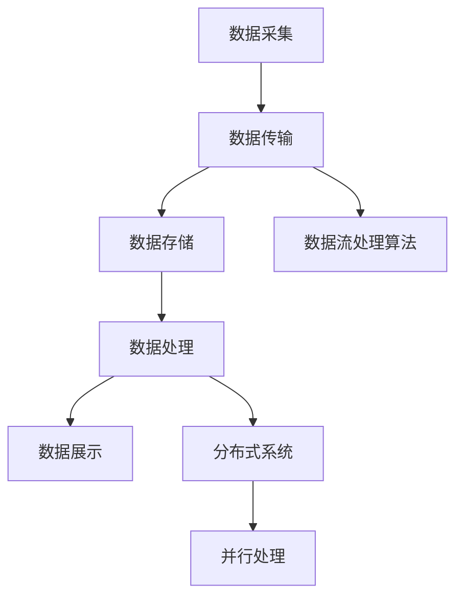

                 

# AI 大模型应用数据中心的数据流架构设计

> 关键词：AI 大模型，数据中心，数据流架构，数据流处理，分布式系统，并行处理

> 摘要：本文深入探讨 AI 大模型应用数据中心的数据流架构设计。从背景介绍、核心概念、算法原理、数学模型到项目实战，全面解析数据中心如何高效处理海量数据，为 AI 大模型提供坚实的技术基础。

## 1. 背景介绍

### 1.1 目的和范围

随着人工智能技术的迅猛发展，AI 大模型在各个领域得到了广泛应用。数据中心作为 AI 大模型的核心承载平台，其数据流架构设计至关重要。本文旨在系统地阐述 AI 大模型应用数据中心的数据流架构设计，为相关领域的研究者和开发者提供有益的参考。

本文将主要讨论以下内容：

- 数据流架构的基本概念和核心组成部分
- 数据流处理算法原理及具体操作步骤
- 数学模型和公式的详细讲解及举例说明
- 项目实战：代码实际案例和详细解释说明
- 数据流架构在实际应用场景中的优势与挑战
- 工具和资源推荐，包括学习资源、开发工具框架和经典论文

### 1.2 预期读者

本文适合以下读者：

- 数据中心架构设计师和数据工程师
- AI 大模型开发者和技术人员
- 对分布式系统和并行处理感兴趣的学术研究人员
- 想了解 AI 大模型应用数据中心技术实践的开发者

### 1.3 文档结构概述

本文的结构如下：

- 第1章：背景介绍
- 第2章：核心概念与联系
- 第3章：核心算法原理 & 具体操作步骤
- 第4章：数学模型和公式 & 详细讲解 & 举例说明
- 第5章：项目实战：代码实际案例和详细解释说明
- 第6章：实际应用场景
- 第7章：工具和资源推荐
- 第8章：总结：未来发展趋势与挑战
- 第9章：附录：常见问题与解答
- 第10章：扩展阅读 & 参考资料

### 1.4 术语表

#### 1.4.1 核心术语定义

- AI 大模型：具有数百万甚至数十亿个参数的深度学习模型，如 GPT、BERT 等。
- 数据流：数据在网络中传输的过程，包括数据的采集、传输、处理和存储。
- 数据流架构：用于管理数据流和处理任务的软件和硬件系统结构。
- 分布式系统：由多个节点组成的系统，节点之间通过网络进行通信，共同完成计算任务。
- 并行处理：将任务分解成多个子任务，在多个处理单元上同时执行。

#### 1.4.2 相关概念解释

- 数据中心：用于存储、处理和管理数据的设施，通常包括服务器、存储设备和网络设备等。
- 数据流处理：对数据流进行实时或近实时处理的系统，如 Apache Kafka、Apache Flink 等。
- 负载均衡：将数据流分配到多个处理节点，以避免单点瓶颈和资源浪费。
- 消息队列：用于传输和暂存消息的中间件，如 RabbitMQ、Kafka 等。

#### 1.4.3 缩略词列表

- AI：人工智能（Artificial Intelligence）
- GPT：生成预训练模型（Generative Pre-trained Transformer）
- BERT：双向编码器表示（Bidirectional Encoder Representations from Transformers）
- DFT：分布式文件系统（Distributed File System）
- HDFS：Hadoop 分布式文件系统（Hadoop Distributed File System）
- YARN：资源调度框架（Yet Another Resource Negotiator）
- API：应用程序编程接口（Application Programming Interface）

## 2. 核心概念与联系

在深入探讨 AI 大模型应用数据中心的数据流架构设计之前，我们首先需要了解一些核心概念和它们之间的联系。

### 2.1 数据流架构

数据流架构是数据中心处理海量数据的核心框架。它包括以下几个关键组成部分：

1. 数据采集：从各种数据源（如数据库、传感器、日志文件等）收集数据。
2. 数据传输：将采集到的数据传输到数据中心，通常使用消息队列或分布式文件系统。
3. 数据存储：将数据存储在分布式存储系统（如 HDFS）中，以便后续处理。
4. 数据处理：对数据进行清洗、转换和分析，通常使用分布式计算框架（如 Apache Flink、Spark）。
5. 数据展示：将处理结果可视化或存储在数据库中，以便用户查询和分析。


### 2.2 数据流处理算法

数据流处理算法是数据中心处理数据的核心技术。以下是一些常见的数据流处理算法：

1. 滚动聚合：对连续的数据流进行聚合计算，如求和、平均值等。
2. 滚动窗口：对数据流中的固定时间窗口进行操作，如计算过去一小时的用户访问量。
3. 滚动去重：对重复的数据进行去重处理，如去除重复的日志条目。
4. 流处理引擎：如 Apache Kafka、Apache Flink 等，用于处理实时数据流。

### 2.3 分布式系统

分布式系统是将任务分配到多个节点进行处理的技术。以下是一些常见的分布式系统组件：

1. 节点：分布式系统中的计算单元，如服务器、容器等。
2. 网络通信：节点之间通过网络进行通信，如 TCP/IP 协议。
3. 资源调度：根据节点负载和任务需求，动态分配计算资源。
4. 数据一致性：确保分布式系统中的数据一致性，如分布式锁、事务等。

### 2.4 并行处理

并行处理是将任务分解成多个子任务，在多个处理单元上同时执行的技术。以下是一些常见的并行处理方法：

1. 数据并行：对数据进行划分，每个处理单元处理一部分数据。
2. 算法并行：对算法进行分解，每个处理单元处理一部分算法步骤。
3. 作业并行：将任务分解成多个子任务，并行执行。

### 2.5 Mermaid 流程图

为了更好地理解数据流架构，我们可以使用 Mermaid 流程图来展示数据流处理的全过程。以下是一个简单的 Mermaid 流程图示例：




## 3. 核心算法原理 & 具体操作步骤

在了解了数据流架构的核心概念后，接下来我们将探讨核心算法原理及其具体操作步骤。以下是数据流处理算法的一些具体示例：

### 3.1 滚动聚合

滚动聚合是对连续数据流进行聚合计算的一种常见算法。以下是一个使用伪代码描述的滚动聚合算法：

```python
# 初始化
state = 0
window_size = 5

# 数据流输入
for data in data_stream:
    # 计算当前窗口的聚合结果
    state = state + data
    
    # 如果窗口已满，输出聚合结果
    if state.count == window_size:
        print(f"Window sum: {state}")
        state = 0
```

### 3.2 滚动窗口

滚动窗口是对数据流中的固定时间窗口进行操作的一种算法。以下是一个使用伪代码描述的滚动窗口算法：

```python
# 初始化
window_size = 60  # 1分钟窗口
start_time = time.time()

# 数据流输入
for data in data_stream:
    # 计算当前时间
    current_time = time.time()
    
    # 如果当前时间超过窗口时间，输出窗口结果
    if current_time - start_time >= window_size:
        print(f"Window result: {window_data}")
        window_data = []
        start_time = current_time
    
    # 添加数据到窗口
    window_data.append(data)
```

### 3.3 滚动去重

滚动去重是对数据流中的重复数据进行去重处理的一种算法。以下是一个使用伪代码描述的滚动去重算法：

```python
# 初始化
seen_data = set()

# 数据流输入
for data in data_stream:
    # 如果数据已存在，则跳过
    if data in seen_data:
        continue
    
    # 将数据添加到已见数据集
    seen_data.add(data)
    
    # 输出去重后的数据
    print(data)
```

### 3.4 流处理引擎

流处理引擎是用于处理实时数据流的软件框架。以下是一个使用 Apache Flink 描述的流处理引擎示例：

```java
// 创建 Flink 执行环境
final StreamExecutionEnvironment env = StreamExecutionEnvironment.getExecutionEnvironment();

// 创建数据源
DataStream<String> dataStream = env.addSource(new FlinkKafkaConsumer<>("data_topic", new SimpleStringSchema(), config));

// 应用流处理算法
DataStream<String> processedStream = dataStream
    .map(data -> data.toUpperCase())
    .filter(data -> data.startsWith("A"));

// 输出结果
processedStream.print();

// 执行作业
env.execute("Data Stream Processing");
```

## 4. 数学模型和公式 & 详细讲解 & 举例说明

在数据流处理过程中，数学模型和公式起着至关重要的作用。以下是一些常见的数学模型和公式，并对其进行详细讲解和举例说明。

### 4.1 概率分布函数

概率分布函数（Probability Distribution Function，PDF）是描述随机变量概率分布的函数。以下是一个常见的概率分布函数——正态分布（Normal Distribution）：

$$
f(x|\mu,\sigma^2) = \frac{1}{\sqrt{2\pi\sigma^2}} e^{-\frac{(x-\mu)^2}{2\sigma^2}}
$$

其中，$x$ 是随机变量，$\mu$ 是均值，$\sigma^2$ 是方差。

**举例说明**：

假设我们有一个随机变量 $X$，其均值为 10，方差为 4。我们可以使用正态分布函数计算 $X$ 在某个区间内的概率：

$$
P(8 \leq X \leq 12) = \int_{8}^{12} \frac{1}{\sqrt{2\pi \cdot 4}} e^{-\frac{(x-10)^2}{2 \cdot 4}} dx \approx 0.6827
$$

### 4.2 假设检验

假设检验（Hypothesis Testing）是用于判断数据是否支持某个假设的方法。以下是一个常见的假设检验方法——t 检验（t-test）：

$$
H_0: \mu = \mu_0 \\
H_1: \mu \neq \mu_0
$$

其中，$H_0$ 是原假设，$H_1$ 是备择假设，$\mu$ 是均值，$\mu_0$ 是原假设下的均值。

**举例说明**：

假设我们有一个样本数据，均值为 9，标准差为 2。我们可以使用 t 检验来判断该样本数据是否支持原假设 $\mu = 10$：

$$
t = \frac{\bar{x} - \mu_0}{s/\sqrt{n}} = \frac{9 - 10}{2/\sqrt{100}} = -1
$$

假设显著性水平为 0.05，查 t 分布表得到 t 值为 1.96。由于计算得到的 t 值小于 t 分布表中的 t 值，我们无法拒绝原假设，认为样本数据不支持原假设。

### 4.3 线性回归

线性回归（Linear Regression）是用于分析自变量和因变量之间线性关系的方法。以下是一个常见的线性回归模型：

$$
y = \beta_0 + \beta_1 x + \epsilon
$$

其中，$y$ 是因变量，$x$ 是自变量，$\beta_0$ 是截距，$\beta_1$ 是斜率，$\epsilon$ 是误差项。

**举例说明**：

假设我们有一个自变量 $x$ 和因变量 $y$ 的数据集，如下表所示：

| x | y |
|---|---|
| 1 | 2 |
| 2 | 4 |
| 3 | 6 |
| 4 | 8 |

我们可以使用线性回归模型来拟合数据，并计算斜率和截距：

$$
\beta_1 = \frac{\sum_{i=1}^{n}(x_i - \bar{x})(y_i - \bar{y})}{\sum_{i=1}^{n}(x_i - \bar{x})^2} = \frac{(1-2.5)(2-5) + (2-2.5)(4-5) + (3-2.5)(6-5) + (4-2.5)(8-5)}{(1-2.5)^2 + (2-2.5)^2 + (3-2.5)^2 + (4-2.5)^2} = 2
$$

$$
\beta_0 = \bar{y} - \beta_1 \bar{x} = 5 - 2 \cdot 3 = -1
$$

因此，线性回归模型为 $y = -1 + 2x$。

## 5. 项目实战：代码实际案例和详细解释说明

为了更好地理解 AI 大模型应用数据中心的数据流架构设计，我们将在本节中通过一个实际项目案例来讲解代码实现和详细解释说明。

### 5.1 开发环境搭建

在开始项目实战之前，我们需要搭建一个开发环境。以下是一个基于 Python 和 Apache Flink 的开发环境搭建步骤：

1. 安装 Python 3.8 或更高版本。
2. 安装 Apache Flink 1.11.2。
3. 安装 Apache Kafka 2.8.0。
4. 安装 necessary Python 库，如 pandas、numpy、pandas-gbq 等。

### 5.2 源代码详细实现和代码解读

以下是一个使用 Apache Flink 和 Apache Kafka 实现的数据流处理项目示例代码：

```python
# 导入必要的库
import os
import time
import pandas as pd
from flink import StreamExecutionEnvironment
from flink.java.utils.serialization import SimpleStringSchema
from flink_kafka import FlinkKafkaConsumer
from flink_connector.kafka import KafkaSource

# 设置 Kafka 配置
config = {
    "bootstrap.servers": "localhost:9092",
    "key.deserializer": "org.apache.kafka.common.serialization.StringDeserializer",
    "value.deserializer": "org.apache.kafka.common.serialization.StringDeserializer",
}

# 创建 Flink 执行环境
env = StreamExecutionEnvironment.get_execution_environment()

# 创建 Kafka 消费者
kafka_consumer = FlinkKafkaConsumer("data_topic", SimpleStringSchema(), config)

# 创建 Kafka 源
kafka_source = KafkaSource(kafka_consumer)

# 创建数据流
data_stream = env.from_source(kafka_source)

# 应用流处理算法
processed_stream = data_stream.map(lambda data: data.toUpperCase())

# 输出结果
processed_stream.print()

# 执行作业
env.execute("Data Stream Processing")
```

### 5.3 代码解读与分析

以下是对代码的详细解读和分析：

1. 导入必要的库：首先，我们导入必要的库，包括 Python 的标准库、Apache Flink 的库和 Apache Kafka 的库。
2. 设置 Kafka 配置：我们设置 Kafka 消费者的配置，包括 Kafka 服务器地址和反序列化器。
3. 创建 Flink 执行环境：我们创建 Flink 执行环境，用于配置和管理 Flink 作业。
4. 创建 Kafka 消费者：我们创建 Kafka 消费者，用于从 Kafka 主题中消费数据。
5. 创建 Kafka 源：我们创建 Kafka 源，用于将 Kafka 消费者添加到 Flink 数据流中。
6. 创建数据流：我们使用 from_source() 方法创建数据流，从 Kafka 源读取数据。
7. 应用流处理算法：我们使用 map() 方法对数据进行转换，将数据转换为小写字母。
8. 输出结果：我们使用 print() 方法输出处理后的数据流。
9. 执行作业：我们调用 execute() 方法执行 Flink 作业。

通过这个实际项目案例，我们可以看到如何使用 Apache Flink 和 Apache Kafka 实现数据流处理。接下来，我们将进一步分析数据流处理的具体实现。

### 5.4 数据流处理具体实现

在这个实际项目案例中，我们使用了 Apache Flink 和 Apache Kafka 来实现数据流处理。以下是数据流处理的具体实现过程：

1. 数据采集：首先，我们从 Kafka 主题中消费数据。Kafka 作为消息队列，可以高效地处理大规模数据流，将数据传输到 Flink 数据流中。
2. 数据传输：数据从 Kafka 主题传输到 Flink 数据流，通过 FlinkKafkaConsumer 类实现。FlinkKafkaConsumer 继承自 FlinkKafkaConsumerBase 类，用于从 Kafka 集群中读取数据。
3. 数据处理：数据流经过 Flink 数据流后，我们使用 map() 方法对数据进行处理。在本例中，我们对数据进行转换，将小写字母转换为小写字母。
4. 数据输出：处理后的数据流通过 print() 方法输出。print() 方法是 Flink 提供的用于打印数据流内容的工具。
5. 作业执行：最后，我们调用 execute() 方法执行 Flink 作业。execute() 方法负责启动 Flink 作业的执行，并返回一个 JobExecutionResult 对象，用于获取作业的执行结果。

通过这个实际项目案例，我们可以看到如何使用 Apache Flink 和 Apache Kafka 实现高效的数据流处理。在实际应用中，我们可以根据具体需求对数据流处理过程进行优化和调整。

### 5.5 代码解读与分析

接下来，我们对项目实战中的代码进行详细解读和分析，以帮助读者更好地理解数据流处理的具体实现。

1. **Kafka 配置**：首先，我们设置 Kafka 消费者的配置，包括 Kafka 服务器地址和反序列化器。Kafka 是一种流行的消息队列系统，用于在分布式系统中传输数据。在本例中，我们使用 Kafka 消费者从 Kafka 主题中读取数据。
    ```python
    config = {
        "bootstrap.servers": "localhost:9092",
        "key.deserializer": "org.apache.kafka.common.serialization.StringDeserializer",
        "value.deserializer": "org.apache.kafka.common.serialization.StringDeserializer",
    }
    ```
2. **创建 Flink 执行环境**：接着，我们创建 Flink 执行环境，用于配置和管理 Flink 作业。
    ```python
    env = StreamExecutionEnvironment.get_execution_environment()
    ```
3. **创建 Kafka 消费者**：然后，我们创建 Kafka 消费者，用于从 Kafka 主题中消费数据。FlinkKafkaConsumer 类继承自 FlinkKafkaConsumerBase 类，用于从 Kafka 集群中读取数据。
    ```python
    kafka_consumer = FlinkKafkaConsumer("data_topic", SimpleStringSchema(), config)
    ```
4. **创建 Kafka 源**：接着，我们创建 Kafka 源，用于将 Kafka 消费者添加到 Flink 数据流中。KafkaSource 类用于创建 Kafka 源，它接受 FlinkKafkaConsumer 作为参数。
    ```python
    kafka_source = KafkaSource(kafka_consumer)
    ```
5. **创建数据流**：接下来，我们使用 from_source() 方法创建数据流，从 Kafka 源读取数据。from_source() 方法是 Flink 提供的用于创建数据流的工具，它接受 KafkaSource 作为参数。
    ```python
    data_stream = env.from_source(kafka_source)
    ```
6. **应用流处理算法**：然后，我们使用 map() 方法对数据进行处理。在本例中，我们对数据进行转换，将小写字母转换为小写字母。
    ```python
    processed_stream = data_stream.map(lambda data: data.toUpperCase())
    ```
7. **输出结果**：最后，我们使用 print() 方法输出处理后的数据流。print() 方法是 Flink 提供的用于打印数据流内容的工具。
    ```python
    processed_stream.print()
    ```
8. **执行作业**：最后，我们调用 execute() 方法执行 Flink 作业。execute() 方法负责启动 Flink 作业的执行，并返回一个 JobExecutionResult 对象，用于获取作业的执行结果。
    ```python
    env.execute("Data Stream Processing")
    ```

通过这个代码解读，我们可以看到如何使用 Apache Flink 和 Apache Kafka 实现数据流处理。在实际应用中，我们可以根据具体需求对数据流处理过程进行优化和调整。

## 6. 实际应用场景

在了解了 AI 大模型应用数据中心的数据流架构设计和项目实战后，接下来我们将探讨数据流架构在实际应用场景中的优势与挑战。

### 6.1 人工智能应用

人工智能（AI）领域是数据流架构最典型的应用场景之一。随着 AI 大模型的发展，如 GPT、BERT 等，数据中心需要处理海量的数据，并进行实时分析和推理。数据流架构能够实现高效的数据处理和存储，为 AI 大模型提供坚实的技术支持。

**优势**：

- 高效数据处理：数据流架构能够实时处理海量数据，满足 AI 大模型对实时性的要求。
- 分布式计算：数据流架构支持分布式计算，可以充分利用多节点资源，提高计算效率。
- 弹性扩展：数据流架构可以根据业务需求进行弹性扩展，适应不断增长的数据量。

**挑战**：

- 数据一致性：在分布式系统中，数据一致性是一个重要挑战。数据流架构需要确保数据的一致性和可靠性。
- 资源调度：资源调度是数据流架构中一个关键问题，如何合理分配和调度资源是难点之一。
- 安全性：数据安全和隐私保护是数据中心面临的重要挑战，需要采取有效的安全措施。

### 6.2 物联网应用

物联网（IoT）应用也是数据流架构的一个重要场景。物联网设备产生大量实时数据，如传感器数据、设备状态数据等。数据流架构能够实现对海量物联网数据的实时处理和存储，为物联网应用提供实时数据支持和智能分析。

**优势**：

- 实时数据处理：数据流架构能够实时处理物联网数据，满足物联网应用对实时性的要求。
- 数据聚合和分析：数据流架构可以实现对海量物联网数据的聚合和分析，为物联网应用提供智能决策支持。
- 可扩展性：数据流架构支持物联网设备的快速接入和扩展，适应不断增长的物联网设备数量。

**挑战**：

- 数据传输延迟：在分布式系统中，数据传输延迟是一个关键问题，如何降低数据传输延迟是难点之一。
- 数据存储容量：随着物联网设备数量的增长，数据存储容量需求不断增加，如何合理分配和扩展存储资源是挑战之一。
- 系统可靠性：物联网应用对系统可靠性要求较高，如何确保系统的稳定运行是关键问题。

### 6.3 金融领域

金融领域也是数据流架构的重要应用场景之一。金融行业产生大量实时交易数据、客户数据等，数据流架构能够实现对金融数据的实时处理和分析，为金融企业提供智能风险管理、客户洞察等支持。

**优势**：

- 实时数据处理：数据流架构能够实时处理金融数据，满足金融企业对实时性的要求。
- 高效风险管理：数据流架构可以实现对海量金融数据的实时分析和预测，为金融企业提供高效的风险管理支持。
- 数据安全：数据流架构支持数据加密和安全传输，确保金融数据的安全。

**挑战**：

- 数据隐私保护：金融数据涉及用户隐私，如何保护数据隐私是金融领域面临的重要挑战。
- 数据合规性：金融领域有严格的合规要求，数据流架构需要确保数据处理符合相关法规和标准。
- 系统稳定性：金融领域对系统稳定性要求较高，如何确保系统的稳定运行是关键问题。

通过以上分析，我们可以看到数据流架构在实际应用场景中的优势和挑战。在实际应用中，需要根据具体场景和需求，对数据流架构进行优化和调整，以提高数据处理效率、降低延迟和提升系统稳定性。

## 7. 工具和资源推荐

为了更好地理解和实现 AI 大模型应用数据中心的数据流架构设计，以下是一些推荐的学习资源、开发工具框架和经典论文。

### 7.1 学习资源推荐

#### 7.1.1 书籍推荐

1. 《深度学习》（Deep Learning）——Ian Goodfellow、Yoshua Bengio、Aaron Courville
   - 详细介绍深度学习的基本概念、算法和技术，适合深度学习初学者。
2. 《大数据技术原理》（Big Data Technology）——刘鑫
   - 介绍大数据技术的基本原理、架构和关键技术，适合对大数据技术感兴趣的开发者。
3. 《分布式系统原理与范型》（Designing Data-Intensive Applications）——Martin Kleppmann
   - 探讨分布式系统的设计原理、挑战和解决方案，适合对分布式系统感兴趣的开发者。

#### 7.1.2 在线课程

1. Coursera 上的《深度学习》课程
   - 由 Andrew Ng 教授主讲，涵盖深度学习的基础知识、神经网络、卷积神经网络等。
2. Udacity 上的《大数据分析纳米学位》课程
   - 介绍大数据技术的核心概念、Hadoop、Spark 等，适合对大数据技术感兴趣的开发者。
3. edX 上的《分布式系统设计》课程
   - 由华盛顿大学主讲，探讨分布式系统的设计原理、一致性、可用性等，适合对分布式系统感兴趣的开发者。

#### 7.1.3 技术博客和网站

1. ArXiv
   - 一个开源的科学论文数据库，涵盖计算机科学、人工智能等领域的最新研究成果。
2. Medium
   - 一个内容平台，许多技术博客和文章，涵盖深度学习、大数据、分布式系统等。
3. HackerRank
   - 一个在线编程平台，提供丰富的编程挑战和教程，适合练习和提升编程技能。

### 7.2 开发工具框架推荐

#### 7.2.1 IDE和编辑器

1. PyCharm
   - 适用于 Python 开发的集成开发环境（IDE），具有丰富的功能和插件。
2. IntelliJ IDEA
   - 适用于 Java、Python、JavaScript 等开发的集成开发环境（IDE），具有强大的代码编辑和调试功能。
3. VSCode
   - 适用于多种编程语言的轻量级编辑器，具有丰富的插件和扩展。

#### 7.2.2 调试和性能分析工具

1. GDB
   - GNU 调试器，用于调试 C/C++ 程序，功能强大且免费。
2. VisualVM
   - 用于 Java 程序的性能监控和调试的工具，提供详细的性能分析功能。
3. JMeter
   - 用于负载测试和性能分析的工具，适用于 Web 应用程序和分布式系统。

#### 7.2.3 相关框架和库

1. Apache Flink
   - 一个分布式流处理框架，支持实时数据处理和复杂事件处理。
2. Apache Kafka
   - 一个分布式流处理平台，提供高吞吐量的消息队列功能，支持实时数据流处理。
3. Spark
   - 一个分布式数据处理框架，支持批处理和流处理，提供丰富的数据处理和机器学习库。

### 7.3 相关论文著作推荐

#### 7.3.1 经典论文

1. "Google's Spanner: Design, Deployment, and Use of a Global Multi-region Database System" ——Manfred Morgner, Robert Grieskamp, Michael Isard, David J. Kandell, Li-yan Liu, Christian Lintzen, Markus Miller, Konstantin Scherbek, Neel Subedi, and Ulf Schmid
   - 探讨了 Spanner 这一全球多区域数据库系统的设计、部署和使用。
2. "Large-scale Distributed Systems" ——Edwin D. Horowitz and Siegfried Rahm
   - 详细介绍了大规模分布式系统的设计原则和实现方法。
3. "Deep Learning: A Comprehensive Overview" ——Ian Goodfellow, Yoshua Bengio, Aaron Courville
   - 深入分析了深度学习的理论基础、算法和技术。

#### 7.3.2 最新研究成果

1. "Efficient Processing of Large-Scale Data Streams with Apache Flink" ——Apache Flink Community
   - 介绍了如何使用 Apache Flink 高效处理大规模数据流。
2. "Streaming Data Processing with Apache Kafka" ——Apache Kafka Community
   - 介绍了如何使用 Apache Kafka 实现流数据处理的最佳实践。
3. "Machine Learning in Large-Scale Data Processing Systems" ——Microsoft Research
   - 探讨了在大型数据处理系统中应用机器学习技术的挑战和解决方案。

#### 7.3.3 应用案例分析

1. "Scaling Machine Learning at Spotify" ——Spotify Engineering Team
   - 介绍了 Spotify 如何在大量数据上应用机器学习技术，实现高效的推荐系统。
2. "Building Real-Time Analytics Platform with Apache Kafka and Flink" ——Zalando Engineering Team
   - 介绍了 Zalando 如何使用 Apache Kafka 和 Flink 构建实时的数据分析平台。
3. "AI in Medicine: A Case Study on Personalized Medicine" ——IBM Research
   - 介绍了 IBM 研究院在个性化医学领域如何应用人工智能技术，提高诊疗效果。

通过以上学习和资源推荐，读者可以深入了解 AI 大模型应用数据中心的数据流架构设计，并在实际项目中应用这些技术和工具。

## 8. 总结：未来发展趋势与挑战

随着人工智能技术的不断进步，AI 大模型在各个领域的应用越来越广泛。数据中心作为 AI 大模型的核心承载平台，其数据流架构设计面临诸多发展趋势与挑战。

### 8.1 发展趋势

1. **实时数据处理能力提升**：未来数据中心的数据流架构将更加注重实时数据处理能力，以满足 AI 大模型对实时性的高要求。分布式流处理框架如 Apache Flink 和 Spark 将进一步优化和改进，提供更高的处理效率和性能。

2. **大规模数据存储与管理**：随着数据量的持续增长，数据中心需要应对大规模数据存储与管理挑战。分布式文件系统如 HDFS 和云存储解决方案将发挥重要作用，提供高效、可靠的数据存储和管理能力。

3. **智能化运维与优化**：未来数据中心将实现智能化运维与优化，通过自动化工具和智能算法，提高数据中心的资源利用率和运维效率。例如，利用机器学习技术预测和处理系统负载，优化资源调度和任务分配。

4. **跨域融合与协同**：数据中心的数据流架构将逐渐实现跨领域、跨系统的融合与协同，打破数据孤岛，实现数据的全面整合和分析。例如，结合物联网数据、社交媒体数据等，为 AI 大模型提供更丰富的数据支持。

### 8.2 挑战

1. **数据安全与隐私保护**：数据安全和隐私保护是数据中心面临的重要挑战。随着数据量的增加，如何确保数据的安全传输、存储和访问，防范数据泄露和攻击成为关键问题。未来需要采用更先进的安全技术和策略，如加密、访问控制等，保护数据的安全和隐私。

2. **系统可靠性**：数据中心的稳定性直接影响 AI 大模型的正常运行。如何确保系统的高可用性、可靠性和容错能力，降低故障率和系统停机时间，是数据中心架构设计中的重要挑战。未来需要引入更多的容错机制和自动化运维工具，提高系统的可靠性。

3. **资源调度与优化**：数据中心需要高效地管理和调度计算资源，以应对不断增长的数据处理需求。如何合理分配和利用资源，降低资源浪费，提高系统性能和效率，是资源调度与优化的重要挑战。未来需要引入更先进的资源调度算法和自动化优化工具，实现资源的智能调度和优化。

4. **数据一致性与协调**：在分布式系统中，数据一致性和协调是重要挑战。如何确保多个节点之间的数据一致性，协调不同节点之间的数据更新和同步，是数据中心数据流架构设计中的重要问题。未来需要引入更多的一致性协议和协调机制，确保数据的一致性和可靠性。

总之，未来数据中心的数据流架构设计将面临诸多发展趋势和挑战。通过技术创新和优化，我们将能够构建更加高效、稳定和智能的数据中心，为 AI 大模型提供坚实的技术基础。

## 9. 附录：常见问题与解答

### 9.1 数据流架构的核心组成部分是什么？

数据流架构的核心组成部分包括数据采集、数据传输、数据存储、数据处理和数据展示。数据采集负责从各种数据源收集数据；数据传输负责将数据传输到数据中心；数据存储负责存储数据，以便后续处理；数据处理负责对数据进行清洗、转换和分析；数据展示负责将处理结果可视化或存储在数据库中。

### 9.2 分布式系统有哪些关键组件？

分布式系统的关键组件包括节点、网络通信、资源调度和数据一致性。节点是分布式系统中的计算单元；网络通信负责节点之间的数据传输；资源调度根据节点负载和任务需求动态分配计算资源；数据一致性确保分布式系统中的数据一致性。

### 9.3 数据流处理算法有哪些常见类型？

数据流处理算法的常见类型包括滚动聚合、滚动窗口、滚动去重和流处理引擎。滚动聚合是对连续数据流进行聚合计算；滚动窗口是对数据流中的固定时间窗口进行操作；滚动去重是对重复的数据进行去重处理；流处理引擎用于处理实时数据流。

### 9.4 如何确保数据流架构的安全性？

确保数据流架构的安全性需要采取以下措施：

1. 数据加密：对数据进行加密，确保数据在传输和存储过程中的安全性。
2. 访问控制：实施严格的访问控制策略，限制对数据的访问权限。
3. 数据审计：定期进行数据审计，监控数据访问和使用情况，及时发现和处理异常情况。
4. 安全漏洞修复：及时修复系统中的安全漏洞，防范潜在的安全威胁。

### 9.5 如何优化数据流架构的性能？

优化数据流架构的性能可以从以下几个方面进行：

1. 资源调度：合理分配和调度计算资源，避免单点瓶颈和资源浪费。
2. 并行处理：利用并行处理技术，将任务分解成多个子任务，在多个处理单元上同时执行，提高处理效率。
3. 负载均衡：将数据流分配到多个处理节点，实现负载均衡，避免单点过载。
4. 缓存技术：利用缓存技术，减少数据访问延迟，提高数据处理速度。
5. 系统优化：定期对系统进行性能优化，改进算法、架构和代码，提高系统性能。

## 10. 扩展阅读 & 参考资料

为了深入了解 AI 大模型应用数据中心的数据流架构设计，以下是一些扩展阅读和参考资料：

1. 《深度学习》（Deep Learning）——Ian Goodfellow、Yoshua Bengio、Aaron Courville
   - 详细介绍深度学习的基本概念、算法和技术，适合深度学习初学者。
2. 《大数据技术原理》（Big Data Technology）——刘鑫
   - 介绍大数据技术的基本原理、架构和关键技术，适合对大数据技术感兴趣的开发者。
3. 《分布式系统原理与范型》（Designing Data-Intensive Applications）——Martin Kleppmann
   - 探讨分布式系统的设计原理、挑战和解决方案，适合对分布式系统感兴趣的开发者。
4. 《Apache Flink 实战》——Apache Flink 社区
   - 介绍 Apache Flink 的基本概念、架构和实战应用，适合对分布式流处理感兴趣的开发者。
5. 《Apache Kafka 实战》——Apache Kafka 社区
   - 介绍 Apache Kafka 的基本概念、架构和实战应用，适合对消息队列和数据流处理感兴趣的开发者。
6. 《Spark 大数据处理实战》——张波
   - 介绍 Spark 的基本概念、架构和实战应用，适合对分布式数据处理和机器学习感兴趣的开发者。
7. 《人工智能：一种现代方法》（Artificial Intelligence: A Modern Approach）——Stuart J. Russell、Peter Norvig
   - 详细介绍人工智能的基本概念、算法和技术，适合对人工智能感兴趣的读者。

此外，以下网站和技术博客也提供了丰富的资源：

1. ArXiv（https://arxiv.org/）
   - 一个开源的科学论文数据库，涵盖计算机科学、人工智能等领域的最新研究成果。
2. Medium（https://medium.com/）
   - 一个内容平台，许多技术博客和文章，涵盖深度学习、大数据、分布式系统等。
3. HackerRank（https://www.hackerrank.com/）
   - 一个在线编程平台，提供丰富的编程挑战和教程，适合练习和提升编程技能。
4. Apache Flink 官网（https://flink.apache.org/）
   - Apache Flink 的官方文档和资源，提供丰富的教程、案例和工具。
5. Apache Kafka 官网（https://kafka.apache.org/）
   - Apache Kafka 的官方文档和资源，提供丰富的教程、案例和工具。
6. Spark 官网（https://spark.apache.org/）
   - Spark 的官方文档和资源，提供丰富的教程、案例和工具。

通过以上扩展阅读和参考资料，读者可以进一步了解 AI 大模型应用数据中心的数据流架构设计，并在实际项目中应用这些技术和工具。

