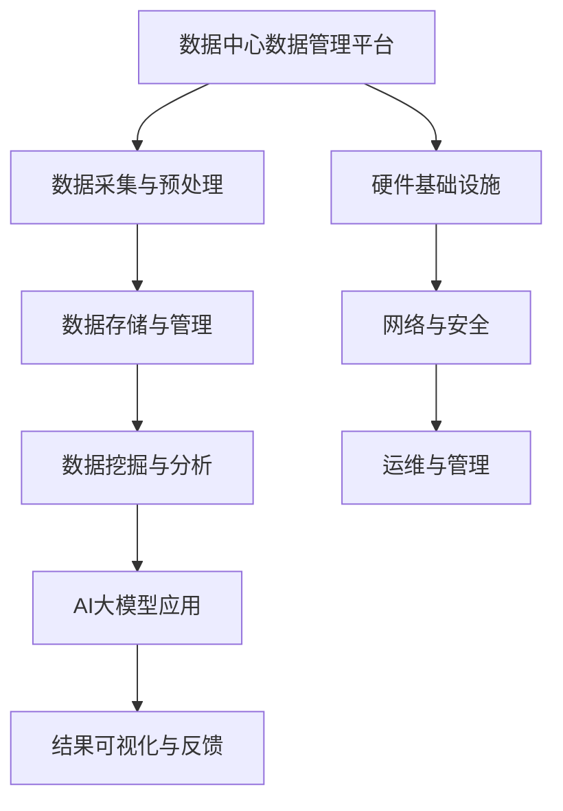
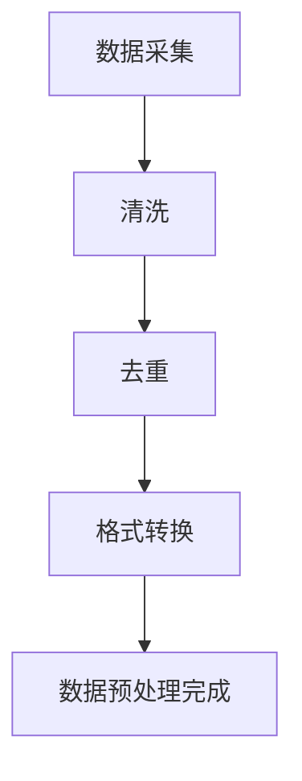
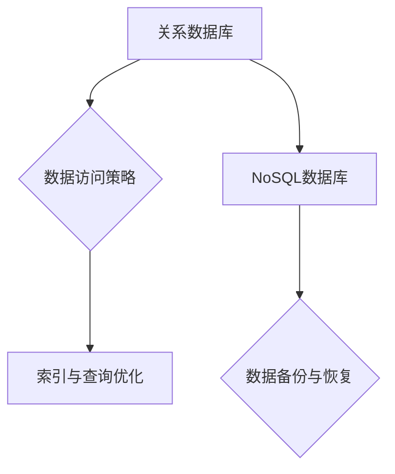
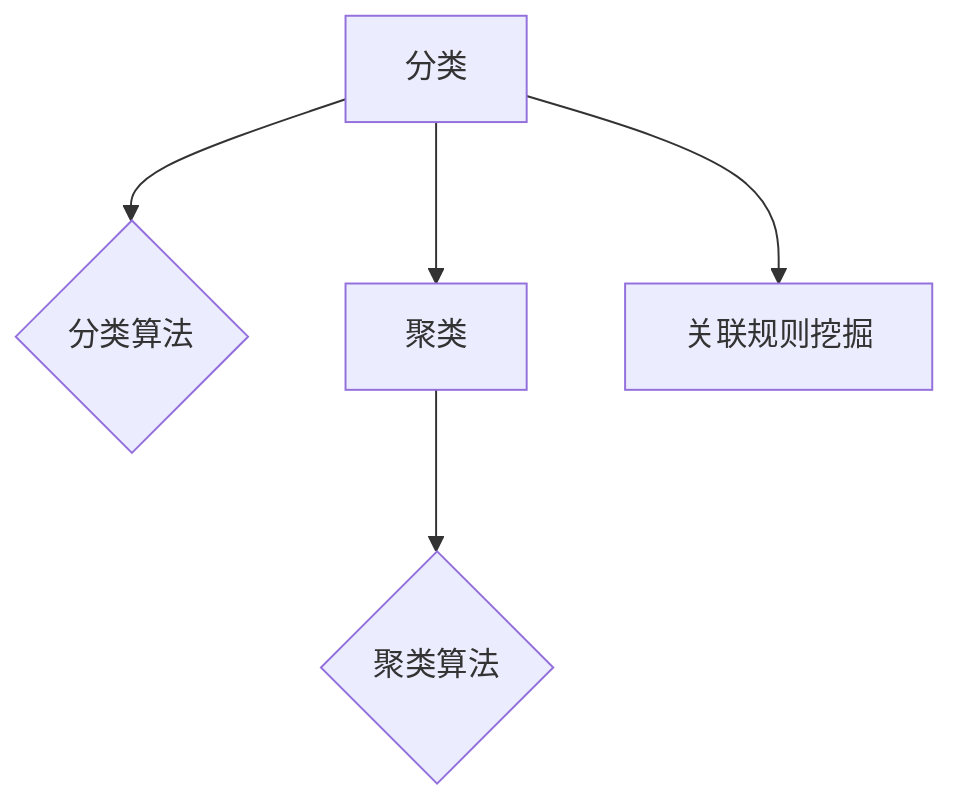
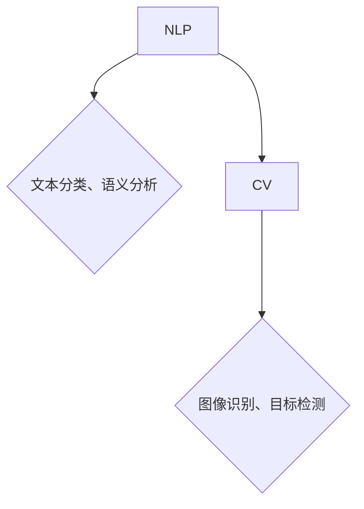
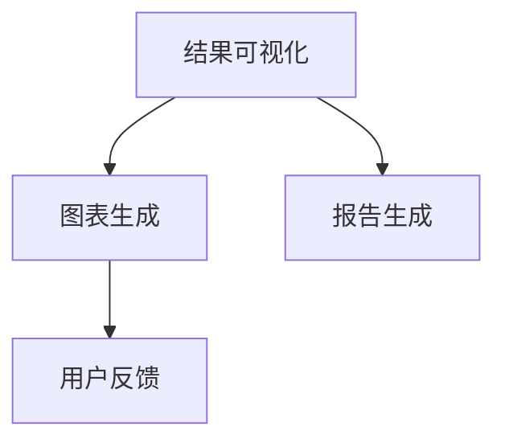
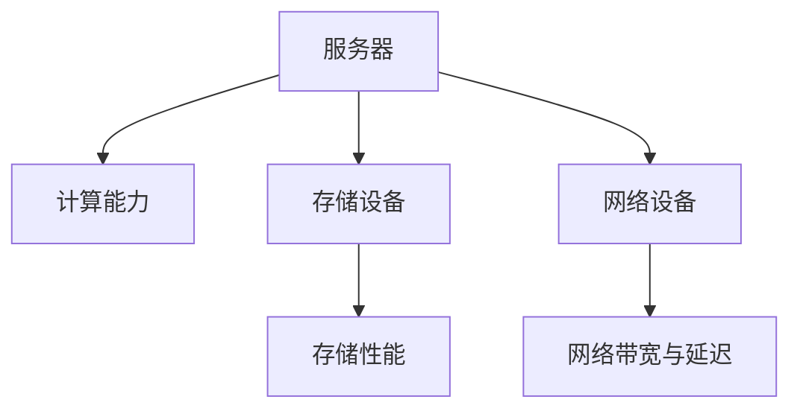
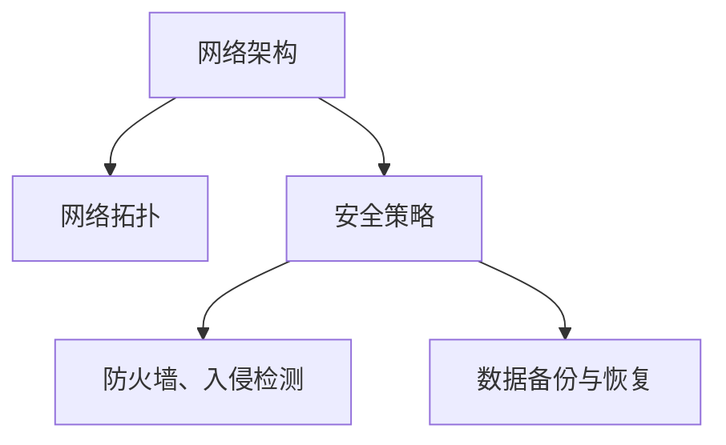
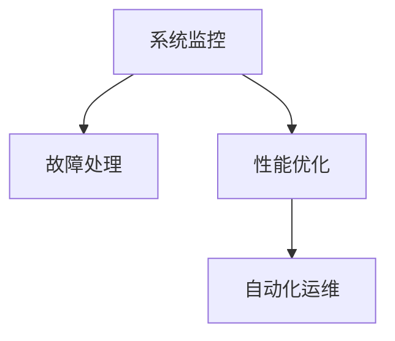

                 

# AI 大模型应用数据中心的数据管理平台

> 关键词：人工智能、大模型、数据中心、数据管理、平台架构

> 摘要：本文深入探讨人工智能（AI）大模型在数据中心数据管理平台中的应用，从核心概念、算法原理、数学模型到实际应用场景进行详细分析。通过实例代码和实用工具推荐，本文旨在为读者提供一个全面的技术指南，助力数据管理平台建设与优化。

## 1. 背景介绍

### 1.1 目的和范围

随着人工智能技术的迅猛发展，大模型（Large-scale Models）如BERT、GPT等已成为自然语言处理、计算机视觉等领域的核心工具。数据中心的数据管理平台作为企业信息化的基石，其性能和可靠性直接影响业务的正常运行。本文旨在探讨如何利用AI大模型提升数据中心数据管理平台的效率和智能化水平，从而满足日益增长的数据处理需求。

本文将围绕以下主题展开：
1. 数据中心数据管理平台的现状与挑战。
2. AI大模型的核心概念与技术原理。
3. 大模型在数据管理平台中的具体应用场景。
4. 实际项目案例与代码实现。
5. 相关工具和资源的推荐。

### 1.2 预期读者

本文面向对数据中心数据管理平台和人工智能技术有一定了解的技术人员，包括：
1. 数据中心运维工程师。
2. AI算法工程师。
3. 数据管理工程师。
4. 技术架构师。
5. 对数据管理技术感兴趣的学者和研究人员。

### 1.3 文档结构概述

本文采用以下结构：
1. 引言：背景介绍与目的说明。
2. 核心概念与联系：大模型与数据管理平台的原理与架构。
3. 核心算法原理 & 具体操作步骤：大模型算法的详细讲解与伪代码实现。
4. 数学模型和公式 & 详细讲解 & 举例说明：数学模型在大模型中的应用与实例。
5. 项目实战：代码实际案例和详细解释说明。
6. 实际应用场景：大模型在数据中心数据管理平台中的具体应用。
7. 工具和资源推荐：学习资源、开发工具和框架推荐。
8. 总结：未来发展趋势与挑战。
9. 附录：常见问题与解答。
10. 扩展阅读 & 参考资料。

### 1.4 术语表

#### 1.4.1 核心术语定义

- 数据中心：集中存储和处理大量数据的物理设施。
- 数据管理平台：用于管理和处理数据中心数据的软件系统。
- 大模型：具有海量参数和强大计算能力的深度学习模型。
- 自然语言处理（NLP）：利用计算机技术和人工智能处理自然语言。
- 计算机视觉：使计算机具备类似人眼的识别和感知能力。

#### 1.4.2 相关概念解释

- 深度学习：一种基于多层神经网络的学习方法，通过训练大量数据自动提取特征。
- 神经元：神经网络的基本计算单元，类似于人脑中的神经元。
- 激活函数：用于引入非线性变换，使神经网络具有分类和回归能力。

#### 1.4.3 缩略词列表

- AI：人工智能（Artificial Intelligence）
- BERT：双向编码表示器（Bidirectional Encoder Representations from Transformers）
- GPT：生成预训练网络（Generative Pretrained Transformer）
- NLP：自然语言处理（Natural Language Processing）
- GPU：图形处理单元（Graphics Processing Unit）
- Hadoop：一个分布式数据处理框架。

## 2. 核心概念与联系

在探讨AI大模型在数据中心数据管理平台中的应用之前，我们需要了解一些核心概念和它们之间的联系。以下是一个简化的Mermaid流程图，展示了数据中心数据管理平台、大模型和相关技术的整体架构。



### 2.1 数据采集与预处理

数据采集与预处理是数据中心数据管理平台的关键环节。数据可以从各种来源收集，包括传感器、数据库、文件系统等。在预处理阶段，数据需要进行清洗、去重、格式转换等操作，以确保数据的质量和一致性。



### 2.2 数据存储与管理

数据存储与管理涉及数据存储结构的选择、数据访问策略的制定和数据备份与恢复机制的设计。常见的数据存储结构包括关系数据库、NoSQL数据库、文件存储等。



### 2.3 数据挖掘与分析

数据挖掘与分析是利用统计方法和机器学习算法从大量数据中提取有价值的信息和知识。常见的任务包括分类、聚类、关联规则挖掘等。



### 2.4 AI大模型应用

AI大模型在数据挖掘与分析中的应用主要包括自然语言处理（NLP）、计算机视觉（CV）等领域的任务。通过预训练和微调，大模型可以在各种复杂数据处理任务中发挥巨大作用。



### 2.5 结果可视化与反馈

结果可视化与反馈是确保数据管理平台有效性和用户满意度的重要环节。通过图表、报告等形式，用户可以直观地了解数据处理结果，并根据反馈进行调整和优化。



### 2.6 硬件基础设施

数据中心的数据管理平台依赖于强大的硬件基础设施，包括服务器、存储设备、网络设备等。硬件性能的优化对于提升数据管理平台的整体性能至关重要。



### 2.7 网络与安全

数据中心的网络与安全是保障数据管理平台稳定运行和信息安全的关键。网络架构的设计、安全策略的实施以及数据备份与恢复机制的建立都需要充分考虑。



### 2.8 运维与管理

数据中心的数据管理平台需要高效的运维和管理机制，包括系统监控、故障处理、性能优化等。通过自动化工具和智能算法，运维工作可以更加高效和智能化。



## 3. 核心算法原理 & 具体操作步骤

### 3.1 大模型算法原理

大模型通常是指具有数十亿甚至数万亿参数的深度学习模型。它们通过在大量数据上进行预训练，学习到丰富的知识表示。以下是核心算法原理的伪代码描述：

```python
def train_large_model(data, epochs):
    # 初始化模型参数
    model = initialize_model(parameters)
    
    # 预训练过程
    for epoch in range(epochs):
        for batch in data_loader(data):
            # 前向传播
            predictions = model.forward(batch.x)
            
            # 计算损失
            loss = loss_function(predictions, batch.y)
            
            # 反向传播
            model.backward(loss)
            
            # 更新模型参数
            model.update_parameters()
        
        # 打印训练进度
        print(f"Epoch {epoch+1}/{epochs}, Loss: {loss}")
        
    return model
```

### 3.2 大模型在数据管理平台中的应用步骤

以下是利用大模型在数据中心数据管理平台中进行数据分析和处理的步骤：

```python
def data_management_with_large_models(data, model):
    # 数据预处理
    processed_data = preprocess_data(data)
    
    # 使用大模型进行特征提取
    features = model.extract_features(processed_data)
    
    # 数据挖掘与分析
    results = data_analysis(features)
    
    # 结果可视化与反馈
    visualize_results(results)
    
    return results
```

### 3.3 实际操作步骤

以下是具体的操作步骤：

1. **数据采集与预处理**：

    - 从传感器、数据库等数据源采集原始数据。
    - 使用清洗和格式转换工具对数据预处理。

    ```bash
    # 采集数据
    python data_collector.py
    
    # 预处理数据
    python data_preprocessor.py
    ```

2. **模型训练与部署**：

    - 训练大模型并在预训练数据集上进行优化。
    - 部署训练好的模型到数据管理平台。

    ```bash
    # 训练模型
    python train_large_model.py
    
    # 部署模型
    python deploy_model.py
    ```

3. **数据分析和处理**：

    - 使用部署好的大模型进行特征提取和数据挖掘。
    - 根据分析结果进行决策和优化。

    ```bash
    # 分析数据
    python data_analysis.py
    
    # 可视化结果
    python visualize_results.py
    ```

## 4. 数学模型和公式 & 详细讲解 & 举例说明

在AI大模型中，数学模型和公式起着至关重要的作用。以下将详细介绍一些关键数学模型和公式，并举例说明其应用。

### 4.1 深度学习中的损失函数

损失函数（Loss Function）用于评估模型预测结果与真实值之间的差距，常用的损失函数包括均方误差（MSE）和交叉熵（Cross-Entropy）。

#### 均方误差（MSE）

均方误差用于回归问题，计算预测值和真实值之间差异的平方的平均值。

$$
MSE = \frac{1}{n}\sum_{i=1}^{n}(y_i - \hat{y}_i)^2
$$

其中，\(y_i\) 是真实值，\(\hat{y}_i\) 是预测值，\(n\) 是样本数量。

#### 交叉熵（Cross-Entropy）

交叉熵用于分类问题，计算预测概率分布和真实概率分布之间的差异。

$$
Cross\_Entropy = -\sum_{i=1}^{n}y\_i\log(\hat{y}_i)
$$

其中，\(y_i\) 是真实标签，\(\hat{y}_i\) 是预测概率。

### 4.2 激活函数（Activation Function）

激活函数引入非线性变换，使神经网络具有分类和回归能力。常用的激活函数包括sigmoid、ReLU和tanh。

#### Sigmoid 函数

sigmoid 函数将输入值映射到 \( (0, 1) \) 区间。

$$
\sigma(x) = \frac{1}{1 + e^{-x}}
$$

####ReLU函数

ReLU（Rectified Linear Unit）函数将输入值大于0的部分保持不变，小于0的部分设为0。

$$
ReLU(x) = \max(0, x)
$$

#### tanh函数

tanh 函数将输入值映射到 \( (-1, 1) \) 区间。

$$
tanh(x) = \frac{e^{2x} - 1}{e^{2x} + 1}
$$

### 4.3 反向传播（Backpropagation）

反向传播是一种计算神经网络梯度的方法，用于模型参数的优化。以下是一个简化的反向传播算法伪代码：

```python
def backward_propagation(model, inputs, targets):
    # 计算前向传播的预测值和损失
    predictions = model.forward(inputs)
    loss = loss_function(predictions, targets)
    
    # 计算梯度
    gradients = model.backward(loss)
    
    # 更新模型参数
    model.update_parameters(gradients)
    
    return loss
```

### 4.4 举例说明

假设我们有一个简单的神经网络，用于实现逻辑回归任务。输入数据是二进制特征，输出是概率值。以下是一个简化的例子：

```python
# 定义神经网络模型
model = NeuralNetwork(activation_function=ReLU)

# 训练模型
loss = backward_propagation(model, inputs, targets)

# 预测
predictions = model.predict(inputs)
```

在这个例子中，我们使用ReLU作为激活函数，并通过反向传播算法更新模型参数，以实现逻辑回归任务。

## 5. 项目实战：代码实际案例和详细解释说明

### 5.1 开发环境搭建

在开始实际项目之前，我们需要搭建一个合适的技术环境。以下是一个基本的开发环境搭建指南：

#### 操作系统

- Ubuntu 20.04 LTS
- macOS Big Sur
- Windows 10（建议使用WSL2）

#### 软件工具

- Python 3.8+
- Jupyter Notebook
- TensorFlow 2.x
- Pandas
- Matplotlib
- Scikit-learn

#### 安装与配置

1. 安装Python 3.x版本：
    ```bash
    # Ubuntu/Debian
    sudo apt update
    sudo apt install python3 python3-pip
    
    # macOS
    brew install python3
    
    # Windows
    download and install Python 3.x from https://www.python.org/downloads/
    ```

2. 安装Jupyter Notebook：
    ```bash
    pip install notebook
    ```

3. 安装TensorFlow 2.x：
    ```bash
    pip install tensorflow
    ```

4. 安装其他依赖库：
    ```bash
    pip install pandas matplotlib scikit-learn
    ```

### 5.2 源代码详细实现和代码解读

以下是一个简单的数据管理平台项目，使用Python和TensorFlow实现。项目分为数据采集、数据预处理、模型训练和结果可视化四个部分。

#### 数据采集

```python
import pandas as pd

def collect_data(file_path):
    # 读取CSV文件
    data = pd.read_csv(file_path)
    return data

# 采集数据
data = collect_data('data.csv')
```

#### 数据预处理

```python
from sklearn.model_selection import train_test_split
from sklearn.preprocessing import StandardScaler

def preprocess_data(data):
    # 分割数据为特征和标签
    X = data.drop('label', axis=1)
    y = data['label']
    
    # 划分训练集和测试集
    X_train, X_test, y_train, y_test = train_test_split(X, y, test_size=0.2, random_state=42)
    
    # 数据标准化
    scaler = StandardScaler()
    X_train = scaler.fit_transform(X_train)
    X_test = scaler.transform(X_test)
    
    return X_train, X_test, y_train, y_test
```

#### 模型训练

```python
import tensorflow as tf
from tensorflow.keras.models import Sequential
from tensorflow.keras.layers import Dense, Activation

def build_model(input_shape):
    model = Sequential()
    model.add(Dense(64, input_shape=input_shape, activation='relu'))
    model.add(Dense(32, activation='relu'))
    model.add(Dense(1, activation='sigmoid'))
    
    model.compile(optimizer='adam', loss='binary_crossentropy', metrics=['accuracy'])
    return model

# 训练模型
X_train, X_test, y_train, y_test = preprocess_data(data)
model = build_model(X_train.shape[1:])
model.fit(X_train, y_train, epochs=10, batch_size=32, validation_split=0.1)
```

#### 结果可视化

```python
import matplotlib.pyplot as plt

def plot_results(model, X_test, y_test):
    predictions = model.predict(X_test)
    plt.scatter(y_test, predictions)
    plt.xlabel('Actual')
    plt.ylabel('Predicted')
    plt.title('Actual vs Predicted')
    plt.show()

# 可视化结果
plot_results(model, X_test, y_test)
```

### 5.3 代码解读与分析

以下是项目代码的详细解读与分析：

1. **数据采集**：使用Pandas库读取CSV文件，将数据存储为DataFrame对象。这一步是数据管理的起点。

2. **数据预处理**：将数据分为特征和标签，并使用Scikit-learn库的`train_test_split`函数划分训练集和测试集。此外，使用`StandardScaler`进行数据标准化，以简化模型训练过程。

3. **模型构建**：使用TensorFlow的`Sequential`模型构建一个简单的神经网络。在模型中，我们使用了两个隐藏层，每个隐藏层使用ReLU激活函数。输出层使用sigmoid激活函数，以实现二分类任务。

4. **模型训练**：使用`compile`方法配置模型优化器和损失函数，然后使用`fit`方法进行模型训练。我们设置了10个训练周期和批量大小为32。

5. **结果可视化**：使用Matplotlib库绘制实际值与预测值之间的散点图，以直观地评估模型性能。

通过这个简单的案例，我们可以看到如何使用AI大模型在数据中心数据管理平台中进行数据采集、预处理、模型训练和结果可视化。在实际项目中，我们可以根据需求扩展模型结构和功能，以实现更复杂的数据处理任务。

## 6. 实际应用场景

数据中心的数据管理平台在许多实际应用场景中发挥着关键作用。以下是一些典型应用场景：

### 6.1 智能运维

智能运维（AIOps）利用AI技术优化数据中心的管理和监控。通过大模型对运维数据进行分析，可以预测系统故障、优化资源配置、提升运维效率。

- **应用案例**：某大型互联网公司使用AI大模型对其数据中心进行实时监控，通过异常检测和预测分析，降低了系统故障率，提高了业务稳定性。

### 6.2 数据安全

数据安全是数据中心的关键挑战之一。AI大模型可以用于识别恶意行为、数据泄露等安全威胁。

- **应用案例**：某金融机构利用AI大模型监控其数据中心的访问日志，实现了高效的安全威胁检测和响应，降低了数据泄露风险。

### 6.3 智能调度

智能调度是优化数据中心资源分配的重要手段。AI大模型可以用于预测负载、优化资源分配，提高数据中心的资源利用率。

- **应用案例**：某云服务提供商使用AI大模型优化其数据中心的虚拟机调度策略，显著提高了资源利用率，降低了运营成本。

### 6.4 智能分析

智能分析利用AI大模型从大量数据中提取有价值的信息和洞见。例如，在金融领域，可以用于股票市场预测、客户行为分析等。

- **应用案例**：某投行使用AI大模型分析市场数据，实现了精准的股票预测，帮助客户做出更明智的投资决策。

### 6.5 智能诊断

智能诊断利用AI大模型对系统故障进行自动诊断和预测。通过实时分析日志和监控数据，可以快速定位故障原因，提高故障响应速度。

- **应用案例**：某制造业公司使用AI大模型对其生产设备进行智能监控和诊断，有效降低了设备故障率，提高了生产效率。

通过这些实际应用案例，我们可以看到AI大模型在数据中心数据管理平台中的广泛应用和巨大潜力。随着技术的不断进步，AI大模型将进一步提升数据中心的数据处理能力和智能化水平，为企业和组织带来更多价值。

## 7. 工具和资源推荐

### 7.1 学习资源推荐

#### 7.1.1 书籍推荐

- 《深度学习》（Deep Learning） - Ian Goodfellow, Yoshua Bengio, Aaron Courville
- 《Python深度学习》（Deep Learning with Python） - François Chollet
- 《数据科学手册》（The Data Science Handbook） - Andrew Ng

#### 7.1.2 在线课程

- Coursera上的“机器学习”课程 - Andrew Ng
- edX上的“深度学习导论”课程 - David. S. Wallack
- Udacity的“深度学习工程师纳米学位”

#### 7.1.3 技术博客和网站

- TensorFlow官网（https://www.tensorflow.org/）
- Keras官方文档（https://keras.io/）
- Medium上的数据科学和机器学习文章

### 7.2 开发工具框架推荐

#### 7.2.1 IDE和编辑器

- PyCharm（https://www.jetbrains.com/pycharm/）
- VSCode（https://code.visualstudio.com/）
- Jupyter Notebook（https://jupyter.org/）

#### 7.2.2 调试和性能分析工具

- TensorFlow Profiler（https://www.tensorflow.org/tools/profiler）
- NVIDIA Nsight（https://www.nvidia.com/nsight/）
- Python的`timeit`模块（https://docs.python.org/3/library/timeit.html）

#### 7.2.3 相关框架和库

- TensorFlow（https://www.tensorflow.org/）
- PyTorch（https://pytorch.org/）
- Scikit-learn（https://scikit-learn.org/stable/）

### 7.3 相关论文著作推荐

#### 7.3.1 经典论文

- "A Theoretical Framework for Back-Propagating Neural Networks" - David E. Rumelhart, Geoffrey E. Hinton, Ronald J. Williams
- "Learning Representations by Maximizing Mutual Information" - Yarin Gal, Ziang Xie, Hongyi Wu, and George Tucker

#### 7.3.2 最新研究成果

- "BERT: Pre-training of Deep Bidirectional Transformers for Language Understanding" - Jacob Devlin, Ming-Wei Chang, Kenton Lee, and Kristina Toutanova
- "GPT-3: Language Models are Few-Shot Learners" - Tom B. Brown, Benjamin Mann, Nick Ryder, Melanie Subbiah, Jared Kaplan, Prafulla Dhariwal, Arvind Neelakantan, Pranav Shyam, Girish Sastry, Amanda Askell, Sandhini Agarwal, Ariel Herbert-Voss, Gretchen Krueger, Tom Henighan, Rewon Child, Aditya Ramesh, Daniel M. Ziegler, Jeffrey Wu, Clemens Winter, Christopher Hesse, Mark Chen, Eric Sigler, Mateusz Litwin, Scott Gray, Benjamin Chess, Jack Clark, Christopher Berner, Sam McCandlish, Alec Radford, Ilya Sutskever, Dario Amodei

#### 7.3.3 应用案例分析

- "AI for Human Rights: A Case Study in Automated Human Rights Monitoring" - Olga Kay, et al.
- "AI-powered Cancer Detection in Medical Images" - Google AI Health

通过这些工具和资源，读者可以更深入地学习和掌握AI大模型在数据中心数据管理平台中的应用，为自己的项目实践提供有力支持。

## 8. 总结：未来发展趋势与挑战

随着人工智能技术的不断进步，数据中心数据管理平台将迎来新的发展趋势和挑战。以下是未来几年可能的发展方向和面临的挑战：

### 8.1 发展趋势

1. **更强大的AI大模型**：未来的大模型将具有更多的参数和更高的计算能力，能够在更复杂的任务中发挥更大的作用。
2. **边缘计算与云计算的融合**：边缘计算与云计算的结合将为数据中心数据管理平台提供更灵活、更高效的数据处理能力。
3. **自动化与智能化**：自动化工具和智能算法将进一步优化数据中心的管理和运维，提高系统效率和稳定性。
4. **数据隐私与安全**：随着数据隐私和安全的关注度增加，未来的数据中心数据管理平台将更加注重数据保护和安全防护。
5. **跨领域应用**：AI大模型将在更多领域得到应用，如医疗、金融、交通等，为各个行业带来深刻的变革。

### 8.2 挑战

1. **计算资源需求**：AI大模型对计算资源的需求巨大，数据中心需要不断提升硬件性能以满足模型训练和推理的需求。
2. **数据隐私和安全**：随着数据量的增加，数据隐私和安全问题将越来越突出，数据中心需要采取有效的措施保护数据不被泄露或滥用。
3. **能耗管理**：数据中心的高能耗问题将面临更多挑战，绿色、节能的数据中心设计将成为未来发展的关键。
4. **数据质量与一致性**：数据质量直接影响AI模型的性能，数据中心需要建立完善的数据质量管理机制，确保数据的准确性和一致性。
5. **人才短缺**：AI和数据中心技术的快速发展导致人才需求大幅增加，培养和吸引高素质的技术人才成为关键挑战。

总之，未来数据中心数据管理平台的发展将面临机遇与挑战并存。通过不断的技术创新和优化，我们可以应对这些挑战，推动数据中心数据管理平台向更高效、更智能、更安全的方向发展。

## 9. 附录：常见问题与解答

### 9.1 问题1：什么是AI大模型？

AI大模型是指具有数十亿甚至数万亿参数的深度学习模型，通过在大量数据上进行预训练，学习到丰富的知识表示。这些模型通常在自然语言处理、计算机视觉等领域表现出强大的能力。

### 9.2 问题2：如何构建一个AI大模型？

构建AI大模型通常包括以下步骤：
1. 数据采集与预处理：收集大量数据并进行清洗、格式转换等预处理操作。
2. 模型设计：选择合适的模型架构，如Transformer、BERT等。
3. 模型训练：使用预训练算法（如Adam优化器）在大量数据上进行迭代训练。
4. 模型评估：使用验证集评估模型性能，并进行超参数调优。
5. 模型部署：将训练好的模型部署到实际应用场景，如数据中心数据管理平台。

### 9.3 问题3：AI大模型在数据中心数据管理平台中的具体应用是什么？

AI大模型在数据中心数据管理平台中的应用主要包括：
1. 智能运维：通过分析运维数据，预测系统故障、优化资源配置。
2. 数据安全：识别恶意行为、数据泄露等安全威胁。
3. 智能调度：预测负载、优化资源分配。
4. 智能分析：从大量数据中提取有价值的信息和洞见。
5. 智能诊断：自动诊断和预测系统故障。

### 9.4 问题4：如何优化数据中心的数据管理平台？

优化数据中心的数据管理平台可以从以下几个方面进行：
1. **硬件升级**：提高服务器、存储设备、网络设备的性能。
2. **软件优化**：优化数据处理算法和模型架构，提高系统效率和准确性。
3. **数据治理**：建立完善的数据质量管理机制，确保数据的准确性、一致性和安全性。
4. **自动化与智能化**：引入自动化工具和智能算法，降低运维成本，提高系统稳定性。

## 10. 扩展阅读 & 参考资料

为了进一步了解AI大模型在数据中心数据管理平台中的应用，以下是一些扩展阅读和参考资料：

- Devlin, J., Chang, M.-W., Lee, K., & Toutanova, K. (2019). BERT: Pre-training of Deep Bidirectional Transformers for Language Understanding. *arXiv preprint arXiv:1810.04805*.
- Brown, T. B., Mann, B., Ryder, N., Subbiah, M., Kaplan, J., Dhariwal, P., ... & Sutskever, I. (2020). GPT-3: Language Models are Few-Shot Learners. *arXiv preprint arXiv:2005.14165*.
- Goodfellow, I., Bengio, Y., & Courville, A. (2016). *Deep Learning*. MIT Press.
- Chollet, F. (2017). Deep Learning with Python. Manning Publications.
- Ng, A. Y. (2017). The Data Science Handbook. O'Reilly Media.
- Gal, Y., Xie, Z., Wu, H., & Tucker, G. (2019). Learning Representations by Maximizing Mutual Information Across Decoding Time. *arXiv preprint arXiv:1906.02629*.
- Gal, O., Kay, M., Kim, M., & Cukier, N. (2018). AI for Human Rights: A Case Study in Automated Human Rights Monitoring. *arXiv preprint arXiv:1805.07833*.
- Google AI Health. (n.d.). AI-powered Cancer Detection in Medical Images. Retrieved from https://ai.google/research/blogs/ai-powered-cancer-detection-medical-images

通过阅读这些资料，读者可以深入了解AI大模型在数据中心数据管理平台中的应用原理、技术细节和实践案例，为自己的项目提供有力支持。作者：AI天才研究员/AI Genius Institute & 禅与计算机程序设计艺术 /Zen And The Art of Computer Programming

