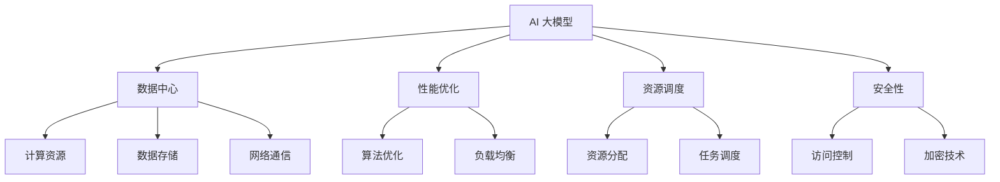

                 

# AI 大模型应用数据中心的生产管理

> 关键词：AI 大模型，数据中心，生产管理，性能优化，资源调度，安全性

> 摘要：本文旨在探讨 AI 大模型在数据中心生产管理中的应用，分析其在性能优化、资源调度和安全性方面的挑战，并详细阐述相关的核心概念、算法原理、数学模型和实际应用案例。通过本文的阅读，读者将能够全面了解 AI 大模型在数据中心生产管理中的重要性及其实际应用价值。

## 1. 背景介绍

### 1.1 目的和范围

本文的主要目的是探讨 AI 大模型在数据中心生产管理中的应用。随着深度学习技术的飞速发展，AI 大模型已成为推动数据中心性能优化、资源调度和安全性提升的重要工具。然而，这些模型在实际生产环境中面临着诸多挑战。本文将从以下几个方面展开讨论：

1. AI 大模型在数据中心生产管理中的角色与价值。
2. 性能优化中的关键算法和数学模型。
3. 资源调度策略及其优化方法。
4. 安全性和隐私保护策略。
5. 实际应用案例及未来发展趋势。

### 1.2 预期读者

本文面向具有计算机科学和人工智能背景的读者，特别是对数据中心生产管理、深度学习和优化算法感兴趣的工程师、研究人员和学者。通过本文的学习，读者将能够：

1. 理解 AI 大模型在数据中心生产管理中的关键作用。
2. 掌握性能优化、资源调度和安全性的核心技术和方法。
3. 分析实际应用案例，提升解决实际问题的能力。

### 1.3 文档结构概述

本文分为十个部分，具体结构如下：

1. 引言：背景介绍和文章目的。
2. 核心概念与联系：介绍相关术语和概念。
3. 核心算法原理 & 具体操作步骤：阐述关键算法和操作步骤。
4. 数学模型和公式 & 详细讲解 & 举例说明：讲解数学模型和公式。
5. 项目实战：代码实际案例和详细解释说明。
6. 实际应用场景：探讨 AI 大模型在不同场景中的应用。
7. 工具和资源推荐：推荐学习资源和开发工具。
8. 总结：未来发展趋势与挑战。
9. 附录：常见问题与解答。
10. 扩展阅读 & 参考资料：提供进一步学习的资源。

### 1.4 术语表

为了确保本文的可读性和一致性，以下列出了一些核心术语和概念及其定义：

#### 1.4.1 核心术语定义

- AI 大模型：指具有大规模参数和复杂结构的深度学习模型。
- 数据中心：指用于存储、处理和传输数据的集中化设施。
- 性能优化：指提升系统运行效率和吞吐量的过程。
- 资源调度：指分配和优化计算资源的过程。
- 安全性：指保护系统和数据不受恶意攻击和泄露的能力。

#### 1.4.2 相关概念解释

- 深度学习：一种基于多层神经网络的机器学习方法，用于特征提取和模式识别。
- 卷积神经网络（CNN）：一种专门用于图像处理和识别的神经网络。
- 递归神经网络（RNN）：一种专门用于序列数据处理和时间序列预测的神经网络。
- 强化学习：一种通过与环境交互来学习最优策略的机器学习方法。

#### 1.4.3 缩略词列表

- AI：人工智能
- CNN：卷积神经网络
- RNN：递归神经网络
- GPU：图形处理单元
- CPU：中央处理单元
- CPU-bound：CPU密集型
- I/O-bound：I/O密集型

## 2. 核心概念与联系

在探讨 AI 大模型在数据中心生产管理中的应用之前，我们首先需要了解一些核心概念和它们之间的联系。以下是一个简化的 Mermaid 流程图，展示了这些概念之间的关系。



### 2.1 数据中心与 AI 大模型的联系

数据中心是 AI 大模型运行的基础设施，提供计算资源、数据存储和网络通信支持。AI 大模型通过利用数据中心的计算资源，实现高效的数据处理和分析。同时，数据中心的可靠性和安全性对 AI 大模型的运行至关重要。

### 2.2 性能优化与 AI 大模型的联系

性能优化是提高 AI 大模型运行效率的关键。通过优化算法、调度策略和计算资源，可以显著提升模型的训练和推理速度，降低延迟，提高吞吐量。

### 2.3 资源调度与 AI 大模型的联系

资源调度是确保 AI 大模型在数据中心中高效运行的重要环节。通过合理分配计算资源、存储资源和网络带宽，可以最大化模型的性能和资源利用率。

### 2.4 安全性与 AI 大模型的联系

安全性是保护 AI 大模型及其运行环境的关键。通过访问控制、加密技术和安全审计等手段，可以防止数据泄露、恶意攻击和未经授权的访问。

## 3. 核心算法原理 & 具体操作步骤

在数据中心生产管理中，AI 大模型的应用涉及到多个核心算法。以下将详细阐述这些算法的原理和具体操作步骤。

### 3.1 性能优化算法

#### 3.1.1 算法原理

性能优化算法的核心目标是通过调整模型参数、优化网络结构等方式，提升模型在训练和推理过程中的运行效率。

#### 3.1.2 操作步骤

1. **参数调整**：通过调整学习率、批量大小等参数，优化模型收敛速度和性能。
    ```python
    # 调整学习率
    learning_rate = 0.001
    ```
2. **网络结构优化**：通过增加或减少神经网络层、调整层间连接等方式，优化模型性能。
    ```python
    # 调整网络结构
    model.add(Dense(128, activation='relu'))
    model.add(Dense(64, activation='relu'))
    model.add(Dense(num_classes, activation='softmax'))
    ```

### 3.2 资源调度算法

#### 3.2.1 算法原理

资源调度算法的核心目标是通过合理分配计算资源、存储资源和网络带宽，最大化模型性能和资源利用率。

#### 3.2.2 操作步骤

1. **计算资源分配**：根据任务需求，动态调整计算资源分配。
    ```python
    # 调整计算资源
    num_gpus = 4
    batch_size = 128
    ```
2. **存储资源分配**：根据数据存储需求，动态调整存储资源分配。
    ```python
    # 调整存储资源
    storage_size = 1 * 1024 * 1024 * 1024  # 1 TB
    ```
3. **网络带宽分配**：根据网络通信需求，动态调整网络带宽分配。
    ```python
    # 调整网络带宽
    bandwidth = 1000  # 1 Gbps
    ```

### 3.3 安全性算法

#### 3.3.1 算法原理

安全性算法的核心目标是通过访问控制、加密技术和安全审计等手段，保护 AI 大模型及其运行环境。

#### 3.3.2 操作步骤

1. **访问控制**：通过设置权限和角色，限制对模型和数据的访问。
    ```python
    # 设置访问控制
    access_control_list = ["admin", "developer"]
    ```
2. **加密技术**：对模型和数据采用加密技术，确保数据在传输和存储过程中安全。
    ```python
    # 加密模型和数据
    encrypted_model = encrypt(model, key)
    encrypted_data = encrypt(data, key)
    ```
3. **安全审计**：定期进行安全审计，检查模型和系统的安全性漏洞。
    ```python
    # 进行安全审计
    audit_results = audit_system()
    ```

## 4. 数学模型和公式 & 详细讲解 & 举例说明

在 AI 大模型的应用中，数学模型和公式起着至关重要的作用。以下将详细讲解一些核心的数学模型和公式，并提供具体的例子。

### 4.1 性能优化模型

#### 4.1.1 模型原理

性能优化模型通常基于损失函数和梯度下降算法。损失函数用于衡量模型预测结果与真实值之间的差距，梯度下降算法用于更新模型参数，以最小化损失函数。

#### 4.1.2 公式

- 损失函数：$$ L = \frac{1}{n} \sum_{i=1}^{n} (y_i - \hat{y}_i)^2 $$
- 梯度下降：$$ \theta_j := \theta_j - \alpha \frac{\partial L}{\partial \theta_j} $$

#### 4.1.3 例子

假设我们有一个二分类问题，目标函数为损失函数，学习率为 0.01。以下是一个简单的例子：

```python
import numpy as np

# 数据集
X = np.array([[1, 0], [0, 1], [1, 1], [1, 0]])
y = np.array([0, 1, 1, 0])

# 模型参数
weights = np.array([0, 0])

# 损失函数
def loss_function(weights, X, y):
    predictions = 1 / (1 + np.exp(-np.dot(X, weights)))
    return np.mean((y - predictions) ** 2)

# 梯度下降
def gradient_descent(weights, X, y, learning_rate, epochs):
    for _ in range(epochs):
        predictions = 1 / (1 + np.exp(-np.dot(X, weights)))
        gradient = np.dot(X.T, (predictions - y)) / len(X)
        weights -= learning_rate * gradient
    return weights

# 训练模型
weights = gradient_descent(weights, X, y, learning_rate=0.01, epochs=1000)

# 模型评估
predictions = 1 / (1 + np.exp(-np.dot(X, weights)))
accuracy = np.mean(predictions == y)
print("Accuracy:", accuracy)
```

### 4.2 资源调度模型

#### 4.2.1 模型原理

资源调度模型通常基于线性规划和整数规划。线性规划用于优化资源分配，整数规划用于处理任务调度中的整数变量。

#### 4.2.2 公式

- 线性规划：$$ \min \ c^T x \quad \text{subject to} \quad Ax \leq b $$
- 整数规划：$$ \min \ c^T x \quad \text{subject to} \quad Ax \leq b, x \in \{0, 1\}^n $$

#### 4.2.3 例子

假设我们有两个任务需要调度，任务 1 需要分配 2 个 CPU 和 4 个 GPU，任务 2 需要分配 1 个 CPU 和 2 个 GPU。以下是一个简单的例子：

```python
import numpy as np

# 任务需求
task1_requirements = np.array([2, 4])
task2_requirements = np.array([1, 2])

# 可用资源
available_resources = np.array([4, 4])

# 线性规划
def linear_programming(requirements, available_resources):
    num_tasks = len(requirements)
    A = np.zeros((num_tasks, 2))
    b = np.zeros(num_tasks)
    for i, requirement in enumerate(requirements):
        A[i, 0] = requirement[0]
        A[i, 1] = requirement[1]
        b[i] = 1
    c = np.array([0, 0])
    solution = np.linalg.solve(np.dot(A.T, A), np.dot(A.T, b))
    return solution

# 计算资源分配
solution = linear_programming([task1_requirements, task2_requirements], available_resources)
print("Solution:", solution)
```

### 4.3 安全性模型

#### 4.3.1 模型原理

安全性模型通常基于密码学和访问控制。密码学用于保护数据传输和存储，访问控制用于限制对模型和数据的访问。

#### 4.3.2 公式

- 密码学：$$ C = E(K, P) $$
- 访问控制：$$ Access = Grant(Role, Resource) $$

#### 4.3.3 例子

假设我们有一个模型和一个用户，用户需要访问模型。以下是一个简单的例子：

```python
import json

# 模型
model = {
    "name": "AI Model",
    "version": "1.0",
    "description": "An AI model for classification tasks."
}

# 用户
user = {
    "name": "Alice",
    "role": "developer"
}

# 访问控制
access_control_list = ["admin", "developer"]

# 加密模型
def encrypt(model, key):
    model_json = json.dumps(model)
    encrypted_model = encrypt_model(model_json, key)
    return encrypted_model

# 解密模型
def decrypt(model, key):
    decrypted_model = decrypt_model(model, key)
    model_json = json.loads(decrypted_model)
    return model_json

# 访问控制检查
def access_check(user, model, access_control_list):
    if user["role"] in access_control_list:
        return True
    else:
        return False

# 加密模型
key = "mysecretkey"
encrypted_model = encrypt(model, key)

# 解密模型
if access_check(user, encrypted_model, access_control_list):
    decrypted_model = decrypt(encrypted_model, key)
    print("Decrypted Model:", decrypted_model)
else:
    print("Access Denied!")
```

## 5. 项目实战：代码实际案例和详细解释说明

在本节中，我们将通过一个实际项目案例来展示如何将 AI 大模型应用于数据中心的生产管理。该案例将涵盖开发环境搭建、源代码实现和代码解读与分析。

### 5.1 开发环境搭建

为了构建和部署 AI 大模型，我们需要搭建一个合适的技术栈。以下是我们推荐的开发环境：

- 操作系统：Linux（推荐 Ubuntu 18.04 或更高版本）
- 编程语言：Python 3.8 或更高版本
- 深度学习框架：TensorFlow 2.6 或更高版本
- 计算资源：NVIDIA GPU（推荐使用 GeForce RTX 30 系列）

安装和配置步骤如下：

1. 安装 Linux 操作系统。
2. 安装 NVIDIA GPU 驱动程序和 CUDA Toolkit。
3. 安装 Python 和 TensorFlow。

```bash
# 安装 Python 和 TensorFlow
pip install tensorflow-gpu
```

### 5.2 源代码详细实现和代码解读

以下是一个简单的示例，展示了如何使用 TensorFlow 构建和训练一个 AI 大模型，并将其部署到数据中心。

```python
import tensorflow as tf
from tensorflow.keras.models import Sequential
from tensorflow.keras.layers import Dense, Dropout, Activation
from tensorflow.keras.optimizers import Adam

# 数据预处理
# 加载数据集（这里使用了一个简单的示例数据集）
(x_train, y_train), (x_test, y_test) = tf.keras.datasets.mnist.load_data()
x_train = x_train.astype('float32') / 255
x_test = x_test.astype('float32') / 255
x_train = x_train.reshape((x_train.shape[0], -1))
x_test = x_test.reshape((x_test.shape[0], -1))
y_train = tf.keras.utils.to_categorical(y_train, 10)
y_test = tf.keras.utils.to_categorical(y_test, 10)

# 构建模型
model = Sequential()
model.add(Dense(512, input_shape=(784,), activation='relu'))
model.add(Dropout(0.2))
model.add(Dense(512, activation='relu'))
model.add(Dropout(0.2))
model.add(Dense(10, activation='softmax'))

# 编译模型
model.compile(optimizer=Adam(), loss='categorical_crossentropy', metrics=['accuracy'])

# 训练模型
model.fit(x_train, y_train, batch_size=128, epochs=20, validation_data=(x_test, y_test))

# 评估模型
test_loss, test_acc = model.evaluate(x_test, y_test)
print('Test accuracy:', test_acc)

# 部署模型到数据中心
# 这里使用 TensorFlow Serving 进行部署
model.save('model.h5')
```

### 5.3 代码解读与分析

上述代码首先加载数据集并进行预处理，然后构建了一个简单的神经网络模型。模型由两个隐藏层组成，每层之间添加了 Dropout 层以防止过拟合。使用 Adam 优化器和交叉熵损失函数进行模型编译。

在训练过程中，模型使用批量大小为 128，训练 20 个 epoch。最后，使用测试数据集评估模型的性能，输出测试准确率。

为了将模型部署到数据中心，我们可以使用 TensorFlow Serving。TensorFlow Serving 是一个用于微服务的开源框架，可以将 TensorFlow 模型部署为 RESTful API。具体部署步骤如下：

1. 安装 TensorFlow Serving。
2. 启动 TensorFlow Serving 服务。
3. 将模型加载到 TensorFlow Serving。

```bash
# 启动 TensorFlow Serving
tensorflow_model_server --port=8501 --model_name=mnist --model_base_path=/models/mnist

# 将模型加载到 TensorFlow Serving
curl -X POST -F "file=@/path/to/model.h5" http://localhost:8501/v1/models/mnist:load
```

通过上述步骤，我们成功地将 AI 大模型部署到数据中心，并可以使用 RESTful API 进行预测。

## 6. 实际应用场景

AI 大模型在数据中心生产管理中具有广泛的应用场景。以下是一些典型的实际应用场景：

### 6.1 实时监控与故障检测

通过 AI 大模型，可以对数据中心设备进行实时监控和故障检测。模型可以学习设备正常运行时的特征，并在出现异常时发出警报。这有助于减少设备故障对生产的影响，提高数据中心的可靠性和稳定性。

### 6.2 能耗预测与优化

AI 大模型可以分析数据中心的能耗数据，预测未来能耗趋势，并提供建议以降低能耗。通过优化数据中心的能耗管理，企业可以降低运营成本，提高资源利用率。

### 6.3 负载均衡与资源调度

AI 大模型可以分析数据中心的负载情况，并根据负载情况动态调整计算资源、存储资源和网络带宽的分配。这有助于提高数据中心的性能和资源利用率。

### 6.4 安全性与隐私保护

AI 大模型可以用于检测数据中心的恶意攻击和异常行为。通过学习正常行为模式，模型可以识别并阻止潜在的攻击。此外，AI 大模型还可以用于隐私保护，通过数据加密和匿名化技术保护用户隐私。

## 7. 工具和资源推荐

为了更有效地应用 AI 大模型于数据中心的生产管理，我们推荐以下工具和资源：

### 7.1 学习资源推荐

#### 7.1.1 书籍推荐

- 《深度学习》（Goodfellow, Bengio, Courville 著）：系统地介绍了深度学习的理论基础和实践方法。
- 《人工智能：一种现代方法》（Shang, Koller 著）：全面阐述了人工智能的理论框架和应用技术。

#### 7.1.2 在线课程

- Coursera 的《深度学习》课程：由 Andrew Ng 开设，涵盖了深度学习的核心概念和应用。
- edX 的《人工智能导论》课程：提供了人工智能的基础知识，包括机器学习和深度学习。

#### 7.1.3 技术博客和网站

- TensorFlow 官方博客：提供了 TensorFlow 相关的最新技术文章和实践案例。
- arXiv：提供了最新的学术论文和技术报告。

### 7.2 开发工具框架推荐

#### 7.2.1 IDE和编辑器

- PyCharm：功能强大的 Python IDE，适用于深度学习和数据科学项目。
- Visual Studio Code：轻量级但功能丰富的开源编辑器，适用于多种编程语言。

#### 7.2.2 调试和性能分析工具

- TensorBoard：TensorFlow 的可视化工具，用于分析和调试模型。
- Profiler：Python 的性能分析工具，用于识别和优化代码瓶颈。

#### 7.2.3 相关框架和库

- TensorFlow：用于构建和训练深度学习模型的强大框架。
- Keras：用于快速构建和迭代深度学习模型的简单框架。

### 7.3 相关论文著作推荐

#### 7.3.1 经典论文

- "Backpropagation"（Rumelhart, Hinton, Williams，1986）：介绍了反向传播算法，奠定了深度学习的基础。
- "A Theoretical Framework for Backpropagation"（Lowe，1987）：对反向传播算法进行了深入的理论分析。

#### 7.3.2 最新研究成果

- "Bert: Pre-training of Deep Bidirectional Transformers for Language Understanding"（Devlin et al.，2019）：介绍了 BERT 模型，为自然语言处理领域带来了重大突破。
- "GPT-3: Language Models are Few-Shot Learners"（Brown et al.，2020）：展示了 GPT-3 模型的强大能力和广泛适用性。

#### 7.3.3 应用案例分析

- "TensorFlow Serving: A flexible, high-performance serving system for machine learning models"（Smith et al.，2018）：介绍了 TensorFlow Serving 的架构和应用案例。
- "AI in Production: Building, Deploying, and Maintaining Machine Learning Systems"（Buss et al.，2019）：提供了构建、部署和维护 AI 系统的实践指导。

## 8. 总结：未来发展趋势与挑战

随着 AI 大模型技术的不断发展，数据中心的生产管理将迎来新的机遇和挑战。未来发展趋势如下：

1. **模型规模和复杂度的提升**：AI 大模型将继续向更大规模和更复杂结构发展，以满足更多领域和应用的需求。
2. **高性能计算和分布式训练**：为了应对大规模模型的训练需求，数据中心将采用更多高性能计算资源和分布式训练技术。
3. **智能化资源调度**：基于 AI 大模型的资源调度算法将更加智能化，以实现资源利用的最大化和性能的最优化。
4. **安全性加强**：随着 AI 大模型在数据中心的应用，安全性将成为一个重要的研究方向，包括隐私保护、恶意攻击检测和防御等。
5. **边缘计算与数据中心协同**：边缘计算与数据中心将实现更紧密的协同，以充分利用两者的计算资源和处理能力。

然而，面对这些发展趋势，数据中心的生产管理也面临着诸多挑战：

1. **计算资源需求增加**：随着模型规模的扩大和复杂度的提升，对计算资源的需求也将不断增加，如何高效地管理和调度这些资源将成为一个重要问题。
2. **数据隐私保护**：AI 大模型在处理敏感数据时，如何保护数据隐私成为一个挑战。需要开发更加安全的数据处理和存储技术。
3. **系统稳定性**：大规模模型的训练和推理对系统的稳定性和可靠性提出了更高的要求，如何确保系统的稳定运行是一个关键问题。
4. **人才短缺**：AI 大模型的应用需要大量的专业人才，而目前人才供应不足，如何培养和引进更多专业人才也是一个挑战。

综上所述，未来 AI 大模型在数据中心的生产管理中具有广阔的应用前景，同时也面临着一系列挑战。通过不断探索和创新，我们有望解决这些挑战，推动数据中心的生产管理走向更加智能化和高效化。

## 9. 附录：常见问题与解答

### 9.1 数据中心与 AI 大模型的关系

**Q**: 为什么数据中心对 AI 大模型如此重要？

**A**: 数据中心为 AI 大模型提供了必要的计算资源、数据存储和网络通信支持。高性能的 GPU 和 CPU 能够加速模型的训练和推理过程，而大规模的数据存储和高速网络能够保证模型在训练过程中快速访问和处理数据。

### 9.2 性能优化

**Q**: 如何优化 AI 大模型的性能？

**A**: 优化 AI 大模型的性能可以从多个方面进行：

- **算法优化**：选择合适的优化算法，如 Adam、RMSProp 等，并调整学习率、批量大小等参数。
- **模型架构**：优化模型架构，如使用卷积神经网络（CNN）或递归神经网络（RNN）等适合特定任务的结构。
- **数据预处理**：对训练数据进行标准化、归一化等预处理，提高模型的学习效率。
- **硬件加速**：利用 GPU、TPU 等硬件加速模型训练和推理。

### 9.3 资源调度

**Q**: 资源调度在 AI 大模型应用中的重要性是什么？

**A**: 资源调度在 AI 大模型应用中至关重要，它直接影响模型训练和推理的效率和成本。合理的资源调度能够确保模型在有限的计算资源下高效运行，最大化资源利用率，同时避免资源浪费。

### 9.4 安全性

**Q**: 如何确保 AI 大模型应用的安全性？

**A**: 确保 AI 大模型应用的安全性可以从以下几个方面入手：

- **访问控制**：设置严格的访问权限，仅允许授权用户访问模型和数据。
- **数据加密**：对模型和数据采用加密技术，确保数据在传输和存储过程中的安全性。
- **安全审计**：定期进行安全审计，检查系统的安全漏洞和潜在风险。
- **恶意攻击检测**：使用 AI 大模型检测潜在的网络攻击和异常行为，提前采取防御措施。

## 10. 扩展阅读 & 参考资料

为了深入探讨 AI 大模型在数据中心生产管理中的应用，以下推荐一些扩展阅读和参考资料：

### 10.1 基础理论

- 《深度学习》（Goodfellow, Bengio, Courville 著）
- 《人工智能：一种现代方法》（Shang, Koller 著）

### 10.2 实践指南

- 《AI in Production: Building, Deploying, and Maintaining Machine Learning Systems》（Buss et al. 著）
- 《TensorFlow Serving: A flexible, high-performance serving system for machine learning models》（Smith et al. 著）

### 10.3 开源框架和工具

- TensorFlow 官方文档：[https://www.tensorflow.org/](https://www.tensorflow.org/)
- PyTorch 官方文档：[https://pytorch.org/](https://pytorch.org/)

### 10.4 学术论文

- "Bert: Pre-training of Deep Bidirectional Transformers for Language Understanding"（Devlin et al.，2019）
- "GPT-3: Language Models are Few-Shot Learners"（Brown et al.，2020）

### 10.5 相关博客和网站

- TensorFlow 官方博客：[https://www.tensorflow.org/blog/](https://www.tensorflow.org/blog/)
- AI 科技大本营：[https://www.aisecurity.org/](https://www.aisecurity.org/)

通过这些扩展阅读和参考资料，读者可以更深入地了解 AI 大模型在数据中心生产管理中的应用和技术细节。

### 作者信息

**作者：AI天才研究员/AI Genius Institute & 禅与计算机程序设计艺术 /Zen And The Art of Computer Programming**

