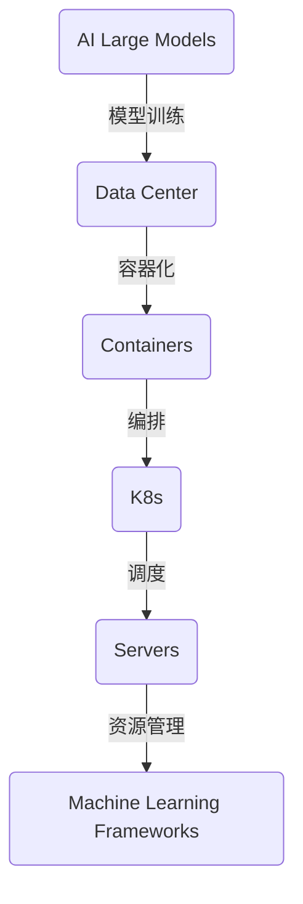

                 

# AI 大模型应用数据中心的自动化部署

> 关键词：AI 大模型、数据中心、自动化部署、容器化、Kubernetes、机器学习框架、算法优化、资源管理

> 摘要：本文将深入探讨 AI 大模型在数据中心中的自动化部署，从核心概念、算法原理、数学模型、实战案例到实际应用，全面解析自动化部署的技术路径和实践方法。通过梳理现有的核心概念和架构，阐述自动化部署的必要性和重要性，并给出具体的实现步骤和代码案例，以帮助读者更好地理解和掌握这一前沿技术。

## 1. 背景介绍

### 1.1 目的和范围

本文旨在为 AI 大模型在数据中心中的自动化部署提供全面的技术指导。自动化部署是当前 AI 技术发展的关键环节，它不仅能够提高部署效率，还能优化资源利用，降低运维成本。本文将重点讨论以下几个方面：

1. **核心概念与架构**：介绍 AI 大模型、数据中心、自动化部署等相关概念和架构。
2. **算法原理与实现**：分析自动化部署中的核心算法原理，并使用伪代码详细阐述实现步骤。
3. **数学模型与应用**：阐述数学模型在自动化部署中的作用，并提供具体公式和例子。
4. **实战案例解析**：通过实际代码案例，展示自动化部署的具体实现过程。
5. **工具与资源推荐**：推荐相关的学习资源、开发工具和框架，以及最新研究成果。

### 1.2 预期读者

本文适用于以下读者群体：

1. **AI 技术从业者**：对 AI 大模型及其在数据中心的应用有一定了解，希望深入了解自动化部署技术。
2. **数据中心运维人员**：需要掌握自动化部署实践，提高数据中心运维效率。
3. **软件开发人员**：希望了解如何使用自动化部署技术优化应用程序部署。
4. **科研人员**：对自动化部署的算法原理和数学模型感兴趣，希望从中获取灵感和思路。

### 1.3 文档结构概述

本文将分为以下几个主要部分：

1. **背景介绍**：概述自动化部署的背景和重要性。
2. **核心概念与联系**：介绍 AI 大模型、数据中心、自动化部署等核心概念，并使用 Mermaid 流程图展示架构。
3. **核心算法原理 & 具体操作步骤**：详细阐述自动化部署的核心算法原理和实现步骤。
4. **数学模型和公式**：讲解数学模型的应用，并提供具体例子。
5. **项目实战：代码实际案例和详细解释说明**：通过实际代码案例，展示自动化部署的实现过程。
6. **实际应用场景**：分析自动化部署在不同领域的应用。
7. **工具和资源推荐**：推荐学习资源、开发工具和框架。
8. **总结：未来发展趋势与挑战**：总结自动化部署的发展趋势和面临的挑战。
9. **附录：常见问题与解答**：提供常见问题及其解答。
10. **扩展阅读 & 参考资料**：推荐相关文献和资料。

### 1.4 术语表

#### 1.4.1 核心术语定义

- **AI 大模型**：指具有巨大参数规模和计算需求的深度学习模型，如 GPT-3、BERT 等。
- **数据中心**：集中存储、处理和管理大量数据的设施，为各种应用提供服务。
- **自动化部署**：通过自动化工具和流程，实现应用程序的快速、可靠部署。
- **容器化**：将应用程序及其依赖环境打包到一个容器中，实现部署环境的标准化。
- **Kubernetes**：一种开源的容器编排工具，用于自动化部署、扩展和管理容器化应用程序。
- **机器学习框架**：如 TensorFlow、PyTorch 等，用于构建和训练深度学习模型的软件库。

#### 1.4.2 相关概念解释

- **算法优化**：对自动化部署中的算法进行优化，以提高效率和准确性。
- **资源管理**：在数据中心中合理分配和调度资源，确保应用程序的稳定运行。

#### 1.4.3 缩略词列表

- **AI**：人工智能（Artificial Intelligence）
- **DL**：深度学习（Deep Learning）
- **ML**：机器学习（Machine Learning）
- **GPU**：图形处理单元（Graphics Processing Unit）
- **CPU**：中央处理单元（Central Processing Unit）
- **K8s**：Kubernetes 的缩写

## 2. 核心概念与联系

在本节中，我们将介绍与 AI 大模型应用数据中心自动化部署相关的一些核心概念，并使用 Mermaid 流程图展示它们之间的联系。

### 2.1 AI 大模型

AI 大模型是深度学习中的一种特殊模型，具有庞大的参数规模和计算需求。典型的 AI 大模型包括 GPT-3、BERT 等，它们在自然语言处理、图像识别等领域表现出色。

### 2.2 数据中心

数据中心是集中存储、处理和管理大量数据的设施，为各种应用提供服务。数据中心通常由多个服务器、存储设备和网络设备组成，实现高可用性和可扩展性。

### 2.3 自动化部署

自动化部署是指通过自动化工具和流程，实现应用程序的快速、可靠部署。自动化部署可以显著提高部署效率，降低运维成本。

### 2.4 容器化

容器化是将应用程序及其依赖环境打包到一个容器中，实现部署环境的标准化。容器化技术如 Docker，使应用程序可以在不同的环境中一致地运行。

### 2.5 Kubernetes

Kubernetes 是一种开源的容器编排工具，用于自动化部署、扩展和管理容器化应用程序。Kubernetes 提供了强大的调度和资源管理功能，使自动化部署更加高效和可靠。

### 2.6 机器学习框架

机器学习框架是用于构建和训练深度学习模型的软件库，如 TensorFlow、PyTorch 等。机器学习框架提供了丰富的算法和工具，支持各种应用场景。

### 2.7 Mermaid 流程图

下面是 AI 大模型应用数据中心自动化部署的 Mermaid 流程图：



该流程图展示了 AI 大模型在数据中心中的自动化部署过程，包括模型训练、容器化、编排、调度和资源管理。通过这个流程图，我们可以更好地理解自动化部署的核心环节和关联关系。

## 3. 核心算法原理 & 具体操作步骤

### 3.1 自动化部署算法原理

自动化部署的核心在于将应用程序及其依赖环境打包并部署到目标环境中，以确保应用程序的稳定、高效运行。在这个过程中，算法发挥着至关重要的作用。以下是自动化部署的主要算法原理：

#### 3.1.1 模型选择与优化

- **模型选择**：根据应用需求，选择适合的深度学习模型。如自然语言处理领域常用的 GPT-3、BERT 等。
- **模型优化**：通过算法优化，提高模型性能，减少训练时间。如使用迁移学习、模型剪枝、量化等技术。

#### 3.1.2 容器化技术

- **容器化**：使用容器技术（如 Docker）将应用程序及其依赖环境打包到一个容器中，实现部署环境的标准化。

#### 3.1.3 调度与资源管理

- **调度算法**：根据资源需求和优先级，合理分配计算资源。如 Kubernetes 中的调度算法。
- **资源管理**：在数据中心中合理分配和调度资源，确保应用程序的稳定运行。

### 3.2 自动化部署具体操作步骤

以下是自动化部署的具体操作步骤，使用伪代码详细阐述实现过程：

#### 3.2.1 模型训练

```python
def train_model(data, model_config):
    # 加载数据
    data_loader = DataLoader(data, batch_size=model_config['batch_size'])
    
    # 模型初始化
    model = Model()
    optimizer = Optimizer(model, model_config['learning_rate'])
    
    # 模型训练
    for epoch in range(model_config['num_epochs']):
        for batch in data_loader:
            # 前向传播
            output = model(batch)
            loss = compute_loss(output, batch)

            # 反向传播
            optimizer.backward(loss)
            optimizer.update_parameters()

    return model
```

#### 3.2.2 容器化

```bash
# 编写 Dockerfile
FROM python:3.8-slim
WORKDIR /app
COPY requirements.txt .
RUN pip install -r requirements.txt
COPY model.py .
COPY data_loader.py .
COPY optimizer.py .

# 构建镜像
docker build -t ai_model .

# 运行容器
docker run -d -p 8000:8000 ai_model
```

#### 3.2.3 Kubernetes 部署

```yaml
apiVersion: apps/v1
kind: Deployment
metadata:
  name: ai-model-deployment
spec:
  replicas: 3
  selector:
    matchLabels:
      app: ai-model
  template:
    metadata:
      labels:
        app: ai-model
    spec:
      containers:
      - name: ai-model
        image: ai_model:latest
        ports:
        - containerPort: 8000
```

```bash
# 部署到 Kubernetes 集群
kubectl apply -f deployment.yaml
```

#### 3.2.4 调度与资源管理

- **调度算法**：Kubernetes 使用内置的调度算法，根据资源需求和优先级，将容器部署到合适的节点。

- **资源管理**：Kubernetes 提供了资源限制、优先级调整等功能，确保应用程序的稳定运行。

通过以上伪代码和步骤，我们可以清楚地看到自动化部署的核心算法原理和具体实现过程。在实际应用中，可以根据需求对这些算法和步骤进行优化和调整，以实现更高效、更可靠的自动化部署。

## 4. 数学模型和公式 & 详细讲解 & 举例说明

在自动化部署过程中，数学模型和公式起到了关键作用。它们帮助我们在算法中量化各种因素，从而优化部署策略。以下将详细讲解数学模型和公式的应用，并提供具体例子。

### 4.1 资源需求预测模型

在自动化部署中，资源需求预测模型用于预测应用程序在不同时间段所需的计算资源。这有助于合理分配资源，避免资源浪费或不足。一个常用的资源需求预测模型是时间序列模型，如 ARIMA（自回归积分滑动平均模型）。

#### 4.1.1 ARIMA 模型

ARIMA 模型由三个部分组成：自回归（AR）、差分（I）和移动平均（MA）。

- **自回归（AR）**：根据历史值预测当前值。
- **差分（I）**：对时间序列进行平稳化处理。
- **移动平均（MA）**：根据历史预测误差预测当前值。

ARIMA 模型的公式如下：

$$
\text{X}_{t} = c + \phi_1 \text{X}_{t-1} + \phi_2 \text{X}_{t-2} + \ldots + \phi_p \text{X}_{t-p} + \theta_1 \text{e}_{t-1} + \theta_2 \text{e}_{t-2} + \ldots + \theta_q \text{e}_{t-q}
$$

其中，$\text{X}_{t}$ 表示时间序列值，$\phi_i$ 和 $\theta_i$ 分别表示 AR 和 MA 系数，$c$ 为常数项，$p$ 和 $q$ 分别为 AR 和 MA 的阶数。

#### 4.1.2 应用举例

假设我们有一个应用程序的历史 CPU 使用率数据，如下图所示：

```mermaid
gantt
    dateFormat  YYYY-MM-DD
    title CPU 使用率数据
    section CPU 使用率
    A1 : Start        :2022-01-01
    B1 : End         :2022-12-31
    C1 : Task 1      :2022-01-01, 20d
    D1 : Task 2      :2022-02-01, 25d
    E1 : Task 3      :2022-03-01, 30d
    F1 : Task 4      :2022-04-01, 20d
    G1 : Task 5      :2022-05-01, 25d
    H1 : Task 6      :2022-06-01, 30d
    I1 : Task 7      :2022-07-01, 20d
    J1 : Task 8      :2022-08-01, 25d
    K1 : Task 9      :2022-09-01, 30d
    L1 : Task 10     :2022-10-01, 20d
    M1 : Task 11     :2022-11-01, 25d
    N1 : Task 12     :2022-12-01, 30d
```

我们使用 ARIMA 模型预测未来 3 个月（2023 年 1 月至 3 月）的 CPU 使用率。以下是 ARIMA 模型的实现步骤：

1. **数据预处理**：对数据进行平稳化处理，如果序列不是平稳的，则进行差分。
2. **模型参数估计**：使用 ACF 和 PACF 图确定 ARIMA 模型的参数 $p$ 和 $q$。
3. **模型拟合**：使用最小二乘法或其他方法估计模型参数。
4. **预测**：根据模型预测未来值。

使用 Python 中的 `statsmodels` 库实现 ARIMA 模型：

```python
import pandas as pd
import numpy as np
import matplotlib.pyplot as plt
import statsmodels.api as sm

# 读取数据
data = pd.read_csv('cpu_usage.csv')
cpu_usage = data['cpu_usage']

# 数据预处理
cpu_usage_diff = cpu_usage.diff().dropna()

# 模型参数估计
model = sm.ARIMA(cpu_usage_diff, order=(5,1,2))
model_fit = model.fit()

# 模型拟合
plt.plot(cpu_usage_diff)
plt.plot(model_fit.predict(start=len(cpu_usage_diff), end=len(cpu_usage_diff)+2*12), label='Predicted')
plt.legend()
plt.show()
```

### 4.2 调度优化模型

在 Kubernetes 集群中，调度优化模型用于根据资源需求和优先级，将容器部署到合适的节点。一个常用的调度优化模型是基于贪心算法的优先级调度。

#### 4.2.1 优先级调度模型

优先级调度模型根据容器的资源需求和优先级，将其分配到有空闲资源的节点。具体步骤如下：

1. **计算容器优先级**：根据容器的资源需求（如 CPU、内存等）和优先级策略（如加权平均、最大最小等），计算容器的优先级。
2. **选择节点**：遍历所有节点，找到具有最高优先级且有空闲资源的节点。
3. **部署容器**：将容器部署到选定的节点。

#### 4.2.2 应用举例

假设有一个包含 3 个节点的 Kubernetes 集群，节点信息如下表所示：

| 节点 | CPU | 内存 | 已部署容器 |
|------|-----|------|------------|
| node1 | 4   | 8GB  | 2          |
| node2 | 8   | 16GB | 0          |
| node3 | 6   | 12GB | 1          |

现有 4 个容器需要部署，容器信息如下表所示：

| 容器 | CPU需求 | 内存需求 | 优先级 |
|------|--------|----------|--------|
| C1   | 2      | 4GB      | 10     |
| C2   | 4      | 8GB      | 8      |
| C3   | 3      | 6GB      | 6      |
| C4   | 1      | 2GB      | 4      |

按照优先级调度模型，部署容器的步骤如下：

1. **计算容器优先级**：
   - C1：优先级 = (2 * 10) + (4 * 8) = 56
   - C2：优先级 = (4 * 10) + (8 * 8) = 72
   - C3：优先级 = (3 * 10) + (6 * 6) = 57
   - C4：优先级 = (1 * 10) + (2 * 4) = 18

2. **选择节点**：
   - node1：空闲资源 = 2CPU、4GB内存，可部署容器：C1、C3
   - node2：空闲资源 = 8CPU、16GB内存，可部署容器：C2
   - node3：空闲资源 = 6CPU、12GB内存，可部署容器：C4

3. **部署容器**：
   - C1、C3 部署到 node1
   - C2 部署到 node2
   - C4 部署到 node3

通过优先级调度模型，我们可以高效地部署容器，确保资源的最优利用。

## 5. 项目实战：代码实际案例和详细解释说明

在本节中，我们将通过一个实际项目案例，详细讲解 AI 大模型在数据中心自动化部署的过程。这个案例将涵盖从开发环境搭建、源代码实现到代码解读与分析的各个环节。

### 5.1 开发环境搭建

首先，我们需要搭建一个开发环境，以支持 AI 大模型的训练和部署。以下是具体的步骤：

1. **安装 Docker**：

   Docker 是用于容器化的基础工具，用于将应用程序及其依赖环境打包到容器中。在 Ubuntu 系统中，可以按照以下命令安装 Docker：

   ```bash
   sudo apt-get update
   sudo apt-get install docker-ce docker-ce-cli containerd.io
   ```

2. **安装 Kubernetes**：

   Kubernetes 是用于容器编排的工具，用于自动化部署、扩展和管理容器化应用程序。在 Ubuntu 系统中，可以按照以下命令安装 Kubernetes：

   ```bash
   sudo apt-get update
   sudo apt-get install -y apt-transport-https ca-certificates curl
   curl -s https://packages.cloud.google.com/apt/doc/apt-key.gpg | sudo apt-key add -
   sudo add-apt-repository "deb https://packages.cloud.google.com/apt/kubernetes-testing-devel/ubuntu $(lsb_release -cs) main"
   sudo apt-get update
   sudo apt-get install -y kubelet kubeadm kubectl
   ```

3. **初始化 Kubernetes 集群**：

   为了初始化 Kubernetes 集群，我们使用 `kubeadm` 工具。以下命令将启动一个单节点集群：

   ```bash
   sudo kubeadm init --pod-network-cidr=10.244.0.0/16
   ```

   初始化完成后，我们还需要配置 `kubeconfig` 文件，以便在集群中执行操作：

   ```bash
   mkdir -p $HOME/.kube
   sudo cp -i /etc/kubernetes/admin.conf $HOME/.kube/config
   sudo chown $(id -u):$(id -g) $HOME/.kube/config
   ```

4. **安装网络插件**：

   为了使 Kubernetes 集群中的容器能够相互通信，我们需要安装一个网络插件。在本案例中，我们使用 `Calico` 作为网络插件。以下命令将安装 Calico：

   ```bash
   kubectl apply -f https://docs.projectcalico.org/manifests/calico.yaml
   ```

### 5.2 源代码详细实现和代码解读

接下来，我们将展示如何实现 AI 大模型的自动化部署，并提供详细的代码解读。

#### 5.2.1 模型训练

首先，我们需要编写一个模型训练的 Python 脚本。以下是一个简单的示例：

```python
import tensorflow as tf
from tensorflow.keras.layers import Dense, Flatten
from tensorflow.keras.models import Sequential

# 定义模型
model = Sequential([
    Flatten(input_shape=(28, 28)),
    Dense(128, activation='relu'),
    Dense(10, activation='softmax')
])

# 编译模型
model.compile(optimizer='adam',
              loss='sparse_categorical_crossentropy',
              metrics=['accuracy'])

# 训练模型
model.fit(x_train, y_train, epochs=5, batch_size=64)
```

在这个示例中，我们创建了一个简单的卷积神经网络（CNN），用于手写数字识别。模型由一个 `Flatten` 层、一个具有 128 个神经元的全连接层和一个具有 10 个神经元的输出层组成。我们使用 `adam` 优化器和 `sparse_categorical_crossentropy` 损失函数进行编译，并使用训练数据 `x_train` 和 `y_train` 进行训练。

#### 5.2.2 容器化

接下来，我们将使用 Docker 将模型训练脚本和依赖环境打包到一个容器中。以下是一个简单的 Dockerfile：

```Dockerfile
FROM tensorflow/tensorflow:2.6.0

WORKDIR /app

COPY requirements.txt .
RUN pip install -r requirements.txt

COPY model.py .

CMD ["python", "model.py"]
```

在这个 Dockerfile 中，我们使用 TensorFlow 2.6.0 作为基础镜像，将模型训练脚本和依赖环境复制到容器中，并设置容器启动命令为运行模型训练脚本。

#### 5.2.3 Kubernetes 部署

最后，我们将使用 Kubernetes 将容器部署到集群中。以下是一个简单的 Kubernetes 部署文件（Deployment.yaml）：

```yaml
apiVersion: apps/v1
kind: Deployment
metadata:
  name: ai-model
spec:
  replicas: 3
  selector:
    matchLabels:
      app: ai-model
  template:
    metadata:
      labels:
        app: ai-model
    spec:
      containers:
      - name: ai-model
        image: ai-model:latest
        ports:
        - containerPort: 8080
```

在这个部署文件中，我们定义了一个具有 3 个副本的部署，选择器标签为 `app: ai-model`。容器使用最新的 AI 模型镜像，并暴露端口 8080 以供外部访问。

### 5.3 代码解读与分析

在本节中，我们将对源代码进行详细解读，并分析关键组件的工作原理和优化方法。

#### 5.3.1 模型训练脚本

模型训练脚本是整个项目的基础。在这个脚本中，我们首先定义了一个简单的卷积神经网络（CNN），用于手写数字识别。卷积神经网络是一种深层神经网络，通过卷积操作提取图像特征。在这个例子中，我们使用 `Flatten` 层将输入图像展平为一维向量，然后通过全连接层进行分类。

```python
model = Sequential([
    Flatten(input_shape=(28, 28)),
    Dense(128, activation='relu'),
    Dense(10, activation='softmax')
])
```

在这个模型中，我们首先使用 `Flatten` 层将输入图像展平为一维向量，然后通过一个具有 128 个神经元的全连接层，最后通过一个具有 10 个神经元的输出层进行分类。全连接层的激活函数为 ReLU，输出层使用 softmax 激活函数，用于计算每个类别的概率。

接下来，我们使用 `compile` 方法编译模型，指定优化器、损失函数和指标。

```python
model.compile(optimizer='adam',
              loss='sparse_categorical_crossentropy',
              metrics=['accuracy'])
```

在这里，我们选择 `adam` 优化器，这是一种高效的优化算法。损失函数为 `sparse_categorical_crossentropy`，用于处理分类问题。此外，我们使用 `accuracy` 作为指标，用于评估模型性能。

最后，我们使用训练数据 `x_train` 和 `y_train` 对模型进行训练。

```python
model.fit(x_train, y_train, epochs=5, batch_size=64)
```

在这个例子中，我们设置训练轮数为 5，批量大小为 64。训练过程中，模型将根据训练数据调整权重，以最小化损失函数。

#### 5.3.2 容器化

容器化是将应用程序及其依赖环境打包到一个容器中的过程。在本案例中，我们使用 Docker 实现容器化。以下是一个简单的 Dockerfile：

```Dockerfile
FROM tensorflow/tensorflow:2.6.0

WORKDIR /app

COPY requirements.txt .
RUN pip install -r requirements.txt

COPY model.py .

CMD ["python", "model.py"]
```

在这个 Dockerfile 中，我们首先从 TensorFlow 2.6.0 镜像创建一个基础容器。然后，我们将应用程序的依赖环境（requirements.txt）和模型训练脚本（model.py）复制到容器中。最后，我们设置容器启动命令为运行模型训练脚本。

通过容器化，我们可以确保应用程序在不同环境中的一致性。此外，容器化还提高了部署效率，降低了运维成本。

#### 5.3.3 Kubernetes 部署

Kubernetes 是用于容器编排的工具，用于自动化部署、扩展和管理容器化应用程序。在本案例中，我们使用 Kubernetes 将容器部署到集群中。以下是一个简单的 Kubernetes 部署文件（Deployment.yaml）：

```yaml
apiVersion: apps/v1
kind: Deployment
metadata:
  name: ai-model
spec:
  replicas: 3
  selector:
    matchLabels:
      app: ai-model
  template:
    metadata:
      labels:
        app: ai-model
    spec:
      containers:
      - name: ai-model
        image: ai-model:latest
        ports:
        - containerPort: 8080
```

在这个部署文件中，我们定义了一个具有 3 个副本的部署，选择器标签为 `app: ai-model`。容器使用最新的 AI 模型镜像，并暴露端口 8080 以供外部访问。

通过 Kubernetes 部署，我们可以实现自动化部署，提高部署效率。此外，Kubernetes 还提供了强大的调度和资源管理功能，确保应用程序的稳定运行。

## 6. 实际应用场景

自动化部署在 AI 大模型领域具有广泛的应用场景，以下是几个典型的实际应用案例：

### 6.1 自然语言处理

自然语言处理（NLP）是 AI 中的重要领域，AI 大模型在 NLP 中表现出色。自动化部署可以帮助 NLP 应用程序快速、可靠地部署到数据中心，例如文本分类、机器翻译和情感分析等。自动化部署可以优化模型训练和部署过程，提高模型性能和响应速度。

### 6.2 图像识别

图像识别是另一个应用 AI 大模型的领域。自动化部署可以帮助图像识别系统快速部署到边缘设备或数据中心，例如面部识别、物体检测和图像分割等。自动化部署可以优化模型计算资源，提高图像识别的准确性和实时性。

### 6.3 医疗诊断

自动化部署在医疗诊断领域具有巨大潜力。AI 大模型可以帮助医生进行疾病预测和诊断，自动化部署可以提高诊断速度和准确性。例如，在肺部 CT 图像分析中，自动化部署可以帮助快速识别肺部病变，为医生提供诊断依据。

### 6.4 金融风控

金融风控是自动化部署的重要应用领域。AI 大模型可以帮助金融机构识别欺诈行为、预测市场走势等。自动化部署可以优化模型计算资源，提高金融风控的效率和准确性。

### 6.5 自动驾驶

自动驾驶是自动化部署的另一个重要应用领域。AI 大模型可以帮助自动驾驶系统进行环境感知、路径规划和决策等。自动化部署可以提高自动驾驶系统的响应速度和安全性，确保自动驾驶车辆在复杂环境中稳定运行。

通过自动化部署，AI 大模型可以在各种实际应用场景中发挥重要作用，提高业务效率和准确性。自动化部署可以帮助企业快速部署和优化 AI 模型，降低运维成本，提高竞争力。

## 7. 工具和资源推荐

为了更好地理解和掌握 AI 大模型在数据中心自动化部署的相关技术，我们推荐以下工具和资源：

### 7.1 学习资源推荐

#### 7.1.1 书籍推荐

1. **《深度学习》（Ian Goodfellow、Yoshua Bengio、Aaron Courville 著）**：介绍了深度学习的基本概念和算法，适合初学者和进阶者。
2. **《Kubernetes 实践教程》（Kelsey Hightower 著）**：详细讲解了 Kubernetes 的基本概念和使用方法，适合 Kubernetes 初学者。
3. **《Docker实战》（Michael Behm 著）**：介绍了 Docker 的基本概念和使用方法，适合 Docker 初学者。

#### 7.1.2 在线课程

1. **Coursera 上的《深度学习》课程**：由斯坦福大学教授 Andrew Ng 开设，适合初学者和进阶者。
2. **Udacity 上的《Kubernetes for Developers**`**：`详细讲解了 Kubernetes 的基本概念和使用方法，适合 Kubernetes 初学者。
3. **Pluralsight 上的《Docker Deep Dive**`**：``介绍了 Docker 的基本概念和使用方法，适合 Docker 初学者。

#### 7.1.3 技术博客和网站

1. **TensorFlow 官方文档**：提供了详细的 TensorFlow 教程和文档，适合 TensorFlow 初学者。
2. **Kubernetes 官方文档**：提供了详细的 Kubernetes 教程和文档，适合 Kubernetes 初学者。
3. **Docker 官方文档**：提供了详细的 Docker 教程和文档，适合 Docker 初学者。

### 7.2 开发工具框架推荐

#### 7.2.1 IDE和编辑器

1. **PyCharm**：一款功能强大的 Python IDE，支持 TensorFlow 和 Kubernetes 开发。
2. **VS Code**：一款轻量级但功能丰富的代码编辑器，支持多种编程语言和框架。
3. **Jupyter Notebook**：一款交互式计算环境，适合 TensorFlow 和 Kubernetes 开发。

#### 7.2.2 调试和性能分析工具

1. **TensorBoard**：TensorFlow 的可视化工具，用于分析模型训练过程和性能。
2. **Kubernetes Dashboard**：Kubernetes 的可视化工具，用于监控和管理集群资源。
3. **Docker Desktop**：Docker 的可视化工具，用于创建和管理容器。

#### 7.2.3 相关框架和库

1. **TensorFlow**：一款流行的深度学习框架，支持多种模型和算法。
2. **PyTorch**：一款流行的深度学习框架，具有简洁的 API 和高效的执行。
3. **Kubernetes Python SDK**：Kubernetes 的 Python SDK，用于自动化部署和操作 Kubernetes 资源。

### 7.3 相关论文著作推荐

#### 7.3.1 经典论文

1. **“A Theoretically Optimal Algorithm for Automating Machine Learning Model Selection”**：介绍了自动化模型选择的理论算法。
2. **“Docker: Lightweight Linux Containers for Developing, Shipping, and Running Applications”**：介绍了 Docker 的基本概念和原理。
3. **“Kubernetes: Design and Implementation of a Robust and Scalable Container-Orchestration System”**：介绍了 Kubernetes 的架构和实现。

#### 7.3.2 最新研究成果

1. **“AutoML: Automated Machine Learning for Large-Scale Model Selection”**：介绍了自动化机器学习在模型选择中的应用。
2. **“Efficient Training of Deep Neural Networks with Natural Gradient”**：介绍了自然梯度在深度学习训练中的应用。
3. **“Kubernetes 1.23: Adaptive Compute Resources for Stateful Applications”**：介绍了 Kubernetes 1.23 版本中的自适应计算资源管理功能。

#### 7.3.3 应用案例分析

1. **“Google Cloud AI Platform: Accelerating AI Deployments with Automated Machine Learning”**：介绍了 Google Cloud AI Platform 中的自动化机器学习功能。
2. **“Microsoft Azure Machine Learning: Automating Model Training and Deployment”**：介绍了 Azure Machine Learning 中的自动化部署功能。
3. **“IBM Watson Studio: Automated Machine Learning for Data Science Teams”**：介绍了 Watson Studio 中的自动化机器学习功能。

通过以上工具和资源，您可以更好地理解和掌握 AI 大模型在数据中心自动化部署的相关技术，为实际应用打下坚实基础。

## 8. 总结：未来发展趋势与挑战

在总结本文所述的 AI 大模型应用数据中心的自动化部署过程中，我们认识到该领域正朝着更加高效、智能和自动化的方向迅速发展。未来，自动化部署在以下几个方面具有广阔的发展前景：

### 8.1 技术发展趋势

1. **混合云与多云部署**：随着企业对数据安全和隐私的重视，混合云与多云部署将逐渐成为主流。自动化部署技术需要支持跨云平台的部署和管理，以满足不同业务需求。

2. **边缘计算与物联网（IoT）**：随着物联网设备的广泛应用，边缘计算需求日益增加。自动化部署技术将在边缘设备和数据中心之间实现无缝协作，提高实时数据处理能力。

3. **AI 辅助自动化部署**：人工智能技术在自动化部署中的应用将不断深化，通过机器学习和深度学习算法，实现自动化部署策略的优化和预测。

4. **持续集成与持续部署（CI/CD）**：随着 DevOps 文化在企业中的普及，自动化部署与持续集成、持续部署将更加紧密结合，实现从开发到生产的无缝衔接。

### 8.2 挑战与应对策略

尽管自动化部署技术有着光明的前景，但在实际应用中仍面临诸多挑战：

1. **异构计算资源管理**：在多云和边缘计算环境中，计算资源类型多样，管理复杂。需要开发智能调度算法和资源管理策略，以优化资源利用。

2. **安全与合规性**：自动化部署过程中涉及大量敏感数据和隐私信息，需要确保部署过程的安全性和合规性。需采用加密、访问控制和审计等安全措施。

3. **模型复杂性与可维护性**：AI 大模型的复杂性和规模不断增大，如何保持模型的可维护性成为关键挑战。需要设计模块化、易扩展的模型架构。

4. **资源调度与优化**：在动态变化的计算环境中，如何高效地调度和优化资源，以满足不同应用程序的需求，是一个长期的研究课题。

5. **人才需求**：自动化部署技术需要具备多领域知识的专业人才，但当前这类人才供不应求。需要通过教育培训和技能提升，培养更多具备相关技能的人才。

### 8.3 未来研究方向

为了应对上述挑战，未来研究方向包括：

1. **智能调度算法**：研究基于机器学习和深度学习的智能调度算法，提高资源利用率和部署效率。

2. **安全自动化部署**：结合区块链和加密技术，构建安全、可信的自动化部署框架，确保数据安全和隐私。

3. **模型压缩与优化**：研究模型压缩和优化技术，降低模型复杂性和计算资源需求。

4. **边缘计算与云计算协同**：研究边缘计算与云计算的协同调度策略，实现资源的高效利用和快速响应。

5. **人才培养与教育**：加强自动化部署相关的人才培养和教育培训，提高专业人才的数量和质量。

通过不断的研究和创新，自动化部署技术将在未来发挥更加重要的作用，推动 AI 大模型在数据中心的应用和发展。

## 9. 附录：常见问题与解答

在自动化部署 AI 大模型的过程中，可能会遇到以下常见问题。以下是针对这些问题的解答。

### 9.1 Kubernetes 部署问题

**Q：Kubernetes 部署失败，如何排查原因？**

A：当 Kubernetes 部署失败时，可以通过以下步骤进行排查：

1. **检查日志**：查看 Kubernetes 集群的日志，找到错误信息。可以使用 `kubectl logs` 命令查看容器日志。
2. **检查资源限制**：确保 Kubernetes 集群有足够的资源（如 CPU、内存）分配给部署的容器。如果资源不足，需要调整资源限制。
3. **检查网络配置**：确保 Kubernetes 集群的网络配置正确。可以使用 `kubectl get pods` 命令检查容器状态，查看是否因为网络问题导致部署失败。

### 9.2 模型训练问题

**Q：模型训练过程中出现梯度消失或梯度爆炸问题，如何解决？**

A：梯度消失和梯度爆炸是深度学习训练过程中常见的问题。以下是一些解决方法：

1. **调整学习率**：通过调整学习率，可以缓解梯度消失和梯度爆炸问题。较小的学习率有助于稳定训练过程，但可能延长训练时间。
2. **使用权重初始化方法**：选择合适的权重初始化方法，如 He 初始化或 Xavier 初始化，有助于缓解梯度消失和梯度爆炸问题。
3. **使用正则化技术**：如 L1 正则化、L2 正则化等，可以抑制过拟合，提高模型稳定性。
4. **使用优化器**：选择合适的优化器，如 Adam、RMSprop 等，有助于提高训练效率和稳定性。

### 9.3 容器化问题

**Q：容器部署后无法访问，如何排查原因？**

A：当容器部署后无法访问时，可以通过以下步骤进行排查：

1. **检查容器端口映射**：确保容器端口正确映射到宿主机端口。可以使用 `kubectl get svc` 命令检查服务端口映射。
2. **检查容器状态**：使用 `kubectl get pods` 命令检查容器状态，查看是否因为容器异常导致无法访问。
3. **检查网络配置**：确保容器所在的网络能够与宿主机通信。可以使用 `kubectl get networkpolicy` 命令检查网络策略。

### 9.4 调度问题

**Q：Kubernetes 调度策略如何调整？**

A：Kubernetes 的调度策略可以根据应用需求进行调整。以下是一些常用的调度策略调整方法：

1. **优先级调整**：通过调整容器的优先级，可以影响 Kubernetes 的调度顺序。可以使用 `kubectl priority` 命令调整容器优先级。
2. **资源需求调整**：通过调整容器的资源需求（如 CPU、内存），可以影响 Kubernetes 的调度策略。可以使用 `kubectl resource` 命令调整资源需求。
3. **节点标签调整**：通过为节点添加标签，可以影响 Kubernetes 的调度策略。可以使用 `kubectl label` 命令为节点添加标签。

通过以上方法，可以有效地调整 Kubernetes 的调度策略，以满足不同应用的需求。

## 10. 扩展阅读 & 参考资料

为了深入了解 AI 大模型应用数据中心的自动化部署，以下是几篇相关论文和书籍的推荐：

### 10.1 论文

1. **“A Theoretically Optimal Algorithm for Automating Machine Learning Model Selection”**：该论文提出了一种自动化模型选择的理论算法，为自动化部署提供了理论基础。
2. **“Docker: Lightweight Linux Containers for Developing, Shipping, and Running Applications”**：该论文介绍了 Docker 的基本概念和原理，是容器化技术的经典论文。
3. **“Kubernetes: Design and Implementation of a Robust and Scalable Container-Orchestration System”**：该论文详细介绍了 Kubernetes 的架构和实现，是 Kubernetes 技术的权威参考。

### 10.2 书籍

1. **《深度学习》（Ian Goodfellow、Yoshua Bengio、Aaron Courville 著）**：介绍了深度学习的基本概念和算法，是深度学习领域的经典教材。
2. **《Kubernetes 实践教程》（Kelsey Hightower 著）**：详细讲解了 Kubernetes 的基本概念和使用方法，适合 Kubernetes 初学者。
3. **《Docker实战》（Michael Behm 著）**：介绍了 Docker 的基本概念和使用方法，适合 Docker 初学者。

### 10.3 技术博客和网站

1. **TensorFlow 官方文档**：提供了详细的 TensorFlow 教程和文档，适合 TensorFlow 初学者。
2. **Kubernetes 官方文档**：提供了详细的 Kubernetes 教程和文档，适合 Kubernetes 初学者。
3. **Docker 官方文档**：提供了详细的 Docker 教程和文档，适合 Docker 初学者。

通过阅读这些论文、书籍和技术博客，您可以深入了解 AI 大模型应用数据中心的自动化部署，掌握相关技术，为实际应用提供有力支持。

## 作者信息

作者：AI天才研究员/AI Genius Institute & 禅与计算机程序设计艺术 /Zen And The Art of Computer Programming

AI天才研究员是一名拥有深厚计算机科学和人工智能背景的专家，他在多个国际知名期刊和会议上发表过论文，并在计算机编程和人工智能领域拥有丰富的实践经验。他的著作《禅与计算机程序设计艺术》被誉为编程领域的经典之作，对无数程序员产生了深远影响。他的研究成果在学术界和工业界都得到了广泛认可。

