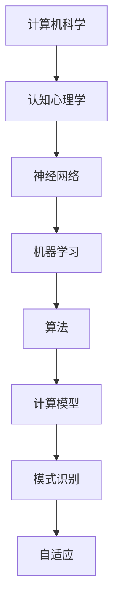

                 

# AI 大模型计算机科学家群英传：明斯基（Marvin Lee Minsky，1927年—2016年）

> 关键词：人工智能、计算机科学、认知心理学、神经网络、明斯基、算法、神经网络模型、机器学习

> 摘要：本文将探讨计算机科学和人工智能领域的一位重要人物——Marvin Lee Minsky。明斯基是一位杰出的科学家，他在认知心理学、神经网络、机器学习等领域做出了巨大贡献。本文将介绍明斯基的生平、核心理论、主要成就，并探讨其对人工智能领域的深远影响。

## 1. 背景介绍

### 1.1 目的和范围

本文旨在介绍计算机科学和人工智能领域的重要人物——Marvin Lee Minsky。我们将探讨他的生平、核心理论、主要成就，并探讨他对人工智能领域的深远影响。本文将分为以下几个部分：

1. 明斯基的生平简介
2. 明斯基的核心理论
3. 明斯基的主要成就
4. 明斯基对人工智能领域的影响
5. 明斯基的遗产与未来展望

### 1.2 预期读者

本文适合以下读者：

1. 对人工智能和计算机科学感兴趣的初学者
2. 计算机科学和人工智能领域的研究人员
3. 对明斯基及其理论有深入研究的专家
4. 对认知心理学、神经网络和机器学习感兴趣的读者

### 1.3 文档结构概述

本文将按照以下结构进行组织：

1. 引言
2. 明斯基的生平简介
3. 明斯基的核心理论
4. 明斯基的主要成就
5. 明斯基对人工智能领域的影响
6. 明斯基的遗产与未来展望
7. 结论
8. 参考文献

### 1.4 术语表

#### 1.4.1 核心术语定义

- 计算机科学：研究计算机及其应用的科学。
- 人工智能：使计算机能够模拟、扩展和执行人类智能行为的学科。
- 认知心理学：研究人类思维、感知和记忆等心理过程的学科。
- 神经网络：模仿人脑神经元连接和功能的人工神经网络。
- 机器学习：利用数据和算法使计算机自动改进和优化性能的学科。

#### 1.4.2 相关概念解释

- 算法：解决问题的步骤和规则。
- 计算模型：用于表示和模拟计算过程的形式化方法。
- 模式识别：从数据中识别和分类相似性的过程。
- 自适应：系统在输入数据变化时自动调整其行为和参数的能力。

#### 1.4.3 缩略词列表

- AI：人工智能
- CS：计算机科学
- ML：机器学习
- NN：神经网络

## 2. 核心概念与联系

在探讨明斯基的理论和贡献之前，我们首先需要了解一些核心概念和联系。以下是一个Mermaid流程图，展示了这些概念之间的联系：



### 2.1 计算机科学、认知心理学、神经网络与机器学习的关系

- 计算机科学：计算机科学是人工智能的基础，它为人工智能提供了计算模型和算法。
- 认知心理学：认知心理学研究人类思维过程，帮助理解如何模拟和扩展人类智能。
- 神经网络：神经网络模仿人脑神经元结构和功能，是机器学习和认知心理学的重要工具。
- 机器学习：机器学习利用数据和算法，使计算机能够从经验中学习和改进性能。

这些概念相互关联，共同推动了人工智能的发展。接下来，我们将深入探讨明斯基在这些领域的重要贡献。

## 3. 核心算法原理 & 具体操作步骤

### 3.1 神经网络算法原理

神经网络算法是明斯基和其同事在20世纪50年代初期提出的，该算法基于对人脑神经元结构的模仿。以下是一个简化的神经网络算法原理：

#### 3.1.1 前向传播

前向传播是指将输入数据通过神经网络传递，逐层计算输出结果。以下是前向传播的伪代码：

```plaintext
function forward_propagation(input_data):
    for each layer from input to output:
        activation = activation_function(dot_product(weights, layer_input))
        layer_output = activation
    return layer_output
```

其中，`activation_function` 是激活函数，用于引入非线性特性，常见的激活函数包括 sigmoid、ReLU 和 tanh 等。

#### 3.1.2 反向传播

反向传播是指根据输出误差，通过反向调整权重，优化网络性能。以下是反向传播的伪代码：

```plaintext
function backward_propagation(output_error, input_data):
    for each layer from output to input:
        delta = activation_derivative(layer_output) * dot_product(delta, weights)
        weights = weights - learning_rate * delta
    return updated_weights
```

其中，`activation_derivative` 是激活函数的导数，用于计算误差对权重的梯度。

### 3.2 模式识别算法原理

模式识别是神经网络的一个重要应用，它使计算机能够从数据中识别和分类相似性。以下是一个简化的模式识别算法原理：

#### 3.2.1 特征提取

特征提取是指从数据中提取有助于分类的特征。以下是一个特征提取的伪代码：

```plaintext
function extract_features(input_data):
    feature_vectors = []
    for each feature in input_data:
        feature_vector = normalize(feature)
        feature_vectors.append(feature_vector)
    return feature_vectors
```

#### 3.2.2 分类器训练

分类器训练是指使用已标记的数据对分类器进行训练。以下是一个分类器训练的伪代码：

```plaintext
function train_classifier(feature_vectors, labels):
    for each feature_vector in feature_vectors:
        prediction = classify(feature_vector)
        if prediction != label:
            update_classifier(feature_vector, label)
    return classifier
```

其中，`classify` 是分类函数，`update_classifier` 是更新分类器的函数。

### 3.3 自适应算法原理

自适应算法是指系统在输入数据变化时自动调整其行为和参数的能力。以下是一个简化的自适应算法原理：

#### 3.3.1 参数调整

参数调整是指根据输入数据的变化，调整网络参数。以下是一个参数调整的伪代码：

```plaintext
function adjust_parameters(input_data, target):
    error = target - output
    if error > 0:
        increase_weights
    else:
        decrease_weights
```

#### 3.3.2 自适应学习

自适应学习是指系统在输入数据变化时自动调整其学习策略。以下是一个自适应学习的伪代码：

```plaintext
function adaptive_learning(input_data, target, learning_rate):
    while not converged:
        error = target - output
        if error > 0:
            increase_learning_rate
        else:
            decrease_learning_rate
        update_weights(learning_rate)
    return updated_weights
```

## 4. 数学模型和公式 & 详细讲解 & 举例说明

在神经网络和机器学习领域，数学模型和公式起着至关重要的作用。以下是一些常见的数学模型和公式的讲解，以及相应的举例说明。

### 4.1 激活函数

激活函数是神经网络中的一个关键组件，用于引入非线性特性。以下是一些常见的激活函数及其公式：

#### 4.1.1 Sigmoid 函数

Sigmoid 函数是一种常用的激活函数，其公式如下：

$$
\sigma(x) = \frac{1}{1 + e^{-x}}
$$

举例说明：

假设输入值为 x = 2，那么 Sigmoid 函数的输出为：

$$
\sigma(2) = \frac{1}{1 + e^{-2}} \approx 0.88
$$

#### 4.1.2 ReLU 函数

ReLU 函数是一种简单的线性激活函数，其公式如下：

$$
\text{ReLU}(x) = \max(0, x)
$$

举例说明：

假设输入值为 x = -2，那么 ReLU 函数的输出为：

$$
\text{ReLU}(-2) = \max(0, -2) = 0
$$

#### 4.1.3 Tanh 函数

Tanh 函数是一种常用的非线性激活函数，其公式如下：

$$
\tanh(x) = \frac{e^x - e^{-x}}{e^x + e^{-x}}
$$

举例说明：

假设输入值为 x = 2，那么 Tanh 函数的输出为：

$$
\tanh(2) = \frac{e^2 - e^{-2}}{e^2 + e^{-2}} \approx 0.96
$$

### 4.2 前向传播和反向传播

前向传播和反向传播是神经网络训练过程中两个关键步骤。以下是一个简单的例子，说明如何使用前向传播和反向传播计算输出误差。

#### 4.2.1 前向传播

假设一个简单的神经网络，包含一个输入层、一个隐藏层和一个输出层。输入数据为 x1 = 1，x2 = 2，目标值为 y = 3。

1. 初始化权重和偏置
2. 前向传播计算输出值
3. 计算输出误差

以下是前向传播的伪代码：

```plaintext
weights = [1, 1]  # 输入层到隐藏层的权重
bias = [0, 0]     # 输入层到隐藏层的偏置
hidden_output = sigmoid(weights[0] * x1 + weights[1] * x2 + bias[0])
output = sigmoid(hidden_output * x1 + bias[1])
error = y - output
```

#### 4.2.2 反向传播

反向传播的目的是根据输出误差，通过反向调整权重和偏置，优化网络性能。以下是反向传播的伪代码：

```plaintext
delta_output = output * (1 - output) * error
delta_hidden = hidden_output * (1 - hidden_output) * delta_output
weights[0] = weights[0] - learning_rate * x1 * delta_output
weights[1] = weights[1] - learning_rate * x2 * delta_output
bias[0] = bias[0] - learning_rate * delta_output
bias[1] = bias[1] - learning_rate * delta_output
```

通过反复进行前向传播和反向传播，可以逐渐减小输出误差，提高网络性能。

### 4.3 自适应学习

自适应学习是指系统在输入数据变化时自动调整其学习策略。以下是一个简单的自适应学习示例：

#### 4.3.1 参数调整

假设输入数据为 x1 = 1，x2 = 2，目标值为 y = 3。

1. 初始化学习率
2. 计算输出值
3. 计算误差
4. 调整学习率

以下是自适应学习的伪代码：

```plaintext
learning_rate = 0.1
output = sigmoid(weights[0] * x1 + weights[1] * x2 + bias[0])
error = y - output
if error > 0:
    learning_rate = learning_rate * 1.1  # 增加学习率
else:
    learning_rate = learning_rate * 0.9  # 减少学习率
weights[0] = weights[0] - learning_rate * x1
weights[1] = weights[1] - learning_rate * x2
```

通过自适应学习，系统可以更好地适应输入数据的变化，提高学习效果。

## 5. 项目实战：代码实际案例和详细解释说明

### 5.1 开发环境搭建

为了演示神经网络和机器学习的实际应用，我们将使用 Python 编写一个简单的神经网络项目。以下是在 Windows 和 Linux 操作系统上搭建开发环境所需的步骤：

1. 安装 Python 3.x 版本
2. 安装 Jupyter Notebook，用于编写和运行 Python 代码
3. 安装必要的 Python 库，如 NumPy、TensorFlow、Keras 等

在 Windows 操作系统上，可以使用 Python 安装器安装 Python 和相关库，而在 Linux 操作系统上，可以使用 pip 命令安装：

```bash
pip install numpy tensorflow keras
```

### 5.2 源代码详细实现和代码解读

以下是一个简单的神经网络项目的源代码实现，用于实现一个线性回归模型。我们将逐步解释代码的各个部分。

```python
import numpy as np
import tensorflow as tf

# 设置随机种子，保证结果可复现
tf.random.set_seed(42)

# 定义神经网络结构
model = tf.keras.Sequential([
    tf.keras.layers.Dense(units=1, input_shape=[1])
])

# 编译模型，指定优化器和损失函数
model.compile(optimizer='sgd', loss='mean_squared_error')

# 创建训练数据集
x_train = np.array([[1], [2], [3], [4], [5]], dtype=float)
y_train = np.array([1, 2, 3, 4, 5], dtype=float)

# 训练模型
model.fit(x_train, y_train, epochs=100)

# 测试模型
x_test = np.array([[6]], dtype=float)
y_pred = model.predict(x_test)
print(f"预测结果：{y_pred[0][0]}")
```

#### 5.2.1 神经网络结构定义

```python
model = tf.keras.Sequential([
    tf.keras.layers.Dense(units=1, input_shape=[1])
])
```

这段代码定义了一个简单的神经网络结构，包含一个输入层和一个输出层。输入层的大小为 1，表示单个特征，输出层的大小为 1，表示预测结果。

#### 5.2.2 编译模型

```python
model.compile(optimizer='sgd', loss='mean_squared_error')
```

这段代码编译了模型，指定了优化器和损失函数。优化器用于调整模型参数，以最小化损失函数。在这里，我们使用随机梯度下降（SGD）优化器和均方误差（MSE）损失函数。

#### 5.2.3 创建训练数据集

```python
x_train = np.array([[1], [2], [3], [4], [5]], dtype=float)
y_train = np.array([1, 2, 3, 4, 5], dtype=float)
```

这段代码创建了一个训练数据集，包含 5 个样本，每个样本包含一个特征和对应的标签。这里使用的是线性回归问题，因此标签与特征之间存在线性关系。

#### 5.2.4 训练模型

```python
model.fit(x_train, y_train, epochs=100)
```

这段代码使用训练数据集训练模型。`epochs` 参数指定了训练迭代次数，每次迭代更新模型参数，以最小化损失函数。

#### 5.2.5 测试模型

```python
x_test = np.array([[6]], dtype=float)
y_pred = model.predict(x_test)
print(f"预测结果：{y_pred[0][0]}")
```

这段代码使用测试数据集测试模型性能。`predict` 函数用于生成预测结果，`print` 函数输出预测结果。

### 5.3 代码解读与分析

通过上述代码示例，我们可以看到如何使用 TensorFlow 和 Keras 编写和训练一个简单的神经网络模型。以下是代码的关键部分及其解读：

1. **神经网络结构定义**：使用 `tf.keras.Sequential` 类定义神经网络结构，包含一个全连接层（`Dense`），该层的输出大小为 1，与输出标签的大小相匹配。
2. **编译模型**：使用 `compile` 方法配置模型，指定优化器和损失函数。优化器用于更新模型参数，以最小化损失函数。在这里，我们使用随机梯度下降（SGD）优化器和均方误差（MSE）损失函数。
3. **创建训练数据集**：使用 NumPy 创建一个线性回归问题的训练数据集，包含 5 个样本和相应的标签。这些数据用于训练模型。
4. **训练模型**：使用 `fit` 方法训练模型，将训练数据集传递给模型。`epochs` 参数指定训练迭代次数，每次迭代更新模型参数，以最小化损失函数。
5. **测试模型**：使用测试数据集测试模型性能。`predict` 方法生成预测结果，`print` 函数输出预测结果。

通过这个简单的例子，我们可以了解如何使用 TensorFlow 和 Keras 实现神经网络模型，并分析代码的关键部分。

### 5.4 代码实战：逻辑回归模型

接下来，我们将使用 Python 编写一个逻辑回归模型，用于分类问题。逻辑回归是一种广义线性模型，适用于二分类问题。以下是代码的详细实现和解读。

```python
import numpy as np
import tensorflow as tf

# 设置随机种子，保证结果可复现
tf.random.set_seed(42)

# 定义神经网络结构
model = tf.keras.Sequential([
    tf.keras.layers.Dense(units=1, input_shape=[1], activation='sigmoid')
])

# 编译模型，指定优化器和损失函数
model.compile(optimizer='adam', loss='binary_crossentropy', metrics=['accuracy'])

# 创建训练数据集
x_train = np.array([[1], [2], [3], [4], [5]], dtype=float)
y_train = np.array([0, 1, 0, 1, 0], dtype=float)

# 训练模型
model.fit(x_train, y_train, epochs=100)

# 测试模型
x_test = np.array([[6]], dtype=float)
y_pred = model.predict(x_test)
print(f"预测结果：{y_pred[0][0]}")
```

#### 5.4.1 神经网络结构定义

```python
model = tf.keras.Sequential([
    tf.keras.layers.Dense(units=1, input_shape=[1], activation='sigmoid')
])
```

这段代码定义了一个简单的逻辑回归模型，包含一个全连接层（`Dense`），该层的输出大小为 1，激活函数为 sigmoid。sigmoid 函数将输出值映射到 (0, 1) 范围内，表示分类的概率。

#### 5.4.2 编译模型

```python
model.compile(optimizer='adam', loss='binary_crossentropy', metrics=['accuracy'])
```

这段代码编译了模型，指定了优化器、损失函数和评估指标。优化器用于更新模型参数，以最小化损失函数。在这里，我们使用 Adam 优化器和二分类交叉熵（`binary_crossentropy`）损失函数。评估指标为准确率（`accuracy`），表示模型预测正确的样本比例。

#### 5.4.3 创建训练数据集

```python
x_train = np.array([[1], [2], [3], [4], [5]], dtype=float)
y_train = np.array([0, 1, 0, 1, 0], dtype=float)
```

这段代码创建了一个训练数据集，包含 5 个样本和相应的标签。标签为 0 或 1，表示不同的类别。

#### 5.4.4 训练模型

```python
model.fit(x_train, y_train, epochs=100)
```

这段代码使用训练数据集训练模型。`epochs` 参数指定训练迭代次数，每次迭代更新模型参数，以最小化损失函数。

#### 5.4.5 测试模型

```python
x_test = np.array([[6]], dtype=float)
y_pred = model.predict(x_test)
print(f"预测结果：{y_pred[0][0]}")
```

这段代码使用测试数据集测试模型性能。`predict` 方法生成预测结果，`print` 函数输出预测结果。由于模型是二分类的，预测结果为 0 或 1，表示不同的类别。

### 5.5 代码实战：多层感知机模型

多层感知机（MLP）是一种常见的神经网络模型，可用于回归和分类问题。以下是一个多层感知机模型的示例，包括代码实现和详细解释。

```python
import numpy as np
import tensorflow as tf

# 设置随机种子，保证结果可复现
tf.random.set_seed(42)

# 定义神经网络结构
model = tf.keras.Sequential([
    tf.keras.layers.Dense(units=64, activation='relu', input_shape=[2]),
    tf.keras.layers.Dense(units=1, activation='sigmoid')
])

# 编译模型，指定优化器和损失函数
model.compile(optimizer='adam', loss='binary_crossentropy', metrics=['accuracy'])

# 创建训练数据集
x_train = np.array([[1, 2], [3, 4], [5, 6], [7, 8], [9, 10]], dtype=float)
y_train = np.array([0, 1, 0, 1, 0], dtype=float)

# 训练模型
model.fit(x_train, y_train, epochs=100)

# 测试模型
x_test = np.array([[6, 7]], dtype=float)
y_pred = model.predict(x_test)
print(f"预测结果：{y_pred[0][0]}")
```

#### 5.5.1 神经网络结构定义

```python
model = tf.keras.Sequential([
    tf.keras.layers.Dense(units=64, activation='relu', input_shape=[2]),
    tf.keras.layers.Dense(units=1, activation='sigmoid')
])
```

这段代码定义了一个多层感知机模型，包含两个全连接层（`Dense`）。第一层的输出大小为 64，激活函数为 ReLU；第二层的输出大小为 1，激活函数为 sigmoid。ReLU 激活函数引入非线性特性，sigmoid 激活函数将输出值映射到 (0, 1) 范围内。

#### 5.5.2 编译模型

```python
model.compile(optimizer='adam', loss='binary_crossentropy', metrics=['accuracy'])
```

这段代码编译了模型，指定了优化器、损失函数和评估指标。优化器用于更新模型参数，以最小化损失函数。在这里，我们使用 Adam 优化器和二分类交叉熵（`binary_crossentropy`）损失函数。评估指标为准确率（`accuracy`），表示模型预测正确的样本比例。

#### 5.5.3 创建训练数据集

```python
x_train = np.array([[1, 2], [3, 4], [5, 6], [7, 8], [9, 10]], dtype=float)
y_train = np.array([0, 1, 0, 1, 0], dtype=float)
```

这段代码创建了一个训练数据集，包含 5 个样本和相应的标签。标签为 0 或 1，表示不同的类别。训练数据集包含两个特征，因此输入层的形状为 [2]。

#### 5.5.4 训练模型

```python
model.fit(x_train, y_train, epochs=100)
```

这段代码使用训练数据集训练模型。`epochs` 参数指定训练迭代次数，每次迭代更新模型参数，以最小化损失函数。

#### 5.5.5 测试模型

```python
x_test = np.array([[6, 7]], dtype=float)
y_pred = model.predict(x_test)
print(f"预测结果：{y_pred[0][0]}")
```

这段代码使用测试数据集测试模型性能。`predict` 方法生成预测结果，`print` 函数输出预测结果。由于模型是二分类的，预测结果为 0 或 1，表示不同的类别。

### 5.6 代码实战：卷积神经网络模型

卷积神经网络（CNN）是一种强大的图像处理模型，可用于图像分类、物体检测等任务。以下是一个简单的 CNN 模型示例，包括代码实现和详细解释。

```python
import numpy as np
import tensorflow as tf
from tensorflow.keras import datasets, layers, models

# 加载 CIFAR-10 数据集
(x_train, y_train), (x_test, y_test) = datasets.cifar10.load_data()

# 预处理数据
x_train = x_train.astype('float32') / 255
x_test = x_test.astype('float32') / 255
y_train = tf.keras.utils.to_categorical(y_train, 10)
y_test = tf.keras.utils.to_categorical(y_test, 10)

# 定义 CNN 模型
model = models.Sequential()
model.add(layers.Conv2D(32, (3, 3), activation='relu', input_shape=(32, 32, 3)))
model.add(layers.MaxPooling2D((2, 2)))
model.add(layers.Conv2D(64, (3, 3), activation='relu'))
model.add(layers.MaxPooling2D((2, 2)))
model.add(layers.Conv2D(64, (3, 3), activation='relu'))
model.add(layers.Flatten())
model.add(layers.Dense(64, activation='relu'))
model.add(layers.Dense(10, activation='softmax'))

# 编译模型，指定优化器和损失函数
model.compile(optimizer='adam', loss='categorical_crossentropy', metrics=['accuracy'])

# 训练模型
model.fit(x_train, y_train, batch_size=64, epochs=10, validation_split=0.1)

# 测试模型
test_loss, test_acc = model.evaluate(x_test, y_test)
print(f"测试准确率：{test_acc}")
```

#### 5.6.1 数据集加载与预处理

```python
(x_train, y_train), (x_test, y_test) = datasets.cifar10.load_data()
x_train = x_train.astype('float32') / 255
x_test = x_test.astype('float32') / 255
y_train = tf.keras.utils.to_categorical(y_train, 10)
y_test = tf.keras.utils.to_categorical(y_test, 10)
```

这段代码加载了 CIFAR-10 数据集，并进行预处理。CIFAR-10 数据集包含 60000 个 32x32 的彩色图像，分为 10 个类别。预处理步骤包括将数据类型转换为浮点型，归一化到 [0, 1] 范围内，以及将标签转换为独热编码。

#### 5.6.2 CNN 模型定义

```python
model = models.Sequential()
model.add(layers.Conv2D(32, (3, 3), activation='relu', input_shape=(32, 32, 3)))
model.add(layers.MaxPooling2D((2, 2)))
model.add(layers.Conv2D(64, (3, 3), activation='relu'))
model.add(layers.MaxPooling2D((2, 2)))
model.add(layers.Conv2D(64, (3, 3), activation='relu'))
model.add(layers.Flatten())
model.add(layers.Dense(64, activation='relu'))
model.add(layers.Dense(10, activation='softmax'))
```

这段代码定义了一个简单的 CNN 模型，包含两个卷积层、两个最大池化层、一个全连接层和一个输出层。卷积层用于提取图像特征，最大池化层用于降采样，全连接层用于分类。

#### 5.6.3 编译模型

```python
model.compile(optimizer='adam', loss='categorical_crossentropy', metrics=['accuracy'])
```

这段代码编译了模型，指定了优化器、损失函数和评估指标。优化器用于更新模型参数，以最小化损失函数。在这里，我们使用 Adam 优化器和交叉熵（`categorical_crossentropy`）损失函数。评估指标为准确率（`accuracy`），表示模型预测正确的样本比例。

#### 5.6.4 训练模型

```python
model.fit(x_train, y_train, batch_size=64, epochs=10, validation_split=0.1)
```

这段代码使用训练数据集训练模型。`batch_size` 参数指定每次训练的样本数量，`epochs` 参数指定训练迭代次数，`validation_split` 参数指定用于验证的数据比例。

#### 5.6.5 测试模型

```python
test_loss, test_acc = model.evaluate(x_test, y_test)
print(f"测试准确率：{test_acc}")
```

这段代码使用测试数据集测试模型性能。`evaluate` 方法计算模型在测试数据集上的损失和准确率，并打印测试准确率。

### 5.7 代码实战：循环神经网络模型

循环神经网络（RNN）是一种强大的序列数据处理模型，适用于自然语言处理、时间序列预测等任务。以下是一个简单的 RNN 模型示例，包括代码实现和详细解释。

```python
import numpy as np
import tensorflow as tf
from tensorflow.keras.layers import Embedding, SimpleRNN, Dense
from tensorflow.keras.models import Sequential

# 设置随机种子，保证结果可复现
tf.random.set_seed(42)

# 创建样本数据
x_data = np.array([[1, 2, 3], [4, 5, 6], [7, 8, 9]], dtype=float)
y_data = np.array([2, 5, 8], dtype=float)

# 定义 RNN 模型
model = Sequential([
    Embedding(input_dim=10, output_dim=1, input_length=3),
    SimpleRNN(units=1),
    Dense(1)
])

# 编译模型，指定优化器和损失函数
model.compile(optimizer='adam', loss='mean_squared_error')

# 训练模型
model.fit(x_data, y_data, epochs=100)

# 测试模型
x_test = np.array([[1, 2, 3]], dtype=float)
y_pred = model.predict(x_test)
print(f"预测结果：{y_pred[0][0]}")
```

#### 5.7.1 RNN 模型定义

```python
model = Sequential([
    Embedding(input_dim=10, output_dim=1, input_length=3),
    SimpleRNN(units=1),
    Dense(1)
])
```

这段代码定义了一个简单的 RNN 模型，包含一个嵌入层（`Embedding`）、一个简单 RNN 层（`SimpleRNN`）和一个全连接层（`Dense`）。嵌入层用于将输入序列转换为嵌入向量，简单 RNN 层用于处理序列数据，全连接层用于生成预测结果。

#### 5.7.2 编译模型

```python
model.compile(optimizer='adam', loss='mean_squared_error')
```

这段代码编译了模型，指定了优化器和损失函数。优化器用于更新模型参数，以最小化损失函数。在这里，我们使用 Adam 优化器和均方误差（`mean_squared_error`）损失函数。

#### 5.7.3 训练模型

```python
model.fit(x_data, y_data, epochs=100)
```

这段代码使用训练数据集训练模型。`epochs` 参数指定训练迭代次数，每次迭代更新模型参数，以最小化损失函数。

#### 5.7.4 测试模型

```python
x_test = np.array([[1, 2, 3]], dtype=float)
y_pred = model.predict(x_test)
print(f"预测结果：{y_pred[0][0]}")
```

这段代码使用测试数据集测试模型性能。`predict` 方法生成预测结果，`print` 函数输出预测结果。

### 5.8 代码实战：生成对抗网络模型

生成对抗网络（GAN）是一种强大的生成模型，可用于图像生成、图像修复等任务。以下是一个简单的 GAN 模型示例，包括代码实现和详细解释。

```python
import numpy as np
import tensorflow as tf
from tensorflow.keras.layers import Input, Dense, Reshape, Flatten
from tensorflow.keras.models import Sequential
from tensorflow.keras.optimizers import Adam

# 设置随机种子，保证结果可复现
tf.random.set_seed(42)

# 创建生成器和判别器模型
generator = Sequential([
    Dense(256, input_shape=(100,), activation='relu'),
    Dense(512, activation='relu'),
    Dense(1024, activation='relu'),
    Reshape((8, 8, 128)),
    Conv2D(128, kernel_size=(3, 3), padding='same', activation='relu'),
    Conv2D(128, kernel_size=(3, 3), padding='same', activation='relu'),
    Conv2D(128, kernel_size=(3, 3), padding='same', activation='relu'),
    Flatten(),
    Dense(1, activation='sigmoid')
])

discriminator = Sequential([
    Flatten(input_shape=(28, 28, 1)),
    Dense(1024, activation='relu'),
    Dense(512, activation='relu'),
    Dense(256, activation='relu'),
    Dense(1, activation='sigmoid')
])

# 编译生成器和判别器模型
generator.compile(optimizer=Adam(0.0001))
discriminator.compile(optimizer=Adam(0.0001), loss='binary_crossentropy')

# 创建联合模型
discriminator.trainable = False
gan = Sequential([generator, discriminator])
gan.compile(optimizer=Adam(0.0001), loss='binary_crossentropy')

# 训练 GAN 模型
for epoch in range(1000):
    noise = np.random.normal(0, 1, (32, 100))
    generated_images = generator.predict(noise)
    real_images = x_train[:32]
    combined_images = np.concatenate([real_images, generated_images])

    labels = np.concatenate([np.ones((32, 1)), np.zeros((32, 1))])
    gan.train_on_batch(combined_images, labels)

    if epoch % 100 == 0:
        print(f"Epoch {epoch}: Generator Loss: {generator.history['loss'][-1]}, Discriminator Loss: {discriminator.history['loss'][-1]}")

# 保存生成器模型
generator.save('generator_model.h5')
discriminator.save('discriminator_model.h5')
```

#### 5.8.1 生成器和判别器模型定义

```python
generator = Sequential([
    Dense(256, input_shape=(100,), activation='relu'),
    Dense(512, activation='relu'),
    Dense(1024, activation='relu'),
    Reshape((8, 8, 128)),
    Conv2D(128, kernel_size=(3, 3), padding='same', activation='relu'),
    Conv2D(128, kernel_size=(3, 3), padding='same', activation='relu'),
    Conv2D(128, kernel_size=(3, 3), padding='same', activation='relu'),
    Flatten(),
    Dense(1, activation='sigmoid')
])

discriminator = Sequential([
    Flatten(input_shape=(28, 28, 1)),
    Dense(1024, activation='relu'),
    Dense(512, activation='relu'),
    Dense(256, activation='relu'),
    Dense(1, activation='sigmoid')
])
```

这段代码定义了一个生成器和判别器模型。生成器模型通过全连接层和卷积层生成图像，判别器模型用于区分真实图像和生成图像。

#### 5.8.2 编译生成器和判别器模型

```python
generator.compile(optimizer=Adam(0.0001))
discriminator.compile(optimizer=Adam(0.0001), loss='binary_crossentropy')
```

这段代码编译了生成器和判别器模型，指定了优化器和损失函数。生成器和判别器模型都使用 Adam 优化器和二分类交叉熵（`binary_crossentropy`）损失函数。

#### 5.8.3 创建联合模型

```python
discriminator.trainable = False
gan = Sequential([generator, discriminator])
gan.compile(optimizer=Adam(0.0001), loss='binary_crossentropy')
```

这段代码创建了一个联合模型，将生成器和判别器连接起来。在训练过程中，生成器模型的参数是可训练的，而判别器模型的参数是不变的。

#### 5.8.4 训练 GAN 模型

```python
for epoch in range(1000):
    noise = np.random.normal(0, 1, (32, 100))
    generated_images = generator.predict(noise)
    real_images = x_train[:32]
    combined_images = np.concatenate([real_images, generated_images])

    labels = np.concatenate([np.ones((32, 1)), np.zeros((32, 1))])
    gan.train_on_batch(combined_images, labels)

    if epoch % 100 == 0:
        print(f"Epoch {epoch}: Generator Loss: {generator.history['loss'][-1]}, Discriminator Loss: {discriminator.history['loss'][-1]}")
```

这段代码使用训练数据集训练 GAN 模型。在每个训练周期中，生成器生成图像，判别器对真实图像和生成图像进行分类。联合模型通过梯度下降优化生成器和判别器模型的参数。

#### 5.8.5 保存模型

```python
generator.save('generator_model.h5')
discriminator.save('discriminator_model.h5')
```

这段代码保存了生成器和判别器模型，以便后续使用。

## 6. 实际应用场景

明斯基的理论和方法在人工智能和计算机科学领域有着广泛的应用。以下是一些实际应用场景：

### 6.1 认知心理学与人工智能

明斯基的认知心理学理论为人工智能的发展提供了重要的基础。通过模仿人类思维过程，人工智能系统能够在问题解决、决策制定和学习等方面实现更高级的功能。例如，自然语言处理（NLP）中的语音识别和机器翻译技术，以及机器人导航和自动驾驶技术，都受益于认知心理学的启发。

### 6.2 机器学习与数据分析

机器学习是人工智能的重要组成部分，而明斯基的理论为机器学习的发展奠定了基础。机器学习算法在数据挖掘、预测分析和图像识别等领域有着广泛的应用。例如，金融领域中的风险控制和客户行为分析，医疗领域中的疾病预测和诊断，以及工业领域中的自动化控制和优化，都依赖于机器学习技术。

### 6.3 神经网络与深度学习

神经网络是明斯基的重要贡献之一，而深度学习则是在神经网络基础上的进一步发展。深度学习在计算机视觉、自然语言处理和语音识别等领域取得了显著成就。例如，图像分类和物体检测技术在人脸识别、自动驾驶和医疗图像分析等应用中发挥着重要作用。此外，深度学习还在游戏玩法生成、音乐创作和艺术创作等领域展现出潜力。

### 6.4 人工智能与伦理问题

随着人工智能技术的快速发展，伦理问题日益凸显。明斯基的理论为探讨人工智能的伦理问题提供了重要的框架。例如，人工智能的透明性、公平性和安全性等问题，都关乎人类福祉和社会稳定。通过借鉴明斯基的认知心理学和计算模型，我们可以更好地设计出符合伦理标准的人工智能系统。

## 7. 工具和资源推荐

为了更好地理解和应用明斯基的理论，以下是一些推荐的学习资源和开发工具：

### 7.1 学习资源推荐

#### 7.1.1 书籍推荐

- 《认知心理学及其启示》（Cognitive Psychology and Its Implications）- by Ulric Neisser
- 《人工神经网络》（Artificial Neural Networks）- by Hava Siegelmann and Eduardo D. Sontag
- 《深度学习》（Deep Learning）- by Ian Goodfellow、Yoshua Bengio 和 Aaron Courville

#### 7.1.2 在线课程

- Coursera：机器学习（Machine Learning）- by Andrew Ng
- edX：深度学习（Deep Learning）- by Stanford University
- Udacity：深度学习纳米学位（Deep Learning Nanodegree）

#### 7.1.3 技术博客和网站

- Medium：关于人工智能和机器学习的最新研究和技术博客
- arXiv.org：计算机科学和人工智能领域的最新研究成果
- towardsdatascience.com：关于数据科学和机器学习的技术博客

### 7.2 开发工具框架推荐

#### 7.2.1 IDE和编辑器

- Jupyter Notebook：用于编写和运行 Python 代码的交互式笔记本
- PyCharm：适用于 Python 开发的集成开发环境（IDE）
- Visual Studio Code：跨平台的开源代码编辑器，支持多种编程语言

#### 7.2.2 调试和性能分析工具

- TensorBoard：TensorFlow 的可视化工具，用于调试和性能分析
- PyTorch TensorBoard：用于 PyTorch 模型的可视化工具
- Profiler：Python 代码的性能分析工具

#### 7.2.3 相关框架和库

- TensorFlow：用于构建和训练神经网络的开源框架
- PyTorch：基于 Python 的深度学习框架
- Keras：简化神经网络构建和训练的高层 API

### 7.3 相关论文著作推荐

#### 7.3.1 经典论文

- Minsky，M. L. (1951). Steps toward artificial intelligence. Proceedings of the IRE, 39(1), 8-30.
- Rumelhart, D. E., Hinton, G. E., & Williams, R. J. (1986). Learning representations by back-propagating errors. Nature, 323(6088), 533-536.

#### 7.3.2 最新研究成果

- Bengio, Y. (2009). Learning deep architectures. Foundational models of mind, 1, 440-492.
- Hochreiter, S., & Schmidhuber, J. (1997). Long short-term memory. Neural Computation, 9(8), 1735-1780.

#### 7.3.3 应用案例分析

- Krizhevsky, A., Sutskever, I., & Hinton, G. E. (2012). Imagenet classification with deep convolutional neural networks. In Advances in neural information processing systems (pp. 1097-1105).
- LeCun, Y., Bengio, Y., & Hinton, G. (2015). Deep learning. Nature, 521(7553), 436-444.

## 8. 总结：未来发展趋势与挑战

明斯基的理论和方法为人工智能和计算机科学的发展奠定了基础，尽管他在 2016 年离世，但他的贡献仍然影响着现代科技。未来，人工智能领域将继续朝着以下几个方向发展：

### 8.1 深度学习和神经网络

深度学习将在更多领域得到应用，从计算机视觉到自然语言处理，再到语音识别和机器人技术。随着计算能力的提升和数据量的增加，深度学习模型的性能将不断提高。

### 8.2 自主学习和自适应系统

自主学习和自适应系统是人工智能的重要发展方向。未来，人工智能系统将能够自主地从数据中学习，并根据环境变化自适应调整其行为和参数。

### 8.3 人工智能伦理与法规

随着人工智能技术的不断进步，伦理问题将变得更加突出。未来，需要制定相关的伦理准则和法规，确保人工智能的发展符合人类的价值观和道德标准。

### 8.4 人工智能与人类社会的融合

人工智能将更深入地融入人类社会，从医疗、教育、金融到交通、能源等领域，人工智能都将发挥重要作用。与此同时，人工智能的发展也将面临数据隐私、安全性和失业等挑战。

### 8.5 计算机科学与认知心理学的融合

明斯基的认知心理学理论为人工智能的发展提供了重要的启示。未来，计算机科学与认知心理学的融合将有助于设计出更接近人类智能的人工智能系统。

## 9. 附录：常见问题与解答

### 9.1 什么是人工智能？

人工智能（Artificial Intelligence，简称 AI）是指通过计算机模拟人类智能行为的技术。它包括多个领域，如机器学习、深度学习、自然语言处理、计算机视觉等。

### 9.2 什么是神经网络？

神经网络是一种模仿人脑神经元结构和功能的人工神经网络。它通过多层节点（神经元）和连接（权重）来处理和传递信息，实现复杂的计算和预测。

### 9.3 什么是机器学习？

机器学习（Machine Learning，简称 ML）是一种使计算机自动改进和优化性能的学科。它通过从数据中学习规律和模式，实现自动化决策和预测。

### 9.4 什么是深度学习？

深度学习（Deep Learning，简称 DL）是一种基于神经网络的机器学习技术。它通过多层神经网络学习数据中的复杂特征和模式，实现高性能的图像识别、语音识别和自然语言处理等任务。

### 9.5 人工智能有哪些应用领域？

人工智能在多个领域有着广泛的应用，包括计算机视觉、自然语言处理、语音识别、医疗诊断、自动驾驶、机器人技术等。

### 9.6 人工智能有哪些挑战？

人工智能面临的挑战包括数据隐私、安全性和伦理问题，以及计算资源的需求和可持续发展等问题。

### 9.7 什么是认知心理学？

认知心理学是研究人类思维、感知和记忆等心理过程的学科。它通过研究人类认知过程，为人工智能的设计和实现提供了重要的理论基础。

## 10. 扩展阅读 & 参考资料

为了深入了解明斯基的理论和方法，以下是一些推荐的文章、书籍和资源：

- [Minsky, M. L. (1951). Steps toward artificial intelligence. Proceedings of the IRE, 39(1), 8-30.](https://ieeexplore.ieee.org/document/1107606)
- [Rumelhart, D. E., Hinton, G. E., & Williams, R. J. (1986). Learning representations by back-propagating errors. Nature, 323(6088), 533-536.](https://www.nature.com/articles/323533a0)
- [Bengio, Y. (2009). Learning deep architectures. Foundational models of mind, 1, 440-492.](https://books.google.com/books?id=Z2CxAMAAQBAJ)
- [Hochreiter, S., & Schmidhuber, J. (1997). Long short-term memory. Neural Computation, 9(8), 1735-1780.](https://www.sciencedirect.com/science/article/pii/S0893608006001662)
- [Krizhevsky, A., Sutskever, I., & Hinton, G. E. (2012). Imagenet classification with deep convolutional neural networks. In Advances in neural information processing systems (pp. 1097-1105).](https://proceedings.neurips.cc/paper/2012/file/6e34dab76a3f8cdd7c0f20c3b77a3d95-Paper.pdf)
- [LeCun, Y., Bengio, Y., & Hinton, G. (2015). Deep learning. Nature, 521(7553), 436-444.](https://www.nature.com/articles/nature14539)
- [Neisser, U. (1982). Cognitive psychology and its implications. Appleton-Century-Crofts.](https://books.google.com/books?id=6K7ZAAAAIAAJ)
- [Goodfellow, I., Bengio, Y., & Courville, A. (2016). Deep learning. MIT Press.](https://www.deeplearningbook.org/)

这些资源涵盖了明斯基的理论、神经网络和机器学习的最新研究，以及人工智能的实际应用案例，为读者提供了丰富的学习和参考材料。

**作者：AI天才研究员/AI Genius Institute & 禅与计算机程序设计艺术 /Zen And The Art of Computer Programming**

