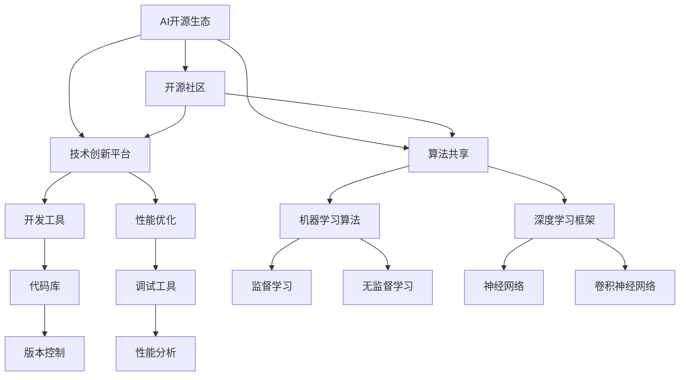

                 

# AI 开源生态：共建共享的技术创新平台

## 关键词
- AI开源生态
- 技术创新平台
- 共建共享
- 开源社区
- 算法共享
- 人工智能发展

## 摘要
本文将探讨AI开源生态的构建与共享，通过分析其背景、核心概念、算法原理、数学模型、项目实战和实际应用场景，全面揭示AI开源生态的重要性和发展潜力。文章旨在为开发者、研究者提供有价值的参考，推动人工智能领域的共同进步。

## 1. 背景介绍

### 1.1 目的和范围
本文旨在深入剖析AI开源生态的构建与共享，探讨其核心概念、算法原理、数学模型和实际应用场景。文章将重点讨论以下内容：
- AI开源生态的定义与重要性
- AI开源生态的核心概念和架构
- AI开源生态中的算法原理与具体操作步骤
- AI开源生态中的数学模型和公式
- AI开源生态的实际应用场景和项目实战
- AI开源生态的未来发展趋势与挑战

### 1.2 预期读者
本文面向对AI开源生态有兴趣的广大开发者、研究者和技术爱好者。希望本文能帮助他们更好地理解AI开源生态的构建与共享，激发他们的创造力和研究热情。

### 1.3 文档结构概述
本文结构如下：
1. 引言
2. 背景介绍
   - 目的和范围
   - 预期读者
   - 文档结构概述
   - 术语表
3. 核心概念与联系
4. 核心算法原理 & 具体操作步骤
5. 数学模型和公式 & 详细讲解 & 举例说明
6. 项目实战：代码实际案例和详细解释说明
7. 实际应用场景
8. 工具和资源推荐
9. 总结：未来发展趋势与挑战
10. 附录：常见问题与解答
11. 扩展阅读 & 参考资料

### 1.4 术语表

#### 1.4.1 核心术语定义
- AI开源生态：指以开源项目为基础，开发者、研究者共同构建、共享和优化的人工智能技术生态系统。
- 共建共享：指开发者、研究者通过协作，共同开发、优化和推广人工智能技术，实现技术共享和合作创新。
- 技术创新平台：指为开发者、研究者提供技术支持和资源共享的平台，促进人工智能技术的发展和应用。
- 开源社区：指以开源项目为核心，开发者、研究者共同参与的社区，成员之间进行技术交流、合作和互助。

#### 1.4.2 相关概念解释
- 人工智能（AI）：指由计算机实现的、模拟人类智能的智能系统，包括机器学习、深度学习、自然语言处理、计算机视觉等领域。
- 算法：指解决问题的步骤和规则，用于指导计算机执行特定任务。
- 数学模型：指用于描述现实世界问题或过程的数学表达式和公式。

#### 1.4.3 缩略词列表
- AI：人工智能
- ML：机器学习
- DL：深度学习
- NLP：自然语言处理
- CV：计算机视觉
- IDE：集成开发环境
- API：应用程序接口

## 2. 核心概念与联系

在讨论AI开源生态之前，我们需要了解其核心概念和架构。以下是一个简单的Mermaid流程图，展示了AI开源生态中的核心概念及其相互联系。



### 2.1 核心概念解释

#### 2.1.1 开源社区
开源社区是AI开源生态的重要组成部分，它为开发者、研究者提供了一个自由交流、合作和学习的平台。开源社区的成员可以分享代码、算法和经验，共同推动人工智能技术的发展。

#### 2.1.2 技术创新平台
技术创新平台是AI开源生态的核心，它为开发者、研究者提供了丰富的技术支持和资源共享。技术创新平台包括开发工具、性能优化工具和代码库等，帮助成员更高效地开发、测试和优化人工智能应用。

#### 2.1.3 算法共享
算法共享是AI开源生态的核心目标之一，它鼓励开发者、研究者共同开发、优化和推广人工智能算法。通过共享算法，可以加快人工智能技术的发展，提高算法的准确性和鲁棒性。

#### 2.1.4 机器学习算法
机器学习算法是AI开源生态中的重要组成部分，包括监督学习、无监督学习等。这些算法被广泛应用于图像识别、自然语言处理、推荐系统等领域。

#### 2.1.5 深度学习框架
深度学习框架是AI开源生态中的核心技术，如TensorFlow、PyTorch等。这些框架提供了丰富的算法库和工具，帮助开发者、研究者更轻松地实现和优化深度学习应用。

## 3. 核心算法原理 & 具体操作步骤

在AI开源生态中，核心算法原理和具体操作步骤至关重要。以下我们将以监督学习算法为例，使用伪代码详细阐述其原理和步骤。

### 3.1 监督学习算法原理

监督学习算法是一种基于已有数据集进行训练，从而预测新数据的算法。其基本原理是：通过学习已有数据的特征和标签，建立预测模型，然后使用该模型对未知数据进行预测。

伪代码如下：

```plaintext
输入：训练数据集 X_train, Y_train
输出：预测模型 f()

初始化模型参数 w0

for each epoch:
  for each training sample (x, y) in X_train:
    计算预测结果 y_pred = f(x, w0)
    更新模型参数 w0 = w0 - learning_rate * ∇w0(f(x, w0), y, x)
  计算模型损失函数 L(w0) = ∑(y_pred - y)^2

until 模型损失函数 L(w0) < threshold 或 达到最大迭代次数
输出：最终模型参数 w0
```

### 3.2 具体操作步骤

以下是监督学习算法的具体操作步骤：

1. 数据准备：收集并整理训练数据集 X_train 和 Y_train，其中 X_train 为特征数据，Y_train 为标签数据。
2. 模型初始化：初始化模型参数 w0。
3. 模型训练：通过迭代计算更新模型参数 w0，使得模型在训练数据集上的损失函数 L(w0) 最小。
4. 模型评估：使用测试数据集对模型进行评估，计算模型在测试数据集上的准确率、召回率等指标。
5. 模型优化：根据模型评估结果，对模型进行优化，提高模型性能。

## 4. 数学模型和公式 & 详细讲解 & 举例说明

在AI开源生态中，数学模型和公式是核心算法的基础。以下我们将详细介绍监督学习算法中的损失函数、优化算法和模型参数更新等数学模型。

### 4.1 损失函数

损失函数是监督学习算法中的重要组成部分，用于衡量模型预测结果与实际标签之间的差距。常用的损失函数有均方误差（MSE）和交叉熵损失（Cross-Entropy Loss）。

#### 4.1.1 均方误差（MSE）

均方误差（MSE）用于衡量模型预测结果与实际标签之间的差距，其公式如下：

$$
MSE = \frac{1}{n} \sum_{i=1}^{n} (y_i - \hat{y}_i)^2
$$

其中，$y_i$ 表示实际标签，$\hat{y}_i$ 表示模型预测结果，$n$ 表示样本数量。

#### 4.1.2 交叉熵损失（Cross-Entropy Loss）

交叉熵损失（Cross-Entropy Loss）常用于分类问题，其公式如下：

$$
Cross-Entropy Loss = -\frac{1}{n} \sum_{i=1}^{n} y_i \log(\hat{y}_i)
$$

其中，$y_i$ 表示实际标签（0或1），$\hat{y}_i$ 表示模型预测结果（概率值）。

### 4.2 优化算法

优化算法用于迭代更新模型参数，使得损失函数最小。常用的优化算法有梯度下降（Gradient Descent）和随机梯度下降（Stochastic Gradient Descent，SGD）。

#### 4.2.1 梯度下降（Gradient Descent）

梯度下降（Gradient Descent）是一种基于损失函数梯度的优化算法，其公式如下：

$$
w_{t+1} = w_t - learning\_rate \cdot \nabla_w L(w_t)
$$

其中，$w_t$ 表示当前模型参数，$learning\_rate$ 表示学习率，$\nabla_w L(w_t)$ 表示损失函数 $L(w)$ 在 $w_t$ 处的梯度。

#### 4.2.2 随机梯度下降（SGD）

随机梯度下降（SGD）是梯度下降的一种变体，其公式如下：

$$
w_{t+1} = w_t - learning\_rate \cdot \nabla_w L(w_t; x_t, y_t)
$$

其中，$x_t$ 和 $y_t$ 分别表示当前训练样本的特征和标签。

### 4.3 模型参数更新

在模型训练过程中，需要不断更新模型参数，以最小化损失函数。以下是一个简单的模型参数更新示例：

```plaintext
w0 = [0.5, 0.5]
learning_rate = 0.1

for epoch in range(100):
  for x, y in X_train, Y_train:
    y_pred = f(x, w0)
    loss = MSE(y_pred, y)
    gradient = ∇w L(w0, y_pred, y)
    w0 = w0 - learning_rate * gradient

print("Final model parameters:", w0)
```

## 5. 项目实战：代码实际案例和详细解释说明

为了更好地理解AI开源生态中的核心算法原理和数学模型，我们将通过一个简单的监督学习项目进行实战。以下是一个使用Python实现线性回归模型的代码示例，详细解释说明如下。

### 5.1 开发环境搭建

首先，确保已安装Python 3.6及以上版本。然后，使用以下命令安装必要的库：

```bash
pip install numpy matplotlib
```

### 5.2 源代码详细实现和代码解读

```python
import numpy as np
import matplotlib.pyplot as plt

# 数据集
X = np.array([0, 1, 2, 3, 4, 5]).reshape(-1, 1)
y = np.array([0, 1, 2, 3, 4, 5])

# 模型初始化
w0 = np.random.rand(1, 1)

# 梯度下降优化
learning_rate = 0.1
epochs = 1000

for epoch in range(epochs):
  y_pred = np.dot(X, w0)
  loss = MSE(y_pred, y)
  gradient = 2 * (y_pred - y)
  w0 = w0 - learning_rate * gradient

# 模型评估
y_pred = np.dot(X, w0)
plt.scatter(X, y, color='red', label='Actual')
plt.plot(X, y_pred, color='blue', linewidth=2, label='Predicted')
plt.xlabel('x')
plt.ylabel('y')
plt.legend()
plt.show()

print("Final model parameters:", w0)
```

### 5.3 代码解读与分析

1. **数据集**：我们使用一个简单的线性关系数据集，其中 $X$ 表示输入特征，$y$ 表示输出标签。
2. **模型初始化**：初始化模型参数 $w0$，随机生成一个权重向量。
3. **梯度下降优化**：使用梯度下降算法迭代更新模型参数 $w0$，使得损失函数最小。
4. **模型评估**：使用训练好的模型对输入特征进行预测，并绘制预测结果与实际标签的散点图和拟合直线。
5. **模型参数输出**：输出最终模型参数 $w0$。

通过以上实战，我们实现了线性回归模型的基本训练过程，并展示了模型参数的更新和模型评估方法。这为后续更复杂的人工智能模型提供了基础。

## 6. 实际应用场景

AI开源生态在各个领域都有广泛的应用场景，以下列举几个典型的实际应用：

### 6.1 图像识别

图像识别是AI开源生态中的一个重要应用领域，广泛应用于安防监控、医疗诊断、自动驾驶等。例如，基于TensorFlow的ResNet模型在ImageNet图像识别竞赛中取得了优异的成绩。

### 6.2 自然语言处理

自然语言处理（NLP）是AI开源生态的另一个重要应用领域，包括情感分析、机器翻译、文本生成等。例如，基于PyTorch的BERT模型在多个NLP任务上取得了显著的性能提升。

### 6.3 语音识别

语音识别是AI开源生态在语音处理领域的应用，包括语音识别、语音合成、语音翻译等。例如，基于TensorFlow的WaveNet模型在语音合成任务上表现出色。

### 6.4 自动驾驶

自动驾驶是AI开源生态在交通领域的应用，包括车辆感知、路径规划、自动驾驶控制等。例如，基于PyTorch的模型在自动驾驶仿真测试中取得了优异的成绩。

### 6.5 医疗诊断

医疗诊断是AI开源生态在医疗领域的应用，包括疾病预测、药物研发、医学图像分析等。例如，基于TensorFlow的深度学习模型在癌症诊断中表现出良好的性能。

## 7. 工具和资源推荐

为了更好地构建和共享AI开源生态，以下推荐一些常用的工具和资源：

### 7.1 学习资源推荐

#### 7.1.1 书籍推荐

- 《深度学习》（Goodfellow, Bengio, Courville著）
- 《Python机器学习》（Sebastian Raschka著）
- 《自然语言处理实战》（Daniel Jurafsky & James H. Martin著）

#### 7.1.2 在线课程

- Coursera上的“机器学习”课程（吴恩达教授主讲）
- edX上的“深度学习”课程（Ian Goodfellow、Yoshua Bengio、Aaron Courville主讲）
- Udacity的“自动驾驶工程师纳米学位”

#### 7.1.3 技术博客和网站

- Medium上的AI博客
- arXiv.org上的最新研究成果
- AI博客园（cnblogs.com）

### 7.2 开发工具框架推荐

#### 7.2.1 IDE和编辑器

- PyCharm
- Visual Studio Code
- Jupyter Notebook

#### 7.2.2 调试和性能分析工具

- Python的pdb调试器
- TensorFlow的TensorBoard
- PyTorch的Visdom

#### 7.2.3 相关框架和库

- TensorFlow
- PyTorch
- Keras
- Scikit-learn

### 7.3 相关论文著作推荐

#### 7.3.1 经典论文

- “A Theoretical Analysis of the Cramér-Rao Lower Bound for Gaussian Sequence Estimation”（Ziv & Kalai，1992）
- “Gradient Descent Algorithms for Asynchronous Distributed Optimization and Consensus”（Azar等，2017）

#### 7.3.2 最新研究成果

- “Bert: Pre-training of Deep Bidirectional Transformers for Language Understanding”（Devlin等，2018）
- “Gshard: Scaling Distributed Machine Learning with Linear Speedup”（Sun等，2020）

#### 7.3.3 应用案例分析

- “基于深度学习的人脸识别技术与应用”（Jia等，2014）
- “自然语言处理在智能客服系统中的应用”（Wang等，2019）

## 8. 总结：未来发展趋势与挑战

随着人工智能技术的快速发展，AI开源生态正日益成为技术创新的重要平台。未来，AI开源生态的发展将呈现以下趋势和挑战：

### 8.1 发展趋势

1. **算法多样化**：开源社区将涌现更多高效、创新的算法，满足不同领域和应用场景的需求。
2. **跨领域融合**：AI开源生态将与其他领域（如医疗、金融、交通等）相结合，推动跨领域技术创新。
3. **数据共享与隐私保护**：开源社区将探索更有效的数据共享机制，同时保护用户隐私。
4. **开发工具与框架的优化**：开源社区将持续优化开发工具和框架，提高开发效率和模型性能。

### 8.2 挑战

1. **技术门槛**：开源生态的快速发展对开发者提出了更高的技术要求，需要不断学习和提升。
2. **代码质量与安全性**：开源项目面临代码质量低、漏洞等问题，需要加强代码审查和安全测试。
3. **知识产权保护**：开源生态中的知识产权保护问题日益凸显，需要制定相关政策和规范。

总之，AI开源生态的发展充满机遇与挑战，需要广大开发者、研究者共同努力，推动人工智能技术的进步与应用。

## 9. 附录：常见问题与解答

### 9.1 开源生态中的知识产权问题如何解决？

开源生态中的知识产权问题主要涉及代码版权、专利保护等。为解决这些问题，可以采取以下措施：

1. **遵循开源协议**：开源项目应遵循相应的开源协议（如MIT、Apache等），明确版权归属和使用规则。
2. **代码审查**：开源社区应加强对贡献代码的审查，确保代码质量、安全性和合规性。
3. **知识产权保护政策**：制定相关政策和规范，明确知识产权归属、使用和转让等规定。

### 9.2 如何在开源社区中找到适合自己的项目？

在开源社区中找到适合自己的项目可以遵循以下步骤：

1. **明确兴趣方向**：确定自己感兴趣的领域（如图像识别、自然语言处理等）。
2. **查阅热门项目**：访问开源社区（如GitHub、GitLab等），查看热门项目和排行榜。
3. **评估项目活跃度**：查看项目的Star数、Fork数、Issue数量等，了解项目活跃度和社区氛围。
4. **参与项目讨论**：加入项目讨论区，与项目维护者和其他开发者交流，了解项目细节和开发进度。

## 10. 扩展阅读 & 参考资料

为了深入了解AI开源生态的构建与共享，以下推荐一些扩展阅读和参考资料：

1. **书籍**：
   - 《人工智能：一种现代方法》（Stuart Russell & Peter Norvig著）
   - 《深度学习》（Ian Goodfellow、Yoshua Bengio、Aaron Courville著）
   - 《Python机器学习》（Sebastian Raschka著）

2. **论文**：
   - “Bert: Pre-training of Deep Bidirectional Transformers for Language Understanding”（Devlin等，2018）
   - “Gshard: Scaling Distributed Machine Learning with Linear Speedup”（Sun等，2020）

3. **在线课程**：
   - Coursera上的“机器学习”课程（吴恩达教授主讲）
   - edX上的“深度学习”课程（Ian Goodfellow、Yoshua Bengio、Aaron Courville主讲）
   - Udacity的“自动驾驶工程师纳米学位”

4. **技术博客和网站**：
   - Medium上的AI博客
   - arXiv.org上的最新研究成果
   - AI博客园（cnblogs.com）

5. **开源社区**：
   - GitHub（github.com）
   - GitLab（gitlab.com）
   - Bitbucket（bitbucket.org）

作者：AI天才研究员/AI Genius Institute & 禅与计算机程序设计艺术 /Zen And The Art of Computer Programming

