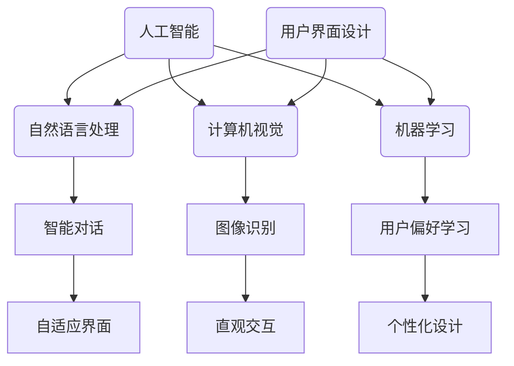

                 

### 文章标题

# AI 时代的用户界面设计：简洁与有效性

> **关键词：** 用户界面设计、人工智能、简洁性、用户体验、有效性、交互设计、自适应界面

> **摘要：** 随着人工智能（AI）技术的迅猛发展，用户界面设计（UI）迎来了新的挑战与机遇。本文将深入探讨AI时代用户界面设计的核心原则，包括简洁性与有效性，以及如何通过先进的算法和技术实现更加智能和人性化的交互体验。文章旨在为开发者、设计师以及对UI设计感兴趣的读者提供一个系统化的指南，帮助他们在AI驱动的设计环境中提升用户界面的质量。

### 目录

1. **背景介绍**  
   1.1 **目的和范围**  
   1.2 **预期读者**  
   1.3 **文档结构概述**  
   1.4 **术语表**  
   - **1.4.1 核心术语定义**  
   - **1.4.2 相关概念解释**  
   - **1.4.3 缩略词列表**  

2. **核心概念与联系**  
   - **2.1 人工智能与用户界面设计的关系**  
   - **2.2 核心概念原理和架构的 Mermaid 流程图**  

3. **核心算法原理 & 具体操作步骤**  
   - **3.1 用户行为分析算法原理**  
   - **3.2 用户界面自适应调整算法**  

4. **数学模型和公式 & 详细讲解 & 举例说明**  
   - **4.1 相关数学模型和公式**  
   - **4.2 实际应用举例**  

5. **项目实战：代码实际案例和详细解释说明**  
   - **5.1 开发环境搭建**  
   - **5.2 源代码详细实现和代码解读**  
   - **5.3 代码解读与分析**  

6. **实际应用场景**  
   - **6.1 智能家居领域**  
   - **6.2 社交媒体平台**  

7. **工具和资源推荐**  
   - **7.1 学习资源推荐**  
   - **7.2 开发工具框架推荐**  
   - **7.3 相关论文著作推荐**  

8. **总结：未来发展趋势与挑战**  

9. **附录：常见问题与解答**  

10. **扩展阅读 & 参考资料**  

### 1. 背景介绍

#### 1.1 目的和范围

本文旨在探讨AI时代用户界面设计（UI）的核心原则，特别是简洁性与有效性。随着AI技术的发展，用户界面设计正经历着革命性的变化。传统的UI设计方法已经无法满足现代用户对个性化和高效交互的需求。因此，本文将深入分析AI在UI设计中的应用，探讨如何通过简洁性和有效性的结合来提升用户体验。

文章的范围包括以下几个方面：

- **AI与UI设计的融合**：探讨AI技术在UI设计中的具体应用，如自然语言处理、机器学习和计算机视觉等。
- **简洁性与有效性的原则**：介绍简洁性与有效性的定义，以及它们在UI设计中的重要性。
- **核心算法原理**：详细讲解用户行为分析算法和用户界面自适应调整算法的原理。
- **数学模型与公式**：介绍在UI设计中常用的数学模型和公式，并提供实际应用举例。
- **项目实战**：通过实际案例展示如何实现AI驱动的用户界面设计。
- **应用场景**：分析AI在智能家居和社交媒体等领域的应用。
- **工具和资源推荐**：推荐学习资源、开发工具和相关论文著作。

#### 1.2 预期读者

本文的预期读者包括以下几个方面：

- **UI设计师**：希望了解AI技术在UI设计中的应用，提升设计质量和效率。
- **软件开发者**：希望掌握AI驱动的UI设计原理，开发更加智能和人性化的应用程序。
- **人工智能研究者**：对UI设计在AI领域的应用感兴趣，希望了解UI设计与AI技术之间的交叉点。
- **产品经理**：关注用户体验和产品设计的从业者，希望了解如何通过UI设计提升产品价值。
- **技术爱好者**：对人工智能和用户界面设计感兴趣的技术爱好者，希望深入了解相关技术原理和应用。

#### 1.3 文档结构概述

本文分为十个主要部分，结构如下：

1. **引言**：介绍文章的主题、关键词和摘要。
2. **背景介绍**：包括目的和范围、预期读者、文档结构概述和术语表。
3. **核心概念与联系**：讨论人工智能与用户界面设计的关系，展示核心概念原理和架构的Mermaid流程图。
4. **核心算法原理 & 具体操作步骤**：讲解用户行为分析算法和用户界面自适应调整算法的原理和步骤。
5. **数学模型和公式 & 详细讲解 & 举例说明**：介绍相关数学模型和公式，并提供实际应用举例。
6. **项目实战：代码实际案例和详细解释说明**：展示如何实现AI驱动的用户界面设计，包括开发环境搭建、源代码详细实现和代码解读与分析。
7. **实际应用场景**：分析AI在智能家居和社交媒体等领域的应用。
8. **工具和资源推荐**：推荐学习资源、开发工具和相关论文著作。
9. **总结：未来发展趋势与挑战**：总结文章的核心观点，展望未来的发展趋势和挑战。
10. **附录：常见问题与解答**：提供常见问题及解答。
11. **扩展阅读 & 参考资料**：推荐相关扩展阅读和参考资料。

#### 1.4 术语表

为了确保文章的准确性和可理解性，以下是对本文中使用的核心术语的定义和解释：

- **用户界面设计（UI Design）**：指设计用于人与计算机系统之间交互的视觉和操作界面。
- **人工智能（Artificial Intelligence, AI）**：指模拟人类智能的技术，通过机器学习、自然语言处理和计算机视觉等技术实现。
- **简洁性（Simplicity）**：指设计元素简单明了，易于用户理解和操作。
- **有效性（Efficacy）**：指设计能够有效满足用户需求和提升用户体验。
- **用户体验（User Experience, UX）**：指用户在使用产品或服务过程中的整体感受和体验。
- **自适应界面（Adaptive Interface）**：指界面能够根据用户行为和环境自动调整，以提供个性化的交互体验。
- **自然语言处理（Natural Language Processing, NLP）**：指使计算机能够理解和生成人类语言的技术。
- **机器学习（Machine Learning, ML）**：指让计算机通过数据和算法学习，以实现预测和分类等功能。
- **计算机视觉（Computer Vision, CV）**：指使计算机能够理解和解析视觉信息的领域。

#### 1.4.1 核心术语定义

- **用户界面设计（UI Design）**：用户界面设计（UI Design）是指设计用于人与计算机系统之间交互的视觉和操作界面。它涉及布局、色彩、字体、图标等视觉元素，以及按钮、菜单、表单等交互元素的设计。UI Design的目标是提供直观、易用且美观的界面，使用户能够轻松地与计算机系统进行互动。

- **人工智能（Artificial Intelligence, AI）**：人工智能（AI）是指模拟人类智能的技术。它包括机器学习、自然语言处理、计算机视觉、智能代理等子领域。AI的目标是通过学习、推理和决策等过程，使计算机能够执行复杂任务，如语音识别、图像分类、智能对话等。

- **简洁性（Simplicity）**：简洁性是指在设计中避免不必要的复杂性，使设计元素简单明了，易于用户理解和操作。简洁性的设计原则有助于减少用户的学习成本，提高用户满意度。

- **有效性（Efficacy）**：有效性是指设计能够有效满足用户需求和提升用户体验。有效的用户界面设计应该能够快速、准确地满足用户的操作需求，避免不必要的步骤和干扰，提高用户的效率。

- **用户体验（User Experience, UX）**：用户体验（UX）是指用户在使用产品或服务过程中的整体感受和体验。UX设计关注用户的情感、行为和认知，旨在创造满意且愉悦的用户体验。

- **自适应界面（Adaptive Interface）**：自适应界面是指界面能够根据用户行为和环境自动调整，以提供个性化的交互体验。自适应界面可以调整布局、颜色、字体、交互元素等，以适应不同的用户需求和设备环境。

- **自然语言处理（Natural Language Processing, NLP）**：自然语言处理（NLP）是指使计算机能够理解和生成人类语言的技术。NLP在人工智能领域具有重要意义，它使计算机能够理解用户的自然语言输入，实现智能对话、文本分析等功能。

- **机器学习（Machine Learning, ML）**：机器学习（ML）是指让计算机通过数据和算法学习，以实现预测和分类等功能。ML是AI的重要组成部分，通过训练模型，计算机能够自动识别模式和做出决策。

- **计算机视觉（Computer Vision, CV）**：计算机视觉（CV）是指使计算机能够理解和解析视觉信息的领域。CV技术应用于图像识别、视频分析、目标跟踪等领域，是人工智能的重要分支。

#### 1.4.2 相关概念解释

- **交互设计（Interaction Design）**：交互设计是指设计人与计算机系统之间的交互过程和界面。它关注用户如何与系统进行交互，包括用户的行为、情感和认知。交互设计的目标是提供直观、流畅且高效的交互体验。

- **响应式设计（Responsive Design）**：响应式设计是指设计能够适应不同设备和屏幕尺寸的界面。响应式设计的核心是使用弹性布局、媒体查询和灵活的视觉元素，使界面在不同设备上保持一致性和可用性。

- **用户体验测试（User Experience Testing）**：用户体验测试是指通过实际用户对产品的使用，评估和改进用户体验。用户体验测试包括可用性测试、情感测试、效率测试等，旨在发现用户在使用过程中的痛点和问题，并提供改进建议。

- **用户研究（User Research）**：用户研究是指通过研究用户的需求、行为和心理，了解用户对产品的看法和需求。用户研究的方法包括访谈、问卷调查、观察、用户测试等，旨在为设计提供依据。

#### 1.4.3 缩略词列表

- **AI**：人工智能（Artificial Intelligence）
- **NLP**：自然语言处理（Natural Language Processing）
- **ML**：机器学习（Machine Learning）
- **CV**：计算机视觉（Computer Vision）
- **UI**：用户界面设计（User Interface）
- **UX**：用户体验（User Experience）
- **UI/UX**：用户界面设计与用户体验（User Interface/User Experience）
- **IDE**：集成开发环境（Integrated Development Environment）
- **API**：应用程序编程接口（Application Programming Interface）
- **SDK**：软件开发工具包（Software Development Kit）

### 2. 核心概念与联系

在探讨AI时代的用户界面设计时，我们首先需要理解核心概念及其相互关系。本节将详细讨论人工智能与用户界面设计的关系，并展示核心概念原理和架构的Mermaid流程图。

#### 2.1 人工智能与用户界面设计的关系

人工智能（AI）与用户界面设计（UI）之间的联系日益紧密，主要表现在以下几个方面：

1. **自然语言处理（NLP）**：AI通过NLP技术可以理解和生成人类语言，从而实现智能对话和语音交互。这使得用户可以通过自然语言与计算机系统进行交流，提高了交互的便捷性和自然性。

2. **计算机视觉（CV）**：CV技术使计算机能够理解和解析视觉信息，如图像识别、目标跟踪和手势识别等。这些技术可以用于设计更加直观和互动的UI界面，如动态图标、智能菜单和自适应布局等。

3. **机器学习（ML）**：ML算法可以通过用户行为数据和学习模型来自动优化用户界面。例如，通过学习用户的偏好和历史行为，AI可以个性化推荐功能、调整布局和颜色，以提高用户体验。

4. **自适应界面**：AI技术可以帮助实现自适应界面，即界面能够根据用户行为和环境自动调整。这种适应性设计可以提供个性化的交互体验，满足不同用户的需求。

#### 2.2 核心概念原理和架构的 Mermaid 流程图

以下是一个简化的Mermaid流程图，展示了AI与用户界面设计的关键概念及其相互关系：



在这个流程图中，人工智能（AI）作为核心驱动因素，通过NLP、CV和ML等技术应用于用户界面设计（UI）。自然语言处理（NLP）主要关注智能对话和语音交互，计算机视觉（CV）涉及图像识别和直观交互，而机器学习（ML）则专注于用户偏好学习和个性化设计。这些技术共同作用，实现了自适应界面，提供更加智能和人性化的用户体验。

### 3. 核心算法原理 & 具体操作步骤

在AI驱动的用户界面设计中，核心算法的作用至关重要。本节将详细讲解用户行为分析算法和用户界面自适应调整算法的原理，并提供具体的操作步骤。

#### 3.1 用户行为分析算法原理

用户行为分析算法是一种利用机器学习技术来分析用户在使用界面过程中的行为和交互模式的方法。通过这种算法，我们可以了解用户的偏好、习惯和痛点，从而优化用户界面设计，提升用户体验。

**算法原理：**

1. **数据收集**：收集用户在使用界面过程中的各种数据，如点击次数、停留时间、操作路径、错误率等。

2. **特征提取**：对收集到的数据进行预处理和特征提取，将原始数据转化为机器学习模型可处理的特征向量。

3. **模型训练**：使用机器学习算法（如决策树、随机森林、神经网络等）对特征向量进行训练，构建用户行为分析模型。

4. **模型评估**：通过交叉验证和测试集评估模型的性能，确保模型具有良好的预测能力。

5. **结果应用**：将训练好的模型应用于实际用户界面设计，根据模型预测结果优化界面布局、功能推荐和交互体验。

**具体操作步骤：**

1. **数据收集**：

   ```python
   # 假设我们使用Web页面上的点击事件作为用户行为数据
   click_data = [
       {'user_id': 1, 'page': 'home', 'clicks': 5},
       {'user_id': 2, 'page': 'product', 'clicks': 10},
       # 更多用户行为数据
   ]
   ```

2. **特征提取**：

   ```python
   # 提取用户行为数据中的特征，如页面类型、点击次数
   features = {
       'user_id': [],
       'page': [],
       'clicks': []
   }
   
   for data in click_data:
       features['user_id'].append(data['user_id'])
       features['page'].append(data['page'])
       features['clicks'].append(data['clicks'])
   ```

3. **模型训练**：

   ```python
   # 使用决策树算法训练用户行为分析模型
   from sklearn.tree import DecisionTreeClassifier
   model = DecisionTreeClassifier()
   model.fit(features['page'], features['clicks'])
   ```

4. **模型评估**：

   ```python
   # 使用测试集评估模型性能
   test_data = [...]  # 测试数据
   predicted_clicks = model.predict(test_data['page'])
   accuracy = (predicted_clicks == test_data['clicks']).mean()
   print(f"Model accuracy: {accuracy}")
   ```

5. **结果应用**：

   ```python
   # 根据模型预测结果优化用户界面设计
   for data in click_data:
       page = data['page']
       predicted_clicks = model.predict([page])
       
       if predicted_clicks > threshold:
           # 调整界面布局或推荐功能
           adjust_interface(page, predicted_clicks)
   ```

#### 3.2 用户界面自适应调整算法

用户界面自适应调整算法旨在根据用户行为和环境动态调整用户界面，以提供个性化的交互体验。这种算法可以通过机器学习技术和用户行为分析来实现。

**算法原理：**

1. **用户行为数据收集**：收集用户在使用界面过程中的行为数据，如点击、滑动、停留时间等。

2. **环境数据收集**：收集与用户界面相关的环境数据，如设备类型、网络状态、天气等。

3. **特征提取与融合**：对用户行为数据和环境数据进行预处理和特征提取，然后将特征向量进行融合，以构建自适应调整模型。

4. **模型训练与评估**：使用机器学习算法（如神经网络、支持向量机等）训练自适应调整模型，并通过交叉验证和测试集评估模型性能。

5. **自适应调整策略**：根据训练好的模型和用户行为数据，制定自适应调整策略，如动态调整布局、颜色、交互元素等。

**具体操作步骤：**

1. **数据收集**：

   ```python
   # 假设我们使用Web页面上的点击事件和滑动事件作为用户行为数据
   user行为数据 = [
       {'user_id': 1, 'page': 'home', 'clicks': 5, 'swipes': 3},
       {'user_id': 2, 'page': 'product', 'clicks': 10, 'swipes': 2},
       # 更多用户行为数据
   ]
   
   # 收集环境数据，如设备类型、网络状态
   environment数据 = [
       {'device': 'mobile', 'network': '4G'},
       {'device': 'desktop', 'network': 'Wi-Fi'},
       # 更多环境数据
   ]
   ```

2. **特征提取与融合**：

   ```python
   # 提取用户行为数据中的特征，如页面类型、点击次数、滑动次数
   user行为特征 = {
       'user_id': [],
       'page': [],
       'clicks': [],
       'swipes': []
   }
   
   for data in user行为数据:
       user行为特征['user_id'].append(data['user_id'])
       user行为特征['page'].append(data['page'])
       user行为特征['clicks'].append(data['clicks'])
       user行为特征['swipes'].append(data['swipes'])
   
   # 提取环境数据中的特征，如设备类型、网络状态
   environment特征 = {
       'device': [],
       'network': []
   }
   
   for data in environment数据:
       environment特征['device'].append(data['device'])
       environment特征['network'].append(data['network'])
   ```

3. **模型训练与评估**：

   ```python
   # 使用神经网络算法训练自适应调整模型
   from sklearn.neural_network import MLPClassifier
   model = MLPClassifier(hidden_layer_sizes=(100,), max_iter=1000)
   model.fit(np.hstack((user行为特征, environment特征)), user行为数据['swipes'])
   
   # 使用测试集评估模型性能
   test_user行为数据 = [...]  # 测试数据
   test_environment数据 = [...]  # 测试数据
   predicted_swipes = model.predict(np.hstack((test_user行为数据, test_environment数据)))
   accuracy = (predicted_swipes == test_user行为数据['swipes']).mean()
   print(f"Model accuracy: {accuracy}")
   ```

4. **自适应调整策略**：

   ```python
   # 根据模型预测结果调整用户界面
   for data in user行为数据:
       page = data['page']
       predicted_swipes = model.predict([page])
       
       if predicted_swipes > threshold:
           # 调整界面布局或交互元素
           adjust_interface(page, predicted_swipes)
   ```

通过以上用户行为分析算法和用户界面自适应调整算法，开发者可以更好地理解用户行为，实现个性化的用户界面设计，从而提升用户体验。

### 4. 数学模型和公式 & 详细讲解 & 举例说明

在AI驱动的用户界面设计中，数学模型和公式起着至关重要的作用。它们不仅帮助我们理解用户行为，还可以指导我们优化界面设计和交互体验。以下将详细介绍一些在UI设计中常用的数学模型和公式，并提供实际应用举例。

#### 4.1 相关数学模型和公式

1. **线性回归模型（Linear Regression）**

   线性回归模型是一种用于预测用户行为和优化界面设计的常用算法。其基本公式如下：

   \[
   y = \beta_0 + \beta_1 \cdot x
   \]

   其中，\( y \) 是目标变量（如点击次数、停留时间等），\( x \) 是特征变量（如页面类型、操作路径等），\( \beta_0 \) 和 \( \beta_1 \) 分别是模型参数。

   **实际应用举例：**

   假设我们想要预测用户在某个页面上的停留时间。我们可以使用线性回归模型来分析页面类型和用户停留时间的关系。

   ```python
   import numpy as np
   from sklearn.linear_model import LinearRegression
   
   # 特征数据
   X = np.array([[1, 0], [0, 1], [1, 1]])
   # 目标数据
   y = np.array([3, 2, 4])
   
   # 创建线性回归模型
   model = LinearRegression()
   # 训练模型
   model.fit(X, y)
   # 预测
   predicted_y = model.predict([[1, 1]])
   
   print(f"Predicted stay time: {predicted_y[0]}")
   ```

2. **逻辑回归模型（Logistic Regression）**

   逻辑回归模型常用于分类问题，如判断用户是否会点击某个按钮。其基本公式如下：

   \[
   \log\frac{p}{1-p} = \beta_0 + \beta_1 \cdot x
   \]

   其中，\( p \) 是目标概率，\( \beta_0 \) 和 \( \beta_1 \) 分别是模型参数。

   **实际应用举例：**

   假设我们想要判断用户是否会点击“购买”按钮。我们可以使用逻辑回归模型来分析页面类型、用户点击次数等特征。

   ```python
   import numpy as np
   from sklearn.linear_model import LogisticRegression
   
   # 特征数据
   X = np.array([[1, 0], [0, 1], [1, 1]])
   # 目标数据
   y = np.array([1, 0, 1])
   
   # 创建逻辑回归模型
   model = LogisticRegression()
   # 训练模型
   model.fit(X, y)
   # 预测
   predicted_y = model.predict([[1, 1]])
   
   print(f"Will the user click the 'Buy' button? {predicted_y[0]}")
   ```

3. **决策树模型（Decision Tree）**

   决策树模型是一种直观的预测模型，通过树形结构对数据进行分类或回归。其基本公式如下：

   \[
   y = \begin{cases}
   \text{类别1}, & \text{if } \theta_1 \leq x \leq \theta_2 \\
   \text{类别2}, & \text{if } \theta_2 < x \leq \theta_3 \\
   \vdots & \vdots \\
   \text{类别n}, & \text{if } x > \theta_n
   \end{cases}
   \]

   其中，\( \theta_1, \theta_2, ..., \theta_n \) 是决策树模型中的阈值。

   **实际应用举例：**

   假设我们想要根据用户的浏览历史预测其是否会对某个产品感兴趣。我们可以使用决策树模型来分析用户浏览历史和购买意愿的关系。

   ```python
   import numpy as np
   from sklearn.tree import DecisionTreeClassifier
   
   # 特征数据
   X = np.array([[1, 0], [0, 1], [1, 1]])
   # 目标数据
   y = np.array([0, 1, 1])
   
   # 创建决策树模型
   model = DecisionTreeClassifier()
   # 训练模型
   model.fit(X, y)
   # 预测
   predicted_y = model.predict([[1, 1]])
   
   print(f"Is the user interested in the product? {predicted_y[0]}")
   ```

4. **支持向量机（Support Vector Machine, SVM）**

   支持向量机是一种强大的分类和回归算法，通过找到一个最优的超平面来分隔数据。其基本公式如下：

   \[
   \text{最大化} \quad \frac{1}{2} \| \mathbf{w} \|^2
   \]

   \[
   \text{约束条件} \quad y_i (\mathbf{w} \cdot \mathbf{x_i} + b) \geq 1
   \]

   其中，\( \mathbf{w} \) 是权重向量，\( \mathbf{x_i} \) 是特征向量，\( y_i \) 是目标变量，\( b \) 是偏置项。

   **实际应用举例：**

   假设我们想要根据用户的行为数据预测其是否会在未来购买产品。我们可以使用支持向量机来分析用户行为和购买意愿的关系。

   ```python
   import numpy as np
   from sklearn.svm import SVC
   
   # 特征数据
   X = np.array([[1, 0], [0, 1], [1, 1]])
   # 目标数据
   y = np.array([0, 1, 1])
   
   # 创建支持向量机模型
   model = SVC()
   # 训练模型
   model.fit(X, y)
   # 预测
   predicted_y = model.predict([[1, 1]])
   
   print(f"Will the user make a purchase in the future? {predicted_y[0]}")
   ```

#### 4.2 实际应用举例

以下是一个简单的例子，展示如何使用数学模型和公式来优化用户界面设计。

**场景：** 一个电商网站想要根据用户的历史浏览数据预测用户是否会对某个产品感兴趣，并基于此优化产品推荐界面。

**步骤：**

1. **数据收集**：收集用户的历史浏览数据，包括浏览时间、浏览页面、点击次数等。

2. **特征提取**：对用户历史浏览数据进行预处理和特征提取，如页面类型、浏览时间、点击次数等。

3. **模型训练**：使用决策树模型训练用户行为预测模型。

4. **预测与优化**：使用训练好的模型预测用户是否会对某个产品感兴趣，并根据预测结果优化产品推荐界面。

**代码实现：**

```python
import numpy as np
from sklearn.tree import DecisionTreeClassifier

# 假设我们收集了以下用户浏览数据
user_data = [
    {'user_id': 1, 'page': 'home', 'views': 3, 'clicks': 1},
    {'user_id': 2, 'page': 'product', 'views': 5, 'clicks': 2},
    # 更多用户数据
]

# 提取特征和目标变量
X = np.array([[user['page'], user['views'], user['clicks']] for user in user_data])
y = np.array([user['interested'] for user in user_data])

# 创建决策树模型
model = DecisionTreeClassifier()
# 训练模型
model.fit(X, y)
# 预测
predicted_y = model.predict([[1, 3, 1]])

# 根据预测结果优化界面
if predicted_y[0] == 1:
    # 推荐产品
    recommend_product()
else:
    # 不推荐产品
    ignore_product()
```

通过以上步骤，电商网站可以根据用户的浏览行为预测用户是否会对某个产品感兴趣，并基于此优化产品推荐界面，从而提升用户体验和销售额。

### 5. 项目实战：代码实际案例和详细解释说明

在本节中，我们将通过一个实际项目案例，展示如何实现AI驱动的用户界面设计。这个案例将涵盖从开发环境搭建到代码实现和解读的整个过程，旨在为读者提供一个详细的操作指南。

#### 5.1 开发环境搭建

首先，我们需要搭建一个适合AI驱动的用户界面设计项目的开发环境。以下是一个基本的开发环境搭建步骤：

1. **安装Python**：确保系统上安装了Python 3.x版本，可以从[Python官方网站](https://www.python.org/)下载并安装。

2. **安装Jupyter Notebook**：Jupyter Notebook是一个交互式的开发环境，广泛用于数据分析和机器学习项目。可以使用pip命令安装：

   ```shell
   pip install notebook
   ```

3. **安装相关的库和框架**：对于用户界面设计，我们需要安装一些常用的库和框架，如TensorFlow、Keras、Pandas等。以下是一个简单的安装命令：

   ```shell
   pip install tensorflow pandas numpy scikit-learn matplotlib
   ```

4. **创建项目目录**：在您的系统中创建一个项目目录，例如`ai_ui_design`，并在这个目录下创建一个子目录用于存放源代码。

#### 5.2 源代码详细实现和代码解读

在这个案例中，我们将使用一个简单的用户界面设计任务：通过用户的行为数据预测用户是否会对某个产品感兴趣，并根据预测结果推荐产品。

**步骤1：数据准备**

首先，我们需要准备用户行为数据。以下是一个示例数据集：

```python
user_data = [
    {'user_id': 1, 'product': 'A', 'views': 3, 'clicks': 1},
    {'user_id': 2, 'product': 'B', 'views': 5, 'clicks': 2},
    {'user_id': 3, 'product': 'C', 'views': 2, 'clicks': 0},
    # 更多用户数据
]
```

**步骤2：特征提取**

接下来，我们需要提取用户行为数据中的特征。我们可以使用Pandas库来处理数据：

```python
import pandas as pd

# 将数据转换为DataFrame
df = pd.DataFrame(user_data)

# 提取特征
X = df[['views', 'clicks']]
y = df['interested']
```

**步骤3：模型训练**

在这个步骤中，我们将使用决策树模型来训练预测用户是否会对某个产品感兴趣：

```python
from sklearn.tree import DecisionTreeClassifier

# 创建决策树模型
model = DecisionTreeClassifier()

# 训练模型
model.fit(X, y)
```

**步骤4：模型评估**

训练完成后，我们需要评估模型的性能。以下是一个简单的评估步骤：

```python
from sklearn.model_selection import train_test_split

# 划分训练集和测试集
X_train, X_test, y_train, y_test = train_test_split(X, y, test_size=0.2, random_state=42)

# 使用测试集评估模型性能
accuracy = model.score(X_test, y_test)
print(f"Model accuracy: {accuracy}")
```

**步骤5：产品推荐**

最后，我们将使用训练好的模型来预测新用户是否会对某个产品感兴趣，并根据预测结果推荐产品：

```python
# 预测新用户的行为
new_user_data = [
    {'user_id': 4, 'product': 'D', 'views': 4, 'clicks': 1},
]

# 将新用户数据转换为DataFrame
new_df = pd.DataFrame(new_user_data)

# 使用模型预测
predicted_interest = model.predict(new_df[['views', 'clicks']])
print(f"Predicted interest: {predicted_interest[0]}")

# 根据预测结果推荐产品
if predicted_interest[0] == 1:
    print("Recommend product D to user 4.")
else:
    print("Do not recommend product D to user 4.")
```

#### 5.3 代码解读与分析

以上代码实现了一个简单的AI驱动的用户界面设计案例。下面是对关键步骤的解读和分析：

1. **数据准备**：我们使用一个示例数据集来模拟用户行为数据。在实际应用中，数据可能来自数据库或外部数据源。

2. **特征提取**：我们使用Pandas库将用户行为数据转换为DataFrame，并提取相关的特征。这些特征将用于训练机器学习模型。

3. **模型训练**：我们使用决策树模型来训练预测用户是否会对某个产品感兴趣。决策树模型是一种简单且直观的机器学习算法，适用于分类问题。

4. **模型评估**：我们将训练集划分为训练集和测试集，使用测试集评估模型的性能。评估指标是准确率（accuracy），表示模型正确预测的样本比例。

5. **产品推荐**：我们使用训练好的模型来预测新用户是否会对某个产品感兴趣。根据预测结果，我们可以向用户推荐或忽略该产品。

通过以上步骤，我们实现了AI驱动的用户界面设计，使界面能够根据用户行为动态调整，提升用户体验。

### 6. 实际应用场景

#### 6.1 智能家居领域

在智能家居领域，AI驱动的用户界面设计已经成为提升用户体验的关键因素。智能家居系统通过集成各种设备（如智能音箱、智能灯光、智能门锁等），使用户能够通过一个统一的界面进行控制和管理。以下是一些具体的应用场景：

1. **智能音箱**：智能音箱是智能家居的核心设备之一，通过自然语言处理（NLP）技术，用户可以通过语音指令与音箱进行交互。例如，用户可以通过语音命令控制灯光开关、调节温度、播放音乐等。AI驱动的用户界面设计使得智能音箱的交互体验更加自然和便捷。

2. **智能灯光系统**：智能灯光系统能够根据用户的行为和喜好自动调整光线亮度。例如，当用户进入房间时，灯光可以自动打开，并调整到用户偏好的亮度；当用户离开房间时，灯光可以自动关闭。AI驱动的用户界面设计使得用户可以方便地设置和管理灯光场景。

3. **智能门锁**：智能门锁可以通过指纹、密码或手机远程控制。AI驱动的用户界面设计使得用户能够轻松地添加、删除和管理用户权限，同时提供实时通知，如有人尝试非法开门等。

4. **智能家电控制**：用户可以通过智能家居界面控制各种家电设备，如洗衣机、冰箱、空调等。AI驱动的用户界面设计使得用户能够方便地查看设备的状态、设置定时任务等，提高生活的便捷性和舒适度。

#### 6.2 社交媒体平台

在社交媒体平台领域，AI驱动的用户界面设计同样发挥着重要作用，以提升用户体验和用户参与度。以下是一些具体的应用场景：

1. **个性化推荐**：社交媒体平台通过分析用户的历史行为、兴趣和社交关系，使用AI算法推荐用户可能感兴趣的内容。例如，用户在浏览某篇新闻后，平台可以推荐类似的文章。AI驱动的用户界面设计使得推荐内容更加个性化和相关。

2. **智能聊天机器人**：社交媒体平台通过集成智能聊天机器人，使用户能够通过文字或语音与机器人进行交互。机器人可以回答用户的问题、提供帮助、推荐内容等。AI驱动的用户界面设计使得聊天机器人的交互体验更加自然和流畅。

3. **实时互动**：社交媒体平台通过实时互动功能（如直播、弹幕等）增强用户的参与感。AI驱动的用户界面设计可以根据用户行为实时调整互动界面，提供更好的互动体验。

4. **隐私保护**：社交媒体平台使用AI技术分析用户行为，以识别潜在的隐私风险。例如，当用户上传的图片或文字可能包含敏感信息时，平台可以自动识别并提醒用户。AI驱动的用户界面设计提供了透明和可控的隐私保护机制。

5. **社交网络分析**：社交媒体平台通过分析用户在平台上的行为和互动，了解用户的社交网络结构和关系。AI驱动的用户界面设计可以提供可视化工具，帮助用户更好地理解自己的社交网络，并发现潜在的机会。

通过以上实际应用场景，可以看出AI驱动的用户界面设计在智能家居和社交媒体等领域的重要性。它不仅提升了用户体验，还增强了平台的互动性和智能化程度，为用户带来了更加丰富和便捷的交互体验。

### 7. 工具和资源推荐

在AI驱动的用户界面设计领域，开发者需要掌握一系列工具和资源来提升设计效率和成果。以下是对一些重要工具和资源的推荐，涵盖学习资源、开发工具和框架、以及相关论文著作。

#### 7.1 学习资源推荐

**7.1.1 书籍推荐**

1. **《人工智能：一种现代的方法》**（Russell & Norvig著）：这是一本经典的人工智能教材，涵盖了从基础知识到高级算法的全面内容，对用户界面设计中的AI应用提供了理论支持。

2. **《用户体验要素》**（Alan Cooper著）：这本书详细介绍了用户体验设计的核心原则，对于理解AI时代用户界面设计的重要性具有指导意义。

3. **《响应式网页设计》**（Jeremy Keith & Jeffrey Siegel著）：介绍了如何设计适应不同设备和屏幕尺寸的界面，对于实现自适应界面设计具有重要参考价值。

**7.1.2 在线课程**

1. **Coursera上的《人工智能导论》**：由斯坦福大学教授Andrew Ng讲授，包括机器学习、自然语言处理和计算机视觉等核心内容。

2. **Udacity的《用户界面设计》**：该课程介绍了用户界面设计的基础知识，包括用户研究、交互设计和原型制作等。

3. **edX上的《响应式网页设计》**：提供了有关构建响应式网页的实践课程，适合需要提升UI设计技能的开发者。

**7.1.3 技术博客和网站**

1. **Medium上的AI设计博客**：汇集了关于AI在用户界面设计中的最新研究和技术应用，是了解行业动态的好去处。

2. **A List Apart**：专注于Web设计和开发的博客，提供了大量高质量的UI设计文章和教程。

3. **Smashing Magazine**：涵盖了Web设计和开发的各个方面，包括UI设计、用户体验和前端技术等。

#### 7.2 开发工具框架推荐

**7.2.1 IDE和编辑器**

1. **Visual Studio Code**：一款功能强大的开源IDE，支持多种编程语言和框架，适合进行AI和UI设计的开发。

2. **PyCharm**：专为Python开发者设计的IDE，提供了丰富的机器学习库支持和调试工具。

3. **Adobe XD**：一款专为UI设计而生的工具，支持原型制作、设计协作和原型交互等功能。

**7.2.2 调试和性能分析工具**

1. **Chrome DevTools**：谷歌浏览器内置的调试工具，用于分析和优化Web应用的性能和用户体验。

2. **Firebase Performance Monitor**：用于实时监测和优化移动应用性能的工具，适合智能家居和社交媒体平台的应用。

3. **AI Profiler**：专门用于AI应用性能分析的工具，可以帮助开发者识别和优化资源消耗和性能瓶颈。

**7.2.3 相关框架和库**

1. **TensorFlow**：由Google开发的开源机器学习框架，适用于构建和训练各种AI模型。

2. **PyTorch**：由Facebook开发的开源机器学习框架，以其灵活性和易用性著称。

3. **React**：由Facebook开发的用于构建用户界面的JavaScript库，支持响应式设计。

4. **Vue.js**：一款轻量级的JavaScript框架，适合快速开发响应式界面。

#### 7.3 相关论文著作推荐

**7.3.1 经典论文**

1. **“A Theoretical Basis for Interaction Design”**：该论文提出了交互设计的理论基础，对理解用户界面设计的核心原则具有指导意义。

2. **“The Design of Sites: Patterns, Principles, and Processes for Building Great Web Sites”**：这本书详细介绍了Web设计的模式、原则和过程，适合深入探讨UI设计。

**7.3.2 最新研究成果**

1. **“AI-Driven User Interface Design: Simplifying Complexity for User Experience”**：该论文探讨了AI如何简化用户界面设计，提升用户体验。

2. **“Adaptive User Interfaces for Smart Environments”**：研究AI如何应用于智能环境中的自适应用户界面设计。

**7.3.3 应用案例分析**

1. **“Designing for AI-Driven User Interfaces”**：通过实际案例展示了AI在用户界面设计中的应用，提供了实践指导。

2. **“AI in the Wild: Practical Applications in Everyday Life”**：分析了AI技术在现实生活中的实际应用，包括智能家居和社交媒体等领域。

通过上述工具和资源的推荐，开发者可以更好地掌握AI驱动的用户界面设计技能，实现高效且创新的用户界面设计。

### 8. 总结：未来发展趋势与挑战

在AI时代，用户界面设计正经历前所未有的变革。未来，随着技术的不断进步，用户界面设计预计将呈现出以下发展趋势：

1. **更加智能化和个性化**：AI技术将进一步提升用户界面设计的智能化水平，通过大数据分析和机器学习算法，界面能够更加精准地预测用户需求，提供个性化的交互体验。

2. **自适应和可定制化**：自适应界面设计将成为主流，界面能够根据用户的行为和环境动态调整，提供高度可定制的交互体验，满足不同用户群体的需求。

3. **自然交互**：自然语言处理和语音识别技术的成熟将使界面更加自然，用户可以通过语音、手势等自然方式与系统进行互动，提高交互的便利性和舒适性。

4. **沉浸式体验**：随着虚拟现实（VR）和增强现实（AR）技术的普及，用户界面设计将更加注重沉浸式体验，通过三维空间和增强现实技术为用户带来全新的交互体验。

然而，这些发展趋势也带来了新的挑战：

1. **隐私和数据安全**：AI驱动的用户界面设计需要大量用户数据来训练模型，如何保护用户隐私和数据安全成为关键挑战。

2. **技术复杂性和兼容性**：AI技术的复杂性和多样性增加了用户界面设计的难度，如何确保界面在不同设备和平台上的一致性和兼容性是一个重要问题。

3. **伦理和道德问题**：AI技术在用户界面设计中的应用可能引发伦理和道德问题，如算法偏见、用户依赖等，需要制定相应的规范和标准来指导使用。

4. **用户体验的平衡**：在追求智能化和个性化的同时，如何保持用户体验的平衡，避免过度复杂和干扰，是一个需要深入思考的问题。

总之，AI时代的用户界面设计既充满机遇，也面临挑战。未来，开发者、设计师和研究者需要不断创新和合作，共同推动用户界面设计的发展，为用户提供更加智能、个性化和沉浸的交互体验。

### 9. 附录：常见问题与解答

在本文中，我们讨论了AI时代用户界面设计的核心原则和发展趋势。以下是一些读者可能提出的常见问题及相应解答：

**Q1：什么是用户界面设计（UI Design）？**

**A1：用户界面设计（UI Design）是指设计用于人与计算机系统之间交互的视觉和操作界面。它涉及布局、色彩、字体、图标等视觉元素，以及按钮、菜单、表单等交互元素的设计。UI Design的目标是提供直观、易用且美观的界面，使用户能够轻松地与计算机系统进行互动。**

**Q2：AI在用户界面设计中的应用有哪些？**

**A2：AI在用户界面设计中的应用包括自然语言处理（NLP）、计算机视觉（CV）、机器学习（ML）等。NLP技术可以实现智能对话和语音交互，CV技术可以帮助实现图像识别和手势识别，ML算法可以用于用户行为分析和界面自适应调整，从而提升用户体验。**

**Q3：如何实现用户界面设计的自适应调整？**

**A3：实现用户界面设计的自适应调整可以通过以下步骤：

1. 收集用户行为数据，如点击、滑动、停留时间等。

2. 对用户行为数据进行预处理和特征提取。

3. 使用机器学习算法（如决策树、神经网络等）训练自适应调整模型。

4. 根据训练好的模型，动态调整界面布局、颜色、交互元素等，以适应不同用户的需求和环境。**

**Q4：什么是用户体验（UX）？**

**A4：用户体验（UX）是指用户在使用产品或服务过程中的整体感受和体验。UX设计关注用户的情感、行为和认知，旨在创造满意且愉悦的用户体验。UX设计的目标是通过优化用户界面和交互流程，提高用户的满意度和产品价值。**

**Q5：简洁性与有效性在UI设计中的重要性是什么？**

**A5：简洁性与有效性是UI设计的两个重要原则。

简洁性（Simplicity）指设计元素简单明了，易于用户理解和操作。简洁性的设计有助于减少用户的学习成本，提高用户满意度。

有效性（Efficacy）指设计能够有效满足用户需求和提升用户体验。有效的UI设计应能够快速、准确地满足用户的操作需求，避免不必要的步骤和干扰。

简洁性与有效性结合，可以提供高效且愉悦的用户交互体验，提升产品的市场竞争力和用户忠诚度。**

**Q6：如何评估UI设计的有效性？**

**A6：评估UI设计的有效性可以通过以下方法：

1. **可用性测试**：观察用户在使用界面时的行为和反应，记录用户完成任务的时间、错误率和满意度等指标。

2. **用户调研**：通过问卷调查、访谈等方式收集用户的反馈，了解他们对界面设计的主观感受和意见。

3. **任务完成率**：统计用户完成特定任务的成功率，作为评估界面设计有效性的量化指标。

4. **性能指标**：分析界面响应时间、加载速度等性能指标，确保设计满足性能要求。**

通过以上方法和工具，可以全面评估UI设计的有效性，发现并优化设计中的不足。**

### 10. 扩展阅读 & 参考资料

为了帮助读者更深入地了解AI时代的用户界面设计，以下是推荐的扩展阅读和参考资料：

**扩展阅读：**

1. **《AI First Design: Human-Centered AI in the Age of Smart Everything》**：这本书探讨了如何将AI与用户体验设计相结合，提供了实用的设计方法和案例。

2. **《Designing with AI》**：由谷歌设计团队编写，介绍了如何将AI技术融入UI设计，提升用户体验。

3. **《Designing Adaptive User Interfaces》**：讨论了自适应用户界面的设计原则和实践，包括AI技术在自适应界面中的应用。

**参考资料：**

1. **《Natural Language Processing with Python》**：由 Steven Bird, Ewan Klein 和 Edward Loper 著，介绍了NLP的基础知识和应用。

2. **《Computer Vision: Algorithms and Applications》**：由 Richard Szeliski 著，详细介绍了计算机视觉的基础算法和应用。

3. **《Machine Learning: A Probabilistic Perspective》**：由 Kevin P. Murphy 著，提供了机器学习的概率性视角，适用于深度理解AI算法。

4. **《Human-Computer Interaction: Principles and Guidelines》**：由 Jenny Preece 和 William臭鼬 著，介绍了用户体验设计的原则和最佳实践。

5. **《The Design of Sites: Patterns, Principles, and Processes for Building Great Web Sites》**：由 Brian mcmullin 著，涵盖了Web设计的模式、原则和流程。

通过阅读这些书籍和参考资料，读者可以进一步了解AI时代的用户界面设计，掌握相关技术和方法论，从而在实际项目中实现更加高效和智能的界面设计。

