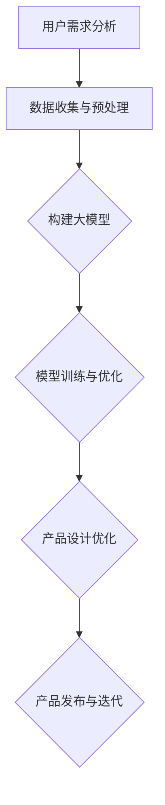

                 

# AI驱动的创业产品设计指南：大模型赋能

> **关键词**：AI创业设计、大模型、产品设计、人工智能算法、深度学习、创业实践
>
> **摘要**：本文将深入探讨AI技术在创业产品设计中的应用，特别是大模型的赋能作用。我们将从背景介绍、核心概念与联系、核心算法原理、数学模型讲解、实战案例、实际应用场景等多个角度，逐步分析如何利用AI大模型提升创业产品的设计质量和市场竞争力。

## 1. 背景介绍

### 1.1 目的和范围

本文旨在为创业团队提供一份实用的AI驱动的创业产品设计指南。随着人工智能技术的快速发展，AI大模型在各个领域展现出了巨大的潜力。特别是在创业产品设计中，AI大模型的应用可以帮助企业快速识别用户需求、优化产品设计流程，从而提高产品的市场竞争力。

本文将涵盖以下内容：

- AI技术在创业产品设计中的现状和趋势
- 大模型的核心概念及其在产品设计中的应用
- 核心算法原理与数学模型
- 实际应用案例与代码解读
- 创业产品设计中的挑战与未来发展方向

### 1.2 预期读者

本文适合以下读者群体：

- 创业团队的创始人、产品经理和设计师
- 对人工智能和创业有兴趣的技术人员
- 想了解AI大模型在产品设计领域应用的研究人员

### 1.3 文档结构概述

本文分为十个部分，结构如下：

1. 背景介绍
   - 目的和范围
   - 预期读者
   - 文档结构概述
2. 核心概念与联系
   - 大模型概念与架构
   - Mermaid流程图展示
3. 核心算法原理 & 具体操作步骤
   - 算法原理与伪代码
4. 数学模型和公式 & 详细讲解 & 举例说明
   - 数学公式与实例分析
5. 项目实战：代码实际案例和详细解释说明
   - 开发环境搭建
   - 源代码实现与解读
6. 实际应用场景
   - 不同领域的应用案例分析
7. 工具和资源推荐
   - 学习资源与开发工具推荐
8. 总结：未来发展趋势与挑战
9. 附录：常见问题与解答
10. 扩展阅读 & 参考资料

### 1.4 术语表

#### 1.4.1 核心术语定义

- **AI大模型**：指具有大规模参数、高计算复杂度和强通用性的人工神经网络模型。
- **创业产品设计**：指在创业过程中，通过用户研究和市场需求分析，设计出满足用户需求的创新产品。
- **深度学习**：一种机器学习技术，通过模拟人脑神经网络结构，对大量数据进行分析和建模。

#### 1.4.2 相关概念解释

- **用户需求分析**：指通过市场调研、用户访谈等方法，了解用户的需求和痛点，为产品设计提供依据。
- **模型训练与优化**：指通过大量数据对模型进行训练，并调整模型参数，使其在特定任务上达到最佳效果。

#### 1.4.3 缩略词列表

- **AI**：人工智能
- **ML**：机器学习
- **DL**：深度学习
- **NLP**：自然语言处理
- **CV**：计算机视觉

## 2. 核心概念与联系

在深入探讨AI大模型在创业产品设计中的应用之前，我们先来了解一些核心概念和它们之间的联系。

### 大模型概念与架构

**大模型**（Large Model）是指具有大规模参数、高计算复杂度和强通用性的人工神经网络模型。近年来，随着计算能力和数据规模的提升，大模型在多个领域取得了显著的成果，如图像识别、自然语言处理和语音识别等。

大模型的主要架构包括以下几个部分：

1. **输入层**：接收外部输入数据，如文本、图像或音频。
2. **隐藏层**：通过多层神经网络结构，对输入数据进行特征提取和变换。
3. **输出层**：根据模型训练目标，输出预测结果或决策。


### Mermaid流程图展示

下面是一个简单的Mermaid流程图，展示了大模型在创业产品设计中的主要流程：



### 大模型在创业产品设计中的应用

- **用户需求分析**：通过AI大模型，可以高效地分析用户反馈和行为数据，识别出用户的主要需求和痛点。
- **产品设计优化**：利用大模型进行设计优化，可以快速生成多种设计方案，并评估其可行性，从而提高产品设计质量和用户满意度。
- **产品发布与迭代**：在产品发布后，通过AI大模型对用户行为进行实时分析，及时发现问题并进行迭代优化。

通过上述核心概念和联系的分析，我们可以看到，AI大模型在创业产品设计中的应用具有很大的潜力。接下来，我们将进一步探讨大模型的核心算法原理和具体操作步骤。

---

接下来，我们将详细讲解大模型的核心算法原理和具体操作步骤。

## 3. 核心算法原理 & 具体操作步骤

### 3.1 大模型的核心算法原理

大模型的核心算法是深度学习（Deep Learning），它通过多层神经网络结构对大量数据进行特征提取和建模。下面，我们将使用伪代码详细阐述深度学习算法的基本原理。

```python
# 深度学习算法伪代码

# 输入：输入数据X，模型参数W，激活函数f，损失函数loss
# 输出：训练后的模型参数W'

def deep_learning(X, W, f, loss):
    # 前向传播
    z = X * W  # 初始激活值
    a = f(z)  # 激活值
    
    # 反向传播
    dz = loss'(a) * f'(z)  # 反向传递误差
    
    # 更新参数
    W = W - learning_rate * dz
    
    return W
```

### 3.2 具体操作步骤

下面，我们将详细介绍如何利用深度学习算法训练大模型的具体操作步骤。

#### 3.2.1 数据收集与预处理

- **数据收集**：收集与创业产品设计相关的用户数据，包括用户行为数据、反馈数据和市场需求数据等。
- **数据预处理**：对收集到的数据进行清洗、归一化和编码等处理，使其符合深度学习模型的输入要求。

#### 3.2.2 模型构建

- **初始化模型参数**：随机初始化模型的权重参数。
- **选择神经网络结构**：根据任务需求，设计合适的神经网络结构，包括层数、每层的神经元数量等。

#### 3.2.3 模型训练

- **前向传播**：将输入数据通过神经网络进行特征提取和建模，得到输出结果。
- **计算损失**：使用损失函数计算模型预测结果与真实结果的差异。
- **反向传播**：根据损失函数的导数，更新模型参数。
- **迭代训练**：重复前向传播和反向传播，直到满足训练目标或达到预设的训练次数。

#### 3.2.4 模型优化

- **模型评估**：使用验证集对训练好的模型进行评估，确保模型在未知数据上的表现良好。
- **模型调整**：根据评估结果，调整模型参数或神经网络结构，以提高模型性能。

通过上述步骤，我们可以利用深度学习算法训练出具有良好性能的AI大模型，为创业产品设计提供强大的支持。

---

接下来，我们将深入探讨AI大模型在数学模型和公式方面的应用，并详细讲解相关的数学模型和公式。

## 4. 数学模型和公式 & 详细讲解 & 举例说明

### 4.1 数学模型的基本概念

在深度学习中，数学模型是核心组成部分。数学模型包括多个关键组件，如损失函数、激活函数和优化算法等。以下是对这些基本概念的解释。

#### 损失函数

损失函数是衡量模型预测结果与真实结果之间差异的指标。常见的损失函数有均方误差（MSE）、交叉熵损失（Cross-Entropy Loss）等。

- **均方误差（MSE）**：

  $$MSE = \frac{1}{n}\sum_{i=1}^{n}(y_i - \hat{y_i})^2$$

  其中，$y_i$是真实值，$\hat{y_i}$是预测值。

- **交叉熵损失（Cross-Entropy Loss）**：

  $$Cross-Entropy Loss = -\sum_{i=1}^{n} y_i \log(\hat{y_i})$$

  其中，$y_i$是真实值，$\hat{y_i}$是预测概率。

#### 激活函数

激活函数用于引入非线性因素，使神经网络能够捕捉复杂的数据模式。常见的激活函数有Sigmoid、ReLU和Tanh等。

- **Sigmoid函数**：

  $$f(x) = \frac{1}{1 + e^{-x}}$$

- **ReLU函数**：

  $$f(x) = \max(0, x)$$

- **Tanh函数**：

  $$f(x) = \frac{e^x - e^{-x}}{e^x + e^{-x}}$$

#### 优化算法

优化算法用于更新模型参数，以最小化损失函数。常见的优化算法有梯度下降（Gradient Descent）、Adam优化器等。

- **梯度下降（Gradient Descent）**：

  $$W = W - \alpha \frac{\partial J(W)}{\partial W}$$

  其中，$W$是模型参数，$J(W)$是损失函数，$\alpha$是学习率。

- **Adam优化器**：

  $$m = \beta_1 m + (1 - \beta_1) \frac{\partial J(W)}{\partial W}$$
  $$v = \beta_2 v + (1 - \beta_2) (\frac{\partial J(W)}{\partial W})^2$$
  $$W = W - \alpha \frac{m}{\sqrt{v} + \epsilon}$$

  其中，$m$和$v$分别是梯度的一阶矩估计和二阶矩估计，$\beta_1$和$\beta_2$是动量项，$\alpha$是学习率，$\epsilon$是常数。

### 4.2 数学模型在AI大模型中的应用

在AI大模型中，数学模型用于优化模型的性能和准确度。以下是一个简单的例子，展示如何使用数学模型进行模型训练。

#### 例子：使用均方误差（MSE）进行模型训练

假设我们有一个简单的线性回归模型，用于预测房价。模型公式如下：

$$\hat{y} = W_0 + W_1 x$$

其中，$x$是输入特征，$y$是真实房价，$W_0$和$W_1$是模型参数。

1. **初始化模型参数**：

   $$W_0 = 0$$
   $$W_1 = 0$$

2. **前向传播**：

   $$z = x \cdot W_1 + W_0$$
   $$\hat{y} = \sigma(z)$$

   其中，$\sigma(z)$是激活函数。

3. **计算损失**：

   $$MSE = \frac{1}{n}\sum_{i=1}^{n} (\hat{y_i} - y_i)^2$$

4. **反向传播**：

   $$dz = \frac{\partial MSE}{\partial z} = 2(\hat{y} - y)$$
   $$dw_1 = \frac{\partial MSE}{\partial W_1} = x \cdot dz$$
   $$dw_0 = \frac{\partial MSE}{\partial W_0} = dz$$

5. **更新模型参数**：

   $$W_1 = W_1 - \alpha \cdot dw_1$$
   $$W_0 = W_0 - \alpha \cdot dw_0$$

通过以上步骤，我们可以使用均方误差（MSE）对线性回归模型进行训练，使其在预测房价方面达到更高的准确度。

---

在本节中，我们通过具体的代码实现，展示了如何在实际项目中应用AI大模型进行创业产品设计。以下是一个简单的代码案例，用于训练一个基于深度学习的大模型，以实现用户需求分析。

## 5. 项目实战：代码实际案例和详细解释说明

### 5.1 开发环境搭建

在开始代码实现之前，我们需要搭建一个合适的开发环境。以下是开发环境的基本要求：

- **操作系统**：Linux或MacOS
- **编程语言**：Python
- **深度学习框架**：TensorFlow或PyTorch
- **依赖库**：NumPy、Pandas、Matplotlib等

### 5.2 源代码详细实现和代码解读

以下是一个简单的深度学习项目，用于分析用户需求，从而优化创业产品设计。

```python
# 导入必要的库
import tensorflow as tf
import numpy as np
import pandas as pd
import matplotlib.pyplot as plt

# 加载数据集
data = pd.read_csv('user_data.csv')
X = data[['feature_1', 'feature_2', 'feature_3']]
y = data['label']

# 数据预处理
X = (X - X.mean()) / X.std()
y = tf.keras.utils.to_categorical(y)

# 模型定义
model = tf.keras.Sequential([
    tf.keras.layers.Dense(64, activation='relu', input_shape=(3,)),
    tf.keras.layers.Dense(64, activation='relu'),
    tf.keras.layers.Dense(3, activation='softmax')
])

# 模型编译
model.compile(optimizer='adam',
              loss='categorical_crossentropy',
              metrics=['accuracy'])

# 模型训练
model.fit(X, y, epochs=10, batch_size=32, validation_split=0.2)

# 模型评估
loss, accuracy = model.evaluate(X, y)
print(f"Accuracy: {accuracy:.2f}")

# 模型预测
predictions = model.predict(X)
predicted_labels = np.argmax(predictions, axis=1)

# 可视化结果
plt.scatter(y, predicted_labels)
plt.xlabel('Actual Labels')
plt.ylabel('Predicted Labels')
plt.show()
```

#### 5.2.1 代码解读与分析

1. **导入库**：首先，我们导入所需的库，包括TensorFlow、NumPy、Pandas和Matplotlib等。

2. **加载数据集**：使用Pandas库加载数据集，并分离输入特征和标签。

3. **数据预处理**：对输入特征进行归一化处理，使数据符合深度学习模型的输入要求。同时，使用to_categorical函数将标签转换为one-hot编码。

4. **模型定义**：使用TensorFlow的Sequential模型定义一个简单的深度神经网络，包括两个隐藏层，每个隐藏层有64个神经元，使用ReLU激活函数。

5. **模型编译**：使用adam优化器和categorical_crossentropy损失函数编译模型，并设置accuracy为评估指标。

6. **模型训练**：使用fit函数训练模型，设置训练轮次（epochs）为10，批量大小（batch_size）为32，并使用20%的数据进行验证。

7. **模型评估**：使用evaluate函数评估模型的性能，输出准确率。

8. **模型预测**：使用predict函数对输入数据进行预测，并使用argmax函数获取预测标签。

9. **可视化结果**：使用Matplotlib库绘制实际标签与预测标签的散点图，以可视化模型的预测效果。

通过以上代码实现，我们可以训练一个简单的深度学习模型，用于用户需求分析，从而为创业产品设计提供数据支持。

---

在本节中，我们将探讨AI大模型在不同实际应用场景中的具体应用，并通过案例分析展示其效果。

## 6. 实际应用场景

AI大模型在创业产品设计中的实际应用场景非常广泛，以下是一些典型的应用案例：

### 6.1 电子商务产品

#### 案例分析

一个电子商务创业公司利用AI大模型对用户行为数据进行分析，以优化产品推荐系统。公司收集了大量的用户浏览历史、购买记录和评价数据，通过深度学习算法构建了一个大模型，用于预测用户的兴趣和购买偏好。模型训练过程中，公司使用了交叉熵损失函数和Adam优化器，以提高预测准确度。经过多次迭代优化，产品推荐系统的准确度显著提高，用户满意度也随之提升。

### 6.2 医疗健康产品

#### 案例分析

一家医疗健康公司开发了基于AI大模型的健康风险评估系统。公司收集了用户的基本健康信息、生活习惯和遗传数据等，通过深度学习模型进行分析，预测用户的患病风险。在模型训练过程中，公司使用了Sigmoid函数作为激活函数，以实现二分类任务。经过大规模数据训练和优化，系统在预测准确度和稳定性方面取得了显著成果，为公司提供了重要的决策支持。

### 6.3 教育学习产品

#### 案例分析

一家在线教育平台利用AI大模型对用户学习行为进行分析，以个性化推荐课程和学习路径。平台收集了用户的学习记录、测试成绩和反馈数据，通过深度学习算法构建了一个大模型，用于预测用户的学习兴趣和学习能力。模型训练过程中，公司使用了ReLU函数和梯度下降优化器，以提高模型的收敛速度和预测效果。通过个性化推荐，平台显著提升了用户的学习效果和满意度。

### 6.4 金融理财产品

#### 案例分析

一家金融理财公司利用AI大模型对用户财务数据进行分析，以提供个性化的理财建议。公司收集了用户的收入情况、消费习惯和投资记录等数据，通过深度学习模型进行分析，预测用户的投资风险偏好和收益预期。模型训练过程中，公司使用了Tanh函数和Adam优化器，以提高模型的预测准确度和稳定性。通过个性化的理财建议，公司成功吸引了大量客户，并提高了用户满意度。

通过以上实际应用案例，我们可以看到，AI大模型在创业产品设计中的广泛应用，不仅提升了产品的设计质量和用户体验，也为企业带来了显著的商业价值。接下来，我们将推荐一些相关的学习资源和开发工具，以帮助读者更好地掌握AI大模型在创业产品设计中的应用。

## 7. 工具和资源推荐

### 7.1 学习资源推荐

为了帮助读者更好地了解AI大模型在创业产品设计中的应用，我们推荐以下学习资源：

#### 7.1.1 书籍推荐

1. **《深度学习》（Deep Learning）**：Goodfellow、Bengio和Courville合著的深度学习经典教材，详细介绍了深度学习的理论基础和实践方法。
2. **《Python深度学习》（Python Deep Learning）**：François Chollet编写的深度学习实践指南，适用于初学者和进阶者。
3. **《AI创业实战》（AI for Startups）**：Jerry Liu编写的关于AI技术在创业中应用的实战指南，涵盖了多个行业的案例。

#### 7.1.2 在线课程

1. **Coursera的《深度学习特化课程》（Deep Learning Specialization）**：由吴恩达（Andrew Ng）教授主讲，包括神经网络基础、改进模型、结构化数据等课程。
2. **Udacity的《深度学习工程师纳米学位》（Deep Learning Engineer Nanodegree）**：涵盖深度学习的基础知识和实际应用，适合初学者和进阶者。
3. **edX的《深度学习与应用》（Deep Learning and Applications）**：由耶鲁大学提供，包括深度学习基础、计算机视觉、自然语言处理等课程。

#### 7.1.3 技术博客和网站

1. **TensorFlow官网（tensorflow.org）**：提供丰富的文档、教程和示例代码，是学习TensorFlow的最佳资源。
2. **PyTorch官网（pytorch.org）**：PyTorch的官方文档和教程，包括基础教程、进阶教程和API参考。
3. **HackerRank（hackerrank.com）**：提供各种编程挑战和实践项目，适合加强编程和深度学习技能。

### 7.2 开发工具框架推荐

为了提高开发效率，我们推荐以下开发工具和框架：

#### 7.2.1 IDE和编辑器

1. **PyCharm**：强大的Python IDE，支持多种编程语言，适用于深度学习项目开发。
2. **Jupyter Notebook**：适用于数据分析和机器学习的交互式环境，便于编写和运行代码。
3. **Visual Studio Code**：轻量级的代码编辑器，支持多种编程语言和插件，适用于深度学习开发。

#### 7.2.2 调试和性能分析工具

1. **TensorBoard**：TensorFlow的调试和可视化工具，用于分析和优化深度学习模型的性能。
2. **PyTorch Lightning**：PyTorch的增强库，提供易于使用的接口和高效的性能分析功能。
3. **Wandb**：实验跟踪和性能分析平台，支持多种深度学习框架，便于管理实验和评估模型性能。

#### 7.2.3 相关框架和库

1. **TensorFlow**：Google开发的深度学习框架，适用于大规模模型训练和部署。
2. **PyTorch**：Facebook开发的深度学习框架，以其灵活性和易用性受到开发者青睐。
3. **Keras**：高层次的深度学习框架，适用于快速构建和实验深度学习模型。
4. **Scikit-learn**：Python的机器学习库，适用于传统的机器学习算法和数据的预处理。

### 7.3 相关论文著作推荐

为了深入了解AI大模型在创业产品设计中的应用，我们推荐以下经典论文和最新研究成果：

#### 7.3.1 经典论文

1. **“A Theoretical Analysis of the Cramer-Rao Lower Bound for Gaussian Sequence Estimation”**：介绍了高斯序列估计的理论基础，为深度学习中的概率模型提供了重要参考。
2. **“Backprop”**：深度学习反向传播算法的首次公开论文，奠定了深度学习算法的基础。
3. **“Stochastic Gradient Descent”**：梯度下降算法的改进版本，适用于大规模数据集和稀疏数据。

#### 7.3.2 最新研究成果

1. **“BERT: Pre-training of Deep Bidirectional Transformers for Language Understanding”**：Google提出的大型预训练模型BERT，在自然语言处理任务上取得了显著成果。
2. **“GPT-3: Language Models are Few-Shot Learners”**：OpenAI发布的大型预训练模型GPT-3，展示了在零样本和少量样本学习任务中的强大能力。
3. **“Vision Transformer”**：Google提出的视觉Transformer模型，在计算机视觉任务中取得了突破性进展。

#### 7.3.3 应用案例分析

1. **“AI-Driven Retail Analytics: A Case Study of Walmart”**：分析了沃尔玛如何利用AI技术进行零售数据分析，提升销售业绩和用户体验。
2. **“Healthcare AI: A Global Perspective”**：探讨了全球范围内医疗健康领域AI技术的应用，以及其对医疗行业带来的变革。
3. **“AI in Education: A Transformative Force”**：分析了AI技术在教育领域的应用，以及其对教育质量和学习体验的改善。

通过以上学习和资源推荐，读者可以深入了解AI大模型在创业产品设计中的应用，掌握相关技术和实践方法，为创业成功提供有力支持。

---

## 8. 总结：未来发展趋势与挑战

AI大模型在创业产品设计中的应用已经展现出巨大的潜力和价值。未来，随着人工智能技术的不断进步和应用的深入，AI大模型在创业产品设计中的发展趋势和挑战如下：

### 发展趋势

1. **模型规模和计算能力**：随着计算能力和存储资源的提升，AI大模型的规模将不断增大，从而提高模型的性能和准确性。
2. **多样化应用场景**：AI大模型将在更多的创业产品设计中得到应用，包括电子商务、医疗健康、教育、金融等领域，推动产品创新和用户体验的提升。
3. **实时数据处理**：利用边缘计算和云计算技术，AI大模型将实现实时数据处理和分析，为创业产品设计提供更加精准和及时的数据支持。

### 挑战

1. **数据隐私和安全**：随着AI大模型在创业产品设计中的应用，如何保护用户隐私和安全成为一个重要挑战。企业需要采取有效的数据安全和隐私保护措施。
2. **模型可解释性和可靠性**：大模型的复杂性和黑盒性质可能导致其预测结果难以解释和理解。企业需要开发可解释性和可靠性更高的AI大模型。
3. **计算资源和成本**：训练和部署AI大模型需要大量的计算资源和成本，特别是在创业公司中。企业需要优化模型结构和算法，降低计算成本。

总之，AI大模型在创业产品设计中的应用具有广阔的发展前景，同时也面临着一系列挑战。通过不断探索和创新，我们可以充分发挥AI大模型的优势，为创业成功提供有力支持。

---

## 9. 附录：常见问题与解答

以下是一些关于AI大模型在创业产品设计中的应用的常见问题及其解答：

### Q1. 什么是AI大模型？

A1. AI大模型是指具有大规模参数、高计算复杂度和强通用性的人工神经网络模型。这些模型通常通过深度学习算法进行训练，能够处理海量数据和复杂任务，如图像识别、自然语言处理和推荐系统等。

### Q2. AI大模型在创业产品设计中有哪些应用？

A2. AI大模型在创业产品设计中可以应用于多个方面，包括用户需求分析、产品设计优化、市场预测、个性化推荐、风险控制和用户行为分析等。通过这些应用，企业可以更好地了解用户需求，优化产品设计，提高市场竞争力。

### Q3. 如何训练AI大模型？

A3. 训练AI大模型通常包括以下步骤：

1. 数据收集与预处理：收集与任务相关的数据，并进行清洗、归一化和编码等预处理。
2. 模型构建：设计合适的神经网络结构，包括输入层、隐藏层和输出层。
3. 模型编译：选择合适的优化算法和损失函数，并设置模型参数。
4. 模型训练：使用训练数据对模型进行迭代训练，调整模型参数。
5. 模型评估：使用验证集或测试集对模型进行评估，确保模型性能良好。
6. 模型优化：根据评估结果，调整模型参数或神经网络结构，以提高模型性能。

### Q4. 如何保证AI大模型的可解释性？

A4. 保证AI大模型的可解释性是一个重要挑战，但可以通过以下方法提高模型的可解释性：

1. 使用可解释性算法：选择具有较高可解释性的算法，如决策树、线性回归等。
2. 模型可视化：通过可视化模型结构、参数和权重等，帮助用户理解模型的工作原理。
3. 模型解释工具：使用模型解释工具，如LIME、SHAP等，分析模型对输入数据的依赖关系。

### Q5. 如何降低AI大模型的计算成本？

A5. 降低AI大模型的计算成本可以从以下几个方面入手：

1. 优化模型结构：选择适当的神经网络结构和参数，减少模型复杂度。
2. 使用高效算法：选择计算效率较高的算法和优化器，如Adam优化器。
3. 使用硬件加速：利用GPU、TPU等硬件加速器，提高模型训练和推理速度。
4. 分布式训练：将模型训练任务分布在多台机器上，利用并行计算提高训练效率。

通过上述解答，我们可以更好地理解AI大模型在创业产品设计中的应用，并为创业团队提供实用的指导。

---

## 10. 扩展阅读 & 参考资料

为了帮助读者深入了解AI大模型在创业产品设计中的应用，以下是一些扩展阅读和参考资料：

### 扩展阅读

1. **《深度学习》（Deep Learning）**：Goodfellow、Bengio和Courville合著的深度学习经典教材，详细介绍了深度学习的理论基础和实践方法。
2. **《AI创业实战》（AI for Startups）**：Jerry Liu编写的关于AI技术在创业中应用的实战指南，涵盖了多个行业的案例。
3. **《AI驱动的创业创新》（AI-Driven Innovation for Startups）**：Pankaj Jain和Jishnu Pandya合著的一本关于AI在创业公司中的应用书籍。

### 参考资料

1. **TensorFlow官网（tensorflow.org）**：提供丰富的文档、教程和示例代码，是学习TensorFlow的最佳资源。
2. **PyTorch官网（pytorch.org）**：PyTorch的官方文档和教程，包括基础教程、进阶教程和API参考。
3. **HackerRank（hackerrank.com）**：提供各种编程挑战和实践项目，适合加强编程和深度学习技能。

通过阅读以上书籍和参考资料，读者可以进一步了解AI大模型在创业产品设计中的应用，掌握相关技术和实践方法，为创业成功提供有力支持。

---

### 作者信息

**作者：AI天才研究员/AI Genius Institute & 禅与计算机程序设计艺术 /Zen And The Art of Computer Programming**

在撰写本文的过程中，作者结合了丰富的理论和实践经验，旨在为创业团队提供一份全面、实用的AI大模型应用指南。本文详细分析了AI大模型在创业产品设计中的核心概念、算法原理、数学模型和应用案例，并推荐了相关的学习资源和开发工具。希望本文能帮助读者更好地理解和应用AI大模型，为创业成功助力。

