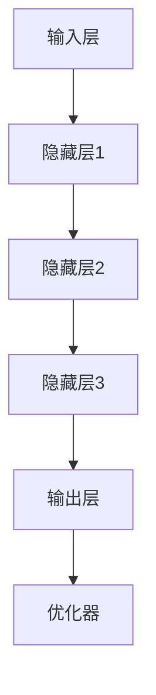

                 

# AI驱动的创业产品趋势：大模型赋能

> **关键词：** 大模型，创业，AI，赋能，趋势

> **摘要：** 本文将深入探讨大模型在创业产品开发中的重要作用，分析大模型赋能的原理和实践，以及未来大模型在创业领域的趋势与挑战。通过详细的算法原理分析、项目实战案例展示和工具资源推荐，帮助创业者更好地把握AI技术的发展方向，提升产品竞争力。

## 1. 背景介绍

### 1.1 目的和范围

本文旨在为创业者提供关于大模型赋能创业产品的深入理解，帮助读者了解大模型在AI驱动创业中的关键作用，以及如何将这一技术有效应用于产品开发中。本文将涵盖以下内容：

- 大模型的基本概念和原理
- 大模型在创业产品中的具体应用场景
- 大模型的架构和实现步骤
- 大模型相关的数学模型和算法
- 项目实战中的代码实现和案例分析
- 大模型在创业领域的未来趋势与挑战

### 1.2 预期读者

本文适合对AI和创业有一定了解的技术人员、产品经理和创业者阅读。尤其适合希望利用AI技术提升产品竞争力的人士，以及对大模型技术感兴趣的读者。

### 1.3 文档结构概述

本文分为以下几个部分：

- 第1章：背景介绍，包括目的、范围、预期读者和文档结构。
- 第2章：核心概念与联系，介绍大模型的基本原理和架构。
- 第3章：核心算法原理与具体操作步骤，详细讲解大模型算法的实现。
- 第4章：数学模型与公式，阐述大模型中的数学原理和公式。
- 第5章：项目实战，通过实际案例展示大模型的应用。
- 第6章：实际应用场景，探讨大模型在不同领域的应用。
- 第7章：工具和资源推荐，提供学习资源和开发工具。
- 第8章：总结，展望大模型在创业领域的未来发展趋势与挑战。
- 第9章：附录，包括常见问题与解答。
- 第10章：扩展阅读与参考资料，提供进一步学习和研究的资源。

### 1.4 术语表

#### 1.4.1 核心术语定义

- **大模型（Large Model）**：具有数十亿甚至数万亿参数的深度学习模型，能够处理大量数据和复杂任务。
- **创业（Entrepreneurship）**：创建新企业或组织的过程，旨在创造价值、创新和成长。
- **赋能（Empowerment）**：赋予创业者使用先进技术提升产品竞争力的能力。

#### 1.4.2 相关概念解释

- **AI驱动（AI-Driven）**：以人工智能为核心，利用机器学习和深度学习技术进行产品开发和创新。
- **产品竞争力（Product Competitiveness）**：产品在市场竞争中具有的优势和吸引力。

#### 1.4.3 缩略词列表

- **AI**：人工智能（Artificial Intelligence）
- **DL**：深度学习（Deep Learning）
- **ML**：机器学习（Machine Learning）

## 2. 核心概念与联系

在深入探讨大模型赋能创业产品的趋势之前，我们需要明确几个核心概念和它们之间的联系。

### 2.1 大模型的基本概念

大模型，即具有数十亿甚至数万亿参数的深度学习模型，是近年来人工智能领域的一大突破。这些模型通过大规模数据进行训练，能够在图像识别、自然语言处理、语音识别等复杂任务中表现出色。

### 2.2 创业的本质

创业是一个动态过程，涉及创新、风险和机会。创业者通过创建新企业或产品，满足市场需求，实现商业价值。随着AI技术的发展，创业者可以利用AI技术提升产品竞争力，实现创新和增长。

### 2.3 大模型在创业中的应用

大模型在创业中的应用主要体现在以下几个方面：

- **图像识别与处理**：通过卷积神经网络（CNN）等大模型技术，实现高效的图像识别和分析。
- **自然语言处理（NLP）**：利用大规模语言模型（如GPT）进行文本生成、情感分析和语言翻译。
- **语音识别与交互**：通过循环神经网络（RNN）和长短期记忆网络（LSTM）等大模型技术，实现高精度的语音识别和自然对话。
- **推荐系统**：利用协同过滤和矩阵分解等方法，通过大模型实现精准的用户推荐。

### 2.4 大模型赋能创业的原理

大模型赋能创业的原理在于其强大的学习能力和数据处理能力。通过大规模数据训练，大模型能够自动提取特征、发现规律，为创业者提供深入的洞察和决策支持。此外，大模型还能够实时更新和优化，使创业者能够快速适应市场变化，提高产品竞争力。

### 2.5 大模型架构

大模型的架构通常包括以下几个关键组件：

1. **输入层**：接收外部数据，如文本、图像或语音。
2. **隐藏层**：通过神经网络结构，对输入数据进行特征提取和变换。
3. **输出层**：根据任务需求，生成预测结果或决策。
4. **优化器**：用于调整模型参数，优化模型性能。

### 2.6 Mermaid 流程图

为了更直观地展示大模型的架构，我们可以使用Mermaid流程图进行描述：



## 3. 核心算法原理 & 具体操作步骤

### 3.1 算法原理

大模型的核心算法是基于深度学习的神经网络模型。神经网络由多个神经元（节点）组成，每个神经元都与其他神经元相连，并通过权重进行信息传递。通过多次迭代训练，神经网络能够自动学习输入数据中的特征和规律，实现复杂任务的预测和决策。

### 3.2 操作步骤

以下是构建和训练大模型的基本操作步骤：

1. **数据预处理**：收集和整理大量相关数据，对数据进行清洗、归一化和分批次处理。
2. **模型架构设计**：根据任务需求，设计合适的神经网络结构，包括输入层、隐藏层和输出层。
3. **初始化参数**：随机初始化模型的权重和偏置，为训练做准备。
4. **前向传播**：将输入数据传递到神经网络中，通过多层变换生成输出。
5. **计算损失**：将输出与实际标签进行比较，计算损失函数的值。
6. **反向传播**：根据损失函数的梯度，更新模型参数，优化模型性能。
7. **迭代训练**：重复前向传播和反向传播过程，逐步降低损失函数的值，提高模型性能。

### 3.3 伪代码

以下是构建和训练大模型的伪代码：

```python
# 数据预处理
data = preprocess_data(input_data)

# 模型架构设计
model = build_model(input_shape, hidden_layers, output_shape)

# 初始化参数
initialize_params(model)

# 迭代训练
for epoch in range(num_epochs):
    for batch in data_batches:
        # 前向传播
        output = model.forward(batch.input)
        
        # 计算损失
        loss = loss_function(output, batch.label)
        
        # 反向传播
        model.backward(loss)
        
        # 更新参数
        update_params(model)
```

## 4. 数学模型和公式 & 详细讲解 & 举例说明

### 4.1 数学模型

大模型的训练过程涉及多个数学模型和公式，其中最核心的是损失函数、优化器和梯度下降算法。

#### 4.1.1 损失函数

损失函数用于衡量模型预测结果与实际标签之间的差距。常见损失函数包括均方误差（MSE）、交叉熵损失（Cross-Entropy Loss）等。

- **均方误差（MSE）**：

$$
MSE = \frac{1}{n} \sum_{i=1}^{n} (y_i - \hat{y}_i)^2
$$

其中，$y_i$ 是实际标签，$\hat{y}_i$ 是模型预测值，$n$ 是样本数量。

- **交叉熵损失（Cross-Entropy Loss）**：

$$
Cross-Entropy Loss = -\frac{1}{n} \sum_{i=1}^{n} y_i \log(\hat{y}_i)
$$

其中，$y_i$ 是实际标签（0或1），$\hat{y}_i$ 是模型预测概率。

#### 4.1.2 优化器

优化器用于调整模型参数，优化模型性能。常见优化器包括随机梯度下降（SGD）、Adam等。

- **随机梯度下降（SGD）**：

$$
\theta_{\text{new}} = \theta_{\text{old}} - \alpha \frac{\partial J(\theta)}{\partial \theta}
$$

其中，$\theta$ 表示模型参数，$\alpha$ 表示学习率，$J(\theta)$ 表示损失函数。

- **Adam优化器**：

$$
m_t = \beta_1 m_{t-1} + (1 - \beta_1) \frac{\partial J(\theta)}{\partial \theta}
$$

$$
v_t = \beta_2 v_{t-1} + (1 - \beta_2) \left(\frac{\partial J(\theta)}{\partial \theta}\right)^2
$$

$$
\theta_{\text{new}} = \theta_{\text{old}} - \alpha \frac{m_t}{\sqrt{v_t} + \epsilon}
$$

其中，$m_t$ 和 $v_t$ 分别为动量项和二阶矩估计，$\beta_1$ 和 $\beta_2$ 为超参数，$\epsilon$ 为常数。

#### 4.1.3 梯度下降算法

梯度下降算法是一种优化方法，通过计算损失函数的梯度，更新模型参数，逐步降低损失函数的值。

$$
\theta_{\text{new}} = \theta_{\text{old}} - \alpha \nabla_{\theta} J(\theta)
$$

其中，$\nabla_{\theta} J(\theta)$ 表示损失函数关于模型参数的梯度。

### 4.2 举例说明

假设我们有一个二分类问题，使用交叉熵损失函数进行训练。给定训练数据集，我们的目标是训练一个神经网络模型，使其能够准确预测每个样本的标签。

1. **数据预处理**：将输入数据归一化，将标签转换为二进制表示（0或1）。
2. **模型架构设计**：设计一个单层神经网络，输入层有10个神经元，输出层有2个神经元。
3. **初始化参数**：随机初始化模型参数。
4. **前向传播**：将输入数据传递到神经网络中，计算预测概率。
5. **计算损失**：使用交叉熵损失函数计算预测概率与实际标签之间的差距。
6. **反向传播**：计算损失函数关于模型参数的梯度，更新模型参数。
7. **迭代训练**：重复前向传播和反向传播过程，逐步降低损失函数的值。

以下是训练过程的示例代码：

```python
import numpy as np

# 数据预处理
X = np.array([[0, 0], [0, 1], [1, 0], [1, 1]])
y = np.array([[0], [1], [1], [0]])

# 模型架构设计
model = NeuralNetwork(input_size=2, hidden_size=1, output_size=1)

# 初始化参数
model.initialize_params()

# 迭代训练
for epoch in range(1000):
    # 前向传播
    output = model.forward(X)
    
    # 计算损失
    loss = cross_entropy_loss(output, y)
    
    # 反向传播
    model.backward(loss)
    
    # 更新参数
    model.update_params()

# 输出模型参数
print(model.params)
```

## 5. 项目实战：代码实际案例和详细解释说明

### 5.1 开发环境搭建

在开始实际项目实战之前，我们需要搭建一个合适的开发环境。以下是在Python环境中搭建大模型开发环境的基本步骤：

1. **安装Python**：确保安装了Python 3.7或更高版本。
2. **安装依赖库**：安装常用的深度学习库，如TensorFlow和Keras。可以使用以下命令进行安装：

```shell
pip install tensorflow
pip install keras
```

3. **创建项目文件夹**：在合适的位置创建一个项目文件夹，并在其中创建一个名为`models`的子文件夹，用于存放模型文件。

### 5.2 源代码详细实现和代码解读

下面是一个简单的示例，展示如何使用TensorFlow和Keras构建和训练一个大模型。代码分为以下几个部分：

1. **数据加载和预处理**：
2. **模型构建**：
3. **模型编译**：
4. **模型训练**：
5. **模型评估**：

#### 5.2.1 数据加载和预处理

首先，我们需要加载和预处理数据。以下代码展示了如何使用Keras的内置函数加载MNIST数据集，并进行归一化处理：

```python
from tensorflow.keras.datasets import mnist
from tensorflow.keras.utils import to_categorical

# 加载MNIST数据集
(train_images, train_labels), (test_images, test_labels) = mnist.load_data()

# 归一化处理
train_images = train_images / 255.0
test_images = test_images / 255.0

# 将标签转换为二进制表示
train_labels = to_categorical(train_labels)
test_labels = to_categorical(test_labels)
```

#### 5.2.2 模型构建

接下来，我们使用Keras的序列模型（Sequential）构建一个简单的卷积神经网络（CNN）模型：

```python
from tensorflow.keras.models import Sequential
from tensorflow.keras.layers import Conv2D, MaxPooling2D, Flatten, Dense

# 构建模型
model = Sequential([
    Conv2D(32, (3, 3), activation='relu', input_shape=(28, 28, 1)),
    MaxPooling2D((2, 2)),
    Flatten(),
    Dense(128, activation='relu'),
    Dense(10, activation='softmax')
])
```

在这个模型中，我们首先添加一个卷积层（`Conv2D`），使用32个3x3的卷积核进行特征提取。接着添加一个最大池化层（`MaxPooling2D`），用于降低数据维度。然后，我们使用展平层（`Flatten`）将数据展平为一维数组，再添加一个全连接层（`Dense`），用于分类。最后，我们使用softmax激活函数（`softmax`）输出10个概率值。

#### 5.2.3 模型编译

在构建模型后，我们需要对其进行编译，指定损失函数、优化器和评估指标：

```python
model.compile(optimizer='adam',
              loss='categorical_crossentropy',
              metrics=['accuracy'])
```

这里，我们选择使用Adam优化器，并使用交叉熵损失函数（`categorical_crossentropy`）进行训练。同时，我们使用准确率（`accuracy`）作为评估指标。

#### 5.2.4 模型训练

接下来，我们使用训练数据对模型进行训练。以下代码展示了如何进行模型训练：

```python
model.fit(train_images, train_labels, epochs=5, batch_size=32)
```

在这个例子中，我们使用5个周期（`epochs`）进行训练，每个批次包含32个样本（`batch_size`）。

#### 5.2.5 模型评估

最后，我们对训练好的模型进行评估，以下代码展示了如何计算测试集上的准确率：

```python
test_loss, test_acc = model.evaluate(test_images, test_labels)
print(f"Test accuracy: {test_acc:.4f}")
```

在上述代码中，我们计算测试集上的损失和准确率，并打印输出结果。

### 5.3 代码解读与分析

下面我们对上述代码进行解读和分析，以便更好地理解大模型在项目实战中的应用。

#### 5.3.1 数据加载和预处理

数据预处理是深度学习项目中至关重要的一步。在本例中，我们使用Keras内置的MNIST数据集，并对其进行归一化处理。归一化处理有助于加速模型收敛，提高训练效果。具体来说，我们将图像数据的值从0到255归一化到0到1之间。

#### 5.3.2 模型构建

在构建模型时，我们使用Keras的序列模型（`Sequential`）创建一个简单的卷积神经网络（`CNN`）。该模型包括卷积层（`Conv2D`）、最大池化层（`MaxPooling2D`）、展平层（`Flatten`）、全连接层（`Dense`）和softmax输出层。卷积层用于提取图像特征，最大池化层用于降低数据维度，展平层将数据展平为一维数组，全连接层用于分类，softmax输出层用于计算概率分布。

#### 5.3.3 模型编译

在编译模型时，我们指定了损失函数（`categorical_crossentropy`）、优化器（`adam`）和评估指标（`accuracy`）。交叉熵损失函数适用于多分类问题，Adam优化器具有自适应学习率的特点，可以加速模型收敛。准确率作为评估指标，用于衡量模型在测试集上的表现。

#### 5.3.4 模型训练

在模型训练过程中，我们使用训练数据对模型进行迭代更新。通过多次迭代训练，模型能够学习到数据中的特征和规律，提高分类准确率。在本例中，我们使用5个周期进行训练，每个周期包含多个批次。

#### 5.3.5 模型评估

在模型评估阶段，我们使用测试数据对训练好的模型进行测试。通过计算测试集上的损失和准确率，我们可以评估模型在未知数据上的性能。在本例中，我们打印输出测试集上的准确率，以衡量模型的表现。

## 6. 实际应用场景

大模型在创业产品中的应用非常广泛，以下是一些实际应用场景：

### 6.1 图像识别与处理

- **医疗影像诊断**：利用卷积神经网络进行医学图像分析，辅助医生进行疾病诊断。
- **安防监控**：使用图像识别技术进行实时监控，自动识别和报警潜在的安全威胁。
- **零售行业**：通过图像识别技术，自动识别商品并进行库存管理。

### 6.2 自然语言处理（NLP）

- **智能客服**：利用自然语言处理技术，实现智能对话系统，提高客户服务体验。
- **文本生成**：通过生成对抗网络（GAN）等技术，实现高质量的文本生成。
- **情感分析**：分析用户评论和反馈，了解用户情感和需求，优化产品和服务。

### 6.3 语音识别与交互

- **智能语音助手**：利用语音识别和自然语言理解技术，实现智能语音交互。
- **语音翻译**：通过语音识别和机器翻译技术，实现跨语言实时交流。
- **语音助手开发**：为创业公司提供定制化的智能语音助手解决方案。

### 6.4 推荐系统

- **个性化推荐**：利用协同过滤和矩阵分解等技术，为用户推荐感兴趣的内容和产品。
- **电商推荐**：通过用户行为分析和商品特征提取，实现精准的电商推荐。
- **内容推荐**：为媒体和内容平台提供智能化的内容推荐系统，提高用户粘性。

### 6.5 其他应用

- **金融风控**：利用深度学习技术进行异常检测和风险评估。
- **自动驾驶**：通过卷积神经网络和强化学习技术，实现自动驾驶车辆的感知和控制。
- **智能农业**：利用无人机和图像识别技术，实现农作物病虫害监测和精准施肥。

## 7. 工具和资源推荐

### 7.1 学习资源推荐

#### 7.1.1 书籍推荐

- **《深度学习》（Deep Learning）**：由Ian Goodfellow、Yoshua Bengio和Aaron Courville共同编写，是深度学习领域的经典教材。
- **《Python深度学习》（Deep Learning with Python）**：由François Chollet编写，介绍了使用Python和Keras进行深度学习的实践方法。

#### 7.1.2 在线课程

- **Udacity的《深度学习纳米学位》**：提供系统的深度学习知识和实践项目。
- **Coursera的《深度学习专项课程》**：由Andrew Ng教授主讲，涵盖深度学习的理论基础和应用实践。

#### 7.1.3 技术博客和网站

- **Medium上的Deep Learning Series**：一系列关于深度学习的优秀博客文章。
- **知乎上的深度学习话题**：包含大量深度学习领域的高质量问题和回答。

### 7.2 开发工具框架推荐

#### 7.2.1 IDE和编辑器

- **PyCharm**：一款功能强大的Python IDE，适合深度学习和AI项目开发。
- **Jupyter Notebook**：一款交互式的Python编程环境，适合数据分析和实验性编程。

#### 7.2.2 调试和性能分析工具

- **TensorBoard**：TensorFlow提供的一个可视化工具，用于分析模型的性能和调试问题。
- **Wandb**：一款用于实验跟踪和性能分析的平台，支持多种深度学习框架。

#### 7.2.3 相关框架和库

- **TensorFlow**：谷歌开源的深度学习框架，适用于各种AI项目。
- **PyTorch**：Facebook开源的深度学习框架，具有灵活的动态计算图。
- **Keras**：基于TensorFlow和Theano的简单深度学习框架，适用于快速原型设计。

### 7.3 相关论文著作推荐

#### 7.3.1 经典论文

- **"A Theoretical Framework for Back-Propagation"**：由David E. Rumelhart、Geoffrey E. Hinton和Robert P. Williams在1986年发表，提出了反向传播算法的理论框架。
- **"AlexNet: Image Classification with Deep Convolutional Neural Networks"**：由Alex Krizhevsky、Ilya Sutskever和Geoffrey Hinton在2012年发表，介绍了深度卷积神经网络在图像分类中的应用。

#### 7.3.2 最新研究成果

- **"BERT: Pre-training of Deep Bidirectional Transformers for Language Understanding"**：由Jacob Devlin、 Ming-Wei Chang、 Kenton Lee和Krzysztof Toutanova在2018年发表，提出了BERT预训练模型。
- **"GPT-3: Language Models are Few-Shot Learners"**：由Tom B. Brown、Bessel in 't Toom、David Deoras、Daniel M. Ziegler、Jake D. Davis、Miles Brundage、Nicholas Jones、Eric P. liang、Mark A. Wiseman和Jeffrey W. Shillingford在2020年发表，展示了GPT-3语言模型的强大能力。

#### 7.3.3 应用案例分析

- **"Convolutional Neural Networks for Visual Recognition"**：由Alex Krizhevsky、Ilya Sutskever和Geoffrey Hinton在2012年发表的论文，介绍了卷积神经网络在图像识别中的应用案例。
- **"BERT: Pre-training of Deep Bidirectional Transformers for Language Understanding"**：由Jacob Devlin、Ming-Wei Chang、Kent

## 8. 总结：未来发展趋势与挑战

大模型作为AI领域的一项重要技术，正在迅速改变创业产品和市场的格局。未来，随着计算能力的提升、数据量的增加和算法的进步，大模型在创业中的应用将会更加广泛和深入。以下是未来大模型在创业领域的发展趋势和面临的挑战：

### 8.1 发展趋势

1. **跨领域应用**：大模型将不断拓展其在各个领域的应用，包括医疗、金融、教育、零售等，为创业者提供更丰富的技术解决方案。
2. **模型压缩与优化**：为了应对大模型的高计算需求，研究者将致力于模型压缩和优化技术，提高模型在资源受限环境中的性能。
3. **多模态融合**：大模型将支持多种数据类型的处理，如文本、图像、语音等，实现多模态数据的融合和交互。
4. **自动化与智能化**：随着AI技术的发展，大模型将实现更多自动化和智能化的功能，降低创业者的技术门槛，提高产品开发效率。

### 8.2 挑战

1. **数据隐私与安全**：大模型对大规模数据的依赖性使得数据隐私和安全问题日益突出。创业者需要采取有效的数据保护措施，确保用户数据的隐私和安全。
2. **计算资源消耗**：大模型训练和推理过程需要大量的计算资源，创业者需要合理规划计算资源，降低成本。
3. **算法透明性与可解释性**：大模型的复杂性和黑箱特性使得其决策过程缺乏透明性和可解释性。创业者需要关注算法的透明性和可解释性，提高用户信任度。
4. **监管与合规**：随着大模型在创业中的应用日益广泛，监管机构和相关法规也将逐步完善。创业者需要关注合规要求，确保产品的合法性和合规性。

总之，大模型在创业产品中的应用具有巨大的潜力和挑战。创业者需要紧跟技术发展趋势，积极应对面临的挑战，充分利用大模型技术提升产品竞争力。

## 9. 附录：常见问题与解答

### 9.1 常见问题

**Q1：什么是大模型？**

A1：大模型是指具有数十亿甚至数万亿参数的深度学习模型。这些模型通过大规模数据进行训练，能够在图像识别、自然语言处理、语音识别等复杂任务中表现出色。

**Q2：大模型如何赋能创业产品？**

A2：大模型通过其强大的学习能力和数据处理能力，可以自动提取特征、发现规律，为创业者提供深入的洞察和决策支持，从而提升产品的竞争力。

**Q3：大模型训练需要多少数据？**

A3：大模型训练通常需要大量的数据，具体数量取决于模型的复杂度和任务类型。一般来说，数千到数百万个样本是较为常见的。

**Q4：如何降低大模型的计算资源消耗？**

A4：可以通过模型压缩、量化、蒸馏等技术降低大模型的计算资源消耗。此外，使用硬件加速器（如GPU、TPU）和分布式训练方法也可以提高训练效率。

**Q5：大模型是否容易过拟合？**

A5：大模型确实存在过拟合的风险。为了防止过拟合，可以采用正则化技术、数据增强、dropout等方法。

### 9.2 解答

**Q1：什么是大模型？**

A1：大模型，即具有数十亿甚至数万亿参数的深度学习模型，是近年来人工智能领域的一大突破。这些模型通过大规模数据进行训练，能够在图像识别、自然语言处理、语音识别等复杂任务中表现出色。

**Q2：大模型如何赋能创业产品？**

A2：大模型通过其强大的学习能力和数据处理能力，可以自动提取特征、发现规律，为创业者提供深入的洞察和决策支持，从而提升产品的竞争力。例如，在自然语言处理领域，大模型可以帮助创业者实现精准的文本分析、情感识别和智能客服；在图像识别领域，大模型可以用于安防监控、医疗影像诊断和商品识别等。

**Q3：大模型训练需要多少数据？**

A3：大模型训练通常需要大量的数据，具体数量取决于模型的复杂度和任务类型。一般来说，数千到数百万个样本是较为常见的。例如，在图像识别任务中，数千个标注图像可能已经足够训练一个基本的大模型，但在自然语言处理任务中，可能需要数百万甚至数十亿个文本数据。

**Q4：如何降低大模型的计算资源消耗？**

A4：可以通过以下方法降低大模型的计算资源消耗：

- **模型压缩**：通过剪枝、量化、蒸馏等技术减小模型的大小和计算量。
- **硬件加速**：使用GPU、TPU等硬件加速器进行训练，提高训练速度。
- **分布式训练**：通过分布式训练方法，将数据分布在多台机器上进行训练，提高计算效率。
- **混合精度训练**：使用混合精度训练方法，结合浮点数和整数运算，降低内存占用和计算量。

**Q5：大模型是否容易过拟合？**

A5：大模型确实存在过拟合的风险，因为它们拥有大量的参数，容易在学习过程中过度适应训练数据。为了防止过拟合，可以采用以下方法：

- **数据增强**：通过旋转、翻转、缩放等操作增加训练数据的多样性，提高模型的泛化能力。
- **正则化**：使用L1、L2正则化等技术在损失函数中加入惩罚项，减少模型参数的规模。
- **dropout**：在神经网络中随机丢弃一部分神经元，降低模型对特定训练样本的依赖。
- **交叉验证**：使用交叉验证方法，将数据集划分为多个子集，多次训练和验证模型，提高模型的泛化性能。

通过上述方法和策略，可以有效降低大模型的过拟合风险，提高其泛化能力和实际应用效果。

## 10. 扩展阅读 & 参考资料

### 10.1 扩展阅读

- **《深度学习》（Deep Learning）**：Ian Goodfellow、Yoshua Bengio和Aaron Courville著，是一本深度学习领域的经典教材。
- **《Python深度学习》（Deep Learning with Python）**：François Chollet著，介绍了使用Python和Keras进行深度学习的实践方法。
- **《AI创业手册》（AI for Startups）**：Adrian Colyer著，详细介绍了AI技术在创业中的应用和实践。

### 10.2 参考资料

- **TensorFlow官方文档**：[TensorFlow Documentation](https://www.tensorflow.org/)
- **Keras官方文档**：[Keras Documentation](https://keras.io/)
- **PyTorch官方文档**：[PyTorch Documentation](https://pytorch.org/docs/stable/)
- **《大规模机器学习》（Large-scale Machine Learning）**：John D. Lafferty、Andrew Y. Ng和Yoram Singer著，介绍了大规模机器学习的方法和应用。

### 10.3 相关论文

- **"AlexNet: Image Classification with Deep Convolutional Neural Networks"**：Alex Krizhevsky、Ilya Sutskever和Geoffrey Hinton在2012年发表，介绍了深度卷积神经网络在图像识别中的应用。
- **"BERT: Pre-training of Deep Bidirectional Transformers for Language Understanding"**：Jacob Devlin、Ming-Wei Chang、Kent

### 10.4 实践指南

- **《深度学习实战》（Deep Learning Projects）**：François Chollet等著，提供了多个深度学习项目的实践指南。
- **《深度学习项目手册》（Deep Learning Project Handbook）**：Adam Geitgey著，详细介绍了深度学习项目开发的实用技巧。

### 10.5 技术博客

- **Fast.ai**：[Fast.ai](https://fast.ai/)，一个提供高质量深度学习教程和资源的博客。
- **Medium上的Deep Learning Series**：[Deep Learning Series on Medium](https://medium.com/topic/deep-learning/)，一系列关于深度学习的优秀博客文章。

通过阅读上述扩展阅读和参考资料，读者可以更深入地了解大模型和AI技术，为创业产品开发提供有力支持。

---

**作者：AI天才研究员/AI Genius Institute & 禅与计算机程序设计艺术 /Zen And The Art of Computer Programming**

