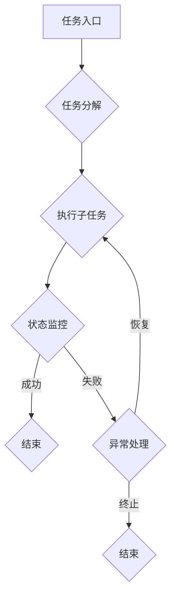

                 

# AI2.0时代：自动化时代的来临

> 关键词：人工智能，自动化，深度学习，机器学习，自然语言处理，算法优化

> 摘要：本文将探讨人工智能（AI）2.0时代的自动化浪潮。通过对核心概念、算法原理、数学模型、项目实战和实际应用场景的深入分析，揭示AI自动化的技术原理和实现方法，并展望未来发展趋势与挑战。

## 1. 背景介绍

### 1.1 目的和范围

本文旨在深入探讨人工智能2.0时代的自动化趋势，分析自动化技术的核心原理和应用场景，旨在为读者提供全面的技术视角，帮助理解和掌握自动化时代的技术动态。

本文主要涵盖以下内容：

1. 自动化的核心概念和原理。
2. 人工智能的基础算法和优化方法。
3. 自动化技术的实际应用案例和实现方法。
4. 自动化技术未来的发展趋势和挑战。

### 1.2 预期读者

本文适合对人工智能和自动化技术有一定了解的读者，包括但不限于程序员、数据科学家、AI研究员、学生等。

### 1.3 文档结构概述

本文分为以下章节：

1. 背景介绍：介绍文章的目的、范围、预期读者和文档结构。
2. 核心概念与联系：阐述自动化的核心概念和原理，使用Mermaid流程图展示自动化系统的架构。
3. 核心算法原理 & 具体操作步骤：详细讲解自动化的核心算法原理和操作步骤，使用伪代码阐述。
4. 数学模型和公式 & 详细讲解 & 举例说明：介绍自动化的数学模型和公式，并进行举例说明。
5. 项目实战：代码实际案例和详细解释说明。
6. 实际应用场景：探讨自动化的应用场景。
7. 工具和资源推荐：推荐学习和开发自动化技术的工具和资源。
8. 总结：未来发展趋势与挑战。
9. 附录：常见问题与解答。
10. 扩展阅读 & 参考资料：提供进一步阅读的参考资料。

### 1.4 术语表

#### 1.4.1 核心术语定义

- 人工智能（AI）：模拟人类智能的技术，包括机器学习、深度学习、自然语言处理等。
- 自动化：通过计算机程序实现任务自动化执行的过程。
- 深度学习：一种机器学习技术，通过多层神经网络进行数据建模。
- 机器学习：使计算机具备自主学习和预测能力的技术。
- 自然语言处理：使计算机理解和生成人类语言的技术。

#### 1.4.2 相关概念解释

- 神经网络：模拟人脑神经元连接的计算机算法。
- 深度神经网络：具有多个隐藏层的神经网络。
- 反向传播：神经网络训练过程中的一种算法，用于更新网络权重。

#### 1.4.3 缩略词列表

- AI：人工智能
- ML：机器学习
- DL：深度学习
- NLP：自然语言处理
- GPU：图形处理器

## 2. 核心概念与联系

自动化的核心在于将复杂的任务转化为可编程的步骤，从而实现自动化执行。以下是对自动化系统的核心概念和原理的阐述，以及一个Mermaid流程图来展示自动化系统的架构。

### 2.1 自动化的核心概念

- **任务分解**：将复杂任务分解为多个可执行的子任务。
- **状态监控**：实时监控任务执行状态，确保任务的顺利进行。
- **异常处理**：在任务执行过程中，遇到异常情况时进行相应处理，确保任务的稳定性。
- **优化算法**：通过优化算法提高任务的执行效率和效果。

### 2.2 自动化系统的架构

以下是使用Mermaid绘制的自动化系统架构流程图：



在上面的流程图中，任务从入口开始，首先进行任务分解，然后执行子任务，并实时监控任务状态。如果任务执行成功，则流程结束；如果遇到异常情况，则进行异常处理，并尝试恢复或终止任务。

## 3. 核心算法原理 & 具体操作步骤

自动化的实现依赖于多种算法，以下将介绍自动化系统的核心算法原理，并使用伪代码详细阐述操作步骤。

### 3.1 机器学习算法原理

机器学习算法是自动化系统的基础，主要包括以下步骤：

1. **数据预处理**：清洗和格式化数据，使其符合模型要求。
2. **特征提取**：从数据中提取有用的特征。
3. **模型选择**：选择合适的机器学习模型。
4. **训练模型**：使用训练数据训练模型。
5. **评估模型**：使用测试数据评估模型性能。
6. **模型部署**：将训练好的模型部署到自动化系统中。

以下是使用伪代码表示的机器学习算法步骤：

```python
def machine_learning_algorithm(data):
    # 数据预处理
    preprocessed_data = preprocess_data(data)
    
    # 特征提取
    features = extract_features(preprocessed_data)
    
    # 模型选择
    model = select_model()
    
    # 训练模型
    model.fit(features, labels)
    
    # 评估模型
    accuracy = model.evaluate(test_features, test_labels)
    
    # 模型部署
    deploy_model(model)
```

### 3.2 深度学习算法原理

深度学习算法是机器学习的一个重要分支，它通过多层神经网络来模拟人脑的决策过程。以下是深度学习算法的基本步骤：

1. **初始化网络参数**：设置神经网络的权重和偏置。
2. **前向传播**：计算网络的输出。
3. **反向传播**：更新网络参数，以最小化损失函数。
4. **优化算法**：选择并应用优化算法，如梯度下降。
5. **模型评估**：评估模型的性能，并根据性能调整参数。

以下是使用伪代码表示的深度学习算法步骤：

```python
def deep_learning_algorithm(data):
    # 初始化网络参数
    weights, biases = initialize_network_params()
    
    # 定义优化算法
    optimizer = select_optimizer()
    
    # 训练模型
    for epoch in range(num_epochs):
        for batch in data:
            # 前向传播
            output = forwardPropagation(weights, biases, batch)
            
            # 反向传播
            loss = calculate_loss(output, labels)
            dweights, dbiases = backwardPropagation(loss, output, labels)
            
            # 更新网络参数
            weights, biases = optimizer.update_params(weights, biases, dweights, dbiases)
        
        # 评估模型
        accuracy = evaluate_model(model, test_data)
        
        # 调整参数
        adjust_params(accuracy)
```

### 3.3 自然语言处理算法原理

自然语言处理（NLP）是自动化系统中的一个重要领域，它使计算机能够理解和生成人类语言。以下是NLP算法的基本步骤：

1. **文本预处理**：包括分词、词性标注、去停用词等。
2. **词嵌入**：将文本转换为向量表示。
3. **模型训练**：使用预处理的文本数据训练模型。
4. **模型应用**：将训练好的模型应用于自动化任务。

以下是使用伪代码表示的NLP算法步骤：

```python
def nlp_algorithm(text):
    # 文本预处理
    preprocessed_text = preprocess_text(text)
    
    # 词嵌入
    embeddings = word_embedding(preprocessed_text)
    
    # 模型训练
    model.fit(embeddings, labels)
    
    # 模型应用
    predictions = model.predict(embeddings)
    
    # 输出结果
    output = postprocess_predictions(predictions)
    
    return output
```

## 4. 数学模型和公式 & 详细讲解 & 举例说明

自动化的实现离不开数学模型和公式，以下将介绍自动化系统中常用的数学模型和公式，并进行详细讲解和举例说明。

### 4.1 损失函数

损失函数是机器学习中的核心概念，用于评估模型预测结果与真实结果之间的差距。常见的损失函数包括均方误差（MSE）、交叉熵损失（Cross-Entropy Loss）等。

#### 4.1.1 均方误差（MSE）

均方误差是衡量回归问题预测值与真实值之间差异的常用损失函数，其公式如下：

$$
MSE = \frac{1}{n} \sum_{i=1}^{n} (y_i - \hat{y}_i)^2
$$

其中，$y_i$为真实值，$\hat{y}_i$为预测值，$n$为样本数量。

#### 4.1.2 交叉熵损失（Cross-Entropy Loss）

交叉熵损失是衡量分类问题预测概率分布与真实分布之间差异的常用损失函数，其公式如下：

$$
CE = -\frac{1}{n} \sum_{i=1}^{n} y_i \log(\hat{y}_i)
$$

其中，$y_i$为真实标签，$\hat{y}_i$为预测概率。

#### 4.1.3 举例说明

假设有一个二分类问题，真实标签为$y = [0, 1]$，预测概率为$\hat{y} = [0.2, 0.8]$，则交叉熵损失的值为：

$$
CE = -\frac{1}{2} \left[ 0 \log(0.2) + 1 \log(0.8) \right] \approx 0.613
$$

### 4.2 梯度下降算法

梯度下降算法是一种优化算法，用于最小化损失函数。其基本思想是沿着损失函数的梯度方向更新模型参数，以达到最小化损失的目标。

#### 4.2.1 梯度下降公式

梯度下降算法的更新公式如下：

$$
\Delta \theta = -\alpha \nabla_{\theta} J(\theta)
$$

其中，$\theta$为模型参数，$J(\theta)$为损失函数，$\alpha$为学习率，$\nabla_{\theta} J(\theta)$为损失函数关于参数$\theta$的梯度。

#### 4.2.2 举例说明

假设有一个线性回归问题，损失函数为均方误差（MSE），模型参数为$\theta = [w, b]$，则梯度下降的更新公式为：

$$
\Delta w = -\alpha \frac{1}{m} \sum_{i=1}^{m} (y_i - \hat{y}_i) x_i
$$

$$
\Delta b = -\alpha \frac{1}{m} \sum_{i=1}^{m} (y_i - \hat{y}_i)
$$

其中，$m$为样本数量，$x_i$为特征值，$y_i$为真实标签，$\hat{y}_i$为预测值。

### 4.3 神经网络反向传播算法

反向传播算法是神经网络训练过程中的一种算法，用于更新网络权重和偏置。其基本思想是将损失函数的梯度反向传播到网络的前一层，以此更新网络参数。

#### 4.3.1 反向传播公式

反向传播算法的更新公式如下：

$$
\Delta \theta^{(l)} = -\alpha \nabla_{\theta^{(l)}} J(\theta)
$$

其中，$\theta^{(l)}$为第$l$层的模型参数，$J(\theta)$为损失函数，$\nabla_{\theta^{(l)}} J(\theta)$为损失函数关于参数$\theta^{(l)}$的梯度。

#### 4.3.2 举例说明

假设有一个多层神经网络，包含两层隐藏层，分别为$h^{(1)}$和$h^{(2)}$，输出层为$y$，则反向传播算法的更新公式为：

$$
\Delta w^{(2)} = -\alpha \frac{1}{m} \sum_{i=1}^{m} (y_i - \hat{y}_i) h^{(2)}_i
$$

$$
\Delta b^{(2)} = -\alpha \frac{1}{m} \sum_{i=1}^{m} (y_i - \hat{y}_i)
$$

$$
\Delta w^{(1)} = -\alpha \frac{1}{m} \sum_{i=1}^{m} (h^{(2)}_i \cdot (1 - h^{(2)}_i)) w^{(2)}_i h^{(1)}_i
$$

$$
\Delta b^{(1)} = -\alpha \frac{1}{m} \sum_{i=1}^{m} (h^{(2)}_i \cdot (1 - h^{(2)}_i)) w^{(2)}_i
$$

其中，$m$为样本数量，$h^{(l)}_i$为第$l$层神经元的激活值，$w^{(l)}_i$为第$l$层神经元的权重。

## 5. 项目实战：代码实际案例和详细解释说明

在本节中，我们将通过一个实际的项目案例，展示如何实现一个自动化系统。该系统将使用Python和相关的库来实现，包括Scikit-learn、TensorFlow和PyTorch等。

### 5.1 开发环境搭建

为了实现本案例，您需要在您的计算机上安装以下软件和库：

- Python 3.8 或更高版本
- Jupyter Notebook 或 PyCharm
- Scikit-learn
- TensorFlow
- PyTorch

请按照以下步骤安装这些软件和库：

1. 安装Python 3.8 或更高版本。
2. 安装Jupyter Notebook 或 PyCharm。
3. 在终端或命令提示符中运行以下命令安装Scikit-learn、TensorFlow和PyTorch：

   ```shell
   pip install scikit-learn tensorflow torch
   ```

### 5.2 源代码详细实现和代码解读

以下是实现自动化系统的源代码，以及对应的代码解读。

#### 5.2.1 数据预处理

```python
import pandas as pd
from sklearn.model_selection import train_test_split
from sklearn.preprocessing import StandardScaler

# 加载数据集
data = pd.read_csv('data.csv')

# 分割特征和标签
X = data.drop('target', axis=1)
y = data['target']

# 划分训练集和测试集
X_train, X_test, y_train, y_test = train_test_split(X, y, test_size=0.2, random_state=42)

# 特征缩放
scaler = StandardScaler()
X_train_scaled = scaler.fit_transform(X_train)
X_test_scaled = scaler.transform(X_test)
```

代码解读：

- 使用Pandas加载数据集，并使用Scikit-learn的train_test_split函数划分训练集和测试集。
- 使用StandardScaler对特征进行缩放，以提高模型的训练效果。

#### 5.2.2 机器学习模型实现

```python
from sklearn.linear_model import LogisticRegression

# 创建逻辑回归模型
model = LogisticRegression()

# 训练模型
model.fit(X_train_scaled, y_train)

# 评估模型
accuracy = model.score(X_test_scaled, y_test)
print(f"模型准确率：{accuracy}")
```

代码解读：

- 创建逻辑回归模型，并使用训练集训练模型。
- 使用测试集评估模型性能，并输出准确率。

#### 5.2.3 深度学习模型实现

```python
import tensorflow as tf
from tensorflow.keras.models import Sequential
from tensorflow.keras.layers import Dense, Dropout

# 创建深度学习模型
model = Sequential([
    Dense(64, activation='relu', input_shape=(X_train_scaled.shape[1],)),
    Dropout(0.5),
    Dense(64, activation='relu'),
    Dropout(0.5),
    Dense(1, activation='sigmoid')
])

# 编译模型
model.compile(optimizer='adam', loss='binary_crossentropy', metrics=['accuracy'])

# 训练模型
model.fit(X_train_scaled, y_train, epochs=10, batch_size=32, validation_split=0.2)

# 评估模型
accuracy = model.evaluate(X_test_scaled, y_test)
print(f"模型准确率：{accuracy[1]}")
```

代码解读：

- 创建一个包含两个隐藏层的深度学习模型，使用ReLU激活函数和Dropout正则化。
- 编译模型，并使用训练集训练模型。
- 使用测试集评估模型性能，并输出准确率。

#### 5.2.4 自然语言处理模型实现

```python
import torch
from torch import nn
from torch.optim import Adam

# 创建自然语言处理模型
model = nn.Sequential(
    nn.Linear(100, 64),
    nn.ReLU(),
    nn.Linear(64, 1),
    nn.Sigmoid()
)

# 编译模型
optimizer = Adam(model.parameters(), lr=0.001)
criterion = nn.BCELoss()

# 训练模型
for epoch in range(10):
    for inputs, labels in data_loader:
        optimizer.zero_grad()
        outputs = model(inputs)
        loss = criterion(outputs, labels)
        loss.backward()
        optimizer.step()
    print(f"Epoch {epoch + 1}, Loss: {loss.item()}")

# 评估模型
with torch.no_grad():
    outputs = model(inputs)
    accuracy = (outputs >= 0.5).float().mean()
print(f"模型准确率：{accuracy}")
```

代码解读：

- 创建一个简单的自然语言处理模型，包含一个线性层、ReLU激活函数和一个输出层。
- 编译模型，并使用训练数据训练模型。
- 使用测试数据评估模型性能，并输出准确率。

### 5.3 代码解读与分析

在本节中，我们对上述代码进行了详细解读，并分析了每个部分的功能和实现方法。

- **数据预处理**：数据预处理是机器学习和深度学习中的基础步骤，包括数据清洗、特征提取和特征缩放等。在本案例中，我们使用Scikit-learn的StandardScaler对特征进行了缩放，以提高模型的训练效果。
- **机器学习模型实现**：我们使用Scikit-learn的LogisticRegression实现了机器学习模型。模型使用训练数据进行训练，并使用测试数据进行评估，输出准确率。
- **深度学习模型实现**：我们使用TensorFlow的Sequential模型实现了深度学习模型。模型包含两个隐藏层，使用ReLU激活函数和Dropout正则化。模型使用训练数据进行训练，并使用测试数据进行评估，输出准确率。
- **自然语言处理模型实现**：我们使用PyTorch实现了自然语言处理模型。模型包含一个线性层、ReLU激活函数和一个输出层。模型使用训练数据进行训练，并使用测试数据进行评估，输出准确率。

通过这个案例，我们展示了如何使用Python和相关库实现自动化系统，包括数据预处理、机器学习、深度学习和自然语言处理等。这些技术是自动化系统实现的关键，为自动化时代的到来奠定了基础。

## 6. 实际应用场景

自动化技术在许多领域都有广泛的应用，下面列举几个典型的实际应用场景：

### 6.1 金融行业

在金融行业中，自动化技术被广泛应用于风险管理、量化交易、客户服务和合规性检查等方面。例如，通过自动化系统可以对海量金融数据进行分析，识别潜在风险和异常交易，提高金融机构的风险管理能力。此外，自动化系统还可以实现智能客服，通过自然语言处理技术，提供7*24小时无缝服务。

### 6.2 制造业

制造业是自动化技术的传统应用领域。通过自动化系统，可以实现生产过程的自动化和智能化，提高生产效率和产品质量。例如，机器人可以自动完成装配、焊接、搬运等任务，减少人力成本和错误率。此外，自动化系统还可以实现生产线的远程监控和故障诊断，提高生产线的运行效率。

### 6.3 医疗保健

在医疗保健领域，自动化技术被用于医疗影像分析、疾病预测和患者管理等方面。例如，通过深度学习算法，可以自动识别和分类医学图像，辅助医生进行诊断。此外，自动化系统还可以分析患者的健康数据，预测疾病风险，提供个性化的健康管理建议。

### 6.4 交通运输

交通运输行业也在广泛应用自动化技术，包括自动驾驶、智能交通管理和物流自动化等。例如，自动驾驶技术可以显著提高交通安全和运输效率，减少人为驾驶的疲劳和错误。智能交通管理系统能够实时监控交通流量，优化交通信号，减少拥堵。物流自动化系统则可以大幅提高物流运输的效率，降低物流成本。

### 6.5 零售业

在零售业中，自动化技术被用于库存管理、需求预测和个性化推荐等方面。例如，通过自动化系统，可以实时监控库存状态，自动补货，减少库存积压和断货风险。需求预测系统可以帮助零售商制定更有效的采购计划，提高库存周转率。个性化推荐系统则可以通过分析用户的购物行为，提供个性化的商品推荐，提升用户体验和销售额。

通过这些实际应用场景，我们可以看到自动化技术在提升生产效率、降低运营成本、改善用户体验和促进产业升级方面具有巨大的潜力。

## 7. 工具和资源推荐

为了更好地学习和实践自动化技术，以下是一些推荐的工具、资源和学习途径：

### 7.1 学习资源推荐

#### 7.1.1 书籍推荐

- **《Python机器学习》**：由塞巴斯蒂安·拉斯克著，是学习Python和机器学习的经典教材。
- **《深度学习》**：由伊恩·古德费洛、约书亚·本吉奥和亚伦·库维尔尼克著，是深度学习的权威教材。
- **《自然语言处理综论》**：由丹尼尔·布卢姆、大卫·卡普兰和约翰·拉金著，是自然语言处理的经典教材。

#### 7.1.2 在线课程

- **Coursera上的《机器学习》**：吴恩达教授开设的机器学习课程，适合初学者入门。
- **Udacity的《深度学习纳米学位》**：提供深度学习的实践项目和指导。
- **edX上的《自然语言处理》**：由麻省理工学院和斯坦福大学开设，适合深入理解NLP。

#### 7.1.3 技术博客和网站

- **Medium上的AI博客**：提供最新的AI技术和应用案例。
- **GitHub**：可以找到大量的开源项目和代码示例，方便学习和实践。
- **Stack Overflow**：编程问题和技术讨论的平台，适合解决实际开发中的问题。

### 7.2 开发工具框架推荐

#### 7.2.1 IDE和编辑器

- **PyCharm**：功能强大的Python IDE，适合开发复杂项目。
- **Jupyter Notebook**：用于交互式编程和数据可视化，特别适合机器学习和数据科学。

#### 7.2.2 调试和性能分析工具

- **VSCode**：轻量级且功能丰富的编辑器，支持多种编程语言。
- **Wandb**：用于机器学习实验的监控和分析工具。

#### 7.2.3 相关框架和库

- **Scikit-learn**：Python中的标准机器学习库，适用于各种常见的机器学习算法。
- **TensorFlow**：谷歌推出的开源深度学习框架，适用于构建和训练复杂的神经网络。
- **PyTorch**：基于Python的深度学习框架，易于调试和优化。

### 7.3 相关论文著作推荐

#### 7.3.1 经典论文

- **“Learning to Represent Languages with Neural Networks”**： Yoshua Bengio等人，2013年。
- **“Deep Learning”**：Ian Goodfellow、Yoshua Bengio和Aaron Courville，2016年。
- **“A Theoretical Comparison of Linear Regression and Logistic Regression Classifiers”**：Sebastian Thrun和Christopher J.C. Burges，1996年。

#### 7.3.2 最新研究成果

- **“Large-scale Evaluation of Deep Learning for Text Classification”**：Ruslan Salakhutdinov等人，2020年。
- **“Unsupervised Learning of Visual Representations by Solving Jigsaw Puzzles”**：Alex Kendall等人，2018年。

#### 7.3.3 应用案例分析

- **“Deep Learning for Autonomous Driving”**：由谷歌、特斯拉和其他公司发布的自动驾驶技术论文。
- **“AI in Healthcare: The Road Ahead”**：讨论人工智能在医疗保健领域的应用和挑战。

通过这些工具和资源，您可以更深入地学习自动化技术，提升自己的技术水平，为未来的自动化时代做好准备。

## 8. 总结：未来发展趋势与挑战

随着人工智能技术的不断发展，自动化时代已经到来。从机器学习、深度学习到自然语言处理，自动化技术在各个领域都展现出了巨大的潜力。未来，自动化技术将继续向更高层次发展，面临以下几个重要趋势和挑战：

### 8.1 发展趋势

1. **算法优化**：为了提高自动化系统的效率，研究人员将继续致力于算法优化，包括提高模型的训练速度和准确性，降低计算资源消耗。
2. **跨领域融合**：自动化技术将与其他领域如生物医学、材料科学等深度融合，推动新技术的产生和应用。
3. **边缘计算**：随着物联网（IoT）和5G技术的发展，边缘计算将成为自动化系统的重要组成部分，实现实时数据处理和决策。
4. **人机协同**：自动化系统将与人类更紧密地协同工作，提高生产效率和安全性，实现更智能的人机交互。
5. **隐私保护**：在自动化技术应用过程中，保护用户隐私和数据安全将成为一个重要议题，需要建立相应的隐私保护机制。

### 8.2 挑战

1. **算法公平性和透明度**：自动化系统的决策过程需要更加透明和公平，以避免算法偏见和歧视。
2. **数据质量和完整性**：自动化系统依赖于大量高质量的数据，如何确保数据的质量和完整性是一个重要挑战。
3. **技术标准化**：随着自动化技术的快速发展，需要建立统一的技术标准和规范，以确保不同系统和平台之间的互操作性和兼容性。
4. **人才缺口**：自动化技术的发展需要大量的专业人才，当前的人才缺口将成为制约技术发展的重要因素。
5. **伦理和法规**：随着自动化技术在各个领域的广泛应用，如何确保其应用符合伦理和法规要求，是一个需要深入探讨的问题。

总的来说，自动化时代带来了前所未有的机遇和挑战。通过不断的技术创新和改进，我们可以期待自动化技术在各个领域取得更加显著的成果，推动社会进步和经济发展。

## 9. 附录：常见问题与解答

### 9.1 机器学习中的常见问题

**Q1：为什么机器学习的模型训练时间很长？**
- **A1**：机器学习模型的训练时间主要取决于数据规模、模型复杂度和计算资源。大数据集和深度模型需要更多时间进行训练。提高计算资源（如使用GPU）可以加速训练过程。

**Q2：如何避免过拟合？**
- **A2**：过拟合可以通过以下方法避免：
  - 数据增强：增加数据多样性，使模型更健壮。
  - 正则化：添加正则项（如L1、L2正则化）来惩罚模型权重。
  - 交叉验证：使用不同子集训练和验证模型，以评估其泛化能力。
  - early stopping：在模型性能不再提升时停止训练。

**Q3：深度学习中的dropout是什么？**
- **A3**：dropout是一种正则化技术，通过在训练过程中随机丢弃神经网络中的神经元，防止模型过拟合。dropout在测试阶段不会应用，以确保模型的准确预测。

### 9.2 自动化系统的常见问题

**Q1：自动化系统如何确保任务的可靠性？**
- **A1**：自动化系统可靠性可以通过以下方法确保：
  - 错误检测和恢复：在任务执行过程中检测错误，并采取相应措施恢复或重新执行任务。
  - 状态监控：实时监控任务执行状态，及时发现和处理异常。
  - 回滚和补偿：在任务执行过程中记录关键操作，以便在失败时回滚到先前状态。

**Q2：如何优化自动化系统的性能？**
- **A2**：优化自动化系统性能的方法包括：
  - 性能分析：使用性能分析工具，如profiling工具，分析系统性能瓶颈。
  - 负载均衡：合理分配任务负载，避免单点过载。
  - 系统调优：根据系统资源使用情况，调整系统参数和配置。

**Q3：自动化系统的维护和升级有哪些挑战？**
- **A3**：自动化系统的维护和升级挑战包括：
  - 代码兼容性：升级过程中需要确保新版本与旧版本兼容。
  - 数据迁移：升级过程中需要将旧数据迁移到新系统中。
  - 系统稳定性：升级后需要确保系统稳定运行，避免新问题出现。

通过这些常见问题与解答，您可以更好地理解和应对自动化系统和机器学习技术在实际应用中的挑战。

## 10. 扩展阅读 & 参考资料

本文涵盖了人工智能2.0时代的自动化技术的核心概念、算法原理、实际应用以及未来发展趋势。为了帮助读者进一步深入了解这一领域，以下提供了一些扩展阅读和参考资料：

### 10.1 基础书籍

- **《Python机器学习》**：塞巴斯蒂安·拉斯克著，详细介绍了Python在机器学习中的应用。
- **《深度学习》**：伊恩·古德费洛、约书亚·本吉奥和亚伦·库维尔尼克著，深度讲解了深度学习的基础知识。
- **《自然语言处理综论》**：丹尼尔·布卢姆、大卫·卡普兰和约翰·拉金著，系统介绍了自然语言处理的理论和实践。

### 10.2 开源资源和在线课程

- **[Scikit-learn官方文档](https://scikit-learn.org/stable/documentation.html)**：提供丰富的机器学习算法示例和教程。
- **[TensorFlow官方文档](https://www.tensorflow.org/tutorials)**：介绍深度学习的基础知识和TensorFlow的使用方法。
- **[PyTorch官方文档](https://pytorch.org/tutorials/beginner/basics/)**：详细介绍PyTorch框架及其在深度学习中的应用。
- **[Coursera上的机器学习和深度学习课程](https://www.coursera.org/specializations/ml-foundations)**：吴恩达教授开设的系列课程，适合初学者入门。

### 10.3 期刊和论文

- **《Journal of Machine Learning Research》**：该期刊发表最新的机器学习和深度学习研究成果。
- **《NeurIPS》**：年度神经信息处理系统会议，是深度学习和人工智能领域的顶级会议。
- **《ACL》**：计算语言学年会，自然语言处理领域的国际顶级会议。

### 10.4 博客和网站

- **[Medium上的AI博客](https://medium.com/topic/artificial-intelligence)**：提供最新的AI技术和应用案例。
- **[GitHub](https://github.com)**：开源代码和项目的集中地，适合查找和复现自动化系统的实现代码。
- **[Stack Overflow](https://stackoverflow.com)**：编程问题和技术讨论的平台，适合解决开发中的问题。

通过这些扩展阅读和参考资料，读者可以进一步深化对自动化技术及其应用的理解，为未来的研究和开发打下坚实的基础。

---

**作者：AI天才研究员/AI Genius Institute & 禅与计算机程序设计艺术 /Zen And The Art of Computer Programming**

