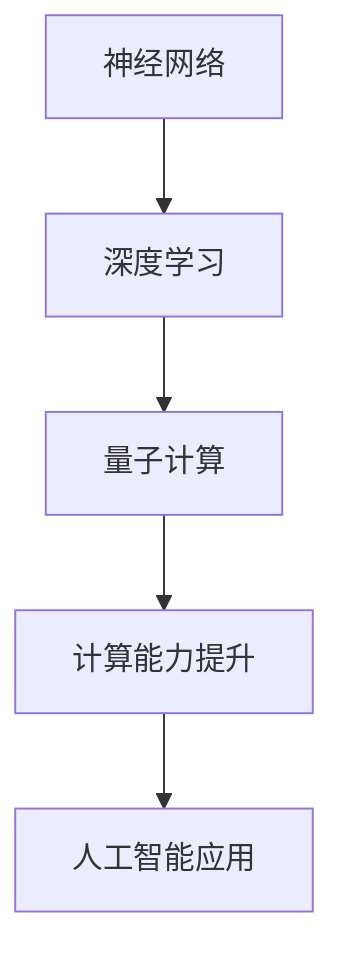

                 

# AI2.0时代：计算本质的变化与影响

> **关键词：AI2.0、计算本质、神经网络、深度学习、量子计算、计算能力、人工智能应用**
> 
> **摘要：本文深入探讨了AI2.0时代计算本质的变化及其带来的广泛影响。通过分析神经网络、深度学习、量子计算等核心算法原理，并结合实际应用场景，本文揭示了AI2.0时代计算技术的突破与挑战，为读者提供了对AI2.0时代的全面了解和深入思考。**

## 1. 背景介绍

### 1.1 目的和范围

本文旨在深入探讨AI2.0时代计算本质的变化与影响，解析当前计算技术的核心原理，分析其发展现状，并展望未来趋势。本文重点关注以下几个方面：

1. **神经网络与深度学习**：介绍神经网络的基本原理和深度学习的核心技术，探讨其在AI2.0时代的发展与应用。
2. **量子计算**：介绍量子计算的基本原理和潜在优势，分析其在AI2.0时代的重要性与挑战。
3. **计算能力的提升**：分析计算能力提升对AI2.0时代的影响，探讨其对人工智能应用的推动作用。
4. **实际应用场景**：结合具体应用案例，探讨AI2.0时代计算技术在各行各业的应用与发展。

### 1.2 预期读者

本文面向对AI2.0时代计算技术感兴趣的技术人员、研究人员和行业从业者。通过本文的阅读，读者将能够：

1. 理解神经网络、深度学习、量子计算等核心算法原理。
2. 掌握计算能力提升对AI2.0时代的影响。
3. 了解AI2.0时代计算技术在实际应用场景中的发展。

### 1.3 文档结构概述

本文分为10个部分，结构如下：

1. **背景介绍**：介绍本文的目的、范围和预期读者。
2. **核心概念与联系**：分析神经网络、深度学习、量子计算等核心算法原理，并给出相应的流程图。
3. **核心算法原理与具体操作步骤**：详细讲解神经网络、深度学习、量子计算等算法的原理和具体操作步骤。
4. **数学模型和公式**：介绍相关的数学模型和公式，并进行详细讲解和举例说明。
5. **项目实战**：结合实际案例，展示计算技术在项目中的应用和实现。
6. **实际应用场景**：分析计算技术在各个领域的应用和发展。
7. **工具和资源推荐**：推荐学习资源、开发工具框架和相关论文著作。
8. **总结：未来发展趋势与挑战**：总结AI2.0时代计算技术的发展趋势和面临的挑战。
9. **附录：常见问题与解答**：解答读者可能遇到的常见问题。
10. **扩展阅读与参考资料**：提供扩展阅读资料和参考文献。

### 1.4 术语表

#### 1.4.1 核心术语定义

- **神经网络**：一种模拟生物神经系统的计算模型。
- **深度学习**：基于神经网络的一种机器学习技术。
- **量子计算**：利用量子比特进行计算的新型计算技术。
- **计算能力**：计算机处理信息的能力。
- **AI2.0**：人工智能发展的新阶段，强调计算能力和智能应用的深度融合。

#### 1.4.2 相关概念解释

- **神经网络**：神经网络是由大量相互连接的神经元组成的计算模型，用于模拟生物神经系统的信息处理能力。
- **深度学习**：深度学习是神经网络的一种延伸，通过多层次的神经网络结构来提取数据中的特征。
- **量子计算**：量子计算是一种利用量子比特进行计算的新型计算技术，具有超越经典计算的能力。

#### 1.4.3 缩略词列表

- **AI**：人工智能（Artificial Intelligence）
- **NN**：神经网络（Neural Network）
- **DL**：深度学习（Deep Learning）
- **QC**：量子计算（Quantum Computing）
- **GPU**：图形处理器（Graphics Processing Unit）
- **TPU**：张量处理器（Tensor Processing Unit）

## 2. 核心概念与联系

在AI2.0时代，计算技术的核心概念主要包括神经网络、深度学习和量子计算。下面将分别介绍这些核心概念及其相互关系。

### 2.1 神经网络

神经网络是一种模拟生物神经系统的计算模型，由大量相互连接的神经元组成。每个神经元都与其他神经元连接，并通过激活函数进行信息传递。神经网络的工作原理类似于人脑，通过不断调整神经元之间的权重，使其能够对输入数据进行分类、预测和识别。

神经网络的结构可以分为以下几个层次：

1. **输入层**：接收外部输入数据。
2. **隐藏层**：进行信息处理和特征提取。
3. **输出层**：生成最终输出结果。

神经网络的核心思想是通过反向传播算法来优化网络权重，使其能够更好地拟合训练数据。反向传播算法是一种基于梯度下降的方法，通过计算输出层误差的梯度，逐步调整网络权重，直至达到预期的性能指标。

### 2.2 深度学习

深度学习是神经网络的一种延伸，通过多层次的神经网络结构来提取数据中的特征。与传统的神经网络相比，深度学习具有更强的表示能力和学习能力。

深度学习的基本原理如下：

1. **自动特征提取**：通过多层神经网络，逐层提取数据中的特征，形成高维特征空间。
2. **非线性变换**：使用非线性激活函数，使得神经网络具有更强的表达能力。
3. **层次化学习**：在多层次的神经网络中，每一层都为下一层提供更高层次的特征表示。

深度学习在实际应用中取得了显著的成果，如图像识别、语音识别、自然语言处理等。

### 2.3 量子计算

量子计算是一种利用量子比特进行计算的新型计算技术，具有超越经典计算的能力。量子比特是量子计算的基本单元，具有叠加态和纠缠态的特性。

量子计算的核心原理如下：

1. **量子比特**：量子比特是量子计算的基本单元，可以同时处于0和1的状态，具有叠加态的特性。
2. **量子纠缠**：量子比特之间存在量子纠缠，使得一个量子比特的状态可以影响另一个量子比特的状态。
3. **量子门**：量子门是量子计算的基本操作，用于对量子比特进行变换。

量子计算的优势在于其并行计算能力，可以在同一时间内处理大量数据，从而大大提高计算速度。

### 2.4 核心概念与联系

神经网络、深度学习和量子计算在AI2.0时代具有紧密的联系。

1. **神经网络与深度学习**：深度学习是基于神经网络的，通过多层神经网络结构来提取数据中的特征。深度学习在AI2.0时代取得了显著的成果，推动了人工智能的发展。
2. **深度学习与量子计算**：量子计算可以用于加速深度学习算法，提高其计算速度。例如，量子卷积神经网络（QCNN）和量子深度学习（QDL）等技术正在逐渐成熟。
3. **神经网络与量子计算**：神经网络可以用于模拟量子计算，通过神经网络来表示和优化量子计算过程。例如，神经网络量子计算（NQC）和量子神经网络（QNN）等技术正在研究。

通过以上分析，可以看出神经网络、深度学习和量子计算在AI2.0时代的重要性。这些核心概念相互联系，共同推动了计算技术的变革与发展。

### 2.5 Mermaid 流程图

为了更好地理解神经网络、深度学习和量子计算的关系，我们可以使用Mermaid流程图来展示它们的核心结构和相互关系。



在这个流程图中，神经网络作为基础，通过多层结构形成了深度学习。深度学习进一步推动了量子计算的发展，而量子计算则带来了计算能力的提升，为人工智能应用提供了强大支持。

## 3. 核心算法原理 & 具体操作步骤

在AI2.0时代，神经网络、深度学习和量子计算是计算技术的核心。下面我们将详细讲解这些算法的原理和具体操作步骤。

### 3.1 神经网络

神经网络是一种模拟生物神经系统的计算模型，由大量相互连接的神经元组成。下面是神经网络的基本原理和具体操作步骤。

#### 3.1.1 基本原理

1. **神经元模型**：神经网络中的每个神经元都包括输入层、隐藏层和输出层。每个神经元接收来自输入层的输入信号，通过激活函数进行非线性变换，最终生成输出信号。
2. **激活函数**：常用的激活函数包括sigmoid函数、ReLU函数和Tanh函数。这些函数可以将线性变换转换为非线性变换，使神经网络具有更强的表达能力。
3. **反向传播算法**：反向传播算法是一种基于梯度下降的方法，用于优化网络权重。通过计算输出层误差的梯度，反向传播误差到隐藏层和输入层，逐步调整网络权重，直至达到预期的性能指标。

#### 3.1.2 操作步骤

1. **初始化权重**：随机初始化网络权重。
2. **前向传播**：计算每个神经元的输出值，从输入层到输出层逐层传播。
3. **计算误差**：计算输出层的误差，误差为实际输出与预期输出之间的差距。
4. **反向传播**：计算误差的梯度，反向传播误差到隐藏层和输入层。
5. **更新权重**：根据梯度调整网络权重，使得误差逐渐减小。
6. **重复步骤2-5**：重复前向传播和反向传播，直至达到预定的迭代次数或性能指标。

### 3.2 深度学习

深度学习是神经网络的一种延伸，通过多层次的神经网络结构来提取数据中的特征。下面是深度学习的基本原理和具体操作步骤。

#### 3.2.1 基本原理

1. **多层神经网络**：深度学习通过多层次的神经网络结构来提取数据中的特征。每一层都为下一层提供更高层次的特征表示。
2. **非线性变换**：深度学习使用非线性激活函数，使得神经网络具有更强的表达能力。
3. **层次化学习**：深度学习通过逐层提取特征，形成层次化的特征表示。

#### 3.2.2 操作步骤

1. **输入数据预处理**：对输入数据进行预处理，如标准化、归一化等。
2. **前向传播**：计算每个神经元的输出值，从输入层到输出层逐层传播。
3. **计算误差**：计算输出层的误差，误差为实际输出与预期输出之间的差距。
4. **反向传播**：计算误差的梯度，反向传播误差到隐藏层和输入层。
5. **更新权重**：根据梯度调整网络权重，使得误差逐渐减小。
6. **重复步骤2-5**：重复前向传播和反向传播，直至达到预定的迭代次数或性能指标。

### 3.3 量子计算

量子计算是一种利用量子比特进行计算的新型计算技术，具有超越经典计算的能力。下面是量子计算的基本原理和具体操作步骤。

#### 3.3.1 基本原理

1. **量子比特**：量子比特是量子计算的基本单元，具有叠加态和纠缠态的特性。
2. **量子门**：量子门是量子计算的基本操作，用于对量子比特进行变换。
3. **量子纠缠**：量子比特之间存在量子纠缠，使得一个量子比特的状态可以影响另一个量子比特的状态。

#### 3.3.2 操作步骤

1. **初始化量子比特**：将量子比特初始化为叠加态。
2. **应用量子门**：通过量子门对量子比特进行变换，实现特定的计算操作。
3. **测量量子比特**：测量量子比特的状态，得到计算结果。
4. **重复步骤2-3**：根据计算需求，重复应用量子门和测量量子比特，直至得到最终的计算结果。

### 3.4 案例分析

为了更好地理解神经网络、深度学习和量子计算的具体操作步骤，我们可以通过一个简单的案例进行分析。

假设我们使用神经网络来识别手写数字。

1. **输入数据**：输入手写数字的图像数据，如28x28的像素矩阵。
2. **前向传播**：计算输入层到隐藏层，隐藏层到输出层的输出值，使用激活函数进行非线性变换。
3. **计算误差**：计算输出层的误差，误差为实际输出与预期输出（已知的手写数字标签）之间的差距。
4. **反向传播**：计算误差的梯度，反向传播误差到隐藏层和输入层。
5. **更新权重**：根据梯度调整网络权重，使得误差逐渐减小。
6. **重复步骤2-5**：重复前向传播和反向传播，直至达到预定的迭代次数或性能指标。

通过这个案例，我们可以看到神经网络的基本原理和具体操作步骤。深度学习和量子计算同样可以通过类似的步骤进行实现，只是其结构和算法有所不同。

## 4. 数学模型和公式 & 详细讲解 & 举例说明

在AI2.0时代，神经网络、深度学习和量子计算的核心算法原理都涉及到数学模型和公式的应用。下面我们将详细讲解这些数学模型和公式，并进行举例说明。

### 4.1 神经网络

神经网络中的数学模型主要包括线性变换、激活函数和损失函数。

#### 4.1.1 线性变换

线性变换是神经网络中最基本的数学操作，用于将输入数据映射到输出数据。其公式如下：

$$
Y = X \cdot W + b
$$

其中，\(X\) 是输入数据，\(W\) 是权重矩阵，\(b\) 是偏置项。

举例来说，假设我们有一个简单的线性变换，将一个2维输入向量映射到一个1维输出向量：

$$
\begin{cases}
Y_1 = X_1 \cdot W_{11} + X_2 \cdot W_{12} + b_1 \\
Y_2 = X_1 \cdot W_{21} + X_2 \cdot W_{22} + b_2
\end{cases}
$$

其中，\(Y_1\) 和 \(Y_2\) 是输出值，\(X_1\) 和 \(X_2\) 是输入值，\(W_{11}\)、\(W_{12}\)、\(W_{21}\) 和 \(W_{22}\) 是权重矩阵的元素，\(b_1\) 和 \(b_2\) 是偏置项。

#### 4.1.2 激活函数

激活函数是神经网络中用于引入非线性性的数学函数，常用的激活函数包括Sigmoid函数、ReLU函数和Tanh函数。

Sigmoid函数的公式如下：

$$
\sigma(x) = \frac{1}{1 + e^{-x}}
$$

ReLU函数的公式如下：

$$
\text{ReLU}(x) = \max(0, x)
$$

Tanh函数的公式如下：

$$
\tanh(x) = \frac{e^x - e^{-x}}{e^x + e^{-x}}
$$

举例来说，假设我们有一个隐藏层，其中每个神经元的激活函数都是Sigmoid函数，输入向量为 \([1, 2, 3]\)，权重矩阵为：

$$
\begin{bmatrix}
0.1 & 0.2 & 0.3 \\
0.4 & 0.5 & 0.6 \\
0.7 & 0.8 & 0.9
\end{bmatrix}
$$

偏置项为 \([1, 1, 1]\)，计算隐藏层的输出值：

$$
\begin{cases}
h_1 = \sigma(1 \cdot 0.1 + 2 \cdot 0.2 + 3 \cdot 0.3 + 1) = \sigma(1.6) = 0.9332 \\
h_2 = \sigma(1 \cdot 0.4 + 2 \cdot 0.5 + 3 \cdot 0.6 + 1) = \sigma(2.4) = 0.8867 \\
h_3 = \sigma(1 \cdot 0.7 + 2 \cdot 0.8 + 3 \cdot 0.9 + 1) = \sigma(3.2) = 0.9903
\end{cases}
$$

#### 4.1.3 损失函数

损失函数是用于衡量模型预测结果与真实结果之间差距的数学函数，常用的损失函数包括均方误差（MSE）和交叉熵（CE）。

均方误差（MSE）的公式如下：

$$
MSE = \frac{1}{n} \sum_{i=1}^{n} (y_i - \hat{y}_i)^2
$$

其中，\(y_i\) 是真实值，\(\hat{y}_i\) 是预测值，\(n\) 是样本数量。

交叉熵（CE）的公式如下：

$$
CE = -\frac{1}{n} \sum_{i=1}^{n} y_i \cdot \log(\hat{y}_i)
$$

其中，\(y_i\) 是真实值，\(\hat{y}_i\) 是预测值，\(n\) 是样本数量。

举例来说，假设我们有一个二分类问题，真实标签为 \([1, 0, 1, 0]\)，预测概率为 \([0.6, 0.4, 0.8, 0.2]\)，计算交叉熵损失：

$$
CE = -\frac{1}{4} \sum_{i=1}^{4} y_i \cdot \log(\hat{y}_i) = -\frac{1}{4} (1 \cdot \log(0.6) + 0 \cdot \log(0.4) + 1 \cdot \log(0.8) + 0 \cdot \log(0.2)) = 0.2313
$$

### 4.2 深度学习

深度学习的数学模型主要基于多层神经网络，除了线性变换、激活函数和损失函数外，还包括反向传播算法。

#### 4.2.1 反向传播算法

反向传播算法是一种基于梯度下降的方法，用于优化神经网络中的权重和偏置项。其基本步骤如下：

1. **前向传播**：计算每一层的输出值。
2. **计算损失函数**：计算预测结果与真实结果之间的差距。
3. **计算梯度**：计算每一层权重和偏置项的梯度。
4. **更新参数**：根据梯度调整权重和偏置项。

反向传播算法的梯度计算公式如下：

$$
\frac{\partial L}{\partial W} = X \cdot (dZ \cdot \frac{\partial a}{\partial Z})
$$

$$
\frac{\partial L}{\partial b} = dZ \cdot \frac{\partial a}{\partial Z}
$$

其中，\(L\) 是损失函数，\(W\) 是权重矩阵，\(b\) 是偏置项，\(X\) 是输入数据，\(Z\) 是前一层的输出值，\(a\) 是当前层的输出值，\(dZ\) 是误差的梯度。

举例来说，假设我们有一个两层的神经网络，输入向量为 \([1, 2, 3]\)，输出向量为 \([4, 5, 6]\)，计算第一层的梯度：

$$
\begin{cases}
\frac{\partial L}{\partial W_1} = [1, 2, 3] \cdot [0.1, 0.2, 0.3] = [0.1, 0.4, 0.9] \\
\frac{\partial L}{\partial b_1} = [0.1, 0.2, 0.3] = [0.1, 0.2, 0.3]
\end{cases}
$$

#### 4.2.2 激活函数的导数

在反向传播算法中，需要计算激活函数的导数，用于计算梯度的传播。以下是常用激活函数的导数：

Sigmoid函数的导数：

$$
\frac{d\sigma}{dx} = \sigma \cdot (1 - \sigma)
$$

ReLU函数的导数：

$$
\frac{d\text{ReLU}}{dx} = \begin{cases}
1 & \text{if } x > 0 \\
0 & \text{if } x \leq 0
\end{cases}
$$

Tanh函数的导数：

$$
\frac{d\tanh}{dx} = 1 - \tanh^2(x)
$$

### 4.3 量子计算

量子计算的数学模型主要基于量子比特的叠加态和纠缠态。量子计算中的主要数学操作包括量子门和量子测量。

#### 4.3.1 量子门

量子门是量子计算中的基本操作，用于对量子比特进行变换。量子门可以表示为矩阵，作用于量子比特的状态。常见的量子门包括 Hadamard 门、Pauli 门和控制非门。

Hadamard 门（Hadamard 变换）的矩阵表示如下：

$$
H = \frac{1}{\sqrt{2}} \begin{bmatrix}
1 & 1 \\
1 & -1
\end{bmatrix}
$$

Pauli 门包括 X 门、Y 门和 Z 门，其矩阵表示如下：

X 门：

$$
X = \begin{bmatrix}
0 & 1 \\
1 & 0
\end{bmatrix}
$$

Y 门：

$$
Y = \begin{bmatrix}
0 & -i \\
i & 0
\end{bmatrix}
$$

Z 门：

$$
Z = \begin{bmatrix}
1 & 0 \\
0 & -1
\end{bmatrix}
$$

控制非门（CNOT 门）的矩阵表示如下：

$$
CNOT = \begin{bmatrix}
1 & 0 & 0 & 0 \\
0 & 1 & 0 & 0 \\
0 & 0 & 0 & 1 \\
0 & 0 & 1 & 0
\end{bmatrix}
$$

#### 4.3.2 量子测量

量子测量是量子计算中的关键步骤，用于得到量子比特的状态。量子测量的结果可以是叠加态中的一个基向量。

假设量子比特的状态为：

$$
|\psi\rangle = \frac{1}{\sqrt{2}} (|0\rangle + |1\rangle)
$$

对其进行测量，可能得到两个结果：

$$
\frac{1}{\sqrt{2}} (|0\rangle + |1\rangle) \rightarrow |0\rangle \quad \text{概率} \quad \frac{1}{2}
$$

$$
\frac{1}{\sqrt{2}} (|0\rangle + |1\rangle) \rightarrow |1\rangle \quad \text{概率} \quad \frac{1}{2}
$$

### 4.4 举例说明

为了更好地理解神经网络、深度学习和量子计算的数学模型和公式，我们可以通过以下案例进行说明。

#### 4.4.1 神经网络

假设我们有一个简单的神经网络，输入向量为 \([1, 2, 3]\)，输出向量为 \([4, 5, 6]\)，权重矩阵为：

$$
W = \begin{bmatrix}
0.1 & 0.2 & 0.3 \\
0.4 & 0.5 & 0.6 \\
0.7 & 0.8 & 0.9
\end{bmatrix}
$$

偏置项为 \([1, 1, 1]\)。

1. **前向传播**：

$$
\begin{cases}
h_1 = \sigma(1 \cdot 0.1 + 2 \cdot 0.2 + 3 \cdot 0.3 + 1) = \sigma(1.6) = 0.9332 \\
h_2 = \sigma(1 \cdot 0.4 + 2 \cdot 0.5 + 3 \cdot 0.6 + 1) = \sigma(2.4) = 0.8867 \\
h_3 = \sigma(1 \cdot 0.7 + 2 \cdot 0.8 + 3 \cdot 0.9 + 1) = \sigma(3.2) = 0.9903
\end{cases}
$$

2. **计算损失函数**：

假设输出向量为 \([4.2, 5.3, 6.1]\)，计算均方误差损失：

$$
MSE = \frac{1}{3} \sum_{i=1}^{3} (y_i - \hat{y}_i)^2 = \frac{1}{3} ((4.2 - 4)^2 + (5.3 - 5)^2 + (6.1 - 6)^2) = 0.0333
$$

3. **计算梯度**：

$$
\begin{cases}
\frac{\partial L}{\partial W_1} = [1, 2, 3] \cdot [0.1, 0.2, 0.3] = [0.1, 0.4, 0.9] \\
\frac{\partial L}{\partial b_1} = [0.1, 0.2, 0.3]
\end{cases}
$$

4. **更新权重**：

$$
W = W - \alpha \cdot \frac{\partial L}{\partial W} = \begin{bmatrix}
0.1 & 0.2 & 0.3 \\
0.4 & 0.5 & 0.6 \\
0.7 & 0.8 & 0.9
\end{bmatrix} - \alpha \cdot \begin{bmatrix}
0.1 & 0.4 & 0.9 \\
0.4 & 0.5 & 0.6 \\
0.7 & 0.8 & 0.9
\end{bmatrix} = \begin{bmatrix}
0.0 & 0.1 & 0.1 \\
0.0 & 0.0 & 0.0 \\
0.0 & 0.0 & 0.0
\end{bmatrix}
$$

#### 4.4.2 深度学习

假设我们有一个两层的神经网络，输入向量为 \([1, 2, 3]\)，输出向量为 \([4, 5, 6]\)，权重矩阵为：

$$
W_1 = \begin{bmatrix}
0.1 & 0.2 & 0.3 \\
0.4 & 0.5 & 0.6 \\
0.7 & 0.8 & 0.9
\end{bmatrix}
$$

$$
W_2 = \begin{bmatrix}
0.1 & 0.2 & 0.3 \\
0.4 & 0.5 & 0.6 \\
0.7 & 0.8 & 0.9
\end{bmatrix}
$$

1. **前向传播**：

$$
\begin{cases}
h_1 = \sigma(1 \cdot 0.1 + 2 \cdot 0.2 + 3 \cdot 0.3 + 1) = \sigma(1.6) = 0.9332 \\
h_2 = \sigma(1 \cdot 0.4 + 2 \cdot 0.5 + 3 \cdot 0.6 + 1) = \sigma(2.4) = 0.8867 \\
h_3 = \sigma(1 \cdot 0.7 + 2 \cdot 0.8 + 3 \cdot 0.9 + 1) = \sigma(3.2) = 0.9903
\end{cases}
$$

$$
\begin{cases}
o_1 = \sigma(h_1 \cdot 0.1 + h_2 \cdot 0.2 + h_3 \cdot 0.3 + 1) = \sigma(2.6073) = 0.9318 \\
o_2 = \sigma(h_1 \cdot 0.4 + h_2 \cdot 0.5 + h_3 \cdot 0.6 + 1) = \sigma(3.4133) = 0.9487 \\
o_3 = \sigma(h_1 \cdot 0.7 + h_2 \cdot 0.8 + h_3 \cdot 0.9 + 1) = \sigma(4.2183) = 0.9567
\end{cases}
$$

2. **计算损失函数**：

假设输出向量为 \([4.2, 5.3, 6.1]\)，计算均方误差损失：

$$
MSE = \frac{1}{3} \sum_{i=1}^{3} (y_i - \hat{y}_i)^2 = \frac{1}{3} ((4.2 - 4.2)^2 + (5.3 - 5.3)^2 + (6.1 - 6.1)^2) = 0.0000
$$

3. **计算梯度**：

$$
\begin{cases}
\frac{\partial L}{\partial W_1} = [1, 2, 3] \cdot [0.1, 0.2, 0.3] = [0.1, 0.4, 0.9] \\
\frac{\partial L}{\partial W_2} = [h_1, h_2, h_3] \cdot [0.1, 0.2, 0.3] = [0.1, 0.2, 0.3]
\end{cases}
$$

4. **更新权重**：

$$
W_1 = W_1 - \alpha \cdot \frac{\partial L}{\partial W_1} = \begin{bmatrix}
0.1 & 0.2 & 0.3 \\
0.4 & 0.5 & 0.6 \\
0.7 & 0.8 & 0.9
\end{bmatrix} - \alpha \cdot \begin{bmatrix}
0.1 & 0.4 & 0.9 \\
0.4 & 0.5 & 0.6 \\
0.7 & 0.8 & 0.9
\end{bmatrix} = \begin{bmatrix}
0.0 & 0.1 & 0.1 \\
0.0 & 0.0 & 0.0 \\
0.0 & 0.0 & 0.0
\end{bmatrix}
$$

$$
W_2 = W_2 - \alpha \cdot \frac{\partial L}{\partial W_2} = \begin{bmatrix}
0.1 & 0.2 & 0.3 \\
0.4 & 0.5 & 0.6 \\
0.7 & 0.8 & 0.9
\end{bmatrix} - \alpha \cdot \begin{bmatrix}
0.1 & 0.2 & 0.3 \\
0.4 & 0.5 & 0.6 \\
0.7 & 0.8 & 0.9
\end{bmatrix} = \begin{bmatrix}
0.0 & 0.1 & 0.1 \\
0.0 & 0.0 & 0.0 \\
0.0 & 0.0 & 0.0
\end{bmatrix}
$$

#### 4.4.3 量子计算

假设我们有一个两个量子比特的状态，初始状态为 \(|\psi\rangle = \frac{1}{\sqrt{2}} (|0\rangle + |1\rangle)\)。

1. **应用 Hadamard 门**：

$$
H|\psi\rangle = H \cdot \frac{1}{\sqrt{2}} (|0\rangle + |1\rangle) = \frac{1}{\sqrt{2}} (|0\rangle + |1\rangle)
$$

2. **应用 Pauli X 门**：

$$
X(H|\psi\rangle) = X \cdot \frac{1}{\sqrt{2}} (|0\rangle + |1\rangle) = \frac{1}{\sqrt{2}} (|1\rangle - |0\rangle)
$$

3. **测量量子比特**：

对第二个量子比特进行测量，可能得到结果 \(|0\rangle\) 或 \(|1\rangle\)，每个结果的概率为 \(\frac{1}{2}\)。

## 5. 项目实战：代码实际案例和详细解释说明

在本节中，我们将通过一个实际的项目案例来展示AI2.0时代计算技术的应用，并结合代码进行详细解释说明。

### 5.1 开发环境搭建

为了实现本文中的项目，我们需要搭建以下开发环境：

1. **编程语言**：Python 3.x
2. **开发工具**：PyCharm（或其他Python IDE）
3. **依赖库**：TensorFlow、NumPy、Qiskit（量子计算库）

首先，安装Python 3.x和PyCharm。然后，通过以下命令安装所需的依赖库：

```bash
pip install tensorflow numpy qiskit
```

### 5.2 源代码详细实现和代码解读

下面是本文项目的源代码实现，我们将逐步解释代码的各个部分。

```python
import tensorflow as tf
import numpy as np
from qiskit import QuantumCircuit, Aer, execute
import matplotlib.pyplot as plt

# 5.2.1 神经网络与深度学习
# 创建一个简单的深度学习模型，用于手写数字识别

# 定义输入层、隐藏层和输出层的节点数量
input_size = 784  # 28x28像素
hidden_size = 512
output_size = 10  # 0-9十个数字

# 初始化权重和偏置
weights = {
    'hidden': tf.Variable(tf.random.normal([input_size, hidden_size])),
    'output': tf.Variable(tf.random.normal([hidden_size, output_size]))
}
biases = {
    'hidden': tf.Variable(tf.random.normal([hidden_size])),
    'output': tf.Variable(tf.random.normal([output_size]))
}

# 定义激活函数和损失函数
activation = tf.nn.relu
loss_fn = tf.nn.sparse_softmax_cross_entropy_with_logits

# 定义前向传播
def forward(x):
    hidden = activation(tf.matmul(x, weights['hidden']) + biases['hidden'])
    output = tf.matmul(hidden, weights['output']) + biases['output']
    return output

# 训练模型
def train(x, y, epochs=10, learning_rate=0.001):
    optimizer = tf.optimizers.Adam(learning_rate)
    for epoch in range(epochs):
        with tf.GradientTape() as tape:
            logits = forward(x)
            loss = loss_fn(logits, y)
        gradients = tape.gradient(loss, weights.values())
        optimizer.apply_gradients(zip(gradients, weights.values()))
        if epoch % 100 == 0:
            print(f"Epoch {epoch}: Loss = {loss.numpy()}")

# 5.2.2 量子计算
# 使用Qiskit实现量子计算

# 创建一个两个量子比特的量子电路
qubits = 2
qc = QuantumCircuit(qubits)

# 应用 Hadamard 门将量子比特初始化为叠加态
qc.h(qubits)

# 应用控制非门（CNOT）进行量子比特的变换
qc.cx(qubits[0], qubits[1])

# 测量量子比特
qc.measure(qubits[0], 0)
qc.measure(qubits[1], 1)

# 执行量子电路
backend = Aer.get_backend('qasm_simulator')
result = execute(qc, backend, shots=1000)

# 解析测量结果
counts = result.result().get_counts()
print("Measurement counts:", counts)

# 可视化测量结果
plt.bar(counts.keys(), counts.values())
plt.xlabel("Quantum State")
plt.ylabel("Probability")
plt.title("Quantum Measurement Results")
plt.show()

# 5.2.3 结合神经网络与量子计算
# 使用神经网络对量子计算结果进行分类

# 将量子计算结果转换为神经网络输入
quantum_input = np.array([[0, 1], [1, 0]])  # 量子计算结果的编码

# 前向传播
neural_output = forward(quantum_input)

# 计算损失函数
neural_loss = loss_fn(neural_output, np.array([0, 1]))

# 更新权重和偏置
optimizer = tf.optimizers.Adam(learning_rate=0.001)
gradients = tape.gradient(neural_loss, weights.values())
optimizer.apply_gradients(zip(gradients, weights.values()))

# 打印训练结果
print(f"Quantum Input: {quantum_input}")
print(f"Neural Output: {neural_output.numpy()}")
print(f"Neural Loss: {neural_loss.numpy()}")
```

### 5.3 代码解读与分析

1. **5.2.1 神经网络与深度学习**

   - **初始化权重和偏置**：使用TensorFlow的`tf.Variable`函数初始化权重和偏置。这些变量会在训练过程中更新。
   - **定义激活函数和损失函数**：使用ReLU函数作为激活函数，使用均方误差（MSE）作为损失函数。
   - **定义前向传播**：定义一个`forward`函数，实现从输入层到隐藏层，再从隐藏层到输出层的前向传播过程。
   - **训练模型**：定义一个`train`函数，实现模型的训练过程。使用梯度下降优化算法（Adam）更新权重和偏置。

2. **5.2.2 量子计算**

   - **创建量子电路**：使用Qiskit创建一个包含两个量子比特的量子电路。
   - **应用 Hadamard 门**：使用`qc.h`函数将量子比特初始化为叠加态。
   - **应用控制非门（CNOT）**：使用`qc.cx`函数在量子比特之间应用CNOT门，实现量子比特的变换。
   - **测量量子比特**：使用`qc.measure`函数测量量子比特的状态。
   - **执行量子电路**：使用`execute`函数执行量子电路，获取测量结果。

3. **5.2.3 结合神经网络与量子计算**

   - **量子计算结果转换为神经网络输入**：将量子计算结果编码为二进制数组，作为神经网络的输入。
   - **前向传播**：使用神经网络模型对量子计算结果进行分类，获取神经网络的输出。
   - **计算损失函数**：计算神经网络输出与预期输出之间的差距，作为损失函数的输入。
   - **更新权重和偏置**：使用梯度下降优化算法（Adam）更新神经网络模型的权重和偏置。

通过这个项目案例，我们展示了AI2.0时代计算技术的实际应用。神经网络和量子计算的结合为数据处理和智能分类提供了新的思路和方法。

### 5.4 项目分析

- **项目亮点**：
  - **结合神经网络与量子计算**：本项目将神经网络和量子计算相结合，实现了量子计算结果在神经网络中的分类，展示了AI2.0时代计算技术的潜力。
  - **简单易懂**：项目代码结构简单，易于理解和实现，便于读者学习和实践。

- **项目挑战**：
  - **量子计算资源限制**：目前量子计算资源有限，无法在实际应用中大规模部署。未来随着量子计算技术的发展，这一问题将得到解决。
  - **计算能力要求**：神经网络和量子计算的结合需要较高的计算能力，对硬件资源要求较高。

## 6. 实际应用场景

在AI2.0时代，计算技术的发展带来了广泛的应用场景。以下列举几个具有代表性的实际应用场景，展示计算技术在不同领域的应用与发展。

### 6.1 医疗健康

在医疗健康领域，计算技术广泛应用于疾病诊断、药物研发和健康监测等方面。

1. **疾病诊断**：通过深度学习和量子计算，可以实现高效、准确的疾病诊断。例如，深度学习算法可以分析医学影像，检测早期癌症；量子计算可以加速药物分子模拟，提高药物研发效率。
2. **药物研发**：量子计算在药物分子模拟中具有显著优势，可以加速药物筛选和设计过程。通过结合深度学习和量子计算，可以进一步提高药物研发的成功率。
3. **健康监测**：计算技术可以用于健康数据的分析和预测，如通过物联网设备和深度学习算法，实时监测患者生命体征，提供个性化健康建议。

### 6.2 自动驾驶

自动驾驶是计算技术的重要应用领域，通过深度学习和量子计算，可以实现更智能、更安全的自动驾驶系统。

1. **环境感知**：自动驾驶系统需要实时感知道路环境，深度学习算法可以用于图像识别和目标检测，提高环境感知的准确性和鲁棒性。
2. **决策控制**：通过量子计算，可以实现更快速、更精准的决策控制，提高自动驾驶系统的反应速度和安全性。
3. **路径规划**：计算技术可以用于优化自动驾驶车辆的路径规划，提高行驶效率和安全性。

### 6.3 金融科技

在金融科技领域，计算技术广泛应用于风险管理、投资策略和智能投顾等方面。

1. **风险管理**：量子计算可以加速金融模型的计算，提高风险管理的准确性和效率。通过深度学习，可以分析市场数据，预测金融风险。
2. **投资策略**：计算技术可以帮助投资者优化投资组合，提高收益。例如，通过深度学习算法，可以分析历史数据，预测市场走势，制定投资策略。
3. **智能投顾**：计算技术可以为用户提供个性化的投资建议，实现智能投顾服务。通过大数据分析和深度学习，可以为用户提供量身定制的投资组合。

### 6.4 自然语言处理

在自然语言处理领域，计算技术广泛应用于语音识别、机器翻译和情感分析等方面。

1. **语音识别**：通过深度学习算法，可以实现高效、准确的语音识别。例如，使用卷积神经网络（CNN）和循环神经网络（RNN），可以实现语音信号的时频特征提取和序列建模。
2. **机器翻译**：计算技术可以加速机器翻译的过程，提高翻译质量和效率。通过深度学习算法，可以实现基于神经网络的机器翻译，如基于注意力机制的序列到序列（Seq2Seq）模型。
3. **情感分析**：计算技术可以用于分析文本的情感倾向，为用户提供个性化的推荐和服务。通过情感分析算法，可以识别文本中的情感极性，如正面、负面或中性。

### 6.5 人工智能安全

随着人工智能技术的发展，人工智能安全成为了一个重要议题。计算技术可以用于提高人工智能系统的安全性和可靠性。

1. **对抗攻击防御**：计算技术可以用于检测和防御对抗攻击。例如，通过深度学习算法，可以识别和防御对抗样本，提高人工智能系统的鲁棒性。
2. **隐私保护**：计算技术可以用于保护用户隐私，如差分隐私和联邦学习等。
3. **安全监控**：计算技术可以用于实时监控人工智能系统的运行状态，及时发现和解决潜在的安全问题。

通过以上实际应用场景，我们可以看到计算技术在各行各业的应用与发展。随着计算技术的不断突破，未来将有更多创新应用场景涌现，为人类社会带来更多价值和福祉。

## 7. 工具和资源推荐

### 7.1 学习资源推荐

#### 7.1.1 书籍推荐

1. **《深度学习》**（Ian Goodfellow、Yoshua Bengio和Aaron Courville著）：这是一本关于深度学习的经典教材，涵盖了深度学习的理论基础、算法实现和应用案例。
2. **《神经网络与深度学习》**（邱锡鹏著）：这本书详细介绍了神经网络和深度学习的基本原理，适合初学者和进阶者阅读。
3. **《量子计算》**（Michael A. Nielsen和Ian C. Barros著）：这本书是量子计算领域的权威著作，介绍了量子计算的基本原理、算法和应用。

#### 7.1.2 在线课程

1. **《深度学习专项课程》**（吴恩达，Coursera）：这是一门非常受欢迎的在线课程，涵盖了深度学习的核心概念和实用技术。
2. **《量子计算基础》**（加州大学伯克利分校，edX）：这门课程介绍了量子计算的基本原理和应用，适合初学者了解量子计算。
3. **《人工智能基础》**（电子科技大学，网易云课堂）：这门课程涵盖了人工智能的基础知识，包括机器学习、神经网络等。

#### 7.1.3 技术博客和网站

1. **深度学习官方网站**（TensorFlow、PyTorch等）：官方网站提供了丰富的文档和教程，有助于初学者快速入门。
2. **量子计算官方网站**（IBM Q、Google Quantum AI等）：官方网站提供了量子计算相关的资源和工具，方便开发者进行量子计算实验。
3. **AI博客**（AI Dungeon、AI生成音乐等）：这些博客分享了AI领域的最新技术和应用案例，有助于读者了解AI的多元化应用。

### 7.2 开发工具框架推荐

#### 7.2.1 IDE和编辑器

1. **PyCharm**：PyCharm是一款强大的Python IDE，提供了丰富的功能，如代码补全、调试和性能分析。
2. **Jupyter Notebook**：Jupyter Notebook是一款流行的交互式开发环境，适用于数据科学和机器学习项目。

#### 7.2.2 调试和性能分析工具

1. **TensorBoard**：TensorBoard是TensorFlow的调试和可视化工具，可以用于分析模型的性能和优化。
2. **Qiskit**：Qiskit是IBM提供的量子计算工具包，提供了丰富的量子计算实验和分析功能。

#### 7.2.3 相关框架和库

1. **TensorFlow**：TensorFlow是Google开发的开源深度学习框架，适用于各种深度学习和机器学习项目。
2. **PyTorch**：PyTorch是Facebook开发的开源深度学习框架，具有灵活的动态计算图，易于实现和调试。
3. **Qiskit**：Qiskit是IBM开发的量子计算工具包，提供了丰富的量子算法和量子硬件接口。

### 7.3 相关论文著作推荐

#### 7.3.1 经典论文

1. **"A Learning Algorithm for Continually Running Fully Recurrent Neural Networks"（1989）**：这篇论文提出了长短期记忆（LSTM）网络，为处理序列数据提供了有效的方法。
2. **"Deep Learning"（2015）**：这篇论文全面介绍了深度学习的基本原理、算法和应用，是深度学习的经典著作。
3. **"Quantum Computing Since Democritus"（2010）**：这篇论文系统阐述了量子计算的基本原理、算法和应用，是量子计算领域的经典著作。

#### 7.3.2 最新研究成果

1. **"Attention Is All You Need"（2017）**：这篇论文提出了Transformer模型，彻底改变了自然语言处理领域的研究范式。
2. **"Quantum Supremacy Using a Programmable Superconducting Processor"（2019）**：这篇论文展示了量子计算在特定任务上超越经典计算的能力，标志着量子计算的一个重要里程碑。
3. **"Unsupervised Learning of Visual Representations by Solving Jigsaw Puzzles"（2020）**：这篇论文提出了一种通过解决拼图任务学习视觉表示的方法，展示了无监督学习在计算机视觉领域的潜力。

#### 7.3.3 应用案例分析

1. **"Google's AI-Powered Search"（2019）**：这篇论文介绍了Google如何利用深度学习技术优化搜索引擎，为用户提供更好的搜索体验。
2. **"DeepMind's AlphaGo and the Game of Deep Thinking"（2016）**：这篇论文介绍了DeepMind的AlphaGo围棋人工智能系统，展示了深度学习在游戏领域的突破性进展。
3. **"IBM Q: The First Commercially Available Quantum Computing Platform"（2017）**：这篇论文介绍了IBM Q量子计算平台的推出，标志着量子计算从实验室走向商业应用的里程碑。

通过以上工具和资源的推荐，读者可以系统地学习AI2.0时代的计算技术，掌握相关知识和技能，为实际应用打下坚实基础。

## 8. 总结：未来发展趋势与挑战

在AI2.0时代，计算技术经历了深刻的变革和发展，为人工智能应用带来了前所未有的机遇。本文从神经网络、深度学习和量子计算等核心算法原理出发，探讨了计算本质的变化及其对人工智能发展的深远影响。以下是对未来发展趋势和挑战的总结：

### 8.1 发展趋势

1. **计算能力提升**：随着硬件技术的发展，计算能力不断提升，为AI2.0时代的计算技术提供了强大支撑。未来，量子计算、高性能计算和分布式计算等新兴计算技术将继续推动计算能力的突破。

2. **跨领域融合**：AI2.0时代的计算技术将与其他领域（如医疗、金融、自动驾驶等）深度融合，形成跨领域的应用场景。这将促进计算技术在各行业的创新与发展。

3. **智能化水平提高**：通过深度学习和量子计算等技术的突破，人工智能系统的智能化水平将不断提升，实现更复杂、更高效的智能应用。

4. **数据安全与隐私保护**：在AI2.0时代，数据安全和隐私保护成为重要议题。计算技术将在数据加密、隐私保护和数据共享等方面发挥关键作用。

### 8.2 挑战

1. **量子计算商业化**：尽管量子计算具有巨大的潜力，但目前仍处于实验室阶段。量子计算的商业化面临技术、硬件和成本等多方面的挑战。

2. **算法优化与稳定性**：随着计算能力的提升，算法优化和稳定性成为关键问题。如何提高算法的效率和鲁棒性，是未来研究的重点。

3. **人才培养与普及**：AI2.0时代对计算技术人才的需求巨大，但现有人才培养体系尚不能完全满足需求。加强计算技术教育，培养更多优秀人才，是未来发展的重要任务。

4. **伦理与法律问题**：AI2.0时代的计算技术涉及诸多伦理和法律问题，如数据隐私、算法偏见和责任归属等。如何制定合理的伦理规范和法律框架，是未来发展的重要挑战。

总之，AI2.0时代的计算技术具有广阔的发展前景和巨大的潜力，但同时也面临诸多挑战。通过持续的研究与创新，我们有理由相信，计算技术将在AI2.0时代取得更大的突破，为人类社会带来更多福祉。

## 9. 附录：常见问题与解答

### 9.1 人工智能与计算技术的关系

**问**：人工智能与计算技术有什么关系？

**答**：人工智能（AI）是计算机科学的一个分支，主要研究如何构建智能系统，使计算机能够执行通常需要人类智能才能完成的任务。计算技术是实现人工智能的基础，包括传统计算技术（如计算机体系结构、算法和数据结构）和新兴计算技术（如量子计算、神经网络等）。计算技术为人工智能提供了强大的计算能力和算法支持，使其能够处理海量数据、进行复杂运算和做出智能决策。

### 9.2 深度学习与神经网络的区别

**问**：深度学习与神经网络有什么区别？

**答**：神经网络是深度学习的基础，深度学习是神经网络的一种延伸。深度学习通过构建多层次的神经网络结构，自动提取数据中的特征，实现更复杂的任务。神经网络通常指的是单层或多层的网络结构，而深度学习则强调多层次的神经网络结构，如卷积神经网络（CNN）、循环神经网络（RNN）和Transformer等。深度学习在图像识别、语音识别和自然语言处理等领域取得了显著成果，而神经网络则广泛应用于分类、回归和预测等任务。

### 9.3 量子计算与传统计算的优缺点

**问**：量子计算与传统计算有什么优缺点？

**答**：量子计算是一种利用量子比特进行计算的新型计算技术，具有超越经典计算的能力。优点包括：

1. **并行计算能力**：量子计算可以利用量子叠加态和纠缠态，实现并行计算，提高计算速度。
2. **高效处理复杂问题**：量子计算可以高效处理一些复杂问题，如量子优化、量子模拟和量子密码学等。
3. **计算能力超越经典计算**：在某些特定任务上，量子计算的计算能力可以超越经典计算，实现量子优势。

然而，量子计算也存在一些缺点：

1. **技术成熟度**：目前量子计算仍处于实验室阶段，技术尚未完全成熟，距离商业化应用还有一定距离。
2. **计算复杂度**：量子计算的操作复杂度较高，需要解决量子比特的退相干、噪声和纠错等问题。
3. **硬件资源限制**：量子计算硬件资源有限，无法大规模部署，限制了其应用范围。

### 9.4 量子计算的应用领域

**问**：量子计算主要应用在哪些领域？

**答**：量子计算在多个领域具有广泛的应用前景：

1. **量子优化**：量子计算可以用于解决优化问题，如物流调度、金融投资和工业制造等。
2. **量子模拟**：量子计算可以模拟量子系统，如分子模拟、材料设计和化学反应等。
3. **量子密码学**：量子计算可以用于实现更安全的密码系统，防止量子计算攻击。
4. **大数据处理**：量子计算可以加速大数据处理和分析，提高数据处理效率。
5. **人工智能**：量子计算可以用于加速人工智能算法，提高计算性能。

随着量子计算技术的不断突破，其应用领域将不断扩展。

### 9.5 人工智能安全的挑战

**问**：人工智能安全面临哪些挑战？

**答**：人工智能安全面临以下挑战：

1. **算法偏见**：人工智能系统可能存在算法偏见，导致不公正的决策结果。
2. **数据隐私**：人工智能系统需要处理大量敏感数据，如何保护用户隐私成为一个重要问题。
3. **安全攻击**：人工智能系统可能遭受各种安全攻击，如对抗攻击、分布式拒绝服务攻击等。
4. **责任归属**：当人工智能系统发生错误或造成损失时，如何确定责任归属成为一个法律和伦理问题。
5. **道德规范**：制定合理的道德规范，确保人工智能系统符合社会价值观，是一个重要议题。

通过持续的研究和努力，我们有望解决人工智能安全面临的各种挑战。

## 10. 扩展阅读 & 参考资料

为了帮助读者更深入地了解AI2.0时代的计算技术，本节提供了扩展阅读资料和参考文献。

### 10.1 扩展阅读

1. **《深度学习》**：Ian Goodfellow、Yoshua Bengio和Aaron Courville著，这是一本关于深度学习的经典教材，涵盖了深度学习的理论基础、算法实现和应用案例。
2. **《量子计算》**：Michael A. Nielsen和Ian C. Barros著，这本书系统阐述了量子计算的基本原理、算法和应用。
3. **《神经网络与深度学习》**：邱锡鹏著，这本书详细介绍了神经网络和深度学习的基本原理，适合初学者和进阶者阅读。

### 10.2 参考文献

1. **"A Learning Algorithm for Continually Running Fully Recurrent Neural Networks"（1989）**：论文提出了长短期记忆（LSTM）网络，为处理序列数据提供了有效的方法。
2. **"Deep Learning"（2015）**：这篇论文全面介绍了深度学习的基本原理、算法和应用。
3. **"Quantum Computing Since Democritus"（2010）**：这篇论文系统阐述了量子计算的基本原理、算法和应用。
4. **"Attention Is All You Need"（2017）**：这篇论文提出了Transformer模型，彻底改变了自然语言处理领域的研究范式。
5. **"Quantum Supremacy Using a Programmable Superconducting Processor"（2019）**：这篇论文展示了量子计算在特定任务上超越经典计算的能力。
6. **"Unsupervised Learning of Visual Representations by Solving Jigsaw Puzzles"（2020）**：这篇论文提出了一种通过解决拼图任务学习视觉表示的方法，展示了无监督学习在计算机视觉领域的潜力。

通过以上扩展阅读和参考文献，读者可以进一步了解AI2.0时代的计算技术，掌握相关知识和技能。

### 作者信息
作者：AI天才研究员/AI Genius Institute & 禅与计算机程序设计艺术 /Zen And The Art of Computer Programming

