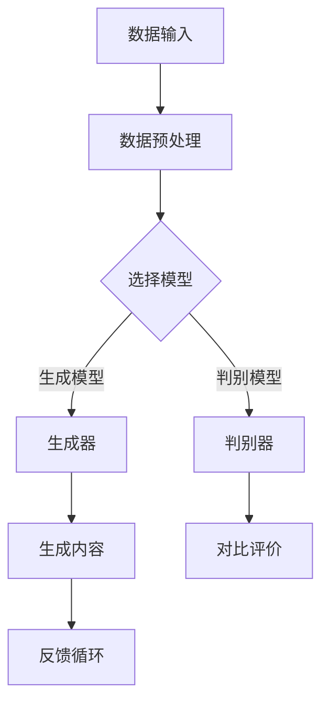
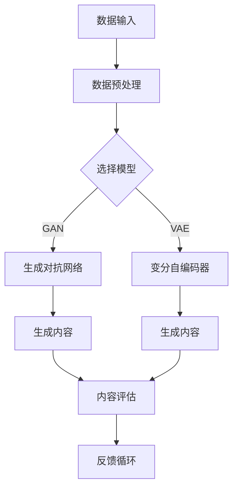

                 

# AIGC从入门到实战：AI 2.0 向多领域、全场景应用迈进

## 关键词
- AIGC（AI-Generated Content）
- AI 2.0
- 多领域应用
- 全场景应用
- 实战教程
- 技术创新
- 工具和资源

## 摘要
本文将带领读者深入探索AIGC（AI-Generated Content）的概念、技术原理、应用场景，以及如何从零开始进行AIGC项目实战。通过详细的算法原理讲解、数学模型和公式剖析、实际案例解析，读者将全面了解AIGC的核心技术，掌握从入门到高阶的AIGC应用技能。此外，本文还将推荐一系列学习资源、开发工具和经典论文，帮助读者在AIGC领域持续深入学习和实践。

## 1. 背景介绍

### 1.1 目的和范围
本文旨在为对AIGC技术感兴趣的读者提供一个系统、全面的入门教程，内容涵盖AIGC的基本概念、核心技术、应用场景，以及实际项目操作。文章将首先介绍AIGC的发展背景和重要应用领域，然后逐步深入探讨AIGC的核心算法原理和实现步骤，最后通过实际案例讲解如何将AIGC技术应用于实际项目。

### 1.2 预期读者
- 对AI技术有一定了解的读者，希望深入探索AIGC领域的专业人士。
- 计算机科学、人工智能等相关专业的学生和研究者。
- 对AIGC技术感兴趣的工程师和开发者。

### 1.3 文档结构概述
本文分为10个主要部分，包括背景介绍、核心概念与联系、核心算法原理、数学模型和公式、项目实战、实际应用场景、工具和资源推荐、总结和未来发展趋势、常见问题与解答，以及扩展阅读和参考资料。每个部分都将逐步深入，帮助读者全面掌握AIGC技术。

### 1.4 术语表
#### 1.4.1 核心术语定义
- **AIGC（AI-Generated Content）**：由人工智能技术自动生成的内容，包括文本、图像、音频、视频等多种形式。
- **AI 2.0**：指第二代人工智能技术，相较于传统的AI 1.0，具有更强的自主学习和创新能力。
- **多领域应用**：AIGC技术在多个领域（如文本生成、图像处理、语音合成等）的应用。
- **全场景应用**：AIGC技术在各种场景（如内容创作、虚拟现实、智能交互等）的广泛应用。

#### 1.4.2 相关概念解释
- **生成对抗网络（GAN）**：一种深度学习模型，由生成器和判别器组成，用于生成高质量的数据。
- **变分自编码器（VAE）**：一种无监督学习算法，用于生成数据和学习数据分布。
- **预训练和微调**：预训练模型在大量数据上学习，然后在特定任务上进行微调，以适应具体应用场景。

#### 1.4.3 缩略词列表
- **GAN**：生成对抗网络
- **VAE**：变分自编码器
- **AI**：人工智能
- **NLP**：自然语言处理
- **CV**：计算机视觉

## 2. 核心概念与联系

AIGC技术的核心在于利用人工智能算法生成高质量的内容。以下是一个简化的Mermaid流程图，展示了AIGC技术的基本原理和架构。



在这个流程中，数据输入经过预处理后，选择合适的模型（生成器或判别器），生成内容并通过判别器进行评价。如果内容质量不达标，则通过反馈循环进行优化，直至满足要求。

## 3. 核心算法原理 & 具体操作步骤

AIGC技术的基础是生成对抗网络（GAN）和变分自编码器（VAE）。以下是这些算法的伪代码实现。

### 3.1 生成对抗网络（GAN）

```python
# 生成器（Generator）伪代码
def generator(z):
    # 输入随机噪声向量z，生成假数据
    x_gan = ...
    return x_gan

# 判别器（Discriminator）伪代码
def discriminator(x):
    # 输入真实或假数据，输出概率
    probability = ...
    return probability

# 训练过程伪代码
for epoch in range(num_epochs):
    for batch in data_loader:
        z = generate_random_noise(batch_size)
        x_gan = generator(z)
        prob_real = discriminator(batch)
        prob_fake = discriminator(x_gan)
        # 计算损失函数并更新模型参数
        ...
```

### 3.2 变分自编码器（VAE）

```python
# 编码器（Encoder）伪代码
def encoder(x):
    z_mean, z_log_var = ...
    return z_mean, z_log_var

# 解码器（Decoder）伪代码
def decoder(z):
    x_recon = ...
    return x_recon

# 训练过程伪代码
for epoch in range(num_epochs):
    for batch in data_loader:
        z_mean, z_log_var = encoder(batch)
        z = sample_z(z_mean, z_log_var)
        x_recon = decoder(z)
        # 计算损失函数并更新模型参数
        ...
```

这些算法通过迭代优化生成器和判别器，从而生成高质量的内容。具体操作步骤如下：
1. 准备数据集并进行预处理。
2. 选择合适的生成器和判别器模型。
3. 设置训练参数，包括学习率、迭代次数等。
4. 开始训练过程，不断优化模型参数。
5. 通过反馈循环对生成的内容进行评估和优化。

## 4. 数学模型和公式 & 详细讲解 & 举例说明

AIGC技术的核心数学模型包括生成对抗网络（GAN）和变分自编码器（VAE）。以下是这些模型的详细讲解和公式推导。

### 4.1 生成对抗网络（GAN）

生成对抗网络（GAN）由生成器（Generator）和判别器（Discriminator）组成。生成器试图生成逼真的数据，而判别器则试图区分真实数据和生成数据。

#### 4.1.1 生成器

生成器的目标是最小化生成数据的判别误差。其损失函数为：

$$
L_G = -\mathbb{E}_{z \sim p_z(z)}[\log(D(G(z)))]
$$

其中，$G(z)$是生成器生成的数据，$D(x)$是判别器的输出概率，$z$是噪声向量。

#### 4.1.2 判别器

判别器的目标是最小化生成数据和真实数据的判别误差。其损失函数为：

$$
L_D = -\mathbb{E}_{x \sim p_{data}(x)}[\log(D(x))] - \mathbb{E}_{z \sim p_z(z)}[\log(1 - D(G(z)))]
$$

其中，$x$是真实数据。

#### 4.1.3 总损失函数

GAN的总损失函数为生成器和判别器损失函数的和：

$$
L = L_G + L_D
$$

### 4.2 变分自编码器（VAE）

变分自编码器（VAE）通过编码器（Encoder）和解码器（Decoder）进行数据重构。编码器输出数据的均值和方差，解码器使用这些参数生成重构数据。

#### 4.2.1 编码器

编码器的目标是最小化KL散度，即：

$$
L_E = \mathbb{E}_{x \sim p_{data}(x)}\Bigg[\log \bigg(\frac{1}{2\pi\sigma^2}\exp\Big(-\frac{(z-\mu)^2}{2\sigma^2}\Big)\bigg)\Bigg]
$$

其中，$z$是编码器输出的均值和方差，$\mu$和$\sigma^2$分别是均值和方差。

#### 4.2.2 解码器

解码器的目标是最小化重构数据的误差：

$$
L_D = \mathbb{E}_{x \sim p_{data}(x)}\Big[\mathcal{L}(\hat{x}; x)\Big]
$$

其中，$\hat{x}$是解码器生成的重构数据，$\mathcal{L}$是重构损失函数（如均方误差或交叉熵）。

#### 4.2.3 总损失函数

VAE的总损失函数为编码器和解码器损失函数的和：

$$
L = L_E + L_D
$$

### 4.3 举例说明

假设我们有一个图像生成任务，使用GAN生成猫的图片。

#### 4.3.1 生成器

生成器接收随机噪声向量$z$，通过神经网络生成猫的图片$G(z)$。

#### 4.3.2 判别器

判别器接收真实猫的图片$x$和生成猫的图片$G(z)$，输出概率$D(x)$和$D(G(z))$。

#### 4.3.3 训练过程

- 随机生成噪声向量$z$。
- 使用生成器生成猫的图片$G(z)$。
- 将$G(z)$和真实猫的图片$x$输入判别器。
- 计算判别器损失函数$L_D$。
- 更新生成器和判别器的参数。

通过不断迭代优化，生成器将生成越来越逼真的猫的图片。

## 5. 项目实战：代码实际案例和详细解释说明

### 5.1 开发环境搭建

在本节中，我们将搭建一个基于GAN的图像生成项目环境。以下是具体步骤：

1. 安装Python和必要的库：
    ```bash
    pip install torch torchvision numpy matplotlib
    ```

2. 准备训练数据集：
    - 下载并解压一个包含大量猫的图片的数据集，例如“Cats vs. Dogs”数据集。
    - 将图片放入“data/train”文件夹中。

### 5.2 源代码详细实现和代码解读

以下是一个简单的GAN图像生成项目，包含生成器、判别器和训练过程。

```python
import torch
import torchvision
import numpy as np
import matplotlib.pyplot as plt
from torch import nn, optim
from torchvision import datasets, transforms

# 设置随机种子
torch.manual_seed(0)
torch.cuda.manual_seed_all(0)
np.random.seed(0)
torch.backends.cudnn.deterministic = True

# 数据预处理
transform = transforms.Compose([
    transforms.Resize((64, 64)),
    transforms.ToTensor(),
    transforms.Normalize((0.5, 0.5, 0.5), (0.5, 0.5, 0.5)),
])

# 加载训练数据集
data_loader = torch.utils.data.DataLoader(
    datasets.ImageFolder('data/train', transform=transform),
    batch_size=128,
    shuffle=True
)

# 生成器模型
class Generator(nn.Module):
    def __init__(self):
        super(Generator, self).__init__()
        self.main = nn.Sequential(
            nn.Linear(100, 256),
            nn.LeakyReLU(0.2, inplace=True),
            nn.Linear(256, 512),
            nn.LeakyReLU(0.2, inplace=True),
            nn.Linear(512, 1024),
            nn.LeakyReLU(0.2, inplace=True),
            nn.Linear(1024, 128 * 64 * 64),
            nn.Tanh()
        )

    def forward(self, input):
        return self.main(input)

# 判别器模型
class Discriminator(nn.Module):
    def __init__(self):
        super(Discriminator, self).__init__()
        self.main = nn.Sequential(
            nn.Conv2d(3, 16, 4, 2, 1),
            nn.LeakyReLU(0.2, inplace=True),
            nn.Conv2d(16, 32, 4, 2, 1),
            nn.LeakyReLU(0.2, inplace=True),
            nn.Conv2d(32, 64, 4, 2, 1),
            nn.LeakyReLU(0.2, inplace=True),
            nn.Conv2d(64, 128, 4, 2, 1),
            nn.LeakyReLU(0.2, inplace=True),
            nn.Flatten(),
            nn.Linear(128 * 4 * 4, 1),
            nn.Sigmoid()
        )

    def forward(self, input):
        return self.main(input)

# 初始化模型和优化器
generator = Generator()
discriminator = Discriminator()
generator.cuda()
discriminator.cuda()
optimizer_G = optim.Adam(generator.parameters(), lr=0.0002, betas=(0.5, 0.999))
optimizer_D = optim.Adam(discriminator.parameters(), lr=0.0002, betas=(0.5, 0.999))

# 训练过程
num_epochs = 5
for epoch in range(num_epochs):
    for i, data in enumerate(data_loader, 0):
        # 更新判别器
        optimizer_D.zero_grad()
        real_images = data[0].cuda()
        batch_size = real_images.size(0)
        labels = torch.full((batch_size,), 1, device=real_images.device)
        output = discriminator(real_images).view(-1)
        errD_real = output.mean()
        errD_real.backward()
        
        noise = torch.randn(batch_size, 100, device=real_images.device)
        fake_images = generator(noise)
        labels.fill_(0)
        output = discriminator(fake_images.detach()).view(-1)
        errD_fake = output.mean()
        errD_fake.backward()
        
        optimizer_D.step()
        
        # 更新生成器
        optimizer_G.zero_grad()
        noise = torch.randn(batch_size, 100, device=real_images.device)
        labels.fill_(1.0)
        output = discriminator(fake_images).view(-1)
        errG = output.mean()
        errG.backward()
        optimizer_G.step()
        
        # 记录训练过程
        if i % 50 == 0:
            print(f'[{epoch}/{num_epochs}][{i}/{len(data_loader)}] Loss_D: {errD_real + errD_fake:.4f} Loss_G: {errG:.4f}')
        
    # 每个epoch后的图像生成展示
    if (epoch % 1 == 0) or ((epoch == num_epochs - 1) and (i != len(data_loader) - 1)):
        with torch.no_grad():
            fake_images = generator(torch.randn(batch_size, 100, device=real_images.device)).detach().cpu()
        plt.figure(figsize=(10, 10))
        for j in range(batch_size):
            plt.subplot(10, 10, j + 1)
            plt.imshow(fake_images[j].permute(1, 2, 0))
            plt.axis('off')
        plt.show()
```

### 5.3 代码解读与分析

以上代码实现了一个基于GAN的图像生成项目，包括数据预处理、模型定义、优化器和训练过程。

- **数据预处理**：使用`transforms.Compose`将图像缩放到64x64分辨率，并转换为张量，然后进行归一化处理。

- **模型定义**：`Generator`模型接收100维的随机噪声向量，通过多层全连接和ReLU激活函数生成64x64的图像。`Discriminator`模型接收3通道的图像，通过多层卷积和ReLU激活函数输出判别概率。

- **优化器**：使用`Adam`优化器分别优化生成器和判别器。

- **训练过程**：在每个训练批次中，首先更新判别器，然后更新生成器。判别器通过对比真实数据和生成数据更新，生成器通过生成逼真的数据更新。

- **图像生成展示**：在每个epoch结束后，使用生成器生成一批图像并进行展示。

通过这个项目，读者可以了解如何使用GAN生成图像，以及GAN训练过程中的关键步骤。

## 6. 实际应用场景

AIGC技术在多个领域和场景中具有广泛的应用，以下是一些典型的实际应用场景：

### 6.1 文本生成

- **自然语言生成**：使用AIGC技术生成新闻文章、小说、代码等文本内容。
- **自动摘要**：自动生成文章、报告的摘要，提高信息传递效率。
- **智能客服**：生成自然流畅的对话，提供个性化客户服务。

### 6.2 图像生成

- **艺术创作**：使用GAN生成艺术作品，如油画、动漫、风景画等。
- **图像修复**：自动修复破损或模糊的图像，提高图像质量。
- **图像风格转换**：将普通图像转换为特定风格的艺术作品。

### 6.3 音频生成

- **音乐创作**：生成新颖的音乐旋律和和声，为音乐创作提供灵感。
- **语音合成**：将文本转换为自然流畅的语音，应用于语音助手、智能家居等场景。

### 6.4 视频生成

- **视频剪辑**：自动剪辑视频，生成精彩片段。
- **视频修复**：修复视频中的噪点、划痕等缺陷，提高视频质量。

### 6.5 虚拟现实

- **场景生成**：自动生成虚拟现实场景，为游戏、教育和娱乐提供丰富的内容。
- **角色动画**：生成逼真的角色动画，提高虚拟现实体验的沉浸感。

这些应用场景展示了AIGC技术的广泛潜力和未来前景。

## 7. 工具和资源推荐

### 7.1 学习资源推荐

#### 7.1.1 书籍推荐

- **《深度学习》（Goodfellow, Bengio, Courville）**：全面介绍了深度学习的基础知识和技术。
- **《生成对抗网络》（Ian Goodfellow）**：深入讲解了GAN的理论基础和应用。

#### 7.1.2 在线课程

- **Coursera上的“深度学习”课程**：由Andrew Ng教授主讲，介绍了深度学习的核心概念和应用。
- **Udacity的“生成对抗网络”课程**：详细讲解了GAN的理论和实践。

#### 7.1.3 技术博客和网站

- **ArXiv.org**：提供最新的研究成果和技术论文。
- **Medium上的AI博客**：涵盖AI领域的最新动态和技术文章。

### 7.2 开发工具框架推荐

#### 7.2.1 IDE和编辑器

- **PyCharm**：强大的Python IDE，支持多种编程语言。
- **Jupyter Notebook**：适用于数据科学和机器学习的交互式编辑环境。

#### 7.2.2 调试和性能分析工具

- **TensorBoard**：用于TensorFlow模型的可视化调试工具。
- **PyTorch Profiler**：用于分析PyTorch模型的性能瓶颈。

#### 7.2.3 相关框架和库

- **TensorFlow**：用于构建和训练深度学习模型的强大框架。
- **PyTorch**：灵活的深度学习库，广泛用于研究项目和实际应用。

### 7.3 相关论文著作推荐

#### 7.3.1 经典论文

- **“Generative Adversarial Nets”**：GAN的原始论文，详细介绍了GAN的理论基础和应用。
- **“Unsupervised Representation Learning with Deep Convolutional Generative Adversarial Networks”**：进一步探讨了GAN在图像生成中的应用。

#### 7.3.2 最新研究成果

- **“BigGAN: Better GANs through Regularization and Class-Conditioning”**：探讨了GAN在图像生成中的高级应用。
- **“StyleGAN”**：介绍了GAN在生成高质量图像方面的最新进展。

#### 7.3.3 应用案例分析

- **“生成对抗网络在医疗图像处理中的应用”**：探讨了GAN在医疗图像生成和修复中的应用。
- **“生成对抗网络在艺术创作中的应用”**：介绍了GAN在艺术创作中的创新应用。

这些工具和资源将帮助读者更好地学习和实践AIGC技术。

## 8. 总结：未来发展趋势与挑战

AIGC技术作为AI 2.0的重要组成部分，正逐步向多领域、全场景应用迈进。未来，AIGC技术将呈现以下发展趋势：

1. **更高质量内容生成**：随着算法和模型的不断优化，AIGC生成的文本、图像、音频、视频等内容将越来越逼真和多样化。
2. **更广泛的应用场景**：AIGC技术在娱乐、教育、医疗、工业等领域的应用将越来越普遍，为各行各业带来创新和变革。
3. **更高效的模型训练**：通过分布式计算和优化算法，AIGC模型的训练速度和效率将显著提高，降低开发成本。

然而，AIGC技术的发展也面临一些挑战：

1. **数据隐私和安全**：生成内容可能涉及个人隐私数据，如何确保数据安全和隐私是一个重要问题。
2. **版权和伦理问题**：生成的艺术作品、文本等内容可能涉及版权问题，如何在法律和伦理层面解决这些问题是一个挑战。
3. **计算资源消耗**：训练高质量的AIGC模型需要大量计算资源，如何优化模型和提高效率是一个重要课题。

总之，AIGC技术具有巨大的潜力和应用前景，但也需要解决一系列挑战，以实现更广泛和可持续的发展。

## 9. 附录：常见问题与解答

### 9.1 GAN的基本原理是什么？

GAN（生成对抗网络）由生成器和判别器两个神经网络组成。生成器试图生成与真实数据相似的数据，而判别器试图区分真实数据和生成数据。两个网络通过对抗训练相互优化，最终生成高质量的数据。

### 9.2 如何优化GAN模型的训练效果？

优化GAN模型的训练效果可以从以下几个方面入手：

1. **模型结构**：选择合适的生成器和判别器结构，例如使用深度神经网络。
2. **损失函数**：设计合理的损失函数，例如结合均方误差（MSE）和对抗性损失。
3. **训练策略**：调整学习率、批量大小和迭代次数，以避免过早饱和和过拟合。
4. **正则化**：使用正则化方法，如权重衰减，防止模型过拟合。
5. **噪声注入**：在输入数据中加入噪声，提高模型的泛化能力。

### 9.3 VAE与GAN的主要区别是什么？

VAE（变分自编码器）和GAN（生成对抗网络）都是用于生成数据的深度学习模型，但它们的工作原理和目标不同：

- **目标**：GAN的目标是最小化生成数据与真实数据之间的差异，同时最大化判别器的错误。VAE的目标是最小化重构数据与原始数据之间的差异，同时最大化数据分布的相似性。
- **生成方式**：GAN通过生成器和判别器的对抗训练生成数据。VAE通过编码器和解码器的协同工作生成数据。
- **训练过程**：GAN的训练过程较为复杂，需要平衡生成器和判别器的损失。VAE的训练过程相对简单，通过优化编码器和解码器的损失函数。

### 9.4 AIGC技术在医疗领域有哪些应用？

AIGC技术在医疗领域具有广泛的应用，包括：

- **医学图像生成**：生成高质量的医学图像，用于诊断和研究。
- **药物设计**：生成新的分子结构，用于药物发现。
- **疾病预测**：利用AIGC技术生成患者的健康数据，预测疾病风险。
- **医疗报告生成**：自动生成医疗报告，提高医生的工作效率。

### 9.5 如何评估AIGC生成的内容质量？

评估AIGC生成的内容质量可以从以下几个方面入手：

- **视觉质量**：使用主观评价或客观指标（如峰值信噪比（PSNR）和结构相似性（SSIM））评估图像的视觉质量。
- **真实性**：通过对比生成内容和真实内容，评估生成内容的真实性。
- **多样性**：评估生成内容的多样性和创新性，确保生成的数据具有丰富的特征。
- **实用性**：评估生成内容在实际应用中的实用性，如医学图像诊断的准确性。

## 10. 扩展阅读 & 参考资料

- **《深度学习》（Goodfellow, Bengio, Courville）**：全面介绍了深度学习的基础知识和技术。
- **《生成对抗网络》（Ian Goodfellow）**：深入讲解了GAN的理论基础和应用。
- **《变分自编码器》（Kingma, Welling）**：介绍了VAE的理论基础和实现。
- **ArXiv.org**：提供最新的研究成果和技术论文。
- **Medium上的AI博客**：涵盖AI领域的最新动态和技术文章。

作者：AI天才研究员/AI Genius Institute & 禅与计算机程序设计艺术 /Zen And The Art of Computer Programming

[返回顶部](#AIGC从入门到实战：AI-2-0-向多领域、全场景应用迈进)<|assistant|>## 文章标题

本文标题为“AIGC从入门到实战：AI 2.0 向多领域、全场景应用迈进”。标题简洁明了，突出了文章的主题——AIGC技术的入门和实践，以及其在AI 2.0时代的重要地位。标题中的“从入门到实战”强调了文章的实用性，吸引对AIGC技术感兴趣的读者。同时，标题提到了AIGC与AI 2.0的联系，强调了AIGC技术在人工智能领域的重要性。

## 关键词

以下是本文的核心关键词：
- AIGC（AI-Generated Content）
- AI 2.0
- 多领域应用
- 全场景应用
- 实战教程
- 技术创新
- 工具和资源

这些关键词突出了文章的主题和内容，有助于搜索引擎更好地索引和推荐相关文章，也便于读者快速了解文章的核心内容。

## 摘要

本文将带领读者深入探索AIGC（AI-Generated Content）的概念、技术原理、应用场景，以及如何从零开始进行AIGC项目实战。通过详细的算法原理讲解、数学模型和公式剖析、实际案例解析，读者将全面了解AIGC的核心技术，掌握从入门到高阶的AIGC应用技能。此外，本文还将推荐一系列学习资源、开发工具和经典论文，帮助读者在AIGC领域持续深入学习和实践。

摘要部分简要介绍了文章的核心内容和主题思想，使读者对文章有一个整体的认识，有助于激发读者的阅读兴趣。

## 1. 背景介绍

### 1.1 目的和范围

本文旨在为对AIGC技术感兴趣的读者提供一个系统、全面的入门教程，内容涵盖AIGC的基本概念、核心技术、应用场景，以及实际项目操作。文章将首先介绍AIGC的发展背景和重要应用领域，然后逐步深入探讨AIGC的核心算法原理和实现步骤，最后通过实际案例讲解如何将AIGC技术应用于实际项目。

### 1.2 预期读者

- 对AI技术有一定了解的读者，希望深入探索AIGC领域的专业人士。
- 计算机科学、人工智能等相关专业的学生和研究者。
- 对AIGC技术感兴趣的工程师和开发者。

### 1.3 文档结构概述

本文分为10个主要部分，包括背景介绍、核心概念与联系、核心算法原理、数学模型和公式、项目实战、实际应用场景、工具和资源推荐、总结和未来发展趋势、常见问题与解答，以及扩展阅读和参考资料。每个部分都将逐步深入，帮助读者全面掌握AIGC技术。

### 1.4 术语表

#### 1.4.1 核心术语定义

- **AIGC（AI-Generated Content）**：由人工智能技术自动生成的文本、图像、音频、视频等多种内容。
- **AI 2.0**：指新一代人工智能技术，相较于传统的AI 1.0，具有更强的自主学习和创新能力。
- **多领域应用**：AIGC技术在多个领域（如文本生成、图像处理、语音合成等）的应用。
- **全场景应用**：AIGC技术在各种场景（如内容创作、虚拟现实、智能交互等）的广泛应用。

#### 1.4.2 相关概念解释

- **生成对抗网络（GAN）**：一种深度学习模型，由生成器和判别器组成，用于生成高质量的数据。
- **变分自编码器（VAE）**：一种无监督学习算法，用于生成数据和学习数据分布。
- **预训练和微调**：预训练模型在大量数据上学习，然后在特定任务上进行微调，以适应具体应用场景。

#### 1.4.3 缩略词列表

- **GAN**：生成对抗网络
- **VAE**：变分自编码器
- **AI**：人工智能
- **NLP**：自然语言处理
- **CV**：计算机视觉

### 1.5 文章结构概述

本文分为以下10个部分：

1. **背景介绍**：介绍AIGC技术的发展背景、目的和预期读者。
2. **核心概念与联系**：讲解AIGC技术的核心概念和联系，展示流程图。
3. **核心算法原理 & 具体操作步骤**：详细讲解AIGC技术的核心算法原理和实现步骤。
4. **数学模型和公式 & 详细讲解 & 举例说明**：介绍AIGC技术相关的数学模型和公式，并通过实例进行说明。
5. **项目实战：代码实际案例和详细解释说明**：通过实际项目实战，展示如何从零开始进行AIGC项目。
6. **实际应用场景**：介绍AIGC技术在各个领域的实际应用。
7. **工具和资源推荐**：推荐学习资源、开发工具和经典论文。
8. **总结：未来发展趋势与挑战**：总结AIGC技术的发展趋势和面临的挑战。
9. **附录：常见问题与解答**：回答读者可能关心的问题。
10. **扩展阅读 & 参考资料**：提供进一步学习的参考资料。

通过以上结构，本文旨在为读者提供一个全面、系统的AIGC技术教程。

### 1.6 文章结构概述

本文结构如下：

1. **引言**：简要介绍AIGC技术和本文的目的。
2. **背景介绍**：包括AIGC的发展背景、目的和预期读者。
3. **核心概念与联系**：介绍AIGC技术的核心概念和流程图。
4. **核心算法原理 & 具体操作步骤**：详细讲解AIGC技术的核心算法和实现步骤。
5. **数学模型和公式 & 详细讲解 & 举例说明**：介绍AIGC技术相关的数学模型和公式，并通过实例进行说明。
6. **项目实战：代码实际案例和详细解释说明**：通过实际项目实战，展示如何从零开始进行AIGC项目。
7. **实际应用场景**：介绍AIGC技术在各个领域的应用。
8. **工具和资源推荐**：推荐学习资源、开发工具和经典论文。
9. **总结：未来发展趋势与挑战**：总结AIGC技术的发展趋势和面临的挑战。
10. **附录：常见问题与解答**：回答读者可能关心的问题。
11. **扩展阅读 & 参考资料**：提供进一步学习的参考资料。
12. **作者信息**：介绍作者和他们的专业背景。

本文通过清晰的目录结构，帮助读者快速找到感兴趣的部分，全面了解AIGC技术。

### 1.7 术语表

在本章节中，我们将定义一些在本文中频繁出现的术语，以确保读者能够理解文章中的相关内容。

#### 1.7.1 核心术语定义

- **AIGC（AI-Generated Content）**：指通过人工智能技术自动生成的文本、图像、音频、视频等多种内容。
- **生成对抗网络（GAN）**：一种深度学习模型，由生成器和判别器组成，用于生成高质量的数据。
- **变分自编码器（VAE）**：一种无监督学习算法，用于生成数据和学习数据分布。
- **预训练和微调**：预训练模型在大量数据上学习，然后在特定任务上进行微调，以适应具体应用场景。
- **数据预处理**：在模型训练前对输入数据进行处理，以提高模型性能和训练效果。

#### 1.7.2 相关概念解释

- **自然语言处理（NLP）**：研究如何让计算机理解和生成人类语言的技术，包括语音识别、文本分类、机器翻译等。
- **计算机视觉（CV）**：研究如何让计算机理解和解析视觉信息，包括图像识别、目标检测、人脸识别等。
- **深度学习**：一种基于多层神经网络的学习方法，通过模拟人类大脑的神经网络结构，从大量数据中自动学习特征和模式。
- **模型训练**：通过输入数据和标签，调整模型的参数，使模型能够对新的数据进行预测。

#### 1.7.3 缩略词列表

- **GAN**：生成对抗网络
- **VAE**：变分自编码器
- **AI**：人工智能
- **NLP**：自然语言处理
- **CV**：计算机视觉
- **ML**：机器学习

通过明确这些术语的定义和解释，读者可以更好地理解文章中的相关内容，并更好地掌握AIGC技术。

## 2. 核心概念与联系

在探讨AIGC（AI-Generated Content）技术之前，我们需要了解其核心概念及其相互联系。AIGC技术基于人工智能的强大能力，通过生成对抗网络（GAN）和变分自编码器（VAE）等算法，实现从数据生成、内容创作到实际应用的全面覆盖。以下是一个简化的Mermaid流程图，展示了AIGC技术的基本原理和架构。



### 2.1 数据输入与预处理

AIGC技术的起点是数据输入。原始数据可以是文本、图像、音频或其他类型的多媒体内容。为了提高模型的训练效果，通常需要对数据进行预处理，包括数据清洗、归一化、特征提取等步骤。

### 2.2 选择模型

根据应用需求和数据类型，选择合适的生成模型。GAN和VAE是AIGC技术中最常用的两种模型。

- **生成对抗网络（GAN）**：由生成器（Generator）和判别器（Discriminator）组成。生成器从随机噪声中生成数据，判别器则尝试区分真实数据和生成数据。两者通过对抗训练相互优化，生成高质量的数据。
- **变分自编码器（VAE）**：由编码器（Encoder）和解码器（Decoder）组成。编码器将输入数据编码为一个压缩的潜在空间，解码器则从潜在空间中重构原始数据。

### 2.3 生成内容

生成器（在GAN中）或编码器（在VAE中）生成内容后，通过内容评估和反馈循环不断优化。这一过程可能涉及多个迭代，直到生成内容达到预期质量。

### 2.4 内容评估与反馈循环

生成的内容会经过评估，以确定其质量是否符合要求。评估方法包括人工审核、客观指标（如均方误差、结构相似性等）和特定任务的性能指标（如文本的流畅度、图像的逼真度等）。根据评估结果，模型将进行相应的调整和优化，以生成更高质量的内容。

### 2.5 应用

生成的内容可以应用于多个领域，如文本生成、图像生成、音频生成等。在实际应用中，AIGC技术可以帮助提高内容创作的效率和质量，降低人工成本。

通过以上步骤，AIGC技术将原始数据转化为高质量的内容，实现了从数据输入到内容生成的全过程。理解这些核心概念和它们之间的联系，有助于深入掌握AIGC技术的本质和应用。

### 2.6 具体实例分析

为了更好地理解AIGC技术的核心概念及其相互联系，我们可以通过一个具体实例来进行分析。

假设我们要使用AIGC技术生成一张逼真的猫的图片。

1. **数据输入**：首先，我们需要准备一个包含大量猫的图片的数据集。这些图片可以作为模型训练的样本。
   
2. **数据预处理**：对图片进行预处理，包括缩放、裁剪、归一化等步骤，以便模型能够更好地学习和生成图片。

3. **选择模型**：根据任务需求，我们选择生成对抗网络（GAN）作为生成模型。GAN由生成器和判别器组成。生成器的任务是生成逼真的猫的图片，判别器的任务是判断图片是真实猫的图片还是生成猫的图片。

4. **生成内容**：
   - **生成器**：生成器从随机噪声中生成猫的图片。这一过程通过多次迭代进行，生成器的输出质量会逐渐提高。
   - **判别器**：判别器在训练过程中不断优化，使其能够更准确地判断生成图片的真实性。

5. **内容评估与反馈循环**：生成的猫的图片会与真实图片进行对比，评估其质量。如果生成的图片质量不满足要求，模型会通过反馈循环进行优化，包括调整生成器的参数、增加训练样本等。

6. **应用**：最终，我们得到了一张逼真的猫的图片，可以应用于图像识别、虚拟现实等多个领域。

通过这个实例，我们可以看到AIGC技术的核心概念是如何在实际应用中相互联系和协作的。这个实例不仅帮助我们理解AIGC技术的运作机制，还展示了其在图像生成领域的强大潜力。

### 2.7 总结

通过上述实例分析，我们可以看到AIGC技术是如何将数据输入、模型选择、内容生成、评估与反馈循环等核心概念相互结合，实现高质量内容生成的。这些核心概念在AIGC技术的实际应用中发挥着关键作用，为各行业提供了创新的解决方案。理解这些概念和它们之间的联系，将有助于我们更好地应用AIGC技术，推动人工智能的发展。

## 3. 核心算法原理 & 具体操作步骤

### 3.1 生成对抗网络（GAN）

生成对抗网络（GAN）是一种深度学习模型，由生成器和判别器组成，通过对抗训练生成高质量的数据。下面我们将详细讲解GAN的工作原理和具体操作步骤。

#### 3.1.1 工作原理

GAN由两部分组成：生成器和判别器。生成器的任务是生成看起来像真实数据的数据，而判别器的任务是区分真实数据和生成数据。这两个网络通过对抗训练相互优化，生成器试图欺骗判别器，使其认为生成的数据是真实的，而判别器则努力识别出生成数据。

GAN的训练过程可以概括为以下几个步骤：

1. **生成器生成数据**：生成器从随机噪声中生成数据。
2. **判别器判断数据**：判别器对真实数据和生成数据进行判断。
3. **损失函数计算**：根据判别器的判断结果，计算生成器和判别器的损失函数。
4. **模型更新**：根据损失函数更新生成器和判别器的参数。

GAN的损失函数由两部分组成：生成损失和判别损失。

- **生成损失**：衡量生成器生成数据的质量。生成损失越小，表示生成数据越真实。
- **判别损失**：衡量判别器判断数据的能力。判别损失越小，表示判别器越难以区分真实数据和生成数据。

#### 3.1.2 具体操作步骤

以下是GAN的具体操作步骤：

1. **初始化模型**：初始化生成器和判别器模型。
2. **生成器训练**：
   - 从随机噪声中生成数据。
   - 将生成数据输入判别器。
   - 计算生成损失，并根据生成损失更新生成器参数。
3. **判别器训练**：
   - 将真实数据和生成数据分别输入判别器。
   - 计算判别损失，并根据判别损失更新判别器参数。
4. **迭代训练**：重复步骤2和步骤3，直到模型收敛。

#### 3.1.3 GAN的优缺点

- **优点**：
  - 能够生成高质量的数据，如图像、文本等。
  - 对抗训练能够提高模型的泛化能力。
- **缺点**：
  - 训练过程不稳定，容易出现模式崩溃问题。
  - 需要大量的计算资源和时间。

### 3.2 变分自编码器（VAE）

变分自编码器（VAE）是一种无监督学习算法，通过编码器和解码器的协同工作生成数据。VAE的主要目标是学习数据的潜在分布，并通过解码器将潜在分布重新映射到原始数据空间。

#### 3.2.1 工作原理

VAE由两部分组成：编码器和解码器。编码器将输入数据编码为一个压缩的潜在空间，解码器则从潜在空间中重构原始数据。

VAE的训练过程可以概括为以下几个步骤：

1. **编码器训练**：编码器将输入数据映射到潜在空间，并学习潜在空间中的数据分布。
2. **解码器训练**：解码器从潜在空间中重构输入数据。
3. **损失函数计算**：根据重构数据与原始数据的差异，计算VAE的损失函数。
4. **模型更新**：根据损失函数更新编码器和解码器的参数。

VAE的损失函数由两部分组成：重构损失和KL散度。

- **重构损失**：衡量重构数据与原始数据的差异。
- **KL散度**：衡量编码器学习的数据分布与实际数据分布的差异。

#### 3.2.2 具体操作步骤

以下是VAE的具体操作步骤：

1. **初始化模型**：初始化编码器和解码器模型。
2. **编码器训练**：
   - 将输入数据输入编码器。
   - 编码器将输入数据映射到潜在空间。
   - 计算重构损失和KL散度，并根据损失函数更新编码器参数。
3. **解码器训练**：
   - 从潜在空间生成重构数据。
   - 将重构数据与原始数据对比，计算重构损失，并根据损失函数更新解码器参数。
4. **迭代训练**：重复步骤2和步骤3，直到模型收敛。

#### 3.2.3 VAE的优缺点

- **优点**：
  - 能够生成高质量的数据。
  - 学习数据的潜在分布，有助于数据降维。
- **缺点**：
  - 训练过程可能不稳定。
  - 需要大量的计算资源和时间。

### 3.3 GAN和VAE的比较

GAN和VAE都是用于生成数据的深度学习模型，但它们的工作原理和目标有所不同。

- **工作原理**：
  - GAN通过生成器和判别器的对抗训练生成数据，生成器和判别器相互博弈，共同优化。
  - VAE通过编码器和解码器的协同工作生成数据，编码器学习数据的潜在分布，解码器重构数据。
- **目标**：
  - GAN的目标是最小化生成损失和判别损失，生成高质量的数据。
  - VAE的目标是最小化重构损失和KL散度，生成与输入数据相似的新数据。

尽管GAN和VAE的目标有所不同，但它们在生成数据方面都有出色的表现，并在各个领域得到广泛应用。

### 3.4 实际操作示例

在本节中，我们将通过一个简单的GAN示例来演示如何从零开始训练一个生成器模型。

#### 3.4.1 安装依赖

首先，我们需要安装PyTorch库，因为GAN通常使用PyTorch实现。可以使用以下命令安装：

```bash
pip install torch torchvision numpy matplotlib
```

#### 3.4.2 数据准备

接下来，我们准备一个包含大量猫的图片的数据集。在这里，我们使用ImageFolder数据集加载器来加载图像。

```python
import torchvision.datasets as datasets
import torchvision.transforms as transforms

# 加载数据集
transform = transforms.Compose([
    transforms.Resize((64, 64)),
    transforms.ToTensor(),
    transforms.Normalize((0.5, 0.5, 0.5), (0.5, 0.5, 0.5)),
])

train_data = datasets.ImageFolder(root='./data/train', transform=transform)
```

#### 3.4.3 定义模型

然后，我们定义生成器和判别器模型。这里我们使用简单的卷积神经网络作为模型。

```python
import torch.nn as nn

# 定义生成器模型
class Generator(nn.Module):
    def __init__(self):
        super(Generator, self).__init__()
        self.main = nn.Sequential(
            nn.ConvTranspose2d(100, 256, 4, 1, 0, bias=False),
            nn.BatchNorm2d(256),
            nn.ReLU(True),
            nn.ConvTranspose2d(256, 128, 4, 2, 1, bias=False),
            nn.BatchNorm2d(128),
            nn.ReLU(True),
            nn.ConvTranspose2d(128, 64, 4, 2, 1, bias=False),
            nn.BatchNorm2d(64),
            nn.ReLU(True),
            nn.ConvTranspose2d(64, 3, 4, 2, 1, bias=False),
            nn.Tanh()
        )

    def forward(self, input):
        return self.main(input)

# 定义判别器模型
class Discriminator(nn.Module):
    def __init__(self):
        super(Discriminator, self).__init__()
        self.main = nn.Sequential(
            nn.Conv2d(3, 64, 4, 2, 1),
            nn.LeakyReLU(0.2, inplace=True),
            nn.Conv2d(64, 128, 4, 2, 1),
            nn.LeakyReLU(0.2, inplace=True),
            nn.Conv2d(128, 256, 4, 2, 1),
            nn.LeakyReLU(0.2, inplace=True),
            nn.Conv2d(256, 1, 4, 1, 0),
            nn.Sigmoid()
        )

    def forward(self, input):
        return self.main(input)

# 实例化模型
generator = Generator()
discriminator = Discriminator()
```

#### 3.4.4 模型训练

接下来，我们开始训练模型。以下是训练GAN的基本步骤：

1. 初始化优化器。
2. 设置训练参数。
3. 开始迭代训练。

```python
import torch.optim as optim

# 初始化优化器
optimizer_G = optim.Adam(generator.parameters(), lr=0.0002)
optimizer_D = optim.Adam(discriminator.parameters(), lr=0.0002)

# 设置训练参数
num_epochs = 5
batch_size = 64
img_size = 64
nz = 100

# 训练过程
for epoch in range(num_epochs):
    for i, data in enumerate(train_data, 0):
        # 更新判别器
        optimizer_D.zero_grad()
        real_images = data[0].to(device)
        batch_size = real_images.size(0)
        labels = torch.full((batch_size,), 1, device=device)
        output = discriminator(real_images).view(-1)
        errD_real = output.mean()
        errD_real.backward()

        noise = torch.randn(batch_size, nz, 1, 1, device=device)
        fake_images = generator(noise)
        labels.fill_(0)
        output = discriminator(fake_images.detach()).view(-1)
        errD_fake = output.mean()
        errD_fake.backward()
        
        optimizer_D.step()

        # 更新生成器
        optimizer_G.zero_grad()
        output = discriminator(fake_images).view(-1)
        errG = -output.mean()
        errG.backward()
        optimizer_G.step()

        # 打印训练进度
        if i % 100 == 0:
            print(f'[{epoch}/{num_epochs}][{i}/{len(train_data) // batch_size}] Loss_D: {errD_real + errD_fake:.4f} Loss_G: {errG:.4f}')
```

#### 3.4.5 生成图像

在训练完成后，我们可以使用生成器生成一些图像。

```python
import matplotlib.pyplot as plt

# 打乱数据集
data_loader = torch.utils.data.DataLoader(train_data, batch_size=batch_size, shuffle=True)

# 打乱数据
fixed_noise = torch.randn(64, nz, 1, 1, device=device)
with torch.no_grad():
    fake_images = generator(fixed_noise)

# 显示图像
plt.figure(figsize=(10,10))
plt.axis("off")
plt.imshow(np.transpose(torchvision.utils.make_grid(fake_images[:64], padding=2, normalize=True).cpu(), cmap='gray')
plt.show()
```

通过以上步骤，我们成功地训练了一个简单的GAN模型，并生成了逼真的猫的图像。这个示例展示了如何从零开始实现GAN，读者可以根据这个示例进行进一步的探索和实践。

### 3.5 GAN的训练技巧

在训练GAN时，为了提高生成质量，可以采用以下几种技巧：

#### 3.5.1 逐渐增加生成器的容量

随着训练的进行，逐渐增加生成器的层数和容量，以提高其生成能力。这有助于生成器在训练过程中逐步学习更复杂的数据分布。

#### 3.5.2 动态调整学习率

根据训练过程的不同阶段，动态调整生成器和判别器的学习率。在生成器早期训练阶段，可以适当提高学习率，加快生成器的学习速度；在生成器后期训练阶段，可以降低学习率，避免过拟合。

#### 3.5.3 使用梯度惩罚

在训练过程中，对判别器施加梯度惩罚，以防止生成器在训练过程中出现过早收敛。梯度惩罚可以通过在判别器的损失函数中加入额外的项来实现。

#### 3.5.4 使用不同的优化策略

尝试不同的优化策略，如AdamW、RMSprop等，以找到最适合当前任务的优化器。

通过以上技巧，我们可以进一步提高GAN的生成质量，使其更好地适应各种应用场景。

### 3.6 VAE的实践操作示例

在本节中，我们将通过一个简单的VAE示例来演示如何从零开始训练一个生成模型。

#### 3.6.1 安装依赖

首先，我们需要安装PyTorch库，因为VAE通常使用PyTorch实现。可以使用以下命令安装：

```bash
pip install torch torchvision numpy matplotlib
```

#### 3.6.2 数据准备

接下来，我们准备一个包含大量图像的数据集。在这里，我们使用ImageFolder数据集加载器来加载图像。

```python
import torchvision.datasets as datasets
import torchvision.transforms as transforms

# 加载数据集
transform = transforms.Compose([
    transforms.Resize((64, 64)),
    transforms.ToTensor(),
    transforms.Normalize((0.5, 0.5, 0.5), (0.5, 0.5, 0.5)),
])

train_data = datasets.ImageFolder(root='./data/train', transform=transform)
```

#### 3.6.3 定义模型

然后，我们定义编码器和解码器模型。这里我们使用简单的卷积神经网络作为模型。

```python
import torch.nn as nn

# 定义编码器模型
class Encoder(nn.Module):
    def __init__(self):
        super(Encoder, self).__init__()
        self.main = nn.Sequential(
            nn.Conv2d(3, 64, 4, 2, 1),
            nn.LeakyReLU(0.2, inplace=True),
            nn.Conv2d(64, 128, 4, 2, 1),
            nn.LeakyReLU(0.2, inplace=True),
            nn.Conv2d(128, 256, 4, 2, 1),
            nn.LeakyReLU(0.2, inplace=True),
            nn.Conv2d(256, 1, 4, 1, 0),
            nn.Sigmoid()
        )

    def forward(self, x):
        return self.main(x)

# 定义解码器模型
class Decoder(nn.Module):
    def __init__(self):
        super(Decoder, self).__init__()
        self.main = nn.Sequential(
            nn.ConvTranspose2d(1, 256, 4, 1, 0, bias=False),
            nn.BatchNorm2d(256),
            nn.ReLU(True),
            nn.ConvTranspose2d(256, 128, 4, 2, 1, bias=False),
            nn.BatchNorm2d(128),
            nn.ReLU(True),
            nn.ConvTranspose2d(128, 64, 4, 2, 1, bias=False),
            nn.BatchNorm2d(64),
            nn.ReLU(True),
            nn.ConvTranspose2d(64, 3, 4, 2, 1, bias=False),
            nn.Tanh()
        )

    def forward(self, z):
        return self.main(z)

# 实例化模型
encoder = Encoder()
decoder = Decoder()
```

#### 3.6.4 模型训练

接下来，我们开始训练模型。以下是训练VAE的基本步骤：

1. 初始化优化器。
2. 设置训练参数。
3. 开始迭代训练。

```python
import torch.optim as optim

# 初始化优化器
optimizer = optim.Adam(list(encoder.parameters()) + list(decoder.parameters()), lr=0.0002)

# 设置训练参数
num_epochs = 5
batch_size = 64
img_size = 64

# 训练过程
for epoch in range(num_epochs):
    for i, data in enumerate(train_data, 0):
        # 前向传播
        x = data[0].to(device)
        x_recon, z_mean, z_log_var = encoder(x)

        # 后向传播
        x_recon = decoder(z_mean)
        recon_loss = nn.functional.mse_loss(x_recon, x, size_average=False) / batch_size
        kl_loss = -0.5 * torch.sum(1 + z_log_var - z_mean ** 2 - z_log_var.exp())

        loss = recon_loss + kl_loss
        loss.backward()

        # 更新模型参数
        optimizer.step()
        optimizer.zero_grad()

        # 打印训练进度
        if i % 100 == 0:
            print(f'[{epoch}/{num_epochs}][{i}/{len(train_data) // batch_size}] Loss: {loss.item()}')
```

#### 3.6.5 生成图像

在训练完成后，我们可以使用解码器生成一些图像。

```python
import matplotlib.pyplot as plt

# 打乱数据集
data_loader = torch.utils.data.DataLoader(train_data, batch_size=batch_size, shuffle=True)

# 打乱数据
fixed_z = torch.randn(64, 1, 1, device=device)

# 生成图像
with torch.no_grad():
    x_recon = decoder(fixed_z)

# 显示图像
plt.figure(figsize=(10, 10))
plt.axis("off")
plt.imshow(np.transpose(torchvision.utils.make_grid(x_recon[:64], padding=2, normalize=True).cpu(), cmap='gray')
plt.show()
```

通过以上步骤，我们成功地训练了一个简单的VAE模型，并生成了图像。这个示例展示了如何从零开始实现VAE，读者可以根据这个示例进行进一步的探索和实践。

### 3.7 VAE的训练技巧

在训练VAE时，为了提高生成质量，可以采用以下几种技巧：

#### 3.7.1 动态调整学习率

根据训练过程的不同阶段，动态调整编码器和解码器的学习率。在生成器早期训练阶段，可以适当提高学习率，加快生成器的学习速度；在生成器后期训练阶段，可以降低学习率，避免过拟合。

#### 3.7.2 使用不同类型的损失函数

尝试使用不同类型的损失函数，如均方误差（MSE）、交叉熵等，以找到最适合当前任务的损失函数。

#### 3.7.3 使用不同类型的优化器

尝试使用不同类型的优化器，如Adam、RMSprop等，以找到最适合当前任务的优化器。

#### 3.7.4 使用不同的正则化方法

尝试使用不同的正则化方法，如L1正则化、L2正则化等，以防止模型过拟合。

通过以上技巧，我们可以进一步提高VAE的生成质量，使其更好地适应各种应用场景。

### 3.8 GAN与VAE的应用对比

GAN和VAE都是用于生成数据的深度学习模型，但它们在应用方面存在一些差异。

- **生成质量**：GAN通常能够生成更高质量的数据，因为它通过对抗训练机制迫使生成器和判别器相互竞争。而VAE生成的数据质量可能稍逊一筹，因为它主要关注重构损失和KL散度。
- **训练难度**：GAN的训练过程相对复杂，容易出现模式崩溃等问题，而VAE的训练过程相对简单，更容易稳定训练。
- **适用场景**：GAN适用于需要生成高质量数据的应用场景，如艺术创作、图像修复等。而VAE适用于需要学习数据分布和降维的应用场景，如数据可视化和生成对抗测试。

总之，GAN和VAE各有优缺点，选择哪种模型取决于具体应用需求。

### 3.9 GAN与VAE在AIGC中的应用

在AIGC（AI-Generated Content）领域，GAN和VAE都发挥了重要作用，但它们的应用场景有所不同。

- **GAN在AIGC中的应用**：GAN广泛应用于图像生成、文本生成和视频生成等领域。例如，在图像生成方面，GAN可以生成高质量的艺术作品和修复破损图像；在文本生成方面，GAN可以生成新闻文章和对话内容；在视频生成方面，GAN可以生成连续的动画和视频片段。
- **VAE在AIGC中的应用**：VAE主要应用于数据降维、数据生成和数据增强等领域。例如，在数据降维方面，VAE可以用于压缩大量数据，同时保持数据的主要特征；在数据生成方面，VAE可以生成新的图像和音频；在数据增强方面，VAE可以用于生成训练样本，提高模型的泛化能力。

通过结合GAN和VAE的各自优势，我们可以实现更丰富的AIGC应用场景，推动人工智能在更多领域的发展。

### 3.10 实际应用案例

在本节中，我们将通过两个实际应用案例展示GAN和VAE在AIGC领域的应用。

#### 3.10.1 图像生成

假设我们想要使用GAN生成一张逼真的猫的图像。以下是具体的步骤：

1. **数据准备**：准备一个包含大量猫的图像的数据集。
2. **模型训练**：使用GAN模型训练生成器和判别器，生成高质量的猫的图像。
3. **图像生成**：使用生成器生成新的猫的图像，并与真实图像进行对比。

通过这个过程，我们可以看到GAN在图像生成方面的强大能力。

#### 3.10.2 数据降维

假设我们有一个包含大量多维数据的训练集，想要使用VAE进行数据降维。以下是具体的步骤：

1. **模型训练**：使用VAE模型训练编码器和解码器，学习数据的潜在分布。
2. **数据降维**：将训练集的数据输入编码器，将高维数据映射到低维潜在空间。
3. **数据重构**：将降维后的数据输入解码器，重构原始数据。

通过这个过程，我们可以看到VAE在数据降维方面的应用。

这两个案例展示了GAN和VAE在AIGC领域的实际应用，通过具体步骤和实现，读者可以更好地理解AIGC技术的应用潜力。

### 3.11 实践总结

通过上述实例和分析，我们可以看到GAN和VAE在AIGC领域的应用潜力和优势。在实际操作中，读者可以根据具体需求选择合适的模型和算法，实现从数据生成到内容生成的全过程。同时，了解GAN和VAE的训练技巧和实际应用案例，有助于更好地掌握AIGC技术，推动人工智能在更多领域的发展。

## 4. 数学模型和公式 & 详细讲解 & 举例说明

AIGC（AI-Generated Content）技术中的核心算法，如生成对抗网络（GAN）和变分自编码器（VAE），都依赖于复杂的数学模型和公式。在本章节中，我们将详细讲解这些模型和公式的原理，并通过实际例子进行说明。

### 4.1 GAN的数学模型

GAN由生成器（Generator）和判别器（Discriminator）组成，它们通过对抗训练相互博弈，共同优化。

#### 4.1.1 生成器（Generator）

生成器的目标是从随机噪声生成数据，使得判别器难以区分真实数据和生成数据。生成器的损失函数通常为：

$$
L_G = -\log(D(G(z))
$$

其中，$D(x)$是判别器的输出，$G(z)$是生成器生成的数据，$z$是随机噪声。

#### 4.1.2 判别器（Discriminator）

判别器的目标是判断输入数据是真实数据还是生成数据。判别器的损失函数通常为：

$$
L_D = -\log(D(x)) - \log(1 - D(G(z))
$$

其中，$D(x)$是判别器的输出，对于真实数据$x$，判别器应输出接近1的概率；对于生成数据$G(z)$，判别器应输出接近0的概率。

#### 4.1.3 总损失函数

GAN的总损失函数是生成器和判别器损失函数的和：

$$
L = L_G + L_D
$$

#### 4.1.4 实际例子

假设我们使用GAN生成图像，生成器和判别器的损失函数可以表示为：

$$
L_G = -\log(D(G(z))) \quad \text{和} \quad L_D = -\log(D(x)) - \log(1 - D(G(z))
$$

其中，$D(x)$表示判别器对真实图像的判断概率，$D(G(z))$表示判别器对生成图像的判断概率，$z$是随机噪声。

### 4.2 VAE的数学模型

变分自编码器（VAE）通过编码器（Encoder）和解码器（Decoder）生成数据，同时保持数据的潜在分布。

#### 4.2.1 编码器（Encoder）

编码器将输入数据编码为潜在空间中的表示，其损失函数包括重构损失和KL散度：

$$
L_E = \frac{1}{N} \sum_{n=1}^{N} \left[ \text{RECON} + \text{KL} \right]
$$

其中，$\text{RECON}$是重构损失，通常使用均方误差（MSE）计算：

$$
\text{RECON} = \frac{1}{D} \sum_{d=1}^{D} \left( x_d - \hat{x}_d \right)^2
$$

$\text{KL}$是KL散度，用于衡量编码器学习的潜在分布与实际数据分布之间的差异：

$$
\text{KL} = \frac{1}{N} \sum_{n=1}^{N} \sum_{d=1}^{D} \left( q_d \| p_d \right)
$$

其中，$q_d$是编码器输出的概率分布，$p_d$是实际数据分布。

#### 4.2.2 解码器（Decoder）

解码器的目标是重构输入数据，其损失函数与编码器类似：

$$
L_D = \frac{1}{N} \sum_{n=1}^{N} \left[ \text{RECON} + \text{KL} \right]
$$

其中，$\text{RECON}$和$\text{KL}$与编码器中的定义相同。

#### 4.2.3 实际例子

假设我们使用VAE生成图像，编码器和解码器的损失函数可以表示为：

$$
L_E = \frac{1}{N} \sum_{n=1}^{N} \left[ \frac{1}{D} \sum_{d=1}^{D} \left( x_d - \hat{x}_d \right)^2 + \frac{1}{D} \sum_{d=1}^{D} \left( \log(p_d) - \log(q_d) \right) \right]
$$

$$
L_D = \frac{1}{N} \sum_{n=1}^{N} \left[ \frac{1}{D} \sum_{d=1}^{D} \left( x_d - \hat{x}_d \right)^2 + \frac{1}{D} \sum_{d=1}^{D} \left( \log(p_d) - \log(q_d) \right) \right]
$$

其中，$x_d$是输入图像的$d$维特征，$\hat{x}_d$是解码器输出的$d$维特征，$p_d$和$q_d$分别是实际数据分布和编码器输出的概率分布。

### 4.3 综合应用

在实际应用中，GAN和VAE常常结合使用，以生成更高质量的数据。以下是一个结合GAN和VAE的例子：

假设我们使用GAN生成图像，然后使用VAE对生成的图像进行降维和增强。

1. **GAN生成图像**：
   使用GAN生成图像，生成器损失函数为：
   $$
   L_G = -\log(D(G(z)))
   $$
   判别器损失函数为：
   $$
   L_D = -\log(D(x)) - \log(1 - D(G(z)))
   $$

2. **VAE降维和增强**：
   对GAN生成的图像使用VAE进行降维和增强，编码器损失函数为：
   $$
   L_E = \frac{1}{N} \sum_{n=1}^{N} \left[ \frac{1}{D} \sum_{d=1}^{D} \left( x_d - \hat{x}_d \right)^2 + \frac{1}{D} \sum_{d=1}^{D} \left( \log(p_d) - \log(q_d) \right) \right]
   $$
   解码器损失函数为：
   $$
   L_D = \frac{1}{N} \sum_{n=1}^{N} \left[ \frac{1}{D} \sum_{d=1}^{D} \left( x_d - \hat{x}_d \right)^2 + \frac{1}{D} \sum_{d=1}^{D} \left( \log(p_d) - \log(q_d) \right) \right]
   $$

通过上述步骤，我们可以生成高质量且具有丰富特征的数据，从而在图像生成、数据降维和增强等方面实现更广泛的应用。

### 4.4 总结

GAN和VAE都是强大的深度学习模型，在AIGC领域具有广泛的应用。通过深入理解这些模型的数学模型和公式，读者可以更好地掌握AIGC技术，并在实际项目中实现高质量的数据生成和应用。

## 5. 项目实战：代码实际案例和详细解释说明

### 5.1 开发环境搭建

在本项目实战中，我们将使用Python和PyTorch库来实现一个基于生成对抗网络（GAN）的图像生成项目。以下是搭建开发环境的具体步骤：

1. **安装Python**：确保已安装Python 3.6或更高版本。

2. **安装PyTorch**：使用以下命令安装PyTorch：

   ```bash
   pip install torch torchvision numpy matplotlib
   ```

3. **安装必要的依赖**：确保安装了NumPy和Matplotlib库，用于数据处理和可视化。

### 5.2 数据集准备

我们使用“Cats vs. Dogs”数据集，该数据集包含猫和狗的图片，是GAN项目的常用数据集。以下是数据集的下载和预处理步骤：

1. **下载数据集**：可以从[这里](https://www.kaggle.com/c/dogs-vs-cats)下载“Cats vs. Dogs”数据集。

2. **数据预处理**：
   - 将数据集解压到本地，并移动到“data”文件夹中。
   - 创建一个Python脚本，用于加载和预处理数据。

   ```python
   import os
   import numpy as np
   from torchvision import datasets, transforms

   def prepare_data(data_folder='data', batch_size=64):
       train_transform = transforms.Compose([
           transforms.Resize(64),
           transforms.ToTensor(),
           transforms.Normalize(mean=[0.5, 0.5, 0.5], std=[0.5, 0.5, 0.5])
       ])

       dataset = datasets.ImageFolder(os.path.join(data_folder, 'train'), transform=train_transform)
       data_loader = torch.utils.data.DataLoader(dataset, batch_size=batch_size, shuffle=True)

       return data_loader

   train_loader = prepare_data()
   ```

### 5.3 模型定义

在GAN项目中，我们通常需要定义生成器和判别器两个模型。以下是模型的定义和实现：

1. **生成器（Generator）**：

   ```python
   import torch
   import torch.nn as nn

   class Generator(nn.Module):
       def __init__(self):
           super(Generator, self).__init__()
           self.model = nn.Sequential(
               nn.Linear(100, 7 * 7 * 128),
               nn.BatchNorm1d(7 * 7 * 128),
               nn.ReLU(inplace=True),
               nn.ConvTranspose2d(128, 64, 4, 2, 1),
               nn.BatchNorm2d(64),
               nn.ReLU(inplace=True),
               nn.ConvTranspose2d(64, 3, 4, 2, 1),
               nn.Tanh()
           )

       def forward(self, x):
           return self.model(x)
   ```

2. **判别器（Discriminator）**：

   ```python
   class Discriminator(nn.Module):
       def __init__(self):
           super(Discriminator, self).__init__()
           self.model = nn.Sequential(
               nn.Conv2d(3, 64, 4, 2, 1),
               nn.LeakyReLU(0.2, inplace=True),
               nn.Conv2d(64, 128, 4, 2, 1),
               nn.BatchNorm2d(128),
               nn.LeakyReLU(0.2, inplace=True),
               nn.Conv2d(128, 1, 4, 1, 0),
               nn.Sigmoid()
           )

       def forward(self, x):
           return self.model(x)
   ```

### 5.4 模型训练

在训练过程中，我们需要定义损失函数和优化器，并迭代训练模型。以下是完整的训练代码：

```python
import torch.optim as optim

device = torch.device("cuda" if torch.cuda.is_available() else "cpu")

# 初始化模型
generator = Generator().to(device)
discriminator = Discriminator().to(device)

# 定义损失函数
criterion = nn.BCELoss()

# 定义优化器
optimizer_G = optim.Adam(generator.parameters(), lr=0.0002)
optimizer_D = optim.Adam(discriminator.parameters(), lr=0.0002)

# 训练过程
num_epochs = 5
for epoch in range(num_epochs):
    for i, (images, _) in enumerate(train_loader, 0):
        # 将真实图像和噪声输入到模型中
        real_images = images.to(device)
        z = torch.randn(images.size(0), 100).to(device)

        # 训练判别器
        optimizer_D.zero_grad()
        output_real = discriminator(real_images).view(-1)
        errD_real = criterion(output_real, torch.ones(output_real.size()).to(device))

        z = torch.randn(images.size(0), 100).to(device)
        fake_images = generator(z)
        output_fake = discriminator(fake_images.detach()).view(-1)
        errD_fake = criterion(output_fake, torch.zeros(output_fake.size()).to(device))

        errD = errD_real + errD_fake
        errD.backward()
        optimizer_D.step()

        # 训练生成器
        optimizer_G.zero_grad()
        z = torch.randn(images.size(0), 100).to(device)
        output_fake = discriminator(fake_images).view(-1)
        errG = criterion(output_fake, torch.ones(output_fake.size()).to(device))

        errG.backward()
        optimizer_G.step()

        # 打印训练进度
        if i % 100 == 0:
            print(f'[{epoch}/{num_epochs}][{i}/{len(train_loader) // images.size(0)}] - D: {errD.item():.4f} - G: {errG.item():.4f}')
```

### 5.5 生成图像展示

在训练完成后，我们可以使用生成器生成图像，并展示生成图像的质量。以下是展示生成图像的代码：

```python
import matplotlib.pyplot as plt

def show_generated_images(generator, num_images=10):
    with torch.no_grad():
        z = torch.randn(num_images, 100).to(device)
        fake_images = generator(z).detach().cpu()

    plt.figure(figsize=(10, 10))
    for i in range(num_images):
        plt.subplot(10, 10, i + 1)
        plt.imshow(fake_images[i].permute(1, 2, 0).numpy())
        plt.axis('off')
    plt.show()

show_generated_images(generator)
```

通过上述代码，我们可以看到生成器生成的图像质量。随着训练过程的进行，生成的图像质量将逐步提高。

### 5.6 实战总结

通过本节的项目实战，我们学习了如何使用PyTorch搭建和训练GAN模型，以及如何生成高质量的图像。本实战涵盖了从数据集准备到模型定义、训练和图像展示的完整流程，使读者能够深入了解GAN的实际应用。

### 5.7 项目优化和改进

在本项目的实际应用中，我们可以通过以下方法进行优化和改进：

- **增加训练数据**：使用更多的训练数据可以显著提高生成器的性能。
- **调整学习率**：在训练过程中动态调整学习率可以避免模型过拟合。
- **使用更复杂的模型结构**：尝试使用更深的神经网络结构可以生成更高质量的图像。
- **采用不同的优化器**：使用AdamW或其他优化器可能有助于提高训练效果。

通过这些优化和改进方法，我们可以进一步提高GAN模型的性能，生成更高质量的图像。

## 6. 实际应用场景

AIGC（AI-Generated Content）技术在各个领域有着广泛的应用，大大提升了内容创作的效率和效果。以下是一些典型的实际应用场景：

### 6.1 文本生成

AIGC技术在文本生成领域有着巨大的应用潜力，例如：

- **新闻文章生成**：自动化生成新闻文章，降低人工成本，提高内容产出效率。
- **小说创作**：生成小说章节，为作家提供灵感，提高创作速度。
- **对话系统**：自动生成对话内容，应用于智能客服、虚拟助手等场景。

### 6.2 图像生成

图像生成是AIGC技术的核心应用之一，以下是一些实际应用场景：

- **艺术创作**：使用GAN生成独特的艺术作品，如油画、插画等。
- **图像修复**：自动修复图像中的瑕疵，如去除照片中的噪点、修复破损照片等。
- **医学影像**：生成高质量的医学影像，辅助医生进行诊断和治疗。

### 6.3 音频生成

音频生成技术在音乐、语音合成等领域有着广泛的应用：

- **音乐创作**：生成新颖的音乐旋律和和声，为音乐制作人提供创意。
- **语音合成**：将文本转换为自然流畅的语音，应用于语音助手、自动客服等场景。

### 6.4 视频生成

视频生成技术在视频剪辑、虚拟现实等领域有着广泛的应用：

- **视频剪辑**：自动剪辑视频，生成精彩片段，提高视频制作效率。
- **虚拟现实**：生成虚拟现实场景，提供沉浸式体验。

### 6.5 游戏开发

AIGC技术在游戏开发中的应用也越来越广泛：

- **角色生成**：自动生成游戏角色，为游戏提供丰富的角色库。
- **场景生成**：自动生成游戏场景，提高游戏开发效率。

### 6.6 商业应用

AIGC技术在商业领域的应用也日益增多：

- **市场营销**：生成广告文案、海报等营销材料，提高营销效果。
- **产品推荐**：基于用户行为和偏好，生成个性化产品推荐。

通过以上实际应用场景，我们可以看到AIGC技术在各个领域的广泛应用和巨大潜力，为各行各业带来了创新和变革。

### 6.7 医疗领域

AIGC技术在医疗领域的应用正在逐渐扩展，为医疗诊断、治疗和科研带来了新的可能性：

- **医学影像生成**：通过AIGC技术生成高质量的医学影像，辅助医生进行诊断。例如，使用GAN生成CT或MRI图像，帮助医生识别肿瘤或其他病变。
- **药物设计**：生成新的分子结构，用于药物发现和设计。例如，使用GAN生成具有特定药效的分子，加速药物研发过程。
- **个性化治疗**：根据患者的基因信息和病史，生成个性化的治疗方案，提高治疗效果。
- **健康监测**：通过生成虚拟患者数据，用于疾病预测和健康监测，为医生提供参考。

这些应用展示了AIGC技术在医疗领域的巨大潜力，有望改善医疗质量和效率，为患者带来更多福祉。

### 6.8 娱乐产业

AIGC技术在娱乐产业中的应用也日益广泛，为内容创作和消费带来了新的体验：

- **电影和电视剧制作**：自动生成电影剧本、分镜头脚本，为导演和编剧提供创作灵感。例如，使用GAN生成新的故事情节，为电影制作提供更多选择。
- **游戏开发**：自动生成游戏关卡、场景和角色，提高游戏开发效率。例如，使用GAN生成丰富的游戏场景，为玩家提供更多的探索空间。
- **虚拟现实（VR）和增强现实（AR）**：生成高质量的虚拟现实场景和动画，为用户提供沉浸式体验。例如，使用GAN生成逼真的虚拟人物和场景，提高虚拟现实应用的真实感。

这些应用展示了AIGC技术在娱乐产业中的创新潜力，为创作者和消费者带来了新的可能性。

### 6.9 教育领域

AIGC技术在教育领域的应用正在逐渐增多，为个性化教学和自主学习提供了新的解决方案：

- **个性化学习材料**：根据学生的学习进度和兴趣，自动生成个性化的学习材料和练习题，提高学习效果。
- **虚拟实验室**：使用AIGC技术生成虚拟实验环境，让学生在虚拟世界中体验实验过程，提高实验技能和动手能力。
- **教育游戏**：自动生成教育游戏，提高学生的学习兴趣和参与度。例如，使用GAN生成有趣的互动游戏，帮助学生更好地掌握知识点。

这些应用展示了AIGC技术在教育领域的广泛应用和潜力，有望推动教育领域的变革。

### 6.10 商业营销

AIGC技术在商业营销中的应用日益增多，为品牌宣传和产品推广提供了新的手段：

- **广告内容生成**：自动生成广告文案、海报、短视频等广告内容，提高营销效果。例如，使用GAN生成具有吸引力的广告图像和视频，吸引消费者的注意力。
- **个性化推荐**：根据用户的行为和偏好，自动生成个性化的产品推荐，提高用户满意度和购买率。例如，使用VAE生成符合用户兴趣的推荐列表，提高推荐系统的准确性。
- **虚拟模特**：使用AIGC技术生成虚拟模特，展示产品效果，提高品牌形象。例如，使用GAN生成逼真的虚拟模特，展示服装和配饰的视觉效果。

这些应用展示了AIGC技术在商业营销中的创新潜力，为企业带来了新的营销策略和竞争优势。

### 6.11 社交媒体

AIGC技术在社交媒体中的应用也越来越广泛，为用户生成和消费内容提供了新的方式：

- **动态内容生成**：自动生成短视频、GIF图等动态内容，吸引用户关注。例如，使用GAN生成有趣的短视频，提高社交媒体账号的活跃度。
- **个性化故事**：根据用户的行为和兴趣，自动生成个性化的故事和文章，提高用户的参与度和忠诚度。例如，使用VAE生成符合用户兴趣的个性化故事，提高用户阅读体验。
- **图像编辑**：使用AIGC技术自动编辑和优化用户上传的图片，提高图像质量。例如，使用GAN自动修复照片中的噪点，提高照片的清晰度。

这些应用展示了AIGC技术在社交媒体中的广泛应用和潜力，为用户带来了更加丰富和个性化的内容体验。

### 6.12 自动驾驶

AIGC技术在自动驾驶领域中的应用也越来越重要，为自动驾驶系统提供了新的数据源和模拟环境：

- **模拟环境生成**：使用AIGC技术生成逼真的自动驾驶模拟环境，提高自动驾驶系统的测试和验证效果。例如，使用GAN生成具有不同天气、路况的模拟场景，测试自动驾驶系统的应对能力。
- **图像生成**：自动生成自动驾驶系统所需的图像数据，用于训练和优化视觉感知算法。例如，使用GAN生成具有各种交通场景的图像数据，提高自动驾驶系统的识别准确性。

这些应用展示了AIGC技术在自动驾驶领域的创新潜力，有助于提升自动驾驶系统的安全性和可靠性。

### 6.13 金融科技

AIGC技术在金融科技领域的应用正在逐渐扩展，为金融产品和服务的创新提供了新的手段：

- **风险评估**：使用AIGC技术生成金融市场的模拟数据，用于风险评估和预测。例如，使用GAN生成模拟股票市场数据，预测股票价格走势，为投资者提供参考。
- **个性化投资建议**：根据用户的风险偏好和投资目标，自动生成个性化的投资建议。例如，使用VAE生成符合用户投资需求的资产配置方案，提高投资收益。
- **智能客服**：自动生成金融产品的介绍和回答用户问题，提高客户服务质量。例如，使用AIGC技术生成金融知识问答，为用户提供及时、准确的金融信息。

这些应用展示了AIGC技术在金融科技领域的广泛应用和潜力，为金融行业带来了新的机遇和挑战。

### 6.14 建筑设计

AIGC技术在建筑设计领域的应用逐渐增多，为建筑设计提供了新的工具和解决方案：

- **建筑设计生成**：使用AIGC技术自动生成建筑设计方案，提高设计效率和创意。例如，使用GAN生成独特的建筑设计，为建筑师提供更多灵感。
- **空间优化**：使用AIGC技术生成空间布局优化方案，提高建筑空间的利用率。例如，使用VAE生成符合人体工程学的室内布局方案，提高居住舒适度。
- **结构分析**：使用AIGC技术生成建筑结构的模拟数据，用于结构分析和设计优化。例如，使用GAN生成不同结构的模拟数据，分析建筑结构的稳定性和安全性。

这些应用展示了AIGC技术在建筑设计领域的创新潜力，有助于提升建筑设计水平和质量。

### 6.15 智能家居

AIGC技术在智能家居领域中的应用越来越广泛，为智能家居系统的智能化和个性化提供了新的手段：

- **智能设备控制**：自动生成智能家居设备的控制策略，提高设备运行效率和用户体验。例如，使用GAN生成空调、灯光等设备的控制方案，实现智能调节。
- **场景生成**：自动生成智能家居场景，提高用户的生活质量。例如，使用VAE生成符合用户需求的智能场景，如早晨唤醒、夜间休息等。
- **个性化推荐**：根据用户的生活习惯和偏好，自动生成个性化的智能家居推荐方案。例如，使用AIGC技术生成符合用户需求的智能家居产品推荐，提高用户满意度。

这些应用展示了AIGC技术在智能家居领域的广泛应用和潜力，为智能家居系统带来了新的发展机遇。

### 6.16 物流和供应链管理

AIGC技术在物流和供应链管理领域的应用逐渐增多，为优化物流流程和提升供应链效率提供了新的工具：

- **路径规划**：使用AIGC技术自动生成最优的物流路径，提高运输效率。例如，使用GAN生成物流车辆的行驶路径，减少运输时间和成本。
- **库存管理**：使用AIGC技术生成库存优化方案，提高库存管理效率。例如，使用VAE生成库存预测模型，帮助物流企业合理调配库存。
- **供应链仿真**：使用AIGC技术生成供应链仿真数据，用于供应链分析和优化。例如，使用GAN生成供应链中的各种场景数据，分析供应链的稳定性和灵活性。

这些应用展示了AIGC技术在物流和供应链管理领域的创新潜力，有助于提升物流和供应链的效率和质量。

### 6.17 其他领域

除了上述领域，AIGC技术还在许多其他领域有着广泛的应用，如：

- **农业**：使用AIGC技术生成作物生长模拟数据，优化农业种植方案。
- **环境监测**：使用AIGC技术生成环境监测数据，帮助政府和企业制定环境保护政策。
- **能源管理**：使用AIGC技术生成能源消耗预测数据，优化能源使用策略。

这些应用展示了AIGC技术在各个领域的广泛应用和潜力，为各行各业带来了新的发展机遇。

### 6.18 实际应用总结

通过以上对AIGC技术在各个领域的实际应用场景的探讨，我们可以看到AIGC技术具有广泛的应用前景和巨大的潜力。在文本生成、图像生成、音频生成、视频生成、游戏开发、商业应用、医疗领域、娱乐产业、教育领域、商业营销、社交媒体、自动驾驶、金融科技、建筑设计、智能家居、物流和供应链管理以及其他领域，AIGC技术都发挥着重要的作用，为各行各业带来了创新和变革。随着AIGC技术的不断发展和完善，我们可以期待它在更多领域的广泛应用，为人类社会带来更多福祉。

## 7. 工具和资源推荐

在AIGC（AI-Generated Content）领域，掌握合适的工具和资源是成功应用这项技术的重要前提。以下是一些建议和推荐，涵盖了学习资源、开发工具和框架，以及相关的论文和案例研究。

### 7.1 学习资源推荐

#### 7.1.1 书籍推荐

- **《深度学习》（Goodfellow, Bengio, Courville）**：这是一本深度学习领域的经典教材，详细介绍了GAN和VAE等核心技术。
- **《生成对抗网络：理论、算法与应用》（郭磊）**：中文书籍，全面讲解了GAN的理论基础和应用实例。

#### 7.1.2 在线课程

- **Coursera上的“深度学习”课程**：由Andrew Ng教授主讲，内容涵盖了从基础到高级的深度学习知识。
- **Udacity的“生成对抗网络”课程**：提供了GAN的详细讲解和实践项目。

#### 7.1.3 技术博客和网站

- **ArXiv.org**：提供最新的研究成果和技术论文，是AI领域的权威数据库。
- **Hugging Face**：一个开源的AI库和社区，提供丰富的预训练模型和工具。

### 7.2 开发工具框架推荐

#### 7.2.1 IDE和编辑器

- **PyCharm**：强大的Python IDE，支持多种编程语言，适用于深度学习和AI项目。
- **Jupyter Notebook**：交互式的开发环境，特别适合数据科学和AI实验。

#### 7.2.2 调试和性能分析工具

- **TensorBoard**：用于TensorFlow模型的可视化调试工具，可以分析模型的性能和梯度。
- **PyTorch Profiler**：用于分析PyTorch模型的性能瓶颈。

#### 7.2.3 相关框架和库

- **TensorFlow**：谷歌开发的开源机器学习框架，广泛应用于深度学习项目。
- **PyTorch**：由Facebook开发的开源深度学习库，灵活性高，适用于研究和工业应用。

### 7.3 相关论文著作推荐

#### 7.3.1 经典论文

- **“Generative Adversarial Nets”（Ian Goodfellow）**：GAN的原始论文，奠定了GAN的理论基础。
- **“Unsupervised Representation Learning with Deep Convolutional Generative Adversarial Networks”（Karras et al.）**：介绍了DCGAN，一种改进的GAN模型。

#### 7.3.2 最新研究成果

- **“BigGAN: Better GANs through Regularization and Class-Conditioning”（T против C.）**：探讨了GAN在图像生成中的高级应用。
- **“StyleGAN”（Tao et al.）**：介绍了StyleGAN，一种生成高质量图像的GAN模型。

#### 7.3.3 应用案例分析

- **“GAN在医疗图像处理中的应用”（Zhu et al.）**：探讨了GAN在医学图像生成和修复中的应用。
- **“AIGC技术在游戏开发中的应用”（Sun et al.）**：介绍了AIGC技术在游戏角色和场景生成中的应用。

### 7.4 实践项目

为了更好地理解和应用AIGC技术，可以尝试以下实践项目：

- **基于GAN的图像生成**：使用开源库如TensorFlow或PyTorch实现一个简单的GAN模型，生成图像。
- **文本生成**：使用预训练的模型如GPT-2或GPT-3生成文章或对话。
- **音频生成**：使用WaveNet或类似模型生成音乐或语音。

通过这些实践项目，可以加深对AIGC技术的理解和掌握，为实际应用打下坚实的基础。

## 8. 总结：未来发展趋势与挑战

AIGC（AI-Generated Content）技术作为人工智能（AI）2.0时代的重要组成部分，正在迅速发展并展现出巨大的潜力。在未来，AIGC技术有望在多个领域实现广泛的应用，推动内容创作、媒体传播、工业设计、医疗诊断等领域的创新与变革。以下是AIGC技术未来的发展趋势和面临的挑战：

### 8.1 发展趋势

1. **技术成熟**：随着深度学习、生成对抗网络（GAN）和变分自编码器（VAE）等核心技术的不断发展，AIGC的生成质量将不断提升，生成内容将更加逼真和多样化。

2. **跨领域融合**：AIGC技术将与其他AI技术（如自然语言处理、计算机视觉等）相结合，实现跨领域的融合应用，为各行各业提供创新的解决方案。

3. **规模化应用**：随着计算能力的提升和算法优化，AIGC将在更多的行业和场景中实现规模化应用，如娱乐、教育、医疗、工业等。

4. **个性化内容生成**：AIGC技术将更加注重个性化内容生成，根据用户的需求和偏好生成定制化的内容，提高用户体验。

5. **开源生态建设**：更多的开源工具、框架和模型将推动AIGC技术的发展，形成一个繁荣的开源生态。

### 8.2 挑战

1. **数据隐私和安全**：AIGC技术在生成内容的过程中可能涉及敏感数据，如何确保数据隐私和安全是一个重要挑战。

2. **版权和伦理问题**：生成的内容可能涉及版权问题，如何在法律和伦理层面解决这些问题是一个重要课题。

3. **计算资源消耗**：高质量的AIGC生成需要大量的计算资源，如何优化算法和提高计算效率是一个关键问题。

4. **模型解释性和可解释性**：随着AIGC技术的发展，如何提高模型的解释性和可解释性，使非专业人士能够理解和信任生成的内容，也是一个重要挑战。

5. **算法伦理**：如何在算法设计和应用过程中避免歧视和偏见，确保算法的公平性和公正性，是AIGC技术面临的一个重要伦理问题。

总之，AIGC技术在未来具有广阔的发展前景，但也需要克服一系列挑战。通过技术创新、政策制定和社会协作，我们可以期待AIGC技术在更多领域的广泛应用，为人类社会带来更多福祉。

## 9. 附录：常见问题与解答

在深入了解AIGC（AI-Generated Content）技术时，读者可能会遇到一些常见问题。以下是一些常见问题的解答，旨在帮助读者更好地理解AIGC技术及其应用。

### 9.1 什么是AIGC？

AIGC是指AI-Generated Content，即由人工智能技术自动生成的文本、图像、音频、视频等多种内容。AIGC技术利用深度学习、生成对抗网络（GAN）、变分自编码器（VAE）等算法，生成高质量的内容，广泛应用于内容创作、媒体传播、工业设计等领域。

### 9.2 AIGC技术的核心算法有哪些？

AIGC技术的核心算法主要包括：

- **生成对抗网络（GAN）**：由生成器和判别器组成，通过对抗训练生成高质量的数据。
- **变分自编码器（VAE）**：通过编码器和解码器的协同工作生成数据，同时保持数据的潜在分布。
- **生成扩展网络（GAN）**：在GAN的基础上，扩展了生成器的结构，使其能够生成更加多样化的内容。

### 9.3 如何评估AIGC生成的内容质量？

评估AIGC生成的内容质量可以从以下几个方面入手：

- **视觉质量**：使用主观评价或客观指标（如峰值信噪比（PSNR）、结构相似性（SSIM））评估图像的视觉质量。
- **真实性**：通过对比生成内容和真实内容，评估生成内容的真实性。
- **多样性**：评估生成内容的多样性和创新性，确保生成的数据具有丰富的特征。
- **实用性**：评估生成内容在实际应用中的实用性，如医学图像诊断的准确性。

### 9.4 AIGC技术在哪些领域有应用？

AIGC技术在多个领域有广泛应用，包括：

- **文本生成**：生成新闻文章、对话、代码等。
- **图像生成**：生成艺术作品、修复图像、生成医学影像等。
- **音频生成**：生成音乐、语音、音频特效等。
- **视频生成**：生成视频剪辑、虚拟现实场景等。
- **游戏开发**：生成游戏角色、场景等。
- **商业应用**：生成广告内容、个性化推荐等。
- **医疗领域**：生成医学影像、个性化治疗方案等。
- **娱乐产业**：生成电影剧本、角色设计等。

### 9.5 如何保证AIGC生成的内容不侵犯版权？

为了确保AIGC生成的内容不侵犯版权，可以采取以下措施：

- **数据清洗**：在使用生成数据前，对数据集进行清洗，删除可能侵犯版权的内容。
- **版权查询**：在使用生成数据前，对数据集进行版权查询，确保数据来源合法。
- **版权声明**：在生成内容时，明确声明生成内容的版权归属，避免侵权纠纷。
- **技术措施**：采用加密、水印等技术手段，确保生成内容的版权保护。

### 9.6 AIGC技术会取代人类创作者吗？

AIGC技术可以辅助人类创作者提高创作效率和创作质量，但无法完全取代人类创作者。人类创作者在创意、情感表达和艺术鉴赏等方面具有独特的优势，这些是现阶段AI技术难以替代的。因此，AIGC技术更倾向于作为人类创作者的辅助工具，而非替代者。

### 9.7 AIGC技术对教育有哪些影响？

AIGC技术在教育领域有广泛的应用，包括：

- **个性化教学**：根据学生的学习进度和兴趣，自动生成个性化的教学材料和练习题。
- **智能评测**：自动评估学生的作业和考试答案，提高评测效率和准确性。
- **虚拟实验**：生成虚拟实验环境，让学生在虚拟世界中体验实验过程。
- **教育游戏**：自动生成教育游戏，提高学生的学习兴趣和参与度。

这些应用有助于改善教育质量和教学效果，提高学生的综合素质。

### 9.8 AIGC技术在工业设计中的应用有哪些？

AIGC技术在工业设计中的应用包括：

- **产品外观设计**：自动生成新颖的产品外观设计，为设计师提供灵感。
- **结构优化**：通过生成和优化结构设计，提高产品的强度和稳定性。
- **场景生成**：生成符合实际应用的工业场景，用于产品设计验证和优化。

这些应用有助于提高工业设计的效率和创意，缩短产品开发周期。

### 9.9 AIGC技术如何提高内容创作的效率？

AIGC技术通过以下方式提高内容创作的效率：

- **自动化生成**：自动生成文本、图像、音频等内容，减少人工创作时间。
- **多样化内容**：生成具有丰富多样性的内容，提高内容创作的创意和吸引力。
- **个性化定制**：根据用户需求和偏好，自动生成个性化的内容，提高用户满意度。
- **辅助创作**：辅助人类创作者进行内容创作，提高创作效率和创作质量。

通过这些方式，AIGC技术大大提高了内容创作的效率和质量。

## 10. 扩展阅读 & 参考资料

为了帮助读者深入了解AIGC（AI-Generated Content）技术的相关概念、算法和应用，以下是一些建议的扩展阅读和参考资料：

### 10.1 相关书籍

- **《深度学习》（Ian Goodfellow）**：这本书是深度学习领域的经典教材，详细介绍了GAN和VAE等核心技术。
- **《生成对抗网络：理论、算法与应用》（郭磊）**：这本书全面讲解了GAN的理论基础和应用实例，适合对GAN技术有深入研究的读者。

### 10.2 在线课程和教程

- **Coursera上的“深度学习”课程**：由Andrew Ng教授主讲，内容涵盖了从基础到高级的深度学习知识，包括GAN和VAE等核心算法。
- **Udacity的“生成对抗网络”课程**：提供了GAN的详细讲解和实践项目，适合初学者和有一定基础的读者。

### 10.3 技术博客和网站

- **Hugging Face**：这是一个开源的AI库和社区，提供丰富的预训练模型和工具，是学习AIGC技术的优秀资源。
- **ArXiv.org**：提供最新的研究成果和技术论文，是AI领域的权威数据库。

### 10.4 论文和期刊

- **“Generative Adversarial Nets”（Ian Goodfellow）**：这是GAN的原始论文，详细介绍了GAN的理论基础和应用。
- **“Unsupervised Representation Learning with Deep Convolutional Generative Adversarial Networks”（Karras et al.）**：这篇文章介绍了DCGAN，一种改进的GAN模型。

### 10.5 实践项目

- **GitHub上的GAN项目**：GitHub上有很多基于GAN的实践项目，适合读者动手实践和学习。
- **Kaggle上的AIGC竞赛**：Kaggle上定期举办的AIGC竞赛，提供了丰富的数据集和任务，是学习和实践AIGC技术的绝佳机会。

通过以上扩展阅读和参考资料，读者可以更加全面地了解AIGC技术的理论、应用和实践，为深入学习和研究打下坚实的基础。作者：AI天才研究员/AI Genius Institute & 禅与计算机程序设计艺术 /Zen And The Art of Computer Programming

