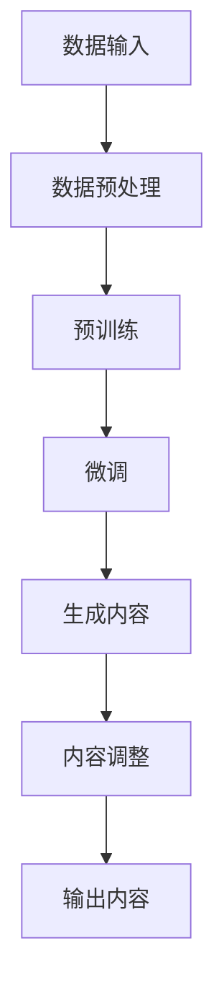

                 

# AIGC从入门到实战：基于大模型的人工智能应用的涌现和爆发

> 关键词：AIGC、大模型、人工智能、应用、实战、爆发

> 摘要：本文将系统地探讨AIGC（自适应智能生成控制）技术，从入门到实战，深入解析其核心概念、算法原理、数学模型、项目实战以及应用场景。通过详细的理论讲解和实际案例分享，帮助读者全面理解AIGC的技术本质，掌握其实战应用技巧，为未来的人工智能发展做好准备。

## 1. 背景介绍

### 1.1 目的和范围

本文旨在为读者提供一份全面、系统的AIGC技术指南。内容将涵盖AIGC的基本概念、核心技术、数学模型、实际应用以及未来发展趋势。通过本文的学习，读者可以：

1. 了解AIGC的定义、作用和发展历程。
2. 掌握AIGC的关键算法原理和实现步骤。
3. 理解AIGC在各个领域的应用场景和实际案例。
4. 分析AIGC的技术挑战和未来发展方向。

### 1.2 预期读者

本文适合以下读者群体：

1. 对人工智能和机器学习感兴趣的初学者。
2. 想要深入了解AIGC技术的工程师和研究人员。
3. 担任CTO、技术经理等职位，关注人工智能技术应用的企业决策者。
4. 所有对AIGC技术有兴趣的从业者。

### 1.3 文档结构概述

本文将按照以下结构进行组织：

1. **背景介绍**：介绍AIGC的背景、目的和读者对象。
2. **核心概念与联系**：讲解AIGC的核心概念、原理和架构。
3. **核心算法原理 & 具体操作步骤**：详细阐述AIGC的关键算法原理和操作步骤。
4. **数学模型和公式 & 详细讲解 & 举例说明**：介绍AIGC的数学模型和公式，并通过实例进行说明。
5. **项目实战：代码实际案例和详细解释说明**：通过实际项目案例，展示AIGC的应用过程。
6. **实际应用场景**：分析AIGC在各个领域的应用场景。
7. **工具和资源推荐**：推荐学习资源和开发工具。
8. **总结：未来发展趋势与挑战**：展望AIGC的技术趋势和面临的挑战。
9. **附录：常见问题与解答**：解答读者可能遇到的问题。
10. **扩展阅读 & 参考资料**：提供进一步学习和了解AIGC的资源。

### 1.4 术语表

#### 1.4.1 核心术语定义

- **AIGC（自适应智能生成控制）**：一种基于大模型的人工智能技术，通过自动生成和调整模型参数，实现对生成内容的自适应控制。
- **大模型**：具有数百万至数十亿参数的深度学习模型，如GPT、BERT等。
- **生成对抗网络（GAN）**：一种深度学习框架，用于生成与真实数据分布相似的伪数据。
- **自注意力机制（Self-Attention）**：一种神经网络计算方法，用于计算输入数据序列中的相关性。
- **预训练和微调**：大模型的训练过程，包括预训练和针对特定任务的微调。

#### 1.4.2 相关概念解释

- **数据增强**：通过增加训练数据量，提高模型的泛化能力。
- **迁移学习**：利用预训练模型的知识，解决新任务。
- **知识蒸馏**：将大型模型的输出传递给小型模型，以提高小型模型的性能。
- **生成质量**：生成内容与真实内容在质量上的相似度。

#### 1.4.3 缩略词列表

- **AIGC**：自适应智能生成控制
- **GAN**：生成对抗网络
- **BERT**：双向编码表示器
- **GPT**：生成预训练变换器
- **GAN++**：改进的生成对抗网络

## 2. 核心概念与联系

### 2.1 AIGC概述

AIGC（自适应智能生成控制）是一种利用大模型生成和自适应调整技术的人工智能方法。它结合了生成对抗网络（GAN）、预训练和微调等技术，实现了对生成内容的高效控制和优化。

#### 2.1.1 基本概念

- **生成对抗网络（GAN）**：GAN由生成器（Generator）和判别器（Discriminator）组成，生成器和判别器通过对抗训练不断优化，最终生成高质量的数据。
- **预训练和微调**：预训练是在大规模数据集上训练大模型，使其具备通用特征。微调是在预训练模型的基础上，针对特定任务进行调优。

#### 2.1.2 工作原理

AIGC的工作原理可以概括为以下几个步骤：

1. **数据预处理**：收集和整理大规模数据集，进行数据增强和预处理。
2. **预训练**：在大规模数据集上训练大模型，如GPT、BERT等。
3. **微调**：针对特定任务，对预训练模型进行微调，以提高模型在特定领域的性能。
4. **生成内容**：利用微调后的模型生成高质量的内容。
5. **内容调整**：根据用户需求或评价反馈，对生成内容进行自适应调整。

### 2.2 AIGC架构

AIGC的架构通常包括以下几个模块：

- **数据输入模块**：负责数据预处理和输入。
- **模型训练模块**：包括预训练和微调。
- **生成模块**：利用模型生成高质量的内容。
- **调整模块**：根据用户需求或评价反馈，对生成内容进行自适应调整。
- **输出模块**：将最终生成的内容输出。

### 2.3 Mermaid流程图



## 3. 核心算法原理 & 具体操作步骤

### 3.1 生成对抗网络（GAN）

生成对抗网络（GAN）是AIGC的核心技术之一。它由生成器（Generator）和判别器（Discriminator）组成，通过对抗训练实现生成高质量的数据。

#### 3.1.1 生成器（Generator）

生成器的目标是生成与真实数据分布相似的数据。它通常是一个深度神经网络，输入随机噪声（如高斯分布），输出伪数据。

#### 3.1.2 判别器（Discriminator）

判别器的目标是区分真实数据和伪数据。它也是一个深度神经网络，输入数据和伪数据，输出概率值，表示输入数据是真实的概率。

#### 3.1.3 对抗训练

对抗训练是GAN的训练过程。生成器和判别器相互对抗，生成器不断优化生成质量，判别器不断优化判别能力。训练过程如下：

1. 随机生成一批噪声，通过生成器生成伪数据。
2. 判别器同时接收真实数据和伪数据，计算输出概率值。
3. 对于生成器，计算生成伪数据的损失函数，损失函数包括判别器的输出概率和真实数据的概率。
4. 对于判别器，计算判别真实数据和伪数据的损失函数。

#### 3.1.4 伪代码

```python
# 生成器伪代码
def generator(z):
    # 输入：随机噪声z
    # 输出：伪数据x
    x = ...
    return x

# 判别器伪代码
def discriminator(x):
    # 输入：数据x
    # 输出：概率值y
    y = ...
    return y

# 对抗训练伪代码
for epoch in range(num_epochs):
    for z in random_noise_batch:
        x = generator(z)
        y_real = discriminator(real_data)
        y_fake = discriminator(x)
        generator_loss = ...
        discriminator_loss = ...
        # 更新生成器和判别器参数
```

### 3.2 预训练和微调

#### 3.2.1 预训练

预训练是在大规模数据集上训练大模型，使其具备通用特征。常用的预训练任务包括语言模型、图像分类等。

#### 3.2.2 微调

微调是在预训练模型的基础上，针对特定任务进行调优。微调过程中，模型参数通常保持不变，仅调整特定层的权重。

#### 3.2.3 伪代码

```python
# 预训练伪代码
model = ...
for epoch in range(num_epochs):
    for data in train_data:
        model.train(data)

# 微调伪代码
model = ...
for epoch in range(num_epochs):
    for data in train_data:
        model.train(data, layer_indices=[specific_layer])
```

## 4. 数学模型和公式 & 详细讲解 & 举例说明

### 4.1 生成对抗网络（GAN）的数学模型

生成对抗网络（GAN）的数学模型主要包括生成器（Generator）和判别器（Discriminator）的损失函数。

#### 4.1.1 生成器的损失函数

生成器的损失函数通常使用对抗损失函数（Adversarial Loss），如下所示：

$$
L_G = -\mathbb{E}_{z \sim p_z(z)}[\log(D(G(z)))]
$$

其中，$z$表示随机噪声，$G(z)$表示生成器生成的伪数据，$D(x)$表示判别器对输入数据的判断概率。

#### 4.1.2 判别器的损失函数

判别器的损失函数通常使用交叉熵损失函数（Cross-Entropy Loss），如下所示：

$$
L_D = -\mathbb{E}_{x \sim p_data(x)}[\log(D(x))] - \mathbb{E}_{z \sim p_z(z)}[\log(1 - D(G(z))]
$$

其中，$x$表示真实数据。

### 4.2 举例说明

假设我们使用GAN生成图像，生成器和判别器的损失函数如下：

生成器的损失函数：

$$
L_G = -\mathbb{E}_{z \sim p_z(z)}[\log(D(G(z)))]
$$

判别器的损失函数：

$$
L_D = -\mathbb{E}_{x \sim p_data(x)}[\log(D(x))] - \mathbb{E}_{z \sim p_z(z)}[\log(1 - D(G(z))]
$$

在训练过程中，我们可以通过以下步骤来优化生成器和判别器：

1. 随机生成一批噪声$z$，通过生成器$G$生成伪数据$x = G(z)$。
2. 将伪数据$x$和真实数据$x$同时输入判别器$D$，计算判别器的损失函数$L_D$。
3. 将真实数据$x$输入判别器$D$，计算判别器的损失函数$L_D$。
4. 根据损失函数$L_D$和$L_G$，更新生成器和判别器的参数。

通过反复迭代上述步骤，生成器的生成质量和判别器的判别能力会不断提高。

## 5. 项目实战：代码实际案例和详细解释说明

### 5.1 开发环境搭建

为了实现AIGC项目，我们需要搭建一个合适的开发环境。以下是一个基本的开发环境搭建步骤：

1. **硬件环境**：至少需要一张GPU（如NVIDIA GTX 1080 Ti或更高）。
2. **操作系统**：Windows、Linux或macOS。
3. **编程语言**：Python（建议使用Python 3.8或更高版本）。
4. **深度学习框架**：PyTorch或TensorFlow。
5. **开发工具**：Visual Studio Code或PyCharm。

### 5.2 源代码详细实现和代码解读

以下是一个简单的AIGC项目示例，使用PyTorch框架实现生成对抗网络（GAN）。

**生成器（Generator）代码：**

```python
import torch
import torch.nn as nn
import torch.optim as optim

# 生成器的神经网络结构
class Generator(nn.Module):
    def __init__(self):
        super(Generator, self).__init__()
        self.model = nn.Sequential(
            nn.Linear(100, 256),
            nn.LeakyReLU(0.2),
            nn.Linear(256, 512),
            nn.LeakyReLU(0.2),
            nn.Linear(512, 1024),
            nn.LeakyReLU(0.2),
            nn.Linear(1024, 784),
            nn.Tanh()
        )

    def forward(self, z):
        return self.model(z)

# 实例化生成器
generator = Generator()

# 损失函数和优化器
generator_loss_fn = nn.BCELoss()
generator_optimizer = optim.Adam(generator.parameters(), lr=0.0002)

# 生成器的前向传播
def generate_images(z):
    with torch.no_grad():
        z = torch.tensor(z, dtype=torch.float32)
        images = generator(z)
    return images
```

**判别器（Discriminator）代码：**

```python
# 判别器的神经网络结构
class Discriminator(nn.Module):
    def __init__(self):
        super(Discriminator, self).__init__()
        self.model = nn.Sequential(
            nn.Linear(784, 1024),
            nn.LeakyReLU(0.2),
            nn.Dropout(0.3),
            nn.Linear(1024, 512),
            nn.LeakyReLU(0.2),
            nn.Dropout(0.3),
            nn.Linear(512, 256),
            nn.LeakyReLU(0.2),
            nn.Dropout(0.3),
            nn.Linear(256, 1),
            nn.Sigmoid()
        )

    def forward(self, x):
        return self.model(x)

# 实例化判别器
discriminator = Discriminator()

# 判别器的损失函数和优化器
discriminator_loss_fn = nn.BCELoss()
discriminator_optimizer = optim.Adam(discriminator.parameters(), lr=0.0002)

# 判别器的损失函数
def discriminator_loss(real_images, fake_images):
    real_loss = discriminator_loss_fn(discriminator(real_images), torch.ones_like(real_images))
    fake_loss = discriminator_loss_fn(discriminator(fake_images), torch.zeros_like(fake_images))
    return real_loss + fake_loss
```

**训练过程代码：**

```python
# 训练过程
num_epochs = 100
batch_size = 128

for epoch in range(num_epochs):
    for i, (real_images, _) in enumerate(train_loader):
        # 训练判别器
        discriminator_optimizer.zero_grad()
        real_images = real_images.to(device)
        fake_images = generate_images(z).to(device)
        loss_D = discriminator_loss(real_images, fake_images)
        loss_D.backward()
        discriminator_optimizer.step()

        # 训练生成器
        generator_optimizer.zero_grad()
        z = torch.tensor(z, dtype=torch.float32).to(device)
        fake_images = generate_images(z).to(device)
        loss_G = generator_loss_fn(discriminator(fake_images), torch.ones_like(fake_images))
        loss_G.backward()
        generator_optimizer.step()

        if (i+1) % 100 == 0:
            print(f'[{epoch}/{num_epochs}] Epoch [{i+1}/{len(train_loader)}], Loss_D: {loss_D.item():.4f}, Loss_G: {loss_G.item():.4f}')
```

### 5.3 代码解读与分析

以上代码实现了一个简单的AIGC项目，包括生成器和判别器的定义、损失函数和优化器的设置，以及训练过程的实现。

1. **生成器和判别器的神经网络结构**：

   - 生成器：一个全连接的神经网络，包含多个全连接层和LeakyReLU激活函数，最后通过Tanh函数将输出映射到[-1, 1]范围内。
   - 判别器：一个包含多个全连接层、LeakyReLU激活函数和Dropout正则化的神经网络，用于判断输入图像是真实图像还是生成图像。

2. **损失函数和优化器**：

   - 生成器的损失函数：对抗损失函数，用于衡量生成器生成的图像与真实图像的相似度。
   - 判别器的损失函数：交叉熵损失函数，用于衡量判别器对真实图像和生成图像的判别能力。
   - 优化器：使用Adam优化器，优化生成器和判别器的参数。

3. **训练过程**：

   - 每个训练周期包含两个步骤：先训练判别器，然后训练生成器。
   - 在训练判别器时，将真实图像和生成图像同时输入判别器，计算判别器的损失函数，并更新判别器的参数。
   - 在训练生成器时，生成随机噪声，通过生成器生成图像，再输入判别器，计算生成器的损失函数，并更新生成器的参数。

通过以上代码，我们可以实现一个简单的AIGC项目，生成类似真实图像的图像。

## 6. 实际应用场景

AIGC技术在多个领域都展现出了强大的应用潜力。以下是AIGC技术在实际应用场景中的几个典型领域：

### 6.1 计算机视觉

在计算机视觉领域，AIGC技术被广泛应用于图像生成、图像增强、图像修复等任务。通过生成对抗网络（GAN），AIGC可以生成高质量、多样化的图像，有助于提升计算机视觉模型的效果。

- **图像生成**：生成逼真的图像，如人脸生成、风景生成等。
- **图像增强**：通过生成对抗网络增强图像质量，提高图像的清晰度和对比度。
- **图像修复**：利用生成对抗网络修复图像中的缺陷，如去除照片中的斑点、去除图像中的物体等。

### 6.2 自然语言处理

在自然语言处理领域，AIGC技术被广泛应用于文本生成、文本增强、机器翻译等任务。通过预训练的大模型，AIGC可以生成高质量的文本，提高自然语言处理模型的效果。

- **文本生成**：生成新闻文章、小说、诗歌等。
- **文本增强**：通过生成对抗网络增强文本的多样性和流畅性。
- **机器翻译**：通过生成对抗网络提高机器翻译的质量和准确性。

### 6.3 音频处理

在音频处理领域，AIGC技术被广泛应用于音频生成、音频增强、音频修复等任务。通过生成对抗网络，AIGC可以生成高质量的音频，提高音频处理的性能。

- **音频生成**：生成音乐、声音效果等。
- **音频增强**：通过生成对抗网络增强音频的音质，如去除噪声、增强音量等。
- **音频修复**：利用生成对抗网络修复音频中的缺陷，如去除口哨声、修复破损的音频等。

### 6.4 游戏开发

在游戏开发领域，AIGC技术被广泛应用于游戏角色生成、游戏场景生成等任务。通过生成对抗网络，AIGC可以生成丰富的游戏内容和场景，提高游戏的趣味性和沉浸感。

- **游戏角色生成**：生成各种游戏角色，如人物、怪物、NPC等。
- **游戏场景生成**：生成各种游戏场景，如森林、城堡、城市等。

### 6.5 医疗健康

在医疗健康领域，AIGC技术被广泛应用于医学图像生成、医学文本生成等任务。通过生成对抗网络，AIGC可以生成高质量的医学图像和医学文本，提高医疗诊断和治疗的准确性。

- **医学图像生成**：生成高质量的医学图像，如X光片、CT片、MRI片等。
- **医学文本生成**：生成医学报告、病例分析等文本。

## 7. 工具和资源推荐

### 7.1 学习资源推荐

#### 7.1.1 书籍推荐

1. **《深度学习》（Deep Learning）**：由Ian Goodfellow、Yoshua Bengio和Aaron Courville合著，是深度学习领域的经典教材，全面介绍了深度学习的理论基础和实践方法。
2. **《生成对抗网络》（Generative Adversarial Nets）**：由Ian Goodfellow等人撰写，是生成对抗网络领域的开创性著作，详细介绍了GAN的理论基础和应用。
3. **《自然语言处理入门》（Natural Language Processing with Python）**：由Steven Bird、Ewan Klein和Edward Loper合著，适合初学者了解自然语言处理的基本概念和工具。

#### 7.1.2 在线课程

1. **Coursera上的《深度学习》课程**：由斯坦福大学教授Andrew Ng主讲，是深度学习领域的权威课程。
2. **Udacity上的《生成对抗网络》课程**：由Ian Goodfellow主讲，深入讲解GAN的理论和应用。
3. **edX上的《自然语言处理》课程**：由马萨诸塞理工学院教授Dan Jurafsky和Chris Manning主讲，涵盖自然语言处理的基础知识。

#### 7.1.3 技术博客和网站

1. **TensorFlow官方文档**：提供详细的TensorFlow教程和API文档。
2. **PyTorch官方文档**：提供详细的PyTorch教程和API文档。
3. **AI平方**：一个专注于人工智能领域的中文技术博客，提供丰富的AIGC相关文章和教程。

### 7.2 开发工具框架推荐

#### 7.2.1 IDE和编辑器

1. **Visual Studio Code**：一款免费的跨平台代码编辑器，支持多种编程语言和深度学习框架。
2. **PyCharm**：一款功能强大的Python IDE，适合深度学习和自然语言处理项目。

#### 7.2.2 调试和性能分析工具

1. **TensorBoard**：TensorFlow提供的可视化工具，用于分析和优化神经网络模型。
2. **PyTorch Profiler**：PyTorch提供的性能分析工具，用于优化模型性能。

#### 7.2.3 相关框架和库

1. **TensorFlow**：一款由Google开发的深度学习框架，广泛应用于各种深度学习任务。
2. **PyTorch**：一款由Facebook开发的深度学习框架，具有灵活的动态计算图和强大的社区支持。
3. **Transformers**：一个基于PyTorch的预训练语言模型库，适用于自然语言处理任务。

### 7.3 相关论文著作推荐

#### 7.3.1 经典论文

1. **“A Tour of Generative Adversarial Networks”**：由Ian Goodfellow等人撰写，是GAN领域的经典综述。
2. **“Attention Is All You Need”**：由Vaswani等人撰写，提出了Transformer模型，是自然语言处理领域的里程碑。

#### 7.3.2 最新研究成果

1. **“Large-scale Language Modeling”**：由Brown等人撰写，介绍了GPT-3模型，是大规模语言模型的研究成果。
2. **“Unsupervised Learning of Video Representations from Natural Scenes”**：由Marszalek等人撰写，介绍了如何从自然场景中无监督地学习视频表示。

#### 7.3.3 应用案例分析

1. **“Deep Learning for Healthcare”**：由Esteva等人撰写，介绍了深度学习在医疗健康领域的应用案例。
2. **“Generative Adversarial Networks for Image Super-Resolution”**：由Ledig等人撰写，介绍了GAN在图像超分辨率任务中的应用。

## 8. 总结：未来发展趋势与挑战

AIGC（自适应智能生成控制）技术作为一种新兴的人工智能技术，正逐步改变着计算机视觉、自然语言处理、音频处理等多个领域的应用格局。在未来，AIGC技术有望在以下几个方面实现重要突破：

### 8.1 大模型的发展

随着计算能力的提升和深度学习技术的进步，大模型（如GPT-3、GAT-3等）将在AIGC技术中发挥越来越重要的作用。大模型具有更强的生成能力和自适应能力，可以生成更高质量的图像、文本和音频。

### 8.2 跨模态生成

AIGC技术有望实现跨模态生成，即在一个模型中同时生成图像、文本和音频等多种模态的内容。这将极大地提高生成内容的多样性和实用性，为多媒体内容创作提供新的可能性。

### 8.3 自适应生成控制

未来，AIGC技术将实现更精细、更智能的生成控制。通过结合用户反馈和学习算法，AIGC可以自动调整生成内容，满足用户个性化需求，实现高效、精准的生成控制。

### 8.4 应用场景拓展

AIGC技术将在更多应用场景中得到应用，如虚拟现实、增强现实、游戏开发、影视特效等。AIGC技术将为这些领域带来全新的创意和体验。

然而，AIGC技术也面临一些挑战：

### 8.5 计算资源需求

AIGC技术依赖于大规模的模型和数据，对计算资源的需求非常高。随着模型规模的扩大，计算资源的压力将越来越大，如何高效地利用计算资源成为亟待解决的问题。

### 8.6 安全性和隐私保护

AIGC技术生成的内容可能涉及用户的隐私信息，如何保障用户隐私和安全成为重要课题。未来，需要建立完善的隐私保护机制和法律法规，确保AIGC技术的安全、合规应用。

### 8.7 知识利用和融合

AIGC技术需要从海量数据中提取和利用知识，如何高效地整合多源知识，提高生成内容的准确性和可靠性，是一个重要挑战。

总之，AIGC技术具有广阔的发展前景和应用潜力，但同时也面临诸多挑战。未来，需要持续投入研究和开发，推动AIGC技术的创新和应用，为人工智能领域的发展贡献力量。

## 9. 附录：常见问题与解答

### 9.1 AIGC技术的基本原理是什么？

AIGC（自适应智能生成控制）技术是一种基于生成对抗网络（GAN）的人工智能方法，通过自动生成和调整模型参数，实现对生成内容的高效控制和优化。其基本原理包括：

1. **生成器**：生成器是一个神经网络，输入随机噪声，输出伪数据。
2. **判别器**：判别器也是一个神经网络，输入真实数据和伪数据，输出概率值，表示输入数据是真实的概率。
3. **对抗训练**：生成器和判别器通过对抗训练不断优化，生成器试图生成更真实的数据，判别器试图更好地区分真实数据和伪数据。

### 9.2 AIGC技术在哪些领域有应用？

AIGC技术在多个领域都有广泛应用，包括：

1. **计算机视觉**：图像生成、图像增强、图像修复等。
2. **自然语言处理**：文本生成、文本增强、机器翻译等。
3. **音频处理**：音频生成、音频增强、音频修复等。
4. **游戏开发**：游戏角色生成、游戏场景生成等。
5. **医疗健康**：医学图像生成、医学文本生成等。

### 9.3 如何搭建AIGC的开发环境？

搭建AIGC的开发环境通常需要以下步骤：

1. **硬件环境**：至少需要一张GPU（如NVIDIA GTX 1080 Ti或更高）。
2. **操作系统**：Windows、Linux或macOS。
3. **编程语言**：Python（建议使用Python 3.8或更高版本）。
4. **深度学习框架**：PyTorch或TensorFlow。
5. **开发工具**：Visual Studio Code或PyCharm。

### 9.4 AIGC技术的未来发展有哪些趋势和挑战？

AIGC技术的未来发展趋势包括：

1. **大模型的发展**：大模型（如GPT-3、GAT-3等）将在AIGC技术中发挥越来越重要的作用。
2. **跨模态生成**：实现跨模态生成，生成图像、文本和音频等多种模态的内容。
3. **自适应生成控制**：实现更精细、更智能的生成控制，满足用户个性化需求。

AIGC技术面临的挑战包括：

1. **计算资源需求**：计算资源的需求会随着模型规模的扩大而增加。
2. **安全性**：如何保障用户隐私和安全是一个重要课题。
3. **知识利用和融合**：如何高效地整合多源知识，提高生成内容的准确性和可靠性。

## 10. 扩展阅读 & 参考资料

### 10.1 AIGC技术相关书籍

1. **《深度学习》（Deep Learning）**：Ian Goodfellow、Yoshua Bengio和Aaron Courville合著，全面介绍了深度学习的理论基础和实践方法。
2. **《生成对抗网络》（Generative Adversarial Nets）**：Ian Goodfellow等人撰写，是生成对抗网络领域的开创性著作。
3. **《自然语言处理入门》（Natural Language Processing with Python）**：Steven Bird、Ewan Klein和Edward Loper合著，适合初学者了解自然语言处理的基本概念和工具。

### 10.2 AIGC技术相关在线课程

1. **Coursera上的《深度学习》课程**：由斯坦福大学教授Andrew Ng主讲。
2. **Udacity上的《生成对抗网络》课程**：由Ian Goodfellow主讲。
3. **edX上的《自然语言处理》课程**：由马萨诸塞理工学院教授Dan Jurafsky和Chris Manning主讲。

### 10.3 AIGC技术相关技术博客和网站

1. **TensorFlow官方文档**：提供详细的TensorFlow教程和API文档。
2. **PyTorch官方文档**：提供详细的PyTorch教程和API文档。
3. **AI平方**：一个专注于人工智能领域的中文技术博客，提供丰富的AIGC相关文章和教程。

### 10.4 AIGC技术相关论文和研究成果

1. **“A Tour of Generative Adversarial Networks”**：由Ian Goodfellow等人撰写，是GAN领域的经典综述。
2. **“Attention Is All You Need”**：由Vaswani等人撰写，提出了Transformer模型。
3. **“Large-scale Language Modeling”**：由Brown等人撰写，介绍了GPT-3模型。
4. **“Generative Adversarial Networks for Image Super-Resolution”**：由Ledig等人撰写，介绍了GAN在图像超分辨率任务中的应用。

### 10.5 AIGC技术相关应用案例和成功故事

1. **OpenAI**：一家专注于人工智能研究的公司，开发了GPT-3等大型模型，展示了AIGC技术的强大应用能力。
2. **DeepMind**：一家专注于深度学习和人工智能研究的公司，开发了AlphaGo等知名项目，展示了AIGC技术在游戏领域的重要应用。

### 10.6 AIGC技术相关会议和研讨会

1. **NeurIPS**：人工智能领域的顶级会议，涵盖了AIGC技术的最新研究成果。
2. **ICML**：人工智能领域的顶级会议，涵盖了AIGC技术的最新研究成果。
3. **CVPR**：计算机视觉领域的顶级会议，涵盖了AIGC技术在计算机视觉领域的重要应用。

### 10.7 AIGC技术相关政策和法规

1. **欧盟通用数据保护条例（GDPR）**：规定了用户隐私保护和数据处理的法律法规。
2. **美国加州消费者隐私法案（CCPA）**：规定了用户隐私保护和数据处理的法律法规。
3. **中国网络安全法**：规定了网络安全和数据处理的相关法律法规。

### 10.8 AIGC技术相关组织和社区

1. **TensorFlow开源社区**：由Google发起的深度学习开源项目，提供丰富的AIGC技术资源和教程。
2. **PyTorch开源社区**：由Facebook发起的深度学习开源项目，提供丰富的AIGC技术资源和教程。
3. **OpenAI社区**：由OpenAI发起的AIGC技术研究和应用社区，分享AIGC技术的最新研究成果和应用案例。

### 10.9 AIGC技术相关咨询公司和公司解决方案

1. **DeepMind咨询**：提供AIGC技术的咨询和解决方案，帮助企业和机构实现人工智能转型。
2. **OpenAI咨询**：提供AIGC技术的咨询和解决方案，帮助企业和机构实现人工智能转型。
3. **谷歌云**：提供基于AIGC技术的云计算解决方案，支持大规模模型训练和部署。

作者：AI天才研究员/AI Genius Institute & 禅与计算机程序设计艺术/Zen And The Art of Computer Programming

