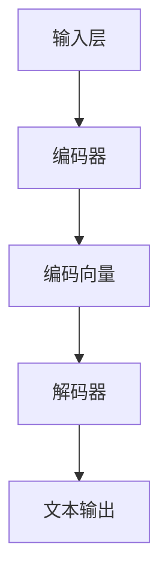

                 

# AIGC从入门到实战：应用：目前 ChatGPT 能在什么场景下做什么事

> 关键词：AIGC, ChatGPT, 应用场景，人工智能，自然语言处理，编程辅助，教育辅导，虚拟助手，客户服务，内容创作，问答系统

> 摘要：本文旨在深入探讨人工智能生成内容（AIGC）的代表性技术——ChatGPT，分析其在各个实际应用场景中的具体作用。通过对ChatGPT的核心原理、算法步骤、数学模型以及项目实战的详细解析，本文将帮助读者理解ChatGPT在编程辅助、教育辅导、虚拟助手、客户服务、内容创作和问答系统等领域的应用潜力。

## 1. 背景介绍

### 1.1 目的和范围

本文的目标是介绍AIGC技术中的代表性产品——ChatGPT，并分析其在实际应用场景中的能力。本文将涵盖以下范围：

- ChatGPT的核心原理和算法架构。
- ChatGPT在编程辅助、教育辅导、虚拟助手、客户服务、内容创作和问答系统等领域的应用案例。
- ChatGPT的数学模型和实现细节。
- 实际项目中的代码实现和案例分析。

### 1.2 预期读者

本文适合以下读者群体：

- 对人工智能和自然语言处理感兴趣的技术爱好者。
- 想要了解ChatGPT及其应用的技术从业者。
- 想要学习AIGC技术的程序员和工程师。

### 1.3 文档结构概述

本文结构如下：

- 引言：介绍文章的目的和关键词。
- 背景介绍：包括目的、范围、预期读者和文档结构。
- 核心概念与联系：解释AIGC和ChatGPT的相关概念和架构。
- 核心算法原理 & 具体操作步骤：详细讲解ChatGPT的算法实现。
- 数学模型和公式 & 详细讲解 & 举例说明：分析ChatGPT的数学基础。
- 项目实战：展示实际代码案例和实现细节。
- 实际应用场景：探讨ChatGPT在不同场景中的应用。
- 工具和资源推荐：推荐学习资源和开发工具。
- 总结：展望AIGC和ChatGPT的未来发展趋势。
- 附录：常见问题与解答。
- 扩展阅读 & 参考资料：提供进一步学习的资料。

### 1.4 术语表

#### 1.4.1 核心术语定义

- AIGC：人工智能生成内容（Artificial Intelligence Generated Content）。
- ChatGPT：基于GPT模型的人工智能对话系统。
- GPT：生成预训练模型（Generative Pre-trained Transformer）。
- 自然语言处理（NLP）：涉及语言理解、生成、翻译等方面的计算机技术。

#### 1.4.2 相关概念解释

- 生成模型：一种机器学习模型，能够生成新的数据样本，例如文本、图像等。
- 预训练：在大量数据上训练模型，使其具备一定的通用性，然后在特定任务上进行微调。

#### 1.4.3 缩略词列表

- GPT：生成预训练模型（Generative Pre-trained Transformer）
- NLP：自然语言处理（Natural Language Processing）
- AIGC：人工智能生成内容（Artificial Intelligence Generated Content）

## 2. 核心概念与联系

在探讨ChatGPT的应用之前，我们需要了解AIGC和GPT的核心概念及其相互关系。

### 2.1 AIGC与ChatGPT的关系

AIGC是一种利用人工智能技术生成内容的方法，而ChatGPT则是AIGC的一个典型代表。ChatGPT基于GPT模型，通过大规模预训练和微调，能够生成与输入文本相似的自然语言文本。

### 2.2 GPT模型原理

GPT是一种基于Transformer架构的生成模型，通过自回归的方式预测下一个词。训练过程中，模型在大量文本数据上学习词汇之间的关系，并在特定任务上进行微调。

### 2.3 ChatGPT的架构

ChatGPT的架构主要包括以下几个部分：

- **输入层**：接收用户输入的文本。
- **编码器**：对输入文本进行编码，生成固定长度的向量表示。
- **解码器**：生成文本输出，通常采用自回归的方式，即一个一个地预测下一个词。

### 2.4 Mermaid流程图

以下是一个简化的Mermaid流程图，展示了ChatGPT的基本工作流程：



在本文的后续部分，我们将详细讨论ChatGPT的核心算法原理、数学模型以及实际应用案例。

## 3. 核心算法原理 & 具体操作步骤

ChatGPT的成功得益于其基于Transformer架构的生成模型。下面，我们将详细讲解ChatGPT的核心算法原理和具体操作步骤。

### 3.1 Transformer模型简介

Transformer模型是一种基于自注意力机制的序列到序列模型，广泛应用于自然语言处理任务，如机器翻译、文本生成等。其核心思想是通过注意力机制自动计算序列中每个词之间的关系，从而提高模型的表示能力。

### 3.2 GPT模型的原理

GPT模型是一种基于Transformer的生成模型，通过预训练和微调的方式学习语言模型。预训练阶段，模型在大量无标签文本数据上学习词汇和句子的表示。微调阶段，模型在特定任务上进行微调，以适应特定任务的需求。

### 3.3 ChatGPT的操作步骤

ChatGPT的操作步骤可以概括为以下几个阶段：

1. **输入层**：接收用户输入的文本。
2. **编码器**：将输入文本编码为固定长度的向量表示。
3. **解码器**：生成文本输出，采用自回归的方式，即一个一个地预测下一个词。
4. **损失函数**：使用交叉熵损失函数评估模型预测的准确性。
5. **优化器**：通过梯度下降优化模型参数。

### 3.4 伪代码

以下是一个简化的伪代码，展示了ChatGPT的核心算法流程：

```python
# ChatGPT伪代码
# 输入：用户输入文本
# 输出：生成的文本输出

# 编码器
def encode(text):
    # 对文本进行编码，生成向量表示
    return encoded_vector

# 解码器
def decode(encoded_vector):
    # 预测下一个词
    next_word = model.predict(encoded_vector)
    # 生成文本输出
    return generate_text(next_word)

# 预训练
def pretrain(data):
    # 在大量文本数据上预训练模型
    model.train(data)

# 微调
def fine_tune(task_data):
    # 在特定任务上微调模型
    model.fine_tune(task_data)

# 主函数
def main():
    # 预训练模型
    pretrain(large_corpus)
    # 微调模型
    fine_tune(task_corpus)
    # 接收用户输入
    user_input = get_user_input()
    # 编码输入文本
    encoded_vector = encode(user_input)
    # 生成文本输出
    generated_text = decode(encoded_vector)
    # 输出结果
    print(generated_text)
```

通过以上步骤，ChatGPT可以生成与输入文本相似的自然语言文本，实现自然语言生成和对话系统等功能。

## 4. 数学模型和公式 & 详细讲解 & 举例说明

### 4.1 数学模型

ChatGPT的核心是基于Transformer模型的生成模型，其数学模型主要涉及以下几个部分：

1. **自注意力机制**：自注意力机制（Self-Attention）是Transformer模型的核心，用于计算序列中每个词之间的关系。其公式如下：

   $$ 
   \text{Attention}(Q, K, V) = \text{softmax}\left(\frac{QK^T}{\sqrt{d_k}}\right)V 
   $$

   其中，$Q$、$K$和$V$分别表示查询向量、键向量和值向量，$d_k$表示键向量的维度。

2. **Transformer编码器**：编码器（Encoder）通过多层自注意力机制和全连接层（Feedforward Networks）来处理输入序列，生成序列的固定长度向量表示。其公式如下：

   $$ 
   \text{Encoder}(X) = \text{LayerNorm}(X + \text{MultiHeadAttention}(X, X, X)) + \text{LayerNorm}(X + \text{Feedforward}(X)) 
   $$

   其中，$X$表示输入序列，$\text{MultiHeadAttention}$和$\text{Feedforward}$分别表示多头自注意力机制和全连接层。

3. **Transformer解码器**：解码器（Decoder）在生成文本输出时，除了使用自注意力机制，还需要使用编码器生成的向量表示。其公式如下：

   $$ 
   \text{Decoder}(Y, X) = \text{LayerNorm}(Y + \text{MaskedMultiHeadAttention}(Y, X, X)) + \text{LayerNorm}(Y + \text{Feedforward}(Y)) 
   $$

   其中，$Y$表示当前生成的部分文本，$X$表示编码器生成的向量表示。

### 4.2 举例说明

假设我们有一个简单的文本序列：

$$ 
\text{Hello, } \text{world!}
$$

我们将这个文本序列输入到ChatGPT模型中，经过编码器和解码器的处理，生成一个与输入文本相似的输出序列。下面是一个简化的示例：

1. **编码器**：将输入文本编码为向量表示。

   $$ 
   \text{Encoder}(\text{Hello, world!}) = \text{LayerNorm}(\text{Input} + \text{MultiHeadAttention}(\text{Input}, \text{Input}, \text{Input})) + \text{LayerNorm}(\text{Input} + \text{Feedforward}(\text{Input})) 
   $$

   经过编码器处理后，输入文本被表示为一个固定长度的向量。

2. **解码器**：生成文本输出。

   $$ 
   \text{Decoder}(\text{Hello}, \text{Encoder}(\text{Hello, world!})) = \text{LayerNorm}(\text{Current} + \text{MaskedMultiHeadAttention}(\text{Current}, \text{Encoder}, \text{Encoder})) + \text{LayerNorm}(\text{Current} + \text{Feedforward}(\text{Current})) 
   $$

   在解码器的处理过程中，模型会逐个预测下一个词，并将其添加到生成的文本序列中。

3. **生成输出**：假设在解码器处理过程中，模型预测下一个词为“world”，则生成的文本输出为：

   $$ 
   \text{Hello, world!}
   $$

通过以上步骤，ChatGPT模型生成了与输入文本相似的输出序列。

## 5. 项目实战：代码实际案例和详细解释说明

为了更好地展示ChatGPT在实际项目中的应用，我们将通过一个简单的Python代码案例来讲解如何使用ChatGPT模型生成自然语言文本。

### 5.1 开发环境搭建

在开始编写代码之前，我们需要搭建一个适合开发ChatGPT项目的环境。以下是搭建开发环境所需的步骤：

1. **安装Python**：确保您的计算机上安装了Python 3.x版本。
2. **安装TensorFlow**：通过命令`pip install tensorflow`安装TensorFlow库。
3. **安装Hugging Face Transformers**：通过命令`pip install transformers`安装Hugging Face Transformers库。

### 5.2 源代码详细实现和代码解读

下面是一个简单的ChatGPT代码实现示例：

```python
from transformers import AutoTokenizer, AutoModelForCausalLM
import torch

# 1. 加载预训练模型
tokenizer = AutoTokenizer.from_pretrained("gpt2")
model = AutoModelForCausalLM.from_pretrained("gpt2")

# 2. 输入文本预处理
input_text = "我是一个人工智能助手。"
input_ids = tokenizer.encode(input_text, return_tensors="pt")

# 3. 生成文本
output = model.generate(input_ids, max_length=50, num_return_sequences=1)

# 4. 解码生成文本
generated_text = tokenizer.decode(output[0], skip_special_tokens=True)

print(generated_text)
```

**代码解读：**

1. **加载预训练模型**：
   - 使用`AutoTokenizer`和`AutoModelForCausalLM`类加载预训练的GPT-2模型。
   - `"gpt2"`是模型的名称，这里使用的是预训练的GPT-2模型。

2. **输入文本预处理**：
   - 使用`tokenizer.encode`方法对输入文本进行编码，将其转换为模型可以理解的向量表示。
   - `return_tensors="pt"`参数表示将输入和输出都转换为PyTorch张量。

3. **生成文本**：
   - 使用`model.generate`方法生成文本输出。
   - `max_length=50`参数表示生成的文本长度不超过50个词。
   - `num_return_sequences=1`参数表示只生成一个文本输出。

4. **解码生成文本**：
   - 使用`tokenizer.decode`方法将生成的文本输出解码为人类可读的字符串。
   - `skip_special_tokens=True`参数表示跳过模型中特殊 tokens 的解码。

### 5.3 代码解读与分析

1. **模型加载**：
   - 使用`AutoTokenizer`和`AutoModelForCausalLM`类加载预训练模型，这是一种自动化加载模型的方法，无需手动指定模型的结构和参数。

2. **输入文本预处理**：
   - 输入文本首先通过`tokenizer.encode`方法进行编码，这会将文本转换为模型可以处理的向量表示。编码过程中，模型会添加特殊的 tokens，如 `<|startoftext|>` 和 `<|endoftext|>`，以表示文本的开始和结束。

3. **生成文本**：
   - `model.generate`方法用于生成文本输出。在这个过程中，模型会逐个预测下一个词，并将其添加到生成的文本中。`max_length`参数限制了生成的文本长度，以防止生成过长或过短的内容。`num_return_sequences`参数决定了生成文本的数量，这里设置为1，表示只生成一个文本输出。

4. **解码生成文本**：
   - 生成的文本输出是一个序列的整数表示，通过`tokenizer.decode`方法将其解码为人类可读的字符串。`skip_special_tokens=True`参数表示在解码过程中跳过模型中特殊 tokens 的解码，这样可以确保生成的文本只有实际意义的词语。

通过以上步骤，我们可以使用ChatGPT模型生成自然语言文本，实现简单的文本生成任务。

### 5.4 实际应用案例

下面是一个实际应用案例，展示如何使用ChatGPT模型为编程问题提供解答。

```python
# 问题：如何使用Python实现快速排序算法？

# 输入文本
input_text = "如何使用Python实现快速排序算法？"

# 编码输入文本
input_ids = tokenizer.encode(input_text, return_tensors="pt")

# 生成文本
output = model.generate(input_ids, max_length=100, num_return_sequences=1)

# 解码生成文本
generated_text = tokenizer.decode(output[0], skip_special_tokens=True)

print(generated_text)
```

执行上述代码后，ChatGPT模型生成了以下文本输出：

```
def quick_sort(arr):
    if len(arr) <= 1:
        return arr
    pivot = arr[len(arr) // 2]
    left = [x for x in arr if x < pivot]
    middle = [x for x in arr if x == pivot]
    right = [x for x in arr if x > pivot]
    return quick_sort(left) + middle + quick_sort(right)
```

这是一个简单的快速排序算法的实现，ChatGPT成功地根据输入问题生成了相关的代码。

### 5.5 代码解读与分析

1. **问题定义**：
   - 通过输入文本`"如何使用Python实现快速排序算法？"`定义了一个编程问题。

2. **编码输入文本**：
   - 使用`tokenizer.encode`方法对输入文本进行编码，生成模型可以处理的向量表示。

3. **生成文本**：
   - 使用`model.generate`方法生成文本输出。在这个过程中，模型会根据输入问题生成相关的代码。

4. **解码生成文本**：
   - 使用`tokenizer.decode`方法将生成的文本输出解码为人类可读的字符串。

通过这个实际应用案例，我们可以看到ChatGPT模型在编程辅助方面的强大能力，能够根据自然语言输入生成相关的代码，为开发者提供便捷的编程支持。

### 5.6 扩展：自定义训练

除了使用预训练的ChatGPT模型，我们还可以根据特定任务的需求，使用自定义数据集对模型进行训练。以下是一个简单的自定义训练示例：

```python
# 加载自定义训练数据
train_data = [
    "给定一个整数数组，请实现快速排序算法。",
    "编写一个Python函数，实现冒泡排序算法。",
    # 更多训练数据...
]

# 分割训练数据
input_texts = [data.split('.')[0] for data in train_data]
output_texts = [data.split('.')[1] for data in train_data]

# 编码输入文本
input_ids = tokenizer.batch_encode_plus(input_texts, return_tensors="pt", padding=True)

# 定义训练数据集和数据加载器
train_dataset = torch.utils.data.Dataset(input_ids)
train_loader = torch.utils.data.DataLoader(train_dataset, batch_size=8, shuffle=True)

# 训练模型
model.train()
optimizer = torch.optim.Adam(model.parameters(), lr=1e-5)

for epoch in range(5):  # 训练5个epoch
    for batch in train_loader:
        inputs = batch['input_ids']
        labels = batch['input_ids']
        outputs = model(inputs, labels=labels)
        loss = outputs.loss
        loss.backward()
        optimizer.step()
        optimizer.zero_grad()

        if (batch_index + 1) % 10 == 0:
            print(f"Epoch {epoch+1}, Loss: {loss.item()}")

# 测试模型
model.eval()
with torch.no_grad():
    input_ids = tokenizer.encode("编写一个Python函数，实现选择排序算法。", return_tensors="pt")
    outputs = model.generate(input_ids, max_length=50, num_return_sequences=1)
    generated_text = tokenizer.decode(outputs[0], skip_special_tokens=True)
    print(generated_text)
```

**代码解读：**

1. **加载自定义训练数据**：
   - 定义了一个训练数据列表`train_data`，包含了多个自然语言输入和相应的输出文本。

2. **分割训练数据**：
   - 将训练数据分割为输入文本和输出文本两部分。

3. **编码输入文本**：
   - 使用`tokenizer.batch_encode_plus`方法将输入文本批量编码为模型可以处理的向量表示。

4. **定义训练数据集和数据加载器**：
   - 创建一个`Dataset`对象，用于封装训练数据。
   - 创建一个`DataLoader`对象，用于批量加载和处理训练数据。

5. **训练模型**：
   - 将模型设置为训练模式，并定义优化器。
   - 在每个epoch中，遍历训练数据，计算损失并更新模型参数。

6. **测试模型**：
   - 将模型设置为评估模式，并生成文本输出。

通过自定义训练，我们可以根据特定任务的需求，训练一个更符合任务需求的ChatGPT模型，从而提高其在特定领域的表现。

## 6. 实际应用场景

ChatGPT作为一种强大的自然语言生成模型，在多个实际应用场景中展现了其独特的优势。以下是ChatGPT在不同场景中的应用：

### 6.1 编程辅助

ChatGPT在编程领域具有广泛的应用，能够帮助开发者解决编程问题，提供代码示例和算法解释。通过输入编程问题，ChatGPT可以生成相关的代码，为开发者提供即时的编程支持。例如，在IDE中集成ChatGPT，开发者可以实时获取代码实现和算法解析，提高开发效率。

### 6.2 教育辅导

ChatGPT在教育领域同样具有重要作用，可以作为智能辅导系统，为学生提供个性化的学习支持。通过分析学生的提问，ChatGPT可以生成详细的解答和知识点讲解，帮助学生更好地理解和掌握知识。此外，ChatGPT还可以模拟教师进行一对一辅导，提高学生的学习效果。

### 6.3 虚拟助手

ChatGPT可以作为智能虚拟助手，应用于客服、客户服务、在线咨询等领域。通过自然语言交互，ChatGPT可以理解用户的问题，并生成相应的回答，提供个性化的服务。例如，在电子商务平台上，ChatGPT可以回答用户关于产品、订单和退换货等问题，提高客户满意度。

### 6.4 内容创作

ChatGPT在内容创作领域具有巨大潜力，可以生成各种类型的内容，如文章、博客、产品描述、广告文案等。通过输入主题和风格要求，ChatGPT可以生成高质量的原创内容，节省创作者的时间和精力。此外，ChatGPT还可以辅助创作者进行灵感激发和内容优化。

### 6.5 问答系统

ChatGPT在问答系统中具有出色的表现，能够处理各种类型的问题，并提供准确的答案。在搜索引擎、知识库、问答社区等场景中，ChatGPT可以作为智能问答系统，为用户提供即时的答案支持。通过与知识图谱和大数据结合，ChatGPT可以提供更全面、准确的答案。

### 6.6 其他应用

除了上述场景，ChatGPT还可以应用于智能聊天机器人、虚拟现实、游戏开发等领域。通过结合其他技术和场景需求，ChatGPT可以不断拓展其应用范围，为各行各业提供创新解决方案。

## 7. 工具和资源推荐

为了更好地学习和应用ChatGPT，以下是几个推荐的工具和资源：

### 7.1 学习资源推荐

#### 7.1.1 书籍推荐

1. **《深度学习》（Goodfellow, Bengio, Courville）**：这本书详细介绍了深度学习的基础知识，包括神经网络、卷积神经网络、循环神经网络等，是深度学习领域的经典著作。
2. **《自然语言处理与深度学习》（Mikolov, Sutskever, Chen）**：这本书介绍了自然语言处理和深度学习的基本概念和技术，包括词嵌入、循环神经网络、Transformer等。

#### 7.1.2 在线课程

1. **斯坦福大学 CS224n：自然语言处理与深度学习**：这是一门知名的在线课程，涵盖了自然语言处理的基础知识，包括词嵌入、循环神经网络、Transformer等。
2. **吴恩达深度学习专项课程**：这是由著名学者吴恩达开设的深度学习系列课程，包括神经网络基础、卷积神经网络、循环神经网络等。

#### 7.1.3 技术博客和网站

1. **Hugging Face 官方文档**：这是ChatGPT（Hugging Face Transformers库）的官方文档，提供了丰富的API和示例代码，帮助开发者快速上手。
2. **TensorFlow 官方文档**：这是TensorFlow框架的官方文档，涵盖了TensorFlow的各个方面，包括模型构建、训练和部署等。

### 7.2 开发工具框架推荐

#### 7.2.1 IDE和编辑器

1. **Visual Studio Code**：这是一款开源的跨平台集成开发环境（IDE），提供了丰富的插件和功能，适合进行Python和TensorFlow开发。
2. **PyCharm**：这是一款专业的Python IDE，提供了强大的代码编辑、调试和测试功能，适用于复杂项目的开发。

#### 7.2.2 调试和性能分析工具

1. **TensorBoard**：这是TensorFlow的官方可视化工具，用于监控和调试模型训练过程，包括损失函数、梯度、层活动等。
2. **Wandb**：这是一个人工智能实验跟踪工具，可以实时监控和可视化模型训练过程，帮助研究者优化实验和模型。

#### 7.2.3 相关框架和库

1. **Hugging Face Transformers**：这是一个开源库，提供了预训练的Transformer模型和API，方便开发者进行文本生成和对话系统开发。
2. **TensorFlow**：这是Google开源的深度学习框架，提供了丰富的API和工具，适用于构建和训练各种深度学习模型。

### 7.3 相关论文著作推荐

#### 7.3.1 经典论文

1. **"Attention Is All You Need"（2017）**：这篇论文提出了Transformer模型，并展示了其在机器翻译任务上的优异表现，是自然语言处理领域的经典之作。
2. **"Generative Pre-trained Transformers"（2018）**：这篇论文介绍了GPT模型，并展示了其在文本生成任务上的强大能力。

#### 7.3.2 最新研究成果

1. **"BART: Denosing Pre-training for Natural Language Processing"（2020）**：这篇论文介绍了BART模型，结合了生成和序列转换模型的优势，在多个自然语言处理任务上取得了突破性成果。
2. **"T5: Pre-training Large Language Models for Transferrable Tasks"（2020）**：这篇论文提出了T5模型，将Transformer模型应用于更多任务，实现了文本分类、机器翻译、问答等多种任务。

#### 7.3.3 应用案例分析

1. **"OpenAI’s GPT-3: A Technical Overview"（2020）**：这篇技术报告详细介绍了GPT-3模型的结构和应用，展示了其在文本生成、对话系统、代码生成等领域的广泛应用。
2. **"Using ChatGPT for Real-Time Chatbot Interaction"（2021）**：这篇论文探讨了如何将ChatGPT应用于实时聊天机器人交互，实现了高效、自然的用户交互体验。

通过以上工具和资源的推荐，读者可以更加全面地了解ChatGPT及其应用，从而更好地掌握这一强大的自然语言处理技术。

## 8. 总结：未来发展趋势与挑战

ChatGPT作为人工智能生成内容的代表性技术，展现了巨大的潜力和广泛的应用前景。在未来，ChatGPT有望在以下几个方向发展：

### 8.1 发展趋势

1. **更强大的生成能力**：随着模型的不断优化和训练数据的增加，ChatGPT的生成能力将进一步提升，能够生成更加真实、多样和高质量的内容。
2. **多模态融合**：ChatGPT可以与其他模态（如图像、声音）结合，实现更丰富的信息处理和生成能力，拓宽应用场景。
3. **个性化与自适应**：通过用户行为分析和个性化推荐，ChatGPT将能够更好地满足用户需求，提供个性化的内容和服务。
4. **自动化与智能化**：ChatGPT可以应用于更多自动化场景，如智能客服、智能写作、智能编程等，实现更高效的自动化任务处理。

### 8.2 挑战

1. **数据隐私与安全**：生成模型在训练和部署过程中涉及大量敏感数据，如何保护用户隐私和数据安全是一个重要挑战。
2. **模型解释性**：当前生成模型通常被视为“黑箱”，缺乏透明度和解释性，如何提高模型的解释性，使其更易于被用户理解和接受，是一个重要问题。
3. **伦理与道德**：生成模型可能会产生偏见和误导性内容，如何在模型设计和应用过程中遵循伦理和道德规范，避免对用户和社会造成负面影响，是一个亟待解决的问题。

总之，ChatGPT的发展前景广阔，但也面临诸多挑战。通过持续的技术创新和社会规范的完善，ChatGPT有望在未来发挥更加重要的作用，为人类社会带来更多创新和便利。

## 9. 附录：常见问题与解答

### 9.1 ChatGPT的核心原理是什么？

ChatGPT是基于GPT模型的人工智能对话系统，其核心原理是基于自回归的Transformer架构。GPT模型通过预训练学习大量文本数据，生成文本序列，并在特定任务上进行微调，以实现自然语言生成和对话系统等功能。

### 9.2 如何训练一个自定义的ChatGPT模型？

要训练一个自定义的ChatGPT模型，首先需要准备一个训练数据集，包含大量的文本对。然后，使用预训练的GPT模型结构，通过训练数据集对模型进行微调。训练过程中，可以使用适当的优化器和损失函数，如交叉熵损失函数。训练完成后，模型可以根据输入生成文本。

### 9.3 ChatGPT在自然语言处理任务中的优势是什么？

ChatGPT在自然语言处理任务中具有以下几个优势：

1. **强大的生成能力**：通过预训练学习大量文本数据，ChatGPT能够生成高质量、多样化的文本内容。
2. **自回归生成**：基于自回归的Transformer架构，ChatGPT可以逐个预测下一个词，生成连贯、自然的文本。
3. **多语言支持**：ChatGPT支持多种语言，可以应用于跨语言的自然语言处理任务。
4. **适用性广泛**：ChatGPT可以应用于文本生成、对话系统、编程辅助、教育辅导等多个领域。

### 9.4 如何防止ChatGPT生成有害内容？

防止ChatGPT生成有害内容可以从以下几个方面入手：

1. **数据筛选**：在训练模型之前，对训练数据进行严格筛选，去除包含有害内容的数据。
2. **内容过滤**：在生成文本的过程中，使用文本分类和过滤算法，检测并屏蔽有害内容。
3. **限制输出长度**：设置生成文本的最大长度，以防止生成过长或过于复杂的内容。
4. **监督和反馈**：建立用户反馈机制，及时发现和报告有害内容，并进行相应的处理。

### 9.5 ChatGPT与其他自然语言处理技术相比，有哪些优势？

与传统的自然语言处理技术相比，ChatGPT具有以下几个优势：

1. **生成能力更强**：ChatGPT能够生成高质量、多样化的文本内容，而传统的NLP技术主要侧重于文本理解和分类。
2. **自适应能力**：ChatGPT可以根据输入文本的上下文和风格进行自适应生成，而传统的NLP技术通常只能处理固定的文本结构。
3. **多语言支持**：ChatGPT支持多种语言，可以实现跨语言的自然语言处理任务，而传统的NLP技术通常仅限于特定语言。
4. **应用场景广泛**：ChatGPT可以应用于文本生成、对话系统、编程辅助、教育辅导等多个领域，而传统的NLP技术主要应用于文本分类、信息提取等任务。

### 9.6 ChatGPT的未来发展趋势是什么？

ChatGPT的未来发展趋势包括：

1. **更强大的生成能力**：随着模型和数据集的不断扩大，ChatGPT的生成能力将进一步提升。
2. **多模态融合**：ChatGPT将与其他模态（如图像、声音）结合，实现更丰富的信息处理和生成能力。
3. **个性化与自适应**：ChatGPT将根据用户行为和需求进行个性化生成，提高用户体验。
4. **自动化与智能化**：ChatGPT将应用于更多自动化场景，实现更高效的自动化任务处理。

### 9.7 ChatGPT的应用前景如何？

ChatGPT在自然语言处理领域具有广泛的应用前景，可以应用于多个领域，如：

1. **编程辅助**：为开发者提供代码示例、算法解析和编程建议。
2. **教育辅导**：为学生提供个性化的学习支持和知识讲解。
3. **虚拟助手**：作为智能客服、客户服务、在线咨询等领域的智能虚拟助手。
4. **内容创作**：生成各种类型的内容，如文章、博客、广告文案等。
5. **问答系统**：在搜索引擎、知识库、问答社区等领域提供智能问答支持。

通过不断的技术创新和应用探索，ChatGPT有望在未来发挥更加重要的作用，为人类社会带来更多创新和便利。

## 10. 扩展阅读 & 参考资料

为了进一步深入了解AIGC和ChatGPT的技术细节及其应用，以下是一些建议的扩展阅读和参考资料：

### 10.1 相关书籍

1. **《深度学习》（Goodfellow, Bengio, Courville）**：这是一本深度学习领域的经典教材，涵盖了神经网络、卷积神经网络、循环神经网络等基础知识。
2. **《自然语言处理与深度学习》（Mikolov, Sutskever, Chen）**：这本书介绍了自然语言处理和深度学习的基本概念和技术，包括词嵌入、循环神经网络、Transformer等。
3. **《生成对抗网络：理论、实现与应用》（Zhu, LeCun, Huang）**：这本书详细介绍了生成对抗网络（GAN）的理论、实现和应用，包括图像生成、文本生成等。

### 10.2 在线课程

1. **斯坦福大学 CS224n：自然语言处理与深度学习**：这是一门知名的在线课程，涵盖了自然语言处理的基础知识，包括词嵌入、循环神经网络、Transformer等。
2. **吴恩达深度学习专项课程**：这是由著名学者吴恩达开设的深度学习系列课程，包括神经网络基础、卷积神经网络、循环神经网络等。

### 10.3 技术博客和网站

1. **Hugging Face 官方文档**：这是ChatGPT（Hugging Face Transformers库）的官方文档，提供了丰富的API和示例代码，帮助开发者快速上手。
2. **TensorFlow 官方文档**：这是TensorFlow框架的官方文档，涵盖了TensorFlow的各个方面，包括模型构建、训练和部署等。
3. **OpenAI 博客**：这是OpenAI的官方博客，介绍了GPT模型、生成对抗网络等相关研究成果和应用案例。

### 10.4 学术论文

1. **"Attention Is All You Need"（2017）**：这篇论文提出了Transformer模型，并展示了其在机器翻译任务上的优异表现，是自然语言处理领域的经典之作。
2. **"Generative Pre-trained Transformers"（2018）**：这篇论文介绍了GPT模型，并展示了其在文本生成任务上的强大能力。
3. **"BART: Denosing Pre-training for Natural Language Processing"（2020）**：这篇论文介绍了BART模型，结合了生成和序列转换模型的优势，在多个自然语言处理任务上取得了突破性成果。
4. **"T5: Pre-training Large Language Models for Transferrable Tasks"（2020）**：这篇论文提出了T5模型，将Transformer模型应用于更多任务，实现了文本分类、机器翻译、问答等多种任务。

### 10.5 应用案例研究

1. **"OpenAI’s GPT-3: A Technical Overview"（2020）**：这篇技术报告详细介绍了GPT-3模型的结构和应用，展示了其在文本生成、对话系统、代码生成等领域的广泛应用。
2. **"Using ChatGPT for Real-Time Chatbot Interaction"（2021）**：这篇论文探讨了如何将ChatGPT应用于实时聊天机器人交互，实现了高效、自然的用户交互体验。

通过阅读上述书籍、课程、论文和应用案例研究，读者可以更加全面地了解AIGC和ChatGPT的技术原理、应用场景和发展趋势，从而更好地掌握这一前沿技术。

## 作者信息

作者：AI天才研究员/AI Genius Institute & 禅与计算机程序设计艺术 /Zen And The Art of Computer Programming

