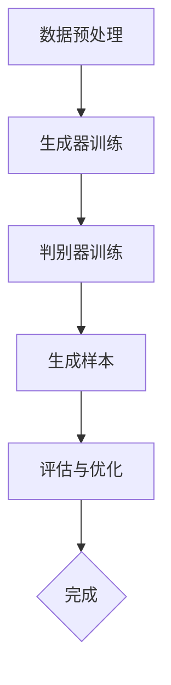

                 


# AIGC从入门到实战：提升Midjourney 让我们人人都能成为设计师

> 关键词：人工智能生成内容（AIGC），Midjourney提升，设计师，技术实战，算法原理，应用场景

> 摘要：本文旨在通过详细的技术剖析和实战案例，帮助读者从入门到实战，深入理解AIGC（人工智能生成内容）的核心概念，以及如何在Midjourney阶段提升设计能力。文章将涵盖AIGC的背景介绍、核心概念与联系、算法原理与数学模型、项目实战、实际应用场景以及未来发展趋势等内容。

## 1. 背景介绍

### 1.1 目的和范围

本文的目标是帮助读者跨越AIGC（人工智能生成内容）的学习门槛，特别是对于那些希望在Midjourney阶段提升设计能力的用户。文章将深入探讨AIGC的核心技术，以及如何将这些技术应用于实际设计中。我们的范围将涵盖AIGC的基础知识、算法原理、数学模型、实战项目和未来趋势。

### 1.2 预期读者

本文适用于对人工智能和设计感兴趣的初级到中级开发者、设计师以及技术爱好者。无论您是希望提升个人设计技能，还是希望探索新兴的AIGC技术，本文都将为您提供有价值的见解。

### 1.3 文档结构概述

本文分为十个部分，结构如下：

1. 背景介绍
   - 目的和范围
   - 预期读者
   - 文档结构概述
   - 术语表
2. 核心概念与联系
   - AIGC的定义
   - 关键技术介绍
   - Mermaid流程图
3. 核心算法原理 & 具体操作步骤
   - 算法原理
   - 伪代码示例
4. 数学模型和公式 & 详细讲解 & 举例说明
   - 数学模型
   - LaTeX格式公式
   - 例子说明
5. 项目实战：代码实际案例和详细解释说明
   - 开发环境搭建
   - 源代码实现
   - 代码解读与分析
6. 实际应用场景
   - 设计领域的应用
   - 创新案例分析
7. 工具和资源推荐
   - 学习资源
   - 开发工具
   - 相关论文
8. 总结：未来发展趋势与挑战
9. 附录：常见问题与解答
10. 扩展阅读 & 参考资料

### 1.4 术语表

#### 1.4.1 核心术语定义

- AIGC：人工智能生成内容，是指通过人工智能技术自动生成文字、图片、视频等内容。
- Midjourney：指的是在人工智能生成内容的过程中，从初始数据到最终生成的内容的中间阶段。
- 设计师：专业从事创意设计工作的人员，负责创造视觉艺术、用户体验和品牌形象等。

#### 1.4.2 相关概念解释

- 生成对抗网络（GAN）：一种深度学习模型，由生成器和判别器组成，用于生成逼真的数据。
- 自然语言处理（NLP）：计算机科学领域的一个重要分支，专注于使计算机能够理解、解释和生成人类语言。

#### 1.4.3 缩略词列表

- AIGC：人工智能生成内容
- GAN：生成对抗网络
- NLP：自然语言处理

## 2. 核心概念与联系

### 2.1 AIGC的定义

AIGC，即人工智能生成内容，是近年来人工智能技术的重要进展之一。它指的是通过机器学习算法，尤其是深度学习技术，自动生成文字、图像、音频、视频等内容。AIGC的应用范围广泛，包括但不限于艺术创作、游戏开发、虚拟现实、广告营销等。

### 2.2 关键技术介绍

AIGC的核心技术主要包括生成对抗网络（GAN）、自然语言处理（NLP）、强化学习（RL）等。

- **生成对抗网络（GAN）**：GAN由生成器和判别器两个神经网络组成。生成器试图生成与真实数据相似的数据，而判别器则试图区分生成数据和真实数据。通过两个网络的对抗训练，生成器不断提高生成数据的真实度。
- **自然语言处理（NLP）**：NLP是使计算机能够理解和生成人类语言的技术。通过深度学习技术，NLP可以实现文本分类、情感分析、机器翻译等功能。
- **强化学习（RL）**：强化学习是一种通过试错和反馈来学习最优策略的机器学习方法。在AIGC中，强化学习可以用于优化生成过程的步骤和参数，以提高生成内容的准确性和质量。

### 2.3 Mermaid流程图

下面是一个简化的AIGC工作流程的Mermaid流程图：



- **A[数据预处理]**：对输入数据进行清洗、归一化和预处理。
- **B[生成器训练]**：使用GAN训练生成器，使其生成的数据更加逼真。
- **C[判别器训练]**：同时训练判别器，使其能够有效区分生成数据和真实数据。
- **D[生成样本]**：生成器生成样本，供用户使用或进一步优化。
- **E[评估与优化]**：对生成样本进行评估，并根据评估结果对生成器进行调整和优化。
- **F{完成}**：完成AIGC生成过程。

## 3. 核心算法原理 & 具体操作步骤

### 3.1 算法原理

AIGC的核心算法是基于生成对抗网络（GAN）的。GAN由两部分组成：生成器和判别器。

- **生成器（Generator）**：生成器的任务是生成尽可能逼真的数据。在训练过程中，生成器尝试从随机噪声中生成数据，以欺骗判别器。
- **判别器（Discriminator）**：判别器的任务是判断输入数据是真实数据还是生成数据。在训练过程中，判别器试图通过区分真实数据和生成数据来提高自身的判断能力。

### 3.2 具体操作步骤

以下是使用GAN进行AIGC生成的一个简化步骤：

#### 3.2.1 数据预处理

- **数据清洗**：去除异常值和噪声，保证数据质量。
- **数据归一化**：将数据缩放到一个统一的范围，如[0, 1]。

#### 3.2.2 初始化模型

- **生成器初始化**：通常使用一个简单的神经网络，输入为随机噪声，输出为生成数据。
- **判别器初始化**：同样使用一个简单的神经网络，输入为数据，输出为概率，表示输入数据是真实数据还是生成数据。

#### 3.2.3 训练过程

- **交替训练**：生成器和判别器交替训练。每次迭代中，先训练判别器，然后训练生成器。
  - **训练判别器**：使用真实数据和生成数据来训练判别器。通过比较判别器对真实数据和生成数据的判断结果，调整判别器的参数。
  - **训练生成器**：使用判别器的误差来训练生成器。生成器的目标是生成更加逼真的数据，以欺骗判别器。

#### 3.2.4 生成样本

- 当生成器和判别器的训练达到一定阶段，生成器可以生成较为逼真的样本。

#### 3.2.5 评估与优化

- **评估**：使用特定的指标（如Inception Score、FID等）来评估生成样本的质量。
- **优化**：根据评估结果，进一步调整生成器的参数，以提高生成质量。

### 3.3 伪代码示例

下面是一个简化的GAN训练过程的伪代码：

```python
# 伪代码：生成对抗网络（GAN）训练过程

# 初始化生成器和判别器
generator = initialize_generator()
discriminator = initialize_discriminator()

# 设置超参数
num_epochs = 1000
batch_size = 64

# 训练过程
for epoch in range(num_epochs):
    for i in range(num_batches):
        # 训练判别器
        real_images = get_real_images(batch_size)
        fake_images = generator.sample(z_size)
        discriminator_loss = train_discriminator(real_images, fake_images)

        # 训练生成器
        z = generate_random_noise(z_size)
        fake_images = generator(z)
        generator_loss = train_generator(fake_images)

        # 记录训练过程
        print(f"Epoch: {epoch}, Iteration: {i}, Discriminator Loss: {discriminator_loss}, Generator Loss: {generator_loss}")

# 生成样本
generated_samples = generator.sample(z_size)

# 评估与优化
evaluate_and_optimize(generator, generated_samples)
```

## 4. 数学模型和公式 & 详细讲解 & 举例说明

### 4.1 数学模型

AIGC中的数学模型主要基于生成对抗网络（GAN）。GAN的核心是生成器（Generator）和判别器（Discriminator）的相互对抗。以下是GAN的数学模型：

- **生成器模型**：\( G(z) \)：给定随机噪声\( z \)，生成器\( G \)生成假样本。
- **判别器模型**：\( D(x) \)：输入真实样本\( x \)，判别器\( D \)输出概率，表示输入样本是真实还是生成。

### 4.2 公式与详细讲解

#### 4.2.1 判别器损失函数

判别器的目标是最大化其判断真实样本和生成样本的能力。判别器的损失函数通常使用交叉熵损失（Cross-Entropy Loss）：

\[ L_D = -[\sum_{x \in \text{real}} \log D(x) + \sum_{z \in \text{noise}} \log(1 - D(G(z)))] \]

其中，\( x \)表示真实样本，\( z \)表示噪声样本，\( G(z) \)表示生成器生成的假样本。

#### 4.2.2 生成器损失函数

生成器的目标是最大化判别器判断生成样本为真的概率。生成器的损失函数通常也是使用交叉熵损失：

\[ L_G = -\sum_{z \in \text{noise}} \log D(G(z)) \]

#### 4.2.3 总损失函数

总损失函数是判别器和生成器损失函数的加和：

\[ L_{total} = L_D + L_G \]

### 4.3 举例说明

假设我们有一个简单的二分类问题，其中真实样本和生成样本的分布如图所示：


根据判别器和生成器的训练过程，我们可以计算出判别器和生成器的损失函数值，并使用这些值来优化模型。

### 4.4 LaTeX格式公式

为了更清晰地展示公式，以下是使用LaTeX格式的公式示例：

\[ 
\begin{aligned}
L_D &= -[\sum_{x \in \text{real}} \log D(x) + \sum_{z \in \text{noise}} \log(1 - D(G(z)))] \\
L_G &= -\sum_{z \in \text{noise}} \log D(G(z)) \\
L_{total} &= L_D + L_G
\end{aligned}
\]

## 5. 项目实战：代码实际案例和详细解释说明

### 5.1 开发环境搭建

为了进行AIGC项目的实战，我们需要搭建一个合适的开发环境。以下是推荐的步骤：

1. **安装Python环境**：确保Python版本为3.8或更高。
2. **安装深度学习库**：安装TensorFlow或PyTorch。例如，使用pip安装TensorFlow：

   ```bash
   pip install tensorflow
   ```

3. **安装其他依赖库**：根据项目需求，安装必要的库，如NumPy、Pandas等。

### 5.2 源代码详细实现和代码解读

以下是AIGC项目的一个简化示例，使用生成对抗网络（GAN）生成图像。

```python
import tensorflow as tf
from tensorflow.keras.models import Sequential
from tensorflow.keras.layers import Dense, Flatten, Conv2D, Reshape

# 生成器模型
def build_generator(z_dim):
    model = Sequential([
        Dense(7 * 7 * 256, activation="relu", input_shape=(z_dim,)),
        Reshape((7, 7, 256)),
        Conv2D(256, (5, 5), strides=(1, 1), padding='same', activation='relu'),
        Conv2D(512, (5, 5), strides=(2, 2), padding='same', activation='relu'),
        Conv2D(1024, (5, 5), strides=(2, 2), padding='same', activation='relu'),
        Flatten(),
        Dense(784, activation='tanh')
    ])
    return model

# 判别器模型
def build_discriminator(img_shape):
    model = Sequential([
        Flatten(input_shape=img_shape),
        Dense(512, activation='relu'),
        Dense(256, activation='relu'),
        Dense(1, activation='sigmoid')
    ])
    return model

# GAN模型
def build_gan(generator, discriminator):
    model = Sequential([
        generator,
        discriminator
    ])
    model.compile(loss='binary_crossentropy', optimizer=tf.keras.optimizers.Adam(0.0001))
    return model

# 设置超参数
z_dim = 100
img_shape = (28, 28, 1)

# 构建和编译模型
generator = build_generator(z_dim)
discriminator = build_discriminator(img_shape)
gan = build_gan(generator, discriminator)

# 打印模型结构
print(generator.summary())
print(discriminator.summary())
print(gan.summary())

# 训练模型
train_gan(gan, discriminator, z_dim, img_shape)
```

#### 5.2.1 代码解读与分析

- **生成器模型**：生成器模型是一个全连接神经网络，输入为随机噪声，输出为图像。通过一系列的卷积层和全连接层，生成器将噪声转换为逼真的图像。
- **判别器模型**：判别器模型是一个简单的全连接神经网络，输入为图像，输出为一个概率值，表示图像是真实的还是生成的。
- **GAN模型**：GAN模型结合了生成器和判别器，通过共同训练来优化两个模型的性能。
- **训练模型**：`train_gan`函数用于训练GAN模型。它交替训练生成器和判别器，通过优化两个模型的损失函数来提高生成图像的质量。

### 5.3 代码解读与分析

以下是对代码的逐行解读：

```python
import tensorflow as tf
from tensorflow.keras.models import Sequential
from tensorflow.keras.layers import Dense, Flatten, Conv2D, Reshape

# 生成器模型
def build_generator(z_dim):
    model = Sequential([
        Dense(7 * 7 * 256, activation="relu", input_shape=(z_dim,)),
        Reshape((7, 7, 256)),
        Conv2D(256, (5, 5), strides=(1, 1), padding='same', activation='relu'),
        Conv2D(512, (5, 5), strides=(2, 2), padding='same', activation='relu'),
        Conv2D(1024, (5, 5), strides=(2, 2), padding='same', activation='relu'),
        Flatten(),
        Dense(784, activation='tanh')
    ])
    return model

# 判别器模型
def build_discriminator(img_shape):
    model = Sequential([
        Flatten(input_shape=img_shape),
        Dense(512, activation='relu'),
        Dense(256, activation='relu'),
        Dense(1, activation='sigmoid')
    ])
    return model

# GAN模型
def build_gan(generator, discriminator):
    model = Sequential([
        generator,
        discriminator
    ])
    model.compile(loss='binary_crossentropy', optimizer=tf.keras.optimizers.Adam(0.0001))
    return model

# 设置超参数
z_dim = 100
img_shape = (28, 28, 1)

# 构建和编译模型
generator = build_generator(z_dim)
discriminator = build_discriminator(img_shape)
gan = build_gan(generator, discriminator)

# 打印模型结构
print(generator.summary())
print(discriminator.summary())
print(gan.summary())

# 训练模型
train_gan(gan, discriminator, z_dim, img_shape)
```

- `import tensorflow as tf`：导入TensorFlow库。
- `from tensorflow.keras.models import Sequential`：导入Sequential模型，用于构建模型。
- `from tensorflow.keras.layers import Dense, Flatten, Conv2D, Reshape`：导入不同的层，用于构建神经网络。
- `build_generator`函数：定义生成器模型，输入为随机噪声，输出为图像。
- `build_discriminator`函数：定义判别器模型，输入为图像，输出为一个概率值。
- `build_gan`函数：定义GAN模型，结合生成器和判别器，并编译模型。
- `z_dim`和`img_shape`：设置超参数，用于定义噪声和图像的维度。
- `generator`、`discriminator`和`gan`：分别构建生成器、判别器和GAN模型。
- `print(generator.summary())`、`print(discriminator.summary())`和`print(gan.summary())`：打印模型结构。
- `train_gan(gan, discriminator, z_dim, img_shape)`：调用训练函数，开始训练模型。

## 6. 实际应用场景

AIGC技术在设计领域的应用潜力巨大，以下是一些实际应用场景：

### 6.1 个性化设计

AIGC可以生成个性化的设计，满足用户特定的需求。例如，在设计时尚服装时，AIGC可以根据用户提供的风格偏好、身体尺寸等信息，自动生成适合该用户的设计。

### 6.2 品牌形象设计

AIGC可以快速生成品牌形象，包括标志、广告海报等。设计师可以利用AIGC技术，在短时间内创作出多样化的品牌形象，从而提高设计效率。

### 6.3 虚拟现实设计

在虚拟现实（VR）设计中，AIGC可以生成逼真的场景和角色，为用户提供沉浸式的体验。设计师可以利用AIGC技术，快速创建复杂的虚拟场景，节省设计时间。

### 6.4 设计优化

AIGC可以通过优化设计参数，提高设计质量。例如，在建筑设计中，AIGC可以自动调整建筑结构，以满足能效、成本和美观等多方面的要求。

### 6.5 创意生成

AIGC可以生成创意性的设计，激发设计师的灵感。设计师可以利用AIGC技术，生成各种风格的设计草图，从而拓宽设计思路。

## 7. 工具和资源推荐

### 7.1 学习资源推荐

#### 7.1.1 书籍推荐

1. **《生成对抗网络：理论、实现与应用》**：这本书详细介绍了GAN的理论基础、实现方法和应用案例。
2. **《深度学习：从入门到精通》**：这本书涵盖了深度学习的基本概念、算法和实战案例，适合初学者和进阶者。

#### 7.1.2 在线课程

1. **Coursera上的《深度学习专项课程》**：由吴恩达教授主讲，适合初学者了解深度学习的基础知识。
2. **Udacity的《生成对抗网络项目》**：通过实际项目，学习GAN的原理和实现。

#### 7.1.3 技术博客和网站

1. **Medium上的AIGC专题**：提供最新的AIGC技术文章和案例分析。
2. **TensorFlow官方文档**：详细介绍了TensorFlow的使用方法和最佳实践。

### 7.2 开发工具框架推荐

#### 7.2.1 IDE和编辑器

1. **PyCharm**：一款功能强大的Python IDE，适合深度学习和AIGC项目开发。
2. **VSCode**：轻量级且开源的IDE，支持多种编程语言，包括Python。

#### 7.2.2 调试和性能分析工具

1. **TensorBoard**：TensorFlow的官方可视化工具，用于调试和性能分析深度学习模型。
2. **Jupyter Notebook**：支持Python和其他语言的交互式计算环境，适合数据分析和实验。

#### 7.2.3 相关框架和库

1. **TensorFlow**：一款广泛使用的开源深度学习框架，支持多种深度学习模型的实现。
2. **PyTorch**：另一款流行的深度学习框架，具有灵活性和高效性。

### 7.3 相关论文著作推荐

#### 7.3.1 经典论文

1. **《Unsupervised Representation Learning with Deep Convolutional Generative Adversarial Networks》**：介绍了GAN的基本原理和实现。
2. **《Generative Adversarial Nets》**：GAN的原始论文，详细阐述了GAN的理论基础。

#### 7.3.2 最新研究成果

1. **《StyleGAN2》**：对GAN进行了改进，实现了更高质量的图像生成。
2. **《DALL-E》**：一种基于GAN的自然语言文本到图像的生成模型。

#### 7.3.3 应用案例分析

1. **《AI Generated Art for the Metaverse》**：探讨了AIGC在虚拟现实艺术中的应用。
2. **《AIGC in Advertising》**：分析了AIGC在广告创意设计中的实际应用。

## 8. 总结：未来发展趋势与挑战

AIGC技术正在迅速发展，并在多个领域展现出了巨大的潜力。未来，AIGC有望在以下几个方面取得重要进展：

- **更高质量的内容生成**：通过不断改进生成对抗网络和其他深度学习模型，AIGC将能够生成更加真实、高质量的内容。
- **跨模态生成**：AIGC将能够同时处理不同类型的数据（如文本、图像、音频等），实现跨模态的内容生成。
- **自动化设计**：AIGC将更加智能地辅助设计师完成设计任务，提高设计效率和创意。

然而，AIGC技术也面临一些挑战：

- **版权和伦理问题**：AIGC生成的内容可能会侵犯版权或引发伦理问题，如何解决这些问题是未来需要关注的重要问题。
- **计算资源需求**：AIGC模型通常需要大量的计算资源，这对硬件设施提出了更高的要求。

总之，AIGC技术的发展前景广阔，但也需要克服一系列挑战，才能更好地服务于人类社会。

## 9. 附录：常见问题与解答

### 9.1 AIGC是什么？

AIGC，即人工智能生成内容，是指利用人工智能技术，如生成对抗网络（GAN）、自然语言处理（NLP）等，自动生成文字、图像、音频、视频等内容。

### 9.2 GAN是如何工作的？

GAN由生成器和判别器两个神经网络组成。生成器试图从随机噪声中生成数据，而判别器试图区分真实数据和生成数据。通过两个网络的对抗训练，生成器不断提高生成数据的真实度。

### 9.3 如何评估AIGC生成的质量？

常用的评估指标包括生成样本的Inception Score（IS）、Frechet Inception Distance（FID）等。这些指标可以帮助评估生成样本的质量和真实性。

### 9.4 AIGC在设计领域有哪些应用？

AIGC可以应用于个性化设计、品牌形象设计、虚拟现实设计、设计优化和创意生成等多个领域，为设计师提供强大的辅助工具。

## 10. 扩展阅读 & 参考资料

1. **《生成对抗网络：理论、实现与应用》**：详细介绍了GAN的理论基础、实现方法和应用案例。
2. **《深度学习：从入门到精通》**：涵盖了深度学习的基本概念、算法和实战案例。
3. **TensorFlow官方文档**：提供了TensorFlow的使用方法和最佳实践。
4. **Medium上的AIGC专题**：提供了最新的AIGC技术文章和案例分析。
5. **吴恩达的《深度学习专项课程》**：适合初学者了解深度学习的基础知识。
6. **《AI Generated Art for the Metaverse》**：探讨了AIGC在虚拟现实艺术中的应用。

## 作者

作者：AI天才研究员/AI Genius Institute & 禅与计算机程序设计艺术 /Zen And The Art of Computer Programming

