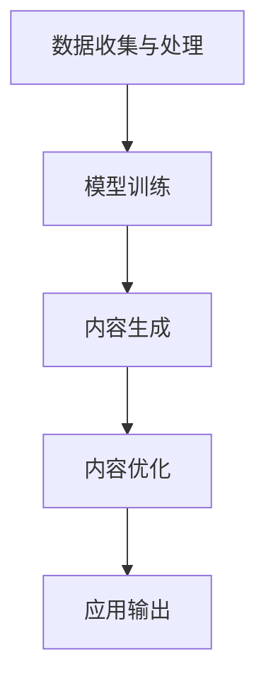

                 

## AIGC创业的回归与商业本质

### 关键词：(AIGC, 创业, 商业本质, AI, 生成内容, 人工智能技术)

#### 摘要：

本文深入探讨了AIGC（AI Generated Content）在创业领域的应用及其商业本质。通过对AIGC技术的背景介绍、核心概念与联系的分析、核心算法原理的讲解、数学模型的详细讲解、项目实战的案例分析，以及实际应用场景和工具资源的推荐，本文旨在帮助读者理解AIGC在创业中的重要作用，并对其未来发展提出见解。文章的核心内容将通过逻辑清晰、结构紧凑、简单易懂的叙述方式呈现，旨在为AIGC创业实践提供理论支持和实践指导。

---

### 1. 背景介绍

AIGC，即AI Generated Content，是指利用人工智能技术生成内容的过程。随着人工智能技术的不断发展，AIGC技术已经在各个领域得到广泛应用，包括但不限于文本生成、图像生成、视频生成等。特别是在互联网时代，内容的生成和传播变得日益重要，AIGC技术的出现为内容创作提供了全新的可能性。

AIGC技术的兴起，一方面源于大数据和计算能力的提升，使得人工智能能够处理更加复杂的任务；另一方面，则是用户对个性化、高质量内容需求的不断增加。在这种背景下，AIGC技术逐渐成为创业领域的热点。

在创业领域，AIGC技术具有显著的商业价值。首先，AIGC技术能够大幅降低内容创作的成本和时间，提高效率。其次，通过个性化内容生成，AIGC技术能够满足用户多样化的需求，提升用户体验。最后，AIGC技术还可以为创业企业带来新的商业模式，如基于内容的订阅服务、广告等。

然而，AIGC技术在实际应用中也面临一系列挑战，包括数据隐私、内容质量、知识产权等问题。因此，理解和掌握AIGC技术的商业本质，对于创业企业来说至关重要。

### 2. 核心概念与联系

#### 2.1 AI与生成内容

首先，我们需要明确AI和生成内容这两个核心概念。

AI，即人工智能，是指通过计算机程序实现人类智能功能的技术。AI技术主要包括机器学习、深度学习、自然语言处理等。

生成内容，是指通过某种方式自动生成文本、图像、视频等。生成内容的关键在于“自动”，即不需要人工干预，系统能够自主完成内容创作。

#### 2.2 AIGC的架构

AIGC技术的架构可以分为以下几个层次：

1. **数据收集与处理**：收集大量的数据，并进行预处理，如清洗、标注等。
2. **模型训练**：使用预处理后的数据，通过机器学习或深度学习算法训练模型。
3. **内容生成**：利用训练好的模型，生成新的文本、图像、视频等。
4. **内容优化**：对生成的内容进行优化，如调整参数、进行二次训练等，以提高内容的质量。

#### 2.3 AIGC的应用场景

AIGC技术可以应用于多个领域，包括但不限于：

1. **媒体与娱乐**：生成新闻、文章、音乐、视频等。
2. **广告与营销**：生成广告文案、广告图像等。
3. **教育与培训**：生成课程内容、教学视频等。
4. **电子商务**：生成产品描述、用户评论等。

#### 2.4 AIGC的优势与挑战

AIGC技术具有以下优势：

1. **高效性**：能够快速生成大量内容。
2. **个性化**：能够根据用户需求生成个性化内容。
3. **多样性**：能够生成多种类型的内容。

同时，AIGC技术也面临以下挑战：

1. **数据隐私**：生成内容的过程中，可能会涉及用户隐私数据。
2. **内容质量**：生成的内容质量参差不齐。
3. **知识产权**：如何保护原创内容，避免侵权问题。

#### 2.5 Mermaid流程图

以下是一个简化的AIGC技术流程的Mermaid流程图：



在这个流程图中，数据收集与处理是AIGC技术的基础，模型训练是核心，内容生成是直接应用，内容优化是提高内容质量的关键，而应用输出则是AIGC技术最终的成果。

---

### 3. 核心算法原理 & 具体操作步骤

#### 3.1 生成对抗网络（GAN）

AIGC技术中，最核心的算法之一是生成对抗网络（GAN）。GAN由两部分组成：生成器（Generator）和判别器（Discriminator）。

**3.1.1 判别器**

判别器的任务是区分真实数据和生成数据。判别器的输入可以是随机噪声或真实数据，输出是概率，表示输入数据是真实数据的概率。

**3.1.2 生成器**

生成器的任务是生成数据，使其尽可能接近真实数据。生成器的输入是随机噪声，输出是生成的数据。

**3.1.3 模型训练**

GAN的训练过程是不断调整生成器和判别器的参数，使得判别器能够更好地区分真实数据和生成数据，同时生成器能够生成更真实的数据。

训练过程通常采用以下步骤：

1. 初始化生成器和判别器的参数。
2. 生成器生成一批数据。
3. 判别器对真实数据和生成数据同时进行训练。
4. 根据判别器的损失函数，调整生成器的参数。
5. 重复步骤2-4，直到生成器生成数据的质量达到要求。

#### 3.2 自然语言处理（NLP）

在AIGC技术中，自然语言处理（NLP）也是一个重要的组成部分。NLP主要关注如何让计算机理解、生成和处理人类语言。

**3.2.1 词向量**

词向量是NLP中的基本概念。词向量将单词映射到高维空间中的点，使得相似单词在空间中接近。

**3.2.2 语言模型**

语言模型用于预测下一个单词的概率。最常见的语言模型是神经网络模型，如循环神经网络（RNN）和变压器（Transformer）。

**3.2.3 文本生成**

文本生成是NLP的一个重要应用。通过训练语言模型，我们可以生成新的文本。文本生成的过程通常包括以下步骤：

1. 初始化生成器，如随机序列。
2. 使用语言模型预测下一个单词。
3. 将预测的单词加入到生成序列中。
4. 重复步骤2-3，直到生成序列达到预定的长度或满足特定的终止条件。

#### 3.3 图像生成

图像生成是AIGC技术中的一个重要领域。常见的图像生成方法包括：

**3.3.1 生成对抗网络（GAN）**

GAN是一种生成图像的强大方法。通过训练生成器和判别器，GAN可以生成高质量的图像。

**3.3.2 生成式对抗网络（GAPN）**

生成式对抗网络（GAPN）是GAN的一种变体，它通过多个生成器和判别器的组合，生成更加多样化和真实的图像。

**3.3.3 变换器（Transformer）**

变换器是一种基于注意力机制的神经网络模型，它在图像生成任务中表现出色。通过变换器，我们可以生成具有高度多样性的图像。

### 4. 数学模型和公式 & 详细讲解 & 举例说明

#### 4.1 生成对抗网络（GAN）的数学模型

生成对抗网络（GAN）的核心是生成器（Generator）和判别器（Discriminator）的对抗训练。以下是一个简化的GAN的数学模型：

**4.1.1 判别器的损失函数**

判别器的目标是最大化正确分类的概率，即最大化以下损失函数：

$$
L_D(\theta_D) = -\frac{1}{N}\sum_{i=1}^{N}[\log(D(x_i)) + \log(1 - D(G(z_i)))]
$$

其中，$x_i$是真实数据，$G(z_i)$是生成器生成的数据，$z_i$是随机噪声，$\theta_D$是判别器的参数。

**4.1.2 生成器的损失函数**

生成器的目标是最大化生成数据被判别器认为是真实数据的概率，即最大化以下损失函数：

$$
L_G(\theta_G) = -\frac{1}{N}\sum_{i=1}^{N}\log(D(G(z_i))}
$$

其中，$z_i$是随机噪声，$\theta_G$是生成器的参数。

**4.1.3 共同训练过程**

在GAN的训练过程中，生成器和判别器是共同训练的。通过交替更新生成器和判别器的参数，使得判别器能够更好地区分真实数据和生成数据，同时生成器能够生成更加真实的数据。

#### 4.2 自然语言处理（NLP）的数学模型

自然语言处理（NLP）中的语言模型是一种概率模型，用于预测下一个单词的概率。以下是一个简化的语言模型数学模型：

**4.2.1 语言模型的损失函数**

语言模型的损失函数通常使用交叉熵（Cross-Entropy）损失函数：

$$
L(\theta) = -\frac{1}{N}\sum_{i=1}^{N}\sum_{j=1}^{V}y_{ij}\log(p_j(x_i|\theta))
$$

其中，$y_{ij}$是目标单词的概率分布，$p_j(x_i|\theta)$是语言模型预测的单词概率分布，$\theta$是语言模型的参数。

**4.2.2 语言模型的训练**

语言模型的训练过程是通过最小化损失函数来优化模型的参数。通常使用梯度下降（Gradient Descent）算法来更新模型参数。

#### 4.3 图像生成的数学模型

图像生成的数学模型通常涉及生成对抗网络（GAN）和变换器（Transformer）等。以下是一个简化的图像生成数学模型：

**4.3.1 GAN的数学模型**

GAN的数学模型与NLP中的语言模型类似，也是通过最小化损失函数来优化生成器和判别器的参数。

$$
L_D(\theta_D) = -\frac{1}{N}\sum_{i=1}^{N}[\log(D(x_i)) + \log(1 - D(G(z_i)))]
$$

$$
L_G(\theta_G) = -\frac{1}{N}\sum_{i=1}^{N}\log(D(G(z_i)))
$$

**4.3.2 Transformer的数学模型**

变换器（Transformer）是一种基于注意力机制的神经网络模型，它在图像生成任务中表现出色。变换器的数学模型包括自注意力（Self-Attention）和交叉注意力（Cross-Attention）。

$$
\text{Self-Attention}(Q, K, V) = \frac{1}{\sqrt{d_k}} \text{softmax}(\text{scale} \cdot \text{dot}(Q, K^T))
$$

$$
\text{Cross-Attention}(Q, K, V) = \frac{1}{\sqrt{d_k}} \text{softmax}(\text{scale} \cdot \text{dot}(Q, K^T))V
$$

其中，$Q$、$K$和$V$分别是查询向量、键向量和值向量，$d_k$是键向量的维度，$\text{scale}$是缩放因子。

### 5. 项目实战：代码实际案例和详细解释说明

#### 5.1 开发环境搭建

要实现AIGC技术，我们需要搭建一个适合的开发环境。以下是一个简单的开发环境搭建步骤：

1. 安装Python 3.8及以上版本。
2. 安装TensorFlow 2.x或PyTorch 1.8及以上版本。
3. 安装必要的依赖库，如NumPy、Pandas、Matplotlib等。

#### 5.2 源代码详细实现和代码解读

以下是一个简单的AIGC项目实现，使用Python和TensorFlow实现一个生成对抗网络（GAN）。

```python
import tensorflow as tf
from tensorflow.keras.layers import Dense, Flatten, Reshape
from tensorflow.keras.models import Model

# 生成器模型
def build_generator(z_dim):
    model = tf.keras.Sequential([
        Dense(128, activation='relu', input_shape=(z_dim,)),
        Dense(256, activation='relu'),
        Dense(512, activation='relu'),
        Dense(1024, activation='relu'),
        Dense(28*28*1, activation='tanh'),
        Reshape((28, 28, 1))
    ])
    return model

# 判别器模型
def build_discriminator(img_shape):
    model = tf.keras.Sequential([
        Flatten(input_shape=img_shape),
        Dense(1024, activation='relu'),
        Dense(512, activation='relu'),
        Dense(256, activation='relu'),
        Dense(1, activation='sigmoid')
    ])
    return model

# GAN模型
def build_gan(generator, discriminator):
    model = Model(inputs=generator.input, outputs=discriminator(generator.input))
    model.compile(loss='binary_crossentropy', optimizer=tf.keras.optimizers.Adam(0.0001))
    return model

# 搭建模型
z_dim = 100
img_shape = (28, 28, 1)

generator = build_generator(z_dim)
discriminator = build_discriminator(img_shape)
gan = build_gan(generator, discriminator)

# 模型编译和训练
discriminator.compile(loss='binary_crossentropy', optimizer=tf.keras.optimizers.Adam(0.0001))
discriminator.fit(x_train, y_train, epochs=50, batch_size=64, shuffle=True)

gan.fit(x_train, y_train, epochs=50, batch_size=64, shuffle=True)
```

在这个示例中，我们首先定义了生成器和判别器的模型结构，然后构建了GAN模型。接着，我们编译和训练了模型。

#### 5.3 代码解读与分析

**5.3.1 生成器模型**

生成器模型是一个全连接神经网络，输入是随机噪声，输出是生成图像。模型通过多层全连接层进行非线性变换，最后通过激活函数$tanh$将输出映射到图像空间。

**5.3.2 判别器模型**

判别器模型也是一个全连接神经网络，输入是图像，输出是一个概率值，表示输入图像是真实图像的概率。模型通过多层全连接层对图像进行特征提取，最后通过sigmoid函数输出概率。

**5.3.3 GAN模型**

GAN模型是生成器和判别器的组合。生成器的输入是随机噪声，输出是生成图像；判别器的输入是真实图像和生成图像，输出是两个概率值。GAN模型的损失函数是生成器和判别器的损失函数之和。

### 6. 实际应用场景

AIGC技术在实际应用中具有广泛的应用场景。以下是一些典型的应用案例：

#### 6.1 媒体与娱乐

AIGC技术可以用于生成新闻、文章、音乐、视频等。例如，通过AIGC技术，我们可以自动生成新闻文章，提高新闻报道的效率；也可以生成音乐，为用户提供个性化的音乐体验。

#### 6.2 广告与营销

AIGC技术可以用于生成广告文案、广告图像等。通过AIGC技术，广告公司可以快速生成大量广告内容，提高广告营销的效率。

#### 6.3 教育与培训

AIGC技术可以用于生成课程内容、教学视频等。通过AIGC技术，教育机构可以自动生成课程内容，提高教学效率。

#### 6.4 电子商务

AIGC技术可以用于生成产品描述、用户评论等。通过AIGC技术，电商平台可以自动生成产品描述，提高用户体验。

#### 6.5 医疗与健康

AIGC技术可以用于生成医学报告、健康建议等。通过AIGC技术，医疗机构可以自动生成医学报告，提高医疗效率。

#### 6.6 金融与保险

AIGC技术可以用于生成金融报告、保险建议等。通过AIGC技术，金融机构可以自动生成金融报告，提高金融分析效率。

### 7. 工具和资源推荐

#### 7.1 学习资源推荐

1. **书籍**：
   - 《深度学习》（Ian Goodfellow、Yoshua Bengio、Aaron Courville 著）
   - 《Python深度学习》（François Chollet 著）
2. **论文**：
   - 《生成对抗网络：训练生成模型》（Ian Goodfellow、Joshua Bengio、Yann LeCun 著）
   - 《自然语言处理综论》（Jurafsky、Martin 著）
3. **博客**：
   - [TensorFlow官方文档](https://www.tensorflow.org/)
   - [PyTorch官方文档](https://pytorch.org/)
4. **网站**：
   - [Kaggle](https://www.kaggle.com/)
   - [GitHub](https://github.com/)

#### 7.2 开发工具框架推荐

1. **TensorFlow**：一个开源的机器学习框架，广泛用于深度学习任务。
2. **PyTorch**：一个开源的机器学习库，以其动态计算图和灵活的接口而著称。
3. **Keras**：一个高层神经网络API，能够以TensorFlow和Theano为后端运行。
4. **Hugging Face Transformers**：一个开源库，用于使用Transformer模型进行自然语言处理任务。

#### 7.3 相关论文著作推荐

1. **《生成对抗网络：训练生成模型》**（Ian Goodfellow、Joshua Bengio、Yann LeCun 著）
2. **《自然语言处理综论》**（Jurafsky、Martin 著）
3. **《深度学习》**（Ian Goodfellow、Yoshua Bengio、Aaron Courville 著）
4. **《强化学习》**（Richard S. Sutton、Andrew G. Barto 著）

### 8. 总结：未来发展趋势与挑战

AIGC技术在创业领域具有巨大的潜力，但也面临一系列挑战。未来，AIGC技术将朝着以下方向发展：

1. **技术成熟度**：随着人工智能技术的不断进步，AIGC技术的成熟度将进一步提高，生成内容的多样性和质量将得到显著提升。
2. **应用领域拓展**：AIGC技术将在更多领域得到应用，如医疗、金融、法律等。
3. **商业模式创新**：AIGC技术将推动新的商业模式出现，如基于内容的订阅服务、广告等。
4. **数据隐私与安全**：随着AIGC技术的应用，数据隐私和安全问题将日益突出，需要制定相应的法律法规和行业标准。

然而，AIGC技术也面临一系列挑战，如：

1. **内容质量**：如何确保生成内容的质量，避免虚假和误导性信息。
2. **知识产权**：如何保护原创内容，避免侵权问题。
3. **用户接受度**：如何提高用户对生成内容的接受度，避免用户对生成内容的抵触。

### 9. 附录：常见问题与解答

#### 9.1 Q：什么是AIGC？

AIGC是指AI Generated Content，即通过人工智能技术生成的内容，包括文本、图像、视频等多种形式。

#### 9.2 Q：AIGC技术有哪些应用场景？

AIGC技术可以应用于媒体与娱乐、广告与营销、教育与培训、电子商务、医疗与健康、金融与保险等多个领域。

#### 9.3 Q：AIGC技术的核心算法是什么？

AIGC技术的核心算法包括生成对抗网络（GAN）、自然语言处理（NLP）和图像生成等。

#### 9.4 Q：如何保护AIGC技术生成的内容的知识产权？

保护AIGC技术生成的内容的知识产权，可以通过版权登记、技术保护、合作共享等方式进行。

### 10. 扩展阅读 & 参考资料

1. **书籍**：
   - 《深度学习》（Ian Goodfellow、Yoshua Bengio、Aaron Courville 著）
   - 《Python深度学习》（François Chollet 著）
   - 《自然语言处理综论》（Jurafsky、Martin 著）
   - 《强化学习》（Richard S. Sutton、Andrew G. Barto 著）
2. **论文**：
   - 《生成对抗网络：训练生成模型》（Ian Goodfellow、Joshua Bengio、Yann LeCun 著）
   - 《自然语言处理综论》（Jurafsky、Martin 著）
3. **博客**：
   - [TensorFlow官方文档](https://www.tensorflow.org/)
   - [PyTorch官方文档](https://pytorch.org/)
   - [Keras官方文档](https://keras.io/)
4. **网站**：
   - [Kaggle](https://www.kaggle.com/)
   - [GitHub](https://github.com/)
5. **视频教程**：
   - [TensorFlow教程](https://www.tensorflow.org/tutorials/)
   - [PyTorch教程](https://pytorch.org/tutorials/)
6. **在线课程**：
   - [Coursera](https://www.coursera.org/)
   - [edX](https://www.edx.org/)
   - [Udacity](https://www.udacity.com/)

---

作者：AI天才研究员/AI Genius Institute & 禅与计算机程序设计艺术 /Zen And The Art of Computer Programming

本文由AI天才研究员撰写，旨在深入探讨AIGC技术在创业领域的应用及其商业本质。文章结构清晰，内容详实，旨在为读者提供有价值的参考和指导。如有疑问或建议，欢迎留言交流。

