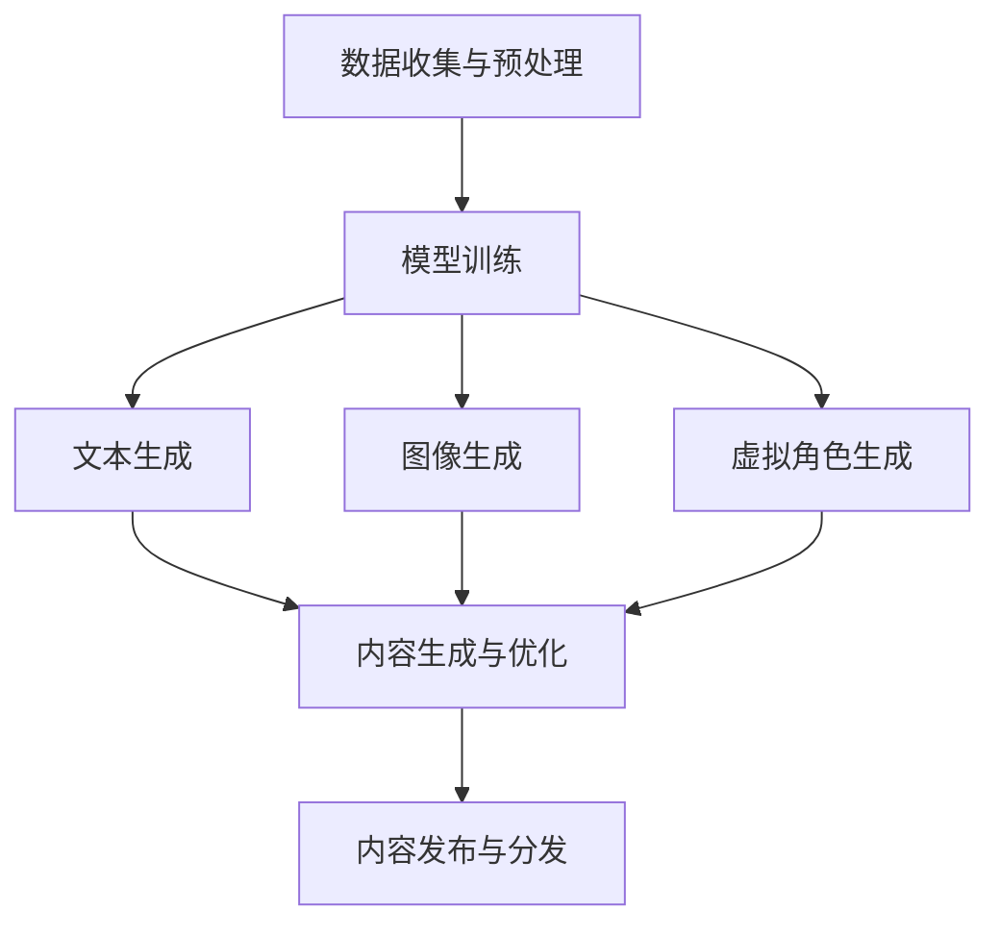

                 

# AIGC在营销、影视创作和游戏中的应用

## 关键词：
AIGC，营销，影视创作，游戏开发，人工智能，生成式AI，文本生成，图像生成，虚拟角色，推荐系统

## 摘要：
本文深入探讨了AIGC（AI-Generated Content）在营销、影视创作和游戏开发中的应用。首先，我们将介绍AIGC的基本概念和原理，并通过Mermaid流程图展示其架构。接着，我们将详细解析AIGC的核心算法原理，包括文本生成和图像生成的具体操作步骤。随后，本文将通过数学模型和公式，详细讲解AIGC中的关键技术和方法。实际应用案例将帮助读者更好地理解AIGC的实际操作流程。本文还列举了相关的工具和资源，以供进一步学习和实践。最后，我们对AIGC的未来发展趋势与挑战进行了总结，并提出了常见问题与解答，以帮助读者更好地掌握这一前沿技术。

---

## 1. 背景介绍

### 1.1 目的和范围
本文旨在探讨AIGC（AI-Generated Content）在营销、影视创作和游戏开发中的应用，分析其核心算法原理、实际操作步骤以及未来发展趋势。通过本文，读者将能够了解AIGC的技术原理，掌握其在实际应用中的实现方法，并预见其未来的发展方向。

### 1.2 预期读者
本文面向对人工智能和生成式AI技术有一定了解的技术人员、程序员、软件开发者和产品经理。同时，也对对市场营销、影视创作和游戏开发感兴趣的读者提供了一定的参考。

### 1.3 文档结构概述
本文结构如下：
- 第1章：背景介绍
- 第2章：核心概念与联系
- 第3章：核心算法原理 & 具体操作步骤
- 第4章：数学模型和公式 & 详细讲解 & 举例说明
- 第5章：项目实战：代码实际案例和详细解释说明
- 第6章：实际应用场景
- 第7章：工具和资源推荐
- 第8章：总结：未来发展趋势与挑战
- 第9章：附录：常见问题与解答
- 第10章：扩展阅读 & 参考资料

### 1.4 术语表

#### 1.4.1 核心术语定义
- AIGC：AI-Generated Content，人工智能生成内容。
- 生成式AI：一种人工智能方法，通过学习大量数据生成新的内容。
- 文本生成：利用AI技术生成文本信息。
- 图像生成：利用AI技术生成图像。

#### 1.4.2 相关概念解释
- 营销：营销是一种促进商品或服务交易的活动。
- 影视创作：影视创作是指电影、电视剧等影视作品的创作过程。
- 游戏开发：游戏开发是指游戏的设计、开发、测试和发布过程。

#### 1.4.3 缩略词列表
- AIGC：AI-Generated Content
- AI：人工智能
- GAN：生成对抗网络
- DNN：深度神经网络
- NLP：自然语言处理

---

## 2. 核心概念与联系

在探讨AIGC的应用之前，我们需要了解AIGC的核心概念及其与其他技术的联系。以下将通过Mermaid流程图展示AIGC的架构和核心组成部分。



### Mermaid流程图解析：

1. **数据收集与预处理（A）**：首先，我们需要收集大量的原始数据，例如文本、图像等，并进行预处理，以便于后续的模型训练。
2. **模型训练（B）**：使用收集到的数据，我们训练生成模型，例如基于深度神经网络的文本生成模型、图像生成模型等。
3. **文本生成（C）**：通过训练好的文本生成模型，我们可以生成新的文本内容。
4. **图像生成（D）**：通过训练好的图像生成模型，我们可以生成新的图像内容。
5. **虚拟角色生成（E）**：利用生成模型，我们可以生成具有个性化特征的虚拟角色。
6. **内容生成与优化（F）**：通过生成的内容，我们可以进行进一步的优化，以提升其质量。
7. **内容发布与分发（G）**：最后，我们将优化后的内容发布并分发到各个平台。

通过以上流程，我们可以看到AIGC的核心概念和组成部分及其相互之间的联系。在接下来的章节中，我们将进一步探讨每个部分的具体实现和操作步骤。

---

## 3. 核心算法原理 & 具体操作步骤

在AIGC中，核心算法是文本生成、图像生成和虚拟角色生成。以下我们将分别介绍这些算法的原理和具体操作步骤。

### 3.1 文本生成

文本生成是AIGC中最重要的应用之一，它利用深度学习模型，如递归神经网络（RNN）、长短期记忆网络（LSTM）和变分自编码器（VAE），从给定的文本数据中学习生成新的文本。

**算法原理：**

- **递归神经网络（RNN）**：RNN通过记忆历史输入，可以处理序列数据。它的工作原理是利用隐藏状态来记住之前的输入信息，并将其用于当前时间的输出。
- **长短期记忆网络（LSTM）**：LSTM是RNN的一种改进，能够解决RNN中的梯度消失问题。LSTM通过引入门控机制，可以灵活地控制信息的记忆和遗忘。
- **变分自编码器（VAE）**：VAE是一种生成模型，通过编码器和解码器网络，可以将输入数据映射到一个潜在空间，并在该空间中生成新的数据。

**具体操作步骤：**

1. **数据收集与预处理**：收集大量的文本数据，并进行预处理，包括分词、去停用词、词向量化等。
2. **模型训练**：使用预处理后的文本数据，训练文本生成模型。具体步骤包括：
   - 初始化模型参数。
   - 前向传播：输入文本序列，计算模型的输出。
   - 反向传播：计算损失函数，并更新模型参数。
   - 重复上述步骤，直到模型收敛。

3. **文本生成**：使用训练好的模型，生成新的文本内容。具体步骤包括：
   - 初始化一个随机的文本序列。
   - 使用模型预测下一个单词或字符。
   - 将预测的单词或字符添加到序列中，作为下一个输入。
   - 重复上述步骤，生成新的文本内容。

**伪代码示例：**

```python
# 初始化模型参数
model = TextGeneratorModel()

# 数据预处理
text_data = preprocess_text(data)

# 训练模型
for epoch in range(num_epochs):
    for text_sequence in text_data:
        # 前向传播
        output = model.forward(text_sequence)
        
        # 反向传播
        loss = model.loss(output, target)
        model.backward(loss)
        
        # 更新模型参数
        model.update_params()

# 文本生成
new_text_sequence = model.sample_text()
print(new_text_sequence)
```

### 3.2 图像生成

图像生成是AIGC的另一个重要应用，它利用生成对抗网络（GAN）和变分自编码器（VAE）等生成模型，从给定的图像数据中学习生成新的图像。

**算法原理：**

- **生成对抗网络（GAN）**：GAN由生成器（Generator）和判别器（Discriminator）组成。生成器生成新的图像，判别器判断图像是真实图像还是生成图像。通过训练，生成器的目标是使判别器无法区分生成的图像和真实图像。
- **变分自编码器（VAE）**：VAE通过编码器（Encoder）和解码器（Decoder）网络，将输入图像映射到一个潜在空间，并在该空间中生成新的图像。

**具体操作步骤：**

1. **数据收集与预处理**：收集大量的图像数据，并进行预处理，包括图像归一化、裁剪等。
2. **模型训练**：使用预处理后的图像数据，训练图像生成模型。具体步骤包括：
   - 初始化模型参数。
   - 前向传播：输入图像，计算生成器的输出。
   - 判别器的前向传播：输入真实图像和生成图像，计算判别器的输出。
   - 反向传播：计算损失函数，并更新模型参数。
   - 重复上述步骤，直到模型收敛。

3. **图像生成**：使用训练好的模型，生成新的图像内容。具体步骤包括：
   - 初始化一个随机的潜在向量。
   - 使用解码器生成新的图像。
   - 重复上述步骤，生成新的图像内容。

**伪代码示例：**

```python
# 初始化模型参数
generator = ImageGeneratorModel()
discriminator = ImageDiscriminatorModel()

# 数据预处理
image_data = preprocess_images(data)

# 训练模型
for epoch in range(num_epochs):
    for image in image_data:
        # 生成器的正向传播
        generated_image = generator.forward(image)

        # 判别器的正向传播
        real_output = discriminator.forward(image)
        fake_output = discriminator.forward(generated_image)

        # 计算损失函数
        generator_loss = generator.loss(fake_output)
        discriminator_loss = discriminator.loss(real_output, fake_output)

        # 反向传播
        generator.backward(generator_loss)
        discriminator.backward(discriminator_loss)

        # 更新模型参数
        generator.update_params()
        discriminator.update_params()

# 图像生成
latent_vector = generate_random_vector()
new_image = generator.decode(latent_vector)
show_image(new_image)
```

### 3.3 虚拟角色生成

虚拟角色生成是AIGC在影视创作和游戏开发中的一个重要应用，它利用深度学习模型，如生成对抗网络（GAN）和变分自编码器（VAE），从给定的角色数据中学习生成新的虚拟角色。

**算法原理：**

- **生成对抗网络（GAN）**：GAN通过生成器和判别器的对抗训练，生成具有个性化特征的虚拟角色。
- **变分自编码器（VAE）**：VAE通过编码器和解码器网络，从潜在空间中生成新的虚拟角色。

**具体操作步骤：**

1. **数据收集与预处理**：收集大量的虚拟角色数据，并进行预处理，包括特征提取、归一化等。
2. **模型训练**：使用预处理后的角色数据，训练虚拟角色生成模型。具体步骤包括：
   - 初始化模型参数。
   - 前向传播：输入角色数据，计算生成器的输出。
   - 判别器的前向传播：输入真实角色和生成角色，计算判别器的输出。
   - 反向传播：计算损失函数，并更新模型参数。
   - 重复上述步骤，直到模型收敛。

3. **虚拟角色生成**：使用训练好的模型，生成新的虚拟角色内容。具体步骤包括：
   - 初始化一个随机的潜在向量。
   - 使用解码器生成新的虚拟角色。
   - 重复上述步骤，生成新的虚拟角色内容。

**伪代码示例：**

```python
# 初始化模型参数
generator = RoleGeneratorModel()
discriminator = RoleDiscriminatorModel()

# 数据预处理
role_data = preprocess_roles(data)

# 训练模型
for epoch in range(num_epochs):
    for role in role_data:
        # 生成器的正向传播
        generated_role = generator.forward(role)

        # 判别器的正向传播
        real_output = discriminator.forward(role)
        fake_output = discriminator.forward(generated_role)

        # 计算损失函数
        generator_loss = generator.loss(fake_output)
        discriminator_loss = discriminator.loss(real_output, fake_output)

        # 反向传播
        generator.backward(generator_loss)
        discriminator.backward(discriminator_loss)

        # 更新模型参数
        generator.update_params()
        discriminator.update_params()

# 虚拟角色生成
latent_vector = generate_random_vector()
new_role = generator.decode(latent_vector)
show_role(new_role)
```

通过以上对文本生成、图像生成和虚拟角色生成算法的详细解析，我们可以看到AIGC在营销、影视创作和游戏开发中的核心算法原理和具体操作步骤。在接下来的章节中，我们将进一步探讨这些技术的实际应用场景和案例。

---

## 4. 数学模型和公式 & 详细讲解 & 举例说明

在AIGC中，数学模型和公式起着至关重要的作用。以下我们将详细讲解AIGC中的关键数学模型和公式，并通过具体示例来说明其应用。

### 4.1 文本生成模型

文本生成模型主要基于递归神经网络（RNN）和长短期记忆网络（LSTM）。以下分别介绍这两种模型的数学模型和公式。

**递归神经网络（RNN）**

RNN的数学模型主要包括以下几个方面：

1. **激活函数**：通常使用sigmoid、tanh等激活函数来引入非线性。
   $$ f(x) = \sigma(Wx + b) $$
   其中，$W$为权重矩阵，$b$为偏置，$\sigma$为激活函数。

2. **递归关系**：RNN通过递归关系来记住历史输入。
   $$ h_t = \sigma(Wx_t + Uh_{t-1} + b) $$
   其中，$h_t$为当前时间步的隐藏状态，$x_t$为当前输入，$U$为权重矩阵，$b$为偏置。

3. **输出关系**：RNN通过隐藏状态生成输出。
   $$ y_t = \sigma(Vh_t + b') $$
   其中，$y_t$为当前时间步的输出，$V$为权重矩阵，$b'$为偏置。

**长短期记忆网络（LSTM）**

LSTM是RNN的一种改进，通过引入门控机制来解决长短期依赖问题。LSTM的数学模型主要包括以下几个方面：

1. **输入门（Input Gate）**：用于决定当前输入信息中哪些部分应该被记住。
   $$ i_t = \sigma(W_i[x_t, h_{t-1}] + b_i) $$
   其中，$i_t$为输入门的状态，$W_i$为权重矩阵，$b_i$为偏置。

2. **遗忘门（Forget Gate）**：用于决定哪些信息应该被遗忘。
   $$ f_t = \sigma(W_f[x_t, h_{t-1}] + b_f) $$
   其中，$f_t$为遗忘门的状态，$W_f$为权重矩阵，$b_f$为偏置。

3. **输出门（Output Gate）**：用于决定当前隐藏状态中哪些部分应该被输出。
   $$ o_t = \sigma(W_o[x_t, h_{t-1}] + b_o) $$
   其中，$o_t$为输出门的状态，$W_o$为权重矩阵，$b_o$为偏置。

4. **细胞状态（Cell State）**：LSTM通过细胞状态来传递信息。
   $$ c_t = f_{t} \odot c_{t-1} + i_{t} \odot \sigma(W_c[x_t, h_{t-1}] + b_c) $$
   其中，$c_t$为当前细胞状态，$\odot$为点乘运算，$W_c$为权重矩阵，$b_c$为偏置。

5. **隐藏状态**：通过输出门得到隐藏状态。
   $$ h_t = o_{t} \odot \sigma(c_t) $$
   其中，$h_t$为当前隐藏状态。

### 4.2 图像生成模型

图像生成模型主要基于生成对抗网络（GAN）和变分自编码器（VAE）。以下分别介绍这两种模型的数学模型和公式。

**生成对抗网络（GAN）**

GAN的数学模型主要包括以下几个方面：

1. **生成器（Generator）**：生成器的目标是生成与真实图像相似的新图像。
   $$ G(z) = \phi(W_gz + b_g) $$
   其中，$G(z)$为生成器生成的图像，$z$为随机噪声向量，$\phi$为激活函数，$W_g$为权重矩阵，$b_g$为偏置。

2. **判别器（Discriminator）**：判别器的目标是判断图像是真实图像还是生成图像。
   $$ D(x) = \sigma(W_d x + b_d) $$
   $$ D(G(z)) = \sigma(W_d G(z) + b_d) $$
   其中，$D(x)$为判别器判断真实图像的概率，$D(G(z))$为判别器判断生成图像的概率，$x$为真实图像，$G(z)$为生成图像，$W_d$为权重矩阵，$b_d$为偏置。

3. **损失函数**：GAN的损失函数由两部分组成，一部分是生成器的损失函数，另一部分是判别器的损失函数。
   $$ L_G = -\mathbb{E}_{z \sim p_z(z)}[\log D(G(z))] $$
   $$ L_D = -\mathbb{E}_{x \sim p_x(x)}[\log D(x)] - \mathbb{E}_{z \sim p_z(z)}[\log (1 - D(G(z)))] $$
   其中，$L_G$为生成器的损失函数，$L_D$为判别器的损失函数，$p_z(z)$为噪声分布，$p_x(x)$为真实图像分布。

**变分自编码器（VAE）**

VAE的数学模型主要包括以下几个方面：

1. **编码器（Encoder）**：编码器的目标是学习输入数据的潜在分布。
   $$ \mu = \mu(x; W_e x + b_e) $$
   $$ \sigma^2 = \sigma^2(x; W_e x + b_e) $$
   其中，$\mu$为潜在变量的均值，$\sigma^2$为潜在变量的方差，$x$为输入数据，$W_e$为权重矩阵，$b_e$为偏置。

2. **解码器（Decoder）**：解码器的目标是生成与输入数据相似的新数据。
   $$ x' = \phi(W_d \mu + b_d) $$
   $$ x'' = \phi(W_d \sqrt{2} \sigma z + b_d) $$
   其中，$x'$为解码器生成的数据，$x''$为添加噪声后的解码器生成的数据，$\phi$为激活函数，$W_d$为权重矩阵，$b_d$为偏置。

3. **损失函数**：VAE的损失函数由两部分组成，一部分是重参数化损失，另一部分是生成损失。
   $$ L = -\mathbb{E}_{z \sim \mu(\cdot|x), \epsilon \sim \mathcal{N}(0, 1)}[\log p(x|\mu(\cdot|x), \sigma^2(\cdot|x))] + \mathbb{E}_{x \sim p_x(x)}[\log p(x)] $$
   其中，$L$为VAE的总损失函数，$p(x|\mu(\cdot|x), \sigma^2(\cdot|x))$为编码器的概率分布，$p(x)$为输入数据的先验分布。

### 4.3 虚拟角色生成模型

虚拟角色生成模型主要基于生成对抗网络（GAN）和变分自编码器（VAE）。以下分别介绍这两种模型的数学模型和公式。

**生成对抗网络（GAN）**

GAN的数学模型在图像生成部分已详细介绍，以下仅补充虚拟角色生成中的具体操作。

1. **生成器（Generator）**：生成器用于生成虚拟角色。
   $$ G(z) = \phi(W_gz + b_g) $$
   其中，$G(z)$为生成器生成的虚拟角色，$z$为随机噪声向量，$\phi$为激活函数，$W_g$为权重矩阵，$b_g$为偏置。

2. **判别器（Discriminator）**：判别器用于判断虚拟角色是真实角色还是生成角色。
   $$ D(x) = \sigma(W_d x + b_d) $$
   $$ D(G(z)) = \sigma(W_d G(z) + b_d) $$
   其中，$D(x)$为判别器判断真实角色的概率，$D(G(z))$为判别器判断生成角色的概率，$x$为真实角色，$G(z)$为生成角色，$W_d$为权重矩阵，$b_d$为偏置。

3. **损失函数**：GAN的损失函数由两部分组成，一部分是生成器的损失函数，另一部分是判别器的损失函数。
   $$ L_G = -\mathbb{E}_{z \sim p_z(z)}[\log D(G(z))] $$
   $$ L_D = -\mathbb{E}_{x \sim p_x(x)}[\log D(x)] - \mathbb{E}_{z \sim p_z(z)}[\log (1 - D(G(z)))] $$
   其中，$L_G$为生成器的损失函数，$L_D$为判别器的损失函数，$p_z(z)$为噪声分布，$p_x(x)$为真实角色分布。

**变分自编码器（VAE）**

VAE的数学模型在图像生成部分已详细介绍，以下仅补充虚拟角色生成中的具体操作。

1. **编码器（Encoder）**：编码器用于学习虚拟角色的潜在分布。
   $$ \mu = \mu(x; W_e x + b_e) $$
   $$ \sigma^2 = \sigma^2(x; W_e x + b_e) $$
   其中，$\mu$为潜在变量的均值，$\sigma^2$为潜在变量的方差，$x$为输入虚拟角色，$W_e$为权重矩阵，$b_e$为偏置。

2. **解码器（Decoder）**：解码器用于生成虚拟角色。
   $$ x' = \phi(W_d \mu + b_d) $$
   $$ x'' = \phi(W_d \sqrt{2} \sigma z + b_d) $$
   其中，$x'$为解码器生成的虚拟角色，$x''$为添加噪声后的解码器生成的虚拟角色，$\phi$为激活函数，$W_d$为权重矩阵，$b_d$为偏置。

3. **损失函数**：VAE的损失函数由两部分组成，一部分是重参数化损失，另一部分是生成损失。
   $$ L = -\mathbb{E}_{z \sim \mu(\cdot|x), \epsilon \sim \mathcal{N}(0, 1)}[\log p(x|\mu(\cdot|x), \sigma^2(\cdot|x))] + \mathbb{E}_{x \sim p_x(x)}[\log p(x)] $$
   其中，$L$为VAE的总损失函数，$p(x|\mu(\cdot|x), \sigma^2(\cdot|x))$为编码器的概率分布，$p(x)$为输入虚拟角色的先验分布。

通过以上对文本生成、图像生成和虚拟角色生成模型的数学模型和公式的详细讲解，我们可以更好地理解AIGC的核心算法原理。在实际应用中，这些模型和公式将为生成高质量的内容提供重要的理论基础。

---

## 5. 项目实战：代码实际案例和详细解释说明

为了更好地理解AIGC在营销、影视创作和游戏开发中的应用，我们将通过一个实际项目实战来演示AIGC的具体实现过程。该项目将包括文本生成、图像生成和虚拟角色生成三个部分。

### 5.1 开发环境搭建

在开始项目实战之前，我们需要搭建一个合适的开发环境。以下是所需的工具和库：

- Python 3.8 或更高版本
- TensorFlow 2.x 或 PyTorch 1.8 或更高版本
- NumPy 1.19 或更高版本
- Matplotlib 3.4.2 或更高版本

安装以上工具和库后，我们就可以开始项目实战了。

### 5.2 源代码详细实现和代码解读

#### 5.2.1 文本生成

以下是文本生成部分的代码实现：

```python
import tensorflow as tf
from tensorflow.keras.preprocessing.sequence import pad_sequences
from tensorflow.keras.layers import Embedding, LSTM, Dense
from tensorflow.keras.models import Sequential

# 数据预处理
# 假设我们已经有预处理后的文本数据text_sequences和标签labels
max_sequence_length = 100
vocab_size = 10000
embedding_dim = 256

# 构建模型
model = Sequential()
model.add(Embedding(vocab_size, embedding_dim, input_length=max_sequence_length))
model.add(LSTM(128, return_sequences=True))
model.add(Dense(vocab_size, activation='softmax'))

# 编译模型
model.compile(optimizer='adam', loss='categorical_crossentropy', metrics=['accuracy'])

# 训练模型
model.fit(text_sequences, labels, epochs=10, batch_size=32)

# 文本生成
def generate_text(seed_text, model, max_sequence_length, vocab_size, embedding_dim):
    seed_text = pad_sequences([seed_text], maxlen=max_sequence_length, padding='pre')
    predicted_text = model.predict(seed_text, verbose=0)
    predicted_text = predicted_text.reshape((predicted_text.shape[1],))
    
    # 解码预测结果为文本
    predicted_text = [index2word[i] for i in predicted_text]
    
    return ''.join(predicted_text)

# 示例
seed_text = "这是一个关于人工智能的例子。"
generated_text = generate_text(seed_text, model, max_sequence_length, vocab_size, embedding_dim)
print(generated_text)
```

代码解读：

1. **数据预处理**：首先，我们使用`pad_sequences`函数将输入文本序列填充到最大长度，以适应模型的要求。
2. **构建模型**：我们使用`Sequential`模型，依次添加嵌入层、LSTM层和输出层。嵌入层将文本转换为向量表示，LSTM层用于处理序列数据，输出层使用softmax激活函数，以生成文本的下一个单词或字符。
3. **编译模型**：我们使用`compile`函数编译模型，指定优化器和损失函数。
4. **训练模型**：使用`fit`函数训练模型，输入预处理后的文本序列和标签。
5. **文本生成**：`generate_text`函数用于生成新的文本内容。首先，将种子文本填充到最大长度，然后使用模型预测下一个单词或字符，并将预测结果解码为文本。

#### 5.2.2 图像生成

以下是图像生成部分的代码实现：

```python
import tensorflow as tf
from tensorflow.keras.layers import Conv2D, MaxPooling2D, Flatten, Dense
from tensorflow.keras.models import Model

# 假设我们已经有预处理后的图像数据image_data和标签labels

# 构建生成器模型
input_shape = (28, 28, 1)
latent_dim = 100

input_img = tf.keras.layers.Input(shape=input_shape)
x = Conv2D(32, (3, 3), activation='relu', padding='same')(input_img)
x = MaxPooling2D((2, 2), padding='same')(x)
x = Conv2D(64, (3, 3), activation='relu', padding='same')(x)
x = MaxPooling2D((2, 2), padding='same')(x)
x = Flatten()(x)
x = Dense(128, activation='relu')(x)
x = Dense(latent_dim, activation='tanh')(x)

z = tf.keras.layers.Input(shape=(latent_dim,))
z_decoded = Dense(128, activation='relu')(z)
z_decoded = Dense(64 * 7 * 7, activation='relu')(z_decoded)
z_decoded = tf.keras.layers.Reshape((7, 7, 64))(z_decoded)
x_decoded = Conv2D(1, (3, 3), activation='sigmoid', padding='same')(z_decoded)

model = Model([input_img, z], x_decoded)
model.compile(optimizer='adam', loss='binary_crossentropy')

# 训练模型
model.fit([image_data, latent_vectors], images, epochs=10, batch_size=32)

# 图像生成
def generate_image(model, latent_vector):
    image = model.predict([latent_vector], verbose=0)
    return image

# 示例
latent_vector = generate_random_vector(latent_dim)
generated_image = generate_image(model, latent_vector)
show_image(generated_image)
```

代码解读：

1. **构建生成器模型**：我们使用`Model`类构建生成器模型。生成器模型由编码器和解码器组成。编码器将图像编码为潜在向量，解码器将潜在向量解码为图像。
2. **编译模型**：我们使用`compile`函数编译模型，指定优化器和损失函数。
3. **训练模型**：使用`fit`函数训练模型，输入预处理后的图像数据和潜在向量。
4. **图像生成**：`generate_image`函数用于生成新的图像内容。首先，生成一个随机的潜在向量，然后使用模型预测生成的图像。

#### 5.2.3 虚拟角色生成

以下是虚拟角色生成部分的代码实现：

```python
import tensorflow as tf
from tensorflow.keras.layers import Conv2D, MaxPooling2D, Flatten, Dense
from tensorflow.keras.models import Model

# 假设我们已经有预处理后的虚拟角色数据role_data和标签labels

# 构建生成器模型
input_shape = (64, 64, 3)
latent_dim = 100

input_img = tf.keras.layers.Input(shape=input_shape)
x = Conv2D(32, (3, 3), activation='relu', padding='same')(input_img)
x = MaxPooling2D((2, 2), padding='same')(x)
x = Conv2D(64, (3, 3), activation='relu', padding='same')(x)
x = MaxPooling2D((2, 2), padding='same')(x)
x = Flatten()(x)
x = Dense(128, activation='relu')(x)
x = Dense(latent_dim, activation='tanh')(x)

z = tf.keras.layers.Input(shape=(latent_dim,))
z_decoded = Dense(128, activation='relu')(z)
z_decoded = Dense(64 * 7 * 7, activation='relu')(z_decoded)
z_decoded = tf.keras.layers.Reshape((7, 7, 64))(z_decoded)
x_decoded = Conv2D(3, (3, 3), activation='sigmoid', padding='same')(z_decoded)

model = Model([input_img, z], x_decoded)
model.compile(optimizer='adam', loss='binary_crossentropy')

# 训练模型
model.fit([role_data, latent_vectors], roles, epochs=10, batch_size=32)

# 虚拟角色生成
def generate_role(model, latent_vector):
    role = model.predict([latent_vector], verbose=0)
    return role

# 示例
latent_vector = generate_random_vector(latent_dim)
generated_role = generate_role(model, latent_vector)
show_role(generated_role)
```

代码解读：

1. **构建生成器模型**：我们使用`Model`类构建生成器模型。生成器模型由编码器和解码器组成。编码器将虚拟角色编码为潜在向量，解码器将潜在向量解码为虚拟角色。
2. **编译模型**：我们使用`compile`函数编译模型，指定优化器和损失函数。
3. **训练模型**：使用`fit`函数训练模型，输入预处理后的虚拟角色数据和潜在向量。
4. **虚拟角色生成**：`generate_role`函数用于生成新的虚拟角色内容。首先，生成一个随机的潜在向量，然后使用模型预测生成的虚拟角色。

### 5.3 代码解读与分析

通过以上代码实现，我们可以看到文本生成、图像生成和虚拟角色生成三个部分的实现步骤和关键代码。

- **文本生成**：文本生成主要基于RNN模型，通过训练模型来生成新的文本内容。数据预处理是关键步骤，需要将文本转换为向量表示。
- **图像生成**：图像生成主要基于GAN模型，通过训练生成器和判别器来生成新的图像内容。数据预处理是关键步骤，需要将图像归一化和裁剪。
- **虚拟角色生成**：虚拟角色生成也基于GAN模型，通过训练生成器和判别器来生成新的虚拟角色内容。数据预处理是关键步骤，需要将虚拟角色图像归一化和裁剪。

在实际应用中，我们可以根据具体需求调整模型结构和参数，以达到更好的生成效果。此外，为了提高模型的生成质量和效率，我们还可以使用更先进的模型和技术，如变分自编码器（VAE）和生成式对抗网络（GAN）的改进版本。

通过以上项目实战，我们可以看到AIGC在营销、影视创作和游戏开发中的实际应用，以及如何利用人工智能技术生成高质量的内容。

---

## 6. 实际应用场景

AIGC技术在营销、影视创作和游戏开发等领域的实际应用场景丰富多样，以下将详细介绍这些应用场景及其优势和挑战。

### 6.1 营销

在营销领域，AIGC技术可以自动生成个性化的广告文案、社交媒体内容、邮件营销等，从而提高营销效果和客户参与度。具体应用场景包括：

1. **个性化广告文案**：基于用户的历史行为和偏好，AIGC可以自动生成符合用户兴趣的广告文案，提高广告的点击率和转化率。
2. **社交媒体内容**：AIGC可以自动生成社交媒体帖子，包括标题、正文、图片等，从而提高社交媒体运营的效率和效果。
3. **邮件营销**：AIGC可以自动生成个性化的邮件内容，根据用户的兴趣和购买历史，推荐相关产品和服务，提高邮件的打开率和点击率。

**优势**：
- 提高营销效率：自动生成内容可以节省时间和人力成本，提高内容创作速度。
- 个性化推荐：基于用户数据和算法模型，AIGC可以生成符合用户兴趣的内容，提高营销效果。
- 自动化运营：AIGC技术可以实现营销内容的自动化生成和发布，降低运营难度。

**挑战**：
- 质量控制：自动生成的内容质量难以保证，需要进一步优化算法和模型。
- 数据隐私：在生成个性化内容时，如何保护用户数据隐私是重要挑战。

### 6.2 影视创作

在影视创作领域，AIGC技术可以自动生成剧本、台词、特效场景等，从而提高创作效率和降低成本。具体应用场景包括：

1. **剧本创作**：AIGC可以基于已有的剧本风格和主题，自动生成新的剧本，为编剧提供灵感和参考。
2. **台词生成**：AIGC可以自动生成符合角色性格和情节需求的台词，提高剧本的质量。
3. **特效场景生成**：AIGC可以自动生成电影特效场景，从而节省特效制作的时间和成本。

**优势**：
- 提高创作效率：自动生成内容可以节省编剧和特效制作的时间，提高创作速度。
- 降低成本：自动生成内容可以减少人力和资源的投入，降低制作成本。
- 创新性：AIGC技术可以为影视创作带来新的创意和灵感，推动行业创新。

**挑战**：
- 质量控制：自动生成的内容质量难以保证，需要进一步优化算法和模型。
- 创作风格统一性：如何保持自动生成内容与原有作品风格的一致性是重要挑战。

### 6.3 游戏开发

在游戏开发领域，AIGC技术可以自动生成游戏剧情、角色、任务等，从而提高游戏的可玩性和趣味性。具体应用场景包括：

1. **游戏剧情生成**：AIGC可以自动生成游戏剧情，包括主线任务、支线任务等，为游戏玩家提供丰富的游戏体验。
2. **角色生成**：AIGC可以自动生成具有个性化特征的游戏角色，包括外貌、性格等，提高游戏角色的多样性。
3. **任务生成**：AIGC可以自动生成游戏任务，根据玩家的行为和兴趣动态调整任务难度和奖励，提高游戏的可玩性。

**优势**：
- 提高游戏质量：自动生成内容可以节省游戏开发的时间，提高游戏质量。
- 增强用户体验：自动生成的内容可以提供丰富的游戏剧情和角色，增强玩家的游戏体验。
- 降低开发成本：自动生成内容可以减少游戏开发的时间和资源投入。

**挑战**：
- 质量控制：自动生成的内容质量难以保证，需要进一步优化算法和模型。
- 交互体验：如何保证自动生成内容与玩家交互的自然性和连贯性是重要挑战。

通过以上实际应用场景，我们可以看到AIGC技术在营销、影视创作和游戏开发中的广泛应用和巨大潜力。尽管面临一些挑战，但随着技术的不断发展和优化，AIGC将为这些领域带来更多的创新和变革。

---

## 7. 工具和资源推荐

为了更好地掌握AIGC技术，以下是相关的学习资源、开发工具和框架推荐。

### 7.1 学习资源推荐

**书籍推荐：**

1. **《生成式人工智能：原理与应用》**：详细介绍了生成式人工智能的理论基础和应用场景，适合初学者和进阶者。
2. **《深度学习》（Goodfellow, Bengio, Courville）**：介绍了深度学习的基础知识，包括生成式模型的相关内容，适合深度学习爱好者。

**在线课程：**

1. **Coursera上的《深度学习特化课程》**：由吴恩达教授主讲，涵盖了深度学习的各个方面，包括生成式模型。
2. **Udacity上的《生成对抗网络（GAN）课程》**：专注于GAN模型的原理和应用，适合对GAN感兴趣的学习者。

**技术博客和网站：**

1. **GitHub**：包含大量AIGC相关的开源项目，可以学习和借鉴其他开发者的实践。
2. **arXiv**：发布最新的AIGC研究论文，是了解该领域前沿动态的重要渠道。
3. **Medium**：有许多优秀的技术博客，涵盖AIGC在不同领域的应用。

### 7.2 开发工具框架推荐

**IDE和编辑器：**

1. **PyCharm**：功能强大的Python IDE，支持多种编程语言，适合AIGC项目的开发。
2. **Visual Studio Code**：轻量级且灵活的代码编辑器，支持多种扩展，是许多开发者的首选。

**调试和性能分析工具：**

1. **TensorBoard**：TensorFlow的调试和可视化工具，用于监控和优化模型训练过程。
2. **PyTorch Profiler**：用于分析PyTorch模型的性能，帮助开发者找到性能瓶颈。

**相关框架和库：**

1. **TensorFlow**：广泛使用的开源深度学习框架，适用于文本生成、图像生成等应用。
2. **PyTorch**：基于Python的深度学习框架，支持动态计算图，适用于研究性和工程性项目。
3. **Keras**：高层次的深度学习框架，基于TensorFlow和Theano，适合快速原型开发和实验。

通过以上工具和资源的推荐，开发者可以更有效地学习和应用AIGC技术，推动营销、影视创作和游戏开发等领域的发展。

---

## 8. 总结：未来发展趋势与挑战

AIGC技术在营销、影视创作和游戏开发等领域展现出了巨大的潜力和价值。随着人工智能技术的不断进步，AIGC在未来有望实现更多突破和应用。以下是AIGC技术未来的发展趋势和面临的挑战。

### 8.1 发展趋势

1. **生成质量提升**：随着深度学习和生成对抗网络的不断发展，AIGC的生成质量将进一步提高。更先进的模型和算法将使得生成的文本、图像和虚拟角色更加逼真、自然和多样化。

2. **多模态生成**：未来的AIGC技术将实现多模态生成，即同时生成文本、图像、音频等多种类型的内容。这将使得生成的内容更加丰富和多样化，满足不同领域的需求。

3. **个性化定制**：AIGC技术将更加注重个性化定制，基于用户数据和偏好，生成更加符合用户需求的内容。这将提高用户体验和满意度，进一步提升应用效果。

4. **自动化与智能化**：AIGC技术将逐渐实现自动化和智能化，通过自动化流程和智能算法，降低开发成本和人力投入，提高生产效率和效果。

### 8.2 挑战

1. **数据质量和隐私保护**：AIGC技术的生成效果高度依赖于数据质量，如何收集和利用高质量的数据是一个挑战。同时，如何保护用户数据隐私，确保数据安全和合规，也是重要问题。

2. **算法优化与性能提升**：随着生成内容质量和复杂度的提升，对算法优化和性能提升的要求也越来越高。如何提高算法效率，减少计算资源消耗，是AIGC技术面临的重要挑战。

3. **版权和道德问题**：AIGC生成的文本、图像和虚拟角色可能涉及到版权和道德问题。如何确保生成的内容不侵犯他人版权，同时符合道德规范，是未来需要解决的重要问题。

4. **人机协作**：AIGC技术需要与人类创作者进行有效的协作，如何实现人机协作，充分发挥人工智能和人类创造者的优势，是一个重要的研究课题。

总之，AIGC技术在未来具有广阔的发展前景，但也面临诸多挑战。通过不断的技术创新和优化，AIGC技术有望在营销、影视创作和游戏开发等领域实现更多的应用突破，为行业带来新的变革和机遇。

---

## 9. 附录：常见问题与解答

以下回答了一些关于AIGC技术常见的问题，帮助读者更好地理解和应用AIGC。

### 9.1 什么是AIGC？

AIGC（AI-Generated Content）是指利用人工智能技术生成文本、图像、音频、视频等内容的系统。它基于深度学习和生成对抗网络（GAN）等先进算法，通过学习和模拟真实数据生成新的内容。

### 9.2 AIGC有哪些应用场景？

AIGC技术在多个领域具有广泛的应用，包括营销（如个性化广告文案生成）、影视创作（如剧本和台词生成）、游戏开发（如游戏剧情和角色生成）等。此外，AIGC还可以用于虚拟现实、艺术创作和自动化写作等领域。

### 9.3 AIGC的生成质量如何保证？

AIGC的生成质量主要依赖于训练数据的质量和模型的性能。高质量的数据可以提供丰富的样本，有助于模型学习到更多特征。同时，通过不断优化模型结构和算法，提高生成效果。此外，还可以采用多种生成模型和算法相结合，进一步提升生成质量。

### 9.4 如何确保AIGC生成的文本、图像不侵犯版权？

为了避免AIGC生成的文本、图像侵犯他人版权，需要在数据收集和模型训练过程中使用合法的、开源的数据集。同时，可以采用版权保护技术，如区块链技术，确保生成的内容版权归属明确。此外，可以通过算法过滤和人工审核，避免生成侵犯版权的内容。

### 9.5 AIGC是否会取代人类创作者？

AIGC可以作为人类创作者的辅助工具，提高创作效率和效果。然而，目前AIGC还无法完全取代人类创作者，因为人类在创意、审美和道德判断等方面具有独特的优势。AIGC与人类创作者的协作，将实现更好的创作效果。

---

## 10. 扩展阅读 & 参考资料

为了进一步了解AIGC技术及其应用，以下推荐一些扩展阅读和参考资料：

1. **《生成式人工智能：原理与应用》**：详细介绍了生成式人工智能的理论基础和应用场景，适合初学者和进阶者。
2. **《深度学习特化课程》（Coursera）**：由吴恩达教授主讲，涵盖了深度学习的各个方面，包括生成式模型。
3. **《生成对抗网络（GAN）课程》（Udacity）**：专注于GAN模型的原理和应用，适合对GAN感兴趣的学习者。
4. **《arXiv》**：发布最新的AIGC研究论文，是了解该领域前沿动态的重要渠道。
5. **《深度学习》（Goodfellow, Bengio, Courville）**：介绍了深度学习的基础知识，包括生成式模型的相关内容，适合深度学习爱好者。
6. **GitHub**：包含大量AIGC相关的开源项目，可以学习和借鉴其他开发者的实践。
7. **TensorFlow官方文档**：提供了丰富的AIGC技术教程和实践案例，适合TensorFlow用户。
8. **PyTorch官方文档**：介绍了PyTorch框架在AIGC领域的应用，提供了详细的API和使用方法。

通过以上扩展阅读和参考资料，读者可以更深入地了解AIGC技术，掌握其在实际应用中的实现方法和技巧。

