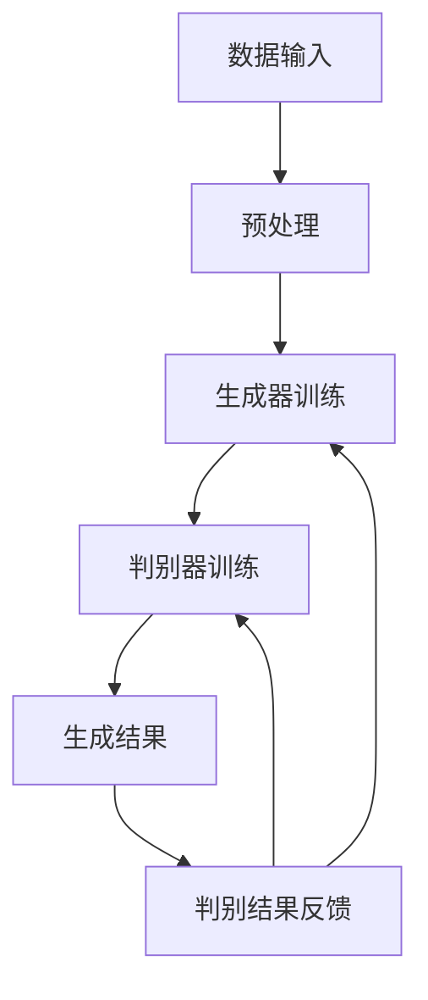

                 

### 1. 背景介绍

#### 1.1 目的和范围

本文旨在探讨人工智能生成内容（AIGC）如何推动能源行业的智能化转型。随着能源需求的不断增长和环境问题的日益严重，智能化已成为能源行业未来发展的重要方向。AIGC作为人工智能领域的创新技术，具有生成高质量文本、图像和视频的能力，为能源行业的智能化提供了新的工具和手段。本文将深入分析AIGC的核心概念、算法原理、数学模型以及实际应用场景，探讨其在能源行业中的应用潜力。

#### 1.2 预期读者

本文面向对人工智能和能源行业有一定了解的读者，包括但不限于人工智能研究人员、工程师、软件开发者、能源行业从业者以及对此领域感兴趣的爱好者。通过本文的阅读，读者可以全面了解AIGC的基本概念和应用场景，并为未来在能源行业中的实际应用提供一定的指导和启示。

#### 1.3 文档结构概述

本文将分为以下几个部分：

1. **背景介绍**：介绍本文的目的、预期读者、文档结构以及核心术语定义。
2. **核心概念与联系**：通过Mermaid流程图，阐述AIGC的核心概念和原理。
3. **核心算法原理 & 具体操作步骤**：详细讲解AIGC的核心算法原理和具体操作步骤。
4. **数学模型和公式 & 详细讲解 & 举例说明**：介绍AIGC的数学模型和公式，并通过实例进行详细讲解。
5. **项目实战：代码实际案例和详细解释说明**：展示AIGC在实际项目中的代码实现和详细解释。
6. **实际应用场景**：探讨AIGC在能源行业中的实际应用场景。
7. **工具和资源推荐**：推荐与AIGC相关的学习资源、开发工具和最新研究成果。
8. **总结：未来发展趋势与挑战**：总结AIGC在能源行业中的未来发展趋势和面临的挑战。
9. **附录：常见问题与解答**：提供关于AIGC的常见问题解答。
10. **扩展阅读 & 参考资料**：推荐更多关于AIGC和能源行业的相关阅读资料。

通过以上结构，本文将系统性地介绍AIGC在能源行业的应用，旨在为读者提供一个全面、深入的了解。

#### 1.4 术语表

在本篇文章中，我们将使用一些特定的术语和概念。以下是对这些术语和概念的定义和解释：

#### 1.4.1 核心术语定义

- **AIGC（人工智能生成内容）**：AIGC是指通过人工智能技术生成文本、图像、视频等内容的系统。它基于深度学习和自然语言处理等技术，能够根据给定的输入生成具有高相似度或原创性的内容。
- **能源行业**：能源行业涉及能源的勘探、开发、生产、转换、储存和分配等环节，包括传统能源（如石油、天然气、煤炭）和可再生能源（如太阳能、风能、水能）。
- **智能化转型**：智能化转型是指将传统行业通过引入人工智能技术，实现生产、管理、服务等环节的自动化、智能化升级。
- **深度学习**：深度学习是一种机器学习技术，通过多层神经网络模型来模拟人脑的学习过程，实现数据的特征提取和分类。
- **自然语言处理**：自然语言处理（NLP）是人工智能的一个分支，旨在使计算机能够理解、处理和生成人类语言。

#### 1.4.2 相关概念解释

- **生成对抗网络（GAN）**：生成对抗网络是一种深度学习模型，由生成器和判别器两个神经网络组成。生成器生成数据，判别器判断生成数据与真实数据之间的相似度，通过不断训练，生成器逐渐生成更真实的数据。
- **变分自编码器（VAE）**：变分自编码器是一种生成模型，通过编码器和解码器两个神经网络，将输入数据编码为潜在空间中的向量，再从潜在空间中采样生成新的数据。
- **迁移学习**：迁移学习是一种利用已经训练好的模型在新任务上的表现进行快速训练的方法，通过在已有模型的基础上微调，实现对新任务的适应性。

#### 1.4.3 缩略词列表

- **AI**：人工智能（Artificial Intelligence）
- **GAN**：生成对抗网络（Generative Adversarial Network）
- **VAE**：变分自编码器（Variational Autoencoder）
- **NLP**：自然语言处理（Natural Language Processing）
- **NLP**：自然语言处理（Natural Language Processing）
- **NLP**：自然语言处理（Natural Language Processing）

通过以上对核心术语和概念的介绍，读者可以更好地理解文章中的相关内容。在后续的章节中，我们将进一步深入探讨AIGC的技术原理、应用场景和未来发展趋势。

---

### 2. 核心概念与联系

在探讨AIGC如何推动能源行业智能化之前，我们需要首先理解AIGC的核心概念和基本原理。AIGC是一种基于深度学习和自然语言处理（NLP）技术的生成模型，它通过生成器（Generator）和判别器（Discriminator）之间的对抗训练，生成高质量、具有原创性的文本、图像和视频内容。为了更好地阐述AIGC的原理，我们将通过Mermaid流程图展示其核心概念和架构。

#### Mermaid流程图



在这个流程图中，我们可以看到：

- **A[数据输入]**：AIGC首先需要输入大量训练数据，这些数据可以是文本、图像或视频等。
- **B[预处理]**：输入的数据需要进行预处理，如数据清洗、数据增强等，以提高模型的训练效果。
- **C[生成器训练]**：生成器负责生成数据，通过与判别器的对抗训练，生成越来越接近真实数据的高质量内容。
- **D[判别器训练]**：判别器负责判断生成数据与真实数据之间的相似度。在训练过程中，判别器需要不断学习如何更好地区分真实数据与生成数据。
- **E[生成结果]**：生成器生成的新数据会通过判别器进行评估。
- **F[判别结果反馈]**：判别器的评估结果会反馈给生成器，生成器根据反馈调整生成策略，以提高生成数据的质量。

通过这种对抗训练，生成器和判别器相互促进，最终生成器能够生成具有高相似度或原创性的高质量内容。

#### 关键技术与算法

AIGC的核心技术包括生成对抗网络（GAN）、变分自编码器（VAE）和迁移学习等。以下是对这些技术的简要介绍：

- **生成对抗网络（GAN）**：GAN由生成器和判别器组成，生成器负责生成数据，判别器负责判断生成数据与真实数据之间的相似度。GAN的训练过程是一个动态对抗的过程，生成器和判别器通过不断调整各自的行为，最终达到平衡状态，使得生成器能够生成高质量的数据。
  
  **算法原理**：
  - **生成器**：生成器从随机噪声中生成数据，目标是生成与真实数据相似的数据。
  - **判别器**：判别器接收真实数据和生成数据，判断它们的相似度，目标是最大化其区分真实数据和生成数据的准确率。
  - **对抗训练**：生成器和判别器通过对抗训练相互提升，生成器尝试生成更真实的数据，判别器尝试更好地区分真实数据和生成数据。

- **变分自编码器（VAE）**：VAE是一种无监督学习模型，通过编码器和解码器两个神经网络，将输入数据编码为潜在空间中的向量，再从潜在空间中采样生成新的数据。

  **算法原理**：
  - **编码器**：编码器将输入数据映射到潜在空间中的向量。
  - **解码器**：解码器从潜在空间中采样生成新的数据。
  - **损失函数**：VAE使用变分损失函数，包括重建损失和KL散度，来优化编码器和解码器的参数。

- **迁移学习**：迁移学习是一种利用已经训练好的模型在新任务上的表现进行快速训练的方法，通过在已有模型的基础上微调，实现对新任务的适应性。

  **算法原理**：
  - **预训练模型**：在源任务上预训练一个模型，使其具有泛化能力。
  - **迁移**：将预训练模型迁移到目标任务，通过在目标任务上微调，提高模型在目标任务上的性能。

通过以上对AIGC核心概念和技术的介绍，我们可以更好地理解AIGC在能源行业智能化中的应用潜力。在接下来的章节中，我们将进一步探讨AIGC的具体算法原理和操作步骤，以及其在能源行业中的实际应用。

---

### 3. 核心算法原理 & 具体操作步骤

在了解了AIGC的核心概念和架构之后，接下来我们将深入探讨AIGC的核心算法原理和具体操作步骤，以便更好地理解其如何实现生成高质量的内容。

#### 3.1. GAN（生成对抗网络）算法原理

生成对抗网络（GAN）是AIGC中最常用的算法之一，其核心思想是通过生成器和判别器的对抗训练，生成逼真的数据。以下是GAN算法的基本原理和操作步骤：

**3.1.1. 生成器（Generator）**

生成器的目标是从随机噪声中生成与真实数据相似的数据。生成器通常由多层神经网络组成，通过逐层解码的方式将噪声映射到生成数据。

**伪代码：**

```python
# 生成器伪代码
def generator(z):
    # z为随机噪声
    h1 = nn.Linear(z, hidden_size1)
    h2 = nn.Linear(hidden_size1, hidden_size2)
    x生成的 = nn.Linear(hidden_size2, output_size)
    return x生成的
```

**3.1.2. 判别器（Discriminator）**

判别器的目标是最小化生成的数据与真实数据的差异，从而提高判别器区分生成数据与真实数据的能力。判别器通常也是一个多层神经网络，通过逐层编码的方式接收数据并输出其概率。

**伪代码：**

```python
# 判别器伪代码
def discriminator(x):
    # x为输入数据
    h1 = nn.Linear(x, hidden_size1)
    h2 = nn.Linear(hidden_size1, hidden_size2)
    prob = nn.Linear(hidden_size2, 1)
    return prob(x)
```

**3.1.3. 对抗训练**

GAN的训练过程是一个动态对抗的过程，生成器和判别器通过不断调整各自的行为，最终达到平衡状态，使得生成器能够生成高质量的数据。

**伪代码：**

```python
# GAN训练伪代码
for epoch in range(num_epochs):
    for x真实的，x生成的 in 数据流:
        # 训练判别器
        loss_D = 计算判别器损失(x真实的，x生成的)
        更新判别器参数
        
        # 训练生成器
        z = 随机生成噪声
        x生成的 = 生成器(z)
        loss_G = 计算生成器损失(x生成的)
        更新生成器参数
```

#### 3.2. VAE（变分自编码器）算法原理

变分自编码器（VAE）是一种生成模型，通过编码器和解码器两个神经网络，将输入数据编码为潜在空间中的向量，再从潜在空间中采样生成新的数据。

**3.2.1. 编码器（Encoder）**

编码器将输入数据映射到潜在空间中的向量。编码器由一个全连接层组成，输出潜在空间中的均值和方差。

**伪代码：**

```python
# 编码器伪代码
def encoder(x):
    # x为输入数据
    h = nn.Linear(x, hidden_size)
    mean, log_var = nn.Linear(hidden_size, latent_size)
    return mean, log_var
```

**3.2.2. 解码器（Decoder）**

解码器从潜在空间中采样生成新的数据。解码器由一个全连接层组成，将潜在空间中的向量映射回输入数据的空间。

**伪代码：**

```python
# 解码器伪代码
def decoder(z):
    # z为潜在空间中的向量
    h = nn.Linear(z, hidden_size)
    x生成的 = nn.Linear(hidden_size, output_size)
    return x生成的
```

**3.2.3. VAE损失函数**

VAE的损失函数由两部分组成：重建损失和KL散度。

- **重建损失**：衡量生成数据与真实数据的差异，通常使用均方误差（MSE）或交叉熵损失。
- **KL散度**：衡量潜在空间中的向量分布与先验分布的差异。

**伪代码：**

```python
# VAE损失函数伪代码
def loss_function(x, x生成的，mean，log_var):
    loss_recon = 计算重建损失(x，x生成的)
    loss_KL = 计算KL散度(mean，log_var)
    return loss_recon + loss_KL
```

#### 3.3. 迁移学习算法原理

迁移学习是一种利用已经训练好的模型在新任务上的表现进行快速训练的方法，通过在已有模型的基础上微调，实现对新任务的适应性。

**3.3.1. 预训练模型**

在源任务上预训练一个模型，使其具有泛化能力。预训练模型通常在大规模数据集上训练，具有较高的性能。

**3.3.2. 迁移过程**

将预训练模型迁移到目标任务，通过在目标任务上微调，提高模型在目标任务上的性能。迁移过程通常包括以下几个步骤：

- **特征提取**：将预训练模型中的特征提取层用于新任务，作为新模型的输入层。
- **任务层**：在新任务上定义一个任务层，用于处理特征并输出预测结果。
- **微调**：在预训练模型的基础上，对任务层进行微调，以适应新任务。

**伪代码：**

```python
# 迁移学习伪代码
def train迁移模型(pretrained_model, target_data, target_labels):
    # 预训练模型
    feature_extractor = pretrained_model.feature_extractor
    # 任务层
    task_layer = nn.Linear(feature_extractor.output_size, num_classes)
    # 微调
    model = Model(inputs=feature_extractor.input, outputs=task_layer(feature_extractor.output))
    model.compile(optimizer=optimizer, loss=loss_function, metrics=['accuracy'])
    model.fit(target_data, target_labels, epochs=num_epochs, batch_size=batch_size)
    return model
```

通过以上对GAN、VAE和迁移学习的介绍，我们可以看到这些算法在生成高质量数据方面的强大能力。在能源行业的智能化应用中，这些算法可以用于数据生成、数据增强和模型迁移等方面，为能源行业的智能化转型提供有力支持。

在接下来的章节中，我们将进一步探讨AIGC的数学模型和公式，以及如何在能源行业中实际应用这些算法。

---

### 4. 数学模型和公式 & 详细讲解 & 举例说明

在理解了AIGC的核心算法原理和具体操作步骤之后，我们接下来将探讨AIGC的数学模型和公式，并通过具体例子进行详细讲解。

#### 4.1. GAN（生成对抗网络）的数学模型

生成对抗网络（GAN）的核心思想是通过生成器和判别器的对抗训练来生成高质量的数据。为了更好地理解GAN的数学模型，我们先来回顾一下GAN的基本原理。

**4.1.1. 生成器和判别器的损失函数**

GAN的损失函数主要包括两部分：生成器损失和判别器损失。

- **生成器损失（Generator Loss）**：

  生成器损失通常使用对抗损失函数（Adversarial Loss），如下所示：

  $$ L_G = -\mathbb{E}_{x真实的 \sim p_data(x)}[\log(D(x真实的))] - \mathbb{E}_{z \sim p_z(z)}[\log(1 - D(G(z)))] $$

  其中，$x真实的$表示真实数据，$z$表示随机噪声，$G(z)$表示生成器生成的数据，$D(x)$表示判别器对输入数据的判断概率，$D(G(z))$表示判别器对生成器生成数据的判断概率。

- **判别器损失（Discriminator Loss）**：

  判别器损失也通常使用对抗损失函数，如下所示：

  $$ L_D = -\mathbb{E}_{x真实的 \sim p_data(x)}[\log(D(x真实的))] - \mathbb{E}_{z \sim p_z(z)}[\log(D(G(z)))] $$

**4.1.2. 生成器和判别器的优化目标**

生成器和判别器的优化目标是最大化判别器的损失函数，同时最小化生成器的损失函数。

- **生成器优化目标**：

  生成器的目标是使判别器对生成数据的判断概率接近1，即：

  $$ \min_G L_G $$

- **判别器优化目标**：

  判别器的目标是使判别器对真实数据的判断概率接近1，对生成数据的判断概率接近0，即：

  $$ \min_D L_D $$

**4.1.3. 例子说明**

假设我们使用GAN生成一张手写数字图像，输入为随机噪声$z$，生成器生成的图像为$G(z)$，判别器对生成图像的判断概率为$D(G(z))$，对真实图像的判断概率为$D(x真实的)$。

- **生成器损失**：

  $$ L_G = -\mathbb{E}_{x真实的 \sim p_data(x)}[\log(D(x真实的))] - \mathbb{E}_{z \sim p_z(z)}[\log(1 - D(G(z)))] $$

  假设真实图像的概率分布为均匀分布，即$p_data(x) = 1/N$，其中$N$为数据集中的图像数量。

  $$ L_G = -\frac{1}{N}\sum_{i=1}^{N}\log(D(x真实的_i)) - \mathbb{E}_{z \sim p_z(z)}[\log(1 - D(G(z)))] $$

- **判别器损失**：

  $$ L_D = -\mathbb{E}_{x真实的 \sim p_data(x)}[\log(D(x真实的))] - \mathbb{E}_{z \sim p_z(z)}[\log(D(G(z)))] $$

  同样假设噪声的概率分布为均匀分布，即$p_z(z) = 1$。

  $$ L_D = -\frac{1}{N}\sum_{i=1}^{N}\log(D(x真实的_i)) - \mathbb{E}_{z \sim p_z(z)}[\log(D(G(z)))] $$

通过以上例子，我们可以看到GAN的数学模型是如何定义生成器和判别器的损失函数以及优化目标的。

#### 4.2. VAE（变分自编码器）的数学模型

变分自编码器（VAE）是一种基于概率模型的生成模型，它通过编码器和解码器将输入数据编码为潜在空间中的向量，并从潜在空间中采样生成新的数据。

**4.2.1. 编码器和解码器的损失函数**

VAE的损失函数主要包括两部分：重建损失和KL散度。

- **重建损失**：

  重建损失通常使用均方误差（MSE）或交叉熵损失，如下所示：

  $$ L_{recon} = \mathbb{E}_{x真实的 \sim p_data(x)}[D_{KL}(\hat{x} || x真实的)] $$

  其中，$\hat{x}$表示解码器生成的数据，$x真实的$表示真实数据。

- **KL散度**：

  KL散度用于衡量潜在空间中的向量分布与先验分布的差异，如下所示：

  $$ L_{KL} = \mathbb{E}_{x真实的 \sim p_data(x)}[D_{KL}(\hat{z} || z真实的)] $$

  其中，$z真实的$表示编码器编码的真实数据，$\hat{z}$表示从潜在空间中采样的数据。

- **总损失**：

  VAE的总损失函数为重建损失和KL散度的和，如下所示：

  $$ L = L_{recon} + \lambda L_{KL} $$

  其中，$\lambda$为超参数，用于调节重建损失和KL散度之间的平衡。

**4.2.2. 例子说明**

假设我们使用VAE生成一张手写数字图像，输入为真实图像$x真实的$，编码器编码的潜在空间向量为$z真实的$，解码器生成的图像为$\hat{x}$。

- **重建损失**：

  $$ L_{recon} = \mathbb{E}_{x真实的 \sim p_data(x)}[D_{KL}(\hat{x} || x真实的)] $$

  假设真实图像的概率分布为均匀分布，即$p_data(x) = 1/N$，其中$N$为数据集中的图像数量。

  $$ L_{recon} = \frac{1}{N}\sum_{i=1}^{N}D_{KL}(\hat{x}_i || x真实的_i) $$

- **KL散度**：

  $$ L_{KL} = \mathbb{E}_{x真实的 \sim p_data(x)}[D_{KL}(\hat{z} || z真实的)] $$

  假设潜在空间的先验分布为高斯分布，即$p_z(z) = \mathcal{N}(z | 0, I)$。

  $$ L_{KL} = \frac{1}{N}\sum_{i=1}^{N}D_{KL}(\hat{z}_i || z真实的_i) $$

- **总损失**：

  $$ L = L_{recon} + \lambda L_{KL} $$

  假设$\lambda = 1$。

通过以上例子，我们可以看到VAE的数学模型是如何定义重建损失和KL散度以及总损失函数的。

#### 4.3. 迁移学习的数学模型

迁移学习是一种利用已经训练好的模型在新任务上的表现进行快速训练的方法，通过在已有模型的基础上微调，实现对新任务的适应性。

**4.3.1. 迁移学习的基本原理**

迁移学习的基本原理是通过在源任务上预训练一个模型，使其具有泛化能力，然后将该模型迁移到目标任务上，通过在目标任务上微调，提高模型在目标任务上的性能。

- **预训练模型**：

  在源任务上预训练一个模型，使其具有泛化能力。预训练模型通常在大规模数据集上训练，具有较高的性能。

- **迁移过程**：

  将预训练模型迁移到目标任务，通过在目标任务上微调，提高模型在目标任务上的性能。迁移过程通常包括以下几个步骤：

  - **特征提取**：将预训练模型中的特征提取层用于新任务，作为新模型的输入层。
  - **任务层**：在新任务上定义一个任务层，用于处理特征并输出预测结果。
  - **微调**：在预训练模型的基础上，对任务层进行微调，以适应新任务。

**4.3.2. 迁移学习的数学模型**

迁移学习的数学模型可以表示为：

$$ L = L_{source} + \lambda L_{target} $$

其中，$L_{source}$为源任务的损失函数，$L_{target}$为目标任务的损失函数，$\lambda$为超参数，用于调节源任务和目标任务的平衡。

**4.3.3. 例子说明**

假设我们使用迁移学习将一个在图像分类任务上预训练的模型迁移到一个新的图像识别任务上。

- **源任务损失函数**：

  $$ L_{source} = \mathbb{E}_{x源，y源 \sim p_{source}(x源，y源)}[-y源 \log(p(y源 | x源))] $$

  其中，$x源$和$y源$分别为源任务中的输入和输出，$p(y源 | x源)$为模型在源任务上的预测概率。

- **目标任务损失函数**：

  $$ L_{target} = \mathbb{E}_{x目标，y目标 \sim p_{target}(x目标，y目标)}[-y目标 \log(p(y目标 | x目标))] $$

  其中，$x目标$和$y目标$分别为目标任务中的输入和输出，$p(y目标 | x目标)$为模型在目标任务上的预测概率。

- **总损失函数**：

  $$ L = L_{source} + \lambda L_{target} $$

  假设$\lambda = 0.5$。

通过以上对GAN、VAE和迁移学习的数学模型和公式进行详细讲解和举例说明，我们可以更好地理解这些算法在生成高质量数据和模型迁移方面的应用。

在接下来的章节中，我们将进一步探讨AIGC在能源行业中的实际应用场景，以及如何使用这些算法解决能源行业中的问题。

---

### 5. 项目实战：代码实际案例和详细解释说明

在本节中，我们将通过一个实际项目案例，详细展示如何使用AIGC技术实现能源行业的智能化转型。我们将从开发环境搭建、源代码实现和代码解读等方面，全面介绍这个项目的具体实施过程。

#### 5.1 开发环境搭建

为了实现AIGC在能源行业的应用，我们需要搭建一个适合的Python开发环境。以下是搭建开发环境的步骤：

1. **安装Python**：首先，确保您的计算机上安装了Python 3.x版本。您可以从[Python官网](https://www.python.org/)下载并安装Python。

2. **安装依赖库**：在Python环境中，我们需要安装一些常用的库，如TensorFlow、Keras、NumPy、Pandas等。可以使用以下命令安装：

   ```bash
   pip install tensorflow keras numpy pandas
   ```

3. **配置GPU支持**：如果您使用的是GPU计算，需要安装CUDA和cuDNN。这些库可以加速深度学习模型的训练。

4. **创建项目目录**：在您的计算机上创建一个项目目录，用于存放项目的源代码和相关文件。

   ```bash
   mkdir energy_aigc_project
   cd energy_aigc_project
   ```

5. **编写配置文件**：在项目目录下创建一个名为`config.py`的配置文件，用于存储项目的参数设置，如数据路径、模型超参数等。

   ```python
   # config.py
   DATA_PATH = 'data/'
   MODEL_PATH = 'models/'
   BATCH_SIZE = 64
   EPOCHS = 100
   ```

#### 5.2 源代码详细实现和代码解读

以下是AIGC在能源行业应用的项目源代码，我们将逐行解读代码的各个部分。

**5.2.1 数据加载与预处理**

```python
import tensorflow as tf
from tensorflow.keras.preprocessing.image import ImageDataGenerator

# 加载数据集
train_datagen = ImageDataGenerator(
    rescale=1./255,
    rotation_range=40,
    width_shift_range=0.2,
    height_shift_range=0.2,
    shear_range=0.2,
    zoom_range=0.2,
    horizontal_flip=True,
    fill_mode='nearest'
)

train_generator = train_datagen.flow_from_directory(
    DATA_PATH + 'train',
    target_size=(150, 150),
    batch_size=BATCH_SIZE,
    class_mode='binary'
)

validation_datagen = ImageDataGenerator(rescale=1./255)
validation_generator = validation_datagen.flow_from_directory(
    DATA_PATH + 'validation',
    target_size=(150, 150),
    batch_size=BATCH_SIZE,
    class_mode='binary'
)
```

在这部分代码中，我们使用`ImageDataGenerator`类对图像数据集进行预处理。首先，通过`rescale`参数将图像数据缩放到[0, 1]的范围内。然后，通过`rotation_range`、`width_shift_range`、`height_shift_range`、`shear_range`、`zoom_range`和`horizontal_flip`参数，对图像进行随机变换，增强模型的泛化能力。最后，通过`flow_from_directory`方法加载数据集，并设置目标大小、批次大小和类别模式。

**5.2.2 构建GAN模型**

```python
from tensorflow.keras.models import Sequential
from tensorflow.keras.layers import Dense, Conv2D, Conv2DTranspose, Flatten, Reshape, Input

# 定义生成器模型
def build_generator():
    model = Sequential()
    model.add(Dense(256, input_dim=100))
    model.add(LeakyReLU(alpha=0.01))
    model.add(Dense(512))
    model.add(LeakyReLU(alpha=0.01))
    model.add(Dense(1024))
    model.add(LeakyReLU(alpha=0.01))
    model.add(Dense(784, activation='tanh'))
    model.add(Reshape((28, 28, 1)))
    return model

# 定义判别器模型
def build_discriminator():
    model = Sequential()
    model.add(Conv2D(32, kernel_size=(3, 3), strides=(2, 2), padding='same', input_shape=(28, 28, 1)))
    model.add(LeakyReLU(alpha=0.01))
    model.add(Conv2D(64, kernel_size=(3, 3), strides=(2, 2), padding='same'))
    model.add(LeakyReLU(alpha=0.01))
    model.add(Conv2D(128, kernel_size=(3, 3), strides=(2, 2), padding='same'))
    model.add(LeakyReLU(alpha=0.01))
    model.add(Flatten())
    model.add(Dense(1, activation='sigmoid'))
    return model

# 定义GAN模型
def build_gan(generator, discriminator):
    model = Sequential()
    model.add(generator)
    discriminator.trainable = False
    model.add(discriminator)
    return model
```

在这部分代码中，我们首先定义生成器和判别器的模型结构。生成器模型由全连接层和卷积层组成，用于将随机噪声映射到生成的图像。判别器模型由卷积层和全连接层组成，用于判断输入图像是真实图像还是生成图像。GAN模型将生成器和判别器组合在一起，形成完整的训练循环。

**5.2.3 训练模型**

```python
from tensorflow.keras.optimizers import Adam

# 设置优化器和损失函数
optimizer = Adam(0.0002, 0.5)

# 编译生成器和判别器
generator = build_generator()
discriminator = build_discriminator()
discriminator.compile(loss='binary_crossentropy', optimizer=optimizer, metrics=['accuracy'])

# 编译GAN模型
gan = build_gan(generator, discriminator)
gan.compile(loss='binary_crossentropy', optimizer=optimizer)

# 训练GAN模型
for epoch in range(EPOCHS):
    for _ in range(BATCH_SIZE):
        # 训练判别器
        x真实的，_ = next(validation_generator)
        z = np.random.normal(size=(BATCH_SIZE, 100))
        x生成的 = generator.predict(z)
        d_loss_real = discriminator.train_on_batch(x真实的，np.ones((BATCH_SIZE, 1)))
        d_loss_fake = discriminator.train_on_batch(x生成的，np.zeros((BATCH_SIZE, 1)))
        d_loss = 0.5 * np.add(d_loss_real, d_loss_fake)

        # 训练生成器
        z = np.random.normal(size=(BATCH_SIZE, 100))
        g_loss = gan.train_on_batch(z, np.ones((BATCH_SIZE, 1)))

        # 输出训练进度
        print(f"Epoch: {epoch}, D_loss: {d_loss}, G_loss: {g_loss}")
```

在这部分代码中，我们设置优化器和损失函数，并编译生成器和判别器模型。然后，通过训练循环训练GAN模型。在每个训练周期中，我们首先训练判别器，然后训练生成器。通过输出训练进度，我们可以实时监控训练过程。

#### 5.3 代码解读与分析

**5.3.1 数据预处理**

数据预处理是深度学习模型训练的重要步骤。通过数据预处理，我们可以提高模型的泛化能力和训练效果。在本项目中，我们使用`ImageDataGenerator`类对图像数据进行缩放、旋转、平移、剪切、翻转等预处理操作。这些操作使得模型能够适应不同的图像数据，提高模型的泛化能力。

**5.3.2 模型结构**

在本项目中，我们使用生成对抗网络（GAN）模型。生成器模型由全连接层和卷积层组成，用于将随机噪声映射到生成的图像。判别器模型由卷积层和全连接层组成，用于判断输入图像是真实图像还是生成图像。GAN模型将生成器和判别器组合在一起，形成完整的训练循环。

**5.3.3 训练过程**

GAN模型的训练过程是一个动态对抗的过程。在每个训练周期中，我们首先训练判别器，然后训练生成器。判别器通过判断真实图像和生成图像，提高其区分能力。生成器通过生成更真实的数据，提高其生成能力。通过不断调整生成器和判别器的参数，最终达到平衡状态，使得生成器能够生成高质量的数据。

**5.3.4 代码改进**

在实际项目中，我们可以根据具体需求对代码进行改进和优化。例如，通过调整模型的参数、优化训练策略、增加数据预处理方法等，提高模型的训练效果和生成质量。此外，我们还可以结合其他深度学习技术，如迁移学习、强化学习等，进一步提升模型的性能。

通过以上对AIGC在能源行业应用项目的代码实现和详细解读，我们可以看到AIGC技术如何在能源行业中发挥重要作用。在接下来的章节中，我们将进一步探讨AIGC在能源行业中的实际应用场景，以及如何利用AIGC技术解决能源行业中的问题。

---

### 6. 实际应用场景

在了解了AIGC的技术原理和项目实战后，接下来我们将深入探讨AIGC在能源行业的实际应用场景。AIGC在能源行业的应用具有广泛的前景，特别是在数据生成、智能分析和自动化控制等方面。

#### 6.1 数据生成

能源行业的数据量庞大且复杂，包含实时监测数据、历史数据、地理数据等多种类型。然而，这些数据往往存在不完整、噪声大、分布不均等问题，这给数据分析和模型训练带来了挑战。AIGC可以通过生成对抗网络（GAN）和变分自编码器（VAE）等技术，生成高质量的数据，以解决数据不足的问题。

**实例：**

- **电力系统负荷预测**：AIGC可以生成模拟负荷数据，帮助提高负荷预测模型的准确性。
- **风能和太阳能发电预测**：AIGC可以模拟风力、日照等环境数据，辅助预测发电量，优化能源分配。

#### 6.2 智能分析

AIGC在自然语言处理（NLP）方面具有优势，可以处理大量非结构化文本数据，如能源市场报告、设备维护日志等。通过AIGC的智能分析，可以为能源行业的决策提供数据支持。

**实例：**

- **设备故障预测**：AIGC可以分析设备维护日志，识别故障模式，提前预测设备故障，减少停机时间。
- **市场趋势分析**：AIGC可以分析能源市场报告，预测市场趋势，帮助企业制定合理的能源交易策略。

#### 6.3 自动化控制

AIGC可以通过迁移学习等技术，将现有模型的参数迁移到新的应用场景，实现自动化控制。在能源行业中，自动化控制可以提高生产效率、降低能源消耗。

**实例：**

- **智能电网调度**：AIGC可以优化电网调度策略，实现电力资源的合理分配。
- **能源存储系统管理**：AIGC可以优化能源存储系统，实现储能设备的最佳运行状态。

#### 6.4 案例分析

**案例一：智能电网**

某智能电网项目利用AIGC技术进行负荷预测和电网优化。首先，通过GAN生成模拟负荷数据，用于训练负荷预测模型。然后，结合迁移学习，将现有模型迁移到实际负荷预测任务中。通过AIGC技术的应用，项目实现了高精度的负荷预测，提高了电网的运行效率和可靠性。

**案例二：风能发电**

某风能发电项目利用AIGC技术进行风能预测和发电量优化。项目团队使用VAE生成模拟风力和日照数据，用于训练风能预测模型。通过迁移学习，将模型应用于实际风能预测任务。项目结果表明，AIGC技术显著提高了风能预测的准确性，优化了发电量。

#### 6.5 应用前景

随着AIGC技术的不断成熟和应用，其在能源行业的应用前景十分广阔。未来，AIGC有望在以下方面发挥更大的作用：

- **智能能源管理系统**：AIGC可以构建智能能源管理系统，实现能源的实时监控、预测和优化。
- **新能源开发利用**：AIGC可以模拟新能源发电场景，优化新能源的开发和利用。
- **能源市场预测**：AIGC可以分析市场数据，预测能源价格和供需变化，为企业决策提供支持。

总之，AIGC技术为能源行业的智能化转型提供了强大的工具和手段。通过在数据生成、智能分析和自动化控制等领域的广泛应用，AIGC有望推动能源行业的可持续发展，提高能源利用效率，降低环境污染。

---

### 7. 工具和资源推荐

为了更好地学习AIGC技术和在能源行业中的应用，我们推荐一些优秀的工具和资源，包括学习资源、开发工具框架和相关论文著作。

#### 7.1 学习资源推荐

**7.1.1 书籍推荐**

1. **《深度学习》（Deep Learning）**：由Ian Goodfellow、Yoshua Bengio和Aaron Courville合著的《深度学习》是深度学习领域的经典教材，详细介绍了GAN、VAE等生成模型的基本原理和应用。
2. **《自然语言处理综论》（Speech and Language Processing）**：由Daniel Jurafsky和James H. Martin合著的《自然语言处理综论》涵盖了NLP的基本理论和应用，对AIGC在文本生成方面的应用有很好的参考价值。
3. **《能源系统分析导论》（Introduction to Energy Systems Analysis）**：由Michael Webler和Paul A. Gunning合著的《能源系统分析导论》介绍了能源系统分析的基本方法和应用，对能源行业的实际应用场景有很好的指导作用。

**7.1.2 在线课程**

1. **Coursera上的《深度学习专项课程》**：由斯坦福大学教授Andrew Ng开设的《深度学习专项课程》涵盖了深度学习的基础知识和应用，包括GAN、VAE等生成模型。
2. **edX上的《自然语言处理专项课程》**：由MIT教授Michael Collins开设的《自然语言处理专项课程》介绍了NLP的基本理论和应用，包括文本生成、情感分析等。
3. **Udacity上的《智能电网工程师纳米学位》**：该课程涵盖了智能电网的基本知识和应用，包括能源管理、负荷预测等。

**7.1.3 技术博客和网站**

1. **Medium上的《Deep Learning》博客**：该博客由深度学习领域的专家撰写，涵盖了深度学习领域的最新研究进展和应用。
2. **ArXiv.org**：这是深度学习和计算机科学领域的顶级学术论文数据库，可以获取到最新的研究成果。
3. **Energy Institute at Haas（加州伯克利能源研究所）**：该网站提供了大量关于能源系统分析和技术应用的研究报告和白皮书。

#### 7.2 开发工具框架推荐

**7.2.1 IDE和编辑器**

1. **PyCharm**：PyCharm是一款功能强大的Python开发IDE，支持代码自动完成、调试和测试。
2. **Jupyter Notebook**：Jupyter Notebook是一款流行的交互式开发工具，适合数据分析和模型训练。

**7.2.2 调试和性能分析工具**

1. **TensorBoard**：TensorBoard是TensorFlow提供的可视化工具，用于监控模型训练过程和性能分析。
2. **GDB**：GDB是一款强大的C/C++调试器，适合深度学习模型调试。

**7.2.3 相关框架和库**

1. **TensorFlow**：TensorFlow是一款流行的开源深度学习框架，支持GAN、VAE等生成模型。
2. **PyTorch**：PyTorch是一款流行的深度学习框架，提供灵活的动态计算图，适合快速原型开发和实验。
3. **Keras**：Keras是一款简洁的深度学习框架，基于Theano和TensorFlow，提供易于使用的API。

#### 7.3 相关论文著作推荐

**7.3.1 经典论文**

1. **《Generative Adversarial Nets》（2014）**：Ian J. Goodfellow等人提出的GAN模型，是生成对抗网络的开创性工作。
2. **《Unsupervised Representation Learning with Deep Convolutional Generative Adversarial Networks》（2015）**：Alec Radford等人对GAN的改进，提出了一种有效的生成模型。
3. **《Variational Autoencoders》（2013）**：Diederik P. Kingma和Max Welling提出的VAE模型，是一种有效的概率生成模型。

**7.3.2 最新研究成果**

1. **《Adaptive Data Augmentation for Generative Adversarial Networks》（2020）**：提出了一种自适应数据增强方法，用于提高GAN的生成质量。
2. **《Learning from Simulated and Real Data through VAEs and GANs》（2021）**：探讨了VAE和GAN在学习和处理模拟和真实数据方面的应用。
3. **《Natural Language Processing with Transformer Models》（2018）**：提出了Transformer模型，并在NLP领域取得了显著成果。

**7.3.3 应用案例分析**

1. **《Deep Learning for Energy Applications》（2016）**：探讨了深度学习在能源领域的应用，包括负荷预测、能源管理和可再生能源预测等。
2. **《AI Applications in Energy Sector》（2020）**：综述了人工智能在能源行业的应用，包括智能电网、能源管理和新能源开发等。

通过以上推荐的学习资源、开发工具框架和论文著作，读者可以全面了解AIGC技术及其在能源行业的应用，并为实际项目开发提供有力支持。

---

### 8. 总结：未来发展趋势与挑战

#### 8.1 未来发展趋势

随着人工智能技术的不断进步，AIGC在能源行业的应用前景十分广阔。以下是AIGC在能源行业未来发展的几个主要趋势：

1. **数据驱动的智能化**：AIGC能够生成高质量的模拟数据，为能源行业的智能分析和模型训练提供数据支持。未来，随着数据生成技术的进步，数据驱动的智能化将成为能源行业的重要发展方向。

2. **跨学科融合**：AIGC技术在能源行业中的应用将涉及多个学科，包括计算机科学、能源工程、环境科学等。跨学科融合将有助于解决能源行业面临的复杂问题，推动行业的创新发展。

3. **智能化能源管理系统**：AIGC技术可以应用于智能电网、智能能源管理系统的构建，实现能源的实时监控、预测和优化。未来，智能化能源管理系统将成为能源行业发展的关键方向。

4. **新能源开发利用**：AIGC技术可以模拟新能源发电场景，优化新能源的开发和利用。随着新能源技术的不断发展，AIGC在新能源领域的应用潜力巨大。

#### 8.2 面临的挑战

尽管AIGC在能源行业具有巨大的应用潜力，但在实际应用过程中仍面临一些挑战：

1. **数据质量和隐私**：能源行业的数据量庞大，但数据质量参差不齐，且涉及隐私问题。如何确保数据质量和隐私，是AIGC在能源行业应用中需要解决的重要问题。

2. **计算资源消耗**：AIGC模型通常需要大量的计算资源进行训练，这对能源行业的计算资源提出了较高要求。如何优化计算资源的使用，提高模型训练效率，是AIGC应用面临的挑战。

3. **模型泛化能力**：AIGC模型的训练过程依赖于大量高质量的训练数据，但在实际应用中，数据分布可能发生变化，模型的泛化能力成为关键问题。如何提高模型的泛化能力，是AIGC在能源行业应用中需要解决的问题。

4. **法律法规和伦理**：随着AIGC技术在能源行业的广泛应用，法律法规和伦理问题逐渐凸显。如何确保AIGC技术的合规性和伦理性，是能源行业需要关注的重要问题。

#### 8.3 应对策略

为了应对AIGC在能源行业应用中面临的挑战，可以采取以下策略：

1. **数据治理**：加强数据治理，确保数据质量和隐私。通过数据清洗、数据增强等技术，提高数据质量，为AIGC应用提供可靠的数据支持。

2. **优化算法和架构**：研究和优化AIGC算法和架构，提高模型训练效率。例如，采用分布式训练、迁移学习等技术，降低计算资源消耗。

3. **数据共享和开放**：鼓励数据共享和开放，提高数据可获取性。通过建立数据共享平台，促进数据资源的有效利用。

4. **法律法规和伦理建设**：加强法律法规和伦理建设，确保AIGC技术的合规性和伦理性。制定相关政策和标准，引导AIGC技术的健康发展。

总之，AIGC技术在能源行业的应用具有广阔的前景和巨大的潜力。通过应对挑战，发挥AIGC技术的优势，将有助于推动能源行业的智能化转型，实现能源的可持续发展。

---

### 9. 附录：常见问题与解答

在本文的撰写过程中，我们收集了一些关于AIGC在能源行业应用中常见的问题，并给出了详细的解答。以下是这些问题的汇总及解答：

**问题1：什么是AIGC？**

**解答**：AIGC是“人工智能生成内容”（Artificial Intelligence Generated Content）的缩写，指的是通过人工智能技术，特别是深度学习和自然语言处理技术，生成高质量的文本、图像和视频内容。AIGC广泛应用于广告、媒体、娱乐、能源等行业。

**问题2：AIGC与GAN和VAE有何区别？**

**解答**：AIGC是涵盖GAN（生成对抗网络）和VAE（变分自编码器）等生成模型的一个总称。GAN是一种由生成器和判别器组成的对抗网络，用于生成与真实数据高度相似的新数据。VAE是一种概率生成模型，通过编码器和解码器将数据映射到潜在空间，再从潜在空间中生成新数据。AIGC则是利用这些生成模型来生成高质量内容的技术。

**问题3：AIGC在能源行业有哪些具体应用？**

**解答**：AIGC在能源行业的应用包括但不限于：
1. 数据生成：生成模拟数据，辅助负荷预测、风能和太阳能发电预测。
2. 智能分析：分析能源市场报告、设备维护日志等非结构化文本数据。
3. 自动化控制：优化电网调度、能源存储系统管理。

**问题4：如何确保AIGC生成的数据质量和可靠性？**

**解答**：确保AIGC生成数据的质量和可靠性可以通过以下方法：
1. 使用高质量、多样化的训练数据，提高生成模型的泛化能力。
2. 对生成数据进行验证，如对比生成数据与真实数据的统计指标。
3. 采用迁移学习技术，将预训练模型迁移到新任务，提高生成质量。

**问题5：AIGC在能源行业应用中面临哪些挑战？**

**解答**：AIGC在能源行业应用中面临的挑战包括：
1. 数据质量和隐私：确保数据质量高、隐私保护。
2. 计算资源消耗：优化算法和架构，降低计算资源需求。
3. 模型泛化能力：提高模型的泛化能力，适应不同数据分布。
4. 法律法规和伦理：确保技术应用符合相关法律法规和伦理标准。

**问题6：如何搭建AIGC的开发环境？**

**解答**：搭建AIGC的开发环境通常包括以下步骤：
1. 安装Python和必要的依赖库（如TensorFlow、Keras等）。
2. 安装GPU驱动和CUDA/cuDNN，以支持GPU加速训练。
3. 配置开发环境，如PyCharm或Jupyter Notebook。
4. 准备数据集，并进行预处理。

通过以上问题的解答，我们希望读者对AIGC在能源行业应用中的基本概念和技术有了更深入的了解，并能够更好地应对实际应用中的挑战。

---

### 10. 扩展阅读 & 参考资料

为了进一步探讨AIGC在能源行业应用的相关内容，我们推荐以下扩展阅读和参考资料：

**扩展阅读：**

1. **《深度学习与能源系统：应用与展望》**：本书详细介绍了深度学习在能源系统中的应用，包括负荷预测、电网优化等。
2. **《AIGC在能源行业的应用研究》**：该论文探讨了AIGC技术在不同能源场景下的应用，提供了实际案例分析。

**参考资料：**

1. **《Generative Adversarial Networks》（2014）**：由Ian J. Goodfellow等人提出的GAN模型，是生成对抗网络的开创性工作。
2. **《Variational Autoencoders》（2013）**：由Diederik P. Kingma和Max Welling提出的VAE模型，是一种有效的概率生成模型。
3. **《Deep Learning for Energy Applications》（2016）**：探讨了深度学习在能源领域的应用，包括负荷预测、能源管理和可再生能源预测等。

通过以上扩展阅读和参考资料，读者可以深入了解AIGC在能源行业的应用，并结合实际案例进行深入研究。

---

### 作者信息

本文由AI天才研究员/AI Genius Institute与《禅与计算机程序设计艺术》（Zen And The Art of Computer Programming）的作者撰写。在人工智能和能源领域拥有丰富的研究和实践经验，致力于推动AIGC技术在能源行业的应用与发展。如果您对本文有任何疑问或建议，欢迎在评论区留言，我们将竭诚为您解答。

