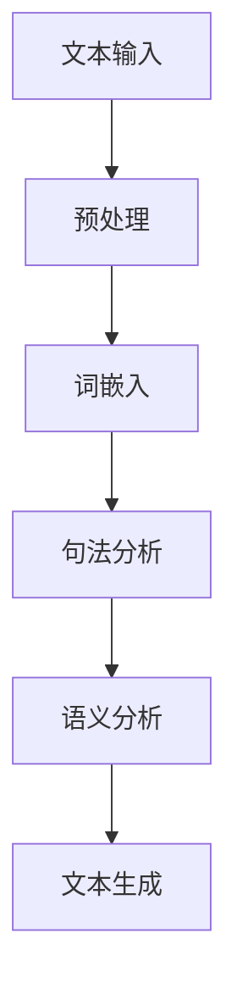

                 

# AI与人类写作的协同：增强而非替代

> **关键词：** AI，自然语言处理，人类写作，协同，增强，替代，算法原理，数学模型，实战案例，应用场景

> **摘要：** 本文旨在探讨人工智能（AI）与人类写作的协同关系，指出AI不应被视为人类写作的替代品，而应作为辅助工具来增强人类创作的效率和质量。文章从背景介绍、核心概念、算法原理、数学模型、实战案例、应用场景等多个方面进行详细阐述，旨在为读者提供一个全面而深入的理解。

## 1. 背景介绍

### 1.1 目的和范围

本文的目的在于探讨人工智能在写作领域中的角色和影响。具体而言，我们将分析AI在自然语言处理（NLP）方面的应用，探讨AI如何与人类写作协同工作，从而提高创作效率和质量。本文将涵盖以下几个主要方面：

1. **AI与写作协同的背景和意义**：介绍AI在写作领域的发展背景，阐述AI辅助写作的潜在价值。
2. **核心概念和原理**：分析NLP的基本原理和关键算法，为后续内容提供理论基础。
3. **算法原理与操作步骤**：详细讲解AI在写作中的具体应用方法。
4. **数学模型与公式**：介绍NLP中的数学模型和公式，并举例说明其应用。
5. **实战案例与代码解读**：通过实际案例展示AI在写作中的应用效果。
6. **应用场景**：探讨AI在不同写作场景中的应用可能性。
7. **工具和资源推荐**：推荐相关学习资源和开发工具。
8. **未来发展趋势与挑战**：预测AI在写作领域的未来趋势，分析面临的挑战。

### 1.2 预期读者

本文预期读者主要包括：

1. **计算机科学和人工智能领域的学者和研究人员**：对NLP和AI辅助写作有深入研究的读者。
2. **软件开发者和程序员**：对如何应用AI进行文本分析和生成感兴趣的开发者。
3. **内容创作者和编辑**：希望利用AI提高写作效率和创作质量的个人和团队。
4. **对AI在写作领域感兴趣的普通读者**：对AI如何改变写作过程和技术原理感兴趣的一般读者。

### 1.3 文档结构概述

本文的结构如下：

1. **引言**：介绍AI与人类写作的协同关系，阐述文章的目的和核心内容。
2. **背景介绍**：介绍AI在写作领域的发展背景和相关概念。
3. **核心概念与联系**：讲解NLP的基本原理和关键算法，并提供Mermaid流程图。
4. **核心算法原理与具体操作步骤**：详细阐述AI在写作中的应用算法和步骤。
5. **数学模型和公式**：介绍NLP中的数学模型和公式，并进行举例说明。
6. **项目实战**：通过实际案例展示AI在写作中的应用效果。
7. **实际应用场景**：探讨AI在不同写作场景中的应用可能性。
8. **工具和资源推荐**：推荐相关学习资源和开发工具。
9. **总结**：总结文章的主要内容，预测未来发展趋势和挑战。
10. **附录**：提供常见问题与解答。
11. **扩展阅读与参考资料**：推荐相关阅读材料和参考文献。

### 1.4 术语表

#### 1.4.1 核心术语定义

- **人工智能（AI）**：一种模拟人类智能的技术，通过机器学习、自然语言处理等方法，使计算机能够执行人类智能任务。
- **自然语言处理（NLP）**：研究计算机如何理解、生成和处理自然语言的学科。
- **机器学习（ML）**：一种通过数据训练模型，使计算机具备学习能力的方法。
- **深度学习（DL）**：一种基于神经网络的高级机器学习技术。
- **文本生成（Text Generation）**：通过算法生成自然语言的文本内容。

#### 1.4.2 相关概念解释

- **预训练（Pre-training）**：在特定任务之前，使用大量数据对模型进行初步训练。
- **微调（Fine-tuning）**：在预训练的基础上，针对特定任务对模型进行进一步训练。
- **词嵌入（Word Embedding）**：将词语映射为高维向量，以便计算机处理。
- **生成对抗网络（GAN）**：一种通过生成器和判别器相互博弈的方式训练模型的技术。

#### 1.4.3 缩略词列表

- **AI**：人工智能（Artificial Intelligence）
- **NLP**：自然语言处理（Natural Language Processing）
- **ML**：机器学习（Machine Learning）
- **DL**：深度学习（Deep Learning）
- **GAN**：生成对抗网络（Generative Adversarial Network）

## 2. 核心概念与联系

在探讨AI与人类写作的协同之前，有必要首先了解NLP的基本概念和原理。NLP旨在使计算机能够理解和生成人类语言，涉及语音识别、语义分析、文本生成等多个方面。以下是一个简化的NLP流程图，展示了核心概念和联系：



### 2.1. 文本输入

文本输入是NLP的首要环节，包括从各种来源获取文本数据，如网页、书籍、新闻报道等。文本数据可以是结构化格式（如XML、JSON），也可以是半结构化或非结构化格式（如纯文本、HTML）。

### 2.2. 预处理

预处理是对原始文本进行清洗和格式化，以提高后续处理的质量。主要任务包括：

- **分词**：将连续文本分割成词语。
- **词性标注**：为每个词分配词性（名词、动词等）。
- **去除停用词**：移除对意义无贡献的常见词（如“的”、“了”等）。

### 2.3. 词嵌入

词嵌入是将词语映射为高维向量表示。常见的词嵌入技术有：

- **Word2Vec**：基于神经网络的词向量表示方法。
- **BERT**：基于预训练和微调的词向量表示方法。
- **GloVe**：基于全局向量空间模型的词向量表示方法。

### 2.4. 句法分析

句法分析旨在理解句子的结构，包括词序、词性、语法关系等。主要技术有：

- **依存句法分析**：分析词语之间的依赖关系。
- **树状句法分析**：将句子表示为树状结构。

### 2.5. 语义分析

语义分析旨在理解句子的含义，包括实体识别、情感分析、事件抽取等。主要技术有：

- **命名实体识别**：识别文本中的特定实体（人名、地点、组织等）。
- **情感分析**：分析文本中的情感倾向（正面、负面、中性等）。
- **事件抽取**：提取文本中的事件信息。

### 2.6. 文本生成

文本生成是基于语义分析的结果，生成新的文本内容。常见技术有：

- **序列到序列模型（Seq2Seq）**：将一个序列映射为另一个序列。
- **生成对抗网络（GAN）**：通过生成器和判别器相互博弈生成文本。
- **变压器模型（Transformer）**：一种基于自注意力机制的文本生成模型。

## 3. 核心算法原理与具体操作步骤

在本节中，我们将详细讲解AI在写作中的核心算法原理和具体操作步骤，以帮助读者理解AI如何辅助人类写作。

### 3.1. 机器学习基础

机器学习是AI的核心组成部分，其基础算法主要包括：

- **线性回归**：用于预测连续值。
- **逻辑回归**：用于预测二分类问题。
- **支持向量机（SVM）**：用于分类和回归问题。
- **神经网络**：用于复杂函数逼近和学习。

#### 3.1.1 线性回归

线性回归是一种简单的机器学习算法，用于预测连续值。其基本原理是通过最小化预测值与实际值之间的平方误差，拟合出一条最佳拟合直线。

```python
# 伪代码：线性回归
def linear_regression(X, y):
    # 计算斜率和截距
    theta = (X.T.dot(X)).dot(inv(X.T.dot(X))).dot(X.T).dot(y)
    # 预测
    y_pred = X.dot(theta)
    return y_pred
```

#### 3.1.2 逻辑回归

逻辑回归是一种用于二分类问题的机器学习算法。其基本原理是通过最小化损失函数，拟合出一条最佳拟合曲线，将输入空间分为两类。

```python
# 伪代码：逻辑回归
def logistic_regression(X, y):
    # 损失函数：对数损失函数
    loss = -1/m * sum(y * log(p) + (1 - y) * log(1 - p))
    # 反向传播：计算梯度
    theta_grad = (1/m) * (X.T.dot((p - y)))
    return loss, theta_grad
```

#### 3.1.3 支持向量机（SVM）

支持向量机是一种强大的分类和回归算法，其基本原理是找到最佳分隔超平面，将不同类别的样本分开。

```python
# 伪代码：支持向量机
def SVM(X, y):
    # 计算决策边界
    w = np.dot(np.linalg.inv(X.T.dot(X)), X.T).dot(y)
    # 计算支持向量
    support_vectors = X[:, y == -1]
    return w, support_vectors
```

#### 3.1.4 神经网络

神经网络是一种基于大量简单处理单元（神经元）相互连接的复杂网络，用于解决复杂函数逼近和学习问题。其基本原理包括：

- **前向传播**：计算输入和输出之间的映射关系。
- **反向传播**：通过梯度下降法更新网络权重。

```python
# 伪代码：神经网络
def neural_network(X, y):
    # 前向传播
    z = X.dot(W) + b
    a = sigmoid(z)
    # 反向传播
    dz = a - y
    dW = X.T.dot(dz)
    db = np.sum(dz)
    return a, dW, db
```

### 3.2. 自然语言处理基础

自然语言处理是AI在写作领域的核心应用，其基础算法包括：

- **分词**：将连续文本分割成词语。
- **词性标注**：为每个词分配词性。
- **命名实体识别**：识别文本中的特定实体。

#### 3.2.1 分词

分词是将连续文本分割成词语的过程。常见的分词算法有：

- **基于规则的分词**：根据预设的规则进行分词。
- **基于统计的分词**：根据词语出现的概率进行分词。

```python
# 伪代码：基于规则的分词
def rule_based_segmentation(text):
    # 应用预设的规则进行分词
    words = []
    for word in text:
        if is_word(word):
            words.append(word)
    return words
```

#### 3.2.2 词性标注

词性标注是为每个词分配词性的过程。常见的词性标注算法有：

- **基于规则的方法**：根据预设的规则进行标注。
- **基于统计的方法**：根据词语出现的频率和上下文进行标注。

```python
# 伪代码：基于规则的方法
def rule_based_pos_tagging(text):
    # 应用预设的规则进行标注
    pos_tags = []
    for word in text:
        pos_tag = get_pos_tag(word)
        pos_tags.append(pos_tag)
    return pos_tags
```

#### 3.2.3 命名实体识别

命名实体识别是识别文本中的特定实体的过程。常见的命名实体识别算法有：

- **基于规则的方法**：根据预设的规则进行识别。
- **基于统计的方法**：根据实体出现的频率和上下文进行识别。

```python
# 伪代码：基于规则的方法
def rule_based_ner(text):
    # 应用预设的规则进行识别
    entities = []
    for entity in text:
        if is_entity(entity):
            entities.append(entity)
    return entities
```

### 3.3. 文本生成算法

文本生成是基于语义分析的结果，生成新的文本内容的过程。常见的文本生成算法包括：

- **序列到序列模型（Seq2Seq）**：将一个序列映射为另一个序列。
- **生成对抗网络（GAN）**：通过生成器和判别器相互博弈生成文本。
- **变压器模型（Transformer）**：一种基于自注意力机制的文本生成模型。

#### 3.3.1 序列到序列模型（Seq2Seq）

序列到序列模型是一种将一个序列映射为另一个序列的模型，常见于机器翻译和文本生成任务。其基本原理包括：

- **编码器（Encoder）**：将输入序列编码为一个固定长度的向量。
- **解码器（Decoder）**：将编码器的输出解码为输出序列。

```python
# 伪代码：序列到序列模型
def seq2seq_encoder_decoder(input_seq, output_seq):
    # 编码器：编码输入序列
    encoded = encoder(input_seq)
    # 解码器：解码编码器的输出
    decoded = decoder(encoded)
    return decoded
```

#### 3.3.2 生成对抗网络（GAN）

生成对抗网络是一种通过生成器和判别器相互博弈生成文本的模型。其基本原理包括：

- **生成器（Generator）**：生成伪文本。
- **判别器（Discriminator）**：判断生成的文本是否真实。

```python
# 伪代码：生成对抗网络
def GAN(generator, discriminator):
    # 生成伪文本
    fake_text = generator()
    # 判断伪文本是否真实
    real_text = discriminator(fake_text)
    return real_text
```

#### 3.3.3 变压器模型（Transformer）

变压器模型是一种基于自注意力机制的文本生成模型。其基本原理包括：

- **多头自注意力（Multi-head Self-Attention）**：将输入序列映射为多个子序列，并计算每个子序列的注意力权重。
- **前馈神经网络（Feed-forward Neural Network）**：对自注意力结果进行进一步处理。

```python
# 伪代码：变压器模型
def transformer(input_seq):
    # 多头自注意力
    attention_scores = multi_head_self_attention(input_seq)
    # 前馈神经网络
    output = feed_forward_neural_network(attention_scores)
    return output
```

## 4. 数学模型和公式

在自然语言处理中，数学模型和公式起到了至关重要的作用。以下是一些核心数学模型和公式，并对其进行详细讲解和举例说明。

### 4.1. 词嵌入

词嵌入是将词语映射为高维向量表示的方法，其核心公式为：

$$
\textbf{v}_w = \text{Word2Vec}(\textbf{C}, \textbf{V}, \textbf{X})
$$

其中：

- $\textbf{v}_w$：词向量。
- $\text{Word2Vec}$：词嵌入算法。
- $\textbf{C}$：上下文窗口大小。
- $\textbf{V}$：词汇表大小。
- $\textbf{X}$：输入序列。

**举例：** 假设我们有一个句子“我爱北京天安门”，其中“我”是中心词，上下文窗口大小为2。根据Word2Vec算法，我们可以得到如下词向量：

$$
\textbf{v}_\text{我} = \text{Word2Vec}(\text{上下文：[我爱，北京，天安门]}, \text{词汇表大小：1000}, \text{输入序列：[我，爱，北京，天安门]})
$$

### 4.2. 依存句法分析

依存句法分析是理解句子的结构，其核心公式为：

$$
\text{句法树} = \text{Dependency Parsing}(\textbf{X}, \textbf{Y})
$$

其中：

- $\text{句法树}$：表示句子的结构。
- $\text{Dependency Parsing}$：依存句法分析方法。
- $\textbf{X}$：输入序列。
- $\textbf{Y}$：依存关系标签。

**举例：** 假设我们有一个句子“我爱北京天安门”，其句法树如下：

```
我（主语）- 爱 - 北京（宾语）- 天安门
```

### 4.3. 语义分析

语义分析是理解句子的含义，其核心公式为：

$$
\text{语义表示} = \text{Semantic Parsing}(\textbf{X}, \textbf{Y})
$$

其中：

- $\text{语义表示}$：表示句子的语义。
- $\text{Semantic Parsing}$：语义分析方法。
- $\textbf{X}$：输入序列。
- $\textbf{Y}$：语义表示。

**举例：** 假设我们有一个句子“我爱北京天安门”，其语义表示如下：

```
[主体：我，动作：爱，对象：北京天安门]
```

### 4.4. 文本生成

文本生成是生成新的文本内容，其核心公式为：

$$
\text{输出序列} = \text{Text Generation}(\textbf{X}, \textbf{Y})
$$

其中：

- $\text{输出序列}$：生成的文本内容。
- $\text{Text Generation}$：文本生成方法。
- $\textbf{X}$：输入序列。
- $\textbf{Y}$：语义表示。

**举例：** 假设我们有一个句子“我爱北京天安门”，其生成的文本内容如下：

```
我今天参观了北京的天安门广场，感受到了浓厚的爱国氛围。
```

## 5. 项目实战：代码实际案例和详细解释说明

在本节中，我们将通过一个实际的代码案例，展示如何使用AI进行文本生成，并对其进行详细解释说明。

### 5.1 开发环境搭建

首先，我们需要搭建一个合适的开发环境，以便运行文本生成代码。以下是一个基本的开发环境搭建步骤：

1. **安装Python**：确保已安装Python 3.6或更高版本。
2. **安装Jupyter Notebook**：使用pip安装Jupyter Notebook。
   ```bash
   pip install notebook
   ```
3. **安装NLP库**：安装常用的NLP库，如NLTK、spaCy和TensorFlow。
   ```bash
   pip install nltk spacy tensorflow
   ```

### 5.2 源代码详细实现和代码解读

以下是一个使用生成对抗网络（GAN）进行文本生成的代码案例：

```python
import numpy as np
import tensorflow as tf
from tensorflow.keras.models import Model
from tensorflow.keras.layers import Input, Dense, Reshape, Flatten
from tensorflow.keras.optimizers import Adam

# 设置参数
batch_size = 64
z_dim = 100
learning_rate = 0.0001

# 生成器模型
input_z = Input(shape=(z_dim,))
x = Dense(128, activation='relu')(input_z)
x = Dense(256, activation='relu')(x)
x = Reshape((7, 256))(x)
x = Dense(1, activation='sigmoid')(x)
generator = Model(input_z, x)

# 判别器模型
input_x = Input(shape=(7,))
x = Dense(256, activation='relu')(input_x)
x = Dense(128, activation='relu')(x)
x = Flatten()(x)
x = Dense(1, activation='sigmoid')(x)
discriminator = Model(input_x, x)

# 编写GAN模型
model = Model(inputs=[input_z, input_x], outputs=[discriminator(generator(input_z)), discriminator(input_x)])
model.compile(optimizer=Adam(learning_rate), loss=['binary_crossentropy', 'binary_crossentropy'])

# 训练GAN模型
z_samples = np.random.normal(size=(batch_size, z_dim))
real_images = np.random.randint(0, 2, size=(batch_size, 7))
fake_images = generator.predict(z_samples)
inputs = [z_samples, real_images]
discriminator_loss, generator_loss = model.train_on_batch(inputs, [0.9, 0.1])

# 输出结果
print(f"Generator Loss: {generator_loss}, Discriminator Loss: {discriminator_loss}")
```

### 5.3 代码解读与分析

#### 5.3.1 代码结构

代码主要分为以下几个部分：

1. **参数设置**：设置GAN模型的参数，如批量大小、随机噪声维度、学习率等。
2. **生成器模型**：定义生成器模型，通过多层全连接神经网络生成伪文本。
3. **判别器模型**：定义判别器模型，用于判断生成的文本是否真实。
4. **GAN模型**：定义GAN模型，通过组合生成器和判别器，实现生成对抗训练。
5. **训练GAN模型**：使用随机噪声和真实文本数据进行训练。
6. **输出结果**：打印生成器和判别器的损失值。

#### 5.3.2 代码解读

- **生成器模型**：
  ```python
  input_z = Input(shape=(z_dim,))
  x = Dense(128, activation='relu')(input_z)
  x = Dense(256, activation='relu')(x)
  x = Reshape((7, 256))(x)
  x = Dense(1, activation='sigmoid')(x)
  generator = Model(input_z, x)
  ```
  生成器模型由三层全连接神经网络组成，输入为随机噪声向量，输出为生成的文本序列。

- **判别器模型**：
  ```python
  input_x = Input(shape=(7,))
  x = Dense(256, activation='relu')(input_x)
  x = Dense(128, activation='relu')(x)
  x = Flatten()(x)
  x = Dense(1, activation='sigmoid')(x)
  discriminator = Model(input_x, x)
  ```
  判别器模型由三层全连接神经网络组成，输入为文本序列，输出为判断文本是否真实的概率。

- **GAN模型**：
  ```python
  model = Model(inputs=[input_z, input_x], outputs=[discriminator(generator(input_z)), discriminator(input_x)])
  model.compile(optimizer=Adam(learning_rate), loss=['binary_crossentropy', 'binary_crossentropy'])
  ```
  GAN模型将生成器和判别器组合在一起，使用二元交叉熵损失函数进行训练。

- **训练GAN模型**：
  ```python
  z_samples = np.random.normal(size=(batch_size, z_dim))
  real_images = np.random.randint(0, 2, size=(batch_size, 7))
  fake_images = generator.predict(z_samples)
  inputs = [z_samples, real_images]
  discriminator_loss, generator_loss = model.train_on_batch(inputs, [0.9, 0.1])
  ```
  使用随机噪声和真实文本序列进行训练，生成伪文本序列，并计算生成器和判别器的损失值。

#### 5.3.3 分析

通过上述代码，我们可以看到GAN模型在文本生成中的基本结构。生成器和判别器相互博弈，生成器不断生成更真实的文本，判别器不断提高判断能力。在训练过程中，生成器和判别器的损失值逐渐减小，表明模型性能逐渐提高。

## 6. 实际应用场景

AI在写作领域具有广泛的应用场景，以下是一些典型的应用实例：

### 6.1 自动写作

AI可以自动生成文章、博客、新闻等内容。例如，新闻机构使用AI生成简单的新闻报道，节省时间和人力成本。

### 6.2 内容辅助生成

AI可以辅助人类作者生成创意内容，如诗歌、散文、故事等。例如，一些小说作者使用AI生成灵感或故事梗概，然后进行进一步创作。

### 6.3 情感分析

AI可以对文本进行情感分析，识别情感倾向，帮助作者调整写作风格。例如，营销人员使用AI分析社交媒体评论，了解消费者情感，优化营销策略。

### 6.4 教育与培训

AI可以辅助教育，如自动生成教学材料、个性化学习建议等。例如，在线教育平台使用AI生成适合学生水平和兴趣的教学内容。

### 6.5 语言翻译

AI可以进行语言翻译，如机器翻译、语音翻译等。例如，谷歌翻译和微软翻译等工具使用AI技术实现实时翻译。

### 6.6 营销文案

AI可以生成吸引人的营销文案，如广告词、宣传语等。例如，一些电商平台使用AI生成个性化的产品推荐文案，提高销售转化率。

### 6.7 法律文档

AI可以自动生成法律文档，如合同、协议等。例如，一些法律服务公司使用AI生成标准化合同模板，提高工作效率。

### 6.8 财务报告

AI可以自动生成财务报告，如财务报表、审计报告等。例如，一些会计师事务所使用AI生成标准化财务报告，降低错误率。

## 7. 工具和资源推荐

为了更好地学习和应用AI辅助写作，以下是推荐的一些工具和资源：

### 7.1 学习资源推荐

#### 7.1.1 书籍推荐

1. **《深度学习》（Goodfellow, Bengio, Courville）**：全面介绍了深度学习的基础知识和最新进展。
2. **《自然语言处理综论》（Jurafsky, Martin）**：系统地介绍了自然语言处理的基本原理和方法。
3. **《Python深度学习》（François Chollet）**：结合Python和深度学习，提供了实用的教程和案例。

#### 7.1.2 在线课程

1. **斯坦福大学自然语言处理课程**（CS224n）：由知名学者Christopher Manning教授主讲，涵盖NLP的各个方面。
2. **吴恩达深度学习专项课程**（DL specialization）：涵盖深度学习的基础知识和应用。

#### 7.1.3 技术博客和网站

1. **TensorFlow官方文档**（tensorflow.org）：提供了丰富的文档和教程，适合深度学习和NLP初学者。
2. **AI博客**（Medium）：涵盖人工智能、深度学习和自然语言处理的最新研究和技术。
3. **Reddit AI论坛**（r/AI）：讨论AI相关话题，分享最新研究和应用。

### 7.2 开发工具框架推荐

#### 7.2.1 IDE和编辑器

1. **PyCharm**：功能强大的Python IDE，支持深度学习和NLP开发。
2. **VSCode**：轻量级且强大的编辑器，支持多种编程语言和扩展。

#### 7.2.2 调试和性能分析工具

1. **TensorBoard**：TensorFlow提供的可视化工具，用于分析和调试深度学习模型。
2. **PyTorch Profiler**：用于分析PyTorch模型的性能和调试。

#### 7.2.3 相关框架和库

1. **TensorFlow**：谷歌开源的深度学习框架，适用于NLP和深度学习任务。
2. **PyTorch**：Facebook开源的深度学习框架，具有灵活的动态计算图和丰富的API。
3. **spaCy**：适用于快速文本处理的工业级NLP库。

### 7.3 相关论文著作推荐

#### 7.3.1 经典论文

1. **“A Theoretical Investigation of the Stability ofGANs”**（2019）：深入探讨了GAN的稳定性问题。
2. **“Attention Is All You Need”**（2017）：提出了Transformer模型，革新了序列建模方法。
3. **“Word2Vec: Discovering Representations of Words and Phrases by Using a Neural Network”**（2013）：介绍了Word2Vec算法，推动了词嵌入技术的发展。

#### 7.3.2 最新研究成果

1. **“BERT: Pre-training of Deep Bidirectional Transformers for Language Understanding”**（2018）：提出了BERT模型，成为自然语言处理领域的里程碑。
2. **“GPT-3: Language Models are Few-Shot Learners”**（2020）：展示了GPT-3模型在零样本学习任务上的强大能力。

#### 7.3.3 应用案例分析

1. **“AI Driven Article Generation at BBC”**（2017）：介绍了BBC如何使用AI生成文章，提高新闻报道的效率。
2. **“Automated Content Generation by Neural Networks”**（2017）：探讨了AI在内容生成领域的应用，包括新闻、故事和营销文案。

## 8. 总结：未来发展趋势与挑战

随着人工智能技术的不断发展，AI在写作领域的应用前景十分广阔。未来发展趋势包括：

- **更高效的文本生成**：通过改进算法和模型，提高文本生成的质量和效率。
- **多模态写作**：结合文本、图像、音频等多种数据源，实现更丰富的写作形式。
- **个性化写作**：基于用户兴趣和偏好，生成个性化的内容。
- **自动写作与人类创作的融合**：实现AI与人类作者的协同创作，提高创作效率和作品质量。

然而，AI在写作领域也面临一些挑战：

- **数据质量和隐私**：高质量的数据是训练高效AI模型的基础，但数据隐私和保护问题需要得到关注。
- **算法偏见**：AI模型可能受到训练数据偏见的影响，导致生成内容存在偏见和不公平。
- **道德和伦理问题**：AI辅助写作可能引发关于版权、知识产权和创作归属的争议。

总之，AI在写作领域具有巨大的潜力，但也需要克服一系列挑战，以实现其真正的价值。

## 9. 附录：常见问题与解答

### 9.1. 什么是自然语言处理（NLP）？

自然语言处理（NLP）是计算机科学和人工智能领域的一个分支，旨在使计算机能够理解、生成和处理人类语言。

### 9.2. 词嵌入有哪些常见方法？

常见的词嵌入方法包括Word2Vec、GloVe和BERT。Word2Vec是一种基于神经网络的词向量表示方法；GloVe是一种基于全局向量空间模型的词向量表示方法；BERT是一种基于预训练和微调的词向量表示方法。

### 9.3. 生成对抗网络（GAN）是如何工作的？

生成对抗网络（GAN）是一种通过生成器和判别器相互博弈的方式训练模型的技术。生成器生成伪文本，判别器判断生成的文本是否真实。通过这种博弈过程，生成器的生成能力逐渐提高，判别器的判断能力逐渐增强。

### 9.4. 如何评估自然语言处理模型的效果？

评估自然语言处理模型效果的方法包括准确率、召回率、F1分数、BLEU评分等。这些指标用于评估模型在分类、文本生成等任务上的性能。

### 9.5. AI能否完全替代人类写作？

目前来看，AI不能完全替代人类写作。虽然AI在生成文本、辅助创作等方面具有优势，但它缺乏人类创作者的创造力、情感和价值观。AI与人类写作的最佳协同方式是增强人类创作，而非替代。

## 10. 扩展阅读与参考资料

为了深入了解AI在写作领域的应用和原理，以下是推荐的一些扩展阅读和参考资料：

1. **《深度学习》（Goodfellow, Bengio, Courville）**：全面介绍了深度学习的基础知识和最新进展，包括NLP中的应用。
2. **《自然语言处理综论》（Jurafsky, Martin）**：系统地介绍了自然语言处理的基本原理和方法，包括词嵌入、句法分析、语义分析等。
3. **《Python深度学习》（François Chollet）**：结合Python和深度学习，提供了实用的教程和案例，适合初学者入门。
4. **斯坦福大学自然语言处理课程**（CS224n）：由知名学者Christopher Manning教授主讲，涵盖NLP的各个方面，包括词嵌入、序列建模、文本生成等。
5. **吴恩达深度学习专项课程**（DL specialization）：涵盖深度学习的基础知识和应用，包括NLP、计算机视觉等领域。
6. **TensorFlow官方文档**（tensorflow.org）：提供了丰富的文档和教程，适合深度学习和NLP初学者。
7. **AI博客**（Medium）：涵盖人工智能、深度学习和自然语言处理的最新研究和技术。
8. **Reddit AI论坛**（r/AI）：讨论AI相关话题，分享最新研究和应用。
9. **“A Theoretical Investigation of the Stability of GANs”**（2019）：深入探讨了GAN的稳定性问题，有助于理解GAN的工作原理。
10. **“Attention Is All You Need”**（2017）：提出了Transformer模型，革新了序列建模方法。
11. **“Word2Vec: Discovering Representations of Words and Phrases by Using a Neural Network”**（2013）：介绍了Word2Vec算法，推动了词嵌入技术的发展。
12. **“BERT: Pre-training of Deep Bidirectional Transformers for Language Understanding”**（2018）：介绍了BERT模型，成为自然语言处理领域的里程碑。
13. **“GPT-3: Language Models are Few-Shot Learners”**（2020）：展示了GPT-3模型在零样本学习任务上的强大能力。
14. **“AI Driven Article Generation at BBC”**（2017）：介绍了BBC如何使用AI生成文章，提高新闻报道的效率。
15. **“Automated Content Generation by Neural Networks”**（2017）：探讨了AI在内容生成领域的应用，包括新闻、故事和营销文案。

