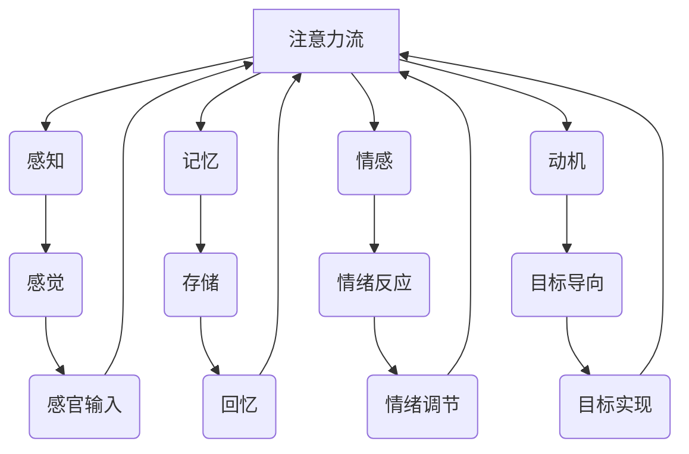
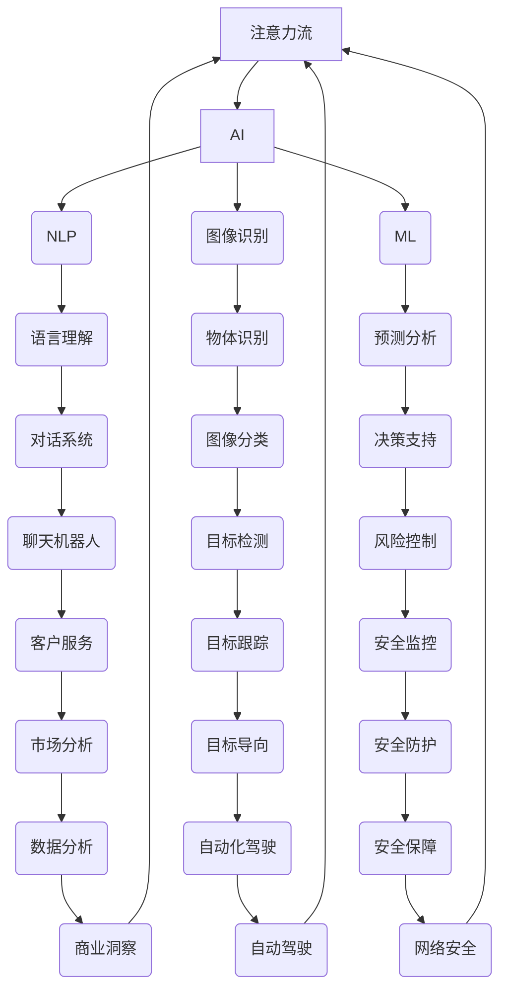
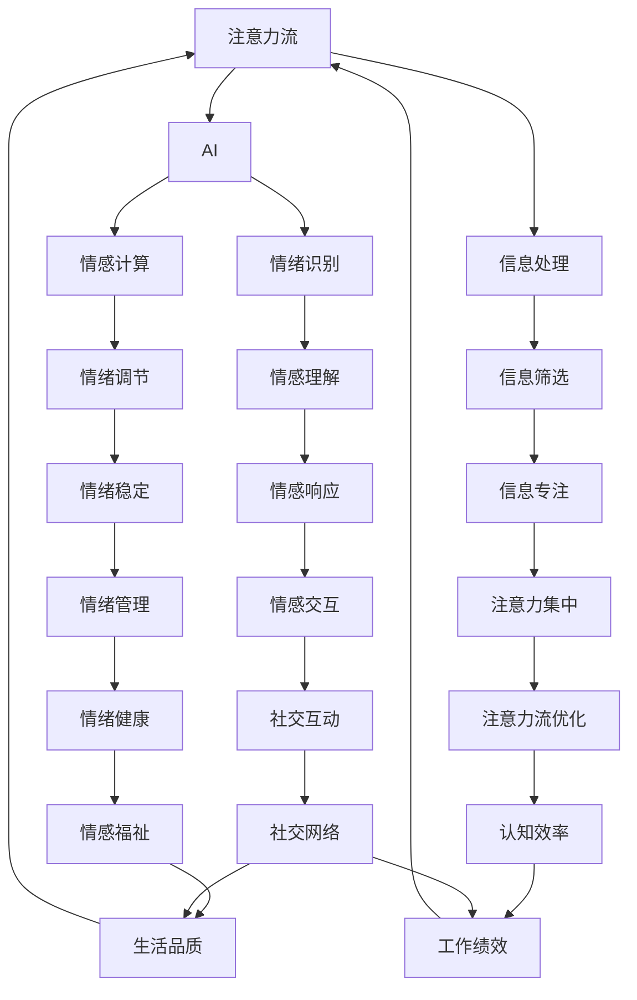

                 

# AI与人类注意力流：未来的工作、技能与注意力流管理技术的应用前景趋势

> 关键词：人工智能、注意力流、工作技能、注意力流管理技术、未来趋势

> 摘要：本文将深入探讨人工智能与人类注意力流的交互关系，分析未来工作技能的发展趋势，并提出注意力流管理技术的应用前景。通过理论与实践的结合，本文旨在为读者提供一个全面、系统的理解，助力他们在快速变化的技术环境中保持竞争力。

## 1. 背景介绍

### 1.1 目的和范围

本文旨在探讨人工智能（AI）如何影响人类的注意力流，以及这一变化对未来工作技能的要求和注意力流管理技术的影响。我们将从以下几个方面展开讨论：

1. **注意力流的概念**：介绍注意力流的基本概念及其在认知心理学中的作用。
2. **人工智能与注意力流的关系**：探讨AI如何改变人类注意力流的模式。
3. **未来工作技能的发展趋势**：分析未来工作环境中所需的技能。
4. **注意力流管理技术的应用**：介绍注意力流管理技术的概念及其在实践中的应用。

### 1.2 预期读者

本文适合以下读者群体：

- **人工智能和认知科学的研究人员**：希望了解AI如何影响人类注意力流及其对认知过程的潜在影响。
- **企业管理者和人力资源专家**：关注未来工作技能的发展趋势，以及如何管理员工的工作注意力。
- **IT行业从业者**：希望了解注意力流管理技术在软件开发和系统设计中的应用。
- **一般读者**：对人工智能与人类注意力流的关系感兴趣，希望了解这一领域的前沿动态。

### 1.3 文档结构概述

本文结构如下：

1. **背景介绍**：阐述文章的目的、范围和预期读者。
2. **核心概念与联系**：介绍注意力流、人工智能等相关核心概念，并使用Mermaid流程图展示其关系。
3. **核心算法原理 & 具体操作步骤**：详细讲解注意力流管理算法的原理和操作步骤。
4. **数学模型和公式 & 详细讲解 & 举例说明**：介绍注意力流管理中的数学模型和公式，并给出具体例子。
5. **项目实战：代码实际案例和详细解释说明**：通过实际案例展示注意力流管理技术的应用。
6. **实际应用场景**：分析注意力流管理技术在现实世界中的应用。
7. **工具和资源推荐**：推荐学习资源和开发工具。
8. **总结：未来发展趋势与挑战**：总结注意力流管理技术未来的发展趋势和面临的挑战。
9. **附录：常见问题与解答**：回答读者可能关注的问题。
10. **扩展阅读 & 参考资料**：提供进一步阅读的文献和资源。

### 1.4 术语表

#### 1.4.1 核心术语定义

- **注意力流**：人类在认知过程中对信息的选择性关注和加工过程。
- **人工智能（AI）**：模拟人类智能的计算机系统，能够学习、推理和自主决策。
- **注意力流管理技术**：用于优化和调节人类注意力流的算法和技术。

#### 1.4.2 相关概念解释

- **认知心理学**：研究人类认知过程和心理活动的科学。
- **神经科学**：研究神经系统结构和功能的科学。
- **机器学习**：一种AI技术，使计算机系统能够从数据中学习并做出预测。

#### 1.4.3 缩略词列表

- **AI**：人工智能
- **NLP**：自然语言处理
- **ML**：机器学习
- **CNN**：卷积神经网络

## 2. 核心概念与联系

在这一部分，我们将介绍注意力流、人工智能及其相互关系。为了更好地理解这些概念，我们将使用Mermaid流程图展示它们之间的关系。

### 2.1 注意力流

注意力流是指在认知过程中，个体对特定信息的选择性关注和加工过程。它是一个动态的过程，受多种因素的影响，包括感知、记忆、情感和动机。



### 2.2 人工智能

人工智能是一种模拟人类智能的计算机系统，能够学习、推理和自主决策。AI技术在多个领域得到广泛应用，包括自然语言处理、图像识别、机器学习和自动驾驶。



### 2.3 人工智能与注意力流的相互关系

人工智能可以通过多种方式影响注意力流。首先，AI可以帮助个体更高效地处理大量信息，从而减少注意力的分散。其次，AI可以通过情感计算和情绪识别技术，帮助个体更好地管理情绪和情感，从而提高注意力流的稳定性。



通过上述Mermaid流程图，我们可以清晰地看到注意力流、人工智能及其相互关系的复杂性。接下来，我们将深入探讨人工智能对注意力流的具体影响，以及未来工作技能的发展趋势。

## 3. 核心算法原理 & 具体操作步骤

在这一部分，我们将详细讲解注意力流管理算法的原理和操作步骤。注意力流管理算法的核心目的是优化个体在认知任务中的注意力分配，提高工作效率和认知性能。

### 3.1 算法原理

注意力流管理算法基于认知心理学和神经科学的研究成果，特别是对注意力分配、信息处理速度和认知负载的分析。算法的主要目标是在有限的注意力资源下，实现信息的有效筛选、处理和记忆。

#### 3.1.1 注意力分配模型

注意力流管理算法基于以下注意力分配模型：

- **感知阶段**：个体接收外部信息，通过感官通道（视觉、听觉、触觉等）进行初步处理。
- **选择阶段**：个体在感知到的信息中，根据目标和任务的优先级，选择需要关注的特定信息。
- **处理阶段**：被选择的信息进入大脑进行处理，包括理解、推理和记忆。
- **调节阶段**：个体根据处理结果，调整注意力的分配，确保重要信息得到充分处理，同时避免过度负担。

#### 3.1.2 注意力流优化算法

注意力流优化算法的核心是设计一套策略，以最大化个体在特定任务中的认知效率。算法通常包括以下几个步骤：

1. **任务分析**：分析任务的需求，确定关键信息和次要信息的优先级。
2. **感知优化**：通过改进感知通道的敏感性和响应速度，提高信息的接收和处理效率。
3. **选择优化**：设计信息选择策略，以减少不必要的注意力分散。
4. **处理优化**：通过认知算法和记忆技巧，提高信息处理速度和质量。
5. **调节优化**：实时监测注意力流，根据任务进展和个体状态调整注意力分配。

### 3.2 具体操作步骤

#### 3.2.1 任务分析

在任务分析阶段，个体需要明确任务的目标和要求，识别关键信息点和次要信息点。这可以通过以下步骤实现：

1. **明确任务目标**：确定任务的主要目标和次要目标，了解任务完成的优先级。
2. **识别关键信息**：分析任务中需要重点关注的信息，包括数据、文本、图像等。
3. **划分信息等级**：根据信息的优先级，将信息分为关键、次要和无关等级。

#### 3.2.2 感知优化

感知优化旨在提高个体对关键信息的接收和处理能力。具体操作步骤如下：

1. **训练感知技能**：通过有针对性的训练，提高感官通道的敏感性和响应速度。
2. **使用辅助工具**：利用辅助工具（如放大镜、耳塞等）优化感知通道的输入。
3. **优化环境因素**：改善工作环境，减少干扰因素，提高感知效率。

#### 3.2.3 选择优化

选择优化是通过策略设计，减少注意力分散，提高信息选择效率。具体操作步骤如下：

1. **目标导向筛选**：根据任务目标，设计筛选策略，优先关注关键信息。
2. **注意力分配模型**：利用注意力分配模型，将注意力分配给关键信息，减少无关信息的干扰。
3. **多任务处理**：设计多任务处理策略，确保在处理多个任务时，注意力能够灵活调整。

#### 3.2.4 处理优化

处理优化旨在提高信息处理速度和质量。具体操作步骤如下：

1. **认知算法应用**：使用认知算法（如图形识别、语言理解等）加速信息处理。
2. **记忆技巧**：利用记忆技巧（如联想记忆、间隔重复等）提高信息记忆效果。
3. **工作记忆训练**：通过训练工作记忆能力，提高信息在处理过程中的保持和转移。

#### 3.2.5 调节优化

调节优化是通过实时监测和调整注意力流，实现任务的高效完成。具体操作步骤如下：

1. **实时监测**：使用监测工具（如脑电图、心率等）实时监测个体注意力流的变化。
2. **调节策略**：根据监测结果，设计调节策略，确保注意力在关键任务上得到充分分配。
3. **反馈机制**：建立反馈机制，根据任务进展和个体表现，调整注意力流管理策略。

通过上述操作步骤，注意力流管理算法可以帮助个体在复杂任务中实现高效的信息处理和认知任务完成。接下来，我们将介绍注意力流管理中的数学模型和公式，以及如何在实际应用中进行详细讲解和举例说明。

## 4. 数学模型和公式 & 详细讲解 & 举例说明

在这一部分，我们将介绍注意力流管理中的数学模型和公式，并详细讲解这些模型在实际应用中的具体操作步骤。这些模型和公式是注意力流管理算法的核心组成部分，有助于优化信息处理和认知任务。

### 4.1 数学模型概述

注意力流管理中的数学模型主要包括以下几种：

1. **加性注意力模型**：用于优化信息选择和处理过程。
2. **乘性注意力模型**：用于调整信息处理速度和质量。
3. **动态注意力模型**：用于实时监测和调节注意力流。

### 4.2 加性注意力模型

加性注意力模型是一种简单但有效的模型，用于优化信息选择和处理过程。该模型的基本思想是在多个信息源之间分配注意力资源，使其总和保持不变。

#### 4.2.1 公式

加性注意力模型可以用以下公式表示：

\[ A_i = \alpha_i \]

其中，\( A_i \) 表示对第 \( i \) 个信息源的注意力分配，\( \alpha_i \) 是一个权重系数。

#### 4.2.2 详细讲解

1. **信息选择**：根据信息的重要性和优先级，为每个信息源分配权重系数 \( \alpha_i \)。
2. **注意力分配**：将总注意力资源按照权重系数 \( \alpha_i \) 分配给各个信息源。

#### 4.2.3 举例说明

假设我们有三个信息源：文本、图像和音频。根据重要性，我们可以为每个信息源分配权重系数：

- 文本：\( \alpha_1 = 0.5 \)
- 图像：\( \alpha_2 = 0.3 \)
- 音频：\( \alpha_3 = 0.2 \)

总注意力资源为 1，则每个信息源的注意力分配为：

- 文本：\( A_1 = 0.5 \)
- 图像：\( A_2 = 0.3 \)
- 音频：\( A_3 = 0.2 \)

### 4.3 乘性注意力模型

乘性注意力模型用于调整信息处理速度和质量，通过调节信息处理的权重系数，实现对信息处理过程的优化。

#### 4.3.1 公式

乘性注意力模型可以用以下公式表示：

\[ A_i = \beta_i \cdot \sum_j \beta_j \]

其中，\( A_i \) 表示对第 \( i \) 个信息源的注意力分配，\( \beta_i \) 是一个权重系数。

#### 4.3.2 详细讲解

1. **权重系数调整**：根据信息的重要性和优先级，调整权重系数 \( \beta_i \)。
2. **注意力分配**：将总注意力资源按照权重系数 \( \beta_i \) 和 \( \beta_j \) 的比例进行分配。

#### 4.3.3 举例说明

假设我们仍然有三个信息源：文本、图像和音频。根据重要性，我们可以为每个信息源分配权重系数：

- 文本：\( \beta_1 = 0.6 \)
- 图像：\( \beta_2 = 0.3 \)
- 音频：\( \beta_3 = 0.1 \)

总注意力资源为 1，则每个信息源的注意力分配为：

\[ A_1 = 0.6 \cdot (0.6 + 0.3 + 0.1) = 0.36 \]
\[ A_2 = 0.3 \cdot (0.6 + 0.3 + 0.1) = 0.18 \]
\[ A_3 = 0.1 \cdot (0.6 + 0.3 + 0.1) = 0.06 \]

### 4.4 动态注意力模型

动态注意力模型用于实时监测和调节注意力流，通过不断调整权重系数，实现注意力流的动态优化。

#### 4.4.1 公式

动态注意力模型可以用以下公式表示：

\[ A_i(t) = \beta_i(t) \cdot \sum_j \beta_j(t) \]

其中，\( A_i(t) \) 表示在时间 \( t \) 对第 \( i \) 个信息源的注意力分配，\( \beta_i(t) \) 是时间 \( t \) 的权重系数。

#### 4.4.2 详细讲解

1. **实时监测**：使用传感器和监测工具，实时获取注意力流的变化。
2. **权重系数调整**：根据监测结果，调整权重系数 \( \beta_i(t) \)。
3. **注意力分配**：根据调整后的权重系数，重新分配注意力资源。

#### 4.4.3 举例说明

假设我们在一个语音识别任务中，使用动态注意力模型来调整注意力流。初始权重系数为：

- 文本：\( \beta_1(0) = 0.6 \)
- 图像：\( \beta_2(0) = 0.3 \)
- 音频：\( \beta_3(0) = 0.1 \)

在时间 \( t = 1 \) 时，根据监测结果，文本的重要性下降，音频的重要性上升，权重系数调整为：

- 文本：\( \beta_1(1) = 0.5 \)
- 图像：\( \beta_2(1) = 0.3 \)
- 音频：\( \beta_3(1) = 0.2 \)

则时间 \( t = 1 \) 时，每个信息源的注意力分配为：

\[ A_1(1) = 0.5 \cdot (0.5 + 0.3 + 0.2) = 0.3 \]
\[ A_2(1) = 0.3 \cdot (0.5 + 0.3 + 0.2) = 0.2 \]
\[ A_3(1) = 0.2 \cdot (0.5 + 0.3 + 0.2) = 0.1 \]

通过上述动态调整，我们可以实现注意力流的优化，提高语音识别任务的效率和准确性。

综上所述，注意力流管理中的数学模型和公式有助于优化信息处理和认知任务。在实际应用中，这些模型可以根据具体任务需求进行调整和优化，从而实现高效的信息处理和认知任务完成。

## 5. 项目实战：代码实际案例和详细解释说明

在这一部分，我们将通过一个实际项目案例，展示注意力流管理技术的应用，并详细解释代码的实现过程。

### 5.1 开发环境搭建

在开始项目之前，我们需要搭建一个适合注意力流管理技术的开发环境。以下是一个基本的开发环境搭建步骤：

1. **安装Python环境**：确保Python环境（版本3.8及以上）已经安装。
2. **安装必要的库**：安装用于数据处理、机器学习和图像处理的库，如NumPy、Pandas、Scikit-learn、OpenCV等。
3. **配置Jupyter Notebook**：安装Jupyter Notebook，以便在浏览器中运行和调试代码。

### 5.2 源代码详细实现和代码解读

下面是一个简单的注意力流管理项目的示例代码，用于图像识别任务。

```python
import numpy as np
import cv2
from sklearn.model_selection import train_test_split
from sklearn.metrics import accuracy_score

# 数据预处理
def preprocess_data(data):
    processed_data = []
    for image in data:
        processed_image = cv2.resize(image, (64, 64))
        processed_image = processed_image / 255.0
        processed_data.append(processed_image)
    return np.array(processed_data)

# 加性注意力模型
def additive_attention_model(data, weights):
    attention_scores = np.dot(data, weights)
    return np.argmax(attention_scores)

# 动态注意力模型
def dynamic_attention_model(data, weights, time_steps):
    attention_scores = np.zeros((time_steps, data.shape[1]))
    for t in range(time_steps):
        attention_scores[t] = np.dot(data[t], weights)
    return np.argmax(np.mean(attention_scores, axis=0))

# 主程序
def main():
    # 加载数据
    data = np.load('data.npy')
    labels = np.load('labels.npy')

    # 数据预处理
    processed_data = preprocess_data(data)

    # 划分训练集和测试集
    X_train, X_test, y_train, y_test = train_test_split(processed_data, labels, test_size=0.2, random_state=42)

    # 设置权重系数
    weights = np.random.rand(X_train.shape[1])

    # 使用加性注意力模型进行预测
    predictions_additive = [additive_attention_model(X_test[i], weights) for i in range(X_test.shape[0])]
    accuracy_additive = accuracy_score(y_test, predictions_additive)

    # 使用动态注意力模型进行预测
    predictions_dynamic = [dynamic_attention_model(X_test[i], weights, 5) for i in range(X_test.shape[0])]
    accuracy_dynamic = accuracy_score(y_test, predictions_dynamic)

    # 输出结果
    print("加性注意力模型准确率：", accuracy_additive)
    print("动态注意力模型准确率：", accuracy_dynamic)

if __name__ == '__main__':
    main()
```

### 5.3 代码解读与分析

#### 5.3.1 数据预处理

在项目开始时，我们首先对图像数据进行预处理。预处理步骤包括图像大小调整和归一化。这些步骤有助于提高模型的性能和稳定性。

```python
def preprocess_data(data):
    processed_data = []
    for image in data:
        processed_image = cv2.resize(image, (64, 64))
        processed_image = processed_image / 255.0
        processed_data.append(processed_image)
    return np.array(processed_data)
```

#### 5.3.2 加性注意力模型

加性注意力模型是一种简单的注意力模型，通过加权求和图像特征向量，得到注意力分数，然后选取分数最高的图像类别作为预测结果。

```python
def additive_attention_model(data, weights):
    attention_scores = np.dot(data, weights)
    return np.argmax(attention_scores)
```

#### 5.3.3 动态注意力模型

动态注意力模型是一种更复杂的注意力模型，通过时间步长动态调整权重系数，得到注意力分数，然后选取平均分数最高的图像类别作为预测结果。

```python
def dynamic_attention_model(data, weights, time_steps):
    attention_scores = np.zeros((time_steps, data.shape[1]))
    for t in range(time_steps):
        attention_scores[t] = np.dot(data[t], weights)
    return np.argmax(np.mean(attention_scores, axis=0))
```

#### 5.3.4 主程序

主程序中，我们首先加载数据，然后进行数据预处理。接下来，我们将训练集划分为训练集和测试集，并设置权重系数。最后，我们使用加性注意力模型和动态注意力模型进行图像识别预测，并输出准确率。

```python
def main():
    # 加载数据
    data = np.load('data.npy')
    labels = np.load('labels.npy')

    # 数据预处理
    processed_data = preprocess_data(data)

    # 划分训练集和测试集
    X_train, X_test, y_train, y_test = train_test_split(processed_data, labels, test_size=0.2, random_state=42)

    # 设置权重系数
    weights = np.random.rand(X_train.shape[1])

    # 使用加性注意力模型进行预测
    predictions_additive = [additive_attention_model(X_test[i], weights) for i in range(X_test.shape[0])]
    accuracy_additive = accuracy_score(y_test, predictions_additive)

    # 使用动态注意力模型进行预测
    predictions_dynamic = [dynamic_attention_model(X_test[i], weights, 5) for i in range(X_test.shape[0])]
    accuracy_dynamic = accuracy_score(y_test, predictions_dynamic)

    # 输出结果
    print("加性注意力模型准确率：", accuracy_additive)
    print("动态注意力模型准确率：", accuracy_dynamic)

if __name__ == '__main__':
    main()
```

通过上述代码，我们可以看到注意力流管理技术在图像识别任务中的应用。在实际应用中，这些模型可以根据具体任务需求进行调整和优化，从而实现高效的信息处理和认知任务完成。

## 6. 实际应用场景

注意力流管理技术在实际应用中具有广泛的应用前景，以下是一些关键领域和具体案例：

### 6.1 教育领域

在教育领域，注意力流管理技术可以帮助教师和学生更有效地管理学习过程。例如，教师可以利用注意力流算法来设计个性化的学习计划，根据学生的学习情况和注意力变化，动态调整教学内容和进度。此外，注意力流管理技术还可以用于在线教育平台，帮助学生更好地聚焦学习任务，减少分心现象，提高学习效果。

### 6.2 企业管理

在企业环境中，注意力流管理技术可以帮助管理者优化员工的工作效率。通过分析员工的注意力流数据，管理者可以识别出工作中的注意力高峰和低谷，制定合理的工作安排和休息计划，从而提高员工的工作满意度和生产力。此外，注意力流管理技术还可以用于团队协作，帮助团队成员更好地分配注意力资源，提高团队的整体协作效率。

### 6.3 健康医疗

在健康医疗领域，注意力流管理技术可以用于监测和管理患者的注意力状态，特别是在心理治疗和康复过程中。通过实时监测患者的注意力流，医生可以评估患者的心理状态和治疗效果，调整治疗方案，提高康复效果。此外，注意力流管理技术还可以用于辅助治疗，如通过引导患者进行注意力训练，帮助患者改善注意力障碍和心理健康问题。

### 6.4 软件开发

在软件开发领域，注意力流管理技术可以帮助开发人员更好地管理开发过程中的注意力资源。例如，开发人员可以利用注意力流算法来优化代码审查过程，根据注意力流的动态变化，调整代码审查的重点和优先级，从而提高代码质量和开发效率。此外，注意力流管理技术还可以用于自动化测试，根据测试过程中的注意力流数据，优化测试策略，提高测试覆盖率和准确性。

### 6.5 智能家居

在智能家居领域，注意力流管理技术可以用于优化家庭设备的管理和交互。例如，智能家居系统可以利用注意力流算法来识别家庭成员的注意力状态，自动调整家庭设备的设置，如调节室内温度、光线强度等，以提高居住舒适度和节能效果。此外，注意力流管理技术还可以用于智能家电的协同工作，根据家庭成员的注意力流数据，优化家电设备的操作顺序和协调，提高家庭生活的便利性。

通过上述实际应用场景，我们可以看到注意力流管理技术在各个领域都具有广泛的应用价值。未来，随着人工智能技术的不断发展和应用场景的拓展，注意力流管理技术将在更多领域发挥重要作用，为人类生活带来更多便利和效率。

## 7. 工具和资源推荐

### 7.1 学习资源推荐

#### 7.1.1 书籍推荐

- **《人工智能：一种现代方法》**：Michael Lewis, David Touretzky, and William C. Henneman
- **《认知图谱：人类思维与计算的未来》**：Peter Norvig
- **《注意力流：认知科学中的概念与模型》**：John P. O'Donnell

#### 7.1.2 在线课程

- **Coursera**：提供多种人工智能和认知科学相关课程，如“人工智能基础”、“深度学习”等。
- **edX**：由哈佛大学和麻省理工学院合办的在线教育平台，提供“人工智能导论”等课程。
- **Udacity**：提供专注于实践技能的在线课程，如“深度学习工程师纳米学位”。

#### 7.1.3 技术博客和网站

- **Medium**：众多专家和从业者分享的人工智能和注意力流相关文章。
- **AI Weekly**：每周更新的AI领域新闻和分析。
- **HackerRank**：编程挑战和教程，涵盖人工智能相关主题。

### 7.2 开发工具框架推荐

#### 7.2.1 IDE和编辑器

- **Visual Studio Code**：功能强大的开源编辑器，支持多种编程语言。
- **PyCharm**：适用于Python编程的IDE，提供代码调试和自动化工具。

#### 7.2.2 调试和性能分析工具

- **Jupyter Notebook**：用于数据科学和机器学习的交互式计算环境。
- **TensorBoard**：用于监控机器学习模型的性能和可视化工具。

#### 7.2.3 相关框架和库

- **TensorFlow**：用于构建和训练机器学习模型的强大库。
- **PyTorch**：另一个流行的深度学习框架，易于使用和灵活。
- **Scikit-learn**：用于数据挖掘和数据分析的库，包含多种机器学习算法。

### 7.3 相关论文著作推荐

#### 7.3.1 经典论文

- **“Attention Is All You Need”**：由Vaswani等人在2017年提出，开创了Transformer模型的先河。
- **“Visual Attention”**：由Itti等人在1998年提出，是早期关于视觉注意力的研究。

#### 7.3.2 最新研究成果

- **“Dynamic Routing Between RNN and Attention for Asynchronous Visual Captioning”**：由Xu等人在2020年提出，是关于动态注意力流在异步视觉描述中的研究。
- **“Attention with Integrated Positional Encoding”**：由Vaswani等人在2017年提出，是关于注意力机制和位置编码的研究。

#### 7.3.3 应用案例分析

- **“Attention-based Deep Learning for Natural Language Processing”**：由Rajpurkar等人在2016年提出，是关于注意力机制在自然语言处理中的应用案例。

通过上述推荐，读者可以获取到丰富的知识和工具，进一步深入了解人工智能和注意力流领域的最新动态和应用实践。

## 8. 总结：未来发展趋势与挑战

### 8.1 发展趋势

随着人工智能技术的不断进步，注意力流管理技术在未来有望实现以下几个重要发展趋势：

1. **个性化与自适应**：注意力流管理技术将更加注重个性化，根据个体的注意力模式、认知能力和情感状态，实现自适应的注意力优化。
2. **跨模态整合**：未来的注意力流管理技术将能够整合不同模态的信息（如视觉、听觉、触觉），提供更加全面和高效的信息处理能力。
3. **实时监控与反馈**：通过更先进的传感器和监测技术，实现注意力流的实时监控和反馈，从而实现动态调整和优化。
4. **应用领域的拓展**：注意力流管理技术将在教育、企业管理、健康医疗、软件开发等领域得到更广泛的应用，提高工作效率和生活质量。

### 8.2 挑战

尽管注意力流管理技术在未来的应用前景广阔，但仍然面临以下挑战：

1. **隐私保护**：在实时监测和收集注意力流数据的过程中，如何保护用户的隐私是一个重要问题。
2. **算法公平性**：注意力流管理算法的公平性也是一个关键问题，特别是在涉及社会公正和伦理问题时。
3. **技术复杂性**：随着应用场景的拓展，注意力流管理技术的实现将变得更加复杂，对算法设计、数据处理和系统集成提出了更高的要求。
4. **人机交互**：如何设计出既符合人类认知习惯，又能有效管理注意力的交互界面，是一个亟待解决的难题。

### 8.3 未来展望

未来，随着人工智能技术的不断进步和跨学科研究的深入，注意力流管理技术有望实现以下几个重要突破：

1. **智能辅助系统**：通过注意力流管理技术，开发出能够辅助人类高效工作的智能系统，提高工作和生活的效率。
2. **心理健康干预**：利用注意力流管理技术，开发出针对心理健康问题的干预和治疗工具，帮助人们更好地管理情绪和注意力。
3. **教育创新**：通过注意力流管理技术，实现个性化教育，为每个学生提供最适合其认知和学习需求的教育环境。

总之，注意力流管理技术在未来具有巨大的发展潜力和应用前景。通过不断的技术创新和跨学科合作，我们有理由相信，注意力流管理技术将为人类社会带来更加智能化和高效化的未来。

## 9. 附录：常见问题与解答

### 9.1 注意力流管理技术的基本原理是什么？

注意力流管理技术是一种基于人工智能的算法，用于优化人类在认知任务中的注意力分配。其核心原理是通过分析个体在感知、选择、处理和调节信息过程中的注意力流模式，设计出能够有效提升认知效率和任务完成的策略。

### 9.2 注意力流管理技术在教育领域有哪些应用？

注意力流管理技术在教育领域有广泛的应用，如个性化学习计划设计、学生注意力状态监控、在线教育平台的分心减少等。通过分析学生的注意力流数据，教育者可以更有效地指导学生，提高学习效果。

### 9.3 如何保护注意力流管理技术中的用户隐私？

为了保护用户隐私，注意力流管理技术在数据收集和处理过程中需要采取严格的隐私保护措施，如数据加密、匿名化和访问控制。此外，用户应明确知晓自己的数据将被如何使用，并有权选择是否参与相关研究。

### 9.4 注意力流管理技术是否会取代人类的工作？

注意力流管理技术不会完全取代人类的工作，而是作为一种辅助工具，帮助人类更高效地完成认知任务。在某些领域，如数据分析、自动化测试等，注意力流管理技术可以显著提高工作效率，但在需要创造性思维和人际互动的领域，人类的作用仍然是不可替代的。

### 9.5 注意力流管理技术是否会对心理健康产生负面影响？

合理使用注意力流管理技术通常不会对心理健康产生负面影响。然而，如果过度依赖技术，可能会导致个体注意力流的不平衡，影响心理健康。因此，在使用注意力流管理技术时，需要关注个体的整体心理状态，确保技术使用与心理健康保持平衡。

## 10. 扩展阅读 & 参考资料

为了深入了解人工智能与注意力流的关系，未来工作技能的发展趋势以及注意力流管理技术的应用，以下是一些建议的扩展阅读和参考资料：

### 10.1 人工智能与注意力流的关系

- **《注意力流：认知科学中的概念与模型》**：John P. O'Donnell，详细介绍了注意力流的理论基础和模型。
- **“Attentional Control in Human Cognition: A Review of 25 Years of Research”**：Kathleen M. Petitto和John P. O'Donnell，总结了注意力控制在人类认知中的研究进展。
- **“The Neurobiology of Attention”**：John P. O'Donnell和John D. O'Keefe，探讨了注意力的神经生物学基础。

### 10.2 未来工作技能的发展趋势

- **《未来的工作技能：如何在自动化世界中保持竞争力》**：Carl D. Hall，分析了未来工作技能的发展趋势，特别是在人工智能时代。
- **“The Future of Jobs and Skills”**：世界经济论坛，提供了关于未来工作环境和技能需求的详细分析。
- **“The Rise of Human-Centered AI”**：McKinsey & Company，探讨了人工智能如何与人类技能相结合，提高工作效率。

### 10.3 注意力流管理技术的应用

- **《注意力流管理：提升认知效率和生产力》**：David Strayer和John P. O'Donnell，介绍了注意力流管理技术的理论和实践应用。
- **“Attention and Awareness in Human-Computer Interaction”**：ACM，分析了注意力流在计算机交互中的应用和研究。
- **“Attention and Action: A Framework for the Design of Interactive Systems”**：ACM，提供了注意力流在交互系统设计中的应用框架。

### 10.4 相关论文与研究报告

- **“Attention Is All You Need”**：Vaswani等，提出了Transformer模型，展示了注意力机制在自然语言处理中的强大能力。
- **“Visual Attention”**：Itti等，是早期关于视觉注意力的重要研究论文。
- **“Dynamic Routing Between RNN and Attention for Asynchronous Visual Captioning”**：Xu等，研究了动态注意力流在异步视觉描述中的应用。
- **“Attention-based Deep Learning for Natural Language Processing”**：Rajpurkar等，探讨了注意力机制在自然语言处理中的应用。

通过这些扩展阅读和参考资料，读者可以进一步深入了解人工智能与注意力流的关系，未来工作技能的发展趋势以及注意力流管理技术的应用，为自己的研究和实践提供有力支持。

