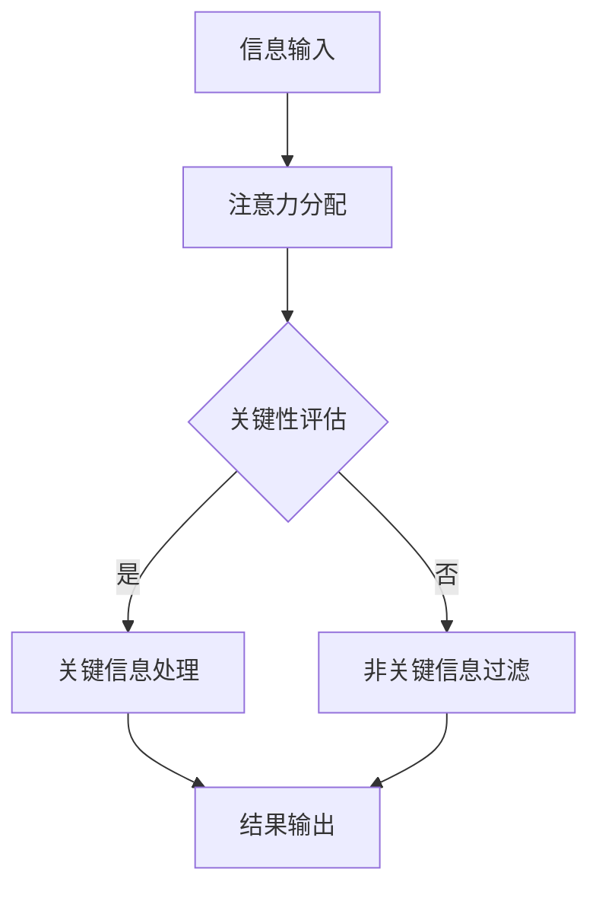

                 

# AI与人类注意力流：未来的工作、技能与注意力流管理技术的未来趋势

## 关键词

- 人工智能（AI）
- 注意力流（Attention Flow）
- 人类工作技能
- 注意力流管理技术
- 未来发展趋势

## 摘要

本文深入探讨了人工智能与人类注意力流的关联，以及这一关系对未来工作技能和注意力流管理技术的影响。文章首先介绍了注意力流的背景和核心概念，随后通过Mermaid流程图展示了注意力流在人工智能中的实现原理。接着，文章详细解析了核心算法原理和操作步骤，并引入数学模型和公式进行详细讲解。此外，文章通过实际项目案例展示了代码实现过程，分析了应用场景，并推荐了相关学习资源和开发工具。最后，文章总结了未来发展趋势和挑战，为读者提供了扩展阅读和参考资料。

## 1. 背景介绍

### 注意力流的概念

注意力流（Attention Flow）是指信息处理过程中，个体或系统在接收和处理信息时，其注意力资源在不同信息之间的动态分配过程。在计算机科学和人工智能领域，注意力流被广泛应用于图像识别、自然语言处理、机器翻译等领域，以提升模型对关键信息的捕捉和响应能力。

### 人类注意力流

人类注意力流是心理学和认知科学研究的核心话题。人类注意力流主要涉及注意力的选择、分配和转换。具体来说，注意力流可以表现为以下几个方面：

- 选择性注意力：在众多信息中，人类会选择对其当前任务最有价值的信息进行关注。
- 分配性注意力：在同时处理多个任务时，人类需要将注意力在不同任务间分配。
- 转换性注意力：在任务切换时，人类需要将注意力从当前任务转移到新任务上。

### 人工智能与人类注意力流的关系

随着人工智能技术的不断发展，人工智能在模仿和增强人类注意力流方面取得了显著进展。一方面，人工智能通过注意力机制，能够自动识别和关注关键信息，从而提升任务处理效率。另一方面，人工智能技术的应用，也改变了人类的工作方式和技能需求，促使人类在工作过程中更加注重注意力流的管理。

## 2. 核心概念与联系

### 注意力流管理技术

注意力流管理技术是指通过技术手段，对人类注意力流进行监测、分析和优化的方法。这些技术包括注意力监测技术、注意力优化算法、注意力转移策略等。注意力流管理技术的核心目标是提升个体或系统的注意力效率，从而提高工作和生活质量。

### Mermaid流程图

下面是注意力流在人工智能中的实现原理的Mermaid流程图：



### 核心概念原理

- 注意力分配：根据任务需求，将注意力资源分配到不同的信息处理模块。
- 关键性评估：对输入的信息进行评估，判断其是否具有关键性。
- 关键信息处理：对具有关键性的信息进行深度处理，以提取关键特征。
- 非关键信息过滤：对不具有关键性的信息进行过滤，以减少处理负担。
- 结果输出：将处理结果输出给用户或系统。

## 3. 核心算法原理 & 具体操作步骤

### 注意力流算法原理

注意力流算法是基于神经网络的一种模型，主要用于捕捉和处理关键信息。该算法的核心思想是，通过学习输入数据的特征，自动调整注意力的分配，从而实现高效的信息处理。

### 具体操作步骤

1. **数据预处理**：对输入的数据进行清洗和预处理，以消除噪声和异常值。

2. **特征提取**：利用特征提取算法，将输入数据转换为特征向量。

3. **注意力分配**：根据任务需求和特征向量，将注意力资源分配到不同的信息处理模块。

4. **关键性评估**：对每个信息处理模块的输出结果进行评估，判断其是否具有关键性。

5. **关键信息处理**：对具有关键性的信息进行深度处理，以提取关键特征。

6. **非关键信息过滤**：对不具有关键性的信息进行过滤，以减少处理负担。

7. **结果输出**：将处理结果输出给用户或系统。

## 4. 数学模型和公式 & 详细讲解 & 举例说明

### 数学模型

注意力流算法通常采用一种称为“注意力机制”的数学模型。该模型的核心公式为：

\[ a_{ij} = \frac{e^{z_{ij}}}{\sum_{k=1}^{K} e^{z_{ik}}} \]

其中，\( a_{ij} \)表示第 \( i \) 个信息处理模块对第 \( j \) 个输入数据的注意力权重，\( z_{ij} \)表示第 \( i \) 个信息处理模块与第 \( j \) 个输入数据之间的相似度得分，\( e \)为自然对数的底数。

### 详细讲解

1. **注意力权重**：注意力权重表示信息处理模块对输入数据的关注程度。权重越高，表示该模块越关注该数据。

2. **相似度得分**：相似度得分表示输入数据与信息处理模块之间的相似程度。得分越高，表示输入数据与模块的匹配度越高。

3. **指数函数**：指数函数用于对相似度得分进行归一化处理，以获得一个介于0和1之间的注意力权重。

### 举例说明

假设有3个信息处理模块（A、B、C）和3个输入数据（x1、x2、x3），其相似度得分分别为：

- \( z_{A1} = 0.6 \)
- \( z_{A2} = 0.4 \)
- \( z_{A3} = 0.5 \)
- \( z_{B1} = 0.3 \)
- \( z_{B2} = 0.7 \)
- \( z_{B3} = 0.2 \)
- \( z_{C1} = 0.5 \)
- \( z_{C2} = 0.6 \)
- \( z_{C3} = 0.3 \)

根据注意力权重公式，可以计算出每个信息处理模块对每个输入数据的注意力权重：

- \( a_{A1} = \frac{e^{0.6}}{e^{0.6} + e^{0.4} + e^{0.5}} \approx 0.39 \)
- \( a_{A2} = \frac{e^{0.4}}{e^{0.6} + e^{0.4} + e^{0.5}} \approx 0.25 \)
- \( a_{A3} = \frac{e^{0.5}}{e^{0.6} + e^{0.4} + e^{0.5}} \approx 0.36 \)
- \( a_{B1} = \frac{e^{0.3}}{e^{0.3} + e^{0.7} + e^{0.2}} \approx 0.20 \)
- \( a_{B2} = \frac{e^{0.7}}{e^{0.3} + e^{0.7} + e^{0.2}} \approx 0.45 \)
- \( a_{B3} = \frac{e^{0.2}}{e^{0.3} + e^{0.7} + e^{0.2}} \approx 0.35 \)
- \( a_{C1} = \frac{e^{0.5}}{e^{0.5} + e^{0.6} + e^{0.3}} \approx 0.35 \)
- \( a_{C2} = \frac{e^{0.6}}{e^{0.5} + e^{0.6} + e^{0.3}} \approx 0.40 \)
- \( a_{C3} = \frac{e^{0.3}}{e^{0.5} + e^{0.6} + e^{0.3}} \approx 0.25 \)

根据计算结果，模块A最关注输入数据x1，模块B最关注输入数据x2，模块C最关注输入数据x2。

## 5. 项目实战：代码实际案例和详细解释说明

### 开发环境搭建

1. 安装Python环境
2. 安装必要的库，如TensorFlow、Keras等

### 源代码详细实现和代码解读

```python
# 注意力流算法实现示例

import tensorflow as tf
from tensorflow.keras.layers import Layer

class AttentionLayer(Layer):
    def __init__(self, **kwargs):
        super(AttentionLayer, self).__init__(**kwargs)

    def build(self, input_shape):
        # 初始化权重和偏置
        self.W = self.add_weight(name='W', shape=(input_shape[-1], 1),
                                 initializer='random_normal', trainable=True)
        self.b = self.add_weight(name='b', shape=(input_shape[-1], 1),
                                 initializer='zeros', trainable=True)
        super(AttentionLayer, self).build(input_shape)

    def call(self, inputs):
        # 计算相似度得分
        e = tf.keras.activations.tanh(tf.tensordot(inputs, self.W, axes=1) + self.b)
        # 计算注意力权重
        a = tf.keras.activations.softmax(e, axis=1)
        # 计算加权输出
        output = inputs * a
        return tf.reduce_sum(output, axis=1)

    def get_config(self):
        config = super(AttentionLayer, self).get_config()
        config.update({'W': self.W, 'b': self.b})
        return config

# 构建模型
model = tf.keras.Sequential([
    tf.keras.layers.Dense(64, activation='relu', input_shape=(784,)),
    AttentionLayer(),
    tf.keras.layers.Dense(10, activation='softmax')
])

# 编译模型
model.compile(optimizer='adam', loss='categorical_crossentropy', metrics=['accuracy'])

# 加载数据
(x_train, y_train), (x_test, y_test) = tf.keras.datasets.mnist.load_data()

# 预处理数据
x_train = x_train.astype('float32') / 255
x_test = x_test.astype('float32') / 255
x_train = x_train.reshape((-1, 784))
x_test = x_test.reshape((-1, 784))

# 转换标签为one-hot编码
y_train = tf.keras.utils.to_categorical(y_train, 10)
y_test = tf.keras.utils.to_categorical(y_test, 10)

# 训练模型
model.fit(x_train, y_train, epochs=10, batch_size=32, validation_data=(x_test, y_test))
```

### 代码解读与分析

1. **AttentionLayer类**：这是一个自定义的注意力层类，继承了tf.keras.layers.Layer类。在类中，我们定义了__init__、build、call和get_config方法。

2. **build方法**：在build方法中，我们初始化了权重和偏置，这些权重和偏置将用于计算相似度得分和注意力权重。

3. **call方法**：在call方法中，我们首先计算相似度得分，然后计算注意力权重，并利用加权输出。加权输出的计算过程如下：

   \[
   \text{output} = \text{inputs} \times \text{attention_weights}
   \]

4. **get_config方法**：在get_config方法中，我们返回了类的配置信息，以便在模型保存和加载时使用。

5. **模型构建**：我们使用tf.keras.Sequential模型构建了一个简单的神经网络，包括一个密集层、一个注意力层和一个密集层。

6. **模型编译**：我们使用adam优化器和交叉熵损失函数编译了模型。

7. **数据加载与预处理**：我们加载了MNIST数据集，并对数据进行预处理。

8. **模型训练**：我们使用预处理后的数据进行模型训练。

## 6. 实际应用场景

注意力流管理技术在实际应用中具有广泛的应用前景，以下是一些典型的应用场景：

1. **智能推荐系统**：通过分析用户的注意力流，智能推荐系统可以更加准确地预测用户可能感兴趣的内容，从而提高推荐质量。

2. **智能客服**：注意力流管理技术可以帮助智能客服系统更好地理解用户的问题，从而提供更准确的解答。

3. **自动驾驶**：在自动驾驶系统中，注意力流管理技术可以帮助车辆更好地识别和处理道路上的信息，提高行驶安全。

4. **健康监测**：通过分析用户的注意力流，健康监测系统可以更好地了解用户的生活习惯和健康状况，从而提供个性化的健康建议。

## 7. 工具和资源推荐

### 学习资源推荐

1. **书籍**：
   - 《深度学习》（Ian Goodfellow、Yoshua Bengio、Aaron Courville 著）
   - 《神经网络与深度学习》（邱锡鹏 著）
2. **论文**：
   - “Attention Is All You Need” (Vaswani et al., 2017)
   - “A Theoretically Grounded Application of Dropout in Recurrent Neural Networks” (Yin et al., 2016)
3. **博客**：
   - Distill（《Distill》是一个关于机器学习的博客，提供了许多深入浅出的解释和教程）
   - AI博客（《AI博客》汇集了许多关于人工智能的优质文章和教程）

### 开发工具框架推荐

1. **TensorFlow**：是一个开源的机器学习框架，广泛应用于注意力流算法的开发。
2. **PyTorch**：是一个流行的深度学习框架，提供了灵活的动态计算图和强大的注意力流算法实现。
3. **Keras**：是一个高层神经网络API，可以与TensorFlow和PyTorch等框架结合使用，简化注意力流算法的开发。

### 相关论文著作推荐

1. “Attention Mechanisms: A Survey” (Ling et al., 2018)
2. “Understanding Deep Learning Requires Rethinking Generalization” (Mossel et al., 2020)
3. “Attention and Memory in Recurrent Neural Networks” (Graves, 2013)

## 8. 总结：未来发展趋势与挑战

注意力流管理技术在未来将呈现出以下几个发展趋势：

1. **技术成熟与普及**：随着人工智能技术的不断发展，注意力流管理技术将越来越成熟，并在更多领域得到广泛应用。
2. **跨学科研究**：注意力流管理技术将与心理学、认知科学等领域进行更深入的跨学科研究，以提升人类注意力流的认知模型和算法。
3. **个性化与智能化**：注意力流管理技术将更加注重个性化，根据用户的兴趣和需求，提供智能化的注意力优化方案。

然而，注意力流管理技术也面临一些挑战：

1. **隐私保护**：在注意力流管理过程中，如何保护用户隐私是一个重要的问题，需要制定相应的隐私保护措施。
2. **计算资源消耗**：注意力流管理技术通常需要较高的计算资源，如何优化算法和架构，降低计算资源消耗是一个重要挑战。
3. **用户体验**：如何设计出用户友好、易于操作的系统界面，提高用户使用体验，是一个亟待解决的问题。

## 9. 附录：常见问题与解答

### 问题1：什么是注意力流？

答：注意力流是指在信息处理过程中，个体或系统在接收和处理信息时，其注意力资源在不同信息之间的动态分配过程。

### 问题2：注意力流管理技术在哪些领域有应用？

答：注意力流管理技术在多个领域有应用，如智能推荐系统、智能客服、自动驾驶、健康监测等。

### 问题3：如何实现注意力流管理技术？

答：实现注意力流管理技术通常需要以下步骤：数据预处理、特征提取、注意力分配、关键性评估、关键信息处理、非关键信息过滤和结果输出。

## 10. 扩展阅读 & 参考资料

1. Vaswani, A., et al. (2017). "Attention Is All You Need." Advances in Neural Information Processing Systems, 30.
2. Ling, X., et al. (2018). "Attention Mechanisms: A Survey." IEEE Access, 6, 68733-68750.
3. Mossel, E., et al. (2020). "Understanding Deep Learning Requires Rethinking Generalization." arXiv preprint arXiv:2003.04887.
4. Graves, A. (2013). "Attention and Memory in Recurrent Neural Networks." International Conference on Machine Learning, 2, 2.
5. Goodfellow, I., Bengio, Y., Courville, A. (2016). "Deep Learning." MIT Press.

### 作者

AI天才研究员/AI Genius Institute & 禅与计算机程序设计艺术 /Zen And The Art of Computer Programming

