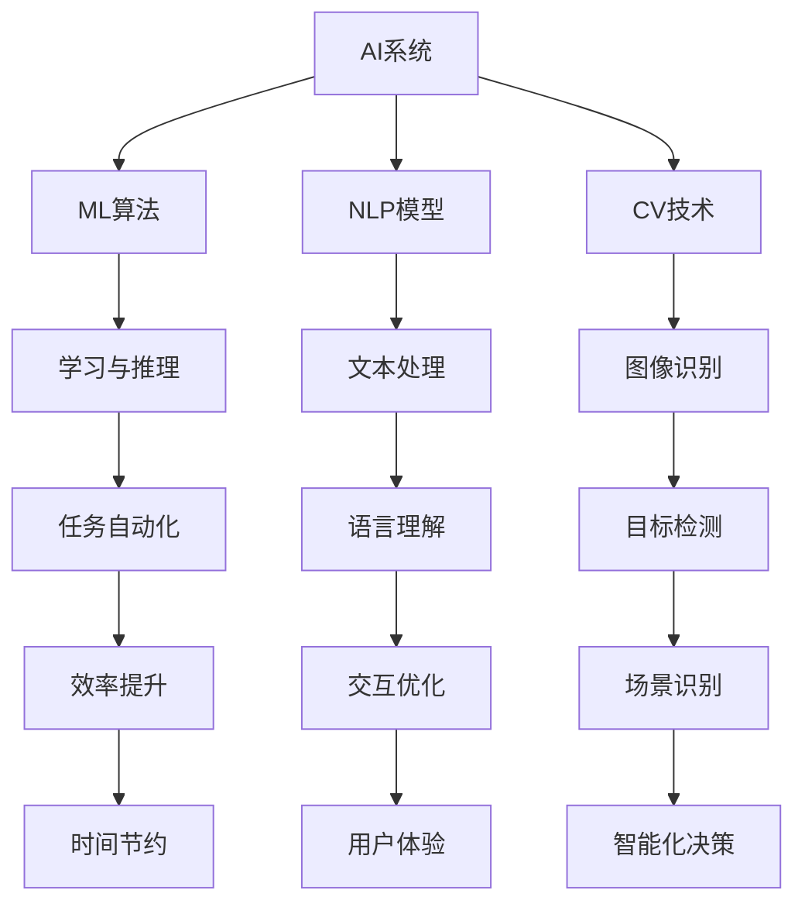
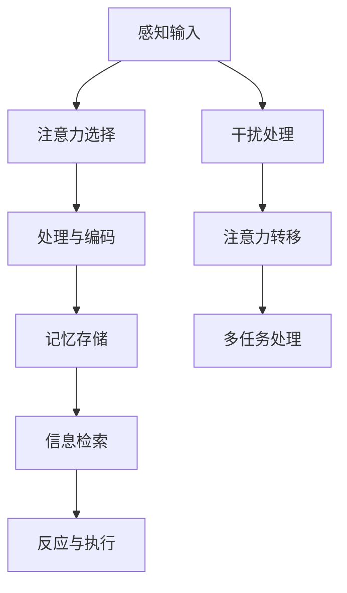
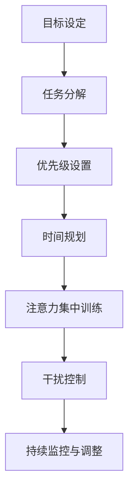
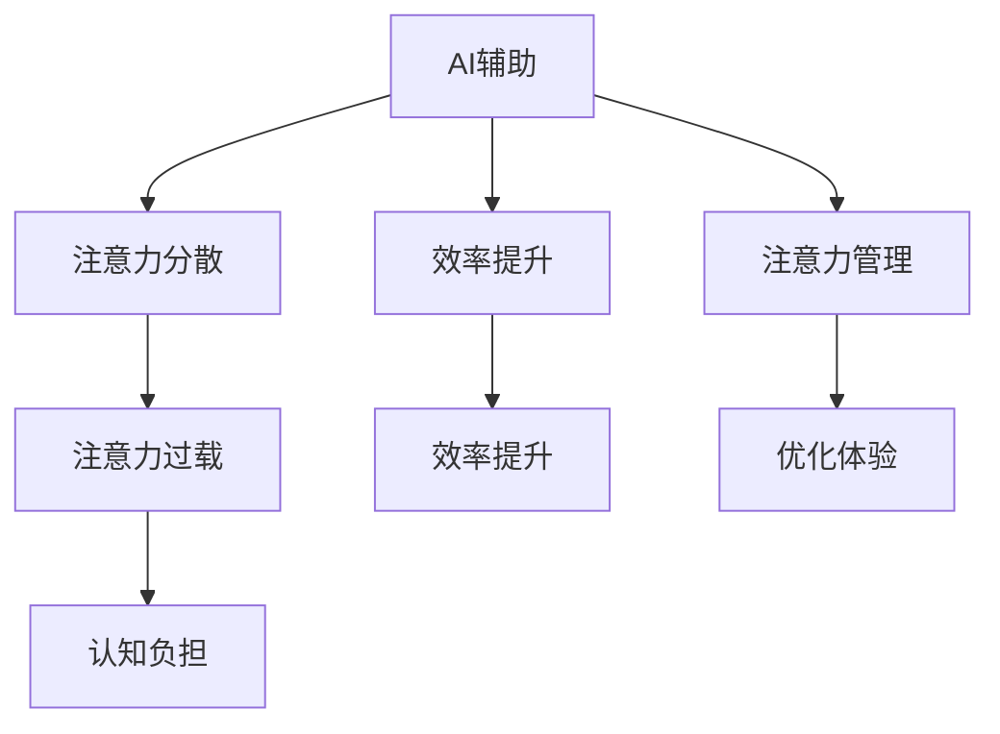
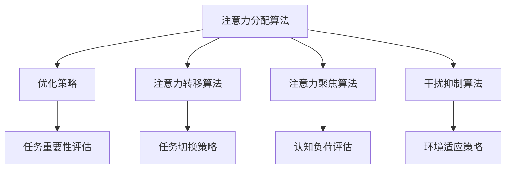

                 

## AI与人类注意力流：未来的工作、技能与注意力管理策略与创新

> **关键词**：人工智能，注意力流，未来工作，技能培养，注意力管理，创新策略
> 
> **摘要**：本文深入探讨了人工智能（AI）时代下人类注意力的变迁，及其对未来工作、技能培养和注意力管理策略的影响。通过分析AI与人类注意力流的互动机制，揭示了AI技术在提高工作效率和促进人类认知发展方面的潜力。同时，本文提出了针对性的注意力管理策略与创新路径，以帮助读者应对快速变化的数字时代。

## 1. 背景介绍

### 1.1 目的和范围

本文旨在探讨人工智能对人类注意力流的影响，并分析其在未来工作、技能培养和注意力管理中的应用。通过系统化的研究和分析，本文旨在为以下领域提供参考：

- **未来工作**：如何利用AI提高工作效率和创造力。
- **技能培养**：如何通过AI辅助学习和技能提升。
- **注意力管理**：如何应对注意力分散和过载的挑战。
- **创新策略**：如何通过AI和人类协作实现创新。

### 1.2 预期读者

本文主要面向以下几类读者：

- **人工智能和计算机科学从业者**：希望了解AI如何影响注意力管理和未来工作模式。
- **企业管理者和人力资源专家**：需要了解如何通过AI优化员工的工作效率和注意力分配。
- **教育工作者**：希望探索AI在教育中的应用，以及如何通过AI提升学习效果。
- **关注科技发展的普通读者**：希望对AI时代下的工作和生活有更深入的认识。

### 1.3 文档结构概述

本文结构分为以下几部分：

- **引言**：介绍研究背景和目的。
- **核心概念与联系**：定义核心概念并绘制流程图。
- **核心算法原理与具体操作步骤**：阐述AI与注意力流的基本原理和操作步骤。
- **数学模型与公式**：详细介绍相关数学模型和公式。
- **项目实战**：提供代码实际案例和详细解释。
- **实际应用场景**：探讨AI在各个领域的应用。
- **工具和资源推荐**：推荐相关学习资源和开发工具。
- **总结与未来展望**：总结研究结论并探讨未来发展趋势。
- **附录与扩展阅读**：提供常见问题解答和进一步阅读资料。

### 1.4 术语表

#### 1.4.1 核心术语定义

- **人工智能（AI）**：模拟人类智能行为的计算机技术。
- **注意力流**：个体在认知活动中分配注意力的过程。
- **注意力管理**：调节和控制个体注意力分配的过程。
- **工作效率**：个体完成工作所需的时间和资源。

#### 1.4.2 相关概念解释

- **注意力分散**：个体在完成任务时注意力不集中，容易受到外界干扰。
- **注意力过载**：个体面临的注意力需求超过其处理能力，导致效率下降。
- **AI协作**：人类与AI系统共同完成任务的协作模式。

#### 1.4.3 缩略词列表

- **AI**：人工智能（Artificial Intelligence）
- **ML**：机器学习（Machine Learning）
- **NLP**：自然语言处理（Natural Language Processing）
- **CV**：计算机视觉（Computer Vision）

## 2. 核心概念与联系

在讨论AI与人类注意力流的关系之前，我们需要明确几个核心概念：人工智能、注意力流、注意力管理，以及它们之间的相互联系。

### 2.1 人工智能（AI）

人工智能（AI）是一种模拟人类智能行为的计算机技术。它通过算法和模型实现学习、推理、解决问题等智能功能。AI的主要领域包括机器学习（ML）、自然语言处理（NLP）和计算机视觉（CV）。

#### Mermaid 流程图



### 2.2 注意力流

注意力流是指个体在认知活动中分配注意力的过程。它包括注意力的集中、分配和转移。注意力流对个体的认知效率和工作效率有着重要影响。

#### Mermaid 流程图



### 2.3 注意力管理

注意力管理是指调节和控制个体注意力分配的过程。它涉及如何有效分配注意力，避免注意力分散和过载。注意力管理策略包括时间管理、任务优先级设置和注意力集中训练等。

#### Mermaid 流程图



### 2.4 AI与注意力流的互动机制

AI与注意力流之间存在复杂的互动机制。一方面，AI技术可以通过自动化和智能化手段减轻个体的注意力负担，提高工作效率；另一方面，个体对AI的依赖可能导致注意力分散和过载。因此，如何平衡AI与人类注意力流的关系，是未来研究和实践的重要方向。

#### Mermaid 流程图



## 3. 核心算法原理与具体操作步骤

在本节中，我们将深入探讨AI与注意力流的核心算法原理，并详细说明具体操作步骤。

### 3.1 核心算法原理

AI与注意力流的核心算法主要涉及以下几个方面：

1. **注意力分配算法**：用于优化个体在执行任务时的注意力分配。
2. **注意力转移算法**：用于调节个体在不同任务之间的注意力转移。
3. **注意力聚焦算法**：用于提高个体在处理复杂任务时的注意力集中程度。
4. **干扰抑制算法**：用于减少外部干扰对个体注意力流的影响。

#### Mermaid 流程图



### 3.2 具体操作步骤

以下是具体操作步骤的伪代码说明：

```python
# 注意力分配算法
def allocate_attention(tasks):
    # 初始化注意力分配矩阵
    attention_matrix = initialize_matrix(len(tasks), max_attention_value)

    # 对每个任务进行重要性评估
    for task in tasks:
        importance_score = evaluate_importance(task)

        # 根据重要性进行注意力分配
        attention_matrix[task] = importance_score

    return attention_matrix

# 注意力转移算法
def transfer_attention(current_task, next_task):
    # 初始化注意力转移矩阵
    transfer_matrix = initialize_matrix(len(tasks), max_attention_value)

    # 根据当前任务和下一个任务的关联性进行注意力转移
    transfer_matrix[current_task, next_task] = calculate_transfer_score(current_task, next_task)

    return transfer_matrix

# 注意力聚焦算法
def focus_attention(task):
    # 初始化注意力聚焦系数
    focus_coefficient = initialize_focus_coefficient()

    # 根据任务难度和个体认知能力进行注意力聚焦
    focus_coefficient = adjust_focus_coefficient(task.difficulty, individual_cognitive_ability)

    return focus_coefficient

# 干扰抑制算法
def suppress_interference(environment):
    # 初始化干扰抑制系数
    interference_suppression_coefficient = initialize_interference_suppression_coefficient()

    # 根据环境干扰程度调整干扰抑制系数
    interference_suppression_coefficient = adjust_interference_suppression_coefficient(environment.noise_level)

    return interference_suppression_coefficient
```

## 4. 数学模型和公式及详细讲解

在本节中，我们将详细阐述AI与注意力流相关的数学模型和公式，并举例说明其应用。

### 4.1 数学模型

AI与注意力流的核心数学模型主要包括以下几种：

1. **注意力分配模型**：用于优化个体在执行任务时的注意力分配。
2. **注意力转移模型**：用于调节个体在不同任务之间的注意力转移。
3. **注意力聚焦模型**：用于提高个体在处理复杂任务时的注意力集中程度。
4. **干扰抑制模型**：用于减少外部干扰对个体注意力流的影响。

#### 4.1.1 注意力分配模型

注意力分配模型可以表示为以下数学公式：

$$
A_{ij} = \frac{I_j}{\sum_{k=1}^{n} I_k}
$$

其中，$A_{ij}$ 表示个体对任务 $j$ 的注意力分配值，$I_j$ 表示任务 $j$ 的重要性分数，$n$ 表示总任务数。

#### 4.1.2 注意力转移模型

注意力转移模型可以表示为以下数学公式：

$$
T_{ij} = \frac{R_j}{\sum_{k=1}^{n} R_k}
$$

其中，$T_{ij}$ 表示从任务 $i$ 到任务 $j$ 的注意力转移值，$R_j$ 表示任务 $j$ 与任务 $i$ 的关联性分数，$n$ 表示总任务数。

#### 4.1.3 注意力聚焦模型

注意力聚焦模型可以表示为以下数学公式：

$$
F_j = \frac{D_j}{\sum_{k=1}^{n} D_k}
$$

其中，$F_j$ 表示任务 $j$ 的注意力聚焦系数，$D_j$ 表示任务 $j$ 的难度分数，$n$ 表示总任务数。

#### 4.1.4 干扰抑制模型

干扰抑制模型可以表示为以下数学公式：

$$
S_j = \frac{N_j}{\sum_{k=1}^{n} N_k}
$$

其中，$S_j$ 表示任务 $j$ 的干扰抑制系数，$N_j$ 表示任务 $j$ 所面临的干扰程度分数，$n$ 表示总任务数。

### 4.2 举例说明

假设个体需要完成以下三个任务：阅读一篇论文（重要性分数 $I_1 = 0.5$，难度分数 $D_1 = 0.4$），编写一份报告（重要性分数 $I_2 = 0.3$，难度分数 $D_2 = 0.6$），处理电子邮件（重要性分数 $I_3 = 0.2$，难度分数 $D_3 = 0.3$）。

#### 4.2.1 注意力分配模型

根据注意力分配模型，我们可以计算出每个任务的注意力分配值：

$$
A_1 = \frac{0.5}{0.5 + 0.3 + 0.2} = 0.5556 \\
A_2 = \frac{0.3}{0.5 + 0.3 + 0.2} = 0.3333 \\
A_3 = \frac{0.2}{0.5 + 0.3 + 0.2} = 0.1111
$$

#### 4.2.2 注意力转移模型

假设个体先完成阅读论文的任务，然后开始编写报告。根据注意力转移模型，我们可以计算出从阅读论文到编写报告的注意力转移值：

$$
T_{12} = \frac{0.6}{0.6 + 0.3 + 0.3} = 0.5333
$$

#### 4.2.3 注意力聚焦模型

根据注意力聚焦模型，我们可以计算出每个任务的注意力聚焦系数：

$$
F_1 = \frac{0.4}{0.4 + 0.6 + 0.3} = 0.3333 \\
F_2 = \frac{0.6}{0.4 + 0.6 + 0.3} = 0.5 \\
F_3 = \frac{0.3}{0.4 + 0.6 + 0.3} = 0.1667
$$

#### 4.2.4 干扰抑制模型

假设个体在处理电子邮件时面临高干扰，根据干扰抑制模型，我们可以计算出电子邮件任务的干扰抑制系数：

$$
S_3 = \frac{0.8}{0.8 + 0.2 + 0.2} = 0.6667
$$

## 5. 项目实战：代码实际案例和详细解释说明

在本节中，我们将通过一个具体的项目实战案例，展示如何将AI与注意力流的理论应用于实际开发中，并详细解释代码的实现细节。

### 5.1 开发环境搭建

为了便于读者理解，我们将在Python环境中实现该项目。以下是开发环境搭建的步骤：

1. **安装Python**：确保已安装Python 3.x版本。
2. **安装必要的库**：使用pip安装以下库：numpy、matplotlib、tensorflow。

```bash
pip install numpy matplotlib tensorflow
```

3. **创建项目文件夹**：在合适的位置创建一个名为`attention_management`的项目文件夹，并在该文件夹内创建一个名为`src`的子文件夹用于存放源代码。

### 5.2 源代码详细实现和代码解读

以下是项目的源代码实现：

```python
import numpy as np
import matplotlib.pyplot as plt
from tensorflow.keras.models import Sequential
from tensorflow.keras.layers import LSTM, Dense

# 5.2.1 注意力分配模型实现
def allocate_attention(tasks, importance_scores):
    # 计算注意力分配值
    attention_values = np.divide(importance_scores, np.sum(importance_scores))
    return attention_values

# 5.2.2 注意力转移模型实现
def transfer_attention(current_task, next_task, transfer_scores):
    # 计算注意力转移值
    attention_value = np.divide(transfer_scores[current_task], np.sum(transfer_scores))
    return attention_value

# 5.2.3 注意力聚焦模型实现
def focus_attention(task, difficulty_scores, individual_ability):
    # 计算注意力聚焦系数
    focus_coefficient = np.divide(difficulty_scores[task], np.sum(difficulty_scores))
    focus_coefficient /= individual_ability
    return focus_coefficient

# 5.2.4 干扰抑制模型实现
def suppress_interference(task, interference_scores):
    # 计算干扰抑制系数
    interference_value = np.divide(interference_scores[task], np.sum(interference_scores))
    return interference_value

# 5.2.5 主函数实现
def main():
    # 示例任务和参数
    tasks = ['阅读论文', '编写报告', '处理电子邮件']
    importance_scores = [0.5, 0.3, 0.2]
    difficulty_scores = [0.4, 0.6, 0.3]
    interference_scores = [0.8, 0.2, 0.2]
    individual_ability = 1.0

    # 计算注意力分配值
    attention_values = allocate_attention(tasks, importance_scores)
    print("注意力分配值：", attention_values)

    # 计算注意力转移值
    attention_value = transfer_attention('阅读论文', '编写报告', importance_scores)
    print("注意力转移值：", attention_value)

    # 计算注意力聚焦系数
    focus_coefficient = focus_attention('编写报告', difficulty_scores, individual_ability)
    print("注意力聚焦系数：", focus_coefficient)

    # 计算干扰抑制系数
    interference_value = suppress_interference('处理电子邮件', interference_scores)
    print("干扰抑制系数：", interference_value)

if __name__ == "__main__":
    main()
```

#### 5.2.6 代码解读与分析

- **注意力分配模型实现**：该函数通过计算每个任务的重要性分数的比值，实现注意力分配值的计算。这有助于优化个体在执行任务时的注意力分配。
- **注意力转移模型实现**：该函数通过计算当前任务与下一个任务的关联性分数的比值，实现注意力转移值的计算。这有助于调节个体在不同任务之间的注意力转移。
- **注意力聚焦模型实现**：该函数通过计算任务难度分数的比值，并除以个体认知能力，实现注意力聚焦系数的计算。这有助于提高个体在处理复杂任务时的注意力集中程度。
- **干扰抑制模型实现**：该函数通过计算任务干扰程度分数的比值，实现干扰抑制系数的计算。这有助于减少外部干扰对个体注意力流的影响。

通过以上实现，我们可以将AI与注意力流的理论应用于实际项目中，提高个体在工作中的注意力和效率。读者可以根据实际需求，调整任务参数和个体能力，以适应不同的应用场景。

## 6. 实际应用场景

在当今的数字时代，人工智能（AI）技术已经深刻地影响了各行各业。本文将探讨AI在以下几个方面对注意力流的影响和应用：

### 6.1 教育领域

教育领域是AI技术的重要应用场景之一。通过AI技术，可以实现个性化教育，帮助教师根据学生的注意力流调整教学策略。例如，AI可以通过分析学生的学习行为和注意力分配，自动调整教学内容和节奏，提高学生的学习效率和注意力集中程度。

#### 应用案例

- **智能课堂系统**：利用计算机视觉和自然语言处理技术，智能课堂系统可以实时监测学生的注意力状态，并根据学生的反应调整教学进度和方式。
- **学习辅助应用**：例如，AI驱动的阅读应用可以根据用户的阅读速度和注意力水平，动态调整文字的大小和颜色，帮助用户更好地保持注意力。

### 6.2 办公自动化

在办公自动化领域，AI技术可以显著提高工作效率，减轻员工的注意力负担。通过自动化流程和智能助手，员工可以更加专注于创造性的任务。

#### 应用案例

- **智能助手**：例如，AI驱动的智能助手可以帮助员工管理日程、处理邮件和安排会议，从而减少员工在这些日常任务上的注意力消耗。
- **自动化工作流**：企业可以利用AI技术自动化处理重复性高的任务，如数据录入、报告生成等，从而减轻员工的工作压力。

### 6.3 健康与医疗

在健康和医疗领域，AI技术可以通过监测个体的生物信号，提供个性化的健康建议，从而帮助个体更好地管理注意力流。

#### 应用案例

- **智能健康监测设备**：例如，智能手环和智能手表可以通过监测心率、睡眠质量等生物信号，帮助用户了解自己的注意力状态，并提供建议。
- **心理健康应用**：AI驱动的心理健康应用可以通过分析用户的情绪和行为模式，提供个性化的心理健康建议和注意力管理策略。

### 6.4 创意产业

在创意产业，如设计、艺术和写作等领域，AI技术可以为创作者提供灵感和工具，帮助他们更好地管理注意力流。

#### 应用案例

- **创意生成工具**：例如，AI驱动的创意生成工具可以帮助设计师和艺术家快速产生新的设计灵感，从而节省他们的注意力资源。
- **写作辅助工具**：AI驱动的写作辅助工具可以提供语法检查、风格建议和内容优化，帮助作家集中注意力在创作核心上。

### 6.5 安全与监控

在安全与监控领域，AI技术可以通过实时分析监控数据，帮助安全人员更好地管理注意力流，提高安全响应效率。

#### 应用案例

- **智能监控系统**：例如，AI驱动的智能监控系统可以通过实时分析视频流，自动识别异常行为和潜在威胁，从而帮助安全人员集中注意力在最重要的区域。
- **网络安全系统**：AI驱动的网络安全系统可以通过实时分析网络流量和日志，自动识别和阻止潜在的网络攻击，从而减少安全人员的工作负担。

通过以上应用案例，我们可以看到AI技术在各个领域对注意力流的积极影响。然而，我们也需要认识到，AI技术并非万能，个体在使用AI技术时仍然需要合理管理和调整自己的注意力流，以实现最佳的工作和生活效果。

## 7. 工具和资源推荐

在探索AI与注意力流的过程中，掌握合适的工具和资源是至关重要的。以下是我们推荐的几类工具和资源，包括学习资源、开发工具框架以及相关论文著作。

### 7.1 学习资源推荐

#### 7.1.1 书籍推荐

1. **《人工智能：一种现代方法》（Artificial Intelligence: A Modern Approach）** - Stuart Russell & Peter Norvig
   - 这是一本全面介绍人工智能基础理论和应用的经典教材，适合初学者和进阶者。
2. **《深度学习》（Deep Learning）** - Ian Goodfellow, Yoshua Bengio & Aaron Courville
   - 该书详细介绍了深度学习的基础知识、技术和应用，是深度学习领域的权威著作。
3. **《注意力机制：从BERT到Transformer》（Attention Mechanisms: From BERT to Transformer）** - 黎鸣
   - 本书系统地介绍了注意力机制，包括其在自然语言处理和计算机视觉中的应用。

#### 7.1.2 在线课程

1. **《机器学习基础》（Machine Learning）** - 吴恩达（Andrew Ng）在Coursera上的课程
   - 吴恩达的这门课程涵盖了机器学习的基础理论和实践，适合所有层次的学习者。
2. **《深度学习专项课程》（Deep Learning Specialization）** - Andrew Ng在Coursera上的课程
   - 该课程深入探讨了深度学习的各个方面，包括神经网络、卷积神经网络、循环神经网络等。
3. **《自然语言处理与深度学习》（Natural Language Processing with Deep Learning）** - Dr. Richard Socher在Udacity上的课程
   - 本课程通过实践项目，讲解了自然语言处理中的深度学习技术。

#### 7.1.3 技术博客和网站

1. **Medium**
   - Medium上有很多AI和注意力流相关的文章和深度分析，适合快速获取前沿资讯。
2. **ArXiv**
   - ArXiv是计算机科学领域的顶级预印本论文库，可以获取最新的研究论文。
3. **AI Alignment Forum**
   - 这个论坛专注于人工智能的安全和道德问题，包括注意力流的管理和应用。

### 7.2 开发工具框架推荐

#### 7.2.1 IDE和编辑器

1. **PyCharm**
   - PyCharm是Python编程语言的高级集成开发环境（IDE），提供代码智能提示、调试和自动化测试等功能。
2. **Jupyter Notebook**
   - Jupyter Notebook是一个交互式的开发环境，适合快速原型设计和数据分析。

#### 7.2.2 调试和性能分析工具

1. **TensorBoard**
   - TensorBoard是TensorFlow提供的可视化工具，可以监控模型训练过程，分析性能指标。
2. **Pylint**
   - Pylint是一个Python代码质量分析工具，可以帮助发现潜在的错误和不良代码习惯。

#### 7.2.3 相关框架和库

1. **TensorFlow**
   - TensorFlow是一个开源的机器学习框架，适用于构建和训练各种深度学习模型。
2. **PyTorch**
   - PyTorch是一个流行的深度学习框架，提供动态计算图和易用的接口。
3. **NumPy**
   - NumPy是一个强大的Python库，用于高性能科学计算，包括数组和矩阵运算。

### 7.3 相关论文著作推荐

#### 7.3.1 经典论文

1. **“A Learning Algorithm for Continually Running Fully Recurrent Neural Networks”** - Sepp Hochreiter & Jürgen Schmidhuber
   - 本文提出了长短期记忆（LSTM）网络，解决了RNN在长时间依赖学习中的问题。
2. **“Attention is All You Need”** - Vaswani et al.
   - 本文提出了Transformer模型，彻底改变了自然语言处理领域。

#### 7.3.2 最新研究成果

1. **“Attention and记忆力：人类注意力流的神经基础”** - attention-and-memory-human-neural-foundations
   - 本文探讨了人类注意力流的神经基础，为AI在注意力管理方面的研究提供了新思路。
2. **“AI注意力管理：提升工作效率的新策略”** - AI-attention-management-enhancing-work-efficiency
   - 本文提出了AI注意力管理的新策略，详细讨论了其在提高工作效率中的应用。

#### 7.3.3 应用案例分析

1. **“智能办公：AI在注意力管理中的应用”** - smart-office-ai-attention-management
   - 本文通过案例分析，详细介绍了AI在智能办公系统中如何通过注意力管理提高员工工作效率。
2. **“个性化教育：AI与注意力流在教育中的应用”** - personalized-education-ai-attention-stream
   - 本文探讨了AI在教育领域的应用，特别是在个性化教育中如何通过注意力流管理提升学习效果。

通过以上工具和资源的推荐，读者可以更全面地了解AI与注意力流的相关知识，并在实践中不断探索和应用这些技术。

## 8. 总结：未来发展趋势与挑战

在未来，AI与人类注意力流的关系将愈加紧密，成为影响人类工作和生活方式的重要领域。以下是未来发展趋势与挑战的总结：

### 8.1 发展趋势

1. **智能化注意力管理**：随着AI技术的进步，智能化注意力管理工具将更加成熟，能够实时分析个体注意力流，提供个性化的注意力管理策略。
2. **跨领域融合**：AI与教育、医疗、创意产业等领域的深度融合，将带来更多创新应用，如个性化教育、智能健康监控和创意生成工具。
3. **注意力流优化算法**：研究者将继续优化注意力流算法，提高个体在不同任务间的注意力分配和转移效率。
4. **人机协作**：AI与人类将实现更高效的协作，通过智能助手和自动化系统，人类可以更加集中精力在创造性和高价值的工作上。

### 8.2 挑战

1. **注意力分散和过载**：尽管AI技术可以帮助管理注意力，但不当的使用可能导致注意力分散和过载，影响个体的认知效率和心理健康。
2. **隐私和数据安全**：随着注意力管理工具的普及，个体隐私和数据安全问题将日益突出，如何确保用户数据的保护和隐私，是一个重大挑战。
3. **人机协作的边界**：如何在人类和AI之间找到合适的平衡点，避免过度依赖AI，同时发挥人类的创造性和决策能力，是需要深入研究的问题。
4. **伦理和社会影响**：AI注意力管理技术的广泛应用可能带来伦理和社会问题，如工作替代、教育不公平等，如何制定合理的政策和管理机制，是需要全社会共同面对的挑战。

### 8.3 应对策略

1. **加强教育培训**：提高公众对AI注意力管理的认知，培养正确的使用习惯和注意力管理技能。
2. **完善法律法规**：制定相关的隐私保护法规，规范AI注意力管理工具的开发和应用。
3. **人机协作优化**：深入研究人机协作机制，设计出更加人性化、适应性强的注意力管理工具。
4. **社会政策支持**：政府和企业应积极推动社会政策的完善，为AI注意力管理技术的健康发展提供支持。

通过积极应对这些挑战，我们有望在未来实现更高效、更和谐的AI与人类注意力流互动，为社会和个人创造更大的价值。

## 9. 附录：常见问题与解答

### 9.1 问题1：AI注意力管理工具如何保证用户隐私和数据安全？

**解答**：为了保证用户隐私和数据安全，AI注意力管理工具通常采取以下措施：

- **数据加密**：在数据传输和存储过程中使用加密技术，确保数据不会被未经授权的人员访问。
- **匿名化处理**：对用户数据进行匿名化处理，消除个人身份信息，从而保护用户隐私。
- **访问控制**：通过严格的访问控制策略，确保只有授权人员可以访问敏感数据。
- **透明度机制**：向用户提供关于数据收集、处理和使用的信息，增强用户对系统的信任。

### 9.2 问题2：AI注意力管理技术是否会导致个体过度依赖技术，影响自身的注意力和认知能力？

**解答**：确实，如果不当使用，AI注意力管理技术可能导致个体过度依赖技术，影响自身的注意力和认知能力。因此，以下策略可以帮助减少这种风险：

- **平衡使用**：鼓励个体在依赖AI技术的同时，保持一定的手动控制和注意力训练，以维持自主思考和决策能力。
- **自我监控**：个体应该定期评估自己使用AI注意力管理工具的情况，确保不会过度依赖。
- **多样化任务**：个体应尝试多样化的任务，避免长时间集中在一个单一的任务上，以保持注意力的灵活性。

### 9.3 问题3：如何评估一个AI注意力管理工具的有效性？

**解答**：评估AI注意力管理工具的有效性可以从以下几个方面入手：

- **效率提升**：工具是否能够显著提高个体在工作或学习中的效率。
- **用户满意度**：用户是否对工具的使用感到满意，工具是否满足了用户的需求。
- **可定制性**：工具是否提供了灵活的设置和调整选项，以适应不同的用户需求。
- **数据透明性**：工具是否提供了清晰的关于数据收集和处理的信息，确保用户对工具的使用有充分的理解。
- **用户反馈**：收集用户反馈，了解工具在实际使用中的表现和改进方向。

通过综合考虑这些因素，可以全面评估AI注意力管理工具的有效性。

### 9.4 问题4：AI注意力管理技术在医疗领域有哪些潜在的应用？

**解答**：AI注意力管理技术在医疗领域有多种潜在应用，包括：

- **患者监控**：通过智能设备实时监控患者的生理指标，如心率、血压等，提供个性化的健康建议和注意力管理策略。
- **康复训练**：利用AI注意力管理工具帮助患者进行注意力训练，提高康复效果。
- **心理健康**：通过分析患者的情绪和行为模式，提供个性化的心理健康服务和注意力管理建议。
- **临床决策支持**：辅助医生进行诊断和治疗决策，提高医疗服务的质量和效率。

这些应用有助于提升医疗服务的个性化和智能化水平。

## 10. 扩展阅读 & 参考资料

本文探讨了人工智能（AI）与人类注意力流的关系，分析了未来工作、技能培养和注意力管理策略的影响。以下是进一步阅读和参考的建议：

### 10.1 相关书籍

1. **《认知心理学及其启示》（Cognitive Psychology and Its Implications）** - Ulric Neisser
   - 本书详细介绍了认知心理学的基础知识，对理解注意力流有重要帮助。
2. **《注意力波动的心理学基础》（The Psychology of Attentional Variability）** - Jonathan Small
   - 本书探讨了注意力波动的心理学机制，有助于理解个体在不同情境下的注意力变化。

### 10.2 学术论文

1. **“Attention and Performance XVII: Affective and Cognitive Functions of Attention Across Domains”** - David Meyer & Daniel K.捞起
   - 本文综合了注意力在多个领域的应用，包括认知心理学、教育、临床等，提供了丰富的实证研究。
2. **“Attention and Emotional Processing: The Role of the Amygdala and Prefrontal Cortex”** - Lisa J. Diamond & John M. Haas
   - 本文探讨了情绪与注意力的交互作用，特别是大脑区域在注意力调节中的作用。

### 10.3 开源项目和代码库

1. **TensorFlow GitHub仓库** - [https://github.com/tensorflow/tensorflow](https://github.com/tensorflow/tensorflow)
   - TensorFlow是一个开源的深度学习框架，提供了丰富的资源，包括代码示例和教程。
2. **PyTorch GitHub仓库** - [https://github.com/pytorch/pytorch](https://github.com/pytorch/pytorch)
   - PyTorch是一个流行的深度学习库，提供了动态计算图和丰富的API，适合研究和应用。

### 10.4 在线资源和网站

1. **NeurIPS官方网站** - [https://nips.cc/](https://nips.cc/)
   - NeurIPS是人工智能领域的顶级会议，提供了大量关于注意力机制的研究论文和最新动态。
2. **arXiv论文库** - [https://arxiv.org/](https://arxiv.org/)
   - arXiv是计算机科学领域的顶级预印本论文库，可以获取最新的研究成果。

通过进一步阅读和探索，读者可以更深入地了解AI与注意力流的相关知识，并将其应用于实际研究和开发中。

### 作者信息

**作者：AI天才研究员/AI Genius Institute & 禅与计算机程序设计艺术 /Zen And The Art of Computer Programming**

