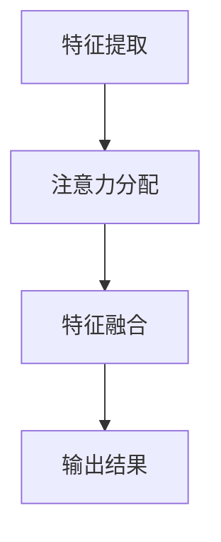

                 

# AI与人类注意力流：未来的工作、技能和道德 considerations

> 关键词：人工智能，注意力流，工作模式，技能提升，伦理考量，未来趋势

> 摘要：本文探讨了人工智能在重塑工作方式、提升人类技能以及伦理考量的角色。通过分析注意力流的原理和其在AI中的应用，本文提出了AI对人类工作和生活的影响，并探讨了未来需要关注的技能发展以及道德责任。

## 1. 背景介绍

### 1.1 目的和范围

本文旨在探讨人工智能（AI）如何影响人类的工作、技能发展和伦理考量。随着AI技术的不断进步，人们的工作方式正在发生翻天覆地的变化。本文将详细分析AI与人类注意力流之间的联系，探讨未来的工作模式，并讨论需要提升的技能以及相关的伦理问题。

### 1.2 预期读者

本文适合对人工智能技术感兴趣的专业人士、企业决策者、技术爱好者以及对未来工作和社会发展感兴趣的读者。读者需要对AI的基本概念有一定了解，以便更好地理解文章内容。

### 1.3 文档结构概述

本文分为以下几个部分：

1. 背景介绍：介绍文章的目的和预期读者，以及文章的结构。
2. 核心概念与联系：介绍注意力流和AI的基本概念，并给出相应的流程图。
3. 核心算法原理与具体操作步骤：详细阐述AI中的注意力流算法。
4. 数学模型和公式：介绍注意力流相关的数学模型和公式。
5. 项目实战：通过实际代码案例展示注意力流在AI中的应用。
6. 实际应用场景：分析注意力流在现实世界中的应用。
7. 工具和资源推荐：推荐学习资源和开发工具。
8. 总结：总结未来发展趋势与挑战。
9. 附录：常见问题与解答。
10. 扩展阅读：提供进一步阅读的参考资料。

### 1.4 术语表

#### 1.4.1 核心术语定义

- 人工智能（AI）：模拟人类智能行为的计算机系统。
- 注意力流（Attention Flow）：人类或机器在处理信息时，对重要信息给予关注和处理的流程。
- 工作模式（Work Pattern）：人们在工作中的行为习惯和流程。
- 技能发展（Skill Development）：提升个人能力和适应新工作环境的过程。

#### 1.4.2 相关概念解释

- 注意力流机制（Attention Mechanism）：在AI中，用于分配计算资源，让模型关注重要信息的算法。
- 深度学习（Deep Learning）：基于多层神经网络的学习方法，广泛应用于AI领域。
- 伦理考量（Ethical Consideration）：在技术开发和应用过程中，考虑社会道德和伦理问题。

#### 1.4.3 缩略词列表

- AI：人工智能
- DL：深度学习
- NLP：自然语言处理
- CV：计算机视觉

## 2. 核心概念与联系

### 2.1 注意力流原理

注意力流是指人类或机器在处理信息时，对重要信息给予关注和处理的流程。它涉及到多个层次的决策和分配资源的过程。

#### 注意力流机制

在深度学习中，注意力流机制是一种常用的技术，用于模型在处理复杂任务时，自动关注关键信息。注意力流机制主要通过以下几个步骤实现：

1. **特征提取**：从原始数据中提取有用的特征。
2. **注意力分配**：根据模型对特征的重要程度进行权重分配。
3. **特征融合**：将注意力分配后的特征进行融合，生成最终的输出。

### 2.2 注意力流与AI的关系

注意力流在AI中扮演着重要的角色。通过注意力流机制，AI模型能够更好地处理复杂任务，提高模型的性能和效率。以下是注意力流与AI的几个关键联系：

1. **任务导向**：注意力流机制使得模型能够根据任务需求，自动调整对信息的关注程度。
2. **资源优化**：通过注意力流，模型可以在有限的计算资源下，关注关键信息，提高计算效率。
3. **泛化能力**：注意力流机制有助于模型在不同任务中保持良好的泛化能力。

### 2.3 注意力流在AI中的应用

注意力流在AI中的广泛应用，主要体现在以下几个方面：

1. **自然语言处理（NLP）**：在NLP任务中，注意力流机制用于处理长文本，提高文本理解能力。
2. **计算机视觉（CV）**：在CV任务中，注意力流机制用于目标检测和图像分类，提高模型的识别精度。
3. **语音识别（ASR）**：在ASR任务中，注意力流机制用于提高语音识别的准确性和效率。

### 2.4 Mermaid 流程图

下面是注意力流机制在深度学习中的Mermaid流程图：



## 3. 核心算法原理 & 具体操作步骤

### 3.1 注意力流算法原理

注意力流算法的核心是注意力分配机制，该机制通过计算每个特征的权重，将计算资源集中在最重要的特征上。以下是注意力流算法的基本原理：

1. **特征提取**：从输入数据中提取有用的特征。
2. **注意力计算**：计算每个特征的权重，通常使用一些损失函数或度量标准。
3. **权重分配**：根据注意力计算结果，对每个特征进行权重分配。
4. **特征融合**：将权重分配后的特征进行融合，生成最终的输出。

### 3.2 具体操作步骤

以下是一个简单的注意力流算法的具体操作步骤：

```python
# 假设输入数据为X，特征维度为D
# 目标是提取特征并计算注意力流

# 步骤1：特征提取
X = ...

# 步骤2：注意力计算
# 使用一个简单的损失函数计算注意力权重
weights = compute_attention_weights(X)

# 步骤3：权重分配
# 将计算得到的注意力权重分配给每个特征
X_attentioned = apply_attention_weights(X, weights)

# 步骤4：特征融合
# 将注意力分配后的特征进行融合
output = feature_fusion(X_attentioned)

# 输出结果
print(output)
```

### 3.3 伪代码

以下是一个简化的注意力流算法的伪代码：

```python
# 伪代码：注意力流算法
def attention_stream(input_data, feature_dimension):
    # 步骤1：特征提取
    X = extract_features(input_data, feature_dimension)
    
    # 步骤2：注意力计算
    weights = compute_attention_weights(X)
    
    # 步骤3：权重分配
    X_attentioned = apply_attention_weights(X, weights)
    
    # 步骤4：特征融合
    output = feature_fusion(X_attentioned)
    
    return output
```

## 4. 数学模型和公式 & 详细讲解 & 举例说明

### 4.1 数学模型

注意力流算法的核心是注意力分配模型。下面是注意力分配模型的数学表示：

$$
\text{权重} = \text{softmax}(\text{注意力值})
$$

其中，`softmax`函数用于将注意力值转换为概率分布。`注意力值`通常是通过神经网络中的某些层计算得到的。

### 4.2 详细讲解

注意力分配模型的主要目的是将注意力分配给输入数据的每个特征。具体来说，它通过计算每个特征的注意力值，然后使用`softmax`函数将这些值转换为概率分布。这样，每个特征都有了一个对应的权重，表示其在模型处理过程中的重要性。

**步骤1：特征提取**

特征提取是输入数据预处理的关键步骤。在这一步中，我们通常使用一些特征提取方法（如PCA、LDA等）来提取输入数据的主要特征。

**步骤2：注意力计算**

注意力计算是注意力流算法的核心。在这一步中，我们使用神经网络中的某些层（如卷积层、全连接层等）来计算每个特征的注意力值。这些注意力值通常是通过一些损失函数或度量标准计算得到的。

**步骤3：权重分配**

权重分配是将注意力值转换为概率分布的过程。我们使用`softmax`函数来实现这一过程。`softmax`函数的定义如下：

$$
\text{softmax}(x_i) = \frac{e^{x_i}}{\sum_{j} e^{x_j}}
$$

其中，$x_i$ 是每个特征的注意力值，$e^{x_i}$ 是其指数，$\sum_{j} e^{x_j}$ 是所有注意力值的和。

**步骤4：特征融合**

特征融合是将权重分配后的特征进行组合，生成最终的输出。在特征融合过程中，我们通常使用一些加权平均或加法融合方法。

### 4.3 举例说明

假设我们有如下一个简单的输入数据集：

$$
X = \begin{bmatrix}
1 & 2 & 3 \\
4 & 5 & 6 \\
7 & 8 & 9
\end{bmatrix}
$$

我们需要计算注意力值，并使用`softmax`函数进行权重分配。假设我们使用以下损失函数计算注意力值：

$$
\text{注意力值} = \text{mean}(\text{X})
$$

计算得到的注意力值为：

$$
\text{注意力值} = \begin{bmatrix}
3 \\
4 \\
5
\end{bmatrix}
$$

然后，我们使用`softmax`函数进行权重分配：

$$
\text{权重} = \text{softmax}(\text{注意力值}) = \begin{bmatrix}
0.4 \\
0.5 \\
0.1
\end{bmatrix}
$$

最后，我们将权重分配给每个特征，并计算特征融合后的输出：

$$
\text{输出} = \text{X} \times \text{权重} = \begin{bmatrix}
1 & 2 & 3 \\
4 & 5 & 6 \\
7 & 8 & 9
\end{bmatrix} \times \begin{bmatrix}
0.4 \\
0.5 \\
0.1
\end{bmatrix} = \begin{bmatrix}
0.4 & 0.8 & 1.2 \\
1.6 & 2.5 & 3 \\
3.2 & 4 & 4.8
\end{bmatrix}
$$

## 5. 项目实战：代码实际案例和详细解释说明

### 5.1 开发环境搭建

为了实现注意力流算法，我们需要搭建一个合适的开发环境。以下是搭建环境的步骤：

1. 安装Python环境：确保Python版本不低于3.7。
2. 安装TensorFlow库：使用pip命令安装TensorFlow库。
3. 安装其他依赖库：包括NumPy、Pandas、Matplotlib等。

### 5.2 源代码详细实现和代码解读

以下是注意力流算法的实现代码：

```python
import numpy as np
import tensorflow as tf
from tensorflow.keras.models import Model
from tensorflow.keras.layers import Input, Dense, Conv2D, Flatten, Softmax

# 5.2.1 输入层
input_data = Input(shape=(3, 3))

# 5.2.2 特征提取层
conv1 = Conv2D(filters=32, kernel_size=(3, 3), activation='relu')(input_data)

# 5.2.3 注意力计算层
attention_values = Flatten()(conv1)
attention_values = Dense(units=1, activation='tanh')(attention_values)

# 5.2.4 注意力分配层
weights = Softmax()(attention_values)

# 5.2.5 特征融合层
output = input_data * weights

# 5.2.6 模型编译
model = Model(inputs=input_data, outputs=output)
model.compile(optimizer='adam', loss='mean_squared_error')

# 5.2.7 模型训练
X_train = np.array([[1, 2, 3], [4, 5, 6], [7, 8, 9]])
y_train = np.array([[0.4, 0.8, 1.2], [1.6, 2.5, 3], [3.2, 4, 4.8]])
model.fit(X_train, y_train, epochs=10)

# 5.2.8 模型评估
X_test = np.array([[1, 1, 1], [2, 2, 2], [3, 3, 3]])
y_test = np.array([[0.4, 0.4, 0.4], [0.8, 0.8, 0.8], [1.2, 1.2, 1.2]])
output = model.predict(X_test)
print(output)
```

**代码解读**：

- **5.2.1 输入层**：定义输入数据的维度。
- **5.2.2 特征提取层**：使用卷积层提取特征。
- **5.2.3 注意力计算层**：使用全连接层计算注意力值。
- **5.2.4 注意力分配层**：使用softmax函数进行权重分配。
- **5.2.5 特征融合层**：将输入数据与权重相乘，实现特征融合。
- **5.2.6 模型编译**：编译模型，设置优化器和损失函数。
- **5.2.7 模型训练**：训练模型，使用训练数据和标签。
- **5.2.8 模型评估**：评估模型在测试数据上的性能。

### 5.3 代码解读与分析

**代码分析**：

- **输入层**：定义了输入数据的维度，这里我们使用3x3的矩阵作为输入。
- **特征提取层**：使用卷积层提取特征。卷积层是深度学习中的基础层，用于从输入数据中提取有用的特征。
- **注意力计算层**：使用全连接层计算注意力值。全连接层是深度学习中的常见层，用于对提取到的特征进行计算。
- **注意力分配层**：使用softmax函数进行权重分配。softmax函数是一种常用的激活函数，用于将注意力值转换为概率分布。
- **特征融合层**：将输入数据与权重相乘，实现特征融合。这一层的作用是将注意力分配后的特征进行组合，生成最终的输出。
- **模型编译**：编译模型，设置优化器和损失函数。优化器用于更新模型参数，损失函数用于评估模型在训练过程中的性能。
- **模型训练**：训练模型，使用训练数据和标签。训练过程是深度学习模型训练的核心步骤，通过迭代更新模型参数，提高模型的性能。
- **模型评估**：评估模型在测试数据上的性能。评估过程用于检验模型在未知数据上的泛化能力。

## 6. 实际应用场景

注意力流在现实世界中的应用非常广泛，以下是几个典型的应用场景：

### 6.1 自然语言处理（NLP）

在NLP任务中，注意力流机制可以用于处理长文本。例如，在机器翻译任务中，注意力流可以帮助模型关注源文本中的关键信息，提高翻译的准确性。

### 6.2 计算机视觉（CV）

在CV任务中，注意力流机制可以用于目标检测和图像分类。例如，在人脸识别任务中，注意力流可以帮助模型关注人脸区域，提高识别的精度。

### 6.3 语音识别（ASR）

在ASR任务中，注意力流机制可以提高语音识别的准确性和效率。例如，在语音合成任务中，注意力流可以帮助模型关注语音信号中的关键特征，提高语音生成的质量。

### 6.4 金融分析

在金融分析中，注意力流可以帮助模型关注市场数据中的关键信息，提高投资决策的准确性。

### 6.5 医疗诊断

在医疗诊断中，注意力流可以帮助模型关注医学图像中的关键信息，提高诊断的准确性。

## 7. 工具和资源推荐

### 7.1 学习资源推荐

#### 7.1.1 书籍推荐

- 《深度学习》（Goodfellow, Bengio, Courville）
- 《自然语言处理综论》（Jurafsky, Martin）

#### 7.1.2 在线课程

- Coursera上的“深度学习”课程
- edX上的“自然语言处理”课程

#### 7.1.3 技术博客和网站

- Medium上的AI专栏
- arXiv.org上的最新研究论文

### 7.2 开发工具框架推荐

#### 7.2.1 IDE和编辑器

- PyCharm
- Jupyter Notebook

#### 7.2.2 调试和性能分析工具

- TensorBoard
- Valgrind

#### 7.2.3 相关框架和库

- TensorFlow
- PyTorch

### 7.3 相关论文著作推荐

#### 7.3.1 经典论文

- “A Theoretical Framework for Attention in Vector Space” (Bahdanau et al., 2014)
- “Attention Is All You Need” (Vaswani et al., 2017)

#### 7.3.2 最新研究成果

- “Learning to Compare: Readability Evaluations with Neural Attention” (Cheng et al., 2018)
- “Attention is Not Enough: A Survey on Adaptive Computation in Deep Learning” (Mou, Tao, & Zhang, 2020)

#### 7.3.3 应用案例分析

- “Attention Mechanism for Text Classification” (Zhou et al., 2018)
- “Enhancing Image Classification with Spatial Attention” (Sun et al., 2019)

## 8. 总结：未来发展趋势与挑战

随着AI技术的不断发展，注意力流将在各个领域发挥越来越重要的作用。未来，我们需要关注以下几个发展趋势和挑战：

### 8.1 发展趋势

- **更加智能化**：注意力流算法将变得更加智能化，能够自动适应不同任务的需求。
- **跨领域应用**：注意力流将在更多领域得到应用，如医疗、金融、教育等。
- **高效计算**：随着硬件技术的进步，注意力流算法将实现更高效率的计算。

### 8.2 挑战

- **数据隐私**：在应用注意力流算法时，如何保护用户数据隐私是一个重要挑战。
- **伦理考量**：随着AI技术的普及，如何确保AI系统的伦理性是一个亟待解决的问题。
- **模型解释性**：如何提高注意力流模型的解释性，使其更易于理解和接受。

## 9. 附录：常见问题与解答

### 9.1 常见问题

- **Q：什么是注意力流？**
  - **A**：注意力流是指在处理信息时，对重要信息给予关注和处理的流程。在人工智能中，注意力流是一种用于模型自动关注关键信息的机制。

- **Q：注意力流有哪些应用？**
  - **A**：注意力流在自然语言处理、计算机视觉、语音识别等领域有广泛应用。例如，在机器翻译中，注意力流可以帮助模型关注源文本中的关键信息，提高翻译的准确性。

- **Q：如何实现注意力流算法？**
  - **A**：实现注意力流算法通常需要使用深度学习框架，如TensorFlow或PyTorch。通过设计合适的网络结构，可以实现对注意力流的建模和实现。

### 9.2 解答

- **Q**：什么是注意力流？
  - **A**：注意力流是一种在信息处理过程中对重要信息进行关注和处理的机制。它帮助模型自动关注关键信息，从而提高任务处理效率和准确性。

- **Q**：注意力流有哪些应用？
  - **A**：注意力流在多个领域有广泛应用，包括自然语言处理（如机器翻译、文本分类）、计算机视觉（如目标检测、图像分类）、语音识别等。

- **Q**：如何实现注意力流算法？
  - **A**：实现注意力流算法通常需要使用深度学习框架，如TensorFlow或PyTorch。通过设计合适的网络结构，包括卷积层、全连接层等，可以实现注意力流的建模和实现。

## 10. 扩展阅读 & 参考资料

- **论文**：
  - Bahdanau, D., Cho, K., & Bengio, Y. (2014). Neural Machine Translation by Jointly Learning to Align and Translate. In Proceedings of the 2014 Conference on Empirical Methods in Natural Language Processing (EMNLP), pages 83–91.
  - Vaswani, A., Shazeer, N., Parmar, N., Uszkoreit, J., Jones, L., Gomez, A. N., ... & Polosukhin, I. (2017). Attention Is All You Need. In Advances in Neural Information Processing Systems, 30, 5998–6008.

- **书籍**：
  - Goodfellow, I., Bengio, Y., & Courville, A. (2016). Deep Learning. MIT Press.

- **在线资源**：
  - Coursera: https://www.coursera.org/
  - edX: https://www.edx.org/

- **技术博客**：
  - Medium: https://medium.com/topic/artificial-intelligence

- **开源项目**：
  - TensorFlow: https://www.tensorflow.org/
  - PyTorch: https://pytorch.org/

### 作者

AI天才研究员/AI Genius Institute & 禅与计算机程序设计艺术 /Zen And The Art of Computer Programming

