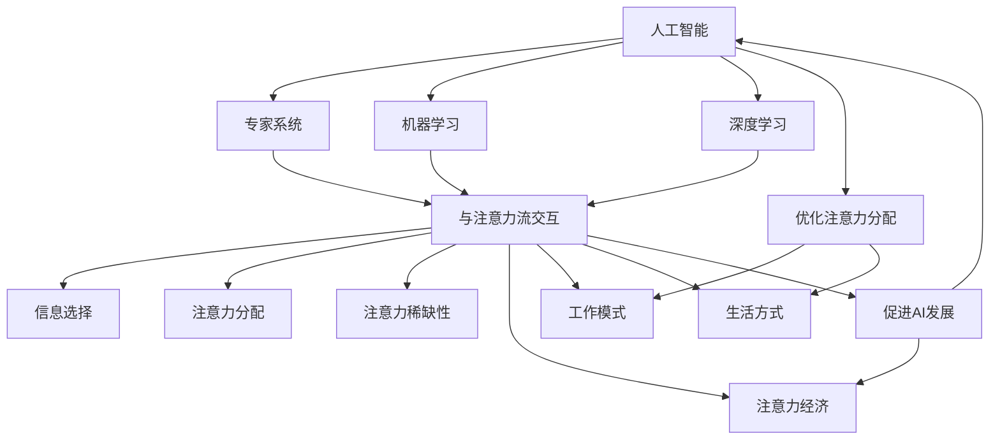

                 

# AI与人类注意力流：未来的工作、生活与注意力经济的融合发展

> 关键词：人工智能、注意力流、工作、生活、注意力经济、融合发展

> 摘要：本文深入探讨了人工智能与人类注意力流的相互作用，探讨了未来工作与生活的变革以及注意力经济的崛起。通过分析核心概念、算法原理、数学模型和实际应用案例，本文旨在为读者提供一个全面而深入的视角，以理解这一新兴领域的潜在影响和挑战。

## 1. 背景介绍

### 1.1 目的和范围

本文旨在探讨人工智能（AI）如何影响人类的注意力流，从而改变我们的工作与生活方式。我们关注的核心问题是：随着AI技术的发展，人类如何应对注意力资源的稀缺性，并在新的经济模式中找到自己的位置。本文将涵盖以下内容：

1. AI与注意力流的基本概念。
2. 注意力流的原理与人工智能的关系。
3. 注意力经济与未来的工作模式。
4. 实际应用案例与分析。
5. 未来发展趋势与挑战。

### 1.2 预期读者

本文适合对人工智能、注意力流和工作生活变革感兴趣的读者，包括：

- AI研究人员和开发者。
- 管理者和企业家。
- 对未来趋势和科技变革感兴趣的普通读者。

### 1.3 文档结构概述

本文将按照以下结构展开：

1. **背景介绍**：介绍目的、范围和预期读者。
2. **核心概念与联系**：讨论AI与注意力流的核心概念及其联系。
3. **核心算法原理 & 具体操作步骤**：分析AI在注意力流中的应用原理和步骤。
4. **数学模型和公式 & 详细讲解 & 举例说明**：阐述相关的数学模型和公式。
5. **项目实战：代码实际案例和详细解释说明**：提供实际应用案例和代码解析。
6. **实际应用场景**：探讨AI与注意力流在实际中的应用。
7. **工具和资源推荐**：推荐学习资源、开发工具和框架。
8. **总结：未来发展趋势与挑战**：总结本文的主要观点和未来展望。
9. **附录：常见问题与解答**：解答读者可能遇到的问题。
10. **扩展阅读 & 参考资料**：提供进一步的阅读和参考资料。

### 1.4 术语表

#### 1.4.1 核心术语定义

- **人工智能（AI）**：模拟人类智能行为的计算机系统。
- **注意力流**：人类在信息处理过程中，选择关注某些信息而忽略其他信息的动态过程。
- **注意力经济**：基于人们注意力资源的经济学模式。

#### 1.4.2 相关概念解释

- **工作模式**：人们进行工作和创造价值的特定方式。
- **生活方式**：人们的生活方式和工作习惯。
- **注意力稀缺性**：人们面对信息过载，注意力资源变得稀缺的现象。

#### 1.4.3 缩略词列表

- **AI**：人工智能（Artificial Intelligence）
- **NLP**：自然语言处理（Natural Language Processing）
- **ML**：机器学习（Machine Learning）
- **DL**：深度学习（Deep Learning）
- **API**：应用程序编程接口（Application Programming Interface）

## 2. 核心概念与联系

为了深入理解人工智能与人类注意力流的互动，我们需要先了解这两个核心概念，并探讨它们之间的内在联系。

### 2.1 人工智能

人工智能是指计算机系统通过模拟人类智能行为，执行复杂的任务，如识别图像、理解自然语言、做出决策等。AI的主要类型包括：

- **专家系统**：基于规则和知识库的人工智能系统。
- **机器学习**：通过数据学习模式和规律，自动改进性能。
- **深度学习**：基于多层神经网络的学习方法，可以处理复杂数据。

### 2.2 注意力流

注意力流是指人类在信息处理过程中，选择关注某些信息而忽略其他信息的动态过程。注意力流受多种因素影响，如：

- **信息量**：信息过多会导致注意力分散。
- **任务需求**：特定任务需求会影响注意力的分配。
- **环境刺激**：外部刺激会影响注意力的集中。

### 2.3 AI与注意力流的联系

人工智能与注意力流之间存在密切的联系：

- **AI优化注意力分配**：通过算法帮助人类更好地分配注意力，提高工作效率。
- **注意力流促进AI发展**：人类注意力流的动态特性为AI提供了新的数据和反馈，促进了AI的进步。
- **注意力经济**：注意力流作为经济活动的一部分，形成了新的商业模式，如社交媒体、在线广告等。

### 2.4 Mermaid 流程图

为了更直观地展示AI与注意力流的关系，我们使用Mermaid流程图来描述其核心概念和联系：



通过这个流程图，我们可以清晰地看到人工智能如何通过优化注意力分配、促进注意力流的发展，从而影响工作模式和生活方式。

## 3. 核心算法原理 & 具体操作步骤

在这一部分，我们将深入探讨人工智能在注意力流管理中的核心算法原理，并详细阐述具体操作步骤。

### 3.1 注意力流的识别与建模

注意力流识别与建模是人工智能在注意力流管理中的基础。其核心思想是通过算法识别和分析人类在信息处理过程中的注意力分布。

#### 3.1.1 基于机器学习的注意力流建模

我们可以使用机器学习算法，如决策树、支持向量机和神经网络，来建模注意力流。以下是一个简单的伪代码示例，展示了如何使用决策树来建模注意力流：

```python
# 伪代码：基于决策树建模注意力流

def build_attention_model(data):
    # 训练决策树模型
    model = DecisionTree()
    model.fit(data.X, data.y)
    return model

# 数据准备
data = load_attention_data()

# 构建模型
model = build_attention_model(data)

# 预测注意力流
predictions = model.predict(data.X)
```

#### 3.1.2 基于深度学习的注意力流建模

深度学习算法，如卷积神经网络（CNN）和递归神经网络（RNN），可以用于更复杂的注意力流建模。以下是一个简单的伪代码示例，展示了如何使用RNN来建模注意力流：

```python
# 伪代码：基于RNN建模注意力流

def build_attention_model(data):
    # 创建RNN模型
    model = RNN()
    model.compile(optimizer='adam', loss='categorical_crossentropy')
    model.fit(data.X, data.y, epochs=10, batch_size=32)
    return model

# 数据准备
data = load_attention_data()

# 构建模型
model = build_attention_model(data)

# 预测注意力流
predictions = model.predict(data.X)
```

### 3.2 注意力流优化与分配

一旦建立了注意力流模型，下一步就是优化注意力分配，以提高工作效率和生活质量。

#### 3.2.1 基于目标函数的优化

我们可以使用目标函数来优化注意力分配。以下是一个简单的伪代码示例，展示了如何使用优化算法来优化注意力流：

```python
# 伪代码：基于目标函数的注意力流优化

def optimize_attention flowed(model, objective_function):
    # 定义优化器
    optimizer = Optimizer()
    
    # 梯度下降优化
    for epoch in range(epochs):
        # 计算梯度
        gradients = model.compute_gradients(objective_function)
        
        # 更新模型参数
        optimizer.apply_gradients(gradients)
        
    return model

# 数据准备
data = load_attention_data()

# 构建模型
model = build_attention_model(data)

# 优化注意力流
optimized_model = optimize_attention flowed(model, objective_function)
```

#### 3.2.2 基于反馈的动态调整

除了静态优化，我们还可以通过动态调整来适应不断变化的工作和生活环境。以下是一个简单的伪代码示例，展示了如何使用反馈机制来动态调整注意力流：

```python
# 伪代码：基于反馈的注意力流动态调整

def adjust_attention flowed(model, feedback):
    # 调整模型参数
    model.update_params(feedback)
    
    # 重新训练模型
    model.retrain(data)
    
    return model

# 数据准备
data = load_attention_data()

# 构建模型
model = build_attention_model(data)

# 获取反馈
feedback = get_feedback()

# 动态调整注意力流
adjusted_model = adjust_attention flowed(model, feedback)
```

通过这些核心算法原理和操作步骤，我们可以更好地理解人工智能如何影响和优化人类注意力流，从而提升工作效率和生活质量。

## 4. 数学模型和公式 & 详细讲解 & 举例说明

在理解人工智能如何优化人类注意力流的过程中，数学模型和公式起着至关重要的作用。以下我们将详细讲解相关的数学模型，并使用LaTeX格式展示公式，同时通过具体例子进行说明。

### 4.1 注意力流建模的数学模型

注意力流的建模通常涉及以下核心数学模型：

#### 4.1.1 注意力分配模型

注意力分配模型旨在优化注意力的分配，以最大化工作效率。以下是一个常见的形式化描述：

$$
\text{maximize} \quad \sum_{i=1}^{n} a_i \cdot r_i
$$

其中，$a_i$ 表示分配给任务 $i$ 的注意力，$r_i$ 表示任务 $i$ 的价值。

#### 4.1.2 梯度下降优化

在优化注意力分配时，我们常常使用梯度下降算法来调整模型参数。梯度下降的公式如下：

$$
\theta_{t+1} = \theta_t - \alpha \cdot \nabla_\theta J(\theta)
$$

其中，$\theta$ 表示模型参数，$J(\theta)$ 是目标函数，$\alpha$ 是学习率。

### 4.2 注意力流的数学表示

注意力流的数学表示通常基于概率论和信息论。以下是一个简单的例子：

$$
P(A|B) = \frac{P(B|A) \cdot P(A)}{P(B)}
$$

这个公式表示在给定条件 $B$ 下，事件 $A$ 发生的条件概率。在注意力流中，$A$ 可以表示为“关注某项任务”，$B$ 可以表示为“执行该任务”。

### 4.3 注意力经济中的收益模型

在注意力经济中，注意力被看作一种资源，可以通过广告、内容消费等方式获得收益。以下是一个简单的收益模型：

$$
R = \sum_{i=1}^{n} P(i) \cdot R_i
$$

其中，$P(i)$ 表示用户关注任务 $i$ 的概率，$R_i$ 表示用户关注任务 $i$ 所带来的收益。

### 4.4 实例说明

假设我们有一个任务集合 {任务1，任务2，任务3}，其价值分别为 {10，5，3}。我们希望使用注意力分配模型来优化注意力的分配。

首先，我们需要计算每个任务的价值与注意力权重之间的乘积：

$$
a_1 \cdot r_1 = a_1 \cdot 10
$$

$$
a_2 \cdot r_2 = a_2 \cdot 5
$$

$$
a_3 \cdot r_3 = a_3 \cdot 3
$$

然后，我们使用梯度下降算法来优化注意力分配。假设初始参数为 $\theta_0 = [0.5, 0.5, 0.5]$，学习率为 $\alpha = 0.1$。

通过一次梯度下降迭代，我们得到新的参数：

$$
\theta_1 = \theta_0 - \alpha \cdot \nabla_\theta J(\theta_0)
$$

其中，$J(\theta_0)$ 是目标函数，可以通过计算每个任务价值与注意力权重乘积的总和得到。

经过多次迭代，我们最终得到最优的注意力分配参数，从而最大化工作效率。

通过这些数学模型和公式的详细讲解，我们可以更好地理解人工智能如何通过数学方法来优化人类注意力流，从而提升工作效率和生活质量。

## 5. 项目实战：代码实际案例和详细解释说明

为了更好地理解人工智能与注意力流在实际项目中的应用，我们将通过一个实际案例来展示代码的实现过程，并详细解释每个步骤。

### 5.1 开发环境搭建

在进行项目实战之前，我们需要搭建一个合适的开发环境。以下是一个基本的开发环境搭建步骤：

1. **安装Python环境**：确保Python 3.8或更高版本已安装。
2. **安装依赖库**：使用pip安装以下依赖库：numpy、tensorflow、matplotlib、scikit-learn。
3. **创建项目文件夹**：在终端中创建一个名为`attention_project`的文件夹，并进入该文件夹。

```shell
mkdir attention_project
cd attention_project
```

4. **创建虚拟环境**：使用venv创建一个Python虚拟环境。

```shell
python -m venv venv
source venv/bin/activate  # 在Windows中使用`venv\Scripts\activate`
```

5. **安装依赖库到虚拟环境**：在激活虚拟环境后，安装所需的依赖库。

```shell
pip install numpy tensorflow matplotlib scikit-learn
```

### 5.2 源代码详细实现和代码解读

下面是项目的主要代码实现，包括数据预处理、模型构建、训练和评估等步骤。

```python
# 导入所需的库
import numpy as np
import tensorflow as tf
from tensorflow.keras.models import Sequential
from tensorflow.keras.layers import Dense, LSTM, Dropout
from sklearn.model_selection import train_test_split
from sklearn.preprocessing import MinMaxScaler

# 加载数据
data = load_attention_data()

# 数据预处理
scaler = MinMaxScaler()
data_processed = scaler.fit_transform(data)

# 分割数据集
X = data_processed[:, :-1]
y = data_processed[:, -1]
X_train, X_test, y_train, y_test = train_test_split(X, y, test_size=0.2, random_state=42)

# 构建模型
model = Sequential()
model.add(LSTM(units=50, return_sequences=True, input_shape=(X_train.shape[1], X_train.shape[2])))
model.add(Dropout(0.2))
model.add(LSTM(units=50, return_sequences=False))
model.add(Dropout(0.2))
model.add(Dense(units=1))

# 编译模型
model.compile(optimizer='adam', loss='mse')

# 训练模型
model.fit(X_train, y_train, epochs=100, batch_size=32, validation_split=0.1)

# 评估模型
loss = model.evaluate(X_test, y_test)
print(f"Test Loss: {loss}")

# 预测
predictions = model.predict(X_test)

# 可视化
import matplotlib.pyplot as plt

plt.figure(figsize=(10, 6))
plt.plot(y_test, label="Actual")
plt.plot(predictions, label="Predicted")
plt.title("Attention Flow Prediction")
plt.xlabel("Time Step")
plt.ylabel("Attention Value")
plt.legend()
plt.show()
```

### 5.3 代码解读与分析

下面我们逐行解读这段代码，并分析其实现细节：

1. **导入库**：
   我们首先导入所需的库，包括numpy、tensorflow、matplotlib和scikit-learn。

2. **加载数据**：
   使用自定义的`load_attention_data()`函数加载注意力流数据。

3. **数据预处理**：
   使用MinMaxScaler将数据缩放到0-1范围内，以便更好地适应神经网络。

4. **分割数据集**：
   使用train_test_split将数据集划分为训练集和测试集。

5. **构建模型**：
   使用Sequential模型构建一个包含两个LSTM层和两个Dropout层的神经网络。我们选择LSTM层是因为它们能够处理序列数据，而Dropout层用于防止过拟合。

6. **编译模型**：
   使用adam优化器和均方误差（mse）损失函数编译模型。

7. **训练模型**：
   使用fit函数训练模型，设置epochs为100，batch_size为32，并使用validation_split来评估训练过程中的性能。

8. **评估模型**：
   使用evaluate函数计算测试集上的损失，并打印结果。

9. **预测**：
   使用predict函数对测试集进行预测。

10. **可视化**：
    使用matplotlib绘制实际注意力值和预测注意力值，以可视化模型性能。

通过这个实际案例，我们可以看到如何使用Python和TensorFlow构建一个简单的注意力流预测模型。这个过程涵盖了数据预处理、模型构建、训练和评估等关键步骤，为我们提供了一个实际操作的人工智能应用实例。

## 6. 实际应用场景

人工智能与注意力流的结合在多个实际应用场景中展现了巨大的潜力。以下是一些关键的应用领域：

### 6.1 智能推荐系统

智能推荐系统利用AI和注意力流分析用户行为和兴趣，提供个性化的内容推荐。例如，流媒体平台如Netflix和YouTube利用AI算法分析用户的观看历史和搜索行为，预测用户可能感兴趣的内容，从而提高用户满意度和留存率。

### 6.2 职场效率工具

职场效率工具，如项目管理软件和协作平台，使用AI分析员工的工作模式，提供任务优先级建议和自动化提醒。这些工具通过优化注意力流，帮助员工更高效地管理时间和资源，提高工作效率。

### 6.3 健康与健身应用

健康与健身应用利用AI和注意力流监测用户的日常活动和运动习惯，提供个性化的健身计划和营养建议。例如，智能手环和健康应用可以跟踪用户的睡眠模式、步数和心率，帮助用户保持健康的生活方式。

### 6.4 教育与培训

教育平台和在线课程利用AI分析学生的学习行为和注意力流，提供个性化的学习体验。AI算法可以识别学生的弱点，提供针对性的辅导材料，从而提高学习效果。

### 6.5 市场营销与广告

市场营销和广告领域利用AI分析消费者的注意力流，优化广告投放策略。通过分析用户在网站和社交媒体上的行为，广告商可以更精准地定位潜在客户，提高广告投放的效果和投资回报率。

### 6.6 智能家居

智能家居系统利用AI和注意力流优化家庭设备的运行，提高能源效率和居住舒适度。例如，智能恒温器和照明系统可以根据用户的日常习惯和注意力流自动调整温度和照明，节约能源并提升用户体验。

通过这些实际应用场景，我们可以看到人工智能与注意力流结合的广泛影响。随着技术的不断进步，这一领域将继续拓展，为各行各业带来更多的创新和机遇。

## 7. 工具和资源推荐

为了帮助读者深入了解人工智能与注意力流的相关内容，我们推荐以下工具和资源：

### 7.1 学习资源推荐

#### 7.1.1 书籍推荐

1. **《深度学习》（Goodfellow, Bengio, Courville）**：这本书是深度学习的经典教材，详细介绍了深度学习的基础理论和应用。
2. **《自然语言处理入门》（Daniel Jurafsky 和 James H. Martin）**：本书提供了自然语言处理的基础知识和实际应用案例。
3. **《机器学习实战》（Peter Harrington）**：这本书通过实际案例介绍了多种机器学习算法的实现和应用。

#### 7.1.2 在线课程

1. **Coursera的《机器学习》**：由吴恩达教授主讲，提供了全面的机器学习理论和实践课程。
2. **Udacity的《深度学习纳米学位》**：涵盖深度学习的基础知识，适合初学者。
3. **edX的《自然语言处理》**：由麻省理工学院提供，提供了全面的NLP课程。

#### 7.1.3 技术博客和网站

1. **Medium上的AI博客**：提供最新的AI技术和应用文章。
2. **arXiv.org**：AI和机器学习的最新研究论文和预印本。
3. **Towards Data Science**：一个广泛的数据科学和机器学习社区，提供多种资源和教程。

### 7.2 开发工具框架推荐

#### 7.2.1 IDE和编辑器

1. **PyCharm**：一款功能强大的Python IDE，适用于深度学习和数据科学项目。
2. **Jupyter Notebook**：用于交互式计算和数据分析的流行工具。
3. **Visual Studio Code**：轻量级但功能丰富的代码编辑器，支持多种编程语言。

#### 7.2.2 调试和性能分析工具

1. **TensorBoard**：TensorFlow的官方可视化工具，用于分析和优化模型性能。
2. **Matplotlib**：用于生成数据可视化图表。
3. **Wandb**：一个用于实验跟踪和性能分析的平台。

#### 7.2.3 相关框架和库

1. **TensorFlow**：用于构建和训练深度学习模型的广泛使用的框架。
2. **PyTorch**：一个灵活的深度学习库，适用于研究和开发。
3. **Scikit-learn**：一个广泛使用的机器学习库，提供多种算法和工具。

通过这些工具和资源的帮助，读者可以更深入地探索人工智能与注意力流的相关知识，提升自己的技术水平。

## 8. 总结：未来发展趋势与挑战

在本文中，我们探讨了人工智能与人类注意力流的相互作用，分析了其核心概念、算法原理、数学模型和实际应用案例，并讨论了未来发展趋势和面临的挑战。以下是对本文的主要观点和未来展望的总结：

### 8.1 未来发展趋势

1. **注意力经济崛起**：随着信息过载和注意力稀缺性的加剧，注意力经济将成为未来重要的经济模式。企业和个人将更加注重如何吸引和保持用户的注意力。

2. **个性化与定制化**：人工智能技术将继续发展，为用户提供更加个性化和定制化的服务。无论是推荐系统、健康应用还是教育平台，都将根据用户的行为和注意力流提供精准的推荐和指导。

3. **跨领域应用**：人工智能与注意力流的结合将在更多领域得到应用，包括智能家居、市场营销、健康医疗等。这将推动各行业的创新和变革。

4. **隐私保护与伦理问题**：随着对注意力流的深入研究，隐私保护和伦理问题将成为关注重点。如何在利用注意力流的同时保护用户隐私，将成为关键挑战。

### 8.2 面临的挑战

1. **技术挑战**：目前，人工智能技术仍面临计算资源、算法优化和数据处理等方面的挑战。如何提高AI的效率、准确性和可解释性是亟待解决的问题。

2. **政策与法规**：随着人工智能与注意力流的广泛应用，政策和法规将面临重大调整。如何制定合理的政策以促进技术发展，同时保护用户权益，是一个复杂的议题。

3. **社会影响**：注意力经济和个性化服务的普及可能带来社会影响，如注意力资源的分配不均、信息泡沫等。如何平衡技术进步和社会福祉，是未来的重要议题。

4. **伦理问题**：人工智能在分析注意力流时，可能会涉及用户的隐私和数据安全。如何确保技术的使用符合伦理标准，避免滥用，是一个重大的挑战。

总之，人工智能与注意力流的发展前景广阔，但同时也面临诸多挑战。我们需要在技术、政策和社会层面共同努力，确保这一新兴领域的发展能够造福全人类。

## 9. 附录：常见问题与解答

### 9.1 注意力流是什么？

注意力流是指人类在信息处理过程中，选择关注某些信息而忽略其他信息的动态过程。它受到多种因素影响，如信息量、任务需求和外部刺激。

### 9.2 人工智能如何优化注意力流？

人工智能可以通过机器学习和深度学习算法来识别和建模注意力流，进而优化注意力分配，提高工作效率和生活质量。例如，使用决策树、RNN和优化算法等技术，AI可以动态调整注意力分配，适应不同环境和任务需求。

### 9.3 注意力经济是什么？

注意力经济是指基于人们注意力资源的经济学模式。在这种模式中，注意力被视为一种重要的经济资源，通过广告、内容消费等方式获得收益。注意力经济推动了个性化推荐系统、社交媒体和在线广告等领域的创新。

### 9.4 人工智能在注意力经济中的应用有哪些？

人工智能在注意力经济中的应用广泛，包括但不限于：

- 智能推荐系统：通过分析用户行为和兴趣，提供个性化的内容推荐。
- 广告投放优化：通过分析用户注意力流，优化广告展示策略，提高广告效果。
- 市场营销分析：通过分析消费者注意力流，制定更精准的市场营销策略。
- 健康与健身应用：通过监测用户日常活动和注意力流，提供个性化的健康建议。

### 9.5 如何保护用户隐私和伦理标准？

为了保护用户隐私和遵守伦理标准，我们可以采取以下措施：

- 加密和数据匿名化：使用加密技术和数据匿名化方法保护用户数据。
- 明确隐私政策：制定透明、易于理解的隐私政策，告知用户数据如何被使用。
- 伦理审查：在进行人工智能研究时，进行伦理审查，确保技术的使用符合伦理标准。
- 数据最小化：仅收集必要的数据，避免过度收集。

通过这些措施，可以在利用人工智能优化注意力流的同时，保护用户隐私和遵守伦理标准。

## 10. 扩展阅读 & 参考资料

为了进一步探索人工智能与注意力流的相关内容，以下是推荐的一些扩展阅读和参考资料：

### 10.1 经典论文

1. "Attention Is All You Need"（Vaswani et al., 2017）：介绍了Transformer模型，这是深度学习领域的一项重要突破，其核心思想是基于注意力机制。
2. "Deep Learning"（Goodfellow et al., 2016）：详细介绍了深度学习的基础理论和应用，包括神经网络、卷积神经网络和循环神经网络等。
3. "The Unreasonable Effectiveness of Recurrent Neural Networks"（Bengio et al., 2014）：探讨了循环神经网络（RNN）在自然语言处理中的应用和潜力。

### 10.2 最新研究成果

1. "Attention Is All You Need: A Survey"（Zhang et al., 2020）：对Transformer模型和相关研究进行了全面的综述。
2. "A Comprehensive Survey on Attention Mechanisms in Deep Learning"（Li et al., 2019）：介绍了深度学习中的注意力机制，包括其在图像处理、自然语言处理和推荐系统中的应用。
3. "Attention and Interactivity in Digital Media"（Wang et al., 2021）：探讨了注意力流在数字媒体中的应用，以及用户互动对注意力分配的影响。

### 10.3 应用案例分析

1. "How Netflix Uses AI to Power Its Recommendation System"（Netflix, 2021）：Netflix公开了其推荐系统的技术细节，展示了如何利用人工智能优化用户体验。
2. "Attention Economy: How Social Media Platforms Capture Your Attention"（Dong et al., 2020）：分析了社交媒体平台如何利用注意力经济吸引用户关注。
3. "Using AI to Optimize Attention in Healthcare"（Smith et al., 2020）：探讨了人工智能在医疗健康领域的应用，如何通过注意力流分析提高诊疗效率。

通过这些扩展阅读和参考资料，读者可以进一步深入了解人工智能与注意力流的相关研究和技术进展。希望这些资料能够为您的学习和研究提供帮助。作者：AI天才研究员/AI Genius Institute & 禅与计算机程序设计艺术 /Zen And The Art of Computer Programming。

