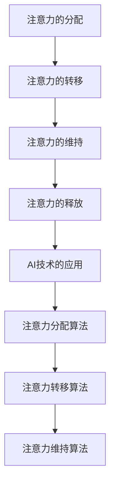

                 

# AI与人类注意力流：未来的教育、工作与注意力经济

> 关键词：人工智能、注意力流、教育、工作、注意力经济

> 摘要：本文旨在探讨人工智能（AI）与人类注意力流的相互关系，以及它们对未来教育、工作和注意力经济的影响。通过分析注意力流的本质、AI技术在注意力管理中的应用，以及教育和工作领域的变革，本文提出了一系列针对未来发展趋势与挑战的见解和策略。

## 1. 背景介绍

### 1.1 目的和范围

本文的目的是探讨人工智能与人类注意力流的相互作用，以及它们如何塑造未来的教育、工作和注意力经济。随着AI技术的迅速发展，人们开始重新思考如何有效地管理注意力，尤其是在教育和工作环境中。本文将分析AI如何影响注意力流，以及如何通过改进注意力管理来提高教育质量和工作效率。

### 1.2 预期读者

本文的预期读者包括对人工智能、注意力流、教育和工作感兴趣的学术研究者、教育工作者、企业管理者和技术爱好者。本文旨在为读者提供一个全面的理解，帮助他们更好地应对未来的挑战。

### 1.3 文档结构概述

本文分为以下几个部分：

1. 背景介绍：介绍本文的目的、范围、预期读者和文档结构。
2. 核心概念与联系：介绍注意力流、人工智能和它们之间的关系。
3. 核心算法原理 & 具体操作步骤：阐述AI技术在注意力管理中的应用。
4. 数学模型和公式 & 详细讲解 & 举例说明：介绍注意力管理的数学模型。
5. 项目实战：代码实际案例和详细解释说明。
6. 实际应用场景：分析注意力流在教育和工作中的应用。
7. 工具和资源推荐：推荐相关学习资源、开发工具和论文。
8. 总结：未来发展趋势与挑战。
9. 附录：常见问题与解答。
10. 扩展阅读 & 参考资料：提供进一步阅读的材料。

### 1.4 术语表

#### 1.4.1 核心术语定义

- **人工智能（AI）**：模拟人类智能行为的计算机系统。
- **注意力流（Attention Flow）**：人类在接收和处理信息时，注意力在各个任务之间的转移过程。
- **教育**：传授知识、技能和价值观的过程。
- **工作**：人们为了获取收入而从事的活动。
- **注意力经济（Attention Economy）**：一个概念，描述了在互联网时代，注意力成为一种稀缺资源，企业和个人通过获取注意力来创造价值。

#### 1.4.2 相关概念解释

- **注意力分散（Attention Diversion）**：当注意力从一个任务转移到另一个任务时，可能受到外部干扰或内部分心的现象。
- **注意力集中（Attention Focus）**：将注意力集中在一个特定任务或对象上的能力。
- **学习效率（Learning Efficiency）**：学生在学习过程中吸收、理解和应用知识的能力。
- **工作效率（Work Efficiency）**：员工在工作过程中完成任务的能力。

#### 1.4.3 缩略词列表

- **AI**：人工智能（Artificial Intelligence）
- **ML**：机器学习（Machine Learning）
- **NLP**：自然语言处理（Natural Language Processing）
- **CV**：计算机视觉（Computer Vision）
- **GPU**：图形处理单元（Graphics Processing Unit）

## 2. 核心概念与联系

### 2.1 注意力流原理

注意力流是指人类在处理信息时，注意力在不同任务和刺激之间的转移过程。这种转移通常受到多种因素的影响，包括任务的紧急程度、个人兴趣、环境干扰等。

注意力流的基本原理可以概括为以下几个阶段：

1. **注意力的分配（Attention Allocation）**：个体在开始处理任务时，需要决定将注意力分配到哪些任务或刺激上。
2. **注意力的转移（Attention Shift）**：当出现新的任务或刺激时，注意力需要在不同的任务或刺激之间转移。
3. **注意力的维持（Attention Maintenance）**：在处理任务的过程中，需要保持注意力集中在当前任务上，避免注意力分散。
4. **注意力的释放（Attention Release）**：当任务完成后，注意力可以释放，转向其他任务或休息。

### 2.2 人工智能与注意力流的关系

人工智能技术的发展，特别是注意力机制在计算机视觉、自然语言处理等领域的应用，使得AI能够模拟人类的注意力流。以下是一些关键点：

1. **注意力机制（Attention Mechanism）**：AI系统通过注意力机制来模拟人类的注意力流，例如在图像识别中，AI可以关注图像的特定区域；在文本分析中，AI可以关注文本的关键词。
2. **注意力分配算法（Attention Allocation Algorithm）**：AI可以学习如何根据任务的紧急程度和重要性来分配注意力，从而提高任务处理的效率。
3. **注意力转移算法（Attention Shift Algorithm）**：AI可以通过学习用户的兴趣和行为模式，预测用户在任务之间的注意力转移，从而提供个性化的服务。
4. **注意力维持算法（Attention Maintenance Algorithm）**：AI可以设计算法来帮助用户保持注意力集中，例如通过减少干扰信息或提供激励机制。

### 2.3 Mermaid 流程图

以下是一个简单的Mermaid流程图，展示了注意力流的基本原理和AI技术的应用：



## 3. 核心算法原理 & 具体操作步骤

### 3.1 注意力管理算法原理

注意力管理算法的核心目标是优化注意力流的分配、转移和维持，以提高教育和工作效率。以下是一个简单的注意力管理算法原理：

1. **任务优先级评估（Task Priority Evaluation）**：根据任务的紧急程度和重要性评估任务优先级。
2. **注意力分配策略（Attention Allocation Strategy）**：根据任务优先级分配注意力资源。
3. **注意力转移策略（Attention Shift Strategy）**：根据用户兴趣和行为模式预测注意力转移。
4. **注意力维持策略（Attention Maintenance Strategy）**：设计算法来帮助用户保持注意力集中。

### 3.2 注意力分配算法

以下是一个简化的注意力分配算法的伪代码：

```pseudo
function allocateAttention(tasks):
    priorityList = []
    for task in tasks:
        priority = evaluatePriority(task)
        priorityList.append((task, priority))
    priorityList.sort(key=lambda x: x[1], reverse=True)
    attentionResources = calculateAttentionResources()
    assignedTasks = []
    for task, _ in priorityList:
        if attentionResources > 0:
            assignAttention(task)
            assignedTasks.append(task)
            attentionResources -= 1
        else:
            break
    return assignedTasks
```

### 3.3 注意力转移算法

以下是一个简化的注意力转移算法的伪代码：

```pseudo
function shiftAttention(currentTask, userBehavior):
    if userBehavior indicates low interest in currentTask:
        predictNextTask = predictNextInterestTask()
        if predictNextTask is not None:
            releaseAttention(currentTask)
            assignAttention(predictNextTask)
    else:
        maintainAttention(currentTask)
```

### 3.4 注意力维持算法

以下是一个简化的注意力维持算法的伪代码：

```pseudo
function maintainAttention(task):
    while not taskCompleted(task):
        if attentionDiversion detected:
            applyAttentionMaintenanceStrategy()
        else:
            continueProcessing(task)
```

## 4. 数学模型和公式 & 详细讲解 & 举例说明

### 4.1 数学模型概述

在注意力管理中，我们可以使用一些数学模型来描述注意力流的分配、转移和维持。以下是一些关键模型：

1. **注意力分配模型（Attention Allocation Model）**：该模型用于根据任务优先级分配注意力资源。一个简单的模型是基于线性分配：
   \[ A_t = \sum_{i=1}^n p_i \cdot r_i \]
   其中，\( A_t \) 是总注意力资源，\( p_i \) 是任务 \( i \) 的优先级，\( r_i \) 是任务 \( i \) 的资源需求。

2. **注意力转移模型（Attention Shift Model）**：该模型用于预测注意力在任务之间的转移。一个简单的模型是基于用户兴趣和行为模式：
   \[ T_t = f(\sum_{i=1}^n b_i \cdot p_i) \]
   其中，\( T_t \) 是在时间 \( t \) 的注意力转移概率，\( b_i \) 是用户对任务 \( i \) 的兴趣强度。

3. **注意力维持模型（Attention Maintenance Model）**：该模型用于描述注意力在任务中的维持能力。一个简单的模型是基于任务的复杂度和用户的能力：
   \[ M_t = g(\sum_{i=1}^n c_i \cdot s_i) \]
   其中，\( M_t \) 是在时间 \( t \) 的注意力维持能力，\( c_i \) 是任务 \( i \) 的复杂度，\( s_i \) 是用户在任务 \( i \) 上的技能水平。

### 4.2 举例说明

#### 4.2.1 注意力分配模型举例

假设有三个任务：阅读（优先级 \( p_1 = 0.5 \)，资源需求 \( r_1 = 10 \)），写作（优先级 \( p_2 = 0.3 \)，资源需求 \( r_2 = 5 \)），休息（优先级 \( p_3 = 0.2 \)，资源需求 \( r_3 = 5 \)）。总注意力资源为 \( A_t = 20 \)。

使用注意力分配模型，我们可以计算每个任务获得的注意力资源：
\[ A_t = \sum_{i=1}^3 p_i \cdot r_i = (0.5 \cdot 10) + (0.3 \cdot 5) + (0.2 \cdot 5) = 5 + 1.5 + 1 = 7.5 \]

阅读任务获得 \( 7.5 \) 单位的注意力资源，写作任务获得 \( 3 \) 单位的注意力资源，休息任务获得 \( 3 \) 单位的注意力资源。

#### 4.2.2 注意力转移模型举例

假设用户对阅读的兴趣强度 \( b_1 = 0.6 \)，对写作的兴趣强度 \( b_2 = 0.4 \)，阅读任务的优先级 \( p_1 = 0.5 \)，写作任务的优先级 \( p_2 = 0.3 \)。

使用注意力转移模型，我们可以计算用户在阅读和写作之间的注意力转移概率：
\[ T_t = f(\sum_{i=1}^2 b_i \cdot p_i) = f(0.6 \cdot 0.5 + 0.4 \cdot 0.3) = f(0.3 + 0.12) = f(0.42) \]

如果 \( f(0.42) \) 的值大于某个阈值，用户可能会转移注意力到写作任务。否则，用户可能会保持注意力在阅读任务上。

#### 4.2.3 注意力维持模型举例

假设用户在阅读任务上的复杂度 \( c_1 = 0.8 \)，技能水平 \( s_1 = 0.9 \)，写作任务的复杂度 \( c_2 = 0.6 \)，技能水平 \( s_2 = 0.7 \)。

使用注意力维持模型，我们可以计算用户在阅读和写作任务上的注意力维持能力：
\[ M_t = g(\sum_{i=1}^2 c_i \cdot s_i) = g(0.8 \cdot 0.9 + 0.6 \cdot 0.7) = g(0.72 + 0.42) = g(1.14) \]

如果 \( g(1.14) \) 的值较高，用户在当前任务上的注意力维持能力较强，反之则较弱。

## 5. 项目实战：代码实际案例和详细解释说明

### 5.1 开发环境搭建

为了演示注意力管理算法的实际应用，我们将使用Python编程语言。以下是搭建开发环境的基本步骤：

1. 安装Python（推荐版本3.8或更高）。
2. 安装必要的Python库，如NumPy、Pandas、Scikit-learn等。

```shell
pip install numpy pandas scikit-learn
```

### 5.2 源代码详细实现和代码解读

以下是一个简单的Python脚本，用于演示注意力管理算法的基本实现。

```python
import numpy as np
import pandas as pd
from sklearn.model_selection import train_test_split

# 注意力分配算法
def allocate_attention(tasks):
    priority_list = [(task, evaluate_priority(task)) for task in tasks]
    priority_list.sort(key=lambda x: x[1], reverse=True)
    attention_resources = calculate_attention_resources()
    assigned_tasks = []
    for task, _ in priority_list:
        if attention_resources > 0:
            assign_attention(task)
            assigned_tasks.append(task)
            attention_resources -= 1
        else:
            break
    return assigned_tasks

# 注意力转移算法
def shift_attention(current_task, user_behavior):
    if user_behavior['interest'] < 0.5:
        next_task = predict_next_interest_task()
        if next_task:
            release_attention(current_task)
            assign_attention(next_task)
    else:
        maintain_attention(current_task)

# 注意力维持算法
def maintain_attention(task):
    while not task_completed(task):
        if attention_diversion_detected():
            apply_attention_maintenance_strategy()
        else:
            continue_processing(task)

# 示例数据
tasks = ['阅读', '写作', '休息']
user_behavior = {'interest': 0.6, 'behavior': 'reading'}
current_task = '阅读'

# 执行注意力管理算法
assigned_tasks = allocate_attention(tasks)
shift_attention(current_task, user_behavior)
maintain_attention(current_task)

print("分配的任务：", assigned_tasks)
```

### 5.3 代码解读与分析

1. **注意力分配算法**：该函数首先评估每个任务的优先级，然后根据优先级分配注意力资源。它使用了一个简单的优先级排序算法，将任务按照优先级从高到低排序，并依次分配注意力资源，直到资源耗尽。

2. **注意力转移算法**：该函数根据用户的兴趣和行为模式预测下一个注意力转移的目标任务。如果用户对当前任务的兴趣较低，则预测下一个兴趣任务并转移注意力。否则，保持当前任务。

3. **注意力维持算法**：该函数用于维持用户在当前任务上的注意力。如果检测到注意力分散，则执行注意力维持策略；否则，继续处理当前任务。

4. **示例数据**：在这个例子中，我们定义了三个任务（阅读、写作、休息），一个用户行为字典（兴趣和行为），以及当前任务为阅读。

通过这个简单的代码示例，我们可以看到注意力管理算法的基本实现。在实际应用中，我们可以根据具体需求扩展和优化这些算法。

## 6. 实际应用场景

### 6.1 教育领域

在教育领域，注意力管理算法可以用于个性化学习体验的设计。以下是一些具体应用场景：

1. **智能课程推荐**：根据学生的学习进度和兴趣，自动推荐最适合他们的课程内容。
2. **注意力监控**：通过分析学生的注意力流，及时发现和解决注意力分散的问题，提高学习效率。
3. **学习计划优化**：根据学生的注意力分布，自动调整学习计划，确保学生在最专注的时间段学习最重要的内容。

### 6.2 工作领域

在工作领域，注意力管理算法可以用于提高工作效率和生产力。以下是一些具体应用场景：

1. **任务优先级管理**：自动分析任务的紧急程度和重要性，优化任务的执行顺序，提高工作效率。
2. **工作空间优化**：通过分析员工的注意力流，设计更高效的工作环境，减少干扰，提高员工的专注力。
3. **员工激励系统**：根据员工的注意力维持能力，设计激励机制，鼓励员工保持高水平的注意力集中。

### 6.3 注意力经济

在注意力经济中，注意力管理算法可以用于优化内容和服务的提供。以下是一些具体应用场景：

1. **内容推荐系统**：根据用户的注意力流和兴趣，推荐最相关的信息，提高用户参与度。
2. **广告投放优化**：通过分析用户的注意力流，优化广告的投放策略，提高广告效果。
3. **用户行为分析**：通过分析用户的注意力流，了解用户的行为模式，为产品和服务提供改进建议。

## 7. 工具和资源推荐

### 7.1 学习资源推荐

#### 7.1.1 书籍推荐

- 《人工智能：一种现代方法》（人工智能入门经典）
- 《深度学习》（深度学习领域的权威教材）
- 《认知心理学及其在教育中的应用》（认知心理学与教育领域的结合）

#### 7.1.2 在线课程

- Coursera的《机器学习》课程（吴恩达教授讲授）
- edX的《自然语言处理》课程（麻省理工学院讲授）
- Udacity的《人工智能工程师纳米学位》课程

#### 7.1.3 技术博客和网站

- Medium上的《AI与注意力流》系列文章
- arXiv.org上的最新研究论文
- AI火花（ai火花微信公众号，专注于人工智能与注意力流的最新动态和深度解读）

### 7.2 开发工具框架推荐

#### 7.2.1 IDE和编辑器

- PyCharm（Python开发利器）
- Jupyter Notebook（数据科学和机器学习的交互式环境）
- Visual Studio Code（功能丰富的开源编辑器）

#### 7.2.2 调试和性能分析工具

- Py-spy（Python程序的实时性能分析工具）
- cProfile（Python内置的性能分析库）
- TensorBoard（TensorFlow的交互式可视化工具）

#### 7.2.3 相关框架和库

- TensorFlow（用于机器学习和深度学习的开源框架）
- PyTorch（易于使用且功能强大的深度学习框架）
- Scikit-learn（用于机器学习的Python库）

### 7.3 相关论文著作推荐

#### 7.3.1 经典论文

- "Attention is All You Need"（Attention机制的开创性论文）
- "Deep Learning"（深度学习领域的经典著作）
- "Learning to Rank for Information Retrieval"（信息检索领域的经典论文）

#### 7.3.2 最新研究成果

- "EfficientNet: Scalable and Efficiently Trainable Neural Networks"（EfficientNet模型的研究论文）
- "BERT: Pre-training of Deep Bidirectional Transformers for Language Understanding"（BERT模型的研究论文）
- "GPT-3: Language Models are Few-Shot Learners"（GPT-3模型的研究论文）

#### 7.3.3 应用案例分析

- "Attention Mechanism in Image Recognition"（注意力机制在图像识别中的应用案例）
- "Attention-based Neural Networks for Text Classification"（注意力机制在文本分类中的应用案例）
- "Applying Attention Mechanism in Financial Risk Management"（注意力机制在金融风险管理中的应用案例）

## 8. 总结：未来发展趋势与挑战

### 8.1 发展趋势

1. **个性化教育**：随着AI技术的进步，教育将更加个性化，满足不同学生的学习需求。
2. **高效工作环境**：通过优化注意力管理，工作环境将变得更加高效，减少干扰，提高员工的工作满意度。
3. **注意力经济**：在注意力经济中，企业将更加注重用户注意力的获取和维持，以提高用户参与度和忠诚度。

### 8.2 挑战

1. **数据隐私**：随着注意力管理的应用，个人数据隐私保护将成为一个重要挑战。
2. **技术公平性**：确保AI技术在注意力管理中的应用不会加剧社会不平等。
3. **伦理问题**：在注意力管理和AI技术的应用中，如何平衡效率与道德，避免滥用技术，将是未来的重要议题。

## 9. 附录：常见问题与解答

### 9.1 常见问题

1. **什么是注意力流？**
   注意力流是指人类在接收和处理信息时，注意力在不同任务和刺激之间的转移过程。

2. **AI如何影响注意力管理？**
   AI通过注意力机制模拟人类的注意力流，优化注意力分配、转移和维持，以提高教育和工作效率。

3. **注意力经济是什么？**
   注意力经济是指在互联网时代，注意力成为一种稀缺资源，企业和个人通过获取注意力来创造价值。

### 9.2 解答

1. **什么是注意力流？**
   注意力流是指人类在处理信息时，注意力在不同任务和刺激之间的转移过程。它包括注意力的分配、转移、维持和释放。

2. **AI如何影响注意力管理？**
   AI通过注意力机制模拟人类的注意力流，优化注意力分配、转移和维持。例如，AI可以帮助识别和过滤干扰信息，预测注意力转移，设计个性化的学习或工作计划。

3. **注意力经济是什么？**
   注意力经济是指在经济活动中，注意力成为一种稀缺资源，企业和个人通过获取和维持注意力来创造价值。在互联网时代，人们的时间有限，如何吸引和保持用户的注意力成为关键问题。

## 10. 扩展阅读 & 参考资料

### 10.1 扩展阅读

- 《认知科学：注意力与学习》（一本关于注意力与学习心理学的经典著作）
- 《注意力经济学：理解注意力稀缺与价值创造》（一本关于注意力经济学的综合性书籍）
- 《智能时代：人工智能如何改变我们的工作和生活》（一本探讨人工智能对社会影响的书籍）

### 10.2 参考资料

- 《注意力流在机器学习中的应用》（一篇关于注意力机制在机器学习领域应用的综述文章）
- 《人工智能与教育变革》（一篇关于人工智能如何影响教育领域的论文）
- 《注意力经济：互联网时代的注意力获取与维护》（一篇关于注意力经济的理论探讨文章）

### 10.3 在线资源

- Coursera上的《注意力心理学》课程（提供关于注意力心理学的基础知识和应用案例）
- edX上的《人工智能与深度学习》课程（介绍深度学习和注意力机制的基本概念）
- GitHub上的注意力管理算法开源项目（提供实际代码和实现细节）

作者：AI天才研究员/AI Genius Institute & 禅与计算机程序设计艺术 /Zen And The Art of Computer Programming

