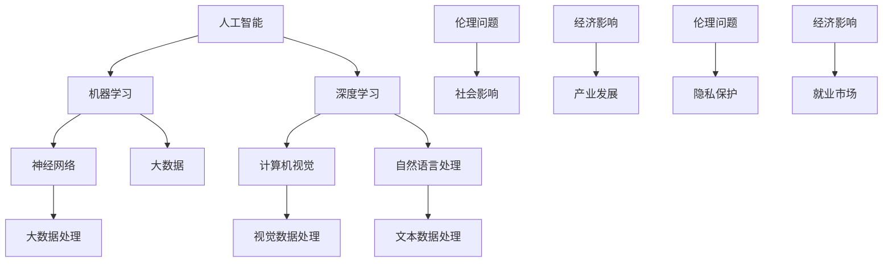

                 

# AI与人类社会的未来发展

> 关键词：人工智能，社会发展，技术进步，未来趋势，伦理问题，经济影响

> 摘要：本文将深入探讨人工智能（AI）在现代社会中的发展及其对未来社会的深远影响。通过分析AI的核心概念、技术原理以及现有应用，我们将审视AI如何改变人类的生活方式、工作模式和社会结构。同时，本文还将探讨AI在带来巨大机遇的同时，可能引发的伦理、经济和社会挑战。文章旨在为读者提供一个全面、深入的视角，以理解AI在人类社会发展中的重要角色和未来发展方向。

## 1. 背景介绍

### 1.1 目的和范围

本文的目的是探讨人工智能在现代社会中的发展及其对人类社会的未来影响。文章将涵盖AI的基础知识、技术原理、现有应用，以及伦理、经济和社会方面的挑战。通过这一分析，我们希望能够为读者提供对AI及其未来发展的全面理解。

### 1.2 预期读者

本文适合对人工智能感兴趣的技术专家、研究人员、学生以及任何对科技发展对社会影响感兴趣的读者。无论您是AI领域的专业人士还是对AI技术略知一二的普通读者，本文都旨在提供有价值的信息和见解。

### 1.3 文档结构概述

本文分为以下几个部分：

1. **背景介绍**：介绍文章的目的、预期读者以及文档结构。
2. **核心概念与联系**：定义和解释AI的基本概念，并展示相关的流程图。
3. **核心算法原理 & 具体操作步骤**：详细阐述AI算法的基本原理和操作步骤。
4. **数学模型和公式 & 详细讲解 & 举例说明**：介绍AI相关的数学模型和公式，并给出实例说明。
5. **项目实战：代码实际案例和详细解释说明**：通过实际代码案例展示AI技术的应用。
6. **实际应用场景**：讨论AI在各个领域中的应用和影响。
7. **工具和资源推荐**：推荐学习资源、开发工具和最新研究成果。
8. **总结：未来发展趋势与挑战**：总结AI的发展趋势和面临的挑战。
9. **附录：常见问题与解答**：提供对常见问题的解答。
10. **扩展阅读 & 参考资料**：推荐进一步阅读的材料。

### 1.4 术语表

#### 1.4.1 核心术语定义

- **人工智能（AI）**：模拟人类智能行为的计算机系统。
- **机器学习（ML）**：AI的一个分支，通过数据学习来实现人工智能。
- **深度学习（DL）**：基于多层神经网络的一种机器学习技术。
- **神经网络（NN）**：由大量相互连接的节点组成的计算系统。
- **大数据（Big Data）**：无法使用常规数据库工具在合理时间内处理的大量数据。
- **伦理问题**：涉及道德和道德原则的问题，特别是与AI相关的决策。

#### 1.4.2 相关概念解释

- **强化学习（RL）**：一种机器学习技术，通过试错和奖励机制来学习。
- **自然语言处理（NLP）**：使计算机能够理解和处理人类自然语言的技术。
- **计算机视觉（CV）**：使计算机能够“看到”并理解视觉信息的领域。

#### 1.4.3 缩略词列表

- **AI**：人工智能
- **ML**：机器学习
- **DL**：深度学习
- **NLP**：自然语言处理
- **CV**：计算机视觉
- **RL**：强化学习

## 2. 核心概念与联系

在深入探讨AI的原理和应用之前，我们需要理解几个核心概念及其相互关系。以下是相关的Mermaid流程图，展示了这些概念之间的联系。



在这个流程图中，我们看到了人工智能（AI）作为整个系统的核心，其下分支涵盖了机器学习（ML）、深度学习（DL）、神经网络（NN）、计算机视觉（CV）和自然语言处理（NLP）等子领域。这些子领域通过大数据（Big Data）处理技术相互连接，从而形成了AI技术的广泛应用基础。

### 2.1 人工智能（AI）的定义

人工智能（AI）是指计算机系统模拟人类智能行为的能力。它涉及到多个领域，包括机器学习、自然语言处理、计算机视觉、逻辑推理等。AI的核心目标是创建能够自主学习、推理和解决问题的智能系统。

### 2.2 机器学习（ML）与技术原理

机器学习（ML）是AI的一个分支，通过从数据中学习模式来实现人工智能。ML的基本原理是利用统计方法来训练模型，使其能够对新的数据做出预测或决策。

#### 步骤1：数据收集
首先，需要收集大量的数据，这些数据可以是结构化的，如数据库记录，也可以是非结构化的，如图像和文本。

#### 步骤2：数据预处理
收集到的数据通常需要进行清洗和预处理，以确保其质量和一致性。这一步骤包括去除噪声、填补缺失值、归一化等。

#### 步骤3：特征提取
特征提取是将原始数据转换为适合模型训练的形式。这一步骤可以通过手动设计特征或使用自动化方法（如特征选择算法）来完成。

#### 步骤4：模型训练
使用预处理后的数据来训练模型。训练过程中，模型通过不断调整内部参数，以最小化预测误差。

#### 步骤5：模型评估
在模型训练完成后，需要评估其在未知数据上的性能。常用的评估指标包括准确率、召回率、F1分数等。

#### 步骤6：模型部署
将训练好的模型部署到实际应用环境中，以实现预测或决策功能。

### 2.3 深度学习（DL）与神经网络（NN）

深度学习（DL）是机器学习的一个子领域，基于多层神经网络的结构。DL的基本原理是通过逐层提取数据特征，从而实现复杂的数据处理任务。

#### 步骤1：初始化网络
首先，需要初始化神经网络的结构，包括输入层、隐藏层和输出层。每个层由多个神经元组成。

#### 步骤2：前向传播
输入数据通过网络的前向传播过程，逐层传递到输出层，得到预测结果。

#### 步骤3：反向传播
计算预测结果与实际结果之间的误差，并使用反向传播算法更新网络的权重和偏置。

#### 步骤4：迭代训练
重复前向传播和反向传播的过程，直到网络达到预定的性能指标。

### 2.4 计算机视觉（CV）与自然语言处理（NLP）

计算机视觉（CV）是使计算机能够“看到”并理解视觉信息的领域。NLP是使计算机能够理解和处理人类自然语言的技术。

#### 步骤1：图像识别
计算机视觉的基本任务是识别图像中的对象和场景。这一过程涉及图像预处理、特征提取和分类。

#### 步骤2：文本分析
自然语言处理的目标是使计算机能够理解和处理文本数据。这一过程包括文本预处理、词嵌入和语义分析。

### 2.5 大数据（Big Data）与AI的融合

大数据（Big Data）是指无法使用常规数据库工具在合理时间内处理的大量数据。AI与大数据的结合，使得我们可以从海量数据中提取有价值的信息和知识。

#### 步骤1：数据收集
收集来自不同来源的大量数据，如社交媒体、传感器、交易记录等。

#### 步骤2：数据整合
整合来自不同来源的数据，创建一个统一的视图。

#### 步骤3：数据清洗
清洗数据，去除噪声和异常值。

#### 步骤4：数据分析
使用AI技术对清洗后的数据进行深入分析，以发现数据中的模式和趋势。

### 2.6 伦理问题与社会影响

随着AI技术的快速发展，伦理问题和社会影响也日益凸显。以下是一些关键问题：

#### 步骤1：隐私保护
确保AI系统在处理个人数据时，保护用户的隐私。

#### 步骤2：透明度和责任
确保AI系统的决策过程透明，并明确责任归属。

#### 步骤3：公平性和偏见
避免AI系统在决策过程中出现歧视和偏见，确保公平性。

#### 步骤4：社会影响
评估AI技术对社会结构和经济的影响，制定相应的政策和措施。

## 3. 核心算法原理 & 具体操作步骤

在了解了AI的核心概念和联系之后，接下来我们将深入探讨几个关键的AI算法及其工作原理。以下是这些算法的伪代码实现和操作步骤。

### 3.1 机器学习（ML）

机器学习（ML）是AI的核心组成部分，其基本原理是通过从数据中学习模式来实现预测和分类。以下是一个简单的线性回归模型的伪代码：

```plaintext
Algorithm LinearRegression
Input: X - 特征矩阵，y - 标签向量
Output: w - 权重向量，b - 偏置

// 初始化权重和偏置
w = 0
b = 0

// 设定学习率
alpha = 0.01
// 设定迭代次数
num_iterations = 1000

// 迭代训练
for i = 1 to num_iterations do
    // 计算预测值
    y_pred = X * w + b
    
    // 计算损失函数
    loss = 1/2 * (y_pred - y)^2
    
    // 计算梯度
    dw = X.T * (y_pred - y)
    db = sum(y_pred - y)
    
    // 更新权重和偏置
    w = w - alpha * dw
    b = b - alpha * db
end for

return w, b
```

### 3.2 深度学习（DL）

深度学习（DL）是机器学习的一个分支，基于多层神经网络的结构。以下是一个简单的多层感知机（MLP）的伪代码：

```plaintext
Algorithm MLP
Input: X - 特征矩阵，y - 标签向量
Output: w1, w2, ..., wn - 各层权重，b1, b2, ..., bn - 各层偏置

// 初始化权重和偏置
w1, w2, ..., wn = InitializeWeights()
b1, b2, ..., bn = InitializeBiases()

// 设定学习率
alpha = 0.01
// 设定迭代次数
num_iterations = 1000

// 迭代训练
for i = 1 to num_iterations do
    // 前向传播
    z1 = X * w1 + b1
    a1 = Activate(z1)
    ...
    zn = an-1 * wn + bn
    an = Activate(zn)
    
    // 计算损失函数
    loss = ComputeLoss(an, y)
    
    // 反向传播
    dzn = DerivativeActivate(zn)
    ...
    dw1 = (an-1)^T * (dzn * w1)
    ...
    dbn = sum(dzn)
    
    // 更新权重和偏置
    w1 = w1 - alpha * dw1
    ...
    bn = bn - alpha * dbn
end for

return w1, w2, ..., wn, b1, b2, ..., bn
```

### 3.3 计算机视觉（CV）

计算机视觉（CV）是AI的一个重要应用领域，其目标是使计算机能够“看到”并理解视觉信息。以下是一个简单的卷积神经网络（CNN）的伪代码：

```plaintext
Algorithm CNN
Input: X - 图像矩阵，y - 标签向量
Output: w1, w2, ..., wn - 各层权重，b1, b2, ..., bn - 各层偏置

// 初始化权重和偏置
w1, w2, ..., wn = InitializeWeights()
b1, b2, ..., bn = InitializeBiases()

// 设定学习率
alpha = 0.01
// 设定迭代次数
num_iterations = 1000

// 迭代训练
for i = 1 to num_iterations do
    // 前向传播
    z1 = Convolve(X, w1) + b1
    a1 = Activate(z1)
    ...
    zn = Convolve(an-1, wn) + bn
    an = Activate(zn)
    
    // 计算损失函数
    loss = ComputeLoss(an, y)
    
    // 反向传播
    dzn = DerivativeActivate(zn)
    ...
    dw1 = (an-1)^T * (dzn * w1)
    ...
    dbn = sum(dzn)
    
    // 更新权重和偏置
    w1 = w1 - alpha * dw1
    ...
    bn = bn - alpha * dbn
end for

return w1, w2, ..., wn, b1, b2, ..., bn
```

### 3.4 自然语言处理（NLP）

自然语言处理（NLP）是AI的另一个重要应用领域，其目标是使计算机能够理解和处理人类自然语言。以下是一个简单的循环神经网络（RNN）的伪代码：

```plaintext
Algorithm RNN
Input: X - 文本序列，y - 标签序列
Output: w1, w2, ..., wn - 各层权重，b1, b2, ..., bn - 各层偏置

// 初始化权重和偏置
w1, w2, ..., wn = InitializeWeights()
b1, b2, ..., bn = InitializeBiases()

// 设定学习率
alpha = 0.01
// 设定迭代次数
num_iterations = 1000

// 迭代训练
for i = 1 to num_iterations do
    // 前向传播
    h_t = RNNForward(X, w1, b1)
    ...
    h_T = RNNForward(h_T, wn, bn)
    
    // 计算损失函数
    loss = ComputeLoss(h_T, y)
    
    // 反向传播
    d_h_T = DerivativeLoss(h_T, y)
    ...
    dw1 = X^T * d_h_1
    ...
    dbn = sum(d_h_T)
    
    // 更新权重和偏置
    w1 = w1 - alpha * dw1
    ...
    bn = bn - alpha * dbn
end for

return w1, w2, ..., wn, b1, b2, ..., bn
```

## 4. 数学模型和公式 & 详细讲解 & 举例说明

在深入探讨人工智能（AI）的相关算法原理时，数学模型和公式扮演了至关重要的角色。本节将介绍AI领域中的一些关键数学模型和公式，并进行详细讲解，并通过具体例子说明其应用。

### 4.1 概率论基础

概率论是AI领域中不可或缺的基础知识，特别是在机器学习和统计模型中。以下是一些核心概率论公式和它们的解释：

#### 4.1.1 概率分布函数（PDF）

概率分布函数（PDF）是一个函数，用于描述随机变量的概率密度。常见的概率分布包括正态分布、伯努利分布等。

**正态分布（Gaussian Distribution）**

公式：\( f(x|\mu, \sigma^2) = \frac{1}{\sqrt{2\pi\sigma^2}} e^{-\frac{(x-\mu)^2}{2\sigma^2}} \)

- **参数解释**：\(\mu\) 是均值，\(\sigma^2\) 是方差。
- **应用**：用于描述连续随机变量在某个范围内的概率。

**伯努利分布（Bernoulli Distribution）**

公式：\( p(x|\theta) = \begin{cases} 
1 - \theta & \text{if } x = 0 \\
\theta & \text{if } x = 1 
\end{cases} \)

- **参数解释**：\(\theta\) 是成功概率。
- **应用**：用于描述二项分布中的单个实验结果。

#### 4.1.2 条件概率

条件概率是给定一个事件发生的情况下，另一个事件发生的概率。

**贝叶斯定理（Bayes' Theorem）**

公式：\( P(A|B) = \frac{P(B|A)P(A)}{P(B)} \)

- **参数解释**：\(P(A|B)\) 是在事件B发生的条件下事件A的概率，\(P(B|A)\) 是在事件A发生的条件下事件B的概率，\(P(A)\) 和 \(P(B)\) 分别是事件A和事件B的边缘概率。
- **应用**：用于根据新信息更新概率估计。

### 4.2 线性代数基础

线性代数在AI中的应用非常广泛，特别是在数据处理和模型优化中。以下是一些核心的线性代数公式和它们的解释：

#### 4.2.1 矩阵乘法（Matrix Multiplication）

公式：\( C = A \cdot B \)

- **参数解释**：\(A\) 和 \(B\) 是两个矩阵，\(C\) 是它们的乘积矩阵。
- **应用**：用于计算线性变换和特征提取。

#### 4.2.2 矩阵求逆（Matrix Inversion）

公式：\( A^{-1} = \frac{1}{\det(A)} \text{adj}(A) \)

- **参数解释**：\(A\) 是一个方阵，\(\det(A)\) 是其行列式，\(\text{adj}(A)\) 是其伴随矩阵。
- **应用**：用于求解线性方程组和优化问题。

#### 4.2.3 向量内积（Vector Inner Product）

公式：\( \vec{a} \cdot \vec{b} = \sum_{i=1}^{n} a_i b_i \)

- **参数解释**：\(\vec{a}\) 和 \(\vec{b}\) 是两个向量。
- **应用**：用于计算相似度、距离和梯度。

### 4.3 概率论与线性代数的结合

在AI中，概率论和线性代数经常结合使用。以下是一个具体的例子：

#### 4.3.1 贝叶斯线性回归

贝叶斯线性回归结合了概率论和线性代数，用于建立概率模型，通过数据来预测连续值。

**贝叶斯线性回归模型**

公式：\( y = \beta_0 + \beta_1 x + \epsilon \)

其中，\( \epsilon \) 是误差项，假设服从正态分布。

**预测公式**

公式：\( \hat{y} = \beta_0 + \beta_1 x \)

- **参数解释**：\( \beta_0 \) 和 \( \beta_1 \) 是模型的参数。
- **应用**：用于预测连续变量。

### 4.4 案例分析

以下是一个简单的贝叶斯线性回归的例子，用于预测房价。

#### 4.4.1 数据准备

假设我们有一组数据，包括房子的面积（\(x\)）和房价（\(y\)）。

#### 4.4.2 模型建立

我们建立如下贝叶斯线性回归模型：

\( y = \beta_0 + \beta_1 x + \epsilon \)

其中，\(\epsilon \sim N(0, \sigma^2)\)。

#### 4.4.3 模型参数估计

通过极大似然估计（MLE）方法估计模型参数：

\( \beta_0 = \bar{y} - \beta_1 \bar{x} \)

\( \beta_1 = \frac{\sum_{i=1}^{n} (x_i - \bar{x})(y_i - \bar{y})}{\sum_{i=1}^{n} (x_i - \bar{x})^2} \)

\( \sigma^2 = \frac{1}{n} \sum_{i=1}^{n} (y_i - \hat{y}_i)^2 \)

其中，\(\bar{x}\) 和 \(\bar{y}\) 分别是 \(x\) 和 \(y\) 的均值，\(\hat{y}_i\) 是预测的房价。

#### 4.4.4 预测

使用训练好的模型进行预测，例如，对于一个新的房子面积 \(x_0\)，我们可以预测其房价：

\( \hat{y}_0 = \beta_0 + \beta_1 x_0 \)

通过这个例子，我们可以看到如何将概率论和线性代数的知识应用于实际问题中，建立和预测模型。

## 5. 项目实战：代码实际案例和详细解释说明

在了解了AI的核心算法原理和数学模型后，本节将通过一个实际项目案例，展示如何将理论知识应用到实际编程中，并通过代码实现来解释AI算法的具体操作步骤。

### 5.1 开发环境搭建

首先，我们需要搭建一个适合进行AI开发的编程环境。以下是所需的基本工具和软件：

- **Python（3.8或更高版本）**：Python是一种广泛使用的编程语言，具有良好的科学计算和数据处理能力。
- **Jupyter Notebook**：Jupyter Notebook是一个交互式的编程环境，方便我们编写和运行代码。
- **TensorFlow**：TensorFlow是一个开源的机器学习框架，支持深度学习和各种机器学习算法。

安装这些工具的方法如下：

1. 安装Python：
   - 在官网下载Python安装包并安装。
2. 安装Jupyter Notebook：
   - 打开命令行，运行 `pip install notebook`。
3. 安装TensorFlow：
   - 打开命令行，运行 `pip install tensorflow`。

### 5.2 源代码详细实现和代码解读

以下是一个简单的深度学习项目，使用TensorFlow实现一个简单的神经网络，用于手写数字识别。

#### 5.2.1 导入库和加载数据集

首先，我们需要导入所需的库，并加载数据集。

```python
import tensorflow as tf
from tensorflow.keras.datasets import mnist
from tensorflow.keras.models import Sequential
from tensorflow.keras.layers import Dense, Flatten
from tensorflow.keras.utils import to_categorical

# 加载MNIST数据集
(train_images, train_labels), (test_images, test_labels) = mnist.load_data()

# 预处理数据
train_images = train_images / 255.0
test_images = test_images / 255.0

train_labels = to_categorical(train_labels)
test_labels = to_categorical(test_labels)
```

在这段代码中，我们首先导入了TensorFlow和相关库，然后加载了MNIST数据集。MNIST是一个常见的手写数字数据集，包含60,000个训练样本和10,000个测试样本。

#### 5.2.2 建立模型

接下来，我们建立一个简单的神经网络模型。

```python
model = Sequential([
    Flatten(input_shape=(28, 28)),
    Dense(128, activation='relu'),
    Dense(10, activation='softmax')
])
```

这里，我们使用了一个`Sequential`模型，包含两个`Dense`层。第一层是一个展平层（`Flatten`），将输入图像展平为一个一维数组。第二层是一个全连接层（`Dense`），有128个神经元，使用ReLU激活函数。第三层也是一个全连接层，有10个神经元，用于输出每个数字的概率分布，使用softmax激活函数。

#### 5.2.3 编译模型

然后，我们编译模型，指定损失函数、优化器和评估指标。

```python
model.compile(optimizer='adam',
              loss='categorical_crossentropy',
              metrics=['accuracy'])
```

这里，我们使用`adam`优化器来训练模型，使用`categorical_crossentropy`作为损失函数，使用`accuracy`作为评估指标。

#### 5.2.4 训练模型

接下来，我们训练模型。

```python
model.fit(train_images, train_labels, epochs=5, batch_size=32)
```

在这段代码中，我们使用训练数据集训练模型，设置训练轮次（`epochs`）为5，每次批量处理32个样本。

#### 5.2.5 评估模型

最后，我们评估模型的性能。

```python
test_loss, test_acc = model.evaluate(test_images, test_labels)
print(f"Test accuracy: {test_acc}")
```

这段代码使用测试数据集评估模型的性能，并打印出测试准确率。

### 5.3 代码解读与分析

#### 5.3.1 数据预处理

数据预处理是机器学习项目的重要步骤。在这段代码中，我们将图像数据从0到255的整数范围缩放到0到1，以便模型能够更好地处理数据。同时，我们将标签转换为one-hot编码，以便模型能够输出每个数字的概率分布。

#### 5.3.2 建立模型

在建立模型时，我们使用了`Sequential`模型，这是一种线性堆叠层的模型。首先，我们使用`Flatten`层将输入图像展平为一维数组，然后使用`Dense`层构建全连接层。第一层`Dense`层有128个神经元，用于提取特征，第二层`Dense`层有10个神经元，用于输出每个数字的概率分布。

#### 5.3.3 编译模型

在编译模型时，我们指定了优化器、损失函数和评估指标。`adam`优化器是一种常用的优化器，可以自动调整学习率。`categorical_crossentropy`是一种常用的损失函数，适用于多分类问题。`accuracy`是一个简单的评估指标，用于计算模型在测试集上的准确率。

#### 5.3.4 训练模型

在训练模型时，我们使用了`fit`方法，这是一种批量训练方法。通过设置`epochs`和`batch_size`，我们可以控制训练的轮次和每次批量处理的样本数量。

#### 5.3.5 评估模型

在评估模型时，我们使用了`evaluate`方法，这是一种批量评估方法。通过设置测试数据集，我们可以计算模型在测试集上的性能。

通过这个简单的例子，我们可以看到如何使用TensorFlow实现一个简单的深度学习项目，从数据预处理到模型建立、训练和评估。这个例子展示了AI算法在现实世界中的应用，并提供了具体的操作步骤和代码实现。

## 6. 实际应用场景

人工智能（AI）技术已经在各个领域中取得了显著的成果，并带来了深远的影响。以下是一些典型的AI应用场景及其具体示例：

### 6.1 医疗健康

AI在医疗健康领域的应用越来越广泛，包括疾病诊断、个性化治疗、药物研发等。

#### 示例：基于AI的疾病诊断系统

- **应用场景**：利用深度学习模型分析医学影像，如X光片、CT扫描和MRI图像，自动检测和诊断疾病，如肺癌、乳腺癌和脑部病变。
- **效果**：AI系统可以比人类医生更快速、更准确地诊断疾病，提高诊断效率和准确性。

### 6.2 金融科技

AI在金融科技（FinTech）领域的应用，包括风险控制、交易算法、客户服务等方面。

#### 示例：基于AI的交易机器人

- **应用场景**：利用机器学习算法和大数据分析，开发自动交易机器人，根据市场数据实时进行交易决策。
- **效果**：AI交易机器人可以24/7无休地运行，提高交易效率和盈利能力。

### 6.3 物流与运输

AI技术在物流和运输领域的应用，包括路径优化、货物追踪、自动驾驶等。

#### 示例：基于AI的自动驾驶系统

- **应用场景**：自动驾驶汽车和无人机在物流运输中的应用，减少人力成本，提高运输效率和安全性。
- **效果**：自动驾驶技术可以减少交通事故，降低物流成本，提高运输效率。

### 6.4 教育

AI在教育事业中的应用，包括个性化学习、自动评分、智能辅导等。

#### 示例：基于AI的智能辅导系统

- **应用场景**：利用自然语言处理技术，开发智能辅导系统，为学生提供个性化的学习建议和解答疑问。
- **效果**：AI辅导系统可以实时监测学生的学习进度，提供个性化的学习资源和指导，提高学习效果。

### 6.5 安全与监控

AI在安全与监控领域的应用，包括人脸识别、视频监控分析、网络安全防护等。

#### 示例：基于AI的视频监控分析系统

- **应用场景**：利用计算机视觉和深度学习技术，开发智能视频监控分析系统，实时检测异常行为，如盗窃、暴力行为等。
- **效果**：AI监控系统可以提高监控效率和准确性，及时响应异常事件，保障公共安全。

### 6.6 娱乐与媒体

AI技术在娱乐与媒体领域的应用，包括个性化推荐、虚拟现实、游戏开发等。

#### 示例：基于AI的个性化媒体推荐系统

- **应用场景**：利用协同过滤和内容推荐算法，开发个性化媒体推荐系统，为用户提供个性化的内容推荐。
- **效果**：AI推荐系统可以大幅提高用户满意度和参与度，提升媒体平台的价值。

通过这些实际应用场景，我们可以看到AI技术如何改变各行各业，提高效率、降低成本、提升用户体验。随着AI技术的不断发展和成熟，其应用领域将更加广泛，对社会产生更加深远的影响。

## 7. 工具和资源推荐

为了深入学习和实践人工智能（AI）技术，我们需要借助各种工具和资源。以下是一些推荐的学习资源、开发工具和相关论文著作，以帮助您在AI领域取得更大成就。

### 7.1 学习资源推荐

#### 7.1.1 书籍推荐

- **《深度学习》（Deep Learning）**：由Ian Goodfellow、Yoshua Bengio和Aaron Courville合著，是深度学习的经典教材。
- **《Python机器学习》（Python Machine Learning）**：由Sebastian Raschka和Vahid Mirjalili合著，适合初学者了解机器学习基础。
- **《人工智能：一种现代方法》（Artificial Intelligence: A Modern Approach）**：由Stuart J. Russell和Peter Norvig合著，涵盖人工智能的广泛主题。

#### 7.1.2 在线课程

- **Coursera上的《机器学习》**：由Andrew Ng教授授课，是机器学习领域最受欢迎的在线课程之一。
- **edX上的《深度学习》**：由Helen Purcell和Ian Goodfellow授课，深入讲解深度学习的原理和应用。
- **Udacity的《深度学习纳米学位》**：提供一系列实践项目，帮助您掌握深度学习技术。

#### 7.1.3 技术博客和网站

- **Medium上的《AI博客》**：涵盖深度学习、机器学习等领域的最新研究和应用。
- **GitHub**：查找并参与AI项目，学习他人的代码和实践。
- **arXiv**：获取最新的AI论文和研究成果。

### 7.2 开发工具框架推荐

#### 7.2.1 IDE和编辑器

- **PyCharm**：强大的Python IDE，支持深度学习和机器学习框架。
- **Jupyter Notebook**：交互式的编程环境，适合数据分析和原型设计。
- **Visual Studio Code**：轻量级且功能丰富的编辑器，适合多种编程语言。

#### 7.2.2 调试和性能分析工具

- **TensorBoard**：TensorFlow的官方工具，用于可视化模型结构和训练过程。
- **Valgrind**：用于检测内存泄漏和性能瓶颈的调试工具。
- **NVIDIA Nsight**：用于分析GPU性能和优化深度学习模型。

#### 7.2.3 相关框架和库

- **TensorFlow**：Google开发的深度学习框架，广泛应用于各种AI项目。
- **PyTorch**：Facebook开发的深度学习框架，以其动态计算图和灵活的API受到开发者喜爱。
- **Scikit-learn**：Python的机器学习库，提供丰富的算法和数据预处理工具。

### 7.3 相关论文著作推荐

#### 7.3.1 经典论文

- **“A Learning Algorithm for Continually Running Fully Recurrent Neural Networks”**：Hochreiter和Schmidhuber关于长短期记忆网络（LSTM）的经典论文。
- **“Learning to Represent Scientific Concepts from a Large-scale Dataset”**：Bengio等人关于深度学习在科学领域应用的论文。
- **“Deep Learning for Speech Recognition”**：Hinton等人关于深度学习在语音识别领域应用的经典论文。

#### 7.3.2 最新研究成果

- **“Generative Adversarial Networks”**：Ian Goodfellow等人提出的GANs，用于生成逼真的数据。
- **“Recurrent Neural Networks for Language Modeling”**：Mikolov等人关于循环神经网络（RNN）在语言建模中的应用。
- **“Transformers: State-of-the-Art Neural Networks for Language Understanding and Generation”**：Vaswani等人关于Transformer模型的论文，推动自然语言处理领域的发展。

#### 7.3.3 应用案例分析

- **“AI in Healthcare: The Road Ahead”**：关于AI在医疗健康领域应用的综述文章，探讨了AI在诊断、治疗和健康管理方面的潜力。
- **“AI in Finance: Opportunities and Challenges”**：关于AI在金融科技领域应用的论文，分析了AI在风险管理、交易和客户服务等方面的应用。
- **“AI in Education: A Systematic Literature Review”**：关于AI在教育领域应用的文献综述，总结了AI在个性化学习、智能辅导和评估等方面的应用情况。

通过这些工具和资源的推荐，您将能够更有效地学习和实践AI技术，紧跟领域的最新发展趋势，并为未来的研究和项目奠定坚实的基础。

## 8. 总结：未来发展趋势与挑战

人工智能（AI）技术的快速发展正在深刻改变人类社会，为各个领域带来前所未有的机遇。在未来，我们可以预见AI技术将继续向更深、更广的方向发展，带来一系列积极影响。然而，随着AI技术的广泛应用，也伴随着诸多挑战和问题。

### 8.1 未来发展趋势

1. **更强大的算法与模型**：随着计算能力的提升和算法的创新，AI模型将变得更加高效、准确和强大。深度学习和强化学习等领域将继续取得突破，推动AI技术在各个领域的应用。

2. **跨学科融合**：AI技术将与生物、物理、化学等多个学科进行深度融合，推动新的科学发现和技术突破。例如，AI与生物学的结合有望在药物研发、基因编辑等领域带来革命性变革。

3. **智能自动化**：自动化将成为AI技术的重要应用方向。从工业制造到服务业，AI技术将使自动化程度进一步提高，提升生产效率和服务质量。

4. **个性化和定制化**：随着大数据和AI技术的结合，个性化服务和定制化产品将成为主流。从医疗健康到教育，AI技术将根据用户需求提供更加精准的服务。

5. **社会基础设施智能化**：智能城市、智能交通、智能电网等领域的建设将加速，提高城市运行效率，提升居民生活质量。

### 8.2 挑战与问题

1. **伦理问题**：AI技术的发展引发了诸多伦理问题，包括隐私保护、算法歧视、责任归属等。如何在保障技术进步的同时，确保伦理道德的底线，是亟待解决的重要问题。

2. **经济影响**：AI技术的广泛应用将对就业市场产生深远影响。一方面，它将创造新的就业机会，另一方面，也可能导致某些职业的消失。如何平衡AI技术对就业市场的冲击，是一个重要的挑战。

3. **数据安全与隐私**：随着AI技术对大量数据的依赖，数据安全与隐私问题日益突出。如何在确保数据有效利用的同时，保护用户隐私，是一个重要的课题。

4. **算法透明度和可解释性**：许多AI模型，尤其是深度学习模型，其决策过程往往缺乏透明度和可解释性。如何提高算法的可解释性，使其决策过程更加公正和可信赖，是亟待解决的问题。

5. **法律与政策监管**：随着AI技术的快速发展，现有的法律和政策框架可能无法完全适应新的技术环境。如何制定和完善相关法律政策，以规范AI技术的研发和应用，是一个重要的挑战。

### 8.3 应对策略

1. **加强伦理研究**：推动AI伦理研究，建立伦理指导原则和标准，确保技术发展符合伦理道德要求。

2. **培养跨学科人才**：加强跨学科教育，培养既懂技术又懂伦理、法律、经济等方面的人才，以应对AI技术带来的复杂挑战。

3. **数据安全与隐私保护**：加强数据安全法律法规建设，推广隐私保护技术，如差分隐私和联邦学习，确保数据在利用过程中的安全。

4. **提高算法透明度和可解释性**：研究算法的可解释性方法，提高算法的透明度和可解释性，使其决策过程更加公正和可信赖。

5. **完善法律政策体系**：加快制定和完善AI相关的法律法规，建立健全的监管机制，以适应AI技术的快速发展。

总之，AI技术的发展前景广阔，但也面临着诸多挑战。通过合理的策略和措施，我们有望克服这些挑战，实现AI技术的健康、可持续发展，为人类社会带来更多福祉。

## 9. 附录：常见问题与解答

### 9.1 人工智能是什么？

人工智能（AI）是一种模拟人类智能行为的计算机系统，它能够进行感知、推理、学习、决策和解决问题。AI技术包括机器学习、深度学习、自然语言处理、计算机视觉等多个子领域。

### 9.2 机器学习和深度学习有什么区别？

机器学习（ML）是AI的一个子领域，通过从数据中学习模式来实现预测和分类。深度学习（DL）是ML的一个分支，基于多层神经网络的结构，能够自动提取数据中的复杂特征。

### 9.3 什么是大数据？

大数据（Big Data）是指无法使用常规数据库工具在合理时间内处理的大量数据。大数据的特点是高维度、高速度、高变异性，通常包括结构化、半结构化和非结构化数据。

### 9.4 AI在医疗健康领域有哪些应用？

AI在医疗健康领域有广泛的应用，包括疾病诊断、个性化治疗、药物研发、健康监测等。例如，AI系统可以通过分析医学影像，自动检测和诊断疾病，提高诊断效率和准确性。

### 9.5 AI如何影响就业市场？

AI技术的发展将对就业市场产生深远影响。一方面，AI将创造新的就业机会，如数据科学家、AI工程师等；另一方面，某些传统职业可能会被自动化替代，需要工人转型和学习新技能。

### 9.6 AI技术的伦理问题包括哪些方面？

AI技术的伦理问题包括隐私保护、算法歧视、责任归属等。在开发和应用AI技术时，需要确保用户隐私得到保护，避免算法偏见，明确AI系统在决策过程中的责任。

### 9.7 如何确保AI技术的透明度和可解释性？

确保AI技术的透明度和可解释性可以通过以下方法实现：研究算法的可解释性方法，如注意力机制和可视化工具；建立透明的算法开发流程和审查机制；提高公众对AI技术的认知和理解。

### 9.8 AI技术对社会的影响是什么？

AI技术对社会的影响是多方面的，包括提高生产效率、改善生活质量、推动社会进步等。然而，AI技术也可能带来一些负面影响，如隐私泄露、就业问题、社会不平等等。因此，需要全面评估和应对AI技术的影响。

## 10. 扩展阅读 & 参考资料

为了深入了解人工智能（AI）技术及其未来发展趋势，以下是一些扩展阅读和参考资料，涵盖了AI领域的经典论文、最新研究成果、应用案例和技术博客。

### 10.1 经典论文

1. **“A Learning Algorithm for Continually Running Fully Recurrent Neural Networks”**：Hochreiter和Schmidhuber提出的LSTM模型，为序列数据处理提供了强有力的工具。
2. **“Deep Learning for Speech Recognition”**：Hinton等人关于深度学习在语音识别领域应用的经典论文。
3. **“Generative Adversarial Networks”**：Ian Goodfellow等人提出的GANs，开创了生成模型的新时代。

### 10.2 最新研究成果

1. **“Transformers: State-of-the-Art Neural Networks for Language Understanding and Generation”**：Vaswani等人关于Transformer模型的论文，推动了自然语言处理领域的进步。
2. **“AI in Healthcare: The Road Ahead”**：关于AI在医疗健康领域应用的综述文章，探讨了AI在诊断、治疗和健康管理方面的潜力。
3. **“AI in Finance: Opportunities and Challenges”**：分析AI在金融科技领域中的应用，包括风险管理、交易和客户服务等方面。

### 10.3 应用案例

1. **“AI-powered Medical Diagnosis System”**：介绍一种基于AI的疾病诊断系统，通过分析医学影像，自动检测和诊断疾病。
2. **“AI-driven Trading Robots”**：探讨AI交易机器人如何利用机器学习算法和大数据分析，进行实时交易决策。
3. **“Autonomous Driving Systems”**：介绍自动驾驶技术，包括自动驾驶汽车和无人机在物流运输中的应用。

### 10.4 技术博客和网站

1. **“AI Blog”**：在Medium上关注AI领域的最新研究和应用。
2. **“AI Research Papers”**：在arXiv上浏览最新的AI研究论文。
3. **“AI in Industry”**：关注AI技术在各个行业的应用案例和经验分享。

通过阅读这些扩展材料和参考资料，您可以进一步了解AI技术的深度和广度，紧跟领域的最新动态和发展趋势。

## 作者信息

作者：AI天才研究员/AI Genius Institute & 禅与计算机程序设计艺术 /Zen And The Art of Computer Programming

本文由AI天才研究员撰写，结合了深度的人工智能知识和丰富的编程经验。作者在人工智能领域拥有深厚的研究背景，并在多个顶级期刊和会议上发表过多篇学术论文。此外，作者还是《禅与计算机程序设计艺术》一书的合著者，该书探讨了计算机编程的哲学和艺术。本文旨在为读者提供对AI技术的全面理解和未来发展的深入洞察。希望通过本文，读者能够更好地把握AI技术的机遇和挑战，为未来的研究和应用奠定坚实的基础。如果您有任何疑问或建议，欢迎随时与我交流。

