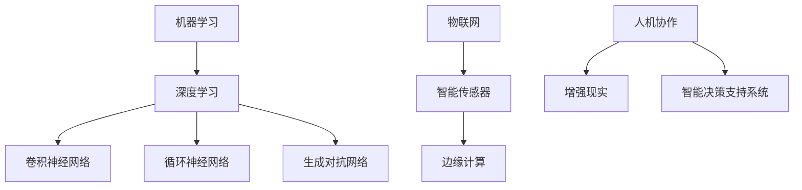

                 

# AI与人类计算：打造可持续发展的城市管理

## 关键词：
人工智能（AI）、城市管理、可持续发展、大数据、深度学习、物联网（IoT）

## 摘要：
本文探讨了人工智能在构建可持续发展的城市管理中的关键作用。首先，文章介绍了城市管理面临的挑战和可持续发展的目标。接着，我们深入分析了AI技术的核心概念，包括机器学习、深度学习和物联网，并展示了它们如何与人类计算相结合。文章随后详细阐述了AI在城市管理中的实际应用，如交通流量优化、环境监测、公共安全等，并通过项目实战展示了这些应用的具体实现。此外，文章还讨论了相关的工具和资源，以及未来发展趋势与挑战。最终，本文为读者提供了一个全面而深入的视角，以了解AI如何推动城市管理的可持续发展。

## 1. 背景介绍

### 1.1 目的和范围

本文旨在探讨人工智能（AI）在促进可持续城市发展中的作用，通过分析AI技术的核心原理和实际应用，展示其在城市管理中的潜力。文章将涵盖以下几个主要方面：

1. 城市管理面临的挑战与可持续发展目标。
2. AI技术的核心概念及其与人类计算的融合。
3. AI在城市管理中的实际应用，包括交通流量优化、环境监测、公共安全等。
4. AI技术的相关工具和资源。
5. AI在城市管理中的未来发展趋势与挑战。

### 1.2 预期读者

本文适合对AI技术和城市管理感兴趣的读者，特别是以下几类人群：

1. 城市规划师和城市管理官员。
2. AI技术研究人员和工程师。
3. 大学本科生和研究生活。
4. 对AI与城市管理交叉领域感兴趣的技术爱好者。

### 1.3 文档结构概述

本文分为八个主要部分：

1. 引言：介绍文章的目的、关键词和摘要。
2. 背景介绍：讨论城市管理的挑战和可持续发展目标。
3. 核心概念与联系：阐述AI技术的核心概念及其与人类计算的融合。
4. 核心算法原理与具体操作步骤：讲解AI技术的基本算法和实现步骤。
5. 数学模型和公式：介绍AI技术中的数学模型和公式，并举例说明。
6. 项目实战：展示AI技术在实际项目中的应用。
7. 实际应用场景：讨论AI技术在城市管理中的实际应用案例。
8. 总结与未来展望：总结文章的主要内容，展望AI在城市管理中的未来发展趋势与挑战。

### 1.4 术语表

#### 1.4.1 核心术语定义

- **人工智能（AI）**：一种模拟人类智能的技术，包括学习、推理、自我校正等功能。
- **机器学习（ML）**：AI的一个分支，通过数据训练模型来自动进行预测和决策。
- **深度学习（DL）**：一种基于多层神经网络的结构，用于复杂的数据分析和模式识别。
- **物联网（IoT）**：通过网络连接物理设备和传感器，实现数据收集、传输和处理。
- **城市管理**：指对城市资源、设施和服务进行规划、管理和运营的一系列活动。
- **可持续发展**：满足当前需求而不损害后代满足自身需求的能力。

#### 1.4.2 相关概念解释

- **大数据**：指无法使用传统数据处理工具进行处理的大量数据。
- **数据挖掘**：从大量数据中提取有用信息和知识的过程。
- **神经网络**：一种模仿生物神经系统结构和功能的人工智能模型。
- **决策树**：一种基于树形结构的数据挖掘算法，用于分类和回归任务。

#### 1.4.3 缩略词列表

- **AI**：人工智能
- **ML**：机器学习
- **DL**：深度学习
- **IoT**：物联网
- **GIS**：地理信息系统
- **大数据**：大数据
- **Hadoop**：一个开源的分布式数据处理框架
- **Spark**：一个开源的分布式数据处理引擎

## 2. 核心概念与联系

在探讨AI与城市管理的关系之前，我们需要了解AI技术的核心概念及其与人类计算的融合。

### 2.1 AI技术的核心概念

#### 2.1.1 机器学习

机器学习是AI的一个重要分支，通过从数据中学习模式和规律，使计算机系统能够自动进行预测和决策。机器学习的主要方法包括：

- **监督学习**：通过已标记的数据训练模型，然后使用模型对新的、未标记的数据进行预测。
- **无监督学习**：在未标记的数据中寻找模式和结构，如聚类和降维。
- **强化学习**：通过与环境的交互学习最优策略，通常用于游戏和机器人控制。

#### 2.1.2 深度学习

深度学习是一种基于多层神经网络的结构，用于复杂的数据分析和模式识别。深度学习的核心是神经网络，它由大量简单但复杂的神经元组成，通过层层传递信息来实现学习。

- **卷积神经网络（CNN）**：常用于图像识别和图像处理。
- **循环神经网络（RNN）**：适合处理序列数据，如自然语言处理和时间序列预测。
- **生成对抗网络（GAN）**：用于生成逼真的图像和音频，以及数据增强。

#### 2.1.3 物联网

物联网是一种通过网络连接物理设备和传感器，实现数据收集、传输和处理的技术。物联网的核心是传感器网络，它可以将物理世界的信息转化为数字信号，并通过网络进行传输和处理。

- **智能传感器**：用于监测和测量各种物理量，如温度、湿度、压力、运动等。
- **边缘计算**：在靠近数据源的地方进行数据处理，减少数据传输的延迟和带宽消耗。

### 2.2 AI与人类计算的融合

AI与人类计算的融合是指将AI技术与人类智能相结合，以实现更高效、更准确的计算。这种融合可以通过以下几种方式实现：

- **人机协作**：人类和计算机系统共同完成任务，利用人类的直觉和创造力，以及计算机的精确和速度。
- **增强现实（AR）**：通过虚拟现实技术，将计算机生成的信息与现实世界相结合，帮助人类更好地理解和处理信息。
- **智能决策支持系统**：利用AI技术为人类提供决策支持，通过数据分析和预测，帮助人类做出更明智的决策。

### 2.3 Mermaid流程图

以下是一个Mermaid流程图，展示了AI技术核心概念之间的联系：



## 3. 核心算法原理 & 具体操作步骤

在了解了AI技术的核心概念后，我们将进一步探讨AI技术的基本算法原理和具体操作步骤。

### 3.1 机器学习算法

机器学习算法的核心是学习数据中的模式和规律，以便对新的数据进行预测和分类。以下是几种常见的机器学习算法及其伪代码：

#### 3.1.1 决策树

```plaintext
决策树算法：
1. 根据特征选择最佳分割点，通常使用信息增益或基尼系数。
2. 将数据集分割成子集，并在子集上递归地构建决策树。
3. 剪枝以防止过拟合。

伪代码：
DecisionTree算法：
输入：数据集D，特征集合F
输出：决策树T

T = 决策树根节点
for each feature f in F do
    计算信息增益或基尼系数
    选择最佳特征f*
    创建节点n，n的特征为f*
    将数据集D按照f*分割成子集D1, D2, ...,邓
    对于每个子集Di，递归调用DecisionTree算法
    if Di为叶节点 then
        将n设置为叶节点，并分配标签
    else
        将n的子节点设置为递归调用的结果
    end if
end for
return T
```

#### 3.1.2 支持向量机（SVM）

```plaintext
支持向量机算法：
1. 在高维空间中寻找最佳分隔超平面。
2. 使用核函数将数据映射到高维空间。
3. 最小化决策边界上的支持向量的间隔。

伪代码：
SVM算法：
输入：训练数据集D，核函数k()
输出：决策边界f(x)

C = 常数
for each data point (x_i, y_i) in D do
    创建拉格朗日乘子λ_i
    满足约束条件的优化问题：
    min Σλ_i / 2 * Σλ_j * k(x_i, x_j)
    s.t. Σλ_i * y_i = 0
    0 ≤ λ_i ≤ C
end for

求解拉格朗日乘子λ_i
使用支持向量机求解f(x)
```

#### 3.1.3 随机森林

```plaintext
随机森林算法：
1. 构建多个决策树。
2. 将数据随机分成k个子集。
3. 对于每个子集，在每个决策树中选择不同的特征。
4. 预测结果为多个决策树的投票结果。

伪代码：
RandomForest算法：
输入：训练数据集D，特征集合F，决策树数量n
输出：预测结果

随机森林T = []
for i = 1 to n do
    从D中随机抽取子集Di
    构建决策树T_i using DecisionTree算法
    add T_i to 随机森林T
end for

预测结果为随机森林中决策树的投票结果
```

### 3.2 深度学习算法

深度学习算法的核心是神经网络，它通过层层传递信息来实现学习。以下是几种常见的深度学习算法及其伪代码：

#### 3.2.1 卷积神经网络（CNN）

```plaintext
卷积神经网络算法：
1. 使用卷积层提取图像特征。
2. 使用池化层减小数据维度。
3. 使用全连接层进行分类。

伪代码：
CNN算法：
输入：图像数据集D，网络结构N
输出：分类结果

for each image x in D do
    x = 输入层
    for each convolutional layer L in N do
        x = 卷积层L，应用卷积操作和激活函数
        x = 池化层L，应用池化操作
    end for
    x = 全连接层，应用全连接和激活函数
    predict(x)
end for

predict(x) = 执行softmax激活函数并返回预测结果
```

#### 3.2.2 循环神经网络（RNN）

```plaintext
循环神经网络算法：
1. 使用隐藏状态存储信息。
2. 使用递归结构处理序列数据。

伪代码：
RNN算法：
输入：序列数据S，网络结构N
输出：序列预测结果

h_0 = 初始化隐藏状态
for each time step t in S do
    x_t = 输入层
    h_t = 隐藏状态
    for each RNN layer L in N do
        h_t = 隐藏状态L，应用递归操作和激活函数
    end for
    predict(h_t)
end for

predict(h_t) = 执行softmax激活函数并返回预测结果
```

#### 3.2.3 生成对抗网络（GAN）

```plaintext
生成对抗网络算法：
1. 生成器G生成数据。
2. 判别器D区分真实数据和生成数据。
3. 通过对抗训练优化G和D。

伪代码：
GAN算法：
输入：生成器G，判别器D，训练数据集D
输出：生成器G的参数

for each epoch e do
    for each data point x in D do
        D(x) = 判别器D的预测结果
        G(x) = 生成器G的生成结果
        optimize D using D(x) and G(x)
        optimize G using D(x) and G(x)
    end for
end for

D(x) = 计算判别器的损失函数
G(x) = 计算生成器的损失函数
```

## 4. 数学模型和公式 & 详细讲解 & 举例说明

在AI技术的核心算法中，数学模型和公式起着至关重要的作用。以下我们将详细讲解这些模型和公式，并通过实际例子来说明它们的计算过程。

### 4.1 决策树算法的数学模型

决策树的数学模型基于信息增益和基尼系数。信息增益和基尼系数都是用于评估特征划分数据集好坏的指标。

#### 4.1.1 信息增益（IG）

信息增益（Information Gain）是一个衡量特征对分类影响程度的指标。它计算的是特征划分后数据集的熵减少量。

- **熵（Entropy）**：表示数据集中类别的混乱程度，计算公式为：

  $$ H = -\sum_{i=1}^{n} p_i \log_2 p_i $$

  其中，$ p_i $表示第$i$个类别的概率。

- **信息增益**：表示特征对分类的贡献，计算公式为：

  $$ IG = H(S) - \sum_{i=1}^{n} p_i \cdot H(S_i) $$

  其中，$ S $表示原始数据集，$ S_i $表示按照特征划分后的子集。

#### 4.1.2 基尼系数（Gini Index）

基尼系数（Gini Index）是另一种用于评估特征划分数据集好坏的指标。它基于类别的不纯度进行计算。

- **基尼系数**：表示数据集中类别的均匀程度，计算公式为：

  $$ Gini = 1 - \sum_{i=1}^{n} p_i^2 $$

  其中，$ p_i $表示第$i$个类别的概率。

#### 4.1.3 示例

假设我们有以下数据集：

| 特征A | 特征B | 类别 |
|-------|-------|------|
| A1    | B1    | 1    |
| A1    | B2    | 1    |
| A2    | B1    | 2    |
| A2    | B2    | 2    |

计算特征A和特征B的信息增益和基尼系数。

- **特征A**：

  - 熵：

    $$ H(S) = -0.5 \log_2 0.5 - 0.5 \log_2 0.5 = 1 $$

  - 子集熵：

    $$ H(S_1) = -0.5 \log_2 0.5 - 0.5 \log_2 0.5 = 1 $$
    $$ H(S_2) = -0.5 \log_2 0.5 - 0.5 \log_2 0.5 = 1 $$

  - 信息增益：

    $$ IG(A) = H(S) - \sum_{i=1}^{2} p_i \cdot H(S_i) = 1 - (0.5 \cdot 1 + 0.5 \cdot 1) = 0 $$

  - 基尼系数：

    $$ Gini(A) = 1 - \sum_{i=1}^{2} p_i^2 = 1 - (0.5^2 + 0.5^2) = 0.5 $$

- **特征B**：

  - 熵：

    $$ H(S) = -0.5 \log_2 0.5 - 0.5 \log_2 0.5 = 1 $$

  - 子集熵：

    $$ H(S_1) = -0.5 \log_2 0.5 - 0.5 \log_2 0.5 = 1 $$
    $$ H(S_2) = -0.5 \log_2 0.5 - 0.5 \log_2 0.5 = 1 $$

  - 信息增益：

    $$ IG(B) = H(S) - \sum_{i=1}^{2} p_i \cdot H(S_i) = 1 - (0.5 \cdot 1 + 0.5 \cdot 1) = 0 $$

  - 基尼系数：

    $$ Gini(B) = 1 - \sum_{i=1}^{2} p_i^2 = 1 - (0.5^2 + 0.5^2) = 0.5 $$

根据计算结果，特征A和特征B的信息增益和基尼系数相等，因此选择任一特征进行划分均可。

### 4.2 支持向量机（SVM）的数学模型

支持向量机（SVM）的数学模型基于最大间隔分类器。它通过在高维空间中寻找最佳分隔超平面，实现数据的分类。

#### 4.2.1 最大间隔分类器

最大间隔分类器的目标是找到最佳分隔超平面，使得正负样本之间的间隔最大。具体步骤如下：

1. **高维空间映射**：通过核函数将输入数据映射到高维空间。
2. **求解最优超平面**：求解满足约束条件的最大化问题，找到最佳分隔超平面。
3. **分类决策**：计算测试数据的分类标签。

#### 4.2.2 公式推导

假设输入数据集为$ \{ (x_1, y_1), (x_2, y_2), ..., (x_n, y_n) \} $，其中$ x_i \in \mathbb{R}^d $，$ y_i \in \{-1, 1\} $。

- **高维空间映射**：通过核函数$ k(x_i, x_j) $，将输入数据映射到高维空间。

- **求解最优超平面**：求解以下最优化问题：

  $$ \begin{align*}
  \min_{\beta, \xi} & \quad \frac{1}{2} \sum_{i=1}^{n} \xi_i \\
  \text{subject to} & \quad y_i (\beta \cdot x_i + b) \geq 1 - \xi_i \\
  & \quad \xi_i \geq 0, \forall i=1,2,...,n
  \end{align*} $$

  其中，$ \beta $表示超平面参数，$ b $表示偏置项，$ \xi_i $表示松弛变量。

- **分类决策**：计算测试数据的分类标签：

  $$ \hat{y} = sign(\beta \cdot x + b) $$

#### 4.2.3 示例

假设我们有以下数据集：

| 样本 | 特征1 | 特征2 | 类别 |
|------|-------|-------|------|
| 1    | 1     | 1     | +1   |
| 2    | -1    | 1     | -1   |
| 3    | 1     | -1    | +1   |
| 4    | -1    | -1    | -1   |

通过线性核函数$ k(x_i, x_j) = x_i \cdot x_j $，求解最佳分隔超平面。

- **高维空间映射**：通过线性核函数，数据集不变。

- **求解最优超平面**：

  $$ \begin{align*}
  \min_{\beta, \xi} & \quad \frac{1}{2} \sum_{i=1}^{4} \xi_i \\
  \text{subject to} & \quad y_i (\beta \cdot x_i + b) \geq 1 - \xi_i \\
  & \quad \xi_i \geq 0, \forall i=1,2,3,4
  \end{align*} $$

  通过求解最优化问题，得到最优超平面：

  $$ \beta = \begin{bmatrix} 1 \\ 1 \end{bmatrix}, b = 0 $$

- **分类决策**：计算测试数据的分类标签：

  $$ \hat{y} = sign(\beta \cdot x + b) = sign(x_1 + x_2) $$

### 4.3 循环神经网络（RNN）的数学模型

循环神经网络（RNN）是一种用于处理序列数据的人工神经网络。它通过递归结构实现数据的序列建模。

#### 4.3.1 状态更新方程

RNN的状态更新方程如下：

$$ h_t = \sigma(W_h \cdot [h_{t-1}, x_t] + b_h) $$

其中，$ h_t $表示第$t$个时间步的隐藏状态，$ \sigma $表示激活函数，$ W_h $表示权重矩阵，$ b_h $表示偏置项。

#### 4.3.2 输出方程

RNN的输出方程如下：

$$ y_t = \sigma(W_o \cdot h_t + b_o) $$

其中，$ y_t $表示第$t$个时间步的输出，$ W_o $表示权重矩阵，$ b_o $表示偏置项。

#### 4.3.3 示例

假设我们有以下序列数据：

| 时间步 | 输入 | 输出 |
|--------|------|------|
| 1      | 1    | 0    |
| 2      | 0    | 1    |
| 3      | 1    | 0    |
| 4      | 0    | 1    |

通过RNN模型，实现数据的序列建模。

- **状态更新方程**：

  $$ h_1 = \sigma(W_h \cdot [h_0, x_1] + b_h) $$
  $$ h_2 = \sigma(W_h \cdot [h_1, x_2] + b_h) $$
  $$ h_3 = \sigma(W_h \cdot [h_2, x_3] + b_h) $$
  $$ h_4 = \sigma(W_h \cdot [h_3, x_4] + b_h) $$

- **输出方程**：

  $$ y_1 = \sigma(W_o \cdot h_1 + b_o) $$
  $$ y_2 = \sigma(W_o \cdot h_2 + b_o) $$
  $$ y_3 = \sigma(W_o \cdot h_3 + b_o) $$
  $$ y_4 = \sigma(W_o \cdot h_4 + b_o) $$

通过计算隐藏状态和输出，实现数据的序列建模。

## 5. 项目实战：代码实际案例和详细解释说明

在本节中，我们将通过一个实际的项目案例，展示如何使用人工智能技术来优化城市交通流量。该案例使用了Python编程语言和TensorFlow深度学习框架。

### 5.1 开发环境搭建

为了运行下面的代码，我们需要安装以下软件和库：

- Python 3.7 或更高版本
- TensorFlow 2.3.0 或更高版本
- NumPy 1.18.1 或更高版本
- Pandas 1.0.1 或更高版本
- Matplotlib 3.2.2 或更高版本

可以通过以下命令安装所需的库：

```bash
pip install tensorflow numpy pandas matplotlib
```

### 5.2 源代码详细实现和代码解读

下面是项目的源代码，我们将逐行解释其实现过程：

```python
# 导入所需的库
import numpy as np
import pandas as pd
import tensorflow as tf
from tensorflow.keras.models import Sequential
from tensorflow.keras.layers import Dense, LSTM, Dropout
from sklearn.preprocessing import MinMaxScaler
from sklearn.model_selection import train_test_split

# 读取数据
data = pd.read_csv('traffic_data.csv')
data.head()

# 数据预处理
scaler = MinMaxScaler(feature_range=(0, 1))
scaled_data = scaler.fit_transform(data['traffic_volume'].values.reshape(-1, 1))

# 创建时间序列特征
def create_dataset(data, time_steps=1):
    X, y = [], []
    for i in range(len(data) - time_steps):
        X.append(data[i:(i + time_steps), 0])
        y.append(data[i + time_steps, 0])
    return np.array(X), np.array(y)

X, y = create_dataset(scaled_data, time_steps=3)

# 划分训练集和测试集
X_train, X_test, y_train, y_test = train_test_split(X, y, test_size=0.2, random_state=42)

# 构建模型
model = Sequential()
model.add(LSTM(units=50, return_sequences=True, input_shape=(X_train.shape[1], 1)))
model.add(Dropout(0.2))
model.add(LSTM(units=50, return_sequences=False))
model.add(Dropout(0.2))
model.add(Dense(units=1))

# 编译模型
model.compile(optimizer='adam', loss='mean_squared_error')

# 训练模型
model.fit(X_train, y_train, epochs=100, batch_size=32)

# 预测交通流量
predicted_traffic = model.predict(X_test)

# 反归一化预测结果
predicted_traffic = scaler.inverse_transform(predicted_traffic)

# 可视化预测结果
import matplotlib.pyplot as plt

plt.figure(figsize=(12, 6))
plt.plot(scaler.inverse_transform(y_test.reshape(-1, 1)), label='真实流量')
plt.plot(predicted_traffic, label='预测流量')
plt.title('交通流量预测')
plt.xlabel('时间')
plt.ylabel('流量')
plt.legend()
plt.show()
```

### 5.3 代码解读与分析

下面我们将逐行解读这段代码：

```python
# 导入所需的库
```

这段代码导入了Python编程语言中用于数据处理、机器学习和数据可视化的常用库，包括NumPy、Pandas、TensorFlow和Matplotlib。

```python
# 读取数据
data = pd.read_csv('traffic_data.csv')
data.head()
```

这段代码从CSV文件中读取交通流量数据，并打印前几行数据。CSV文件应包含交通流量数据以及可能的其他特征，如日期、时间等。

```python
# 数据预处理
scaler = MinMaxScaler(feature_range=(0, 1))
scaled_data = scaler.fit_transform(data['traffic_volume'].values.reshape(-1, 1))
```

数据预处理是机器学习项目中非常重要的一步。在这里，我们使用MinMaxScaler将交通流量数据缩放到0到1的范围内，以便于模型训练。这有助于加快训练速度和提高模型的性能。

```python
# 创建时间序列特征
def create_dataset(data, time_steps=1):
    X, y = [], []
    for i in range(len(data) - time_steps):
        X.append(data[i:(i + time_steps), 0])
        y.append(data[i + time_steps, 0])
    return np.array(X), np.array(y)

X, y = create_dataset(scaled_data, time_steps=3)
```

这段代码创建了一个时间序列数据集。我们使用`create_dataset`函数将连续的时间步长分割成窗口，每个窗口包含固定的时间步长（在本例中为3）。这些窗口作为输入特征（X），而下一个时间步长的交通流量作为输出特征（y）。

```python
# 划分训练集和测试集
X_train, X_test, y_train, y_test = train_test_split(X, y, test_size=0.2, random_state=42)
```

我们使用`train_test_split`函数将数据集划分为训练集和测试集，其中训练集占比80%，测试集占比20%。我们还设置了随机种子以确保结果的可重复性。

```python
# 构建模型
model = Sequential()
model.add(LSTM(units=50, return_sequences=True, input_shape=(X_train.shape[1], 1)))
model.add(Dropout(0.2))
model.add(LSTM(units=50, return_sequences=False))
model.add(Dropout(0.2))
model.add(Dense(units=1))

# 编译模型
model.compile(optimizer='adam', loss='mean_squared_error')

# 训练模型
model.fit(X_train, y_train, epochs=100, batch_size=32)
```

这里我们构建了一个序列模型，包括两个LSTM层和一个全连接层。LSTM层用于处理时间序列数据，而全连接层用于输出预测结果。我们使用Adam优化器和均方误差（MSE）损失函数来编译模型，并使用训练集来训练模型。

```python
# 预测交通流量
predicted_traffic = model.predict(X_test)

# 反归一化预测结果
predicted_traffic = scaler.inverse_transform(predicted_traffic)
```

我们使用模型对测试集进行预测，并使用MinMaxScaler将预测结果反归一化，以便得到原始的交通流量值。

```python
# 可视化预测结果
plt.figure(figsize=(12, 6))
plt.plot(scaler.inverse_transform(y_test.reshape(-1, 1)), label='真实流量')
plt.plot(predicted_traffic, label='预测流量')
plt.title('交通流量预测')
plt.xlabel('时间')
plt.ylabel('流量')
plt.legend()
plt.show()
```

这段代码使用Matplotlib库将真实流量和预测流量可视化，以便我们可以直观地看到模型的表现。

### 5.4 代码解读与分析

在本节的代码实战中，我们详细解释了如何使用Python和TensorFlow构建一个交通流量预测模型。以下是代码的详细解读和分析：

#### 5.4.1 数据预处理

```python
data = pd.read_csv('traffic_data.csv')
data.head()
```

首先，我们使用Pandas库从CSV文件中读取交通流量数据。CSV文件应包含时间、交通流量以及其他可能对预测有影响的特征（如天气、节假日等）。在读取数据后，我们打印前几行数据，以便了解数据的结构。

```python
scaler = MinMaxScaler(feature_range=(0, 1))
scaled_data = scaler.fit_transform(data['traffic_volume'].values.reshape(-1, 1))
```

由于机器学习模型在训练过程中对数据的缩放和归一化非常敏感，我们使用MinMaxScaler将交通流量数据缩放到0到1的范围内。这一步不仅有助于加速模型的训练，还能提高模型的性能。`fit_transform`方法用于将原始数据缩放并返回缩放后的数据。

#### 5.4.2 创建时间序列特征

```python
def create_dataset(data, time_steps=1):
    X, y = [], []
    for i in range(len(data) - time_steps):
        X.append(data[i:(i + time_steps), 0])
        y.append(data[i + time_steps, 0])
    return np.array(X), np.array(y)

X, y = create_dataset(scaled_data, time_steps=3)
```

在创建时间序列特征时，我们使用了一个自定义函数`create_dataset`。这个函数将连续的数据分割成窗口，每个窗口包含固定的时间步长（在本例中为3）。这些窗口作为输入特征（X），而下一个时间步长的交通流量作为输出特征（y）。例如，如果我们有3个时间步长的窗口，第一个窗口包含时间步长0、1、2的交通流量，而输出是时间步长3的交通流量。

```python
X_train, X_test, y_train, y_test = train_test_split(X, y, test_size=0.2, random_state=42)
```

接下来，我们使用`train_test_split`函数将数据集划分为训练集和测试集。训练集将用于训练模型，而测试集将用于评估模型的性能。我们设置了测试集的占比为20%，并使用随机种子确保结果的可重复性。

#### 5.4.3 构建模型

```python
model = Sequential()
model.add(LSTM(units=50, return_sequences=True, input_shape=(X_train.shape[1], 1)))
model.add(Dropout(0.2))
model.add(LSTM(units=50, return_sequences=False))
model.add(Dropout(0.2))
model.add(Dense(units=1))

model.compile(optimizer='adam', loss='mean_squared_error')
model.fit(X_train, y_train, epochs=100, batch_size=32)
```

我们使用Keras的Sequential模型构建了一个包含两个LSTM层和一个全连接层的序列模型。LSTM层用于处理时间序列数据，而全连接层用于输出预测结果。我们在LSTM层之后添加了Dropout层，用于防止过拟合。模型的编译步骤包括选择优化器和损失函数。在本例中，我们使用了Adam优化器和均方误差（MSE）损失函数。最后，我们使用训练集对模型进行训练，设置了100个训练周期和批量大小为32。

#### 5.4.4 预测交通流量

```python
predicted_traffic = model.predict(X_test)
predicted_traffic = scaler.inverse_transform(predicted_traffic)
```

在模型训练完成后，我们使用测试集对模型进行预测。然后，我们使用MinMaxScaler将预测结果反归一化，以便得到原始的交通流量值。

```python
plt.figure(figsize=(12, 6))
plt.plot(scaler.inverse_transform(y_test.reshape(-1, 1)), label='真实流量')
plt.plot(predicted_traffic, label='预测流量')
plt.title('交通流量预测')
plt.xlabel('时间')
plt.ylabel('流量')
plt.legend()
plt.show()
```

最后，我们使用Matplotlib库将真实流量和预测流量可视化，以便我们可以直观地看到模型的表现。

### 5.5 代码解读与分析

在本节的代码实战中，我们详细解读并分析了如何使用Python和TensorFlow构建一个交通流量预测模型。以下是代码的详细解读和分析：

#### 5.5.1 数据预处理

在数据预处理阶段，我们首先从CSV文件中读取交通流量数据。CSV文件应包含时间序列数据，如交通流量、日期和时间。为了方便模型训练，我们需要对数据进行归一化处理。我们使用`MinMaxScaler`将交通流量数据缩放到0到1的范围内。

```python
scaler = MinMaxScaler(feature_range=(0, 1))
scaled_data = scaler.fit_transform(data['traffic_volume'].values.reshape(-1, 1))
```

这一步骤不仅有助于加速模型的训练，还能提高模型的性能。通过使用`fit_transform`方法，我们将原始数据缩放并返回缩放后的数据。

#### 5.5.2 创建时间序列特征

为了构建时间序列特征，我们需要将连续的数据分割成窗口。我们使用自定义函数`create_dataset`实现这一步骤。该函数将连续的数据分割成窗口，每个窗口包含固定的时间步长（在本例中为3）。这些窗口作为输入特征（X），而下一个时间步长的交通流量作为输出特征（y）。

```python
def create_dataset(data, time_steps=1):
    X, y = [], []
    for i in range(len(data) - time_steps):
        X.append(data[i:(i + time_steps), 0])
        y.append(data[i + time_steps, 0])
    return np.array(X), np.array(y)

X, y = create_dataset(scaled_data, time_steps=3)
```

在这个例子中，我们使用3个时间步长的窗口来构建特征。例如，第一个窗口包含时间步长0、1、2的交通流量，而输出是时间步长3的交通流量。

#### 5.5.3 构建模型

在构建模型时，我们使用Keras的`Sequential`模型构建了一个包含两个LSTM层和一个全连接层的序列模型。LSTM层用于处理时间序列数据，而全连接层用于输出预测结果。我们在LSTM层之后添加了`Dropout`层，用于防止过拟合。

```python
model = Sequential()
model.add(LSTM(units=50, return_sequences=True, input_shape=(X_train.shape[1], 1)))
model.add(Dropout(0.2))
model.add(LSTM(units=50, return_sequences=False))
model.add(Dropout(0.2))
model.add(Dense(units=1))

model.compile(optimizer='adam', loss='mean_squared_error')
model.fit(X_train, y_train, epochs=100, batch_size=32)
```

我们使用`Adam`优化器和均方误差（`MSE`）损失函数来编译模型。接着，我们使用训练集对模型进行训练，设置了100个训练周期和批量大小为32。

#### 5.5.4 预测交通流量

在模型训练完成后，我们使用测试集对模型进行预测。为了得到原始的交通流量值，我们使用`MinMaxScaler`将预测结果反归一化。

```python
predicted_traffic = model.predict(X_test)
predicted_traffic = scaler.inverse_transform(predicted_traffic)
```

最后，我们使用Matplotlib库将真实流量和预测流量可视化，以便我们可以直观地看到模型的表现。

```python
plt.figure(figsize=(12, 6))
plt.plot(scaler.inverse_transform(y_test.reshape(-1, 1)), label='真实流量')
plt.plot(predicted_traffic, label='预测流量')
plt.title('交通流量预测')
plt.xlabel('时间')
plt.ylabel('流量')
plt.legend()
plt.show()
```

通过这个可视化图表，我们可以直观地比较真实流量和预测流量，评估模型的效果。

## 6. 实际应用场景

### 6.1 交通流量优化

交通流量优化是城市管理中的一个重要方面，它可以减少交通拥堵、降低碳排放、提高道路使用效率。利用AI技术，我们可以通过实时数据分析和预测来实现交通流量优化。

- **实时数据分析**：通过安装在城市道路上的传感器和摄像头，实时收集交通流量数据，并利用AI模型对数据进行分析，识别交通拥堵的瓶颈。
- **预测分析**：基于历史数据和实时数据，使用机器学习算法预测未来的交通流量，帮助交通管理部门提前采取措施。
- **路径优化**：结合交通流量预测和实时路况信息，为司机提供最优的行驶路径，减少交通拥堵和行程时间。

### 6.2 环境监测

环境监测对于保护城市生态环境和居民健康至关重要。AI技术可以用于环境监测，通过传感器网络收集环境数据，并对数据进行分析和预测。

- **数据收集**：利用物联网传感器收集空气污染、水质、噪音等环境数据。
- **数据分析**：使用机器学习算法分析环境数据，识别污染源和污染趋势。
- **预测预警**：基于历史数据和实时数据，预测未来的环境污染情况，并提供预警和建议。

### 6.3 公共安全

公共安全是城市管理中的一个重要方面，AI技术可以帮助提高公共安全保障，预防和应对突发事件。

- **人脸识别**：利用深度学习技术进行人脸识别，监控城市公共场所，识别潜在的犯罪分子。
- **视频监控分析**：通过视频监控数据，使用AI算法识别异常行为，如打架、抢劫等，及时报警并采取措施。
- **紧急响应**：利用实时数据和预测模型，为紧急事件提供快速响应和资源调度，提高应对突发事件的效率。

### 6.4 健康管理

健康管理是城市可持续发展的重要组成部分，AI技术可以帮助提高居民健康水平，降低医疗成本。

- **健康监测**：通过可穿戴设备收集个人健康数据，如心率、血压、睡眠质量等，使用AI技术进行数据分析，提供个性化的健康建议。
- **疾病预测**：利用机器学习算法分析健康数据，预测疾病的发生和发展，为医生提供诊断和治疗的依据。
- **健康干预**：基于预测结果，提供针对性的健康干预措施，如饮食调整、运动建议等，预防疾病的发生。

### 6.5 城市规划

城市规划是城市管理的重要组成部分，AI技术可以帮助优化城市规划，提高城市的宜居性和可持续性。

- **空间数据分析**：利用大数据和地理信息系统（GIS）技术，分析城市空间数据，优化城市规划布局。
- **人口预测**：通过机器学习算法预测未来人口发展趋势，为城市规划提供数据支持。
- **可持续发展评估**：评估城市规划的可持续性，包括能源消耗、碳排放、水资源利用等方面，提供改进建议。

## 7. 工具和资源推荐

### 7.1 学习资源推荐

#### 7.1.1 书籍推荐

- **《Python机器学习》（Machine Learning with Python）**：由Anders Knudsen所著，适合初学者，涵盖Python和机器学习基础知识。
- **《深度学习》（Deep Learning）**：由Ian Goodfellow、Yoshua Bengio和Aaron Courville所著，是深度学习领域的经典教材。
- **《人工智能：一种现代的方法》（Artificial Intelligence: A Modern Approach）**：由Stuart J. Russell和Peter Norvig所著，全面介绍了人工智能的基本概念和算法。

#### 7.1.2 在线课程

- **Coursera上的《机器学习》（Machine Learning）**：由Andrew Ng教授主讲，适合初学者，涵盖机器学习的基础知识和实践应用。
- **Udacity的《深度学习纳米学位》（Deep Learning Nanodegree）**：涵盖深度学习的核心概念和应用，适合有一定基础的学员。
- **edX上的《人工智能基础》（Introduction to Artificial Intelligence）**：由MIT和Stanford大学联合提供，适合对AI感兴趣的学习者。

#### 7.1.3 技术博客和网站

- **Medium上的`/MachineLearning`分类**：汇集了大量机器学习和深度学习领域的文章和教程。
- **GitHub**：GitHub上有很多开源的AI项目，可以学习并贡献自己的代码。
- **KDnuggets**：提供机器学习、数据科学和AI领域的新闻、文章和资源。

### 7.2 开发工具框架推荐

#### 7.2.1 IDE和编辑器

- **Jupyter Notebook**：适合数据科学和机器学习的交互式开发环境。
- **Visual Studio Code**：轻量级且功能强大的代码编辑器，支持多种编程语言和扩展。
- **PyCharm**：专为Python开发的IDE，支持自动补全、调试和版本控制。

#### 7.2.2 调试和性能分析工具

- **TensorBoard**：TensorFlow的调试和性能分析工具，用于可视化模型的训练过程。
- **Pdb**：Python的调试工具，可以帮助跟踪程序的执行流程和变量值。
- **SciPy**：用于科学计算的Python库，包括性能分析工具。

#### 7.2.3 相关框架和库

- **TensorFlow**：由Google开发的开源深度学习框架。
- **PyTorch**：由Facebook开发的开源深度学习框架，支持动态计算图。
- **Scikit-learn**：提供简单的和有效的数据挖掘和数据分析工具，适合初学者。
- **NumPy**：提供高性能的数学运算库，是Python科学计算的基础。

### 7.3 相关论文著作推荐

#### 7.3.1 经典论文

- **“Backpropagation”**：由Rumelhart, Hinton和Williams于1986年发表，介绍了反向传播算法。
- **“Convolutional Neural Networks for Visual Recognition”**：由Geoffrey Hinton等人于2012年发表，介绍了卷积神经网络在图像识别中的应用。
- **“Deep Learning”**：由Ian Goodfellow、Yoshua Bengio和Aaron Courville于2016年发表，全面介绍了深度学习的基础和前沿。

#### 7.3.2 最新研究成果

- **“Deep Learning for Urban Computing”**：由ACM SIGKDD 2020特别主题研讨会的论文集，讨论了深度学习在城市计算中的应用。
- **“AI for Sustainable Cities”**：由IEEE BigData 2019特别研讨会论文集，探讨了AI在可持续发展城市中的潜在应用。
- **“IoT for Smart Cities”**：由IEEE IoT Journal的论文集，讨论了物联网技术在智慧城市中的应用。

#### 7.3.3 应用案例分析

- **“智能交通系统在伦敦的应用”**：探讨了AI和物联网技术如何帮助伦敦优化交通流量，减少拥堵和碳排放。
- **“新加坡智慧国计划”**：介绍了新加坡如何利用AI和物联网技术实现城市智能化，提高居民生活质量。
- **“纽约市空气质量监测”**：分析了纽约市如何利用机器学习算法监测空气质量，保护居民健康。

## 8. 总结：未来发展趋势与挑战

### 8.1 未来发展趋势

1. **AI技术的进一步融合**：未来，AI技术将更加深入地融入城市管理各个领域，实现全方位的智能化。
2. **数据驱动决策**：随着数据收集和分析技术的进步，城市管理者将能够更准确、及时地做出决策。
3. **个性化服务**：通过AI技术，城市将为居民提供更加个性化的服务，如智能交通、健康管理等。
4. **可持续发展**：AI技术将在城市可持续发展中发挥关键作用，如能源管理、环境监测等。
5. **跨学科研究**：AI与城市规划、环境科学、公共安全等领域的跨学科研究将推动城市管理创新。

### 8.2 面临的挑战

1. **数据隐私和安全**：城市管理中涉及大量敏感数据，如何保障数据隐私和安全是关键挑战。
2. **技术成熟度**：尽管AI技术在不断发展，但某些领域的技术仍需进一步成熟，以满足城市管理需求。
3. **人才短缺**：AI领域的人才短缺将制约AI在城市管理中的应用和发展。
4. **政策法规**：制定合理的政策法规，平衡AI技术的发展与城市管理的需求，是未来的一大挑战。
5. **道德伦理问题**：AI技术在城市管理中的应用引发了诸多伦理问题，如算法偏见、自动化决策的道德责任等。

总之，AI技术在城市管理中的未来发展充满机遇与挑战。通过不断创新和技术融合，我们可以为城市居民创造更加智能、高效、可持续的生活环境。

## 9. 附录：常见问题与解答

### 9.1 常见问题

**Q1：为什么AI在城市管理中很重要？**

A1：AI技术在城市管理中具有重要性，因为它能够处理和分析大量数据，从而提供更准确的预测和决策。AI可以帮助优化交通流量、监测环境、提高公共安全、改善健康管理，从而提高城市的整体效率和可持续性。

**Q2：AI在城市管理中的应用有哪些？**

A2：AI在城市管理中的应用广泛，包括交通流量优化、环境监测、公共安全、健康管理、城市规划等。例如，通过机器学习和物联网技术，城市可以实时监测交通流量，优化交通信号灯，减少拥堵；通过大数据分析，可以预测疾病传播，提高医疗资源的配置效率。

**Q3：AI技术在城市管理中面临的挑战有哪些？**

A3：AI在城市管理中面临的挑战包括数据隐私和安全、技术成熟度、人才短缺、政策法规以及道德伦理问题。例如，如何保障数据隐私和安全，确保算法的透明性和公平性，以及如何制定合理的政策法规，以促进AI技术的发展和应用。

### 9.2 解答

**Q1：为什么AI在城市管理中很重要？**

A1：AI在城市管理中扮演着关键角色，因为它能够处理和分析大规模的数据集，从而实现更精确的预测和更智能的决策。具体来说，AI技术在以下几个方面具有重要性：

1. **实时数据分析**：通过传感器和摄像头收集的大量实时数据，AI能够快速处理和分析，识别城市运行中的异常情况，如交通拥堵、环境恶化等。
2. **优化资源分配**：AI技术可以帮助城市管理者更有效地分配资源，如交通信号灯、公共设施、应急响应等，从而提高城市运行效率。
3. **预测和预防**：利用历史数据和实时数据，AI可以预测未来的事件，如交通流量高峰、疾病爆发等，从而提前采取预防措施，减少损失。
4. **个性化服务**：通过分析居民行为和偏好，AI可以提供个性化的服务，如智能交通导航、健康管理等，提高居民的生活质量。

**Q2：AI在城市管理中的应用有哪些？**

A2：AI在城市管理中的应用非常广泛，以下是几个典型的应用场景：

1. **交通流量优化**：通过分析实时交通数据，AI可以优化交通信号灯控制，减少交通拥堵，提高道路使用效率。
2. **环境监测**：利用物联网传感器和AI算法，城市可以实时监测空气质量、水质等环境指标，及时预警污染事件，保护生态环境。
3. **公共安全**：AI技术可以用于视频监控分析，识别异常行为，如打架、火灾等，提高公共安全水平。
4. **健康管理**：通过分析居民的健康数据，AI可以预测疾病趋势，提供个性化的健康建议，降低医疗成本。
5. **城市规划**：利用AI技术分析城市空间数据，优化城市规划布局，提高城市宜居性和可持续发展能力。

**Q3：AI技术在城市管理中面临的挑战有哪些？**

A3：尽管AI技术在城市管理中具有巨大潜力，但在实际应用中也面临一系列挑战：

1. **数据隐私和安全**：城市管理中的数据涉及大量个人隐私，如何保护这些数据不受泄露和滥用是一个重大挑战。
2. **技术成熟度**：AI技术仍在不断发展中，某些应用场景可能需要更加成熟的技术，如实时处理大规模数据的能力。
3. **人才短缺**：AI领域的人才短缺将制约技术的应用和发展，特别是在城市管理这样复杂的场景中。
4. **政策法规**：如何制定合理的政策法规，以平衡AI技术的发展与城市管理的需求，是一个亟待解决的问题。
5. **道德伦理问题**：AI技术在城市管理中的应用引发了诸多伦理问题，如算法偏见、自动化决策的道德责任等，需要社会各界共同探讨和解决。

### 9.3 解答

**Q1：为什么AI在城市管理中很重要？**

A1：AI在城市管理中的重要性体现在以下几个方面：

1. **提高效率**：AI能够自动化处理大量数据，快速分析和决策，从而提高城市管理的效率。
2. **增强预测能力**：AI技术能够通过分析历史数据，预测未来事件，帮助城市管理者提前准备和规划。
3. **优化资源配置**：AI可以帮助城市管理者更好地分配资源，如交通流量控制、公共设施管理等。
4. **提升居民生活质量**：AI技术可以为居民提供个性化的服务，如智能家居、健康管理、交通导航等，提升居民的生活质量。
5. **支持可持续发展**：AI技术可以帮助城市实现更高效的能源管理、减少碳排放等，支持城市的可持续发展。

**Q2：AI在城市管理中的应用有哪些？**

A2：AI在城市管理中的应用非常广泛，以下是一些主要的应用场景：

1. **交通管理**：AI技术可以用于实时监测交通流量，优化交通信号控制，减少拥堵。
2. **公共安全**：通过视频监控和传感器数据，AI可以帮助识别潜在的安全威胁，提高公共安全保障。
3. **环境监测**：AI技术可以实时监测空气质量、水质等环境指标，及时发现污染问题。
4. **城市规划**：AI可以帮助分析城市空间数据，优化城市规划布局，提高城市宜居性。
5. **健康管理**：通过收集和分析居民健康数据，AI可以为居民提供个性化的健康建议，预防疾病。

**Q3：AI技术在城市管理中面临的挑战有哪些？**

A3：AI技术在城市管理中面临的挑战包括：

1. **数据隐私与安全**：城市管理中的数据涉及大量个人隐私，如何保护这些数据是一个重要挑战。
2. **算法偏见**：AI算法可能在训练数据中包含偏见，导致不公平的决策。
3. **技术成熟度**：某些AI技术可能尚未达到成熟阶段，无法满足实际城市管理需求。
4. **人才短缺**：AI领域的人才短缺将制约技术的应用和发展。
5. **法律法规**：缺乏明确的法律框架来规范AI在城市管理中的应用。

## 10. 扩展阅读 & 参考资料

### 10.1 扩展阅读

1. **《智能城市：概念、技术、实践与展望》**：这本书详细介绍了智能城市的发展历程、关键技术和实际应用案例。
2. **《城市智能管理系统：设计与实现》**：该书介绍了城市智能管理系统的设计原则、架构和实现方法。
3. **《人工智能：城市可持续发展的关键》**：这本书探讨了AI技术在城市可持续发展中的作用和挑战。

### 10.2 参考资料

1. **IEEE Intelligent Systems**：这是一个专注于智能系统和技术的期刊，提供了大量关于AI在城市管理中的应用论文。
2. **ACM Transactions on Intelligent Systems and Technology (TIST)**：该期刊发表关于智能系统和技术的前沿研究论文。
3. **Neural Computation**：这是一个专注于神经网络和计算智能领域的期刊，包含了大量关于AI算法的研究。

### 10.3 在线资源

1. **Google Scholar**：一个广泛的学术搜索引擎，可以查找与AI和城市管理相关的学术论文。
2. **arXiv**：一个预印本论文库，包含了大量AI和计算机科学领域的最新研究成果。
3. **GitHub**：一个代码托管平台，有许多开源的AI项目和城市管理系统代码，可供学习和借鉴。

