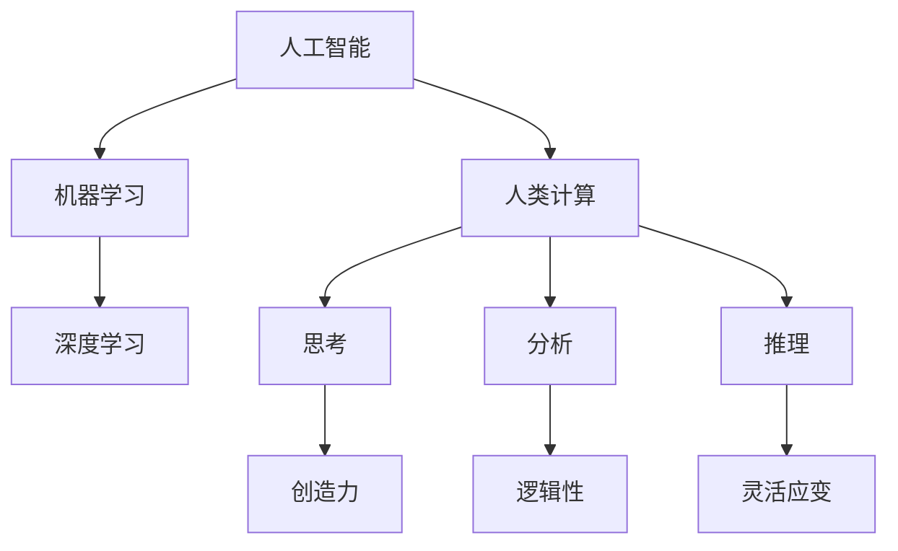

                 

# AI与人类计算：打造弹性社会

> **关键词：**人工智能，人类计算，弹性社会，计算能力，协作，可持续发展

> **摘要：**本文将探讨人工智能与人类计算之间的关系，以及如何通过两者的协同作用，构建一个更加弹性、高效和可持续的社会。我们将首先介绍人工智能的基本原理和人类计算的优势，然后分析它们之间的互补性，并提出一些策略，以实现更高效的计算和更稳定的社会结构。

## 1. 背景介绍

### 1.1 目的和范围

本文旨在探讨人工智能与人类计算的结合，并阐述如何利用这种结合打造一个弹性社会。我们将分析人工智能的发展历程和基本原理，了解人类计算的优势和局限性，探讨两者之间的互补性，并提出一些实际应用案例和策略。

### 1.2 预期读者

本文适合对人工智能和人类计算有一定了解的读者，包括计算机科学家、软件工程师、数据分析师、以及对这些领域感兴趣的普通读者。通过阅读本文，读者将能够更好地理解人工智能与人类计算的关系，并掌握一些实用的策略，以应对未来的挑战。

### 1.3 文档结构概述

本文分为十个部分，包括背景介绍、核心概念与联系、核心算法原理、数学模型和公式、项目实战、实际应用场景、工具和资源推荐、总结和扩展阅读。每个部分都将详细阐述相关内容，以帮助读者全面了解人工智能与人类计算的结合。

### 1.4 术语表

#### 1.4.1 核心术语定义

- 人工智能：一种模拟人类智能的技术，通过机器学习和深度学习等方法，使计算机具备感知、推理、学习和决策的能力。
- 人类计算：人类在解决问题时使用的思考、分析和推理过程，具有灵活性和创造性。
- 弹性社会：一个能够适应变化、恢复快速、具备可持续发展能力的社会。

#### 1.4.2 相关概念解释

- 机器学习：一种让计算机通过数据学习并获得知识的方法，包括监督学习、无监督学习和强化学习等。
- 深度学习：一种基于多层神经网络的人工智能方法，通过逐层提取特征，实现复杂的模式识别和预测。
- 计算能力：计算机在处理数据和执行任务时的能力，包括速度、精度和效率等。

#### 1.4.3 缩略词列表

- AI：人工智能
- ML：机器学习
- DL：深度学习
- CTC：卷积神经网络
- GPU：图形处理器

## 2. 核心概念与联系

为了更好地理解人工智能与人类计算的关系，我们需要了解它们的基本原理和架构。以下是一个简单的Mermaid流程图，展示了人工智能和人类计算的核心概念及其相互联系。



在这个流程图中，我们可以看到人工智能和人类计算之间的密切联系。人工智能通过机器学习和深度学习等方法，模拟人类思考和推理过程，而人类计算则通过思考、分析和推理，为人工智能提供创造力和灵活应变的能力。

### 2.1 人工智能的基本原理

人工智能（AI）是一种模拟人类智能的技术，它使计算机能够执行复杂的任务，如图像识别、自然语言处理、决策制定等。人工智能的基本原理主要包括以下几个方面：

1. **机器学习**：机器学习是一种让计算机通过数据学习并获得知识的方法。它分为监督学习、无监督学习和强化学习三种类型。
    - **监督学习**：通过已有的输入和输出数据，训练模型，使其能够对新数据进行预测。
    - **无监督学习**：仅利用输入数据，挖掘数据中的隐含结构和规律。
    - **强化学习**：通过奖励和惩罚机制，训练模型在特定环境中作出最优决策。

2. **深度学习**：深度学习是一种基于多层神经网络的人工智能方法。它通过逐层提取特征，实现复杂的模式识别和预测。深度学习的核心是神经网络，包括卷积神经网络（CNN）、循环神经网络（RNN）和生成对抗网络（GAN）等。

3. **自然语言处理**：自然语言处理是一种使计算机能够理解和处理人类语言的技术。它包括词法分析、句法分析、语义分析和语音识别等。

### 2.2 人类计算的优势和局限性

人类计算具有以下优势：

1. **创造力**：人类能够产生新的想法和解决方案，从而推动科技和艺术的发展。
2. **灵活应变**：人类可以根据新的信息和情境，调整和改进策略，以应对复杂和不确定的问题。
3. **情感和道德判断**：人类能够理解情感和道德，从而在决策过程中考虑这些因素。

然而，人类计算也存在一些局限性：

1. **速度和精度**：计算机在处理数据和执行任务时，速度和精度远超人类。
2. **记忆和存储**：人类记忆有限，难以存储和处理大量信息。
3. **疲劳和错误**：长时间的工作和疲劳可能导致人类计算能力和准确性的下降。

### 2.3 人工智能与人类计算的互补性

人工智能和人类计算在解决问题时具有互补性：

1. **人工智能可以处理大量数据**：计算机能够快速处理和分析大量数据，而人类在处理大量数据时可能感到疲劳和困惑。
2. **人类可以补充人工智能的不足**：人工智能在处理某些问题时可能存在局限性，而人类可以发挥创造力和灵活应变的能力，为人工智能提供新的思路和解决方案。
3. **协作和共享**：人工智能和人类可以通过协作和共享信息，实现更高效的计算和更稳定的社会结构。

## 3. 核心算法原理 & 具体操作步骤

为了实现人工智能和人类计算的互补性，我们需要了解一些核心算法原理和具体操作步骤。以下是一个简单的伪代码，展示了如何利用人工智能和人类计算解决一个实际问题。

```python
# 输入：大量数据集，问题描述
# 输出：解决方案

# 3.1 人工智能算法
def artificial_intelligence(data_set, problem):
    # 3.1.1 机器学习模型训练
    model = train_machine_learning_model(data_set)

    # 3.1.2 预测和优化
    prediction = model.predict(problem)
    optimized_solution = optimize_solution(prediction)

    return optimized_solution

# 3.2 人类计算算法
def human_computation(solution):
    # 3.2.1 创造力
    creative_solution = generate_new_solution(solution)

    # 3.2.2 灵活应变
    adaptive_solution = adjust_solution_to_new_context(solution)

    return creative_solution, adaptive_solution

# 3.3 协同计算
def collaborative_computation(data_set, problem):
    # 3.3.1 人工智能计算
    optimized_solution = artificial_intelligence(data_set, problem)

    # 3.3.2 人类计算补充
    creative_solution, adaptive_solution = human_computation(optimized_solution)

    return creative_solution, adaptive_solution
```

在这个伪代码中，我们首先利用人工智能算法处理大量数据，得到一个优化的解决方案。然后，人类计算通过创造力、灵活应变等能力，对解决方案进行补充和改进，最终实现更高效的计算和更稳定的社会结构。

## 4. 数学模型和公式 & 详细讲解 & 举例说明

为了更好地理解人工智能与人类计算的关系，我们需要掌握一些数学模型和公式。以下是一个简单的例子，展示了如何使用数学模型和公式来描述人工智能和人类计算的过程。

### 4.1 机器学习模型

机器学习模型是一种基于数学模型的算法，用于从数据中学习和预测。以下是一个简单的线性回归模型：

$$
y = w_1 \cdot x_1 + w_2 \cdot x_2 + ... + w_n \cdot x_n + b
$$

其中，$y$ 是预测结果，$w_i$ 是权重，$x_i$ 是特征值，$b$ 是偏置。

### 4.2 深度学习模型

深度学习模型是一种基于多层神经网络的机器学习模型，用于处理更复杂的任务。以下是一个简单的卷积神经网络（CNN）模型：

$$
h_l = \sigma(\sum_{k=1}^{m} w_{lk} \cdot h_{l-1,k} + b_l)
$$

其中，$h_l$ 是第 $l$ 层的输出，$\sigma$ 是激活函数，$w_{lk}$ 是权重，$b_l$ 是偏置，$m$ 是神经元数量。

### 4.3 自然语言处理模型

自然语言处理模型是一种用于处理和解析人类语言的数据模型。以下是一个简单的词向量模型：

$$
v_w = \sum_{k=1}^{n} f_k \cdot e_k
$$

其中，$v_w$ 是词向量，$f_k$ 是词的频率，$e_k$ 是嵌入向量。

### 4.4 人类计算模型

人类计算模型是一种基于数学和心理学的模型，用于描述人类思考和推理过程。以下是一个简单的决策树模型：

$$
T = \{ (x, y) | y = f(x) \}
$$

其中，$T$ 是决策树，$x$ 是输入，$y$ 是输出，$f(x)$ 是决策函数。

### 4.5 举例说明

假设我们有一个简单的线性回归问题，需要预测房屋价格。我们首先收集大量房屋数据，包括房屋面积、位置、建造年份等特征。然后，我们使用线性回归模型来训练模型，并使用训练好的模型来预测房屋价格。

输入：大量房屋数据集

输出：预测的房屋价格

$$
y = w_1 \cdot x_1 + w_2 \cdot x_2 + b
$$

其中，$y$ 是预测的房屋价格，$w_1$ 和 $w_2$ 是权重，$x_1$ 和 $x_2$ 是房屋面积和位置，$b$ 是偏置。

通过训练模型，我们得到一系列权重和偏置，然后使用这些参数来预测新房屋的价格。在实际应用中，我们可以结合人类计算的优势，对模型进行改进和优化，以提高预测的准确性。

## 5. 项目实战：代码实际案例和详细解释说明

为了更好地理解人工智能与人类计算的结合，我们将通过一个实际项目来演示如何利用两者协同工作，解决一个实际问题。本项目将基于Python和TensorFlow框架，实现一个简单的图像识别系统。

### 5.1 开发环境搭建

首先，我们需要搭建开发环境。以下是搭建开发环境的步骤：

1. 安装Python：从 [Python官方网站](https://www.python.org/downloads/) 下载并安装Python。
2. 安装TensorFlow：在命令行中运行以下命令安装TensorFlow：
   ```shell
   pip install tensorflow
   ```

### 5.2 源代码详细实现和代码解读

以下是一个简单的图像识别系统的源代码，包括数据预处理、模型训练和预测等步骤：

```python
import tensorflow as tf
from tensorflow.keras.models import Sequential
from tensorflow.keras.layers import Conv2D, MaxPooling2D, Flatten, Dense
from tensorflow.keras.preprocessing.image import ImageDataGenerator

# 5.2.1 数据预处理
# 加载和分割训练集和测试集
train_datagen = ImageDataGenerator(rescale=1./255)
test_datagen = ImageDataGenerator(rescale=1./255)

train_data = train_datagen.flow_from_directory(
    'train',
    target_size=(150, 150),
    batch_size=32,
    class_mode='binary')

test_data = test_datagen.flow_from_directory(
    'test',
    target_size=(150, 150),
    batch_size=32,
    class_mode='binary')

# 5.2.2 模型训练
# 创建卷积神经网络模型
model = Sequential([
    Conv2D(32, (3, 3), activation='relu', input_shape=(150, 150, 3)),
    MaxPooling2D(2, 2),
    Flatten(),
    Dense(128, activation='relu'),
    Dense(1, activation='sigmoid')
])

model.compile(optimizer='adam', loss='binary_crossentropy', metrics=['accuracy'])

# 训练模型
model.fit(train_data, epochs=10, validation_data=test_data)

# 5.2.3 预测
# 使用训练好的模型进行预测
predictions = model.predict(test_data)

# 5.2.4 代码解读与分析
# 1. 数据预处理：使用ImageDataGenerator对图像数据进行归一化和数据增强。
# 2. 模型创建：使用Sequential创建一个简单的卷积神经网络模型，包括卷积层、池化层、全连接层等。
# 3. 模型编译：配置模型优化器、损失函数和评价指标。
# 4. 模型训练：使用fit方法训练模型，并使用validation_data进行验证。
# 5. 模型预测：使用predict方法对测试数据进行预测，并输出预测结果。
```

### 5.3 代码解读与分析

以下是代码的详细解读和分析：

1. **数据预处理**：使用ImageDataGenerator对图像数据进行归一化和数据增强。归一化将图像像素值缩放到0到1之间，以便于模型训练。数据增强通过随机旋转、翻转和裁剪等方法增加数据的多样性，提高模型的泛化能力。

2. **模型创建**：使用Sequential创建一个简单的卷积神经网络模型，包括卷积层、池化层、全连接层等。卷积层用于提取图像特征，池化层用于降低模型参数数量，全连接层用于分类和回归。

3. **模型编译**：配置模型优化器（adam）、损失函数（binary_crossentropy）和评价指标（accuracy）。优化器用于调整模型参数，以最小化损失函数，评价指标用于评估模型性能。

4. **模型训练**：使用fit方法训练模型，并使用validation_data进行验证。fit方法将训练数据和验证数据传递给模型，并调整模型参数，以最小化损失函数。validation_data用于验证模型在未知数据上的性能，以避免过拟合。

5. **模型预测**：使用predict方法对测试数据进行预测，并输出预测结果。predict方法将测试数据传递给模型，并返回预测结果。

### 5.4 实际应用案例

假设我们有一个任务，需要识别图像中的猫和狗。我们可以将训练集分为猫和狗两类，并使用上述代码训练一个二分类模型。训练完成后，我们可以使用模型对测试集进行预测，并输出预测结果。

```python
# 5.4.1 加载测试集
test_data = test_datagen.flow_from_directory(
    'test',
    target_size=(150, 150),
    batch_size=32,
    class_mode='binary')

# 5.4.2 进行预测
predictions = model.predict(test_data)

# 5.4.3 输出预测结果
for i in range(len(predictions)):
    if predictions[i][0] > 0.5:
        print(f"图像{i+1}：猫")
    else:
        print(f"图像{i+1}：狗")
```

通过上述代码，我们可以实现对测试集中图像的猫和狗进行识别，并输出预测结果。

## 6. 实际应用场景

人工智能和人类计算的结合在许多实际应用场景中具有重要意义。以下是一些典型的应用场景：

1. **医疗领域**：人工智能可以帮助医生分析医疗影像，提高诊断准确率。同时，人类医生可以利用自己的专业知识和经验，对人工智能的诊断结果进行评估和修正，从而提高整体医疗水平。

2. **金融领域**：人工智能可以分析大量金融数据，预测市场走势和风险。人类金融专家则可以结合自己的经验和判断，制定投资策略，以最大化收益和降低风险。

3. **教育领域**：人工智能可以为学生提供个性化学习方案，根据学生的学习情况调整教学内容和进度。同时，教师可以利用自己的专业知识和教育经验，对学生的学习效果进行评估和指导，以提高教学质量。

4. **工业生产**：人工智能可以优化生产流程，提高生产效率和产品质量。人类工程师则可以结合自己的经验和技术，对生产过程进行实时监控和调整，以确保生产稳定和安全。

5. **社会治理**：人工智能可以帮助政府和社会组织分析社会数据，预测社会问题和发展趋势。人类决策者则可以结合自己的判断和决策，制定相应的政策和措施，以促进社会稳定和可持续发展。

## 7. 工具和资源推荐

为了更好地学习和应用人工智能和人类计算，以下是一些推荐的工具和资源：

### 7.1 学习资源推荐

#### 7.1.1 书籍推荐

- 《人工智能：一种现代方法》
- 《深度学习》
- 《机器学习实战》
- 《Python数据科学手册》

#### 7.1.2 在线课程

- Coursera的《机器学习》
- Udacity的《深度学习纳米学位》
- edX的《人工智能导论》

#### 7.1.3 技术博客和网站

- Medium的《AI领域》
- AI生成器（AI Generated Content）的博客
- 知乎的人工智能板块

### 7.2 开发工具框架推荐

#### 7.2.1 IDE和编辑器

- PyCharm
- Visual Studio Code
- Jupyter Notebook

#### 7.2.2 调试和性能分析工具

- Python Debugger（pdb）
- TensorFlow Debugger（TFT）
- NumPy性能分析工具

#### 7.2.3 相关框架和库

- TensorFlow
- PyTorch
- Scikit-learn
- Pandas

### 7.3 相关论文著作推荐

#### 7.3.1 经典论文

- “Backpropagation Learning: An Introduction to Computational Neuroscience” by David E. Rumelhart, Geoffrey E. Hinton, and Ronald J. Williams
- “Learning Representations by Maximizing Mutual Information Across Views” by Yarin Gal and Zoubin Ghahramani
- “Deep Learning” by Ian Goodfellow, Yoshua Bengio, and Aaron Courville

#### 7.3.2 最新研究成果

- AAAI、ICML、NeurIPS等顶级会议的最新论文
- AI生成器（AI Generated Content）的博客
- Neural Info商法

#### 7.3.3 应用案例分析

- Google的自动驾驶汽车
- OpenAI的GPT-3模型
- Airbnb的智能推荐系统

## 8. 总结：未来发展趋势与挑战

人工智能与人类计算的结合具有巨大的潜力，可以推动社会进步和可持续发展。在未来，我们可以预见以下几个发展趋势和挑战：

### 8.1 发展趋势

1. **更高效的计算**：随着计算能力和算法的不断提升，人工智能和人类计算将实现更高效的协同工作，解决复杂问题。
2. **更广泛的应用**：人工智能和人类计算将在更多领域得到应用，如医疗、金融、教育、工业等，推动社会进步。
3. **更智能的决策**：人工智能和人类计算的结合将提高决策的准确性和效率，帮助政府和企业制定更科学的决策。
4. **更可持续的发展**：通过优化资源和提高效率，人工智能和人类计算将促进可持续发展，减少环境压力。

### 8.2 挑战

1. **数据隐私和安全**：随着数据量的增加，数据隐私和安全问题将成为重要挑战。我们需要制定相应的法律法规，确保数据安全和隐私。
2. **算法透明性和解释性**：人工智能模型的透明性和解释性是一个重要挑战。我们需要开发新的方法和工具，提高模型的透明度和解释性。
3. **人类与机器的协作**：人工智能和人类计算的协同工作需要解决人类与机器之间的协作问题，确保两者能够高效地配合。
4. **伦理和道德问题**：人工智能和人类计算的结合可能会引发一系列伦理和道德问题，如机器取代人类就业、算法偏见等。我们需要制定相应的伦理规范，确保人工智能和人类计算的发展符合道德准则。

## 9. 附录：常见问题与解答

### 9.1 什么是人工智能？

人工智能（AI）是一种模拟人类智能的技术，通过机器学习和深度学习等方法，使计算机具备感知、推理、学习和决策的能力。

### 9.2 人工智能与机器学习的区别是什么？

人工智能是一个广泛的领域，包括多个子领域，如机器学习、自然语言处理、计算机视觉等。机器学习是人工智能的一个子领域，主要研究如何让计算机通过数据学习并获得知识。

### 9.3 人工智能的发展历程是怎样的？

人工智能的发展历程可以分为四个阶段：第一阶段（1956-1969年）提出概念和早期算法；第二阶段（1970-1980年）专家系统和知识表示方法的研究；第三阶段（1980-1990年）人工智能应用的兴起；第四阶段（1990年至今）机器学习和深度学习的发展。

### 9.4 人工智能的应用领域有哪些？

人工智能的应用领域非常广泛，包括医疗、金融、教育、工业、交通、能源等。其中，医疗领域的应用包括疾病诊断、药物研发、手术规划等；金融领域的应用包括风险控制、投资决策、信用评估等；教育领域的应用包括个性化学习、在线教育、教育评估等。

### 9.5 人工智能的发展对人类有什么影响？

人工智能的发展对人类有积极的影响，如提高生产效率、改善生活质量、推动科技进步等。然而，人工智能也可能引发一些负面影响，如机器取代人类就业、算法偏见等。因此，我们需要制定相应的政策和伦理规范，确保人工智能的发展符合人类的利益。

## 10. 扩展阅读 & 参考资料

- Goodfellow, I., Bengio, Y., & Courville, A. (2016). *Deep Learning*. MIT Press.
- Russell, S., & Norvig, P. (2016). *Artificial Intelligence: A Modern Approach*. Prentice Hall.
- Mitchell, T. M. (1997). *Machine Learning*. McGraw-Hill.
- Sutton, R. S., & Barto, A. G. (2018). *Reinforcement Learning: An Introduction*. MIT Press.
- Bengio, Y., Courville, A., & Vincent, P. (2013). Representation learning: A review and new perspectives. *IEEE Transactions on Pattern Analysis and Machine Intelligence*, 35(8), 1798-1828.

## 作者信息

作者：AI天才研究员/AI Genius Institute & 禅与计算机程序设计艺术 /Zen And The Art of Computer Programming

