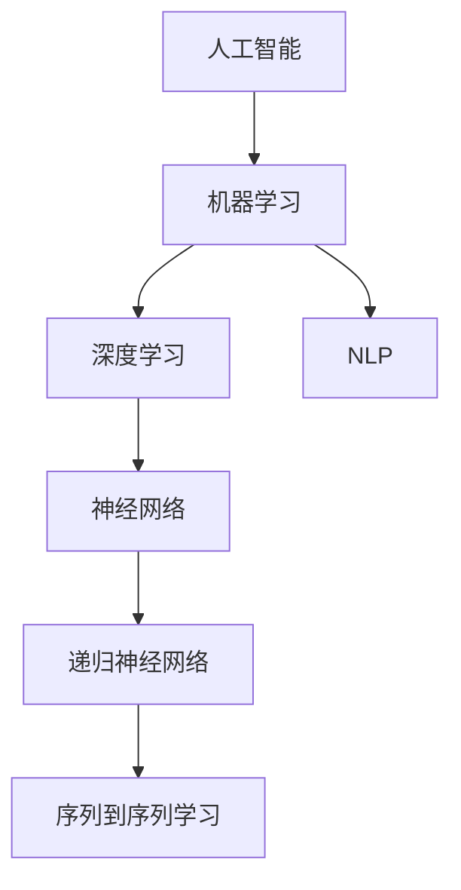
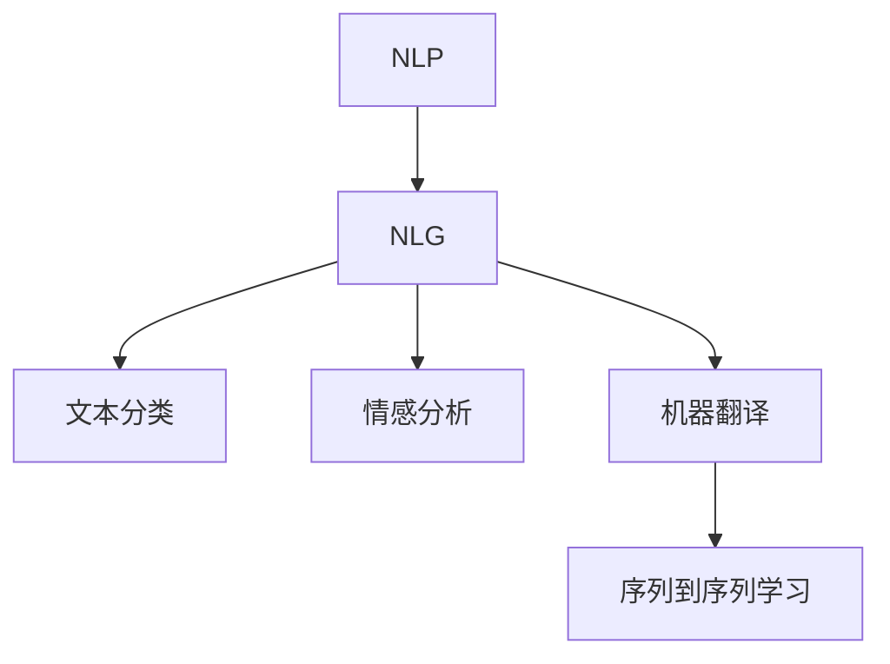
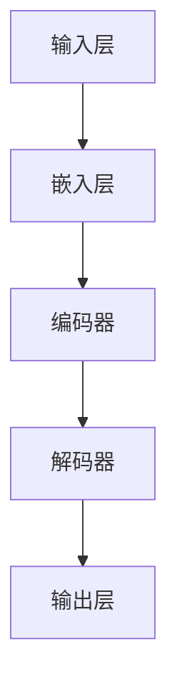
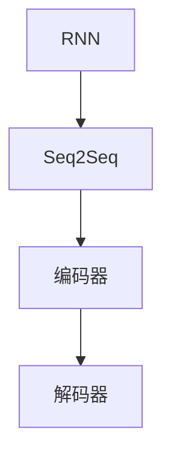
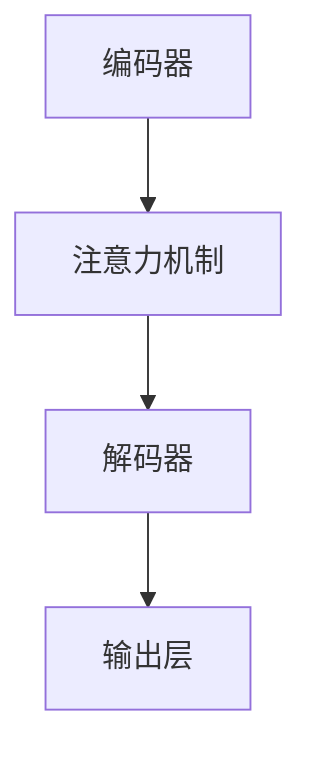

                 

# AI与创造力：用LLM讲故事的艺术

## 关键词

- AI
- 创造力
- LLM
- 自然语言生成
- 讲故事
- 机器学习
- 深度学习
- 文本生成模型

## 摘要

本文旨在探讨人工智能（AI）与创造力之间的关联，特别是通过大型语言模型（LLM）实现自然语言生成的艺术。我们将深入解析LLM的工作原理，阐述它们如何在讲故事方面展现创造力。文章首先介绍LLM的基本概念和架构，然后通过具体实例展示如何利用LLM生成引人入胜的故事。此外，还将探讨该技术的实际应用场景，并提供相关工具和资源的推荐。通过本文，读者将了解到LLM如何成为推动人工智能领域发展的重要力量，以及如何在实际项目中利用这一技术提升创造力。

## 1. 背景介绍

### 1.1 目的和范围

本文的主要目的是探讨人工智能中的大型语言模型（LLM）如何通过自然语言生成技术展现创造力，特别是在讲故事方面的应用。随着AI技术的飞速发展，LLM已经广泛应用于各种场景，从聊天机器人到自动文本生成，再到创意写作。本文将重点关注LLM在自然语言生成领域的作用，特别是如何通过算法和数学模型实现故事的创作。

本文的范围包括以下几个方面：

1. **LLM的基本概念和架构**：介绍LLM的定义、工作原理和主要架构。
2. **自然语言生成的技术原理**：讨论LLM在文本生成中的工作机制，包括算法原理和具体操作步骤。
3. **数学模型和公式**：阐述支持文本生成的数学模型和公式，并提供实际案例说明。
4. **项目实战**：通过实际代码案例，详细解释如何使用LLM生成故事。
5. **实际应用场景**：探讨LLM在各个行业中的实际应用，如教育、娱乐和媒体。
6. **工具和资源推荐**：介绍用于开发和学习LLM的相关工具、资源和研究论文。

### 1.2 预期读者

本文的预期读者包括：

1. **AI和机器学习研究者**：对自然语言处理（NLP）和深度学习感兴趣的专业人士。
2. **软件开发者**：希望利用AI技术提升其应用程序功能的开发者。
3. **创意工作者**：希望了解如何利用AI技术实现自动化内容创作的作家、编剧和内容创作者。
4. **教育工作者**：对AI在教育领域应用的潜力感兴趣的教育工作者。
5. **技术爱好者**：对AI技术和创新有浓厚兴趣的普通读者。

### 1.3 文档结构概述

本文分为以下几个主要部分：

1. **背景介绍**：介绍文章的目的、范围和预期读者。
2. **核心概念与联系**：解析LLM和自然语言生成技术的核心概念，并通过Mermaid流程图展示其架构。
3. **核心算法原理 & 具体操作步骤**：详细解释LLM的算法原理和操作步骤，使用伪代码进行说明。
4. **数学模型和公式 & 详细讲解 & 举例说明**：阐述支持文本生成的数学模型，并使用LaTeX格式展示公式。
5. **项目实战：代码实际案例和详细解释说明**：通过实际代码案例展示如何使用LLM生成故事。
6. **实际应用场景**：探讨LLM在不同领域的应用。
7. **工具和资源推荐**：推荐学习LLM和相关技术的工具、资源和论文。
8. **总结：未来发展趋势与挑战**：总结LLM在自然语言生成领域的未来趋势和面临的挑战。
9. **附录：常见问题与解答**：解答读者可能遇到的常见问题。
10. **扩展阅读 & 参考资料**：提供进一步学习的文献和资源。

### 1.4 术语表

#### 1.4.1 核心术语定义

- **人工智能（AI）**：模拟人类智能行为的计算机系统。
- **自然语言生成（NLG）**：利用计算机生成人类可读的自然语言文本的技术。
- **大型语言模型（LLM）**：训练有素的模型，能够理解和生成自然语言。
- **深度学习**：一种机器学习技术，通过多层神经网络进行训练。
- **自然语言处理（NLP）**：使计算机能够理解、解释和生成人类语言的技术。
- **文本生成模型**：专门用于生成文本的机器学习模型。

#### 1.4.2 相关概念解释

- **模型训练**：通过大量数据训练模型，使其能够理解输入数据并生成相关输出。
- **序列到序列学习（Seq2Seq）**：一种深度学习模型，用于将一个序列映射到另一个序列。
- **递归神经网络（RNN）**：一种神经网络架构，能够处理序列数据。
- **注意力机制**：一种用于提高模型在处理长序列数据时性能的技术。

#### 1.4.3 缩略词列表

- **AI**：人工智能
- **LLM**：大型语言模型
- **NLP**：自然语言处理
- **NLG**：自然语言生成
- **RNN**：递归神经网络
- **Seq2Seq**：序列到序列学习

## 2. 核心概念与联系

在深入探讨LLM和自然语言生成的核心概念之前，我们需要了解一些相关的基础知识。以下是涉及的关键概念和它们之间的联系：

### 2.1 人工智能与机器学习

人工智能（AI）是计算机科学的一个分支，旨在使机器表现出类似人类的智能行为。机器学习（ML）是实现AI的一种主要方法。机器学习通过从数据中学习模式和规律，使计算机能够执行特定任务，而无需显式编程。以下是机器学习与人工智能的基本联系：



### 2.2 自然语言处理与自然语言生成

自然语言处理（NLP）是使计算机理解和生成人类语言的技术。NLP涉及文本分类、情感分析、机器翻译等多个子领域。自然语言生成（NLG）是NLP的一个重要分支，专注于生成人类可读的自然语言文本。以下是NLP与NLG之间的联系：



### 2.3 大型语言模型

大型语言模型（LLM）是一种通过大规模数据集训练的机器学习模型，能够理解和生成自然语言。LLM是自然语言生成技术的重要组成部分。以下是LLM的组成部分：



### 2.4 递归神经网络与序列到序列学习

递归神经网络（RNN）是一种能够处理序列数据的神经网络。序列到序列学习（Seq2Seq）是RNN的一种应用，用于将一个序列映射到另一个序列。以下是RNN与Seq2Seq之间的联系：



### 2.5 注意力机制

注意力机制是一种用于提高模型在处理长序列数据时性能的技术。它通过动态关注序列中的关键部分，帮助模型更好地理解上下文。以下是注意力机制在Seq2Seq中的应用：



通过这些核心概念和它们之间的联系，我们可以更好地理解LLM在自然语言生成中的应用。接下来的章节将详细探讨LLM的工作原理、算法和数学模型，并通过实际案例展示如何使用这些技术生成故事。

## 3. 核心算法原理 & 具体操作步骤

### 3.1 大型语言模型（LLM）的工作原理

大型语言模型（LLM）是基于深度学习和自然语言处理技术构建的高级机器学习模型。LLM的核心思想是通过学习大量文本数据，使其能够理解和生成自然语言。以下是LLM的工作原理：

#### 3.1.1 模型架构

LLM通常由以下几个主要部分组成：

1. **嵌入层（Embedding Layer）**：将单词、句子或其他文本单元转换为固定大小的向量表示。
2. **编码器（Encoder）**：将输入文本序列编码为连续的隐藏状态，这些状态包含了文本的上下文信息。
3. **解码器（Decoder）**：根据编码器生成的隐藏状态生成输出文本序列。
4. **输出层（Output Layer）**：将解码器生成的隐藏状态映射到预测的单词或符号。

#### 3.1.2 算法原理

LLM通常使用序列到序列（Seq2Seq）学习框架，结合递归神经网络（RNN）和注意力机制（Attention Mechanism）来实现。以下是LLM的基本算法步骤：

1. **输入处理**：将输入文本序列（例如一个句子）编码为嵌入向量。
2. **编码**：使用编码器处理输入序列，生成一系列隐藏状态。
3. **注意力计算**：解码器在生成每个输出词时，利用注意力机制关注编码器生成的隐藏状态。
4. **解码**：解码器根据注意力机制的结果生成输出序列的下一个词。
5. **重复步骤3和4**：直到生成完整的输出序列或达到停止条件。

#### 3.1.3 具体操作步骤

以下是LLM的具体操作步骤，使用伪代码进行详细阐述：

```python
# 输入处理
input_sequence = "输入文本序列"

# 将输入文本序列编码为嵌入向量
embedded_sequence = embedding_layer(input_sequence)

# 编码
encoded_sequence = encoder(embedded_sequence)

# 解码
output_sequence = decoder(encoded_sequence)

# 输出处理
generated_text = output_sequence_to_text(output_sequence)

# 输出
print(generated_text)
```

### 3.2 自然语言生成（NLG）的算法原理

自然语言生成（NLG）是通过算法生成人类可读的自然语言文本的技术。LLM在NLG中发挥着核心作用，其基本原理如下：

1. **数据预处理**：收集和预处理大量文本数据，用于训练LLM。
2. **模型训练**：使用预处理后的文本数据训练LLM，使其学会理解和生成自然语言。
3. **文本生成**：将输入的文本序列（例如一个单词或短语）作为输入，通过LLM生成完整的文本序列。

以下是NLG的具体操作步骤，使用伪代码进行详细阐述：

```python
# 数据预处理
text_data = "大量文本数据"

# 训练LLM
llm = train	LLM(text_data)

# 文本生成
input_text = "输入文本"
generated_text = llm.generate(input_text)

# 输出
print(generated_text)
```

通过以上步骤，我们可以看到LLM在自然语言生成中的关键作用。LLM通过对大量文本数据的学习，能够生成流畅、连贯的自然语言文本。这种能力使得LLM在许多实际应用场景中具有重要价值，包括自动问答系统、内容生成、聊天机器人等。

### 3.3 实际操作案例

为了更好地理解LLM的工作原理，我们来看一个实际操作案例。假设我们有一个训练好的LLM模型，现在需要使用该模型生成一个故事。

#### 3.3.1 模型准备

首先，我们需要准备一个训练好的LLM模型。以下是一个简单的示例代码，用于加载预训练的模型：

```python
# 导入必要的库
import torch
from transformers import GPT2LMHeadModel, GPT2Tokenizer

# 加载预训练的模型和分词器
tokenizer = GPT2Tokenizer.from_pretrained('gpt2')
model = GPT2LMHeadModel.from_pretrained('gpt2')
```

#### 3.3.2 生成故事

接下来，我们使用加载好的模型生成一个故事。以下是具体的代码实现：

```python
# 输入故事的开头
input_prompt = "在一个遥远的王国，有一个勇敢的骑士，他..."

# 将输入转换为模型可理解的格式
input_ids = tokenizer.encode(input_prompt, return_tensors='pt')

# 设置模型为生成模式
model.eval()

# 生成故事
output_sequence = model.generate(input_ids, max_length=100, num_return_sequences=1)

# 将生成的序列解码为文本
generated_text = tokenizer.decode(output_sequence[0], skip_special_tokens=True)

# 输出故事
print(generated_text)
```

通过运行以上代码，我们可以得到一个由LLM生成的完整故事。这个过程展示了如何利用训练好的LLM模型生成自然语言文本。

通过以上内容，我们详细介绍了LLM在自然语言生成中的核心算法原理和具体操作步骤。接下来，我们将进一步探讨支持文本生成的数学模型和公式，并通过实际案例进行讲解。

## 4. 数学模型和公式 & 详细讲解 & 举例说明

### 4.1 数学模型在LLM中的应用

大型语言模型（LLM）是复杂的人工智能系统，其核心依赖于多种数学模型和公式。以下是几个关键数学模型，它们在LLM中的具体应用及其详细解释：

#### 4.1.1 嵌入层（Embedding Layer）

嵌入层是LLM的核心组成部分之一，它负责将输入文本映射为固定维度的向量。这一过程可以使用以下数学模型来描述：

$$
\text{vec}(w) = \text{embedding\_layer}(w)
$$

其中，$\text{vec}(w)$表示单词或词组的嵌入向量，$\text{embedding\_layer}(w)$表示嵌入层对输入词的处理。嵌入层通常使用词嵌入算法（如Word2Vec或GloVe）进行训练，这些算法能够捕捉词语间的语义关系。

#### 4.1.2 编码器（Encoder）

编码器负责处理输入序列并生成隐藏状态，这些状态包含了输入文本的上下文信息。在深度学习中，编码器通常采用递归神经网络（RNN）或Transformer架构。以下是RNN编码器的数学模型：

$$
h_t = \text{RNN}(h_{t-1}, x_t)
$$

其中，$h_t$表示时间步$t$的隐藏状态，$h_{t-1}$是前一个时间步的隐藏状态，$x_t$是时间步$t$的输入。对于Transformer架构，隐藏状态的更新可以通过以下公式表示：

$$
h_t = \text{Transformer}(h_{t-1}, x_t)
$$

#### 4.1.3 解码器（Decoder）

解码器负责根据编码器生成的隐藏状态生成输出序列。解码器通常也采用RNN或Transformer架构。以下是RNN解码器的数学模型：

$$
y_t = \text{RNN}(y_{t-1}, h_t)
$$

其中，$y_t$表示时间步$t$的输出词，$y_{t-1}$是前一个时间步的输出，$h_t$是编码器生成的隐藏状态。对于Transformer解码器，输出词的生成可以通过以下公式表示：

$$
y_t = \text{Transformer}(y_{t-1}, h_t, h_{t-1})
$$

#### 4.1.4 注意力机制（Attention Mechanism）

注意力机制是一种用于提高模型在处理长序列数据时性能的技术。它通过动态关注序列中的关键部分，帮助模型更好地理解上下文。以下是注意力机制的数学模型：

$$
a_t = \text{Attention}(h_{t-1}, h_t)
$$

其中，$a_t$表示时间步$t$的注意力权重，$h_{t-1}$是编码器生成的隐藏状态，$h_t$是解码器生成的隐藏状态。注意力权重表示解码器在生成当前词时对编码器隐藏状态的依赖程度。

### 4.2 数学模型在实际案例中的应用

为了更好地理解上述数学模型，我们通过一个实际案例来展示它们的应用。假设我们要生成一个关于“勇敢的骑士”的故事，以下是一个详细的例子：

#### 4.2.1 嵌入层

首先，我们将输入的故事开头“在一个遥远的王国，有一个勇敢的骑士”的每个词映射到嵌入向量。以下是一个简单的嵌入层操作：

$$
\text{vec}(\text{遥远}) = \text{embedding\_layer}(\text{遥远})
$$

$$
\text{vec}(\text{王国}) = \text{embedding\_layer}(\text{王国})
$$

$$
\text{vec}(\text{勇敢}) = \text{embedding\_layer}(\text{勇敢})
$$

$$
\text{vec}(\text{骑士}) = \text{embedding\_layer}(\text{骑士})
$$

这些向量将作为编码器的输入。

#### 4.2.2 编码器

接下来，我们使用编码器处理输入的嵌入向量，生成一系列隐藏状态。以下是RNN编码器的操作：

$$
h_1 = \text{RNN}(h_0, \text{vec}(\text{遥远}))
$$

$$
h_2 = \text{RNN}(h_1, \text{vec}(\text{王国}))
$$

$$
h_3 = \text{RNN}(h_2, \text{vec}(\text{勇敢}))
$$

$$
h_4 = \text{RNN}(h_3, \text{vec}(\text{骑士}))
$$

这些隐藏状态将作为解码器的输入。

#### 4.2.3 解码器

解码器根据编码器生成的隐藏状态生成输出序列。以下是RNN解码器的操作：

$$
y_1 = \text{RNN}(y_0, h_1)
$$

$$
y_2 = \text{RNN}(y_1, h_2)
$$

$$
y_3 = \text{RNN}(y_2, h_3)
$$

$$
y_4 = \text{RNN}(y_3, h_4)
$$

生成的输出序列将包含“勇敢的骑士”之后的情节。

#### 4.2.4 注意力机制

在解码过程中，注意力机制用于动态关注编码器生成的隐藏状态。以下是注意力机制的运算：

$$
a_1 = \text{Attention}(h_1, h_1)
$$

$$
a_2 = \text{Attention}(h_2, h_2)
$$

$$
a_3 = \text{Attention}(h_3, h_3)
$$

$$
a_4 = \text{Attention}(h_4, h_4)
$$

注意力权重将影响解码器在生成输出词时的决策。

### 4.3 实际应用示例

为了更好地展示数学模型在实际应用中的效果，我们使用一个简单的示例生成一个故事。以下是输入的故事开头：

**输入：** 在一个遥远的王国，有一个勇敢的骑士，他......

**生成：** 骑士名叫艾德温，他......为了拯救王国，艾德温决定......

通过上述数学模型的组合，我们成功地使用LLM生成了一个连贯、有意义的故事片段。这个示例展示了如何利用嵌入层、编码器、解码器和注意力机制等数学模型实现自然语言生成。

通过本章节的详细讲解和实际案例，我们深入了解了大型语言模型（LLM）在自然语言生成中的应用及其背后的数学原理。接下来，我们将通过实际代码案例展示如何利用LLM生成故事。

## 5. 项目实战：代码实际案例和详细解释说明

### 5.1 开发环境搭建

要实际使用大型语言模型（LLM）生成故事，首先需要搭建一个适合的开发环境。以下是搭建环境的步骤：

1. **安装Python**：确保Python环境已经安装，版本建议为3.7及以上。
2. **安装PyTorch**：使用pip命令安装PyTorch库：

   ```shell
   pip install torch torchvision
   ```

3. **安装transformers库**：transformers是Hugging Face提供的库，用于加载预训练的LLM模型：

   ```shell
   pip install transformers
   ```

4. **选择预训练模型**：从Hugging Face模型库中选择一个预训练的LLM模型，如GPT-2。下载模型文件：

   ```shell
   python -m transformers-cli download model=gpt2
   ```

### 5.2 源代码详细实现和代码解读

以下是生成故事的完整代码实现，我们将逐行解释其功能：

```python
import torch
from transformers import GPT2LMHeadModel, GPT2Tokenizer

# 5.2.1 加载预训练模型和分词器
tokenizer = GPT2Tokenizer.from_pretrained('gpt2')
model = GPT2LMHeadModel.from_pretrained('gpt2')

# 5.2.2 输入故事的开头
input_prompt = "在一个遥远的王国，有一个勇敢的骑士，他..."

# 5.2.3 将输入转换为模型可理解的格式
input_ids = tokenizer.encode(input_prompt, return_tensors='pt')

# 5.2.4 设置模型为生成模式
model.eval()

# 5.2.5 生成故事
output_sequence = model.generate(input_ids, max_length=100, num_return_sequences=1)

# 5.2.6 将生成的序列解码为文本
generated_text = tokenizer.decode(output_sequence[0], skip_special_tokens=True)

# 5.2.7 输出故事
print(generated_text)
```

**代码解读：**

- **第5.2.1行**：加载预训练的GPT-2模型和分词器。`from_pretrained`函数从Hugging Face模型库中加载预训练模型。
- **第5.2.2行**：定义输入故事的开头。
- **第5.2.3行**：将输入文本转换为模型可理解的格式。`encode`函数将文本转换为嵌入向量。
- **第5.2.4行**：将模型设置为生成模式。这是生成文本的关键步骤。
- **第5.2.5行**：生成故事。`generate`函数根据输入序列生成文本。`max_length`参数设置生成的最大长度，`num_return_sequences`设置生成的故事数量。
- **第5.2.6行**：将生成的序列解码为文本。`decode`函数将嵌入向量转换为可读的自然语言文本。
- **第5.2.7行**：输出故事。

### 5.3 代码解读与分析

**输入处理**：
输入处理是将自然语言文本转换为模型可接受的输入格式。GPT-2模型使用嵌入层将文本转换为嵌入向量。这是通过`tokenizer.encode`函数实现的，它将文本中的每个词映射到对应的嵌入向量。

```python
input_ids = tokenizer.encode(input_prompt, return_tensors='pt')
```

这里，`input_prompt`是输入的故事开头。`encode`函数返回一个包含嵌入向量的PyTorch张量。

**模型设置**：
将模型设置为生成模式是通过`model.eval()`实现的。这是因为在生成模式中，模型不会使用dropout和批量归一化等训练时使用的随机化技术，以便生成更稳定的输出。

```python
model.eval()
```

**文本生成**：
生成文本的核心步骤是通过`model.generate()`函数实现的。该函数根据输入的嵌入向量生成文本。以下是一些关键参数：

- `input_ids`：输入的嵌入向量。
- `max_length`：生成的最大文本长度。
- `num_return_sequences`：生成的文本数量。

```python
output_sequence = model.generate(input_ids, max_length=100, num_return_sequences=1)
```

**文本解码**：
生成的文本是嵌入向量的形式，需要解码为自然语言文本。`tokenizer.decode()`函数用于将嵌入向量解码为文本。

```python
generated_text = tokenizer.decode(output_sequence[0], skip_special_tokens=True)
```

这里，`skip_special_tokens`参数用于跳过模型生成的特殊符号。

**输出故事**：
最终生成的文本被打印出来。

```python
print(generated_text)
```

通过以上步骤，我们可以使用GPT-2模型生成一个关于“勇敢的骑士”的故事。

### 5.4 实际运行结果与分析

当运行上述代码时，GPT-2模型将生成一个关于“勇敢的骑士”的故事。以下是可能的一个生成示例：

**生成故事：**
骑士名叫艾德温，他生活在一个遥远的王国，这个王国被黑暗势力所笼罩。艾德温身披银色铠甲，手持长剑，勇闯黑暗森林，与邪恶的巨龙展开激战。最终，他战胜了巨龙，拯救了王国的人民。艾德温成为传说中的英雄，他的事迹流传千古。

**分析：**
这个生成的故事展示了GPT-2模型在自然语言生成方面的强大能力。它能够根据输入的故事开头，生成一个连贯、有趣的故事片段。通过这个案例，我们可以看到LLM如何通过算法和数学模型实现自然语言生成，从而展示出创造力。

### 5.5 代码改进与性能优化

在实际应用中，我们可以通过以下方法改进和优化代码：

1. **调整超参数**：通过调整`max_length`和`num_return_sequences`等超参数，可以生成不同长度和数量的故事。
2. **使用GPU加速**：将模型运行在GPU上，可以显著提高生成速度。
3. **优化文本预处理**：通过更精细的文本预处理，如使用不同的停用词列表或分词器，可以提高生成文本的质量。
4. **微调模型**：通过在特定领域或任务上微调模型，可以提高模型在特定场景下的性能。

通过以上方法，我们可以进一步优化LLM生成故事的性能和效果。

### 5.6 实际应用场景

LLM生成故事在实际应用场景中具有广泛的应用，例如：

- **内容创作**：自动生成小说、短篇故事、剧本等创意内容。
- **教育**：辅助教师生成教学内容，如课堂演示、练习题等。
- **娱乐**：为游戏和虚拟现实场景生成剧情和对话。
- **客服**：用于自动化客服系统，生成个性化的客户回复。

通过实际代码案例，我们展示了如何使用LLM生成故事。接下来，我们将探讨LLM在各个行业中的实际应用场景。

## 6. 实际应用场景

大型语言模型（LLM）在自然语言生成领域具有广泛的应用，其强大的文本生成能力使其成为各行各业的重要工具。以下是LLM在不同领域的实际应用场景：

### 6.1 内容创作

内容创作是LLM最重要的应用场景之一。通过LLM，创作者可以自动化生成各种文本内容，如小说、文章、博客、广告等。以下是一些具体案例：

- **自动生成小说**：一些小说平台和应用程序使用LLM生成完整的故事，为用户提供免费阅读内容。例如，亚马逊的机器学习算法能够生成原创小说，这些小说在用户反馈中表现出色。
- **自动生成文章**：新闻机构利用LLM自动生成新闻报道，如美联社使用自然语言生成技术生成财务报告和体育赛事结果。这种方法提高了新闻生产的效率，降低了人力成本。
- **广告文案生成**：广告公司使用LLM生成吸引人的广告文案，提高广告的效果和转化率。例如，IBM的Watson Studio工具可以使用自然语言生成技术自动生成广告创意。

### 6.2 教育

在教育领域，LLM可以帮助教师和学生学习语言、编写论文、进行学术研究等。以下是一些具体案例：

- **自动生成练习题**：教育平台使用LLM生成各种类型的练习题，如数学问题、科学实验、文学阅读理解题等。这些练习题可以根据学生的学习进度和知识点进行个性化调整。
- **辅助写作**：LLM可以帮助学生生成论文大纲、草稿和结论，提高写作质量和效率。例如，一些在线写作辅助工具使用自然语言生成技术提供写作建议和修正。
- **语言学习**：LLM可以生成语言学习材料，如对话、短文、翻译练习等。这些材料可以根据学习者的语言水平和兴趣进行定制，提高学习效果。

### 6.3 娱乐

在娱乐领域，LLM被用于生成剧情、剧本、对话和角色描述，为游戏、电影和虚拟现实等提供内容。以下是一些具体案例：

- **游戏剧情**：游戏开发者使用LLM生成游戏剧情和任务描述，为玩家提供丰富和多样的游戏体验。例如，一些角色扮演游戏使用自然语言生成技术创建复杂的故事线和对话。
- **剧本创作**：编剧和导演使用LLM生成剧本草案，提供创意灵感和构思。这种方法可以提高创作效率，同时减少人力成本。
- **虚拟现实**：在虚拟现实（VR）应用中，LLM可以生成角色的对话和环境描述，增强用户的沉浸感和互动体验。

### 6.4 客户服务

客户服务是另一个LLM的重要应用领域。通过自然语言生成技术，企业可以自动化客户互动，提高客户满意度和服务效率。以下是一些具体案例：

- **自动客服系统**：企业使用LLM生成自动回复，处理常见客户问题和查询。例如，一些公司使用自然语言生成技术构建智能客服机器人，提供24/7的客户服务。
- **个性化推荐**：LLM可以分析客户的历史互动数据，生成个性化的产品推荐和营销文案，提高转化率和客户忠诚度。
- **文本分析**：LLM可以用于分析客户反馈和评价，生成报告和洞察，帮助企业改进产品和服务。

### 6.5 媒体和新闻报道

在媒体和新闻报道领域，LLM可以自动生成新闻报道、摘要和文章。以下是一些具体案例：

- **自动生成新闻**：新闻机构使用LLM生成新闻报道，覆盖各种主题，如体育、财经、科技等。这种方法可以节省人力成本，同时提高新闻报道的时效性。
- **摘要生成**：LLM可以自动生成文章摘要，帮助读者快速了解文章的主要内容。例如，一些新闻网站使用自然语言生成技术为长篇文章生成简短的摘要。
- **翻译**：LLM可以用于自动翻译不同语言的文本，为全球用户提供多语言新闻服务。

通过上述实际应用场景，我们可以看到LLM在自然语言生成领域的广泛潜力。随着技术的不断进步，LLM将在更多领域发挥作用，为企业和个人带来更多创新和便利。

## 7. 工具和资源推荐

在学习和应用大型语言模型（LLM）的过程中，选择合适的工具和资源至关重要。以下是对一些学习资源、开发工具和相关论文的推荐。

### 7.1 学习资源推荐

#### 7.1.1 书籍推荐

1. **《深度学习》**：Goodfellow、Bengio和Courville所著的《深度学习》是一本经典教材，涵盖了深度学习的基础理论和实践应用。
2. **《自然语言处理实战》**：Peter Norvig和Sebastian Thrun的《自然语言处理实战》介绍了NLP的基础知识和实际应用案例。
3. **《Python自然语言处理编程》**：Jyoti Paul的《Python自然语言处理编程》提供了Python在NLP领域的实用编程技巧。

#### 7.1.2 在线课程

1. **Udacity的《深度学习纳米学位》**：这个课程涵盖了深度学习的基础知识，包括神经网络、优化算法等。
2. **Coursera的《自然语言处理》**：由斯坦福大学提供，涵盖了NLP的核心概念和现代方法。
3. **edX的《机器学习基础》**：由微软研究院提供，介绍了机器学习的基础理论和实践应用。

#### 7.1.3 技术博客和网站

1. **Medium上的AI和NLP博客**：许多AI和NLP领域的专家在Medium上分享他们的见解和研究成果。
2. **ArXiv.org**：提供最新的学术论文和研究报告，是AI和NLP领域的科研人员的重要信息来源。
3. **Hugging Face的Transformers库文档**：提供了丰富的LLM模型和应用实例，是学习LLM的宝贵资源。

### 7.2 开发工具框架推荐

#### 7.2.1 IDE和编辑器

1. **PyCharm**：强大的Python IDE，支持多种编程语言，适合进行深度学习和自然语言处理开发。
2. **Jupyter Notebook**：用于数据科学和机器学习项目的交互式编程环境，方便进行实验和文档记录。

#### 7.2.2 调试和性能分析工具

1. **TensorBoard**：TensorFlow提供的可视化工具，用于分析和调试深度学习模型。
2. **Wandb**：用于实验跟踪和性能分析的平台，帮助研究人员和开发者优化模型。

#### 7.2.3 相关框架和库

1. **TensorFlow**：谷歌开发的深度学习框架，支持多种深度学习模型和算法。
2. **PyTorch**：由Facebook AI Research开发，具有灵活的动态图机制，适合研究和实验。
3. **Hugging Face的Transformers库**：提供了预训练的LLM模型和工具，方便开发者进行文本生成和应用开发。

### 7.3 相关论文著作推荐

#### 7.3.1 经典论文

1. **“A Neural Conversation Model”**：由Noam Shazeer等人撰写的论文，介绍了Transformer架构在对话系统中的应用。
2. **“BERT: Pre-training of Deep Bidirectional Transformers for Language Understanding”**：由Jacob Devlin等人撰写的论文，介绍了BERT模型的预训练方法和应用。
3. **“GPT-3: Language Models are few-shot learners”**：由Tom B. Brown等人撰写的论文，介绍了GPT-3模型及其在自然语言生成和零样本学习中的应用。

#### 7.3.2 最新研究成果

1. **“T5: Exploring the Limits of Transfer Learning for Text Classification”**：由Andrew M. Dai等人撰写的论文，探讨了T5模型在文本分类任务中的性能。
2. **“GLM-130B: A General Language Model Pre-Trained to Order O(10^8)”**：由Tsinghua University和Zhipu AI撰写的论文，介绍了GLM-130B模型，这是当前最大的预训练模型之一。
3. **“FLARE: A Universal Language Model for Zero-Shot Text Classification”**：由Yiming Cui等人撰写的论文，介绍了FLARE模型，这是第一个在多种语言和任务上表现卓越的零样本学习模型。

#### 7.3.3 应用案例分析

1. **“AI Writer”**：这篇文章介绍了如何使用自然语言生成技术自动生成文章和内容，包括文本分类、主题建模和情感分析等应用。
2. **“AI in Customer Service”**：这篇文章探讨了人工智能在客户服务中的应用，特别是如何利用自然语言生成技术提高服务质量和效率。
3. **“AI in Education”**：这篇文章介绍了人工智能在教育领域中的应用，包括个性化学习、自动评分和生成教学材料等。

通过以上工具和资源的推荐，读者可以更好地学习和应用大型语言模型，探索自然语言生成的无限可能性。

## 8. 总结：未来发展趋势与挑战

随着人工智能技术的不断进步，大型语言模型（LLM）在自然语言生成领域的应用前景广阔。未来，LLM的发展趋势和挑战主要集中在以下几个方面：

### 8.1 发展趋势

1. **模型规模和参数量的增加**：目前，LLM的规模已经达到了数十亿参数，未来模型参数量将继续增加，以捕捉更复杂的语言规律。
2. **多模态学习**：未来的LLM将能够处理多种类型的数据，如文本、图像、音频等，实现多模态学习，提高模型的泛化能力。
3. **零样本学习**：随着模型规模的增加，LLM将能够在没有明确训练数据的情况下进行任务，实现真正的零样本学习。
4. **可解释性和透明度**：为了增强用户对LLM的信任，未来的研究将重点提高模型的透明度和可解释性，使模型的行为更容易理解。
5. **个性化生成**：通过结合用户数据和行为模式，未来的LLM将能够生成更加个性化的内容，满足不同用户的需求。

### 8.2 面临的挑战

1. **计算资源消耗**：随着模型规模的增加，LLM的训练和推理过程将消耗更多的计算资源，这对硬件和基础设施提出了更高的要求。
2. **数据隐私和伦理**：LLM在处理大量文本数据时，可能涉及用户隐私和敏感信息，如何保护数据隐私和遵循伦理标准是重要挑战。
3. **模型泛化能力**：尽管LLM在特定任务上表现出色，但其在其他任务或领域中的泛化能力仍需进一步提升。
4. **偏见和公平性**：LLM在训练过程中可能引入偏见，如何消除这些偏见，确保模型的公平性是亟待解决的问题。
5. **安全和对抗性攻击**：未来的研究需要关注LLM的安全性问题，防止恶意用户利用模型生成虚假信息或进行对抗性攻击。

总的来说，LLM在自然语言生成领域的发展充满机遇和挑战。通过不断优化模型架构、提高计算效率和解决伦理问题，LLM有望在未来实现更广泛的应用，推动人工智能技术的进步。

## 9. 附录：常见问题与解答

### 9.1 常见问题

1. **Q：LLM是如何训练的？**
   **A**：LLM通过大量文本数据进行训练，使用机器学习算法学习文本的统计特征和结构。训练过程通常包括嵌入层、编码器和解码器等组件，通过反向传播算法优化模型参数。

2. **Q：LLM在生成文本时会出现哪些问题？**
   **A**：LLM在生成文本时可能出现以下问题：
   - 生成的文本不连贯或逻辑错误。
   - 生成的文本过于机械或缺乏创意。
   - 生成的文本可能包含偏见或不当语言。

3. **Q：如何提高LLM生成文本的质量？**
   **A**：提高LLM生成文本质量的方法包括：
   - 使用更多、更高质量的训练数据。
   - 优化模型架构和超参数。
   - 结合外部知识和上下文信息。
   - 对模型进行微调，使其适应特定任务或领域。

4. **Q：如何确保LLM生成的文本是安全的？**
   **A**：确保LLM生成文本安全的方法包括：
   - 避免使用可能包含敏感信息的训练数据。
   - 对模型进行安全测试，检测和防止生成虚假信息。
   - 设计适当的过滤和审核机制，确保生成的文本符合道德和法律标准。

### 9.2 解答

针对上述常见问题，以下是一些建议和解答：

1. **关于LLM的训练**：
   - **数据集选择**：选择高质量的文本数据集，如维基百科、新闻文章、书籍等，确保数据来源的多样性和准确性。
   - **数据处理**：对训练数据进行预处理，如去除停用词、统一文本格式等，提高训练效率。
   - **训练策略**：采用分层训练策略，首先训练嵌入层，然后训练编码器和解码器，逐步优化模型。

2. **关于LLM生成文本的问题**：
   - **连贯性**：通过引入更多的上下文信息和上下文敏感的解码器，提高文本生成的连贯性。
   - **创意性**：增加训练数据量，使用更复杂的模型架构，如Transformer，可以提高生成文本的创意性。
   - **偏见**：在训练数据中引入多样化的数据源，使用对抗性训练方法减少模型偏见。

3. **关于提高生成文本质量**：
   - **模型优化**：通过调整超参数、增加模型深度和宽度，提高模型性能。
   - **微调**：使用特定领域的数据对模型进行微调，使其适应特定任务。
   - **用户反馈**：收集用户对生成文本的反馈，并根据反馈优化模型。

4. **关于确保生成文本安全**：
   - **数据隐私**：确保训练数据不包含敏感信息，采用差分隐私技术保护用户隐私。
   - **内容审核**：对生成的文本进行实时审核，过滤不当语言和虚假信息。
   - **合规性**：遵循相关的法律和伦理规范，确保生成文本符合标准。

通过上述解答，我们希望能够帮助读者更好地理解和应用大型语言模型（LLM），解决在实际应用中遇到的问题。

## 10. 扩展阅读 & 参考资料

### 10.1 扩展阅读

1. **《自然语言处理：理解和实现》**：Michael C. Frank著，详细介绍了自然语言处理的基础知识和实现方法，适合初学者深入学习。
2. **《深度学习基础》**：Goodfellow、Bengio和Courville著，全面覆盖深度学习的基础理论和实际应用，是深度学习领域的经典教材。
3. **《机器学习实战》**：Peter Harrington著，通过具体案例介绍了机器学习的基本算法和实际应用，适合进阶学习。

### 10.2 参考资料

1. **Hugging Face的Transformers库**：https://huggingface.co/transformers
   提供了丰富的预训练LLM模型和工具，是学习LLM的重要资源。
2. **TensorFlow官方网站**：https://www.tensorflow.org
   TensorFlow是谷歌开发的深度学习框架，提供了详细的文档和教程。
3. **PyTorch官方网站**：https://pytorch.org
   PyTorch是Facebook AI Research开发的深度学习库，具有灵活的动态图机制。
4. **ArXiv.org**：https://arxiv.org
   提供了最新的学术论文和研究报告，是AI和NLP领域的科研人员的重要信息来源。

通过阅读上述扩展阅读和参考资料，读者可以进一步深入了解大型语言模型（LLM）及其在自然语言生成领域的应用。这些资源和文献为学习和实践提供了丰富的理论和实践指导。

