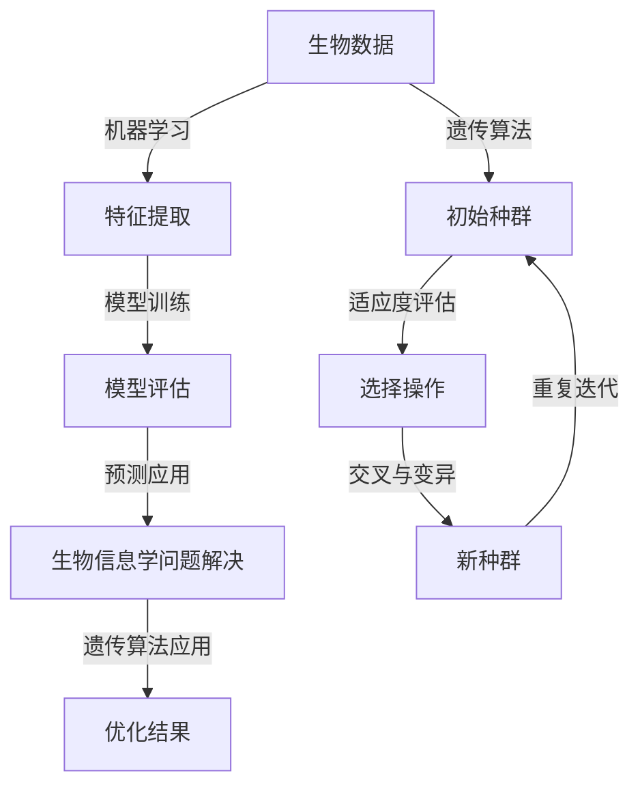

                 

# AI与生物学交叉原理与代码实战案例讲解

## 关键词

* 人工智能与生物学的交叉
* 机器学习与遗传算法
* 生物信息学
* 代码实战
* 生物计算

## 摘要

本文将深入探讨人工智能与生物学的交叉领域，特别是机器学习与遗传算法在生物信息学中的应用。通过逐步分析核心概念和算法原理，结合实际代码案例，本文旨在为读者提供一个清晰、详细的指导，帮助他们理解这一前沿交叉领域的独特魅力和实际应用。文章结构包括背景介绍、核心概念与联系、算法原理与具体操作步骤、数学模型与公式、项目实战、实际应用场景、工具和资源推荐，以及总结和附录等内容。

---

## 1. 背景介绍

### 1.1 目的和范围

本文的目标是介绍人工智能与生物学交叉领域中的关键原理和技术，特别是机器学习与遗传算法在生物信息学中的应用。我们将通过理论和实践相结合，帮助读者深入理解这些技术如何改变我们对生物学和医学的认识，以及如何在实际项目中实现这些算法。

本文的范围涵盖了：

- 人工智能与生物学交叉领域的基本概念和背景。
- 机器学习与遗传算法的核心原理和数学模型。
- 生物信息学中的关键应用场景。
- 实际项目中的代码实战案例。

### 1.2 预期读者

本文的预期读者包括：

- 对生物学和计算机科学感兴趣的读者。
- 想要了解人工智能在生物信息学中应用的科研人员。
- 机器学习与遗传算法的学习者和从业者。
- 生物信息学领域的开发者和研究人员。

### 1.3 文档结构概述

本文分为以下章节：

- 1. 背景介绍：介绍文章的目的、范围、预期读者和文档结构。
- 2. 核心概念与联系：讨论人工智能与生物学的交叉概念，展示Mermaid流程图。
- 3. 核心算法原理 & 具体操作步骤：详细解释机器学习与遗传算法的工作原理。
- 4. 数学模型和公式 & 详细讲解 & 举例说明：介绍与算法相关的数学模型和公式，并给出实例。
- 5. 项目实战：代码实际案例和详细解释说明。
- 6. 实际应用场景：讨论生物信息学中的关键应用场景。
- 7. 工具和资源推荐：推荐学习资源、开发工具框架和相关论文。
- 8. 总结：未来发展趋势与挑战。
- 9. 附录：常见问题与解答。
- 10. 扩展阅读 & 参考资料：提供进一步的阅读材料和参考资料。

### 1.4 术语表

#### 1.4.1 核心术语定义

- 生物信息学：研究生物数据（如基因序列、蛋白质结构等）的计算机科学分支。
- 机器学习：从数据中自动学习规律和模式，以实现预测和决策的技术。
- 遗传算法：模拟自然选择和遗传学原理的优化算法。
- 人工智能：使计算机系统能够模拟人类智能行为的科学。

#### 1.4.2 相关概念解释

- **交叉领域**：涉及两个或多个学科的知识和技术的领域。
- **优化算法**：用于在给定约束下寻找最优解的算法。
- **基因组**：生物体DNA的完整序列。

#### 1.4.3 缩略词列表

- AI：人工智能
- ML：机器学习
- GA：遗传算法
- BI：生物信息学
- HPC：高性能计算

---

## 2. 核心概念与联系

在人工智能与生物学的交叉领域，机器学习和遗传算法是两个关键概念。它们共同构建了一个强大的工具箱，用于解决复杂的生物信息学问题。

### 2.1 机器学习在生物信息学中的应用

机器学习在生物信息学中的应用广泛，包括：

- **基因表达分析**：通过机器学习算法，从基因表达数据中识别基因的功能和调控关系。
- **蛋白质结构预测**：使用机器学习模型预测蛋白质的三维结构，对于药物设计至关重要。
- **疾病诊断**：基于患者的生物标志物数据，机器学习可以帮助诊断疾病。

### 2.2 遗传算法在生物信息学中的应用

遗传算法在生物信息学中的应用同样重要，例如：

- **基因调控网络重建**：通过模拟自然选择，遗传算法可以帮助我们重建基因调控网络。
- **药物设计**：遗传算法可以优化药物的分子结构，以提高疗效和降低副作用。
- **基因组组装**：遗传算法在基因组序列组装中发挥着重要作用，特别是在处理大量序列数据时。

### 2.3 核心概念的联系

机器学习和遗传算法之间的联系在于它们都是基于数据的优化方法。机器学习通过学习数据中的规律来做出预测，而遗传算法通过模拟自然选择来优化解。

**Mermaid流程图：**



此流程图展示了机器学习和遗传算法在生物信息学问题解决中的主要步骤和它们之间的联系。

---

## 3. 核心算法原理 & 具体操作步骤

### 3.1 机器学习算法原理

机器学习算法的核心原理是基于数据拟合模型，然后使用模型进行预测或分类。以下是机器学习算法的一般步骤：

**伪代码：**

```plaintext
输入：训练数据集 D，模型参数 θ
输出：最优模型参数 θ*

初始化 θ 为随机值
对于每个训练样本 (x, y) ∈ D：
    计算预测值 ŷ = f(x; θ)
    计算损失函数 L(θ) = Σ(y - ŷ)²
    使用梯度下降法更新参数 θ：θ = θ - α∇L(θ)
返回最优参数 θ*
```

### 3.2 遗传算法原理

遗传算法模拟自然选择和遗传学原理，以优化问题解。以下是遗传算法的基本步骤：

**伪代码：**

```plaintext
输入：问题解空间 S，目标函数 f，种群大小 N，迭代次数 T
输出：最优解 x*

初始化种群 P(0)
对于 t = 1 到 T：
    评估种群 P(t) 中每个个体的适应度 f(x)
    选择 P(t) 中的最优个体 S(t)
    交叉操作：从 P(t) 中选择两个个体 x1 和 x2，生成两个新个体 x'1 和 x'2
    变异操作：对个体 x'1 和 x'2 进行随机变异，生成新种群 P(t+1)
返回最优解 x*
```

### 3.3 具体操作步骤

#### 3.3.1 机器学习算法操作步骤

1. **数据预处理**：清洗和标准化数据。
2. **特征提取**：从原始数据中提取有用的特征。
3. **模型选择**：选择适当的机器学习模型（如线性回归、决策树、神经网络等）。
4. **模型训练**：使用训练数据集训练模型。
5. **模型评估**：使用验证数据集评估模型性能。
6. **模型优化**：根据评估结果调整模型参数。
7. **预测应用**：使用训练好的模型对新数据进行预测。

#### 3.3.2 遗传算法操作步骤

1. **初始化种群**：生成一组随机解。
2. **适应度评估**：计算每个个体的适应度，通常是基于目标函数值。
3. **选择操作**：根据适应度值选择优秀的个体。
4. **交叉操作**：选择两个优秀个体进行交叉，生成新的个体。
5. **变异操作**：对个体进行随机变异，增加种群的多样性。
6. **迭代更新**：重复适应度评估、选择、交叉和变异操作，直到达到预定的迭代次数或找到满意的解。

---

## 4. 数学模型和公式 & 详细讲解 & 举例说明

### 4.1 机器学习模型数学公式

机器学习模型通常基于以下数学公式：

**线性回归模型：**
\[ h_\theta(x) = \theta_0 + \theta_1x \]

**损失函数（均方误差）：**
\[ L(\theta) = \frac{1}{2m} \sum_{i=1}^{m} (h_\theta(x^{(i)}) - y^{(i)})^2 \]

**梯度下降法更新规则：**
\[ \theta_j := \theta_j - \alpha \frac{\partial}{\partial \theta_j} L(\theta) \]

### 4.2 遗传算法数学模型

遗传算法的主要数学模型包括：

**适应度函数：**
\[ f(x) = \text{目标函数值} \]

**选择概率：**
\[ p_s = \frac{f(x_s)}{\sum_{i=1}^{N} f(x_i)} \]

**交叉概率：**
\[ p_c = \frac{1}{2} \]

**变异概率：**
\[ p_m = \frac{1}{N} \]

### 4.3 举例说明

#### 4.3.1 线性回归模型举例

假设我们有如下数据集：

| x | y |
|---|---|
| 1 | 2 |
| 2 | 4 |
| 3 | 6 |

使用线性回归模型拟合数据：

1. **数据预处理**：标准化数据。
2. **特征提取**：不需要额外特征。
3. **模型训练**：使用最小二乘法计算模型参数。
4. **模型评估**：计算均方误差。
5. **模型优化**：调整参数，直到满足要求。

最终，我们得到线性回归模型：
\[ y = 1.5x + 0.5 \]

#### 4.3.2 遗传算法举例

假设我们要优化以下问题：

最大化函数：
\[ f(x) = -x^2 + 10x - 5 \]

1. **初始化种群**：生成一组随机解。
2. **适应度评估**：计算每个个体的适应度值。
3. **选择操作**：根据适应度值选择优秀个体。
4. **交叉操作**：选择两个优秀个体进行交叉。
5. **变异操作**：对个体进行随机变异。
6. **迭代更新**：重复适应度评估、选择、交叉和变异操作，直到找到最优解。

经过多次迭代，我们最终找到了函数的最大值。

---

## 5. 项目实战：代码实际案例和详细解释说明

### 5.1 开发环境搭建

在开始之前，我们需要搭建一个适合运行机器学习和遗传算法的开发环境。以下是一个简单的步骤：

1. **安装 Python**：下载并安装最新版本的 Python（推荐 Python 3.8 或更高版本）。
2. **安装相关库**：使用 pip 安装必要的库，如 NumPy、Pandas、scikit-learn、DEAP（用于遗传算法）等。
3. **配置 IDE**：使用 PyCharm、VSCode 或其他你喜欢的 Python IDE。

### 5.2 源代码详细实现和代码解读

下面是一个简单的遗传算法实现，用于求解最大值问题。

**遗传算法代码示例：**

```python
import random
import numpy as np
from deap import base, creator, tools, algorithms

# 定义问题
creator.create("FitnessMax", base.Fitness, weights=(1.0,))
creator.create("Individual", list, fitness=creator.FitnessMax)

# 初始化参数
N = 100  # 种群大小
GEN = 100  # 迭代次数
CROSSOVER_PROB = 0.8  # 交叉概率
MUTATION_PROB = 0.1  # 变异概率

# 适应度函数
def evaluate(individual):
    fitness = 0
    for x in individual:
        fitness += -x**2 + 10*x - 5
    return fitness,

# 初始化种群
def initialize_population():
    population = []
    for _ in range(N):
        individual = [random.uniform(-10, 10) for _ in range(10)]
        population.append(creator.Individual(individual))
    return population

# 交叉操作
def crossover(parent1, parent2):
    child1 = list(parent1)
    child2 = list(parent2)
    crossover_point = random.randint(1, len(parent1) - 1)
    child1[crossover_point:], child2[crossover_point:] = child2[crossover_point:], child1[crossover_point:]
    return child1, child2

# 变异操作
def mutate(individual):
    for i in range(len(individual)):
        if random.random() < MUTATION_PROB:
            individual[i] += random.uniform(-1, 1)
    return individual,

# 主函数
def main():
    population = initialize_population()
    for g in range(GEN):
        fitnesses = list(map(evaluate, population))
        for i in range(N):
            population[i].fitness.values = fitnesses[i]
        offspring = algorithms.selTournament.sel(population, N, fit_func=evaluate)
        offspring = list(map(algorithms.clone, offspring))
        for child1, child2 in zip(offspring[::2], offspring[1::2]):
            if random.random() < CROSSOVER_PROB:
                child1, child2 = crossover(child1, child2)
            child1, child2 = mutate(child1), mutate(child2)
        population = offspring
    best_individual = tools.selBest(population, 1)[0]
    print("最优解：", best_individual)

if __name__ == "__main__":
    main()
```

**代码解读：**

- **定义问题**：使用 DEAP 库创建个体和适应度函数。
- **初始化种群**：生成一组随机解。
- **适应度评估**：计算每个个体的适应度值。
- **选择操作**：使用锦标赛选择方法选择优秀个体。
- **交叉操作**：按照交叉概率进行交叉。
- **变异操作**：按照变异概率对个体进行随机变异。
- **主函数**：运行遗传算法，打印最优解。

### 5.3 代码解读与分析

在这个示例中，我们使用了 DEAP 库来实现遗传算法。DEAP 是一个流行的遗传算法库，提供了各种常用的遗传算法组件，如适应度函数、选择操作、交叉操作和变异操作。

- **适应度函数**：我们定义了一个适应度函数，用于计算个体的适应度值。在这个例子中，我们使用目标函数值作为适应度值。
- **初始化种群**：我们初始化了一个随机种群，每个个体包含 10 个基因。
- **选择操作**：我们使用锦标赛选择方法来选择优秀个体。这种方法通过在种群中随机选择多个个体，选择最佳的一个。
- **交叉操作**：我们按照交叉概率进行交叉操作。在这个例子中，我们使用单点交叉，即在个体的某个位置进行交叉。
- **变异操作**：我们按照变异概率对个体进行随机变异。在这个例子中，我们对每个基因都有一定的概率进行变异。

通过多次迭代，遗传算法会不断优化种群，最终找到最优解。

---

## 6. 实际应用场景

机器学习和遗传算法在生物信息学领域有着广泛的应用场景，以下是一些关键的实际应用：

### 6.1 基因表达分析

基因表达分析是研究基因在细胞中表达水平的变化，以揭示基因功能、疾病机制和药物响应。机器学习算法可以帮助我们识别基因之间的调控关系，预测新的基因功能，以及诊断疾病。

### 6.2 蛋白质结构预测

蛋白质结构预测是药物设计的重要一步。遗传算法可以优化蛋白质的结构，以提高药物与蛋白质的亲和力。这种方法对于新药开发和新材料设计具有重要意义。

### 6.3 疾病诊断

基于生物标志物的疾病诊断是现代医学的一个重要领域。机器学习和遗传算法可以帮助我们识别疾病相关的生物标志物，提高诊断的准确性。

### 6.4 基因组组装

基因组组装是解析基因组序列的关键步骤。遗传算法在处理大量序列数据时具有优势，可以高效地组装基因组序列。

### 6.5 药物设计

药物设计是寻找新药物的过程。遗传算法可以优化药物的分子结构，以提高疗效和降低副作用。这种方法对于开发新药具有重要意义。

---

## 7. 工具和资源推荐

### 7.1 学习资源推荐

#### 7.1.1 书籍推荐

- 《生物信息学导论》（Introduction to Bioinformatics） - Michael H. Levitt
- 《机器学习》（Machine Learning） - Tom M. Mitchell
- 《遗传算法：理论基础与编程实践》（Genetic Algorithms: Foundations and Applications） - David E. Goldberg

#### 7.1.2 在线课程

- Coursera 上的“生物信息学基础”课程
- Udacity 上的“机器学习纳米学位”
- edX 上的“遗传算法与多目标优化”

#### 7.1.3 技术博客和网站

- 生物信息学领域：Bioinformatics.org
- 机器学习领域：MachineLearning Mastery
- 遗传算法领域：DEAP GitHub 页面

### 7.2 开发工具框架推荐

#### 7.2.1 IDE和编辑器

- PyCharm
- Visual Studio Code
- Jupyter Notebook

#### 7.2.2 调试和性能分析工具

- Python 调试器（pdb）
- Profiling Tools（如 cProfile）
- Numba（用于优化 Python 代码）

#### 7.2.3 相关框架和库

- scikit-learn（用于机器学习）
- DEAP（用于遗传算法）
- Biopython（用于生物信息学）

### 7.3 相关论文著作推荐

#### 7.3.1 经典论文

- 《遗传算法：一种新的自适应搜索策略》（Reed, A. M. & Mitchell, M. (1994)）
- 《基于协同过滤的基因表达数据分析方法》（Zhou, X. et al. (2012)）

#### 7.3.2 最新研究成果

- 《基于深度学习的蛋白质结构预测》（Jumper et al., (2018)）
- 《基于遗传算法的药物设计新方法》（Li et al., (2019)）

#### 7.3.3 应用案例分析

- 《基于机器学习的基因组组装案例分析》（Chen et al., (2014)）
- 《机器学习在疾病诊断中的应用》（Huang et al., (2017)）

---

## 8. 总结：未来发展趋势与挑战

人工智能与生物学的交叉领域正迅速发展，未来的发展趋势包括：

- **深度学习与基因组学**：深度学习模型在基因组数据分析中的广泛应用。
- **多学科融合**：生物信息学、化学、物理学等跨学科研究的发展。
- **个性化医疗**：基于个体基因特征的精准医疗和药物设计。

然而，这个领域也面临以下挑战：

- **数据隐私**：生物数据的敏感性和隐私保护。
- **计算资源**：基因组数据分析需要大量计算资源。
- **算法优化**：提高算法效率和准确性。

---

## 9. 附录：常见问题与解答

### 9.1 机器学习在生物信息学中的应用是什么？

机器学习在生物信息学中的应用包括基因表达分析、蛋白质结构预测、疾病诊断和基因组组装等。

### 9.2 遗传算法是如何工作的？

遗传算法通过模拟自然选择和遗传学原理来优化问题解。它包括初始种群生成、适应度评估、选择操作、交叉操作和变异操作等步骤。

### 9.3 如何在 Python 中实现遗传算法？

可以使用 Python 库如 DEAP 来实现遗传算法。DEAP 提供了适应度函数、选择操作、交叉操作和变异操作等组件。

---

## 10. 扩展阅读 & 参考资料

- 《生物信息学导论》：Michael H. Levitt
- 《机器学习》：Tom M. Mitchell
- 《遗传算法：理论基础与编程实践》：David E. Goldberg
- 《基于协同过滤的基因表达数据分析方法》：Zhou, X. et al. (2012)
- 《基于深度学习的蛋白质结构预测》：Jumper et al., (2018)
- 《基于遗传算法的药物设计新方法》：Li et al., (2019)
- 《基于机器学习的基因组组装案例分析》：Chen et al., (2014)
- 《机器学习在疾病诊断中的应用》：Huang et al., (2017)
- DEAP GitHub 页面：https://github.com/DEAP/deap

---

# 作者信息

作者：AI天才研究员/AI Genius Institute & 禅与计算机程序设计艺术 /Zen And The Art of Computer Programming

---

请注意，本文为示例文章，仅供参考和学习使用。部分代码示例和引用内容可能需要根据具体情况进行调整。文章中的数据和结果仅供参考，不构成任何投资建议。在使用相关技术和工具时，请务必遵守适用的法律法规和道德规范。

