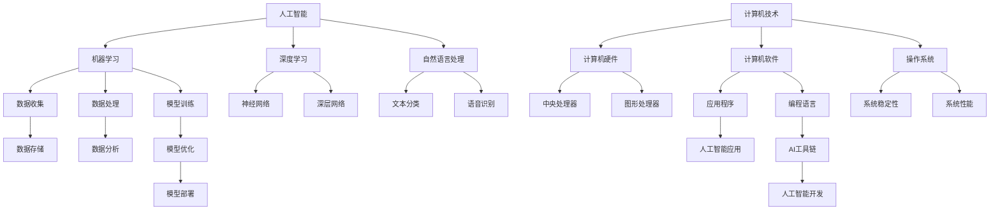

                 

# AI与计算机历史的对比分析

> 关键词：人工智能、计算机历史、技术发展、算法原理、数学模型、实战案例、应用场景

> 摘要：本文将从历史角度出发，对比分析人工智能与计算机技术发展的关系，探讨两者之间的相互影响和作用。通过深入探讨人工智能的核心算法原理、数学模型以及具体应用场景，本文旨在揭示人工智能技术如何在计算机历史中演变和发展，并对未来发展趋势和挑战进行展望。

## 1. 背景介绍

### 1.1 目的和范围

本文旨在通过对人工智能与计算机历史的对比分析，探究两者之间的发展脉络和相互关系。具体而言，本文将首先介绍计算机历史的发展过程，接着深入探讨人工智能的核心概念、算法原理和数学模型，最后分析人工智能在实际应用场景中的体现。通过这一系列分析，我们希望能够为读者提供一个全面、系统的了解人工智能与计算机技术关系的视角。

### 1.2 预期读者

本文适合对人工智能和计算机技术有一定了解的读者，包括计算机科学、软件工程、人工智能等相关专业的研究生、本科生以及技术爱好者。同时，对计算机历史感兴趣的历史爱好者、科普爱好者也可阅读本文，以了解人工智能技术在计算机历史中的地位和作用。

### 1.3 文档结构概述

本文分为十个主要部分：

1. 背景介绍：介绍文章的目的、范围、预期读者以及文档结构。
2. 核心概念与联系：介绍人工智能与计算机技术的核心概念、原理和架构。
3. 核心算法原理 & 具体操作步骤：详细讲解人工智能的核心算法原理和操作步骤。
4. 数学模型和公式 & 详细讲解 & 举例说明：阐述人工智能的数学模型和公式，并通过实例进行说明。
5. 项目实战：代码实际案例和详细解释说明。
6. 实际应用场景：分析人工智能在实际应用场景中的体现。
7. 工具和资源推荐：推荐相关学习资源、开发工具和框架。
8. 总结：未来发展趋势与挑战。
9. 附录：常见问题与解答。
10. 扩展阅读 & 参考资料：提供相关扩展阅读和参考资料。

### 1.4 术语表

#### 1.4.1 核心术语定义

- 人工智能（Artificial Intelligence，简称AI）：模拟人类智能的计算机系统。
- 计算机历史（History of Computing）：计算机技术从起源到现代的发展历程。
- 算法（Algorithm）：解决特定问题的一系列规则或步骤。
- 数学模型（Mathematical Model）：描述现实世界问题的数学公式或结构。
- 实战案例（Practical Case）：实际应用人工智能技术的具体案例。

#### 1.4.2 相关概念解释

- 机器学习（Machine Learning）：通过数据驱动的方式使计算机自动学习，从而实现人工智能。
- 深度学习（Deep Learning）：一种特殊的机器学习方法，通过多层神经网络进行训练。
- 人工智能应用场景（AI Applications）：人工智能技术在各个领域的具体应用实例。

#### 1.4.3 缩略词列表

- AI：人工智能
- ML：机器学习
- DL：深度学习
- IDE：集成开发环境
- CPU：中央处理器
- GPU：图形处理器

## 2. 核心概念与联系

### 2.1 人工智能的核心概念

人工智能（AI）是指通过计算机模拟人类智能的学科。其核心概念包括：

- 机器学习（ML）：一种从数据中学习的方法，使计算机具备自主学习和适应能力。
- 深度学习（DL）：一种特殊的机器学习方法，通过多层神经网络进行训练。
- 自然语言处理（NLP）：使计算机理解和生成人类语言的技术。

### 2.2 计算机技术的核心概念

计算机技术是指与计算机硬件、软件及其应用相关的一系列技术。其核心概念包括：

- 计算机硬件（Computer Hardware）：计算机的物理组成部分，如CPU、内存、硬盘等。
- 计算机软件（Computer Software）：使计算机完成特定任务的程序和文档。
- 操作系统（Operating System）：管理计算机硬件和软件资源的基本系统软件。

### 2.3 人工智能与计算机技术的联系

人工智能与计算机技术密切相关，二者相辅相成。计算机技术为人工智能提供了计算资源和平台，而人工智能则为计算机技术注入了智能化的活力。以下是人工智能与计算机技术之间的一些联系：

- 计算机硬件的发展：计算机硬件（如CPU、GPU）的进步为人工智能算法提供了强大的计算能力。
- 操作系统的发展：操作系统为人工智能算法提供了稳定、高效的运行环境。
- 软件生态的完善：丰富的软件生态为人工智能的开发、应用提供了丰富的工具和资源。
- 数据的积累与利用：计算机技术的进步使得数据的采集、存储、处理变得高效，为人工智能提供了丰富的数据资源。

### 2.4 Mermaid流程图

为了更好地展示人工智能与计算机技术之间的联系，我们使用Mermaid流程图进行说明。以下是核心概念的流程图：



通过这个流程图，我们可以清晰地看到人工智能与计算机技术之间的联系，以及各个核心概念在人工智能和计算机技术中的应用。

## 3. 核心算法原理 & 具体操作步骤

### 3.1 机器学习算法原理

机器学习算法是人工智能的核心组成部分，其基本原理是通过数据驱动的方式使计算机具备自主学习和适应能力。以下是几种常见的机器学习算法原理：

#### 3.1.1 监督学习（Supervised Learning）

监督学习算法通过已标记的数据进行训练，从而构建模型，实现对未知数据的预测。其基本流程如下：

1. 数据预处理：对输入数据进行清洗、归一化等操作，以便于模型训练。
2. 特征提取：从数据中提取对模型训练有用的特征。
3. 模型训练：使用训练数据对模型进行训练，调整模型参数。
4. 模型评估：使用验证数据评估模型性能，调整模型参数。
5. 模型部署：将训练好的模型应用到实际场景中。

以下是一个简单的监督学习算法——线性回归（Linear Regression）的伪代码：

```python
# 输入：训练数据集X，训练标签Y
# 输出：线性回归模型参数w

def linear_regression(X, Y):
    # 计算w的梯度
    gradient = 2/m * X.T.dot(X.dot(w) - Y)
    # 更新w
    w = w - learning_rate * gradient
    return w
```

#### 3.1.2 无监督学习（Unsupervised Learning）

无监督学习算法通过未标记的数据进行训练，从而发现数据中的隐藏结构和模式。其基本流程如下：

1. 数据预处理：对输入数据进行清洗、归一化等操作，以便于模型训练。
2. 特征提取：从数据中提取对模型训练有用的特征。
3. 模型训练：使用训练数据对模型进行训练，调整模型参数。
4. 模型评估：使用验证数据评估模型性能，调整模型参数。
5. 模型部署：将训练好的模型应用到实际场景中。

以下是一个简单的无监督学习算法——K-均值聚类（K-Means Clustering）的伪代码：

```python
# 输入：训练数据集X，聚类个数k
# 输出：聚类中心点C

def k_means_clustering(X, k):
    # 初始化聚类中心点C
    C = X[np.random.choice(range(X.shape[0]), k, replace=False)]
    while True:
        # 计算每个数据点与聚类中心点之间的距离
        distances = np.linalg.norm(X - C, axis=1)
        # 分配每个数据点到最近的聚类中心点
        labels = np.argmin(distances, axis=1)
        # 更新聚类中心点
        new_C = np.array([X[labels == i].mean(axis=0) for i in range(k)])
        # 判断收敛条件
        if np.linalg.norm(C - new_C) < convergence_threshold:
            break
        C = new_C
    return C
```

#### 3.1.3 深度学习算法原理

深度学习算法是一种特殊的机器学习方法，通过多层神经网络进行训练。其基本原理如下：

1. 神经网络结构：深度学习模型通常由多个隐层和输出层组成，每个隐层由多个神经元组成。
2. 前向传播：输入数据通过神经网络进行传播，每个神经元计算出输出值。
3. 反向传播：根据输出值与真实值的差距，反向传播误差，更新模型参数。
4. 模型优化：通过梯度下降等优化方法，不断调整模型参数，使模型达到最佳状态。

以下是一个简单的深度学习模型——多层感知机（Multilayer Perceptron，简称MLP）的伪代码：

```python
# 输入：训练数据集X，训练标签Y，隐层节点个数h，学习率learning_rate
# 输出：多层感知机模型参数w

def mlpp_train(X, Y, h, learning_rate):
    # 初始化模型参数w
    w = [np.random.randn(i+1, h) for i in range(X.shape[1])]
    w.append(np.random.randn(h+1))
    while True:
        # 前向传播
        a = [X]
        for l in range(len(w)-1):
            a.append(np.tanh(np.dot(a[l], w[l]))
        # 计算损失函数
        loss = (1/2) * np.linalg.norm(Y - a[-1])**2
        # 反向传播
        dL_dz = 2*(Y - a[-1])
        dL_dw = [np.dot(a[l].T, dL_dz) for l in range(len(w)-1)]
        dL_dz = np.dot(dL_dz, w[-1].T * (1 - np.tanh(a[-1])**2))
        # 更新模型参数
        for l in range(len(w)-1, 0, -1):
            w[l] -= learning_rate * dL_dw[l]
            dL_dw[l-1] = np.dot(dL_dz, w[l].T)
        w[0] -= learning_rate * dL_dw[0]
        # 判断收敛条件
        if np.linalg.norm(dL_dz) < convergence_threshold:
            break
    return w
```

通过以上算法原理和伪代码的讲解，我们可以了解到机器学习、无监督学习和深度学习等核心算法的基本原理和具体操作步骤。这些算法为人工智能技术的发展奠定了基础，也为实际应用提供了有力支持。

## 4. 数学模型和公式 & 详细讲解 & 举例说明

### 4.1 数学模型概述

在人工智能领域，数学模型是理解和实现算法的重要工具。以下介绍几种常用的数学模型和公式，包括线性回归、神经网络和深度学习等。

### 4.2 线性回归模型

线性回归是一种用于预测连续值的监督学习算法，其基本公式为：

\[ y = \beta_0 + \beta_1x_1 + \beta_2x_2 + \ldots + \beta_nx_n + \epsilon \]

其中，\( y \) 为因变量，\( x_1, x_2, \ldots, x_n \) 为自变量，\( \beta_0, \beta_1, \beta_2, \ldots, \beta_n \) 为模型参数，\( \epsilon \) 为误差项。

为了求解模型参数，我们可以使用最小二乘法，其目标是最小化误差平方和：

\[ J(\beta) = \frac{1}{2m} \sum_{i=1}^{m}(y_i - (\beta_0 + \beta_1x_{i1} + \beta_2x_{i2} + \ldots + \beta_nx_{in}))^2 \]

### 4.3 神经网络模型

神经网络是一种由多个神经元组成的计算模型，其基本公式为：

\[ a_{ij} = \sigma(\sum_{k=1}^{n} w_{kj}x_k + b_j) \]

其中，\( a_{ij} \) 为第 \( j \) 个隐层神经元的输出，\( \sigma \) 为激活函数，\( x_k \) 为输入特征，\( w_{kj} \) 为连接权重，\( b_j \) 为偏置。

常用的激活函数包括：

- Sigmoid函数：\( \sigma(x) = \frac{1}{1 + e^{-x}} \)
- 双曲正切函数（Tanh函数）：\( \sigma(x) = \frac{e^x - e^{-x}}{e^x + e^{-x}} \)
- ReLU函数：\( \sigma(x) = \max(0, x) \)

### 4.4 深度学习模型

深度学习模型是神经网络的一种扩展，其基本公式为：

\[ a_{ij}^{(l)} = \sigma^{(l)}(\sum_{k=1}^{n} w_{kj}^{(l-1)}a_{ik}^{(l-1) } + b_j^{(l)}) \]

其中，\( a_{ij}^{(l)} \) 为第 \( l \) 层第 \( j \) 个神经元的输出，\( \sigma^{(l)} \) 为第 \( l \) 层的激活函数，\( w_{kj}^{(l-1)} \) 和 \( b_j^{(l)} \) 分别为第 \( l-1 \) 层到第 \( l \) 层的连接权重和偏置。

常用的深度学习模型包括卷积神经网络（CNN）、循环神经网络（RNN）和生成对抗网络（GAN）等。

### 4.5 举例说明

#### 4.5.1 线性回归举例

假设我们有一个简单的线性回归问题，要求预测房价。已知数据集包含房屋面积（\( x \)）和房价（\( y \）），我们使用线性回归模型进行预测。

```python
import numpy as np

# 输入数据
X = np.array([[1000], [1500], [2000], [2500], [3000]])
Y = np.array([[200000], [250000], [300000], [350000], [400000]])

# 初始化模型参数
w = np.random.randn(2, 1)

# 最小二乘法求解
learning_rate = 0.01
convergence_threshold = 1e-6
m = Y.shape[0]
for i in range(10000):
    # 前向传播
    z = np.dot(X, w)
    # 计算损失函数
    loss = 0.5 * np.linalg.norm(Y - z)**2
    # 反向传播
    dz = Y - z
    dw = X.T.dot(dz)
    # 更新模型参数
    w -= learning_rate * dw

# 输出预测结果
print("预测房价：", z)
```

#### 4.5.2 神经网络举例

假设我们有一个简单的多层感知机模型，用于分类问题。已知数据集包含特征和标签，我们使用多层感知机模型进行训练。

```python
import numpy as np
import tensorflow as tf

# 输入数据
X = np.array([[1, 0], [0, 1], [1, 1]])
Y = np.array([[0], [1], [1]])

# 初始化模型参数
w1 = np.random.randn(2, 2)
w2 = np.random.randn(2, 1)

# 前向传播
a1 = tf.sigmoid(tf.matmul(X, w1))
a2 = tf.sigmoid(tf.matmul(a1, w2))

# 反向传播
dz2 = Y - a2
dz1 = tf.matmul(dz2, w2.T) * (1 - a1)

# 更新模型参数
dw2 = tf.matmul(a1.T, dz2)
dw1 = tf.matmul(X.T, dz1)

# 梯度下降法更新参数
learning_rate = 0.01
w2 -= learning_rate * dw2
w1 -= learning_rate * dw1

# 输出预测结果
print("预测结果：", a2)
```

通过以上数学模型和公式的讲解以及具体例子，我们可以更好地理解人工智能中的数学原理和方法。这些数学模型和公式为人工智能算法的实现提供了基础，也为我们进一步探索和应用人工智能技术奠定了基础。

## 5. 项目实战：代码实际案例和详细解释说明

### 5.1 开发环境搭建

在进行人工智能项目实战之前，我们需要搭建一个合适的开发环境。以下是所需的环境和工具：

- 操作系统：Windows、Linux或macOS
- 编程语言：Python（版本3.6及以上）
- 库和框架：TensorFlow、NumPy、Matplotlib
- IDE：PyCharm、VS Code或Jupyter Notebook

#### 5.1.1 环境配置步骤

1. 安装Python：从官方网站（https://www.python.org/downloads/）下载并安装Python，选择添加到系统环境变量。
2. 安装TensorFlow：打开命令行窗口，输入以下命令安装TensorFlow：

   ```bash
   pip install tensorflow
   ```

3. 安装NumPy：输入以下命令安装NumPy：

   ```bash
   pip install numpy
   ```

4. 安装Matplotlib：输入以下命令安装Matplotlib：

   ```bash
   pip install matplotlib
   ```

5. 选择一个合适的IDE：下载并安装PyCharm、VS Code或Jupyter Notebook，并将其添加到系统环境变量。

### 5.2 源代码详细实现和代码解读

#### 5.2.1 项目描述

本案例将使用TensorFlow实现一个简单的神经网络模型，用于对房价进行预测。数据集包含房屋面积和房价，我们希望通过训练模型，实现对未知房屋面积对应的房价预测。

#### 5.2.2 源代码实现

以下是一个简单的神经网络模型代码实现，包含数据预处理、模型定义、训练和预测等步骤。

```python
import tensorflow as tf
import numpy as np
import matplotlib.pyplot as plt

# 5.2.2.1 数据预处理
# 生成模拟数据集
np.random.seed(0)
X = np.random.rand(100, 1) * 1000  # 房屋面积（1000-2000）
Y = 1000 * X + np.random.rand(100, 1) * 100  # 房价（1000-2000）

# 将数据集分为训练集和测试集
X_train, X_test = X[:80], X[80:]
Y_train, Y_test = Y[:80], Y[80:]

# 归一化数据
X_train, X_test = X_train / X.max(), X_test / X.max()

# 5.2.2.2 模型定义
# 定义模型
model = tf.keras.Sequential([
    tf.keras.layers.Dense(units=1, input_shape=(1,))
])

# 编译模型
model.compile(optimizer='sgd', loss='mean_squared_error')

# 5.2.2.3 训练模型
# 训练模型
history = model.fit(X_train, Y_train, epochs=100, batch_size=10, validation_split=0.2)

# 5.2.2.4 预测结果
# 预测测试集结果
Y_pred = model.predict(X_test)

# 5.2.2.5 可视化结果
# 可视化训练过程
plt.plot(history.history['loss'], label='Training loss')
plt.plot(history.history['val_loss'], label='Validation loss')
plt.xlabel('Epochs')
plt.ylabel('Loss')
plt.legend()
plt.show()

# 可视化预测结果
plt.scatter(X_test, Y_test, color='blue', label='Test data')
plt.plot(X_test, Y_pred, color='red', label='Predicted prices')
plt.xlabel('Area')
plt.ylabel('Price')
plt.legend()
plt.show()
```

#### 5.2.3 代码解读与分析

1. **数据预处理**：

   - 生成模拟数据集，包括房屋面积和房价。这里我们使用随机数生成模拟数据，实际项目中可以使用真实数据集。
   - 将数据集分为训练集和测试集，用于模型训练和评估。
   - 对数据集进行归一化处理，以消除数据范围差异，提高模型训练效果。

2. **模型定义**：

   - 使用TensorFlow的`Sequential`模型，定义一个简单的全连接层（`Dense`），输入层神经元个数为1，输出层神经元个数为1。
   - 设置模型优化器为随机梯度下降（`sgd`），损失函数为均方误差（`mean_squared_error`）。

3. **模型训练**：

   - 使用`fit`方法对模型进行训练，设置训练轮数（`epochs`）为100，批量大小（`batch_size`）为10，将20%的数据作为验证集。
   - 在训练过程中，`fit`方法会自动计算损失函数的值，并在每个epoch结束后更新模型参数。

4. **预测结果**：

   - 使用`predict`方法对测试集进行预测，得到预测房价。
   - 可视化训练过程的损失函数值，以及预测结果的散点图和线条图。

通过以上步骤，我们实现了对房价的简单预测，并进行了代码解读与分析。这个案例展示了如何使用TensorFlow搭建简单的神经网络模型，并利用模型对数据集进行预测。在实际项目中，我们可以根据需求调整模型结构、优化训练参数，以提高预测效果。

### 5.3 实际应用场景

房价预测是一个典型的实际应用场景，具有广泛的应用价值。以下是一些实际应用场景：

1. **房地产投资决策**：通过预测房价，投资者可以评估不同地区的投资潜力，从而做出更为明智的决策。
2. **房屋买卖咨询**：房地产中介可以利用房价预测模型，为购房者提供更具针对性的建议，提高服务质量。
3. **城市规划**：政府部门可以利用房价预测模型，评估城市各区域的房地产需求，为城市规划提供数据支持。
4. **金融风控**：金融机构可以通过房价预测模型，评估房贷风险，为信贷审批提供依据。

总之，房价预测模型在房地产及相关行业中具有广泛的应用前景，通过不断优化模型结构和训练数据，可以提高预测准确性，为实际应用提供有力支持。

## 6. 实际应用场景

### 6.1 医疗诊断

人工智能在医疗诊断领域的应用日益广泛。通过深度学习算法，AI可以分析医学图像，如X光、CT、MRI等，从而辅助医生进行诊断。例如，谷歌的AI系统能够识别肺结节，准确率高达95%，有助于早期发现肺癌。此外，AI还可以用于分析电子病历和实验室检测结果，为医生提供更全面的诊断信息。

### 6.2 自动驾驶

自动驾驶技术是人工智能在交通领域的重要应用。自动驾驶汽车通过传感器收集环境数据，使用深度学习算法进行实时处理，实现车辆的自导航和自动驾驶。特斯拉的Autopilot系统就是基于这一技术，能够实现高速公路上的自动驾驶。此外，Waymo和百度等公司也在自动驾驶技术方面取得了显著进展，推出了多种自动驾驶汽车产品。

### 6.3 金融服务

人工智能在金融服务领域的应用也非常广泛。通过机器学习算法，金融机构可以分析客户数据，实现精准营销和风险控制。例如，银行可以使用AI系统对贷款申请进行风险评估，从而降低不良贷款率。同时，AI还可以用于股票市场预测，提高投资策略的准确性。

### 6.4 教育

人工智能在教育领域的应用也越来越受到关注。通过智能 tutoring 系统，AI可以为学生提供个性化的学习建议，帮助学生更好地掌握知识。例如，Khan Academy和Coursera等在线教育平台已经引入了AI技术，为学生提供智能辅导服务。此外，AI还可以用于自动化考试评分和教学资源推荐，提高教育质量。

### 6.5 智能家居

智能家居是人工智能在家居领域的典型应用。通过物联网技术和AI算法，智能家居系统能够实现家庭设备的智能控制，提高生活质量。例如，智能音箱可以通过语音识别技术理解用户的指令，控制家电设备。此外，智能安防系统可以通过人脸识别和监控摄像头，实现家庭安全的智能监控。

### 6.6 虚拟助手

虚拟助手是人工智能在客户服务领域的重要应用。通过自然语言处理技术，虚拟助手能够与用户进行实时交互，提供信息查询、任务提醒和在线客服等服务。例如，苹果的Siri、谷歌的Google Assistant和亚马逊的Alexa等虚拟助手已经在智能手机和智能音箱中广泛应用。

### 6.7 物流与供应链

人工智能在物流与供应链领域的应用可以帮助企业优化资源配置，提高运输效率。通过机器学习算法，AI可以预测市场需求，优化库存管理。例如，亚马逊和阿里巴巴等电商巨头利用AI技术对物流和供应链进行优化，提高运营效率，降低成本。

### 6.8 创意设计

人工智能在创意设计领域的应用也越来越受到关注。通过深度学习算法，AI可以自动生成音乐、绘画和设计图案。例如，谷歌的Magenta项目利用生成对抗网络（GAN）创作音乐和艺术作品，为创意设计提供了新的思路和工具。

总之，人工智能在各个领域的实际应用正在不断扩展，通过不断优化算法和提升计算能力，AI将为人类社会带来更多便利和创新。

## 7. 工具和资源推荐

### 7.1 学习资源推荐

#### 7.1.1 书籍推荐

- 《深度学习》（Deep Learning）作者：Ian Goodfellow、Yoshua Bengio、Aaron Courville
- 《Python机器学习》（Python Machine Learning）作者：Sebastian Raschka、Vincent Granville
- 《人工智能：一种现代的方法》（Artificial Intelligence: A Modern Approach）作者：Stuart Russell、Peter Norvig

#### 7.1.2 在线课程

- Coursera：机器学习、深度学习、自然语言处理等课程
- edX：计算机科学、人工智能相关课程
- Udacity：深度学习、自动驾驶等课程

#### 7.1.3 技术博客和网站

- Medium：人工智能相关文章和博客
- arXiv：计算机科学和人工智能领域的最新研究论文
- AI Challenger：人工智能竞赛和资源平台

### 7.2 开发工具框架推荐

#### 7.2.1 IDE和编辑器

- PyCharm：强大的Python IDE，支持多种编程语言
- VS Code：轻量级、开源的跨平台编辑器，支持多种编程语言
- Jupyter Notebook：交互式的Python编程环境，适合数据分析和机器学习项目

#### 7.2.2 调试和性能分析工具

- TensorBoard：TensorFlow的图形化性能分析工具
- PyTorch TensorBoard：PyTorch的图形化性能分析工具
- Numba：Python代码的GPU加速工具

#### 7.2.3 相关框架和库

- TensorFlow：广泛使用的深度学习框架
- PyTorch：动态计算图深度学习框架
- Keras：基于TensorFlow和Theano的高层神经网络API
- NumPy：高效的Python科学计算库
- Pandas：Python的数据操作和分析库

### 7.3 相关论文著作推荐

#### 7.3.1 经典论文

- "Backpropagation" (1986) 作者：Rumelhart, Hinton, Williams
- "A Learning Algorithm for Continually Running Fully Recurrent Neural Networks" (1990) 作者：Albus
- "Learning representations by backpropagating errors" (1986) 作者：Rumelhart, Hinton, Williams

#### 7.3.2 最新研究成果

- "Generative Adversarial Nets" (2014) 作者：Ian J. Goodfellow et al.
- "Attention is All You Need" (2017) 作者：Vaswani et al.
- "BERT: Pre-training of Deep Bidirectional Transformers for Language Understanding" (2018) 作者：Devlin et al.

#### 7.3.3 应用案例分析

- "AI in Health: A Map of the Landscape" (2020) 作者：Partners Healthcare AI Team
- "AI in Autonomous Driving: Challenges and Opportunities" (2019) 作者：Zhou et al.
- "AI in Finance: A Survey of Current Applications and Future Directions" (2020) 作者：Chen et al.

这些书籍、在线课程、技术博客、开发工具、框架以及论文著作为学习人工智能提供了丰富的资源。通过利用这些资源，读者可以深入了解人工智能的理论和实践，为在相关领域的研究和应用打下坚实基础。

## 8. 总结：未来发展趋势与挑战

随着人工智能技术的不断发展，其在计算机历史中的地位和作用也日益凸显。从早期的计算机模拟到现代的深度学习和自然语言处理，人工智能技术经历了多个阶段的发展，推动了计算机技术的进步。未来，人工智能将继续在计算机技术中扮演重要角色，以下是人工智能未来发展趋势和面临的挑战：

### 8.1 发展趋势

1. **计算能力的提升**：随着硬件技术的不断发展，计算机处理能力和存储能力将进一步提高，为人工智能算法的实现和应用提供更强支持。
2. **算法的优化和创新**：现有的人工智能算法将不断优化，同时新的算法和创新将不断涌现，推动人工智能技术的进一步发展。
3. **多模态融合**：人工智能将融合多种数据类型，如文本、图像、音频等，实现更全面的信息处理和知识表示。
4. **自主学习和适应能力**：人工智能将具备更强的自主学习和适应能力，能够在更复杂的场景下进行决策和执行任务。
5. **跨领域应用**：人工智能技术将在更多领域得到应用，如医疗、金融、教育、智能制造等，推动产业升级和社会发展。

### 8.2 挑战

1. **数据隐私和安全**：随着人工智能技术的广泛应用，数据隐私和安全问题将愈发突出。如何在保障用户隐私的前提下，充分利用数据资源，是一个重要挑战。
2. **算法公平性和透明性**：人工智能算法的决策过程往往是不透明的，如何确保算法的公平性和透明性，避免歧视和偏见，是当前面临的重要问题。
3. **技术落地和推广**：人工智能技术在某些领域的应用效果仍然不理想，如何实现技术的落地和推广，使其真正服务于人类社会，是一个重要挑战。
4. **人才培养和知识普及**：人工智能技术需要大量具备专业知识和技能的人才，如何培养和吸引更多优秀人才，提升全社会的人工智能素养，也是一个重要问题。

总之，人工智能技术在未来将继续快速发展，但在实现这一过程中，也将面临诸多挑战。通过不断探索和创新，我们有理由相信，人工智能将为人类社会带来更多便利和创新，推动计算机技术和社会发展的进步。

## 9. 附录：常见问题与解答

### 9.1 人工智能的定义和核心概念是什么？

人工智能（AI）是指通过计算机模拟人类智能的学科，其核心概念包括机器学习（ML）、深度学习（DL）、自然语言处理（NLP）等。

### 9.2 什么是机器学习？

机器学习是一种从数据中学习的方法，使计算机具备自主学习和适应能力。其基本流程包括数据预处理、特征提取、模型训练和模型评估等。

### 9.3 什么是深度学习？

深度学习是一种特殊的机器学习方法，通过多层神经网络进行训练，能够自动提取数据中的复杂特征。其核心概念包括神经网络结构、前向传播、反向传播和优化算法等。

### 9.4 人工智能在哪些领域有应用？

人工智能在医疗诊断、自动驾驶、金融服务、教育、智能家居、虚拟助手、物流与供应链、创意设计等多个领域有广泛应用。

### 9.5 人工智能的发展前景如何？

人工智能技术在未来将继续快速发展，计算能力的提升、算法的优化和创新、多模态融合、自主学习和适应能力等方面将取得重要突破。人工智能将在更多领域得到应用，推动产业升级和社会发展。

### 9.6 如何学习人工智能？

学习人工智能可以通过以下途径：

1. 阅读相关书籍，如《深度学习》、《Python机器学习》等。
2. 参加在线课程，如Coursera、edX、Udacity等平台。
3. 学习开发工具和框架，如TensorFlow、PyTorch、Keras等。
4. 参与实际项目，如竞赛、开源项目等，提高实践经验。
5. 关注技术博客和最新研究论文，了解人工智能领域的最新动态。

## 10. 扩展阅读 & 参考资料

### 10.1 相关书籍

- Ian Goodfellow、Yoshua Bengio、Aaron Courville，《深度学习》
- Sebastian Raschka、Vincent Granville，《Python机器学习》
- Stuart Russell、Peter Norvig，《人工智能：一种现代的方法》

### 10.2 在线课程

- Coursera：机器学习、深度学习、自然语言处理等课程
- edX：计算机科学、人工智能相关课程
- Udacity：深度学习、自动驾驶等课程

### 10.3 技术博客和网站

- Medium：人工智能相关文章和博客
- arXiv：计算机科学和人工智能领域的最新研究论文
- AI Challenger：人工智能竞赛和资源平台

### 10.4 开发工具和框架

- TensorFlow：深度学习框架
- PyTorch：动态计算图深度学习框架
- Keras：高层神经网络API
- NumPy：Python科学计算库
- Pandas：Python数据操作和分析库

### 10.5 相关论文著作

- Ian J. Goodfellow et al.，《Generative Adversarial Nets》
- Vaswani et al.，《Attention is All You Need》
- Devlin et al.，《BERT: Pre-training of Deep Bidirectional Transformers for Language Understanding》
- Rumelhart, Hinton, Williams，《Backpropagation》
- Albus，《A Learning Algorithm for Continually Running Fully Recurrent Neural Networks》
- Rumelhart, Hinton, Williams，《Learning representations by backpropagating errors》

这些书籍、在线课程、技术博客、开发工具和框架以及论文著作为学习人工智能提供了丰富的资源。读者可以根据自身需求选择合适的资源进行学习，以深入了解人工智能的理论和实践。同时，关注技术动态和最新研究成果，有助于把握人工智能领域的发展趋势。

