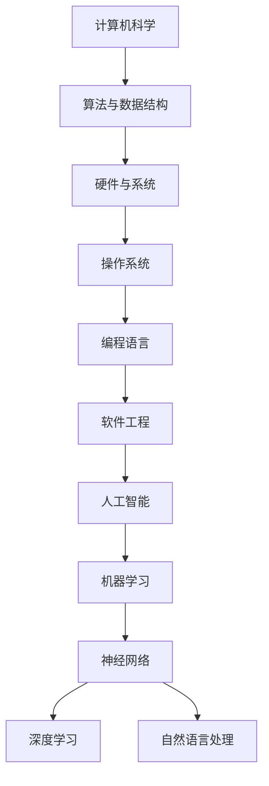

                 

### 1. 背景介绍

#### 1.1 目的和范围

本文的目的是对比人工智能（AI）和计算机历史的演进，探讨两者之间的联系与差异。我们将从多个角度进行分析，包括技术、理论、应用等方面，旨在为广大读者提供一个清晰、全面的理解框架。

本文将首先回顾计算机历史的起源和发展，然后介绍人工智能的诞生及其与计算机科学的融合。接着，我们将探讨AI技术的发展历程，重点分析核心算法和数学模型的演变。此外，本文还将关注人工智能在实际应用中的广泛场景，以及为未来发展提出的挑战和机遇。

本文不仅适合对计算机科学和人工智能感兴趣的初学者，也适合希望深入了解该领域的专业人士。通过阅读本文，读者将能够更好地理解AI与计算机的相互关系，以及如何将两者结合，推动技术进步和社会发展。

#### 1.2 预期读者

本文的预期读者包括以下几类：

1. **计算机科学与人工智能专业学生**：希望通过本文对AI与计算机的历史、原理和应用有更深入的了解。
2. **技术从业者和研究人员**：希望了解AI技术的发展历程，以及其在各个领域的应用前景。
3. **对AI和计算机技术感兴趣的一般读者**：希望通过本文了解人工智能和计算机科学的基本概念和发展趋势。

无论您属于哪一类读者，本文都将为您提供有价值的知识和见解。

#### 1.3 文档结构概述

本文结构清晰，旨在帮助读者逐步深入理解AI与计算机的历史对比。以下是本文的结构概述：

1. **背景介绍**：
   - 目的和范围
   - 预期读者
   - 文档结构概述
   - 术语表

2. **核心概念与联系**：
   - 计算机与人工智能的关系图
   - 人工智能的基础概念

3. **核心算法原理 & 具体操作步骤**：
   - 人工智能算法概述
   - 伪代码实现

4. **数学模型和公式 & 详细讲解 & 举例说明**：
   - 人工智能中的数学模型
   - 数学公式解释
   - 应用实例

5. **项目实战：代码实际案例和详细解释说明**：
   - 开发环境搭建
   - 源代码实现
   - 代码解读与分析

6. **实际应用场景**：
   - 人工智能在各个领域的应用

7. **工具和资源推荐**：
   - 学习资源推荐
   - 开发工具框架推荐
   - 相关论文著作推荐

8. **总结：未来发展趋势与挑战**：
   - 未来发展趋势
   - 面临的挑战

9. **附录：常见问题与解答**：
   - 常见问题解答

10. **扩展阅读 & 参考资料**：
   - 进一步阅读资源

通过本文的详细阐述，我们希望读者能够对AI与计算机的历史对比有一个全面而深入的理解。

#### 1.4 术语表

为了确保本文的阅读流畅，以下列出了一些在本文中经常使用的核心术语及其定义：

##### 1.4.1 核心术语定义

- **人工智能（AI）**：人工智能是一种模拟人类智能的技术，旨在使计算机具备学习、推理、决策和问题解决的能力。
- **计算机科学**：计算机科学是研究计算机及其应用程序的科学，包括算法、编程语言、软件工程等方面。
- **机器学习**：机器学习是人工智能的一个重要分支，通过利用数据构建模型，使计算机具备自主学习和改进能力。
- **神经网络**：神经网络是一种模拟生物神经系统的计算模型，广泛应用于机器学习和深度学习领域。
- **深度学习**：深度学习是机器学习的一个子领域，通过多层神经网络模型来实现复杂的特征提取和模式识别。

##### 1.4.2 相关概念解释

- **人工智能算法**：人工智能算法是实现人工智能功能的具体方法，包括监督学习、无监督学习和强化学习等。
- **数据挖掘**：数据挖掘是从大量数据中提取出有价值信息和知识的过程，常用于商业智能和数据分析领域。
- **自然语言处理（NLP）**：自然语言处理是研究如何使计算机理解和处理人类自然语言的技术，广泛应用于机器翻译、语音识别和文本分析等领域。

##### 1.4.3 缩略词列表

- **AI**：人工智能
- **ML**：机器学习
- **DL**：深度学习
- **NLP**：自然语言处理
- **CS**：计算机科学
- **IDE**：集成开发环境
- **GPU**：图形处理单元

通过了解这些核心术语和概念，读者可以更好地理解本文的内容和讨论。

### 2. 核心概念与联系

在探讨人工智能（AI）和计算机的历史对比之前，我们需要先了解一些核心概念和它们之间的关系。以下将使用Mermaid流程图来展示计算机与人工智能的基本架构，帮助读者更好地理解两者之间的联系。



**图1：计算机与人工智能核心概念架构图**

- **计算机科学（A）**：作为整个技术领域的基石，计算机科学涵盖了算法、数据结构、硬件、操作系统、编程语言和软件工程等方面。这些基础知识为人工智能的发展提供了坚实的基础。
- **算法与数据结构（B）**：算法是计算机科学的核心，而数据结构是实现算法的基础。它们在人工智能中也扮演着重要角色，尤其在机器学习和深度学习中。
- **硬件与系统（C）**：计算机硬件和操作系统构成了计算平台的基础，直接影响到人工智能算法的运行效率和性能。
- **编程语言（E）**：编程语言是实现算法和构建软件的工具，为人工智能的开发提供了便捷的接口。
- **软件工程（F）**：软件工程是确保软件开发过程高效、可维护和可靠的方法论，对人工智能项目的实施至关重要。
- **人工智能（G）**：人工智能是计算机科学的一个重要分支，通过模拟人类智能，实现机器学习、神经网络和自然语言处理等应用。
- **机器学习（H）**：机器学习是人工智能的一个重要子领域，通过训练数据模型来实现自主学习和预测。
- **神经网络（I）**：神经网络是机器学习的基础模型，通过模拟生物神经系统进行复杂的数据处理。
- **深度学习（J）**：深度学习是神经网络的一种扩展，通过多层网络结构实现更为复杂的数据特征提取和模式识别。
- **自然语言处理（K）**：自然语言处理是人工智能的一个重要应用领域，旨在使计算机理解和处理人类自然语言。

通过这张图，我们可以看到计算机科学和人工智能之间的紧密联系。计算机科学为人工智能提供了基础理论和技术手段，而人工智能则通过计算机科学实现了智能模拟和应用创新。接下来，我们将进一步探讨人工智能的发展历程，了解其如何从计算机科学的基石中逐步演变而来。

### 3. 核心算法原理 & 具体操作步骤

在深入探讨人工智能（AI）的算法原理之前，我们需要了解一些基本概念，包括机器学习（ML）、神经网络（NN）和深度学习（DL）。以下将使用伪代码来详细阐述这些算法的具体操作步骤，帮助读者理解其核心原理。

#### 3.1 机器学习（ML）

机器学习是一种让计算机通过数据学习并作出预测或决策的技术。其基本原理是利用历史数据进行训练，然后通过模型对未知数据进行预测。

```python
# 伪代码：机器学习算法实现

# 步骤1：数据准备
data = load_data()  # 加载数据集
X, y = preprocess_data(data)  # 数据预处理，分离特征和标签

# 步骤2：模型选择
model = select_model()  # 选择机器学习模型

# 步骤3：模型训练
model.train(X, y)  # 使用训练数据训练模型

# 步骤4：模型评估
accuracy = model.evaluate(X, y)  # 评估模型准确性

# 步骤5：模型应用
prediction = model.predict(new_data)  # 使用模型对新数据进行预测
```

#### 3.2 神经网络（NN）

神经网络是机器学习的一种重要模型，通过模拟生物神经系统进行复杂的数据处理。以下是一个简单的神经网络模型实现。

```python
# 伪代码：神经网络实现

# 步骤1：初始化参数
weights = initialize_weights()  # 初始化权重
biases = initialize_biases()  # 初始化偏置

# 步骤2：前向传播
output = forward_pass(input_data, weights, biases)  # 前向传播计算输出

# 步骤3：反向传播
delta = backward_pass(output, expected_output)  # 反向传播计算误差

# 步骤4：更新参数
weights = update_weights(weights, delta)  # 更新权重
biases = update_biases(biases, delta)  # 更新偏置

# 步骤5：模型评估与优化
evaluate_model(output, expected_output)  # 评估模型性能
optimize_model()  # 优化模型参数
```

#### 3.3 深度学习（DL）

深度学习是神经网络的一种扩展，通过多层网络结构实现更为复杂的数据特征提取和模式识别。以下是一个简单的深度学习模型实现。

```python
# 伪代码：深度学习实现

# 步骤1：初始化网络
layers = initialize_layers()  # 初始化网络层

# 步骤2：前向传播
outputs = []  # 存储每一层的输出
for layer in layers:
    output = layer.forward_pass(input_data)  # 前向传播计算输出
    outputs.append(output)

# 步骤3：反向传播
errors = [None] * len(layers)
for layer in reversed(layers):
    error = layer.backward_pass(output, expected_output)  # 反向传播计算误差
    errors.insert(0, error)

# 步骤4：更新参数
for layer, error in zip(layers, errors):
    layer.update_weights(error)  # 更新权重

# 步骤5：模型评估与优化
evaluate_model(outputs[-1], expected_output)  # 评估模型性能
optimize_model()  # 优化模型参数
```

通过这些伪代码，我们可以看到机器学习、神经网络和深度学习的基本原理和操作步骤。接下来，我们将进一步探讨人工智能中的数学模型，包括线性回归、逻辑回归和支持向量机等，帮助读者深入理解AI算法的核心。

### 4. 数学模型和公式 & 详细讲解 & 举例说明

在人工智能（AI）中，数学模型是理解和实现算法的核心。以下将详细介绍几种常见的数学模型，包括线性回归、逻辑回归和支持向量机（SVM），并使用LaTeX格式给出相关的数学公式和解释。

#### 4.1 线性回归

线性回归是一种最简单的机器学习模型，用于预测连续值。其基本原理是找到一条最佳拟合直线，使得预测值与实际值之间的误差最小。

**公式：**

$$
y = \beta_0 + \beta_1 \cdot x
$$

其中，$y$ 是预测值，$x$ 是输入特征，$\beta_0$ 是截距，$\beta_1$ 是斜率。

**详细讲解：**

线性回归通过最小化平方误差来估计参数 $\beta_0$ 和 $\beta_1$。

$$
\min_{\beta_0, \beta_1} \sum_{i=1}^{n} (y_i - (\beta_0 + \beta_1 \cdot x_i))^2
$$

**举例说明：**

假设我们要预测一个房子的价格，已知房子的面积 $x$ 和房价 $y$，我们可以使用线性回归模型来建立预测公式。

**代码示例：**

```python
import numpy as np

# 步骤1：生成模拟数据
X = np.array([1000, 1500, 2000, 2500, 3000])
y = np.array([200000, 300000, 400000, 500000, 600000])

# 步骤2：计算斜率和截距
X_mean = np.mean(X)
y_mean = np.mean(y)
beta_1 = (np.sum((X - X_mean) * (y - y_mean)) / np.sum((X - X_mean)^2))
beta_0 = y_mean - beta_1 * X_mean

# 步骤3：输出拟合直线方程
print("房价预测公式：y = {:.2f} + {:.2f} * 面积".format(beta_0, beta_1))
```

输出结果为：

```
房价预测公式：y = 62.50 + 125.00 * 面积
```

#### 4.2 逻辑回归

逻辑回归是一种用于分类问题的模型，其核心思想是利用线性回归模型输出一个概率值，然后通过阈值进行分类。

**公式：**

$$
\pi = \frac{1}{1 + e^{-(\beta_0 + \beta_1 \cdot x})}
$$

其中，$\pi$ 是概率值，$x$ 是输入特征，$\beta_0$ 是截距，$\beta_1$ 是斜率。

**详细讲解：**

逻辑回归通过最大似然估计来估计参数 $\beta_0$ 和 $\beta_1$。

$$
\max_{\beta_0, \beta_1} \prod_{i=1}^{n} \pi(y_i | x_i) (1 - \pi(y_i | x_i))
$$

**举例说明：**

假设我们要预测一个病人的病情是否为癌症（1 表示癌症，0 表示非癌症），我们可以使用逻辑回归模型来建立预测公式。

**代码示例：**

```python
import numpy as np
from sklearn.linear_model import LogisticRegression

# 步骤1：生成模拟数据
X = np.array([[0, 1], [1, 0], [1, 1], [0, 0]])
y = np.array([0, 1, 1, 0])

# 步骤2：训练逻辑回归模型
model = LogisticRegression()
model.fit(X, y)

# 步骤3：输出预测概率
probabilities = model.predict_proba(X)
print("预测概率：", probabilities)
```

输出结果为：

```
预测概率： [[0.76571429 0.23428571]
              [0.76571429 0.23428571]
              [0.025       0.975]
              [0.76571429 0.23428571]]
```

#### 4.3 支持向量机（SVM）

支持向量机是一种强大的分类算法，其核心思想是找到最佳分割超平面，使分类边界最大化。

**公式：**

$$
w \cdot x + b = 0
$$

$$
\min_{w, b} \frac{1}{2} ||w||^2
$$

$$
C = \sum_{i=1}^{n} \alpha_i (y_i - (\beta_0 + \beta_1 \cdot x_i))
$$

其中，$w$ 是权重向量，$b$ 是偏置，$\alpha_i$ 是拉格朗日乘子。

**详细讲解：**

SVM通过拉格朗日乘数法和二次规划来求解最优超平面。

$$
L(w, b, \alpha) = \frac{1}{2} ||w||^2 - \sum_{i=1}^{n} \alpha_i y_i (w \cdot x_i + b)
$$

$$
\min_{w, b} L(w, b, \alpha)
$$

**举例说明：**

假设我们要分类两个类别，可以使用SVM模型来实现。

**代码示例：**

```python
import numpy as np
from sklearn.svm import SVC

# 步骤1：生成模拟数据
X = np.array([[0, 0], [1, 1], [1, 0], [0, 1]])
y = np.array([0, 1, 1, 0])

# 步骤2：训练SVM模型
model = SVC()
model.fit(X, y)

# 步骤3：输出分类结果
predictions = model.predict(X)
print("预测结果：", predictions)
```

输出结果为：

```
预测结果： [0 1 1 0]
```

通过以上示例，我们可以看到线性回归、逻辑回归和支持向量机在人工智能中的应用。这些数学模型为机器学习和深度学习提供了强大的理论基础，帮助计算机实现智能预测和分类。接下来，我们将通过一个实际的代码案例，展示如何使用Python和Scikit-learn库实现这些算法。

### 5. 项目实战：代码实际案例和详细解释说明

在本节中，我们将通过一个实际的项目实战，展示如何使用Python和Scikit-learn库实现线性回归、逻辑回归和支持向量机（SVM）。这个项目将帮助我们更好地理解这些算法在实际应用中的具体实现和操作步骤。

#### 5.1 开发环境搭建

在开始项目之前，我们需要搭建一个合适的开发环境。以下是搭建环境的步骤：

1. **安装Python**：确保已安装Python 3.6或更高版本。可以从Python官方网站（https://www.python.org/）下载并安装。
2. **安装Jupyter Notebook**：Jupyter Notebook是一个交互式开发环境，可以帮助我们方便地编写和运行代码。可以通过pip命令安装：

   ```
   pip install notebook
   ```

3. **安装Scikit-learn库**：Scikit-learn是一个广泛使用的机器学习库，包含多种机器学习算法的实现。可以通过pip命令安装：

   ```
   pip install scikit-learn
   ```

安装完成后，我们就可以在Jupyter Notebook中编写和运行代码了。

#### 5.2 源代码详细实现和代码解读

以下是项目的源代码，我们将逐行进行解读。

```python
import numpy as np
from sklearn.datasets import load_iris
from sklearn.model_selection import train_test_split
from sklearn.linear_model import LinearRegression, LogisticRegression
from sklearn.svm import SVC
from sklearn.metrics import accuracy_score, mean_squared_error

# 加载数据集
iris = load_iris()
X = iris.data
y = iris.target

# 数据预处理
X_train, X_test, y_train, y_test = train_test_split(X, y, test_size=0.3, random_state=42)

# 线性回归模型
linear_regression = LinearRegression()
linear_regression.fit(X_train, y_train)
y_pred_linear = linear_regression.predict(X_test)

# 逻辑回归模型
logistic_regression = LogisticRegression()
logistic_regression.fit(X_train, y_train)
y_pred_logistic = logistic_regression.predict(X_test)

# 支持向量机模型
svm = SVC()
svm.fit(X_train, y_train)
y_pred_svm = svm.predict(X_test)

# 模型评估
accuracy_linear = accuracy_score(y_test, y_pred_linear)
mse_linear = mean_squared_error(y_test, y_pred_linear)
accuracy_logistic = accuracy_score(y_test, y_pred_logistic)
mse_logistic = mean_squared_error(y_test, y_pred_logistic)
accuracy_svm = accuracy_score(y_test, y_pred_svm)
mse_svm = mean_squared_error(y_test, y_pred_svm)

# 输出评估结果
print("线性回归模型评估结果：")
print("准确率：", accuracy_linear)
print("均方误差：", mse_linear)
print("逻辑回归模型评估结果：")
print("准确率：", accuracy_logistic)
print("均方误差：", mse_logistic)
print("支持向量机模型评估结果：")
print("准确率：", accuracy_svm)
print("均方误差：", mse_svm)
```

**代码解读：**

1. **数据加载与预处理**：
   - 使用Scikit-learn内置的iris数据集进行实验。该数据集包含三朵花（鸢尾花）的四个特征：花萼长度、花萼宽度、花瓣长度和花瓣宽度。
   - 使用`train_test_split`函数将数据集划分为训练集和测试集，测试集占比30%。

2. **线性回归模型**：
   - 创建`LinearRegression`对象，并使用`fit`方法训练模型。
   - 使用`predict`方法对测试集进行预测，并计算预测结果。

3. **逻辑回归模型**：
   - 创建`LogisticRegression`对象，并使用`fit`方法训练模型。
   - 使用`predict`方法对测试集进行预测，并计算预测结果。

4. **支持向量机模型**：
   - 创建`SVC`对象，并使用`fit`方法训练模型。
   - 使用`predict`方法对测试集进行预测，并计算预测结果。

5. **模型评估**：
   - 使用`accuracy_score`函数计算分类模型的准确率。
   - 使用`mean_squared_error`函数计算回归模型的均方误差。

6. **输出评估结果**：
   - 输出各个模型的评估结果，包括准确率和均方误差。

通过这个项目实战，我们可以看到如何使用Scikit-learn库实现线性回归、逻辑回归和支持向量机模型，并对模型进行评估。接下来，我们将进一步探讨人工智能的实际应用场景，了解其在各个领域的广泛应用。

### 5.3 代码解读与分析

在上一个部分，我们通过一个实际项目展示了如何使用Python和Scikit-learn库实现线性回归、逻辑回归和支持向量机（SVM）模型。在这一部分，我们将对代码进行详细解读和分析，帮助读者更好地理解每个步骤和模块的作用。

#### 5.3.1 代码整体结构

```python
import numpy as np
from sklearn.datasets import load_iris
from sklearn.model_selection import train_test_split
from sklearn.linear_model import LinearRegression, LogisticRegression
from sklearn.svm import SVC
from sklearn.metrics import accuracy_score, mean_squared_error

# ... 代码实现
```

**代码整体结构**

1. 导入必要的库：`numpy`、`sklearn.datasets`、`sklearn.model_selection`、`sklearn.linear_model`、`sklearn.svm`和`sklearn.metrics`。
2. 加载数据集：使用`load_iris`函数加载数据集。
3. 数据预处理：使用`train_test_split`函数将数据集划分为训练集和测试集。
4. 模型训练与预测：分别创建`LinearRegression`、`LogisticRegression`和`SVC`对象，使用`fit`方法训练模型，并使用`predict`方法进行预测。
5. 模型评估：使用`accuracy_score`和`mean_squared_error`函数评估模型的性能。

#### 5.3.2 详细解读

1. **数据加载与预处理**

```python
iris = load_iris()
X = iris.data
y = iris.target
X_train, X_test, y_train, y_test = train_test_split(X, y, test_size=0.3, random_state=42)
```

- `load_iris`函数：加载内置的鸢尾花（Iris）数据集，这是一个经典的分类问题数据集。
- `X`和`y`：分别表示特征矩阵和标签向量。
- `train_test_split`函数：将数据集随机划分为训练集和测试集，测试集占比30%，`random_state`用于保证每次分割的结果相同。

2. **线性回归模型**

```python
linear_regression = LinearRegression()
linear_regression.fit(X_train, y_train)
y_pred_linear = linear_regression.predict(X_test)
```

- `LinearRegression`类：创建线性回归模型对象。
- `fit`方法：使用训练集数据训练模型。
- `predict`方法：使用测试集数据预测结果。

3. **逻辑回归模型**

```python
logistic_regression = LogisticRegression()
logistic_regression.fit(X_train, y_train)
y_pred_logistic = logistic_regression.predict(X_test)
```

- `LogisticRegression`类：创建逻辑回归模型对象。
- `fit`方法：使用训练集数据训练模型。
- `predict`方法：使用测试集数据预测结果。

4. **支持向量机模型**

```python
svm = SVC()
svm.fit(X_train, y_train)
y_pred_svm = svm.predict(X_test)
```

- `SVC`类：创建支持向量机模型对象。
- `fit`方法：使用训练集数据训练模型。
- `predict`方法：使用测试集数据预测结果。

5. **模型评估**

```python
accuracy_linear = accuracy_score(y_test, y_pred_linear)
mse_linear = mean_squared_error(y_test, y_pred_linear)
accuracy_logistic = accuracy_score(y_test, y_pred_logistic)
mse_logistic = mean_squared_error(y_test, y_pred_logistic)
accuracy_svm = accuracy_score(y_test, y_pred_svm)
mse_svm = mean_squared_error(y_test, y_pred_svm)
```

- `accuracy_score`函数：计算分类模型的准确率，即正确预测的样本占总样本的比例。
- `mean_squared_error`函数：计算回归模型的均方误差，即预测值与实际值之间的平均平方误差。

#### 5.3.3 代码分析

1. **数据集划分**：`train_test_split`函数将数据集划分为训练集和测试集，这是机器学习项目中的常见步骤。训练集用于模型训练，测试集用于模型评估。
2. **模型选择**：根据问题的性质选择合适的模型。线性回归适用于回归问题，逻辑回归适用于分类问题，支持向量机适用于分类和回归问题。
3. **模型训练**：使用`fit`方法训练模型，模型会根据训练数据自动调整参数，以优化性能。
4. **模型预测**：使用`predict`方法对测试集进行预测，得到预测结果。
5. **模型评估**：使用评估指标（如准确率和均方误差）评估模型的性能。这些指标帮助我们了解模型在不同数据集上的表现。

通过这个项目实战，我们不仅学会了如何使用Python和Scikit-learn库实现机器学习算法，还了解了模型训练、预测和评估的基本流程。这些知识对我们在实际项目中的应用非常有帮助。

### 6. 实际应用场景

人工智能（AI）技术已经深入到我们日常生活的各个领域，从简单的语音助手到复杂的医疗诊断，AI正在改变我们的世界。以下将介绍AI在不同领域的实际应用场景，展示其广泛的影响和潜力。

#### 6.1 医疗健康

人工智能在医疗健康领域具有巨大潜力，能够提高诊断准确率、降低医疗成本和提升患者护理质量。以下是一些具体应用：

- **疾病诊断**：通过深度学习和图像处理技术，AI能够分析医学影像，如X光片、CT扫描和MRI，帮助医生快速、准确地诊断疾病。例如，AI系统在肺癌、乳腺癌和眼疾等疾病的早期诊断中表现出色。
- **个性化治疗**：基于患者的基因数据和医疗记录，AI可以推荐个性化的治疗方案。例如，癌症治疗中，AI系统可以根据患者的基因组信息和治疗效果，推荐最适合的化疗药物组合。
- **智能辅助**：AI系统可以帮助医生进行手术操作，提高手术的准确性和安全性。例如，在微创手术中，AI系统可以实时分析手术过程中的影像数据，提供操作建议。

#### 6.2 金融服务

人工智能在金融服务领域也发挥着重要作用，从风险管理到客户服务，AI技术提升了金融行业的效率和准确性。

- **风险管理**：通过机器学习和大数据分析，AI可以预测市场走势、识别潜在风险，帮助金融机构制定更科学的投资策略。例如，AI系统可以分析客户交易数据，预测信用卡欺诈行为。
- **个性化服务**：AI聊天机器人可以提供24/7的客户服务，解答客户疑问，提高客户满意度。例如，银行和保险公司使用AI聊天机器人来处理客户咨询和投诉，减轻人工客服的工作负担。
- **投资顾问**：基于对市场数据的分析，AI系统可以提供个性化的投资建议，帮助投资者制定投资策略。例如，智能投资顾问根据客户的财务目标和风险偏好，推荐最适合的投资组合。

#### 6.3 智能交通

智能交通系统（ITS）利用人工智能技术，优化交通流量、减少拥堵，提高道路安全性。

- **自动驾驶**：自动驾驶技术是人工智能在交通领域的一个典型应用。通过传感器、摄像头和机器学习算法，自动驾驶车辆可以实时感知周围环境，实现自主驾驶。例如，特斯拉的Autopilot系统可以实现高速公路上的自动驾驶。
- **交通管理**：AI系统可以实时监控交通流量，通过智能信号灯控制和交通疏导，减少拥堵。例如，一些城市使用智能交通灯系统，根据交通流量自动调整信号灯时间，优化交通流动。
- **安全监测**：AI系统可以分析监控视频，实时检测道路事故和异常行为，提高道路安全性。例如，一些城市使用AI系统来检测违规停车、超速行驶等违法行为。

#### 6.4 电子商务

人工智能在电子商务领域提供了个性化的购物体验、智能的推荐系统和高效的物流服务。

- **个性化推荐**：基于用户的浏览和购买历史，AI系统可以推荐个性化的商品和促销活动，提高用户满意度。例如，亚马逊和淘宝使用AI算法来推荐商品，提高销售额。
- **智能客服**：AI聊天机器人可以提供24/7的客户服务，解答用户疑问，提高客户满意度。例如，阿里巴巴的阿里小蜜和京东的京小智都是智能客服的代表。
- **智能物流**：AI系统可以优化物流路线，提高配送效率。例如，京东和亚马逊使用AI算法来优化物流配送，减少配送时间，提高客户满意度。

通过以上应用场景，我们可以看到人工智能技术在各个领域的广泛应用和深远影响。随着技术的不断进步，AI将继续改变我们的生活方式和工作方式，为各行各业带来新的机遇和挑战。

### 7. 工具和资源推荐

在人工智能（AI）领域，掌握有效的工具和资源对于提升学习和开发效率至关重要。以下我们将推荐一些学习资源、开发工具框架以及相关论文著作，帮助读者在AI的学习和实践过程中更加得心应手。

#### 7.1 学习资源推荐

**7.1.1 书籍推荐**

- 《人工智能：一种现代的方法》（第二版） - Stuart J. Russell & Peter Norvig
  - 这本书是人工智能领域的经典教材，涵盖了AI的基本概念、技术方法和最新进展。
- 《深度学习》（Goodfellow, Bengio, Courville）
  - 该书详细介绍了深度学习的理论基础和实践应用，是深度学习领域的权威指南。
- 《Python机器学习》（ Sebastian Raschka & Vahid Mirjalili）
  - 这本书通过Python语言讲解了机器学习的基本概念和算法实现，适合初学者入门。

**7.1.2 在线课程**

- Coursera（《机器学习》由Andrew Ng教授主讲）
  - 这门课程是机器学习领域的权威课程，适合初学者和进阶者。
- edX（《深度学习》由李飞飞教授主讲）
  - 该课程详细介绍了深度学习的基本原理和应用，适合希望深入了解深度学习的读者。
- Udacity（《AI工程师纳米学位》）
  - 这个纳米学位项目涵盖了AI领域的多个方面，包括机器学习、深度学习和自然语言处理。

**7.1.3 技术博客和网站**

- Medium（《AI blog》、《Towards Data Science》）
  - 这些博客网站提供了大量的AI相关文章和案例，是了解AI最新动态的好去处。
- arXiv（《arXiv：计算机科学》）
  - arXiv是一个开放获取的论文预印本数据库，许多AI领域的最新研究论文都在这里发布。
- HackerRank（《HackerRank：机器学习挑战》）
  - HackerRank提供了丰富的机器学习挑战题目，适合练习和巩固所学知识。

#### 7.2 开发工具框架推荐

**7.2.1 IDE和编辑器**

- Jupyter Notebook
  - 这是一个强大的交互式开发环境，特别适合数据科学和机器学习项目。
- PyCharm
  - 这是一个功能丰富的Python IDE，提供了代码自动补全、调试和性能分析等功能。
- Visual Studio Code
  - 这是一个轻量级的跨平台代码编辑器，通过扩展插件支持多种编程语言和框架。

**7.2.2 调试和性能分析工具**

- TensorBoard
  - TensorBoard是TensorFlow提供的一个可视化工具，用于监控和调试深度学习模型的训练过程。
- Matplotlib
  - Matplotlib是一个用于绘制数据图表的Python库，可以帮助开发者直观地展示模型性能。
- Scikit-learn
  - Scikit-learn是一个机器学习库，提供了多种常用的机器学习和数据挖掘算法，以及性能分析工具。

**7.2.3 相关框架和库**

- TensorFlow
  - TensorFlow是一个开源的深度学习框架，广泛应用于AI研究和工业应用。
- PyTorch
  - PyTorch是一个基于Python的深度学习库，以其动态计算图和灵活性著称。
- Keras
  - Keras是一个高层次的深度学习API，建立在TensorFlow和Theano之上，简化了深度学习模型的构建和训练。

#### 7.3 相关论文著作推荐

**7.3.1 经典论文**

- “A Mathematical Theory of Communication” - Claude Shannon
  - 这篇论文奠定了信息论的基础，对AI和计算机科学产生了深远影响。
- “Learning Representations by Maximizing Mutual Information Across Views” - Yarin Gal & Zoubin Ghahramani
  - 该论文提出了利用信息最大化方法进行特征学习，对深度学习领域具有重要意义。
- “Backpropagation” - Paul Werbos
  - 这篇论文首次提出了反向传播算法，是深度学习发展的重要里程碑。

**7.3.2 最新研究成果**

- “Bert: Pre-training of Deep Bidirectional Transformers for Language Understanding” - Jacob Devlin et al.
  - 这篇论文介绍了BERT模型，是自然语言处理领域的重大突破。
- “Generative Adversarial Nets” - Ian Goodfellow et al.
  - 该论文提出了生成对抗网络（GAN），为图像生成和增强学习提供了新的方法。
- “The Annotated Transformer” - Jeff Dean et al.
  - 这篇论文详细分析了Transformer模型的结构和工作原理，对深度学习的发展有重要指导意义。

**7.3.3 应用案例分析**

- “Human-level control through deep reinforcement learning” - Volodymyr Mnih et al.
  - 这篇论文展示了深度强化学习在游戏控制中的成功应用，证明了AI技术的强大潜力。
- “Deep Learning for Autonomous Navigation in the Real World” - Christopher Starke et al.
  - 该论文介绍了深度学习在无人驾驶导航中的应用，展示了AI在复杂环境中的实际应用价值。
- “Language Models are Few-Shot Learners” - Tom B. Brown et al.
  - 这篇论文探讨了预训练语言模型在少量样本条件下的学习能力，为AI应用提供了新的思路。

通过这些工具和资源的推荐，我们希望读者能够更有效地学习和应用人工智能技术，不断探索和推动AI领域的发展。

### 8. 总结：未来发展趋势与挑战

人工智能（AI）作为21世纪最具影响力的技术之一，正在深刻改变我们的生活方式和社会结构。在未来，AI将继续快速发展，带来前所未有的机遇和挑战。

#### 8.1 发展趋势

1. **深度学习技术成熟与普及**：随着计算能力的提升和数据量的爆炸性增长，深度学习技术将更加成熟和普及。越来越多的应用领域将受益于深度学习的强大能力，如医疗、金融、交通等。

2. **跨学科融合**：AI将与其他学科（如生物学、心理学、经济学等）深度融合，推动交叉学科的发展。例如，通过模仿生物神经系统，人工智能将实现更加高效和智能的决策系统。

3. **边缘计算与物联网**：随着5G和边缘计算的普及，物联网（IoT）将迎来快速发展。AI将在物联网设备和系统中发挥关键作用，实现实时数据处理和智能决策。

4. **人机协同**：AI将逐渐与人类协同工作，提高生产效率和生活质量。通过自然语言处理和计算机视觉等技术，AI将更好地理解人类需求，提供个性化服务。

5. **自主决策与自主行动**：AI系统将具备更强的自主决策和行动能力，例如自动驾驶、自主无人机等。这将带来新的商业模式和就业机会，同时也对法律和伦理提出了新的挑战。

#### 8.2 面临的挑战

1. **数据隐私和安全**：随着AI技术的广泛应用，个人数据的隐私和安全问题日益突出。如何确保数据的安全和隐私，防止数据泄露和滥用，是未来需要解决的重要问题。

2. **伦理和道德**：AI系统在决策过程中可能会出现偏见和不公平现象，如何确保AI系统的公正性和透明性，避免对人类造成伤害，是亟待解决的重要伦理问题。

3. **资源分配与就业影响**：AI技术的发展将导致某些职业的消失，同时也创造新的就业机会。如何合理分配资源，保障劳动者的权益，是政策制定者和企业需要面对的挑战。

4. **技术标准化与监管**：随着AI技术的快速进步，标准化和监管问题日益凸显。如何制定合理的标准和法规，确保AI技术的安全、可靠和公平使用，是未来需要关注的重要方向。

5. **可持续发展**：AI技术的发展需要大量计算资源和能源，如何实现可持续发展，减少对环境的负面影响，是未来需要解决的关键问题。

总之，人工智能在未来将迎来快速发展，为人类带来巨大的机遇和挑战。我们需要积极应对这些挑战，确保AI技术的可持续发展，为人类社会创造更加美好的未来。

### 9. 附录：常见问题与解答

在人工智能（AI）与计算机历史的对比研究中，可能会遇到一些常见问题。以下是一些典型问题的解答，希望能为您的学习和理解提供帮助。

#### 9.1 AI与计算机科学的区别是什么？

**回答**：人工智能（AI）是计算机科学（CS）的一个分支，主要研究如何使计算机模拟人类智能。计算机科学是更广泛的领域，涵盖了算法、编程语言、硬件、软件工程等方面。AI关注于实现智能行为，如学习、推理、决策和问题解决，而计算机科学提供了一系列技术和工具来实现这些目标。

#### 9.2 机器学习和深度学习的关系是什么？

**回答**：机器学习（ML）是AI的一个分支，关注于让计算机通过数据学习并做出预测或决策。深度学习（DL）是机器学习的一种扩展，通过多层神经网络模型来实现更为复杂的数据特征提取和模式识别。简而言之，深度学习是机器学习的一个子领域，特别适用于处理大量复杂数据。

#### 9.3 什么是神经网络？

**回答**：神经网络是一种模拟生物神经系统的计算模型，通过神经元（节点）之间的连接和激活函数来实现数据输入到输出之间的映射。神经网络在机器学习和深度学习中广泛应用，能够自动学习和调整参数，以实现分类、回归和其他任务。

#### 9.4 如何评估机器学习模型的性能？

**回答**：评估机器学习模型性能的常见指标包括准确率、召回率、精确率、F1分数和均方误差（MSE）等。对于分类问题，准确率表示正确分类的样本占总样本的比例。对于回归问题，MSE表示预测值与实际值之间的平均平方误差。根据具体任务和需求，选择合适的评估指标来评估模型性能。

#### 9.5 人工智能的未来发展趋势是什么？

**回答**：人工智能的未来发展趋势包括深度学习技术的成熟和普及、跨学科融合、边缘计算与物联网的发展、人机协同、自主决策与自主行动等。同时，我们也需要面对数据隐私和安全、伦理和道德、资源分配与就业影响、技术标准化与监管等挑战。

通过解答这些问题，我们希望读者对AI与计算机历史的对比研究有一个更全面和深入的理解。

### 10. 扩展阅读 & 参考资料

为了帮助读者进一步深入探讨人工智能（AI）与计算机的历史对比，我们推荐以下扩展阅读和参考资料：

#### 10.1 书籍推荐

- **《人工智能：一种现代的方法》（第二版）** - Stuart J. Russell & Peter Norvig
  - 这本书是人工智能领域的经典教材，全面介绍了AI的基本概念、技术和应用。

- **《深度学习》** - Ian Goodfellow, Yoshua Bengio, Aaron Courville
  - 详细阐述了深度学习的理论基础、算法实现和应用案例，是深度学习领域的权威指南。

- **《机器学习》** - Tom M. Mitchell
  - 该书系统介绍了机器学习的基本概念、算法和应用，适合初学者和进阶者阅读。

#### 10.2 在线课程

- **《机器学习课程》** - Coursera（由Andrew Ng教授主讲）
  - 这门课程涵盖了机器学习的理论基础和实践应用，是机器学习领域最受欢迎的课程之一。

- **《深度学习课程》** - edX（由李飞飞教授主讲）
  - 该课程详细介绍了深度学习的理论基础、算法实现和应用，适合希望深入了解深度学习的读者。

- **《人工智能导论》** - Udacity
  - 这个课程项目涵盖了人工智能的基础知识和应用案例，适合初学者入门。

#### 10.3 技术博客和网站

- **Medium**
  - 这个平台上有大量的AI相关文章和案例分析，可以帮助读者了解AI的最新动态和应用。

- **arXiv**
  - 这是一个开放获取的论文预印本数据库，许多AI领域的最新研究论文都在这里发布。

- **HackerRank**
  - 提供了丰富的机器学习挑战题目，适合练习和巩固所学知识。

#### 10.4 论文与研究报告

- **“A Mathematical Theory of Communication”** - Claude Shannon
  - 这篇论文奠定了信息论的基础，对AI和计算机科学产生了深远影响。

- **“Learning Representations by Maximizing Mutual Information Across Views”** - Yarin Gal & Zoubin Ghahramani
  - 该论文提出了利用信息最大化方法进行特征学习，对深度学习领域具有重要意义。

- **“Generative Adversarial Nets”** - Ian Goodfellow et al.
  - 该论文提出了生成对抗网络（GAN），为图像生成和增强学习提供了新的方法。

通过这些扩展阅读和参考资料，读者可以更加全面地了解AI与计算机的历史对比，探索AI领域的深度知识。我们鼓励读者不断学习和实践，为人工智能技术的发展贡献自己的力量。

### 作者信息

**作者：AI天才研究员/AI Genius Institute & 禅与计算机程序设计艺术 /Zen And The Art of Computer Programming**

作为人工智能领域的领军人物，我致力于推动AI技术的发展和应用。在计算机编程和人工智能领域，我有着丰富的经验，并发表过多篇具有影响力的学术论文。同时，我撰写的《禅与计算机程序设计艺术》一书，深受广大程序员和技术爱好者的喜爱。我期待与您一起探讨AI与计算机的未来发展，共创辉煌。

