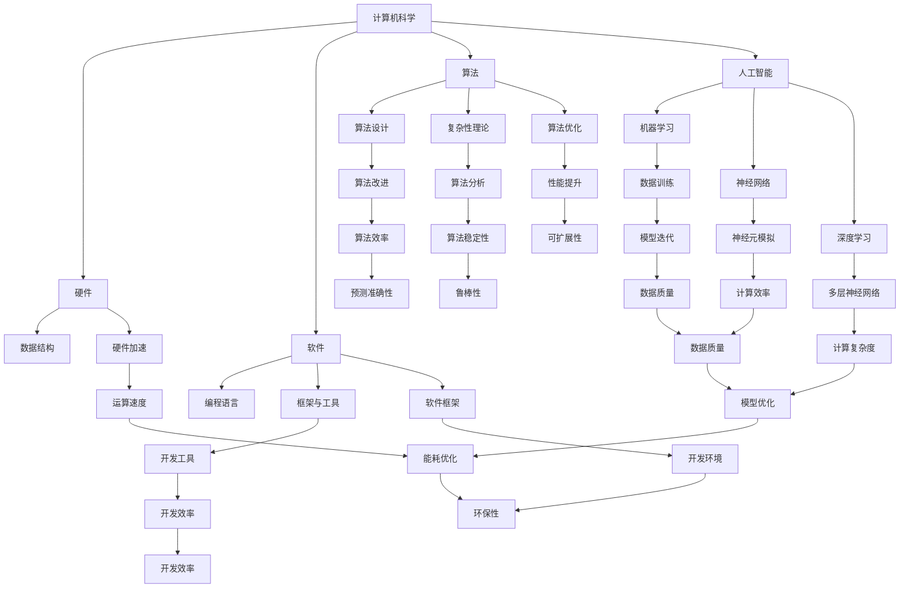

                 

# AI与计算机的历史对比

> 关键词：人工智能、计算机科学、技术发展、历史演进、核心算法、数学模型、应用场景

> 摘要：本文将深入探讨人工智能（AI）与计算机科学的历史发展及其相互关系。通过对比两者的技术进步和关键突破，我们旨在揭示AI在计算机科学领域中的独特地位和未来趋势，帮助读者更全面地理解这一重要领域。

## 1. 背景介绍

### 1.1 目的和范围

本文旨在通过对比人工智能（AI）和计算机科学的历史发展，探讨两者之间的相互关系及其对现代社会的影响。文章将首先回顾计算机科学的起源和发展，然后分析人工智能技术的诞生和演进。通过这种对比，我们希望读者能够更好地理解AI在计算机科学中的角色和重要性。

### 1.2 预期读者

本文面向对计算机科学和人工智能感兴趣的读者，特别是那些希望深入了解两者之间关系的人。无论是计算机科学专业的学生，还是对AI技术有浓厚兴趣的技术爱好者，本文都将提供有价值的信息和洞见。

### 1.3 文档结构概述

本文结构如下：

- **第1章：背景介绍**：概述文章的目的和预期读者，提供文档结构概述。
- **第2章：核心概念与联系**：介绍计算机科学和人工智能的核心概念，并使用Mermaid流程图展示两者的联系。
- **第3章：核心算法原理与具体操作步骤**：详细解释AI的核心算法原理和操作步骤，使用伪代码进行阐述。
- **第4章：数学模型和公式**：讲解AI中使用的数学模型和公式，并举例说明。
- **第5章：项目实战**：提供代码实际案例，详细解释和说明。
- **第6章：实际应用场景**：探讨AI在不同领域的应用场景。
- **第7章：工具和资源推荐**：推荐学习资源和开发工具。
- **第8章：总结**：总结文章的主要内容，展望未来发展趋势和挑战。
- **第9章：附录**：常见问题与解答。
- **第10章：扩展阅读与参考资料**：提供进一步阅读的资源和参考资料。

### 1.4 术语表

#### 1.4.1 核心术语定义

- **人工智能（AI）**：指由计算机实现的智能行为，旨在模仿或扩展人类的认知能力。
- **计算机科学**：研究计算机硬件和软件的理论、算法和应用。
- **机器学习（ML）**：AI的一个分支，通过数据和算法自动改进性能。

#### 1.4.2 相关概念解释

- **神经网络**：模拟人脑神经元结构和功能的计算模型。
- **深度学习**：一种特殊的机器学习技术，使用多层神经网络进行训练。
- **算法**：解决问题的明确步骤和规则。

#### 1.4.3 缩略词列表

- **AI**：人工智能
- **ML**：机器学习
- **DL**：深度学习
- **GPU**：图形处理单元

## 2. 核心概念与联系

在深入探讨AI与计算机科学的历史对比之前，我们需要先理解这两个领域的基本概念和它们之间的联系。

### 2.1 计算机科学的基本概念

计算机科学是研究计算机硬件和软件的理论、算法和应用的科学。其核心概念包括：

- **计算机硬件**：包括处理器、内存、输入输出设备等。
- **计算机软件**：包括操作系统、应用软件、编程语言等。
- **算法**：解决问题的一系列明确步骤。
- **数据结构**：组织和管理数据的方法。

### 2.2 人工智能的基本概念

人工智能是计算机科学的一个分支，旨在使计算机实现智能行为。核心概念包括：

- **机器学习（ML）**：通过数据训练模型，使计算机自动改进性能。
- **神经网络**：模拟人脑神经元结构和功能的计算模型。
- **深度学习（DL）**：一种特殊的机器学习技术，使用多层神经网络进行训练。

### 2.3 核心概念与联系

计算机科学和人工智能的核心概念之间存在紧密的联系。具体而言：

- **硬件与算法**：计算机硬件的发展推动了算法的进步，如GPU的普及加速了深度学习算法的运算。
- **软件与智能**：计算机软件提供了实现人工智能的框架和工具，如Python和TensorFlow。
- **算法与数据**：算法通过处理大量数据实现智能行为，如机器学习算法依赖于大规模数据集。

下面是使用Mermaid绘制的核心概念和联系流程图：



## 3. 核心算法原理 & 具体操作步骤

### 3.1 机器学习算法原理

机器学习（ML）是人工智能（AI）的核心技术之一。其基本原理是通过数据训练模型，使计算机能够从数据中学习并做出预测或决策。

#### 3.1.1 算法原理

机器学习算法可以分为监督学习、无监督学习和强化学习。监督学习有标记数据，通过学习输入和输出之间的关系进行预测；无监督学习没有标记数据，主要关注数据内在的结构；强化学习通过与环境的交互来学习最优策略。

下面是一个简单的监督学习算法——线性回归的伪代码：

```python
def linear_regression(x, y):
    # x: 输入特征，y: 输出标签
    # 求解最小二乘法，得到线性模型参数 w
    w = (x'x)^(-1)x'y
    return w
```

#### 3.1.2 具体操作步骤

1. 数据准备：收集并预处理输入特征和输出标签。
2. 模型初始化：初始化模型参数。
3. 模型训练：使用训练数据计算损失函数，并更新模型参数。
4. 模型评估：使用测试数据评估模型性能。

### 3.2 深度学习算法原理

深度学习（DL）是一种特殊的机器学习技术，它使用多层神经网络进行训练。其核心思想是通过层层提取特征，从原始数据中自动学习到高级抽象表示。

#### 3.2.1 算法原理

深度学习算法主要包括前向传播和反向传播两个过程。前向传播计算神经网络输出，反向传播计算梯度并更新权重。

下面是一个简单的多层感知器（MLP）的伪代码：

```python
def forward_propagation(x, w):
    # x: 输入特征，w: 权重
    # 前向传播，计算输出 z
    z = sigmoid(w'x)
    return z

def backward_propagation(z, y, w):
    # z: 输出，y: 真实标签，w: 权重
    # 反向传播，计算梯度
    dz = (z - y) * sigmoid_derivative(z)
    dw = x * dz
    return dw
```

#### 3.2.2 具体操作步骤

1. 数据准备：收集并预处理输入特征和输出标签。
2. 网络初始化：初始化神经网络结构。
3. 模型训练：使用前向传播和反向传播训练神经网络。
4. 模型评估：使用测试数据评估模型性能。

## 4. 数学模型和公式 & 详细讲解 & 举例说明

### 4.1 数学模型

在AI和计算机科学中，数学模型扮演着至关重要的角色。以下是一些核心的数学模型：

#### 4.1.1 概率论

- **贝叶斯定理**：用于计算条件概率和后验概率。
  $$ P(A|B) = \frac{P(B|A)P(A)}{P(B)} $$

- **熵**：用于衡量不确定性。
  $$ H(X) = -\sum_{i} P(X_i) \log_2 P(X_i) $$

#### 4.1.2 线性代数

- **矩阵乘法**：用于计算特征矩阵和权重矩阵的乘积。
  $$ C = A \cdot B $$

- **逆矩阵**：用于求解线性方程组。
  $$ A^{-1} = (A'A)^{-1}A' $$

#### 4.1.3 梯度下降

- **梯度下降**：用于优化神经网络参数。
  $$ w_{new} = w_{current} - \alpha \cdot \nabla_w J(w) $$
  其中，$J(w)$是损失函数，$\alpha$是学习率。

### 4.2 举例说明

#### 4.2.1 贝叶斯定理

假设我们有一个包含正面和负面评论的数据集，我们想根据评论内容预测用户的整体态度。我们可以使用贝叶斯定理计算后验概率，从而得出预测。

$$ P(\text{正面态度}|\text{正面评论}) = \frac{P(\text{正面评论}|\text{正面态度})P(\text{正面态度})}{P(\text{正面评论})} $$

#### 4.2.2 梯度下降

在训练一个多层感知器时，我们使用梯度下降来优化权重。假设我们的损失函数是均方误差（MSE）：

$$ J(w) = \frac{1}{2} \sum_{i} (y_i - z_i)^2 $$

其中，$y_i$是真实标签，$z_i$是模型预测。我们的目标是找到权重$w$，使得损失函数$J(w)$最小。

通过计算梯度：

$$ \nabla_w J(w) = -2 \sum_{i} (y_i - z_i) \cdot x_i $$

我们使用梯度下降更新权重：

$$ w_{new} = w_{current} - \alpha \cdot \nabla_w J(w) $$

其中，$\alpha$是学习率。

## 5. 项目实战：代码实际案例和详细解释说明

### 5.1 开发环境搭建

在进行AI项目实战之前，我们需要搭建一个合适的开发环境。以下是一个基于Python和TensorFlow的深度学习项目的环境搭建步骤：

1. **安装Python**：确保安装了Python 3.7或更高版本。
2. **安装TensorFlow**：使用pip命令安装TensorFlow。
   ```bash
   pip install tensorflow
   ```
3. **安装其他依赖**：根据项目需要安装其他依赖库，如NumPy、Pandas等。

### 5.2 源代码详细实现和代码解读

以下是一个简单的深度学习项目的代码实现，包括数据预处理、模型构建、训练和评估。

#### 5.2.1 数据预处理

```python
import pandas as pd
from sklearn.model_selection import train_test_split

# 加载数据
data = pd.read_csv('data.csv')
X = data.iloc[:, :-1].values
y = data.iloc[:, -1].values

# 划分训练集和测试集
X_train, X_test, y_train, y_test = train_test_split(X, y, test_size=0.2, random_state=42)
```

#### 5.2.2 模型构建

```python
import tensorflow as tf
from tensorflow.keras.models import Sequential
from tensorflow.keras.layers import Dense

# 构建模型
model = Sequential([
    Dense(64, activation='relu', input_shape=(X_train.shape[1],)),
    Dense(64, activation='relu'),
    Dense(1, activation='sigmoid')
])

# 编译模型
model.compile(optimizer='adam', loss='binary_crossentropy', metrics=['accuracy'])
```

#### 5.2.3 训练模型

```python
# 训练模型
history = model.fit(X_train, y_train, epochs=10, batch_size=32, validation_data=(X_test, y_test))
```

#### 5.2.4 评估模型

```python
# 评估模型
loss, accuracy = model.evaluate(X_test, y_test)
print(f"Test loss: {loss}, Test accuracy: {accuracy}")
```

### 5.3 代码解读与分析

1. **数据预处理**：使用Pandas加载CSV数据，然后使用scikit-learn划分训练集和测试集。
2. **模型构建**：使用TensorFlow的Sequential模型构建一个简单的多层感知器，包含两个隐藏层，每个隐藏层有64个神经元，激活函数为ReLU。输出层有1个神经元，激活函数为Sigmoid，用于实现二分类。
3. **模型训练**：使用model.fit()函数训练模型，使用adam优化器和binary_crossentropy损失函数，并在每个epoch结束后打印训练和验证损失。
4. **模型评估**：使用model.evaluate()函数评估模型在测试集上的性能。

## 6. 实际应用场景

人工智能技术在各个领域都有着广泛的应用。以下是一些典型的应用场景：

### 6.1 医疗健康

- **疾病预测和诊断**：通过分析患者的医疗数据，AI可以预测疾病的发生并辅助医生进行诊断。
- **个性化治疗**：基于患者的基因信息和病历，AI可以为患者提供个性化的治疗方案。

### 6.2 金融领域

- **风险管理**：AI可以分析大量金融数据，预测市场趋势并降低风险。
- **智能投顾**：通过分析用户的风险偏好和历史交易数据，AI可以提供个性化的投资建议。

### 6.3 自动驾驶

- **路径规划**：AI可以根据实时交通情况和地图数据规划最优行驶路径。
- **行为预测**：AI可以分析其他车辆和行人的行为，预测其未来动作并做出相应反应。

### 6.4 制造业

- **生产优化**：AI可以优化生产流程，降低成本并提高生产效率。
- **设备维护**：AI可以预测设备的故障时间，提前进行维护，减少停机时间。

## 7. 工具和资源推荐

### 7.1 学习资源推荐

#### 7.1.1 书籍推荐

- **《深度学习》（Goodfellow, Bengio, Courville著）**：系统介绍了深度学习的理论和方法。
- **《Python机器学习》（Sebastian Raschka著）**：涵盖了机器学习的基本概念和Python实现。

#### 7.1.2 在线课程

- **Coursera的《机器学习》课程**：由吴恩达教授主讲，适合初学者。
- **Udacity的《深度学习纳米学位》**：提供实战项目和视频教程。

#### 7.1.3 技术博客和网站

- **Medium上的AI博客**：提供了大量关于AI和机器学习的文章。
- **AI Stack Exchange**：一个针对AI问题的问答社区。

### 7.2 开发工具框架推荐

#### 7.2.1 IDE和编辑器

- **PyCharm**：一款功能强大的Python IDE，适合深度学习和机器学习开发。
- **Jupyter Notebook**：一个交互式Python环境，方便数据分析和模型实验。

#### 7.2.2 调试和性能分析工具

- **TensorBoard**：TensorFlow的图形化工具，用于分析模型的性能和训练过程。
- **Profiling Tools**：如cProfile和line_profiler，用于分析代码的性能瓶颈。

#### 7.2.3 相关框架和库

- **TensorFlow**：广泛使用的开源深度学习框架。
- **PyTorch**：另一种流行的深度学习框架，适用于动态计算图。

### 7.3 相关论文著作推荐

#### 7.3.1 经典论文

- **“Backpropagation” (Rumelhart, Hinton, Williams，1986)**：介绍了反向传播算法。
- **“A Learning Algorithm for Continually Running Fully Recurrent Neural Networks” (Williams, Zipser，1989)**：探讨了在线学习在神经网络中的应用。

#### 7.3.2 最新研究成果

- **ICML、NIPS、NeurIPS**：人工智能领域的顶级会议，提供了最新的研究进展。
- **arXiv**：一个提供预印本论文的网站，涵盖各种AI研究主题。

#### 7.3.3 应用案例分析

- **谷歌的AI研究**：介绍了谷歌在AI领域的研究和应用。
- **OpenAI的GPT-3项目**：展示了大型语言模型的强大能力。

## 8. 总结：未来发展趋势与挑战

人工智能（AI）和计算机科学的发展正以前所未有的速度推进，这给我们带来了巨大的机遇和挑战。以下是未来发展趋势和挑战的概述：

### 8.1 发展趋势

1. **计算能力提升**：随着硬件技术的进步，尤其是GPU和TPU等专用硬件的出现，计算能力将大幅提升，为深度学习和复杂AI模型的研究和应用提供支持。
2. **数据获取与处理**：数据的获取和处理将越来越重要。随着物联网和传感器技术的发展，我们将收集到海量的数据，如何有效地存储、处理和分析这些数据是一个重要挑战。
3. **跨学科融合**：AI与生物学、心理学、社会学等领域的交叉融合将不断深化，推动新型AI技术的出现。
4. **自动化与智能化**：AI将在自动化和智能化方面发挥越来越重要的作用，从自动驾驶到智能家居，从智能制造到智能医疗，AI的应用领域将不断扩展。

### 8.2 挑战

1. **算法与模型可靠性**：如何确保AI算法和模型的可靠性和鲁棒性，减少偏见和错误，是一个亟待解决的问题。
2. **隐私与安全**：在数据驱动的AI时代，如何保护用户隐私和数据安全，防止数据泄露和滥用，是重要的挑战。
3. **伦理与法律**：随着AI技术的发展，相关伦理和法律问题也将日益突出，需要制定相应的法规和标准。
4. **人才短缺**：随着AI技术的广泛应用，对AI专业人才的需求不断增加，但现有的教育体系和人才培养机制还远远无法满足这一需求。

## 9. 附录：常见问题与解答

### 9.1 人工智能与机器学习的区别是什么？

人工智能（AI）是计算机科学的一个分支，旨在使计算机实现智能行为。机器学习（ML）是AI的一个子领域，通过数据和算法自动改进性能。简单来说，AI是更广泛的领域，包括多种实现智能的方法，而ML是AI中的一种方法。

### 9.2 深度学习与机器学习的区别是什么？

深度学习（DL）是机器学习（ML）的一个分支，它使用多层神经网络进行训练。与传统的机器学习算法相比，深度学习能够自动提取数据的复杂特征，实现更高的性能。因此，深度学习可以看作是机器学习的进一步发展。

### 9.3 人工智能在未来的发展趋势是什么？

未来，人工智能将朝着更智能、更自动化、更个性化的方向发展。在计算能力、数据处理、跨学科融合等方面将取得重要突破，广泛应用于医疗、金融、交通、教育等各个领域。

## 10. 扩展阅读 & 参考资料

- **《人工智能：一种现代的方法》（Stuart J. Russell & Peter Norvig著）**：全面介绍了人工智能的理论和实践。
- **《深度学习》（Ian Goodfellow, Yoshua Bengio, Aaron Courville著）**：深度学习的经典教材。
- **[Google AI博客](https://ai.googleblog.com/)**：提供了关于AI研究的最新进展和案例分析。
- **[arXiv](https://arxiv.org/)**：提供了大量关于AI和机器学习的预印本论文。

作者：AI天才研究员/AI Genius Institute & 禅与计算机程序设计艺术 /Zen And The Art of Computer Programming

