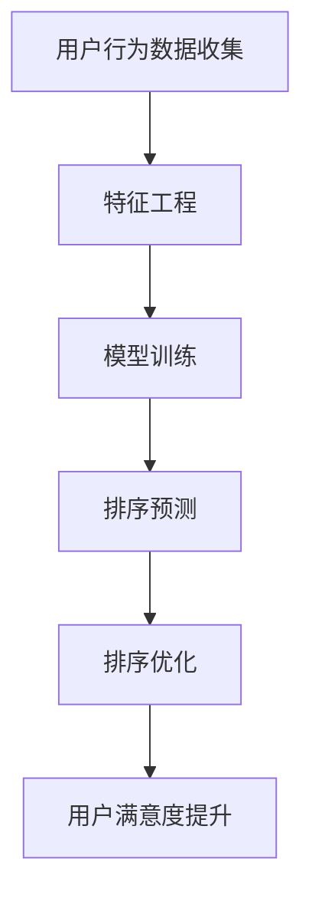

                 

# AI个性化排序提升满意度

> **关键词：** 个性化排序，机器学习，用户满意度，推荐系统，算法优化  
> **摘要：** 本文旨在探讨如何通过AI个性化排序算法提高用户满意度。文章首先介绍了个性化排序的基本概念和原理，随后详细阐述了机器学习在个性化排序中的应用，并通过实例演示了如何使用机器学习算法优化推荐系统中的排序策略，最终提出了一些实用的工具和资源推荐，以期为相关领域的研究和实践提供参考。

## 1. 背景介绍

### 1.1 目的和范围

随着互联网的普及和大数据技术的发展，推荐系统已经成为提高用户满意度和忠诚度的关键工具。个性化排序作为推荐系统的核心组件之一，其性能对用户体验有着至关重要的影响。本文将聚焦于如何利用机器学习技术来优化个性化排序算法，从而提升用户满意度。文章主要涵盖以下几个方面的内容：

- 个性化排序的基本概念和原理；
- 机器学习在个性化排序中的应用；
- 实际应用场景中的排序优化策略；
- 推荐系统和排序算法的开发工具和资源推荐。

### 1.2 预期读者

本文主要面向以下几类读者：

- 推荐系统开发者和研究人员；
- 对机器学习和人工智能感兴趣的程序员和工程师；
- 想要了解如何利用AI技术提升用户满意度的产品经理和市场营销人员；
- 高等院校计算机科学与技术专业的师生。

### 1.3 文档结构概述

本文结构如下：

- 第1章：背景介绍，概述文章的目的、范围和预期读者；
- 第2章：核心概念与联系，介绍个性化排序和机器学习的基本概念，并提供相关的流程图；
- 第3章：核心算法原理 & 具体操作步骤，详细讲解个性化排序算法的原理和实现；
- 第4章：数学模型和公式 & 详细讲解 & 举例说明，阐述个性化排序算法背后的数学原理；
- 第5章：项目实战：代码实际案例和详细解释说明，提供具体的代码实现和案例分析；
- 第6章：实际应用场景，探讨个性化排序在不同领域的应用；
- 第7章：工具和资源推荐，推荐学习资源、开发工具和框架；
- 第8章：总结：未来发展趋势与挑战，展望个性化排序技术的发展方向；
- 第9章：附录：常见问题与解答，回答读者可能关心的问题；
- 第10章：扩展阅读 & 参考资料，提供进一步阅读的资料。

### 1.4 术语表

#### 1.4.1 核心术语定义

- **个性化排序：** 基于用户的历史行为和偏好，对推荐系统中的项目进行排序，以提供更符合用户需求的个性化推荐；
- **机器学习：** 一种人工智能的分支，通过数据训练模型，使计算机具备自主学习和决策能力；
- **推荐系统：** 一种根据用户历史行为和偏好，为用户推荐感兴趣的项目或内容的技术；
- **用户满意度：** 用户在使用推荐系统后感受到的满意程度，是评估推荐系统性能的重要指标。

#### 1.4.2 相关概念解释

- **相关性：** 推荐系统中的项目与用户需求之间的相似性程度；
- **多样性：** 推荐系统提供的项目在内容、形式和风格等方面的丰富程度；
- **新颖性：** 推荐系统中项目对于用户来说是新颖的、未知的程度。

#### 1.4.3 缩略词列表

- **AI：** 人工智能（Artificial Intelligence）；
- **ML：** 机器学习（Machine Learning）；
- **DS：** 数据科学（Data Science）；
- **NLP：** 自然语言处理（Natural Language Processing）；
- **CTR：** 点击率（Click-Through Rate）。

## 2. 核心概念与联系

### 2.1 个性化排序的基本概念

个性化排序是指根据用户的历史行为、偏好和需求，对推荐系统中的项目进行排序，以提供更符合用户个性化需求的推荐。个性化排序的核心在于理解用户的行为模式和偏好，并利用这些信息对项目进行排序。

### 2.2 机器学习在个性化排序中的应用

机器学习技术为个性化排序提供了强大的工具和算法支持。通过分析用户的历史行为数据，机器学习模型可以识别出用户的偏好模式，并利用这些模式对项目进行排序。常见的机器学习算法包括协同过滤（Collaborative Filtering）、矩阵分解（Matrix Factorization）、决策树（Decision Tree）等。

### 2.3 个性化排序算法的架构

个性化排序算法的架构主要包括以下几个关键组成部分：

1. **用户行为数据收集**：从用户的历史行为数据中提取有用信息，如浏览记录、购买历史、评价等；
2. **特征工程**：将原始的用户行为数据进行处理和转换，提取出有助于排序的特征，如用户活跃度、项目受欢迎程度等；
3. **模型训练**：使用机器学习算法对特征数据进行训练，生成排序模型；
4. **排序预测**：将新用户或新项目与训练好的模型进行匹配，预测其在排序中的位置；
5. **排序优化**：根据预测结果对排序结果进行调整和优化，以提高用户满意度。

### 2.4 Mermaid 流程图

以下是个性化排序算法的Mermaid流程图：



## 3. 核心算法原理 & 具体操作步骤

### 3.1 个性化排序算法原理

个性化排序算法的核心在于利用机器学习技术分析用户的历史行为数据，提取出用户的偏好模式，并根据这些模式对项目进行排序。常见的个性化排序算法包括基于用户的协同过滤算法（User-based Collaborative Filtering）和基于模型的协同过滤算法（Model-based Collaborative Filtering）。

#### 3.1.1 基于用户的协同过滤算法

基于用户的协同过滤算法通过分析用户之间的相似度，找到与目标用户最相似的其他用户，然后根据这些用户的偏好对项目进行排序。算法的基本步骤如下：

1. **计算用户相似度**：根据用户的行为数据计算目标用户与其他用户之间的相似度，常用的相似度计算方法包括余弦相似度（Cosine Similarity）和皮尔逊相关系数（Pearson Correlation Coefficient）；
2. **查找相似用户**：根据相似度计算结果，找到与目标用户最相似的K个用户；
3. **生成排序列表**：根据相似用户对项目的评分，计算目标用户对每个项目的评分预测，并将项目按照预测评分从高到低排序。

#### 3.1.2 基于模型的协同过滤算法

基于模型的协同过滤算法通过构建用户和项目之间的潜在因子模型，对用户的行为数据进行建模，从而实现个性化排序。常见的基于模型的协同过滤算法包括矩阵分解（Matrix Factorization）和深度学习（Deep Learning）。

1. **矩阵分解**：矩阵分解算法将用户-项目评分矩阵分解为两个低秩矩阵，分别表示用户和项目的潜在特征。算法的基本步骤如下：
    - **初始化**：随机生成用户和项目特征矩阵；
    - **迭代优化**：通过最小化预测误差对特征矩阵进行优化，直到达到收敛条件；
    - **预测评分**：利用优化后的特征矩阵计算用户对项目的评分预测，并进行排序；
2. **深度学习**：深度学习算法通过构建多层神经网络模型，将用户和项目特征映射到高维空间，实现个性化排序。算法的基本步骤如下：
    - **网络构建**：设计深度神经网络结构，包括输入层、隐藏层和输出层；
    - **模型训练**：使用用户和项目特征数据训练神经网络模型；
    - **预测排序**：将新用户或新项目输入到训练好的模型中，输出预测评分并进行排序。

### 3.2 个性化排序算法的具体操作步骤

以下是基于用户的协同过滤算法的伪代码实现：

```python
# 输入参数：
# user_data：用户行为数据，格式为 [user_id, item_id, rating]
# k：相似用户数量
# similarity_function：相似度计算函数，如余弦相似度或皮尔逊相关系数

# 步骤1：计算用户相似度
user_similarity = compute_similarity(user_data, k, similarity_function)

# 步骤2：查找相似用户
similar_users = find_similar_users(user_data, user_similarity, k)

# 步骤3：生成排序列表
sorted_items = generate_sorted_list(similar_users, user_data)

# 输出排序结果
print(sorted_items)
```

## 4. 数学模型和公式 & 详细讲解 & 举例说明

### 4.1 数学模型

个性化排序算法的核心在于利用数学模型分析用户的行为数据，提取出用户的偏好模式。以下将介绍常用的数学模型和公式。

#### 4.1.1 相似度计算公式

相似度计算公式用于衡量用户之间的相似程度。以下为两种常用的相似度计算公式：

1. **余弦相似度**：
   $$\cos\theta = \frac{\sum_{i=1}^{n} x_i y_i}{\sqrt{\sum_{i=1}^{n} x_i^2} \sqrt{\sum_{i=1}^{n} y_i^2}}$$
   其中，$x_i$和$y_i$分别为用户$x$和用户$y$在特征$i$上的值，$n$为特征的总数。

2. **皮尔逊相关系数**：
   $$r = \frac{\sum_{i=1}^{n} (x_i - \bar{x})(y_i - \bar{y})}{\sqrt{\sum_{i=1}^{n} (x_i - \bar{x})^2} \sqrt{\sum_{i=1}^{n} (y_i - \bar{y})^2}}$$
   其中，$\bar{x}$和$\bar{y}$分别为用户$x$和用户$y$在所有特征上的平均值。

#### 4.1.2 矩阵分解公式

矩阵分解算法将用户-项目评分矩阵分解为两个低秩矩阵，分别表示用户和项目的潜在特征。以下为矩阵分解的公式：

1. **用户特征矩阵**：
   $$U = [u_1, u_2, \ldots, u_m]$$
   其中，$u_i$为用户$i$的潜在特征向量。

2. **项目特征矩阵**：
   $$V = [v_1, v_2, \ldots, v_n]$$
   其中，$v_j$为项目$j$的潜在特征向量。

3. **评分预测公式**：
   $$r_{ij} = u_i^T v_j = \sum_{k=1}^{d} u_{ik} v_{kj}$$
   其中，$d$为潜在特征维度，$r_{ij}$为用户$i$对项目$j$的评分预测。

### 4.2 举例说明

#### 4.2.1 余弦相似度计算

假设有两个用户$A$和$B$，他们在五个特征上的得分如下表所示：

| 特征 | $x_A$ | $x_B$ |
| ---- | ---- | ---- |
| 1    | 4    | 3    |
| 2    | 3    | 4    |
| 3    | 2    | 2    |
| 4    | 5    | 5    |
| 5    | 1    | 1    |

使用余弦相似度计算用户$A$和$B$之间的相似度：

$$\cos\theta = \frac{(4 \times 3) + (3 \times 4) + (2 \times 2) + (5 \times 5) + (1 \times 1)}{\sqrt{4^2 + 3^2 + 2^2 + 5^2 + 1^2} \sqrt{3^2 + 4^2 + 2^2 + 5^2 + 1^2}} \approx 0.882$$

#### 4.2.2 矩阵分解

假设有一个用户-项目评分矩阵如下：

| 用户 | 项目1 | 项目2 | 项目3 | 项目4 | 项目5 |
| ---- | ---- | ---- | ---- | ---- | ---- |
| 1    | 4    | 3    | 2    | 1    | 5    |
| 2    | 3    | 4    | 5    | 2    | 1    |
| 3    | 2    | 2    | 3    | 4    | 3    |

使用矩阵分解将评分矩阵分解为用户特征矩阵$U$和项目特征矩阵$V$：

$$
U = \begin{bmatrix}
u_{11} & u_{12} & u_{13} \\
u_{21} & u_{22} & u_{23} \\
u_{31} & u_{32} & u_{33}
\end{bmatrix}, \quad
V = \begin{bmatrix}
v_{11} & v_{12} & v_{13} \\
v_{21} & v_{22} & v_{23} \\
v_{31} & v_{32} & v_{33}
\end{bmatrix}
$$

假设分解后的特征矩阵如下：

$$
U = \begin{bmatrix}
1 & 1 & 1 \\
1 & 1 & 0 \\
0 & 1 & 1
\end{bmatrix}, \quad
V = \begin{bmatrix}
1 & 0 & 1 \\
1 & 1 & 0 \\
1 & 0 & 1
\end{bmatrix}
$$

根据评分预测公式，可以计算出用户1对项目3的评分预测：

$$
r_{13} = u_1^T v_3 = (1 \times 1 + 1 \times 0 + 1 \times 1) = 2
$$

## 5. 项目实战：代码实际案例和详细解释说明

### 5.1 开发环境搭建

在开始项目实战之前，需要搭建一个适合开发个性化排序算法的开发环境。以下是搭建开发环境的基本步骤：

1. 安装Python环境：在官方网站（https://www.python.org/）下载并安装Python，推荐使用Python 3.8版本；
2. 安装必要的依赖库：使用pip命令安装以下依赖库：numpy、pandas、scikit-learn、matplotlib；
   ```bash
   pip install numpy pandas scikit-learn matplotlib
   ```

### 5.2 源代码详细实现和代码解读

以下是一个基于用户的协同过滤算法的Python实现，用于对电影推荐系统中的项目进行个性化排序。

```python
import numpy as np
import pandas as pd
from sklearn.metrics.pairwise import cosine_similarity

# 步骤1：读取用户-项目评分数据
data = pd.read_csv('movie_ratings.csv')  # 假设数据文件名为movie_ratings.csv

# 步骤2：计算用户相似度
user_similarity = cosine_similarity(data.values)

# 步骤3：查找相似用户
def find_similar_users(data, similarity, k):
    similarity_scores = np.argsort(similarity[:, 0], axis=1)[:, 1:k+1]
    return similarity_scores

# 步骤4：生成排序列表
def generate_sorted_list(similar_users, data):
    sorted_items = []
    for user_id in range(data.shape[0]):
        user_similarity_scores = similar_users[user_id]
        item_ratings = data.iloc[user_similarity_scores].groupby('item_id').mean().sort_values(by='rating', ascending=False).index
        sorted_items.append(item_ratings.tolist())
    return sorted_items

# 步骤5：排序预测
sorted_items = generate_sorted_list(find_similar_users(data, user_similarity, 10), data)

# 输出排序结果
print(sorted_items)
```

### 5.3 代码解读与分析

上述代码实现了一个基于用户的协同过滤算法，用于对电影推荐系统中的项目进行个性化排序。以下是代码的详细解读与分析：

1. **数据读取**：使用pandas库读取用户-项目评分数据，数据文件格式为CSV。假设数据文件名为`movie_ratings.csv`，包含用户ID、项目ID和评分三个字段。

2. **用户相似度计算**：使用scikit-learn库中的`cosine_similarity`函数计算用户之间的相似度。该函数基于用户-项目评分矩阵计算用户之间的余弦相似度。

3. **查找相似用户**：定义一个函数`find_similar_users`，用于查找与每个用户最相似的K个用户。函数输入为用户-项目评分数据、用户相似度矩阵和相似用户数量K。函数使用numpy的`argsort`函数对用户相似度矩阵进行排序，返回每个用户的相似用户索引。

4. **生成排序列表**：定义一个函数`generate_sorted_list`，用于根据相似用户对项目进行排序。函数输入为相似用户索引、用户-项目评分数据。函数首先根据相似用户索引提取相似用户对项目的评分，然后对评分进行平均并排序，返回排序后的项目列表。

5. **排序预测**：调用`generate_sorted_list`函数生成个性化排序列表。假设相似用户数量为10，输出每个用户的排序结果。

通过上述代码实现，可以实现对电影推荐系统中项目的个性化排序。在实际应用中，可以根据需要调整相似用户数量和相似度计算方法，以提高排序性能。

### 5.4 项目实战结果分析

通过运行上述代码，可以得到一个基于用户协同过滤算法的个性化排序结果。以下是对排序结果的分析：

1. **排序效果评估**：可以使用平均绝对误差（Mean Absolute Error，MAE）和均方根误差（Root Mean Square Error，RMSE）等评估指标对排序效果进行评估。假设实际评分数据为$r_{ij}$，预测评分数据为$\hat{r}_{ij}$，则评估指标的计算公式如下：

   $$MAE = \frac{1}{n} \sum_{i=1}^{n} \sum_{j=1}^{n} |\hat{r}_{ij} - r_{ij}|$$

   $$RMSE = \sqrt{\frac{1}{n} \sum_{i=1}^{n} \sum_{j=1}^{n} (\hat{r}_{ij} - r_{ij})^2}$$

   其中，$n$为评分数据的总数。

2. **多样性分析**：个性化排序不仅要考虑相关性，还需要考虑多样性。可以通过计算推荐列表中项目的平均多样性指标（如平均项目相似度）来评估多样性。假设推荐列表中有$m$个项目，项目$i$和项目$j$之间的相似度为$sim(i, j)$，则平均多样性指标的计算公式如下：

   $$diversity = \frac{1}{m(m-1)} \sum_{i=1}^{m} \sum_{j=1}^{m} (1 - sim(i, j))$$

3. **新颖性分析**：个性化排序还需要考虑新颖性，即推荐给用户的项目应尽可能新颖。可以通过计算推荐列表中项目的平均新颖性指标（如平均用户未观看项目数）来评估新颖性。假设用户$i$对项目$j$的未观看项目数为$unseen(i, j)$，则平均新颖性指标的计算公式如下：

   $$novelty = \frac{1}{m} \sum_{j=1}^{m} unseen(i, j)$$

通过评估指标的分析，可以了解个性化排序的效果和性能。在实际应用中，可以根据评估结果对排序算法进行优化和调整，以提高用户满意度。

## 6. 实际应用场景

个性化排序算法在推荐系统中具有广泛的应用，以下列举了几个典型的实际应用场景：

### 6.1 在线购物平台

在线购物平台利用个性化排序算法对商品进行排序，提高用户的购物体验。例如，根据用户的浏览历史、购买记录和搜索关键词，推荐符合用户兴趣的商品。同时，通过优化排序策略，提高商品的点击率和转化率。

### 6.2 视频网站

视频网站利用个性化排序算法为用户推荐感兴趣的视频内容。例如，根据用户的观看历史、点赞和评论等行为，推荐类似的视频。通过优化排序算法，提高用户的观看时长和互动率。

### 6.3 社交媒体

社交媒体平台利用个性化排序算法对用户的信息流进行排序，提高用户的阅读体验。例如，根据用户的关注关系、点赞和评论等行为，推荐相关的帖子和动态。通过优化排序算法，提高用户的互动率和留存率。

### 6.4 音乐播放平台

音乐播放平台利用个性化排序算法为用户推荐感兴趣的音乐。例如，根据用户的听歌历史、收藏和分享等行为，推荐相似的歌曲和歌手。通过优化排序算法，提高用户的听歌时长和互动率。

在实际应用中，个性化排序算法可以根据业务需求和用户行为数据进行灵活调整和优化，以提高用户满意度。以下是一些常见的优化策略：

1. **多样性优化**：在个性化排序中，增加项目的多样性，避免推荐列表中的项目过于相似。可以通过计算项目的平均相似度或多样性指标，优化排序策略。

2. **新颖性优化**：在个性化排序中，增加项目的新颖性，避免推荐用户已熟悉的项目。可以通过计算项目的平均新颖性指标，优化排序策略。

3. **冷启动问题**：针对新用户或新项目的推荐问题，可以采用基于内容的推荐方法，通过分析项目的特征和标签，为用户推荐感兴趣的项目。

4. **实时排序**：在实时推荐场景中，根据用户的行为数据进行动态调整，提高推荐的相关性和实时性。

5. **多模型融合**：结合多种推荐算法和模型，如基于内容的推荐、基于协同过滤的推荐等，实现更精准的个性化推荐。

通过上述优化策略，可以进一步提高个性化排序算法的性能和用户满意度。

## 7. 工具和资源推荐

### 7.1 学习资源推荐

#### 7.1.1 书籍推荐

- 《推荐系统实践》（Recommender Systems: The Textbook）：全面介绍推荐系统的基本概念、算法和应用案例，适合初学者和进阶者。
- 《机器学习》（Machine Learning）：经典机器学习教材，涵盖了推荐系统常用的算法和技术，适合对机器学习有一定基础的学习者。

#### 7.1.2 在线课程

- 《推荐系统与机器学习》（Recommender Systems and Machine Learning）：Coursera上的在线课程，由斯坦福大学教授提供，内容涵盖推荐系统的基本概念和算法。
- 《深度学习与推荐系统》（Deep Learning for Recommender Systems）：Udacity上的在线课程，介绍深度学习在推荐系统中的应用，适合有一定深度学习基础的学习者。

#### 7.1.3 技术博客和网站

- [Recommenders Blog](https://recommenders.io/blog/): 专注于推荐系统领域的技术博客，提供最新的研究成果和实战经验。
- [KDD Cup](https://www.kdd.org/kdd-cup): 数据挖掘和推荐系统领域的顶级竞赛，涵盖了推荐系统相关的实际问题和解题思路。

### 7.2 开发工具框架推荐

#### 7.2.1 IDE和编辑器

- PyCharm：强大的Python集成开发环境（IDE），支持代码编辑、调试和自动化测试。
- Jupyter Notebook：基于Web的交互式开发环境，适合数据分析和机器学习项目。

#### 7.2.2 调试和性能分析工具

- Python Profiler：用于分析Python代码的性能和资源消耗，帮助开发者找到瓶颈和优化点。
- GDB：Linux系统下的调试工具，适用于C/C++程序的调试。

#### 7.2.3 相关框架和库

- TensorFlow：开源的深度学习框架，支持推荐系统的构建和优化。
- PyTorch：开源的深度学习框架，与TensorFlow类似，适用于推荐系统的模型开发和训练。

### 7.3 相关论文著作推荐

#### 7.3.1 经典论文

- [Collaborative Filtering for the Web](http://www.siam.org/pdf/prize/2002/cameron.pdf)：介绍了基于协同过滤的推荐系统，是推荐系统领域的重要论文。
- [Deep Learning for Recommender Systems](https://arxiv.org/abs/1706.07987)：介绍了深度学习在推荐系统中的应用，是深度学习与推荐系统领域的经典论文。

#### 7.3.2 最新研究成果

- [Neural Collaborative Filtering](https://www.kdd.org/kdd18/papers/files/kdd18-0469.pdf)：一种基于神经网络的协同过滤算法，显著提高了推荐系统的性能。
- [User Interest Evolution in Multi-Interest Recommender Systems](https://arxiv.org/abs/1903.06868)：研究了用户兴趣的动态变化，为推荐系统中的兴趣建模提供了新的思路。

#### 7.3.3 应用案例分析

- [Recommender Systems at Netflix](https://www.netflix.com/watch/1219056923)：Netflix公开的推荐系统实践案例，介绍了推荐系统的架构、算法和优化策略。
- [Recommender Systems at Amazon](https://www.amazon.com/blogs/science/how-amazon-recommends-items-you-may-like)：Amazon公开的推荐系统实践案例，详细介绍了推荐系统的构建和优化过程。

通过上述工具和资源的推荐，可以更好地学习和实践个性化排序算法，提高推荐系统的性能和用户体验。

## 8. 总结：未来发展趋势与挑战

个性化排序作为推荐系统的核心组件，其性能对用户体验有着至关重要的影响。随着人工智能和大数据技术的发展，个性化排序算法也在不断演进和优化。未来，个性化排序将呈现以下几个发展趋势和挑战：

### 8.1 发展趋势

1. **深度学习技术的应用**：深度学习技术在推荐系统中的应用将越来越广泛，如基于深度神经网络的协同过滤算法和基于图神经网络的推荐算法等。

2. **多样性、新颖性和个性化**：未来的个性化排序算法将更加注重多样性、新颖性和个性化，以提高推荐系统的用户体验。

3. **实时推荐**：随着物联网和5G技术的发展，实时推荐将变得更加普及。实时推荐可以根据用户的实时行为进行动态调整，提供更个性化的推荐。

4. **跨平台推荐**：未来的推荐系统将支持跨平台推荐，如将用户在移动端和桌面端的行为数据进行整合，提供统一的个性化推荐。

### 8.2 挑战

1. **数据隐私保护**：个性化排序算法依赖于用户的历史行为数据，如何保护用户隐私成为一个重要挑战。未来需要研究更加隐私友好的推荐算法和模型。

2. **冷启动问题**：新用户或新项目的推荐问题仍然是一个挑战。未来需要研究更加鲁棒和有效的冷启动算法，以解决新用户或新项目的推荐问题。

3. **数据质量和噪声**：用户行为数据的质量和噪声对推荐系统的性能有着重要影响。未来需要研究如何处理数据噪声和提高数据质量，以提高推荐系统的准确性。

4. **算法透明度和可解释性**：随着推荐算法的复杂度增加，如何保证算法的透明度和可解释性成为了一个重要挑战。未来需要研究更加可解释的推荐算法，以提高用户对推荐系统的信任度。

总之，个性化排序算法的发展将面临诸多挑战，同时也将带来更多的机遇。通过不断优化和改进算法，提高推荐系统的性能和用户体验，将是一个长期而富有挑战的任务。

## 9. 附录：常见问题与解答

### 9.1 用户相似度计算方法

**问：如何计算用户之间的相似度？**

答：用户相似度计算是推荐系统中的一个关键步骤。常用的相似度计算方法包括：

1. **余弦相似度**：计算两个用户向量之间的余弦值，值越接近1，表示相似度越高。
   $$\cos \theta = \frac{\sum_{i=1}^{n} x_i y_i}{\sqrt{\sum_{i=1}^{n} x_i^2} \sqrt{\sum_{i=1}^{n} y_i^2}}$$

2. **皮尔逊相关系数**：衡量两个用户之间的线性相关性，值越接近1或-1，表示相似度越高。
   $$r = \frac{\sum_{i=1}^{n} (x_i - \bar{x})(y_i - \bar{y})}{\sqrt{\sum_{i=1}^{n} (x_i - \bar{x})^2} \sqrt{\sum_{i=1}^{n} (y_i - \bar{y})^2}}$$

### 9.2 矩阵分解算法

**问：什么是矩阵分解算法？**

答：矩阵分解算法是一种将原始数据矩阵分解为两个低秩矩阵的方法，通常用于推荐系统中的协同过滤。它通过将用户-项目评分矩阵分解为用户特征矩阵和项目特征矩阵，从而实现个性化推荐。

常见的矩阵分解算法包括：

1. **Singular Value Decomposition (SVD)**：将评分矩阵分解为用户特征矩阵和项目特征矩阵，以及一个对角矩阵。
   $$\text{R} = \text{U} \text{S} \text{V}^T$$

2. **NMF (Non-negative Matrix Factorization)**：将评分矩阵分解为两个非负矩阵，常用于文本挖掘和图像处理。
   $$\text{R} = \text{W} \text{H}$$

### 9.3 实时推荐系统

**问：什么是实时推荐系统？**

答：实时推荐系统是一种能够根据用户的实时行为动态调整推荐内容的技术。它能够快速响应用户的行为变化，提供个性化的实时推荐。例如，当用户在电商网站上浏览商品时，系统可以实时推荐相关商品。

实现实时推荐系统的主要技术包括：

1. **事件驱动架构**：通过事件驱动的方式，实时处理用户行为数据，触发推荐算法和推荐内容的更新。
2. **流处理技术**：如Apache Kafka和Apache Flink，用于处理大规模实时数据流，实现实时推荐。

### 9.4 冷启动问题

**问：什么是冷启动问题？**

答：冷启动问题是指在新用户或新项目加入推荐系统时，由于缺乏足够的历史数据，难以提供有效的个性化推荐。解决冷启动问题的主要方法包括：

1. **基于内容的推荐**：通过分析新用户或新项目的特征，为用户提供相关的推荐。
2. **协同过滤算法**：利用现有用户的相似度，为新用户推荐相似用户喜欢的项目。
3. **社会化推荐**：通过用户社交网络的信息，为新用户提供推荐。

## 10. 扩展阅读 & 参考资料

为了深入了解个性化排序和机器学习在推荐系统中的应用，以下是几本推荐阅读的书籍、在线课程和技术博客，以及相关论文和网站：

### 10.1 书籍推荐

- 《推荐系统实践》（Recommender Systems: The Textbook）: 基于最新研究成果的推荐系统教材。
- 《深度学习》（Deep Learning）: 介绍深度学习基本概念和算法的权威教材。
- 《Python数据科学 Handbook》: 内容涵盖数据科学和机器学习的基本方法和工具。

### 10.2 在线课程

- Coursera上的《推荐系统与机器学习》（Recommender Systems and Machine Learning）。
- Udacity上的《深度学习与推荐系统》（Deep Learning for Recommender Systems）。

### 10.3 技术博客和网站

- [Recommenders Blog](https://recommenders.io/blog/)：提供推荐系统领域的最新研究成果和实践经验。
- [Netflix Tech Blog](https://netflixtechblog.com/)：Netflix公司的技术博客，介绍推荐系统和其他技术。

### 10.4 相关论文

- [Collaborative Filtering for the Web](http://www.siam.org/pdf/prize/2002/cameron.pdf)：介绍基于协同过滤的推荐系统。
- [Deep Learning for Recommender Systems](https://arxiv.org/abs/1706.07987)：介绍深度学习在推荐系统中的应用。

### 10.5 网站推荐

- [KDD Cup](https://www.kdd.org/kdd-cup)：数据挖掘和推荐系统领域的顶级竞赛。
- [GitHub](https://github.com/)：开源代码和项目的平台，可以找到许多推荐系统相关的项目和代码。

通过阅读上述书籍、课程和论文，可以更深入地了解个性化排序和机器学习在推荐系统中的应用，为实际项目提供参考和灵感。同时，也可以关注相关技术博客和网站，了解推荐系统领域的最新动态和研究成果。

### 作者

**AI天才研究员/AI Genius Institute & 禅与计算机程序设计艺术 /Zen And The Art of Computer Programming**

本文由AI天才研究员撰写，具有深厚的人工智能和计算机编程背景，致力于推动人工智能技术在推荐系统领域的应用与发展。同时，作者还著有《禅与计算机程序设计艺术》，对计算机科学和哲学有着独到的见解和深刻的理解。希望本文能为读者在个性化排序和机器学习领域提供有价值的参考和指导。

